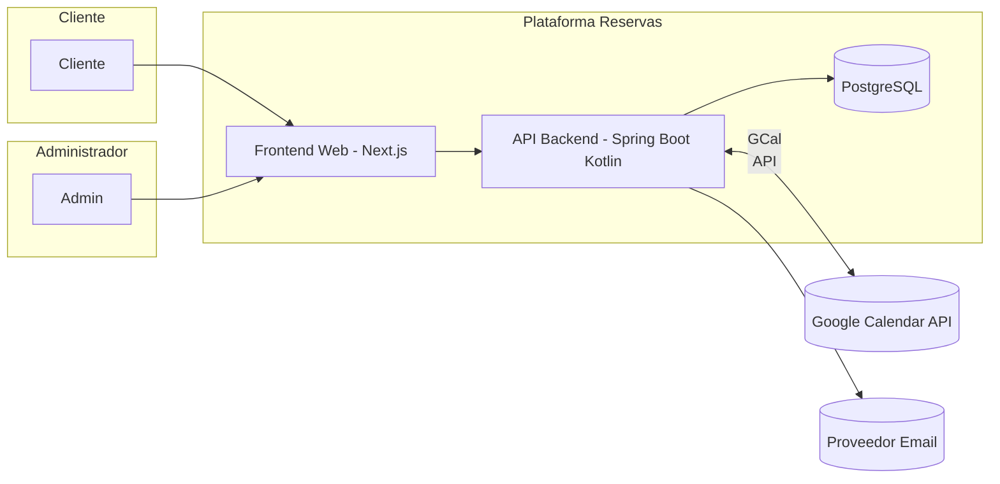
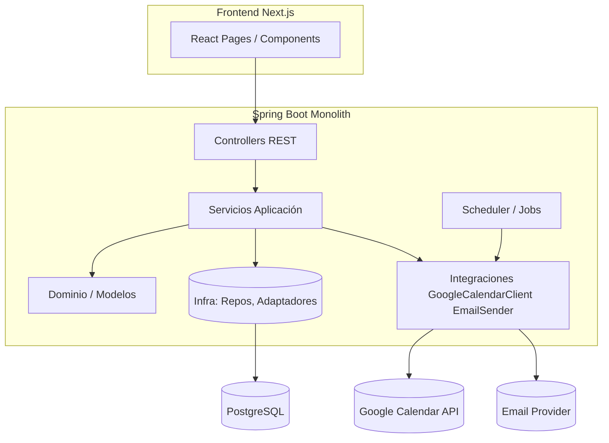

# Arquitectura (C4 Nivel 1 y 2 Simplificado)

## Nivel 1: Contexto del Sistema

## Nivel 2: Contenedores (Detalle Backend)

## Notas
- App Services orquestan reglas y coordinan dominio + infra.
- Controllers solo validan entrada/salida (DTO mapping).
- Jobs disparan sincronizaciones periódicas.
