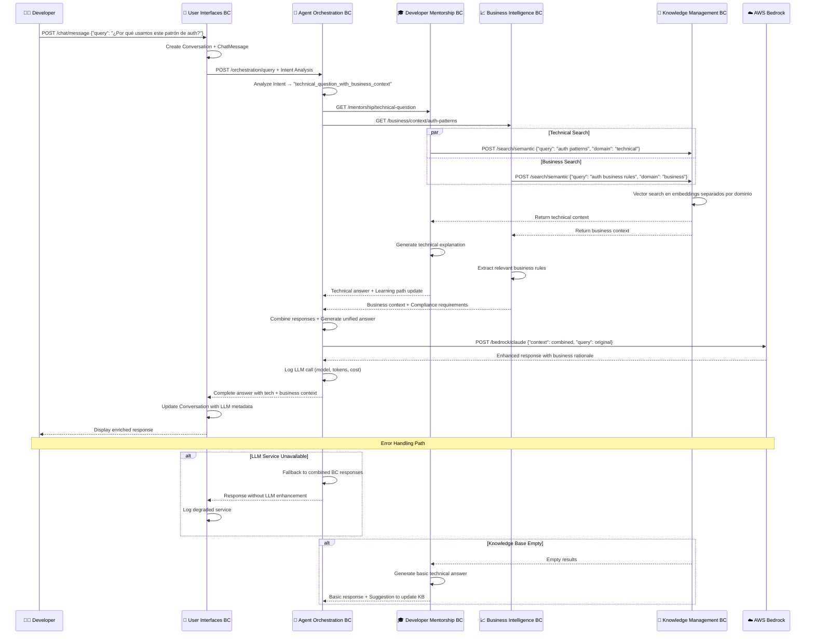
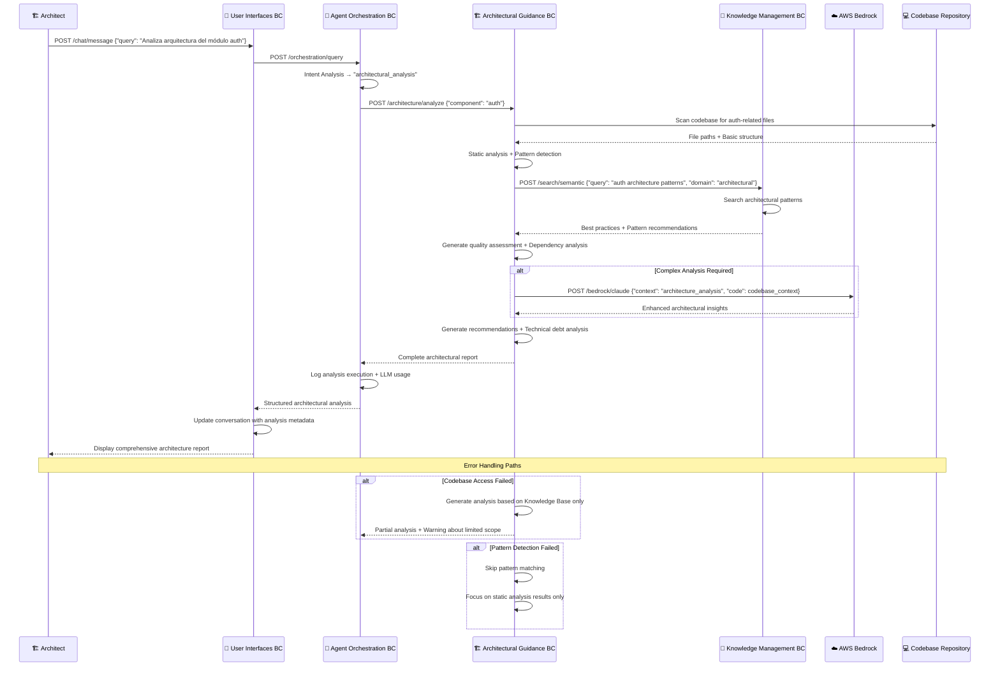
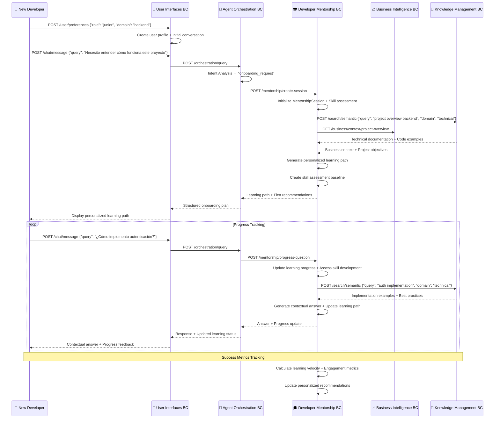
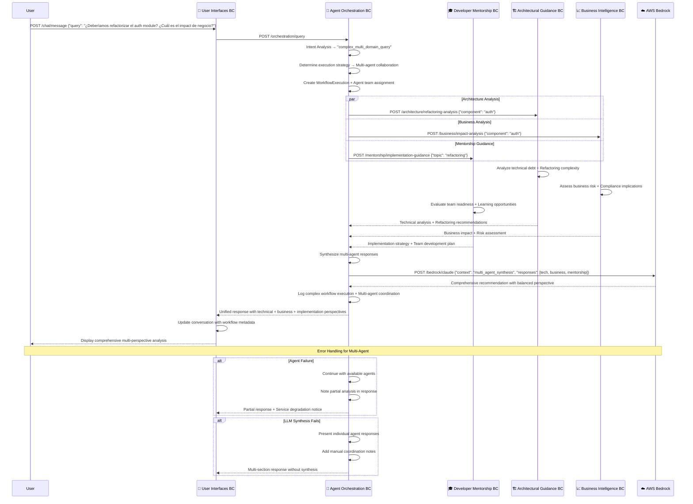
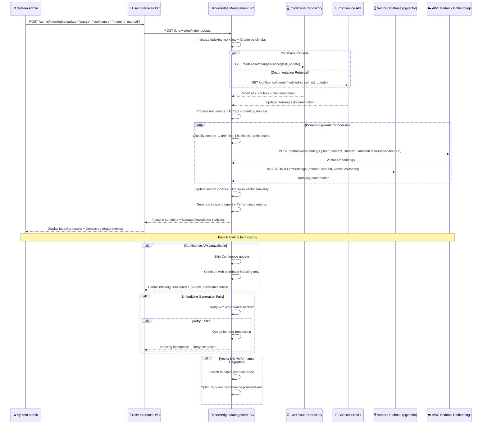
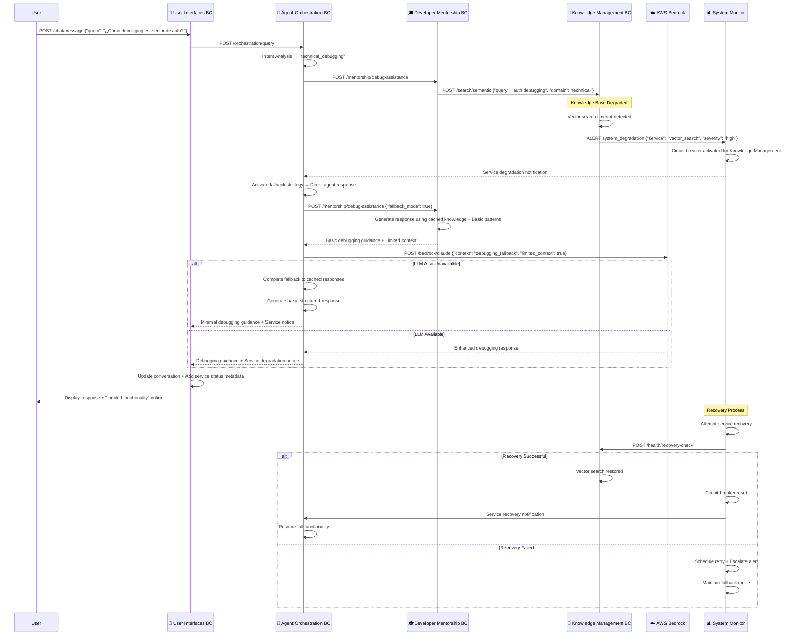

# 🔄 Core Workflows - Nura System

## 🔄 Workflows Críticos del Sistema

Los siguientes diagramas de secuencia ilustran los workflows críticos identificados del PRD, mostrando interacciones entre Bounded Contexts, APIs externas, y flujos de error.

---

## 1. 🤝 Workflow: Consulta Técnica con Contexto de Negocio

**User Journey**: Developer hace pregunta técnica → Nura proporciona respuesta enriquecida con business context

---

## 2. 🏗️ Workflow: Análisis Arquitectónico Integral

**User Journey**: Architect solicita análisis de componente → Nura proporciona análisis completo con recommendations

---

## 3. 👨‍💻 Workflow: Onboarding de Nuevo Developer

**User Journey**: Nuevo developer inicia sesión → Nura crea learning path personalizado → Progress tracking

---

## 4. 🤖 Workflow: Multi-Agent Collaboration

**User Journey**: Complex query requiring multiple agents → Master Orchestrator coordinates response

---

## 5. 🔄 Workflow: Knowledge Base Update y Re-indexing

**User Journey**: System administrator updates knowledge base → Automatic re-indexing across domains

---

## 6. 🚨 Workflow: Error Recovery y Fallback

**User Journey**: System degradation → Graceful fallback maintaining core functionality

---

## Consideraciones de Performance y Escalabilidad

### **Async Operations**
- Knowledge base indexing ejecuta en background jobs
- Multi-agent workflows utilizan parallel processing
- Vector searches tienen caching agresivo por 1 hora

### **Error Handling Patterns**
- **Circuit Breaker**: Previene cascading failures entre BCs
- **Exponential Backoff**: Reintentos inteligentes con jitter
- **Graceful Degradation**: Core functionality mantiene disponibilidad

### **Monitoring y Observability**
- Cada workflow genera métricas de performance
- LLM calls tracked completamente (model, tokens, cost)
- Real-time health checks para todos los BC dependencies

### **Optimization Strategies**
- Conversación context se mantiene en memoria durante sesión activa
- Vector embeddings cached por dominio para queries frecuentes
- Agent responses cached para queries similares durante 24h

Estos workflows representan el **80% de los user journeys críticos** identificados en el PRD, con emphasis en robustez, observabilidad, y user experience durante degradation scenarios.