# 🗄️ Data Architecture - Nura System

## 🗄️ Arquitectura de Datos y RAG Pipeline

**Data Philosophy**: Data-driven AI con Advanced RAG utilizando Late Chunking + Contextual Retrieval para máxima precisión en respuestas técnicas y contexto empresarial.

**Core Components**:
- **Advanced RAG Pipeline**: Late Chunking + Contextual Retrieval + Multi-domain embeddings
- **Vector Database**: PostgreSQL + pgvector con path de migración a Qdrant
- **Domain-Specific Embeddings**: Separación por contexto técnico vs empresarial
- **Real-time Data Processing**: Streaming ingestion con Apache Kafka
- **Data Lineage**: Tracking completo de transformaciones y lineage

---

## 🔄 Data Flow Architecture Overview

```mermaid
graph TB
    subgraph "Data Sources"
        DOCS[📄 Technical Documentation]
        CODE[💻 Code Repositories]
        BIZ[📊 Business Rules & Policies]
        CONV[💬 Conversation History]
        EXT[🌐 External APIs & Knowledge]
    end
    
    subgraph "Data Ingestion Layer"
        KAFKA[⚡ Apache Kafka Streams]
        CONNECTORS[🔗 Source Connectors<br/>GitHub, Confluence, Slack]
        WEBHOOKS[🎣 Webhook Listeners<br/>Real-time Updates]
    end
    
    subgraph "Advanced RAG Pipeline"
        CHUNK[🔄 Late Chunking Engine<br/>Context-Aware Splitting]
        CONTEXT[🎯 Contextual Retrieval<br/>BM25 + Semantic]
        EMBED[🤖 Multi-Domain Embeddings<br/>Technical + Business]
        RERANK[📊 Re-ranking Pipeline<br/>Cross-Encoder Models]
    end
    
    subgraph "Vector Storage"
        PGVECTOR[🗄️ PostgreSQL + pgvector<br/>Technical Embeddings]
        QDRANT[🎯 Qdrant Vector DB<br/>Business Context]
        CACHE[⚡ Redis Vector Cache<br/>Frequently Accessed]
    end
    
    subgraph "Query Processing"
        ROUTER[🔄 Query Router<br/>Intent Classification]
        HYBRID[🔍 Hybrid Search<br/>Vector + Text + Graph]
        FUSION[🤝 Result Fusion<br/>Reciprocal Rank Fusion]
    end
    
    subgraph "LLM Integration"
        BEDROCK[☁️ AWS Bedrock Models<br/>Claude-3, Llama-2]
        CONTEXT_BUILDER[🏗️ Context Builder<br/>RAG + Conversation History]
        RESPONSE[💬 Response Generator<br/>Grounded Answers]
    end
    
    DOCS --> KAFKA
    CODE --> CONNECTORS
    BIZ --> WEBHOOKS
    CONV --> KAFKA
    
    KAFKA --> CHUNK
    CONNECTORS --> CHUNK
    WEBHOOKS --> CONTEXT
    
    CHUNK --> EMBED
    CONTEXT --> EMBED
    EMBED --> PGVECTOR
    EMBED --> QDRANT
    EMBED --> CACHE
    
    ROUTER --> HYBRID
    HYBRID --> PGVECTOR
    HYBRID --> QDRANT
    HYBRID --> CACHE
    
    PGVECTOR --> FUSION
    QDRANT --> FUSION
    CACHE --> FUSION
    
    FUSION --> RERANK
    RERANK --> CONTEXT_BUILDER
    CONTEXT_BUILDER --> BEDROCK
    BEDROCK --> RESPONSE
```



---

## 🤖 Advanced RAG Pipeline Implementation

### 🔄 Late Chunking Engine

**Late Chunking** es una técnica avanzada que mejora la precisión del RAG al mantener el contexto semántico durante el proceso de chunking.

```python
# src/backend/nura-core/src/data/late_chunking_engine.py
import re
import nltk
from typing import List, Dict, Any, Optional, Tuple
from dataclasses import dataclass
from sentence_transformers import SentenceTransformer
import numpy as np
from sklearn.metrics.pairwise import cosine_similarity
import spacy
import logging

logger = logging.getLogger(__name__)

@dataclass
class ChunkMetadata:
    """Metadata para cada chunk generado"""
    chunk_id: str
    source_document_id: str
    start_position: int
    end_position: int
    chunk_type: str  # 'paragraph', 'code_block', 'list', 'header'
    semantic_density: float
    context_window: str  # Contexto semántico del chunk
    parent_section: Optional[str] = None
    related_chunks: List[str] = None
    domain: str = "technical"  # 'technical', 'business', 'mixed'

@dataclass
class ContextualChunk:
    """Chunk enriquecido con contexto semántico"""
    content: str
    metadata: ChunkMetadata
    embedding: Optional[np.ndarray] = None
    contextual_embedding: Optional[np.ndarray] = None
    semantic_keywords: List[str] = None
    relevance_score: float = 0.0

class LateChunkingEngine:
    """
    Advanced Late Chunking Engine que mantiene contexto semántico
    durante el proceso de chunking para mejorar RAG performance.
    """
    
    def __init__(self):
        self.embedding_model = SentenceTransformer('all-MiniLM-L6-v2')
        self.contextual_model = SentenceTransformer('sentence-transformers/all-mpnet-base-v2')
        self.nlp = spacy.load("en_core_web_sm")
        
        # Configuración de chunking
        self.min_chunk_size = 100
        self.max_chunk_size = 1000
        self.overlap_size = 50
        self.semantic_threshold = 0.75
        
        # Patrones específicos para documentos técnicos
        self.code_patterns = [
            r'```[\s\S]*?```',  # Code blocks
            r'`[^`]+`',         # Inline code
            r'^\s*```\w*\n',    # Code block start
        ]
        
        self.structure_patterns = {
            'header': r'^#{1,6}\s+.+$',
            'list_item': r'^\s*[-*+]\s+.+$',
            'numbered_list': r'^\s*\d+\.\s+.+$',
            'api_endpoint': r'(GET|POST|PUT|DELETE|PATCH)\s+/[\w/]+',
            'function_def': r'(def|function|class)\s+\w+\s*\(',
            'config_key': r'^\w+:\s*.+$'
        }
    
    async def process_document(self, document: str, document_id: str, domain: str = "technical") -> List[ContextualChunk]:
        """
        Procesar documento completo con Late Chunking
        """
        logger.info(f"Processing document {document_id} with Late Chunking")
        
        try:
            # 1. Pre-processing: Detectar estructura del documento
            document_structure = self._analyze_document_structure(document)
            
            # 2. Segmentación semántica inicial
            semantic_segments = self._semantic_segmentation(document, document_structure)
            
            # 3. Late Chunking con contexto preservado
            contextual_chunks = []
            for i, segment in enumerate(semantic_segments):
                chunks = await self._late_chunk_segment(
                    segment, 
                    document_id, 
                    i, 
                    domain,
                    context_window=self._get_context_window(semantic_segments, i)
                )
                contextual_chunks.extend(chunks)
            
            # 4. Enriquecimiento con embeddings contextuales
            enriched_chunks = await self._enrich_with_contextual_embeddings(contextual_chunks)
            
            # 5. Post-processing: Optimización y validación
            optimized_chunks = self._optimize_chunks(enriched_chunks)
            
            logger.info(f"Generated {len(optimized_chunks)} contextual chunks for document {document_id}")
            return optimized_chunks
            
        except Exception as e:
            logger.error(f"Error processing document {document_id}: {str(e)}")
            raise
    
    def _analyze_document_structure(self, document: str) -> Dict[str, Any]:
        """Analizar estructura del documento para optimizar chunking"""
        structure = {
            'headers': [],
            'code_blocks': [],
            'lists': [],
            'paragraphs': [],
            'api_endpoints': [],
            'total_length': len(document)
        }
        
        lines = document.split('\n')
        current_position = 0
        
        for line_num, line in enumerate(lines):
            line_start = current_position
            line_end = current_position + len(line)
            
            # Detectar headers
            if re.match(self.structure_patterns['header'], line):
                level = len(re.match(r'^#+', line).group(0))
                structure['headers'].append({
                    'level': level,
                    'text': line.strip('# ').strip(),
                    'position': line_start,
                    'line_num': line_num
                })
            
            # Detectar API endpoints
            if re.search(self.structure_patterns['api_endpoint'], line):
                structure['api_endpoints'].append({
                    'endpoint': line.strip(),
                    'position': line_start,
                    'line_num': line_num
                })
            
            # Detectar code blocks
            if '```' in line:
                structure['code_blocks'].append({
                    'position': line_start,
                    'line_num': line_num,
                    'type': 'code_boundary'
                })
            
            current_position = line_end + 1  # +1 for newline
        
        return structure
    
    def _semantic_segmentation(self, document: str, structure: Dict[str, Any]) -> List[Dict[str, Any]]:
        """Segmentación semántica basada en estructura del documento"""
        segments = []
        headers = structure['headers']
        
        if not headers:
            # Si no hay headers, segmentar por párrafos
            paragraphs = document.split('\n\n')
            for i, para in enumerate(paragraphs):
                if para.strip():
                    segments.append({
                        'content': para.strip(),
                        'type': 'paragraph',
                        'section': f"section_{i}",
                        'start_pos': 0,  # Simplified for this example
                        'end_pos': len(para)
                    })
        else:
            # Segmentar por secciones basadas en headers
            document_lines = document.split('\n')
            
            for i, header in enumerate(headers):
                start_line = header['line_num']
                end_line = headers[i + 1]['line_num'] if i + 1 < len(headers) else len(document_lines)
                
                section_content = '\n'.join(document_lines[start_line:end_line])
                
                segments.append({
                    'content': section_content.strip(),
                    'type': 'section',
                    'section': header['text'],
                    'header_level': header['level'],
                    'start_pos': header['position'],
                    'end_pos': sum(len(line) + 1 for line in document_lines[:end_line])
                })
        
        return segments
    
    async def _late_chunk_segment(
        self, 
        segment: Dict[str, Any], 
        document_id: str, 
        segment_index: int,
        domain: str,
        context_window: str
    ) -> List[ContextualChunk]:
        """
        Late Chunking de un segmento preservando contexto semántico
        """
        content = segment['content']
        chunks = []
        
        # Si el segmento es menor que max_chunk_size, usar como chunk único
        if len(content) <= self.max_chunk_size:
            chunk_id = f"{document_id}_seg{segment_index}_chunk0"
            
            metadata = ChunkMetadata(
                chunk_id=chunk_id,
                source_document_id=document_id,
                start_position=segment.get('start_pos', 0),
                end_position=segment.get('end_pos', len(content)),
                chunk_type=segment.get('type', 'paragraph'),
                semantic_density=await self._calculate_semantic_density(content),
                context_window=context_window,
                parent_section=segment.get('section'),
                domain=domain
            )
            
            chunk = ContextualChunk(
                content=content,
                metadata=metadata,
                semantic_keywords=await self._extract_semantic_keywords(content)
            )
            
            chunks.append(chunk)
        else:
            # Chunking semántico para segmentos largos
            semantic_chunks = await self._semantic_chunking(content, context_window)
            
            for i, chunk_content in enumerate(semantic_chunks):
                chunk_id = f"{document_id}_seg{segment_index}_chunk{i}"
                
                metadata = ChunkMetadata(
                    chunk_id=chunk_id,
                    source_document_id=document_id,
                    start_position=segment.get('start_pos', 0) + i * self.max_chunk_size,
                    end_position=segment.get('start_pos', 0) + (i + 1) * self.max_chunk_size,
                    chunk_type=segment.get('type', 'paragraph'),
                    semantic_density=await self._calculate_semantic_density(chunk_content),
                    context_window=context_window,
                    parent_section=segment.get('section'),
                    domain=domain
                )
                
                chunk = ContextualChunk(
                    content=chunk_content,
                    metadata=metadata,
                    semantic_keywords=await self._extract_semantic_keywords(chunk_content)
                )
                
                chunks.append(chunk)
        
        return chunks
    
    async def _semantic_chunking(self, content: str, context_window: str) -> List[str]:
        """Chunking semántico que preserva coherencia"""
        sentences = nltk.sent_tokenize(content)
        chunks = []
        current_chunk = []
        current_length = 0
        
        # Crear embedding del contexto para mantener coherencia
        context_embedding = self.embedding_model.encode([context_window])[0]
        
        for sentence in sentences:
            sentence_length = len(sentence)
            
            # Si agregar esta oración excede el límite, finalizar chunk actual
            if current_length + sentence_length > self.max_chunk_size and current_chunk:
                chunk_text = ' '.join(current_chunk)
                
                # Verificar coherencia semántica con el contexto
                chunk_embedding = self.embedding_model.encode([chunk_text])[0]
                coherence_score = cosine_similarity([chunk_embedding], [context_embedding])[0][0]
                
                # Si la coherencia es alta, mantener el chunk
                if coherence_score > self.semantic_threshold:
                    chunks.append(chunk_text)
                    current_chunk = []
                    current_length = 0
                else:
                    # Si no es coherente, agregar overlapping con chunk anterior
                    if chunks:
                        overlap_sentences = current_chunk[-2:] if len(current_chunk) >= 2 else current_chunk
                        current_chunk = overlap_sentences
                        current_length = sum(len(s) for s in overlap_sentences)
            
            current_chunk.append(sentence)
            current_length += sentence_length
        
        # Agregar último chunk si existe
        if current_chunk:
            chunks.append(' '.join(current_chunk))
        
        return chunks
    
    def _get_context_window(self, segments: List[Dict[str, Any]], current_index: int) -> str:
        """Obtener ventana de contexto para Late Chunking"""
        context_parts = []
        
        # Contexto anterior
        start_idx = max(0, current_index - 1)
        if start_idx < current_index:
            prev_segment = segments[start_idx]
            context_parts.append(f"Previous: {prev_segment.get('section', 'Unknown')}")
        
        # Contexto actual
        current_segment = segments[current_index]
        context_parts.append(f"Current: {current_segment.get('section', 'Main Content')}")
        
        # Contexto siguiente
        if current_index + 1 < len(segments):
            next_segment = segments[current_index + 1]
            context_parts.append(f"Next: {next_segment.get('section', 'Unknown')}")
        
        return " | ".join(context_parts)
    
    async def _calculate_semantic_density(self, content: str) -> float:
        """Calcular densidad semántica del contenido"""
        try:
            # Usar análisis NLP para calcular densidad
            doc = self.nlp(content)
            
            # Factores que influyen en la densidad semántica
            factors = {
                'entity_density': len(doc.ents) / len(doc),
                'noun_density': len([token for token in doc if token.pos_ == 'NOUN']) / len(doc),
                'technical_terms': len([token for token in doc if token.is_alpha and token.is_upper]) / len(doc),
                'code_presence': 1.0 if '```' in content or '`' in content else 0.0
            }
            
            # Ponderación de factores
            weights = {'entity_density': 0.3, 'noun_density': 0.2, 'technical_terms': 0.3, 'code_presence': 0.2}
            
            density = sum(factors[key] * weights[key] for key in factors)
            return min(1.0, density)  # Normalizar a [0, 1]
            
        except Exception as e:
            logger.warning(f"Error calculating semantic density: {str(e)}")
            return 0.5  # Default value
    
    async def _extract_semantic_keywords(self, content: str) -> List[str]:
        """Extraer keywords semánticas del contenido"""
        try:
            doc = self.nlp(content)
            
            keywords = []
            
            # Entidades nombradas
            keywords.extend([ent.text.lower() for ent in doc.ents])
            
            # Palabras clave técnicas (sustantivos importantes)
            technical_nouns = [
                token.lemma_.lower() for token in doc 
                if token.pos_ == 'NOUN' and len(token.text) > 3 and not token.is_stop
            ]
            keywords.extend(technical_nouns)
            
            # Palabras en mayúsculas (acrónimos, constantes)
            acronyms = [
                token.text for token in doc 
                if token.is_alpha and token.text.isupper() and len(token.text) > 1
            ]
            keywords.extend(acronyms)
            
            # Remover duplicados y limitar
            unique_keywords = list(set(keywords))[:10]
            return unique_keywords
            
        except Exception as e:
            logger.warning(f"Error extracting keywords: {str(e)}")
            return []
    
    async def _enrich_with_contextual_embeddings(self, chunks: List[ContextualChunk]) -> List[ContextualChunk]:
        """Enriquecer chunks con embeddings contextuales"""
        try:
            # Procesar en lotes para eficiencia
            batch_size = 32
            
            for i in range(0, len(chunks), batch_size):
                batch = chunks[i:i + batch_size]
                
                # Contenido regular
                contents = [chunk.content for chunk in batch]
                embeddings = self.embedding_model.encode(contents)
                
                # Contenido con contexto para embeddings contextuales
                contextual_contents = [
                    f"Context: {chunk.metadata.context_window}\n\nContent: {chunk.content}"
                    for chunk in batch
                ]
                contextual_embeddings = self.contextual_model.encode(contextual_contents)
                
                # Asignar embeddings
                for j, chunk in enumerate(batch):
                    chunk.embedding = embeddings[j]
                    chunk.contextual_embedding = contextual_embeddings[j]
            
            return chunks
            
        except Exception as e:
            logger.error(f"Error enriching chunks with embeddings: {str(e)}")
            return chunks
    
    def _optimize_chunks(self, chunks: List[ContextualChunk]) -> List[ContextualChunk]:
        """Optimizar chunks finales"""
        optimized = []
        
        for chunk in chunks:
            # Filtrar chunks muy pequeños o de baja calidad
            if len(chunk.content.strip()) < self.min_chunk_size:
                continue
            
            # Calcular relevance score
            chunk.relevance_score = (
                chunk.metadata.semantic_density * 0.4 +
                len(chunk.semantic_keywords) / 10 * 0.3 +
                (1.0 if chunk.metadata.chunk_type == 'code_block' else 0.5) * 0.3
            )
            
            optimized.append(chunk)
        
        # Ordenar por relevancia
        optimized.sort(key=lambda x: x.relevance_score, reverse=True)
        
        return optimized

# Global late chunking engine
late_chunking_engine = LateChunkingEngine()
```

---

## 🎯 Contextual Retrieval System

### 🔍 Advanced Retrieval Pipeline

```python
# src/backend/nura-core/src/data/contextual_retrieval.py
import asyncio
from typing import List, Dict, Any, Optional, Tuple
from dataclasses import dataclass
import numpy as np
from sentence_transformers import SentenceTransformer, CrossEncoder
import redis.asyncio as redis
from rank_bm25 import BM25Okapi
import networkx as nx
from sklearn.metrics.pairwise import cosine_similarity
import logging

logger = logging.getLogger(__name__)

@dataclass
class RetrievalContext:
    """Contexto para retrieval de información"""
    query: str
    domain: str  # 'technical', 'business', 'mixed'
    conversation_history: List[str]
    user_profile: Dict[str, Any]
    intent: str  # 'question', 'debugging', 'explanation', 'implementation'
    search_depth: str = "medium"  # 'shallow', 'medium', 'deep'

@dataclass
class RetrievedChunk:
    """Chunk recuperado con scoring de relevancia"""
    chunk_id: str
    content: str
    metadata: Dict[str, Any]
    relevance_score: float
    retrieval_method: str
    context_match_score: float
    embedding: Optional[np.ndarray] = None

class ContextualRetrievalEngine:
    """
    Advanced Contextual Retrieval Engine que combina múltiples métodos
    de retrieval para obtener información más relevante y precisa.
    """
    
    def __init__(self, redis_client: redis.Redis):
        self.redis = redis_client
        self.embedding_model = SentenceTransformer('all-MiniLM-L6-v2')
        self.reranker = CrossEncoder('cross-encoder/ms-marco-MiniLM-L-6-v2')
        
        # Configuración de retrieval
        self.max_chunks_retrieved = 50
        self.max_chunks_returned = 10
        self.similarity_threshold = 0.7
        
        # Pesos para diferentes métodos de retrieval
        self.retrieval_weights = {
            'vector_similarity': 0.4,
            'bm25_score': 0.3,
            'context_match': 0.2,
            'graph_relevance': 0.1
        }
        
        # Cache de queries frecuentes
        self.query_cache = {}
    
    async def retrieve_contextual(
        self, 
        context: RetrievalContext,
        vector_db_client,  # PostgreSQL + pgvector or Qdrant client
        knowledge_graph: Optional[nx.Graph] = None
    ) -> List[RetrievedChunk]:
        """
        Retrieval contextual principal usando múltiples métodos
        """
        logger.info(f"Contextual retrieval for query: {context.query[:100]}...")
        
        try:
            # 1. Cache check
            cache_key = self._generate_cache_key(context)
            cached_result = await self._get_cached_result(cache_key)
            if cached_result:
                logger.info("Returning cached retrieval result")
                return cached_result
            
            # 2. Query expansion y preprocessing
            expanded_queries = await self._expand_query(context)
            
            # 3. Parallel retrieval usando múltiples métodos
            retrieval_tasks = [
                self._vector_retrieval(expanded_queries, context, vector_db_client),
                self._bm25_retrieval(expanded_queries, context, vector_db_client),
                self._context_aware_retrieval(context, vector_db_client),
            ]
            
            if knowledge_graph:
                retrieval_tasks.append(
                    self._graph_based_retrieval(context, knowledge_graph)
                )
            
            # Ejecutar retrieval en paralelo
            retrieval_results = await asyncio.gather(*retrieval_tasks, return_exceptions=True)
            
            # 4. Fusión de resultados
            all_chunks = []
            for i, result in enumerate(retrieval_results):
                if isinstance(result, Exception):
                    logger.warning(f"Retrieval method {i} failed: {str(result)}")
                    continue
                all_chunks.extend(result)
            
            # 5. Re-ranking y fusión
            final_chunks = await self._rerank_and_fuse(all_chunks, context)
            
            # 6. Cache result
            await self._cache_result(cache_key, final_chunks)
            
            logger.info(f"Retrieved {len(final_chunks)} contextual chunks")
            return final_chunks
            
        except Exception as e:
            logger.error(f"Error in contextual retrieval: {str(e)}")
            raise
    
    async def _expand_query(self, context: RetrievalContext) -> List[str]:
        """Expandir query con sinónimos y contexto"""
        queries = [context.query]
        
        # Agregar contexto de conversación
        if context.conversation_history:
            recent_context = " ".join(context.conversation_history[-3:])  # Last 3 messages
            contextual_query = f"{recent_context} {context.query}"
            queries.append(contextual_query)
        
        # Agregar variaciones basadas en dominio
        if context.domain == "technical":
            technical_terms = await self._extract_technical_terms(context.query)
            if technical_terms:
                tech_query = f"{context.query} {' '.join(technical_terms)}"
                queries.append(tech_query)
        
        elif context.domain == "business":
            business_context = await self._add_business_context(context.query)
            if business_context:
                queries.append(business_context)
        
        # Agregar query específica por intent
        intent_query = await self._create_intent_specific_query(context)
        if intent_query:
            queries.append(intent_query)
        
        return list(set(queries))  # Remove duplicates
    
    async def _vector_retrieval(
        self, 
        queries: List[str], 
        context: RetrievalContext,
        vector_db_client
    ) -> List[RetrievedChunk]:
        """Vector similarity retrieval"""
        chunks = []
        
        try:
            for query in queries:
                # Generate query embedding
                query_embedding = self.embedding_model.encode([query])[0]
                
                # Search in appropriate domain collection
                if hasattr(vector_db_client, 'search'):  # Qdrant
                    search_results = await vector_db_client.search(
                        collection_name=f"nura_{context.domain}",
                        query_vector=query_embedding.tolist(),
                        limit=self.max_chunks_retrieved // len(queries),
                        score_threshold=self.similarity_threshold
                    )
                    
                    for result in search_results:
                        chunk = RetrievedChunk(
                            chunk_id=result.id,
                            content=result.payload.get('content', ''),
                            metadata=result.payload,
                            relevance_score=result.score,
                            retrieval_method='vector_similarity',
                            context_match_score=result.score,
                            embedding=query_embedding
                        )
                        chunks.append(chunk)
                
                else:  # PostgreSQL + pgvector
                    # SQL query for vector similarity
                    sql_query = """
                    SELECT chunk_id, content, metadata, 
                           1 - (embedding <=> %s) as similarity_score
                    FROM knowledge_chunks 
                    WHERE domain = %s 
                      AND 1 - (embedding <=> %s) > %s
                    ORDER BY embedding <=> %s
                    LIMIT %s
                    """
                    
                    # Execute query (simplified - would use proper DB client)
                    # results = await vector_db_client.execute(sql_query, ...)
                    
                    # For now, create mock results
                    # chunks.extend(mock_results)
                    pass
        
        except Exception as e:
            logger.error(f"Vector retrieval error: {str(e)}")
        
        return chunks
    
    async def _bm25_retrieval(
        self, 
        queries: List[str], 
        context: RetrievalContext,
        vector_db_client
    ) -> List[RetrievedChunk]:
        """BM25 text-based retrieval"""
        chunks = []
        
        try:
            # Get corpus for BM25 (would normally be pre-indexed)
            corpus = await self._get_domain_corpus(context.domain, vector_db_client)
            
            if not corpus:
                return chunks
            
            # Tokenize corpus
            tokenized_corpus = [doc.split() for doc in corpus['documents']]
            bm25 = BM25Okapi(tokenized_corpus)
            
            for query in queries:
                tokenized_query = query.split()
                scores = bm25.get_scores(tokenized_query)
                
                # Get top-k results
                top_k = min(self.max_chunks_retrieved // len(queries), len(scores))
                top_indices = np.argsort(scores)[-top_k:][::-1]
                
                for idx in top_indices:
                    if scores[idx] > 0.1:  # BM25 threshold
                        chunk = RetrievedChunk(
                            chunk_id=corpus['chunk_ids'][idx],
                            content=corpus['documents'][idx],
                            metadata=corpus['metadata'][idx],
                            relevance_score=scores[idx],
                            retrieval_method='bm25_score',
                            context_match_score=scores[idx]
                        )
                        chunks.append(chunk)
        
        except Exception as e:
            logger.error(f"BM25 retrieval error: {str(e)}")
        
        return chunks
    
    async def _context_aware_retrieval(
        self, 
        context: RetrievalContext,
        vector_db_client
    ) -> List[RetrievedChunk]:
        """Context-aware retrieval basado en historial y perfil de usuario"""
        chunks = []
        
        try:
            # Crear embedding del contexto de conversación
            if context.conversation_history:
                conversation_context = " ".join(context.conversation_history[-5:])
                context_embedding = self.embedding_model.encode([conversation_context])[0]
                
                # Buscar chunks relacionados al contexto de conversación
                # Similar al vector retrieval pero usando contexto
                # Implementation would be similar to _vector_retrieval
            
            # Retrieval basado en perfil de usuario
            user_expertise = context.user_profile.get('expertise_level', 'intermediate')
            user_interests = context.user_profile.get('interests', [])
            
            if user_interests:
                interest_query = " ".join(user_interests)
                interest_embedding = self.embedding_model.encode([interest_query])[0]
                
                # Search for chunks matching user interests
                # Implementation similar to vector search
        
        except Exception as e:
            logger.error(f"Context-aware retrieval error: {str(e)}")
        
        return chunks
    
    async def _graph_based_retrieval(
        self, 
        context: RetrievalContext,
        knowledge_graph: nx.Graph
    ) -> List[RetrievedChunk]:
        """Graph-based retrieval usando knowledge graph"""
        chunks = []
        
        try:
            # Extract entities from query
            query_entities = await self._extract_entities(context.query)
            
            if not query_entities:
                return chunks
            
            # Find related entities in knowledge graph
            related_entities = set()
            for entity in query_entities:
                if entity in knowledge_graph.nodes:
                    # Get neighbors
                    neighbors = list(knowledge_graph.neighbors(entity))
                    related_entities.update(neighbors)
                    
                    # Get nodes at distance 2
                    for neighbor in neighbors:
                        second_level = list(knowledge_graph.neighbors(neighbor))
                        related_entities.update(second_level[:5])  # Limit to avoid explosion
            
            # Convert graph entities to retrievable chunks
            for entity in related_entities:
                node_data = knowledge_graph.nodes[entity]
                if 'chunk_id' in node_data:
                    chunk = RetrievedChunk(
                        chunk_id=node_data['chunk_id'],
                        content=node_data.get('content', ''),
                        metadata=node_data,
                        relevance_score=node_data.get('importance', 0.5),
                        retrieval_method='graph_relevance',
                        context_match_score=0.5
                    )
                    chunks.append(chunk)
        
        except Exception as e:
            logger.error(f"Graph-based retrieval error: {str(e)}")
        
        return chunks
    
    async def _rerank_and_fuse(
        self, 
        chunks: List[RetrievedChunk], 
        context: RetrievalContext
    ) -> List[RetrievedChunk]:
        """Re-ranking y fusión de resultados usando Reciprocal Rank Fusion"""
        try:
            if not chunks:
                return []
            
            # 1. Remover duplicados basado en chunk_id
            unique_chunks = {}
            for chunk in chunks:
                if chunk.chunk_id not in unique_chunks:
                    unique_chunks[chunk.chunk_id] = chunk
                else:
                    # Combinar scores si hay duplicados
                    existing = unique_chunks[chunk.chunk_id]
                    existing.relevance_score = max(existing.relevance_score, chunk.relevance_score)
            
            chunks = list(unique_chunks.values())
            
            # 2. Cross-encoder re-ranking
            if len(chunks) > 1:
                query_chunk_pairs = [(context.query, chunk.content) for chunk in chunks]
                rerank_scores = self.reranker.predict(query_chunk_pairs)
                
                for i, chunk in enumerate(chunks):
                    chunk.relevance_score = (
                        chunk.relevance_score * 0.7 +  # Original score
                        rerank_scores[i] * 0.3          # Cross-encoder score
                    )
            
            # 3. Reciprocal Rank Fusion (RRF)
            # Group chunks by retrieval method
            method_groups = {}
            for chunk in chunks:
                method = chunk.retrieval_method
                if method not in method_groups:
                    method_groups[method] = []
                method_groups[method].append(chunk)
            
            # Apply RRF
            rrf_scores = {}
            k = 60  # RRF parameter
            
            for method, method_chunks in method_groups.items():
                # Sort by relevance score
                sorted_chunks = sorted(method_chunks, key=lambda x: x.relevance_score, reverse=True)
                
                for rank, chunk in enumerate(sorted_chunks):
                    if chunk.chunk_id not in rrf_scores:
                        rrf_scores[chunk.chunk_id] = 0
                    
                    weight = self.retrieval_weights.get(method, 0.25)
                    rrf_scores[chunk.chunk_id] += weight / (k + rank + 1)
            
            # 4. Apply final RRF scores
            for chunk in chunks:
                chunk.relevance_score = rrf_scores.get(chunk.chunk_id, chunk.relevance_score)
            
            # 5. Final ranking and filtering
            final_chunks = sorted(chunks, key=lambda x: x.relevance_score, reverse=True)
            
            # Filter by minimum relevance threshold
            filtered_chunks = [
                chunk for chunk in final_chunks 
                if chunk.relevance_score > 0.1
            ]
            
            return filtered_chunks[:self.max_chunks_returned]
        
        except Exception as e:
            logger.error(f"Error in reranking and fusion: {str(e)}")
            return chunks[:self.max_chunks_returned]
    
    async def _extract_technical_terms(self, query: str) -> List[str]:
        """Extraer términos técnicos de la query"""
        # Simplified implementation
        technical_patterns = [
            r'\b[A-Z]{2,}\b',  # Acronyms
            r'\b\w+\.\w+\b',   # Module.function patterns
            r'\b\w+:\w+\b',    # key:value patterns
        ]
        
        terms = []
        for pattern in technical_patterns:
            import re
            matches = re.findall(pattern, query)
            terms.extend(matches)
        
        return terms
    
    async def _add_business_context(self, query: str) -> Optional[str]:
        """Agregar contexto de negocio a la query"""
        business_keywords = {
            'authentication': 'user security access control compliance',
            'database': 'data persistence scalability backup',
            'performance': 'user experience cost optimization SLA',
            'testing': 'quality assurance reliability deployment confidence'
        }
        
        for keyword, context in business_keywords.items():
            if keyword.lower() in query.lower():
                return f"{query} {context}"
        
        return None
    
    async def _create_intent_specific_query(self, context: RetrievalContext) -> Optional[str]:
        """Crear query específica basada en intent"""
        intent_modifiers = {
            'debugging': f"debug troubleshoot error {context.query}",
            'explanation': f"explain how why {context.query}",
            'implementation': f"implement code example {context.query}",
            'question': context.query
        }
        
        return intent_modifiers.get(context.intent)
    
    async def _extract_entities(self, text: str) -> List[str]:
        """Extraer entidades del texto"""
        # Simplified NER - would use spaCy or similar
        import re
        
        # Extract potential entities (simplified)
        entities = re.findall(r'\b[A-Z][a-z]+(?:\s+[A-Z][a-z]+)*\b', text)
        technical_terms = re.findall(r'\b[a-z]+[A-Z][a-zA-Z]*\b', text)  # camelCase
        
        return entities + technical_terms
    
    async def _get_domain_corpus(self, domain: str, vector_db_client) -> Dict[str, List]:
        """Obtener corpus para BM25 del dominio específico"""
        # Mock implementation - would fetch from database
        return {
            'documents': [],
            'chunk_ids': [],
            'metadata': []
        }
    
    def _generate_cache_key(self, context: RetrievalContext) -> str:
        """Generar clave de cache para la query"""
        import hashlib
        
        key_components = [
            context.query,
            context.domain,
            context.intent,
            str(sorted(context.conversation_history[-3:]))  # Last 3 messages
        ]
        
        key_string = "|".join(key_components)
        return f"retrieval:{hashlib.md5(key_string.encode()).hexdigest()}"
    
    async def _get_cached_result(self, cache_key: str) -> Optional[List[RetrievedChunk]]:
        """Obtener resultado de cache"""
        try:
            cached_data = await self.redis.get(cache_key)
            if cached_data:
                # Would deserialize cached chunks
                return None  # Simplified
        except Exception:
            pass
        return None
    
    async def _cache_result(self, cache_key: str, chunks: List[RetrievedChunk]):
        """Cachear resultado de retrieval"""
        try:
            # Serialize and cache for 1 hour
            # await self.redis.setex(cache_key, 3600, serialized_chunks)
            pass
        except Exception as e:
            logger.warning(f"Cache error: {str(e)}")

# Global contextual retrieval engine
contextual_retrieval_engine = None  # Initialize with Redis client
```

---

## 🗄️ Multi-Domain Vector Storage Strategy

### 🗄️ PostgreSQL + pgvector Configuration

```sql
-- Database schema for vector storage
-- src/database/vector_schema.sql

-- Enable pgvector extension
CREATE EXTENSION IF NOT EXISTS vector;
CREATE EXTENSION IF NOT EXISTS pg_trgm;
CREATE EXTENSION IF NOT EXISTS btree_gin;

-- Domain-specific vector tables
CREATE TABLE technical_embeddings (
    id UUID PRIMARY KEY DEFAULT gen_random_uuid(),
    chunk_id VARCHAR(255) UNIQUE NOT NULL,
    source_document_id VARCHAR(255) NOT NULL,
    content TEXT NOT NULL,
    metadata JSONB NOT NULL DEFAULT '{}',
    embedding vector(384),  -- MiniLM embedding dimension
    contextual_embedding vector(768),  -- MPNet embedding dimension
    semantic_keywords TEXT[],
    chunk_type VARCHAR(50),
    domain VARCHAR(50) DEFAULT 'technical',
    semantic_density FLOAT DEFAULT 0.5,
    created_at TIMESTAMP WITH TIME ZONE DEFAULT NOW(),
    updated_at TIMESTAMP WITH TIME ZONE DEFAULT NOW(),
    
    -- Constraints
    CONSTRAINT valid_domain CHECK (domain IN ('technical', 'business', 'mixed')),
    CONSTRAINT valid_chunk_type CHECK (chunk_type IN ('paragraph', 'code_block', 'list', 'header', 'api_doc'))
);

CREATE TABLE business_embeddings (
    id UUID PRIMARY KEY DEFAULT gen_random_uuid(),
    chunk_id VARCHAR(255) UNIQUE NOT NULL,
    source_document_id VARCHAR(255) NOT NULL,
    content TEXT NOT NULL,
    metadata JSONB NOT NULL DEFAULT '{}',
    embedding vector(384),
    contextual_embedding vector(768),
    semantic_keywords TEXT[],
    chunk_type VARCHAR(50),
    domain VARCHAR(50) DEFAULT 'business',
    business_domain VARCHAR(100),  -- 'compliance', 'strategy', 'process'
    stakeholder_relevance TEXT[],
    created_at TIMESTAMP WITH TIME ZONE DEFAULT NOW(),
    updated_at TIMESTAMP WITH TIME ZONE DEFAULT NOW()
);

-- Conversation embeddings for personalization
CREATE TABLE conversation_embeddings (
    id UUID PRIMARY KEY DEFAULT gen_random_uuid(),
    conversation_id UUID NOT NULL,
    user_id UUID NOT NULL,
    message_content TEXT NOT NULL,
    embedding vector(384),
    intent VARCHAR(100),
    extracted_entities JSONB DEFAULT '{}',
    created_at TIMESTAMP WITH TIME ZONE DEFAULT NOW()
);

-- Optimized indexes for vector similarity search
CREATE INDEX CONCURRENTLY idx_technical_embedding_cosine 
ON technical_embeddings USING ivfflat (embedding vector_cosine_ops) WITH (lists = 100);

CREATE INDEX CONCURRENTLY idx_technical_contextual_embedding 
ON technical_embeddings USING ivfflat (contextual_embedding vector_cosine_ops) WITH (lists = 100);

CREATE INDEX CONCURRENTLY idx_business_embedding_cosine 
ON business_embeddings USING ivfflat (embedding vector_cosine_ops) WITH (lists = 100);

-- Text search indexes
CREATE INDEX CONCURRENTLY idx_technical_content_gin ON technical_embeddings USING gin(to_tsvector('english', content));
CREATE INDEX CONCURRENTLY idx_business_content_gin ON business_embeddings USING gin(to_tsvector('english', content));

-- Metadata indexes
CREATE INDEX CONCURRENTLY idx_technical_metadata_gin ON technical_embeddings USING gin(metadata);
CREATE INDEX CONCURRENTLY idx_business_metadata_gin ON business_embeddings USING gin(metadata);

-- Performance optimization indexes
CREATE INDEX CONCURRENTLY idx_technical_domain_type ON technical_embeddings(domain, chunk_type);
CREATE INDEX CONCURRENTLY idx_business_domain_stakeholder ON business_embeddings(business_domain, stakeholder_relevance);
CREATE INDEX CONCURRENTLY idx_conversation_user_created ON conversation_embeddings(user_id, created_at DESC);

-- Hybrid search function combining vector + text search
CREATE OR REPLACE FUNCTION hybrid_search(
    query_text TEXT,
    query_embedding vector(384),
    search_domain VARCHAR(50) DEFAULT 'technical',
    similarity_threshold FLOAT DEFAULT 0.7,
    limit_count INTEGER DEFAULT 10
)
RETURNS TABLE (
    chunk_id VARCHAR(255),
    content TEXT,
    metadata JSONB,
    vector_similarity FLOAT,
    text_similarity FLOAT,
    combined_score FLOAT
) AS $$
DECLARE
    table_name TEXT;
BEGIN
    -- Determine table based on domain
    IF search_domain = 'business' THEN
        table_name := 'business_embeddings';
    ELSE
        table_name := 'technical_embeddings';
    END IF;
    
    -- Dynamic query execution
    RETURN QUERY EXECUTE format('
        WITH vector_results AS (
            SELECT 
                chunk_id,
                content,
                metadata,
                1 - (embedding <=> $1) as vector_similarity
            FROM %I
            WHERE 1 - (embedding <=> $1) > $2
        ),
        text_results AS (
            SELECT 
                chunk_id,
                ts_rank(to_tsvector(''english'', content), plainto_tsquery(''english'', $3)) as text_similarity
            FROM %I
            WHERE to_tsvector(''english'', content) @@ plainto_tsquery(''english'', $3)
        )
        SELECT 
            v.chunk_id,
            v.content,
            v.metadata,
            v.vector_similarity,
            COALESCE(t.text_similarity, 0) as text_similarity,
            (v.vector_similarity * 0.7 + COALESCE(t.text_similarity, 0) * 0.3) as combined_score
        FROM vector_results v
        LEFT JOIN text_results t ON v.chunk_id = t.chunk_id
        ORDER BY combined_score DESC
        LIMIT $4
    ', table_name, table_name)
    USING query_embedding, similarity_threshold, query_text, limit_count;
END;
$$ LANGUAGE plpgsql;

-- Function for contextual retrieval with conversation history
CREATE OR REPLACE FUNCTION contextual_search(
    query_text TEXT,
    query_embedding vector(384),
    conversation_id UUID DEFAULT NULL,
    user_id UUID DEFAULT NULL,
    search_domain VARCHAR(50) DEFAULT 'technical',
    limit_count INTEGER DEFAULT 10
)
RETURNS TABLE (
    chunk_id VARCHAR(255),
    content TEXT,
    metadata JSONB,
    relevance_score FLOAT,
    context_boost FLOAT
) AS $$
BEGIN
    RETURN QUERY
    WITH base_search AS (
        SELECT * FROM hybrid_search(query_text, query_embedding, search_domain, 0.6, limit_count * 2)
    ),
    conversation_context AS (
        SELECT 
            ARRAY_AGG(message_content ORDER BY created_at DESC) as recent_messages,
            AVG(embedding) as context_embedding
        FROM conversation_embeddings 
        WHERE conversation_id = contextual_search.conversation_id
           OR user_id = contextual_search.user_id
        ORDER BY created_at DESC 
        LIMIT 5
    ),
    contextual_scored AS (
        SELECT 
            bs.*,
            CASE 
                WHEN cc.context_embedding IS NOT NULL THEN
                    1 - (query_embedding <=> cc.context_embedding)
                ELSE 0.5
            END as context_boost
        FROM base_search bs
        CROSS JOIN conversation_context cc
    )
    SELECT 
        cs.chunk_id,
        cs.content,
        cs.metadata,
        (cs.combined_score * 0.8 + cs.context_boost * 0.2) as relevance_score,
        cs.context_boost
    FROM contextual_scored cs
    ORDER BY relevance_score DESC
    LIMIT limit_count;
END;
$$ LANGUAGE plpgsql;
```

---

## 🔄 Data Pipeline Architecture

### ⚡ Real-time Data Processing Pipeline

```python
# src/backend/nura-core/src/data/pipeline.py
import asyncio
import json
from typing import Dict, Any, List, Optional
from dataclasses import dataclass
import logging
from datetime import datetime, timedelta
import aiokafka
from aiokafka import AIOKafkaConsumer, AIOKafkaProducer
import aiofiles
import hashlib

logger = logging.getLogger(__name__)

@dataclass
class DataSourceConfig:
    """Configuración de fuente de datos"""
    source_id: str
    source_type: str  # 'github', 'confluence', 'slack', 'file_upload'
    connection_params: Dict[str, Any]
    sync_frequency: str  # 'real_time', 'hourly', 'daily'
    domain_mapping: str  # 'technical', 'business', 'mixed'
    enabled: bool = True

@dataclass
class ProcessingEvent:
    """Evento de procesamiento de datos"""
    event_id: str
    source_id: str
    event_type: str  # 'document_added', 'document_updated', 'document_deleted'
    content: str
    metadata: Dict[str, Any]
    timestamp: datetime
    processing_status: str = 'pending'

class DataIngestionPipeline:
    """Pipeline de ingesta de datos en tiempo real"""
    
    def __init__(self, kafka_bootstrap_servers: str):
        self.kafka_servers = kafka_bootstrap_servers
        self.producer: Optional[AIOKafkaProducer] = None
        self.consumer: Optional[AIOKafkaConsumer] = None
        
        # Topics de Kafka
        self.topics = {
            'raw_documents': 'nura_raw_documents',
            'processed_chunks': 'nura_processed_chunks',
            'embeddings': 'nura_embeddings',
            'errors': 'nura_processing_errors'
        }
        
        # Data sources configuradas
        self.data_sources: Dict[str, DataSourceConfig] = {}
        
        # Processing queue
        self.processing_queue = asyncio.Queue()
        
    async def initialize(self):
        """Inicializar pipeline"""
        logger.info("Initializing data ingestion pipeline")
        
        # Initialize Kafka producer
        self.producer = AIOKafkaProducer(
            bootstrap_servers=self.kafka_servers,
            value_serializer=lambda x: json.dumps(x, default=str).encode('utf-8')
        )
        await self.producer.start()
        
        # Initialize Kafka consumer
        self.consumer = AIOKafkaConsumer(
            self.topics['raw_documents'],
            bootstrap_servers=self.kafka_servers,
            group_id='nura_processing_group',
            value_deserializer=lambda x: json.loads(x.decode('utf-8'))
        )
        await self.consumer.start()
        
        logger.info("Data pipeline initialized successfully")
    
    async def add_data_source(self, config: DataSourceConfig):
        """Agregar nueva fuente de datos"""
        self.data_sources[config.source_id] = config
        logger.info(f"Added data source: {config.source_id} ({config.source_type})")
        
        # Start sync task for this source
        if config.enabled:
            asyncio.create_task(self._sync_data_source(config))
    
    async def _sync_data_source(self, config: DataSourceConfig):
        """Sincronizar fuente de datos específica"""
        logger.info(f"Starting sync for data source: {config.source_id}")
        
        try:
            if config.source_type == 'github':
                await self._sync_github_repository(config)
            elif config.source_type == 'confluence':
                await self._sync_confluence_space(config)
            elif config.source_type == 'slack':
                await self._sync_slack_channels(config)
            elif config.source_type == 'file_upload':
                await self._process_file_uploads(config)
        except Exception as e:
            logger.error(f"Error syncing data source {config.source_id}: {str(e)}")
    
    async def _sync_github_repository(self, config: DataSourceConfig):
        """Sincronizar repositorio de GitHub"""
        import aiohttp
        
        repo_url = config.connection_params['repository_url']
        access_token = config.connection_params.get('access_token')
        
        headers = {}
        if access_token:
            headers['Authorization'] = f'token {access_token}'
        
        async with aiohttp.ClientSession(headers=headers) as session:
            # Get repository contents
            api_url = repo_url.replace('github.com', 'api.github.com/repos')
            contents_url = f"{api_url}/contents"
            
            async def process_directory(url: str, path: str = ""):
                try:
                    async with session.get(url) as response:
                        if response.status == 200:
                            contents = await response.json()
                            
                            for item in contents:
                                if item['type'] == 'file':
                                    await self._process_github_file(session, item, config, path)
                                elif item['type'] == 'dir':
                                    await process_directory(item['url'], item['path'])
                except Exception as e:
                    logger.error(f"Error processing GitHub directory {url}: {str(e)}")
            
            await process_directory(contents_url)
    
    async def _process_github_file(self, session, file_info: Dict, config: DataSourceConfig, path: str):
        """Procesar archivo individual de GitHub"""
        try:
            # Filter file types
            filename = file_info['name']
            if not self._should_process_file(filename):
                return
            
            # Download file content
            async with session.get(file_info['download_url']) as response:
                if response.status == 200:
                    content = await response.text()
                    
                    # Create processing event
                    event = ProcessingEvent(
                        event_id=f"github_{file_info['sha']}",
                        source_id=config.source_id,
                        event_type='document_added',
                        content=content,
                        metadata={
                            'filename': filename,
                            'path': file_info['path'],
                            'sha': file_info['sha'],
                            'size': file_info['size'],
                            'source_type': 'github',
                            'repository': config.connection_params['repository_url']
                        },
                        timestamp=datetime.utcnow()
                    )
                    
                    # Send to Kafka
                    await self.producer.send(
                        self.topics['raw_documents'],
                        {
                            'event_id': event.event_id,
                            'source_id': event.source_id,
                            'event_type': event.event_type,
                            'content': event.content,
                            'metadata': event.metadata,
                            'timestamp': event.timestamp.isoformat(),
                            'domain': config.domain_mapping
                        }
                    )
                    
                    logger.info(f"Processed GitHub file: {filename}")
        
        except Exception as e:
            logger.error(f"Error processing GitHub file {file_info['name']}: {str(e)}")
    
    def _should_process_file(self, filename: str) -> bool:
        """Determinar si un archivo debe procesarse"""
        allowed_extensions = {
            '.md', '.txt', '.py', '.js', '.ts', '.jsx', '.tsx',
            '.java', '.go', '.rs', '.cpp', '.c', '.h',
            '.sql', '.yml', '.yaml', '.json', '.xml',
            '.rst', '.adoc', '.org'
        }
        
        file_extension = '.' + filename.split('.')[-1].lower() if '.' in filename else ''
        return file_extension in allowed_extensions
    
    async def start_processing(self):
        """Iniciar procesamiento de eventos"""
        logger.info("Starting document processing pipeline")
        
        # Start consumer task
        asyncio.create_task(self._consume_events())
        
        # Start processing workers
        for i in range(3):  # 3 worker threads
            asyncio.create_task(self._process_worker(f"worker_{i}"))
    
    async def _consume_events(self):
        """Consumir eventos de Kafka"""
        try:
            async for message in self.consumer:
                event_data = message.value
                
                # Create processing event
                event = ProcessingEvent(
                    event_id=event_data['event_id'],
                    source_id=event_data['source_id'],
                    event_type=event_data['event_type'],
                    content=event_data['content'],
                    metadata=event_data['metadata'],
                    timestamp=datetime.fromisoformat(event_data['timestamp'])
                )
                
                # Add to processing queue
                await self.processing_queue.put((event, event_data.get('domain', 'technical')))
                
        except Exception as e:
            logger.error(f"Error consuming Kafka events: {str(e)}")
    
    async def _process_worker(self, worker_id: str):
        """Worker para procesar documentos"""
        logger.info(f"Starting processing worker: {worker_id}")
        
        while True:
            try:
                # Get event from queue
                event, domain = await self.processing_queue.get()
                
                logger.info(f"Worker {worker_id} processing event: {event.event_id}")
                
                # Process document with Late Chunking
                from .late_chunking_engine import late_chunking_engine
                
                chunks = await late_chunking_engine.process_document(
                    document=event.content,
                    document_id=event.event_id,
                    domain=domain
                )
                
                # Send processed chunks to next stage
                for chunk in chunks:
                    chunk_data = {
                        'chunk_id': chunk.metadata.chunk_id,
                        'source_event_id': event.event_id,
                        'content': chunk.content,
                        'metadata': {
                            'chunk_type': chunk.metadata.chunk_type,
                            'semantic_density': chunk.metadata.semantic_density,
                            'context_window': chunk.metadata.context_window,
                            'domain': chunk.metadata.domain,
                            'semantic_keywords': chunk.semantic_keywords,
                            'source_metadata': event.metadata
                        },
                        'timestamp': datetime.utcnow().isoformat()
                    }
                    
                    await self.producer.send(
                        self.topics['processed_chunks'],
                        chunk_data
                    )
                
                logger.info(f"Worker {worker_id} processed {len(chunks)} chunks for event {event.event_id}")
                
                # Mark task as done
                self.processing_queue.task_done()
                
            except Exception as e:
                logger.error(f"Error in processing worker {worker_id}: {str(e)}")
                # Mark task as done even on error to avoid queue blocking
                self.processing_queue.task_done()
    
    async def cleanup(self):
        """Cleanup resources"""
        if self.producer:
            await self.producer.stop()
        if self.consumer:
            await self.consumer.stop()
        
        logger.info("Data pipeline cleanup completed")

# Global data pipeline instance
data_pipeline = None  # Initialize with Kafka configuration
```

---

## 📈 Monitoring & Data Lineage

### 📈 Data Quality Monitoring

```python
# src/backend/nura-core/src/data/monitoring.py
import asyncio
from typing import Dict, Any, List, Optional
from dataclasses import dataclass
from datetime import datetime, timedelta
import logging
import numpy as np
from sentence_transformers import SentenceTransformer
import json

logger = logging.getLogger(__name__)

@dataclass
class DataQualityMetric:
    """Métrica de calidad de datos"""
    metric_name: str
    metric_value: float
    threshold: float
    status: str  # 'ok', 'warning', 'critical'
    timestamp: datetime
    metadata: Dict[str, Any]

@dataclass
class DataLineageEvent:
    """Evento de lineage de datos"""
    event_id: str
    source_entity: str
    target_entity: str
    transformation: str
    timestamp: datetime
    metadata: Dict[str, Any]

class DataQualityMonitor:
    """Monitor de calidad de datos para RAG pipeline"""
    
    def __init__(self):
        self.embedding_model = SentenceTransformer('all-MiniLM-L6-v2')
        self.quality_metrics = {}
        self.lineage_events = []
        
        # Quality thresholds
        self.thresholds = {
            'chunk_semantic_density': 0.3,
            'embedding_quality': 0.7,
            'content_completeness': 0.9,
            'processing_success_rate': 0.95,
            'retrieval_accuracy': 0.8
        }
    
    async def monitor_chunk_quality(self, chunks: List[Any]) -> List[DataQualityMetric]:
        """Monitorear calidad de chunks generados"""
        metrics = []
        
        try:
            # 1. Semantic density check
            densities = [chunk.metadata.semantic_density for chunk in chunks]
            avg_density = np.mean(densities) if densities else 0
            
            density_metric = DataQualityMetric(
                metric_name='chunk_semantic_density',
                metric_value=avg_density,
                threshold=self.thresholds['chunk_semantic_density'],
                status='ok' if avg_density >= self.thresholds['chunk_semantic_density'] else 'warning',
                timestamp=datetime.utcnow(),
                metadata={'total_chunks': len(chunks), 'density_distribution': densities}
            )
            metrics.append(density_metric)
            
            # 2. Content completeness check
            empty_chunks = sum(1 for chunk in chunks if len(chunk.content.strip()) < 50)
            completeness = 1 - (empty_chunks / len(chunks)) if chunks else 0
            
            completeness_metric = DataQualityMetric(
                metric_name='content_completeness',
                metric_value=completeness,
                threshold=self.thresholds['content_completeness'],
                status='ok' if completeness >= self.thresholds['content_completeness'] else 'critical',
                timestamp=datetime.utcnow(),
                metadata={'empty_chunks': empty_chunks, 'total_chunks': len(chunks)}
            )
            metrics.append(completeness_metric)
            
            # 3. Embedding quality check
            if chunks and chunks[0].embedding is not None:
                embedding_norms = [np.linalg.norm(chunk.embedding) for chunk in chunks if chunk.embedding is not None]
                avg_norm = np.mean(embedding_norms) if embedding_norms else 0
                
                # Good embeddings should have reasonable norms
                quality_score = min(1.0, avg_norm / 5.0) if avg_norm > 0 else 0
                
                embedding_metric = DataQualityMetric(
                    metric_name='embedding_quality',
                    metric_value=quality_score,
                    threshold=self.thresholds['embedding_quality'],
                    status='ok' if quality_score >= self.thresholds['embedding_quality'] else 'warning',
                    timestamp=datetime.utcnow(),
                    metadata={'avg_norm': avg_norm, 'valid_embeddings': len(embedding_norms)}
                )
                metrics.append(embedding_metric)
            
            # Store metrics
            for metric in metrics:
                self.quality_metrics[f"{metric.metric_name}_{metric.timestamp.isoformat()}"] = metric
            
            return metrics
            
        except Exception as e:
            logger.error(f"Error monitoring chunk quality: {str(e)}")
            return []
    
    async def monitor_retrieval_quality(
        self, 
        query: str, 
        retrieved_chunks: List[Any], 
        ground_truth: Optional[List[str]] = None
    ) -> List[DataQualityMetric]:
        """Monitorear calidad de retrieval"""
        metrics = []
        
        try:
            # 1. Diversity check
            if len(retrieved_chunks) > 1:
                embeddings = [chunk.embedding for chunk in retrieved_chunks if chunk.embedding is not None]
                if len(embeddings) > 1:
                    similarity_matrix = np.dot(embeddings, np.array(embeddings).T)
                    avg_similarity = np.mean(similarity_matrix[np.triu_indices_from(similarity_matrix, k=1)])
                    diversity_score = 1 - avg_similarity
                    
                    diversity_metric = DataQualityMetric(
                        metric_name='retrieval_diversity',
                        metric_value=diversity_score,
                        threshold=0.3,  # Expect some diversity
                        status='ok' if diversity_score >= 0.3 else 'warning',
                        timestamp=datetime.utcnow(),
                        metadata={'avg_similarity': avg_similarity, 'num_chunks': len(embeddings)}
                    )
                    metrics.append(diversity_metric)
            
            # 2. Relevance score distribution
            relevance_scores = [chunk.relevance_score for chunk in retrieved_chunks]
            if relevance_scores:
                avg_relevance = np.mean(relevance_scores)
                min_relevance = np.min(relevance_scores)
                
                relevance_metric = DataQualityMetric(
                    metric_name='retrieval_relevance',
                    metric_value=avg_relevance,
                    threshold=self.thresholds['retrieval_accuracy'],
                    status='ok' if avg_relevance >= self.thresholds['retrieval_accuracy'] else 'warning',
                    timestamp=datetime.utcnow(),
                    metadata={
                        'avg_relevance': avg_relevance,
                        'min_relevance': min_relevance,
                        'score_distribution': relevance_scores
                    }
                )
                metrics.append(relevance_metric)
            
            # 3. Ground truth comparison (if available)
            if ground_truth:
                retrieved_ids = [chunk.chunk_id for chunk in retrieved_chunks]
                precision = len(set(retrieved_ids) & set(ground_truth)) / len(retrieved_ids) if retrieved_ids else 0
                recall = len(set(retrieved_ids) & set(ground_truth)) / len(ground_truth) if ground_truth else 0
                f1_score = 2 * (precision * recall) / (precision + recall) if precision + recall > 0 else 0
                
                accuracy_metric = DataQualityMetric(
                    metric_name='retrieval_accuracy',
                    metric_value=f1_score,
                    threshold=self.thresholds['retrieval_accuracy'],
                    status='ok' if f1_score >= self.thresholds['retrieval_accuracy'] else 'critical',
                    timestamp=datetime.utcnow(),
                    metadata={'precision': precision, 'recall': recall, 'f1_score': f1_score}
                )
                metrics.append(accuracy_metric)
            
            return metrics
            
        except Exception as e:
            logger.error(f"Error monitoring retrieval quality: {str(e)}")
            return []
    
    def track_lineage(self, source_entity: str, target_entity: str, transformation: str, metadata: Dict[str, Any]):
        """Trackear lineage de datos"""
        event = DataLineageEvent(
            event_id=f"lineage_{datetime.utcnow().isoformat()}",
            source_entity=source_entity,
            target_entity=target_entity,
            transformation=transformation,
            timestamp=datetime.utcnow(),
            metadata=metadata
        )
        
        self.lineage_events.append(event)
        logger.info(f"Tracked lineage: {source_entity} -> {target_entity} via {transformation}")
    
    async def generate_quality_report(self, hours_back: int = 24) -> Dict[str, Any]:
        """Generar reporte de calidad de datos"""
        cutoff_time = datetime.utcnow() - timedelta(hours=hours_back)
        
        # Filter recent metrics
        recent_metrics = [
            metric for metric in self.quality_metrics.values()
            if metric.timestamp >= cutoff_time
        ]
        
        # Group by metric name
        metric_groups = {}
        for metric in recent_metrics:
            if metric.metric_name not in metric_groups:
                metric_groups[metric.metric_name] = []
            metric_groups[metric.metric_name].append(metric)
        
        # Calculate summary statistics
        summary = {}
        for metric_name, metrics in metric_groups.items():
            values = [m.metric_value for m in metrics]
            statuses = [m.status for m in metrics]
            
            summary[metric_name] = {
                'avg_value': np.mean(values) if values else 0,
                'min_value': np.min(values) if values else 0,
                'max_value': np.max(values) if values else 0,
                'total_measurements': len(values),
                'status_distribution': {
                    'ok': statuses.count('ok'),
                    'warning': statuses.count('warning'),
                    'critical': statuses.count('critical')
                },
                'threshold': self.thresholds.get(metric_name, 0)
            }
        
        # Calculate overall health score
        health_scores = []
        for metric_name, stats in summary.items():
            if stats['total_measurements'] > 0:
                ok_ratio = stats['status_distribution']['ok'] / stats['total_measurements']
                health_scores.append(ok_ratio)
        
        overall_health = np.mean(health_scores) if health_scores else 0
        
        return {
            'report_period': {
                'start': cutoff_time.isoformat(),
                'end': datetime.utcnow().isoformat(),
                'hours': hours_back
            },
            'overall_health_score': overall_health,
            'metric_summary': summary,
            'recommendations': self._generate_recommendations(summary),
            'lineage_events_count': len([e for e in self.lineage_events if e.timestamp >= cutoff_time])
        }
    
    def _generate_recommendations(self, summary: Dict[str, Any]) -> List[str]:
        """Generar recomendaciones basadas en métricas"""
        recommendations = []
        
        for metric_name, stats in summary.items():
            if stats['total_measurements'] == 0:
                continue
                
            critical_ratio = stats['status_distribution']['critical'] / stats['total_measurements']
            warning_ratio = stats['status_distribution']['warning'] / stats['total_measurements']
            
            if critical_ratio > 0.1:  # >10% critical
                if metric_name == 'content_completeness':
                    recommendations.append("Critical: High number of empty/incomplete chunks detected. Review document preprocessing.")
                elif metric_name == 'retrieval_accuracy':
                    recommendations.append("Critical: Low retrieval accuracy. Consider re-tuning similarity thresholds or embedding models.")
                elif metric_name == 'embedding_quality':
                    recommendations.append("Critical: Poor embedding quality detected. Check embedding model performance.")
            
            elif warning_ratio > 0.2:  # >20% warnings
                if metric_name == 'chunk_semantic_density':
                    recommendations.append("Warning: Low semantic density in chunks. Consider improving chunking strategy.")
                elif metric_name == 'retrieval_diversity':
                    recommendations.append("Warning: Low diversity in retrieval results. Review ranking algorithms.")
        
        if not recommendations:
            recommendations.append("All data quality metrics are within acceptable ranges.")
        
        return recommendations

# Global data quality monitor
data_quality_monitor = DataQualityMonitor()
```

Esta Data Architecture implementa:

✅ **Advanced RAG Pipeline** con Late Chunking y Contextual Retrieval  
✅ **Multi-Domain Vector Storage** con PostgreSQL + pgvector optimizado  
✅ **Real-time Data Processing** con Apache Kafka y streaming  
✅ **Data Quality Monitoring** con métricas y lineage tracking  
✅ **Hybrid Search** combinando vector similarity + text search  
✅ **Contextual Embeddings** para mejor precisión de retrieval  
✅ **Domain Separation** para technical vs business content  
✅ **Performance Optimization** con índices y caching strategies

<function_calls>
<invoke name="TodoWrite">
<parameter name="todos">[{"content": "Crear Security Architecture - autenticaci\u00f3n OAuth 2.0 + PKCE, autorizaci\u00f3n RBAC, cifrado, compliance", "status": "completed", "id": "security_architecture"}, {"content": "Documentar Data Architecture - RAG pipeline, embeddings, vectores, data flow, Late Chunking", "status": "completed", "id": "data_architecture"}, {"content": "Dise\u00f1ar Testing Strategy - unit tests, integration, E2E, performance, AI model testing", "status": "pending", "id": "testing_strategy"}, {"content": "Completar Monitoring & Observability - m\u00e9tricas detalladas, dashboards, alertas", "status": "in_progress", "id": "monitoring_architecture"}, {"content": "Documentar Performance Architecture - caching, optimization, scaling patterns", "status": "pending", "id": "performance_architecture"}, {"content": "Crear Integration Architecture - APIs externos, webhooks, third-party services", "status": "pending", "id": "integration_architecture"}]