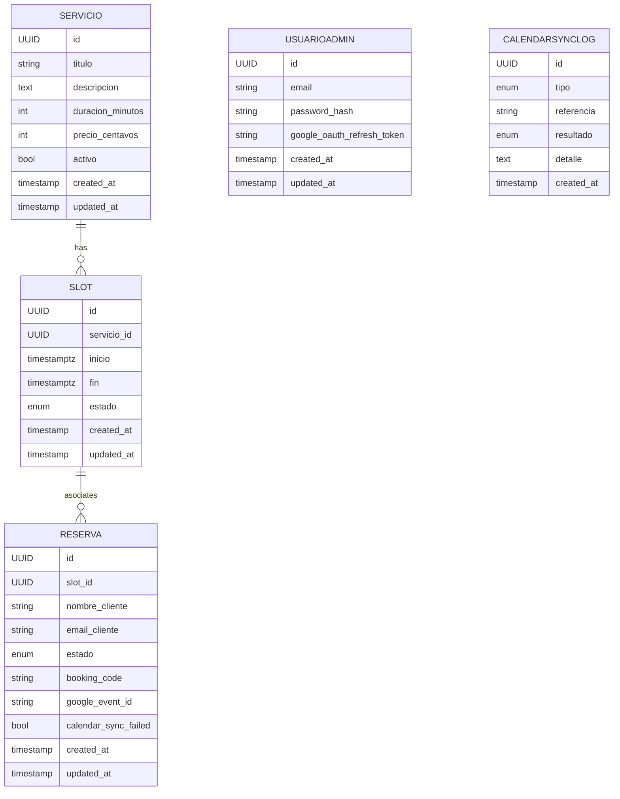

# Modelo de Datos (ERD)

## Entidades Principales

1. Servicio
   - id (UUID)
   - titulo (string)
   - descripcion (text)
   - duracion_minutos (int)
   - precio_centavos (int)
   - activo (bool)
   - created_at, updated_at

2. Slot
   - id (UUID)
   - servicio_id (FK -> Servicio)
   - inicio (timestamp with tz)
   - fin (timestamp with tz) (derivado de inicio + duración servicio, pero persistido para index)
   - estado (enum: ABIERTO, CERRADO, BLOQUEADO_EXTERNAMENTE)
   - created_at, updated_at
   - UNIQUE(servicio_id, inicio)

3. Reserva
   - id (UUID)
   - slot_id (FK -> Slot)
   - nombre_cliente (string)
   - email_cliente (string)
   - estado (enum: PENDIENTE, APROBADA, RECHAZADA)
   - booking_code (string unique, base62 corto)
   - google_event_id (string nullable)
   - calendar_sync_failed (bool default false)
   - created_at, updated_at

4. UsuarioAdmin
   - id (UUID)
   - email (string unique)
   - password_hash (string)
   - google_oauth_refresh_token (string encrypted nullable)
   - created_at, updated_at

5. CalendarSyncLog (auditoría mínima)
   - id (UUID)
   - tipo (enum: CREATE_EVENT, CHECK_CONFLICTS, POLL_IMPORT)
   - referencia (slot_id o reserva_id opcional)
   - resultado (enum: OK, ERROR)
   - detalle (text)
   - created_at

## Reglas e Invariantes
- Un Slot no puede pasar a CERRADO salvo que exista una Reserva APROBADA asociada.
- Un Slot con fecha pasada se considera no reservable (lógica de consulta, no cambio de estado obligatorio).
- Solo una Reserva por Slot puede estar en estado APROBADA.
- Al RECHAZAR una Reserva PENDIENTE no se modifica el estado del Slot (permanece ABIERTO) salvo que existan otras condiciones.
- BLOQUEADO_EXTERNAMENTE se establece cuando un evento de Google solapa.

## Índices Recomendados
- Slot: idx_slot_servicio_inicio (servicio_id, inicio)
- Slot: idx_slot_inicio_estado (inicio, estado) para filtrar próximos abiertos.
- Reserva: idx_reserva_booking_code unique.
- Reserva: idx_reserva_slot_estado (slot_id, estado)

## ERD (Mermaid)

## Notas
- `fin` duplicado por optimización de queries y simplifica detección de solapamientos.
- `booking_code` se genera al crear reserva (pendiente) y no cambia.
- `google_event_id` solo se setea al aprobar.
