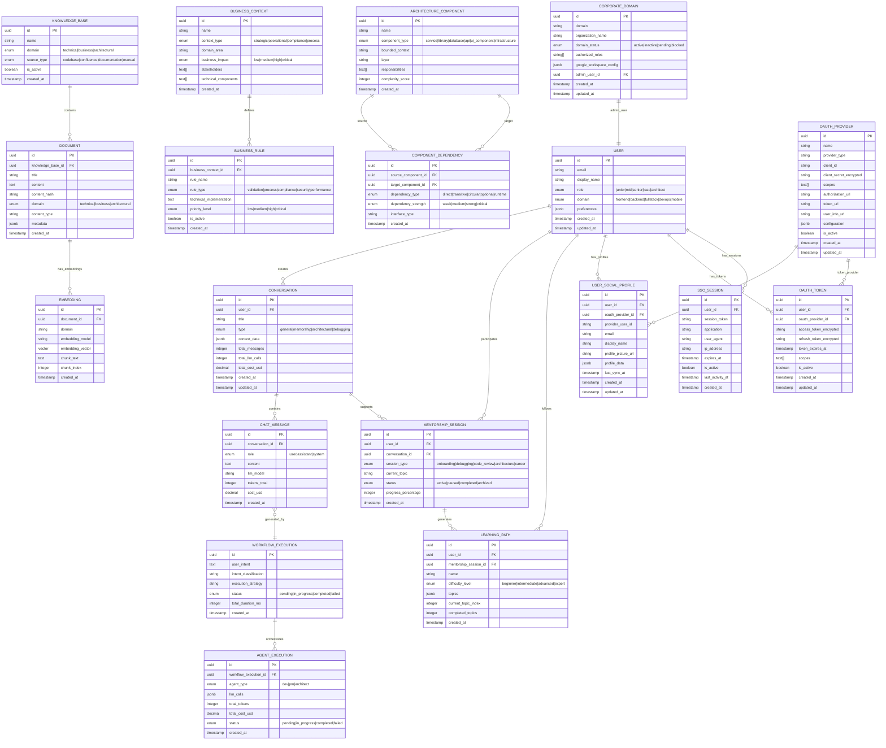
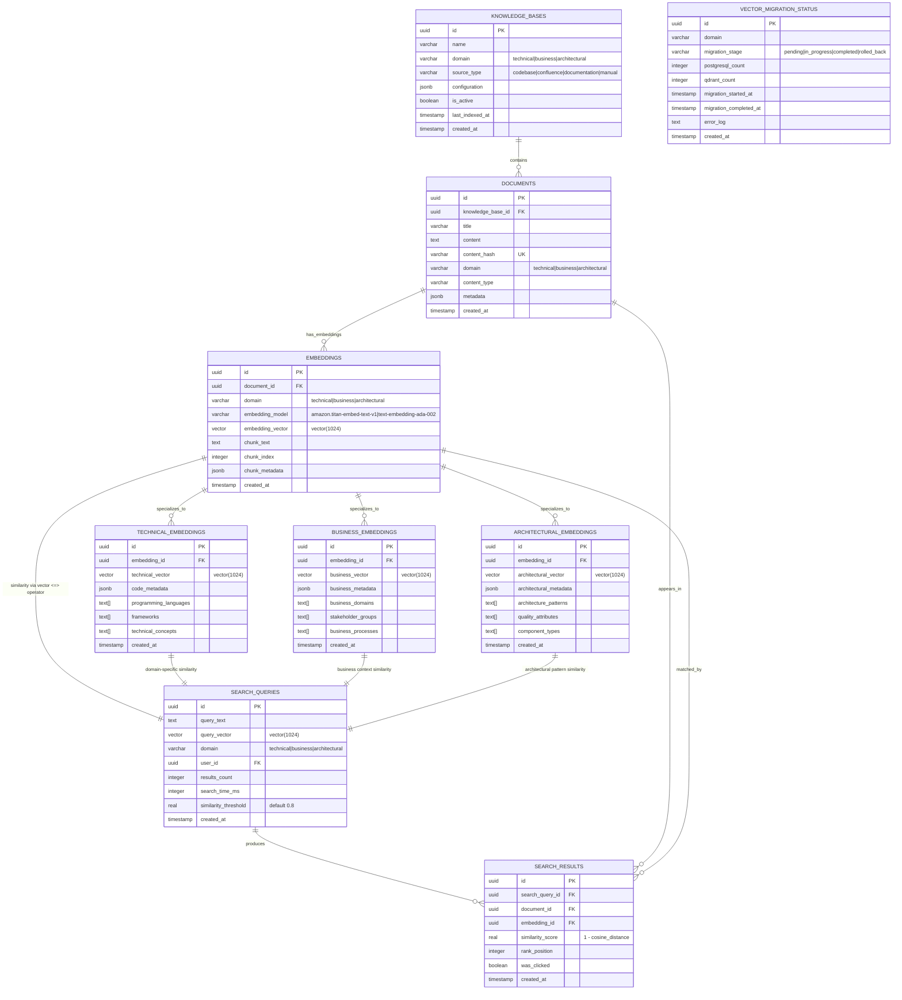

# 🗄️ Database Schema - Nura System

## 🗄️ Arquitectura de Base de Datos

**Database Stack**: PostgreSQL 15+ con pgvector extension para embeddings vectoriales, con path de migración a Qdrant para escalabilidad futura.

**Design Principles**:
- **Domain Separation**: Esquemas separados por Bounded Context
- **Vector Optimization**: Embeddings separados por dominio para performance
- **Audit Trail**: Tracking completo de LLM calls y costs
- **Scalability**: Diseñado para migración transparent a Qdrant

---

## 📈 Modelo de Datos Conceptual

### 📈 Diagrama Conceptual del Modelo de Datos



### 📁 Diccionario de Entidades por Bounded Context

| Entidad | Bounded Context | Descripción |
|---------|----------------|-------------|
| **agent_teams** | Agent Orchestration | Equipos de agentes preconfigurados para colaboración en workflows específicos |
| **workflow_executions** | Agent Orchestration | Ejecuciones de workflows con intent analysis y tracking completo de performance |
| **agent_executions** | Agent Orchestration | Ejecuciones individuales de agentes con tracking detallado de LLM calls y costos |
| **users** | User Interfaces | Usuarios del sistema con roles, dominios técnicos y preferencias personalizadas |
| **conversations** | User Interfaces | Conversaciones unificadas con tracking de usage y costos de LLM por conversación |
| **chat_messages** | User Interfaces | Mensajes individuales con metadata completa de LLM (modelo, tokens, costos, tiempos) |
| **response_templates** | User Interfaces | Templates reutilizables para personalización de respuestas por categoría |
| **knowledge_bases** | Knowledge Management | Bases de conocimiento organizadas por dominio (técnico, negocio, arquitectónico) |
| **documents** | Knowledge Management | Documentos indexados con classification automática y metadata rica |
| **embeddings** | Knowledge Management | Vector embeddings separados por dominio para optimización de búsquedas semánticas |
| **search_queries** | Knowledge Management | Queries de búsqueda con analytics para optimization y learning |
| **search_results** | Knowledge Management | Resultados de búsqueda con scoring para ranking optimization |
| **mentorship_sessions** | Developer Mentorship | Sesiones de mentoring personalizadas con tracking de progreso y engagement |
| **learning_paths** | Developer Mentorship | Rutas de aprendizaje adaptativas basadas en skill assessment y objetivos |
| **technical_questions** | Developer Mentorship | Preguntas técnicas enriquecidas con business context y tracking de calidad |
| **skill_assessments** | Developer Mentorship | Evaluaciones de skills con evidence tracking y progression planning |
| **learning_progress** | Developer Mentorship | Tracking detallado de progreso con metrics de velocity y retention |
| **business_contexts** | Business Intelligence | Contextos de negocio con mapping a componentes técnicos y stakeholder tracking |
| **business_rules** | Business Intelligence | Reglas de negocio con implementation mapping y compliance tracking |
| **technical_decisions** | Business Intelligence | Decisiones técnicas con business rationale y tradeoff analysis |
| **business_objectives** | Business Intelligence | Objetivos estratégicos con success criteria y ROI tracking |
| **compliance_rules** | Business Intelligence | Reglas de compliance específicas con audit trail y remediation planning |
| **architecture_components** | Architectural Guidance | Componentes del sistema con quality attributes y complexity scoring |
| **component_dependencies** | Architectural Guidance | Dependencies entre componentes con strength analysis y breaking change risk |
| **architecture_patterns** | Architectural Guidance | Patrones arquitectónicos identificados con usage guidelines y examples |
| **quality_attributes** | Architectural Guidance | Atributos de calidad por componente con assessment y improvement planning |
| **technical_debt** | Architectural Guidance | Technical debt tracking con impact analysis y prioritization scoring |
| **oauth_providers** | Corporate Authentication | Proveedores OAuth configurados (Google, Microsoft, etc.) con configuración y estado |
| **corporate_domains** | Corporate Authentication | Dominios corporativos autorizados con configuración de roles y políticas |
| **user_social_profiles** | Corporate Authentication | Perfiles sociales vinculados a usuarios con sincronización automática |
| **oauth_tokens** | Corporate Authentication | Tokens OAuth encriptados con refresh automático y lifecycle management |
| **sso_sessions** | Corporate Authentication | Sesiones SSO cross-aplicaciones con tracking y auditoría completa |

---

## 📈 Diagramas ERD Detallados

### 🗄️ ERD - Modelo Relacional PostgreSQL

```mermaid
erDiagram
    %% Agent Orchestration Schema
    AGENT_TEAMS {
        uuid id PK
        varchar name
        text description
        varchar execution_strategy
        timestamp created_at
        timestamp updated_at
    }
    
    WORKFLOW_EXECUTIONS {
        uuid id PK
        uuid agent_team_id FK
        text user_intent
        varchar intent_classification
        varchar execution_strategy
        varchar status
        timestamp started_at
        timestamp completed_at
        integer total_duration_ms
        timestamp created_at
    }
    
    AGENT_EXECUTIONS {
        uuid id PK
        uuid workflow_execution_id FK
        varchar agent_type
        varchar agent_name
        varchar status
        jsonb input_data
        jsonb output_data
        integer execution_time_ms
        jsonb llm_calls
        integer total_tokens "GENERATED ALWAYS AS computed"
        decimal total_cost_usd "GENERATED ALWAYS AS computed"
        timestamp started_at
        timestamp completed_at
        timestamp created_at
    }
    
    %% User Interfaces Schema
    USERS {
        uuid id PK
        varchar email UK
        varchar display_name
        varchar role
        varchar domain
        jsonb preferences
        timestamp created_at
        timestamp updated_at
        timestamp last_active_at
    }
    
    CONVERSATIONS {
        uuid id PK
        uuid user_id FK
        varchar title
        varchar conversation_type
        jsonb context_data
        integer total_messages
        integer total_llm_calls
        integer total_tokens_used
        decimal total_cost_usd
        timestamp created_at
        timestamp updated_at
        timestamp last_message_at
    }
    
    CHAT_MESSAGES {
        uuid id PK
        uuid conversation_id FK
        varchar role
        text content
        varchar message_type
        varchar llm_model
        varchar llm_provider
        integer tokens_input
        integer tokens_output
        integer tokens_total
        decimal cost_usd
        integer response_time_ms
        uuid workflow_execution_id
        varchar agent_type
        timestamp created_at
    }
    
    RESPONSE_TEMPLATES {
        uuid id PK
        varchar name
        text description
        text template_content
        jsonb variables
        varchar category
        boolean is_active
        timestamp created_at
    }
    
    %% Knowledge Management Schema
    KNOWLEDGE_BASES {
        uuid id PK
        varchar name
        text description
        varchar domain
        varchar source_type
        jsonb configuration
        boolean is_active
        timestamp last_indexed_at
        timestamp created_at
        timestamp updated_at
    }
    
    DOCUMENTS {
        uuid id PK
        uuid knowledge_base_id FK
        varchar title
        text content
        varchar content_hash UK
        text source_url
        text source_path
        varchar domain
        varchar content_type
        varchar language
        jsonb metadata
        text[] tags
        timestamp indexed_at
        timestamp created_at
        timestamp updated_at
    }
    
    SEARCH_QUERIES {
        uuid id PK
        text query_text
        vector query_vector
        varchar domain
        uuid user_id FK
        integer results_count
        integer search_time_ms
        real similarity_threshold
        timestamp created_at
    }
    
    SEARCH_RESULTS {
        uuid id PK
        uuid search_query_id FK
        uuid document_id FK
        uuid embedding_id FK
        real similarity_score
        integer rank_position
        boolean was_clicked
        timestamp created_at
    }
    
    %% Business Intelligence Schema
    BUSINESS_CONTEXTS {
        uuid id PK
        varchar name
        text description
        varchar context_type
        varchar domain_area
        varchar business_impact
        text[] stakeholders
        text[] related_objectives
        text[] technical_components
        text implementation_notes
        varchar source_document
        varchar confluence_page_id
        timestamp last_verified_at
        timestamp created_at
        timestamp updated_at
    }
    
    BUSINESS_RULES {
        uuid id PK
        uuid business_context_id FK
        varchar rule_name
        text rule_description
        varchar rule_type
        text technical_implementation
        text[] code_references
        text[] api_endpoints
        text[] database_constraints
        varchar compliance_framework
        jsonb audit_requirements
        varchar priority_level
        varchar enforcement_level
        boolean is_active
        timestamp created_at
        timestamp updated_at
    }
    
    TECHNICAL_DECISIONS {
        uuid id PK
        varchar decision_title
        text decision_description
        varchar decision_type
        text business_rationale
        text business_impact_assessment
        jsonb stakeholder_input
        text technical_approach
        jsonb alternatives_considered
        text trade_offs_analysis
        varchar implementation_complexity
        varchar decision_status
        varchar decided_by
        timestamp decided_at
        uuid[] related_business_contexts
        uuid[] related_business_rules
        timestamp created_at
        timestamp updated_at
    }
    
    %% Architectural Guidance Schema
    ARCHITECTURE_COMPONENTS {
        uuid id PK
        varchar name
        varchar component_type
        text description
        text[] file_paths
        varchar namespace_path
        varchar bounded_context
        varchar layer
        text[] responsibilities
        jsonb interfaces_provided
        jsonb interfaces_consumed
        integer complexity_score
        integer maintainability_score
        integer testability_score
        text[] technology_stack
        text[] documentation_links
        timestamp created_at
        timestamp updated_at
        timestamp analyzed_at
    }
    
    COMPONENT_DEPENDENCIES {
        uuid id PK
        uuid source_component_id FK
        uuid target_component_id FK
        varchar dependency_type
        varchar dependency_strength
        varchar interface_type
        text interface_contract
        varchar coupling_level
        varchar breaking_change_risk
        varchar discovered_method
        real confidence_level
        timestamp created_at
        timestamp updated_at
    }
    
    %% Relationships
    AGENT_TEAMS ||--o{ WORKFLOW_EXECUTIONS : has
    WORKFLOW_EXECUTIONS ||--o{ AGENT_EXECUTIONS : contains
    
    USERS ||--o{ CONVERSATIONS : creates
    USERS ||--o{ SEARCH_QUERIES : performs
    CONVERSATIONS ||--o{ CHAT_MESSAGES : contains
    WORKFLOW_EXECUTIONS ||--o{ CHAT_MESSAGES : generates
    
    KNOWLEDGE_BASES ||--o{ DOCUMENTS : contains
    SEARCH_QUERIES ||--o{ SEARCH_RESULTS : produces
    DOCUMENTS ||--o{ SEARCH_RESULTS : appears_in
    
    BUSINESS_CONTEXTS ||--o{ BUSINESS_RULES : defines
    
    ARCHITECTURE_COMPONENTS ||--o{ COMPONENT_DEPENDENCIES : source_of
    ARCHITECTURE_COMPONENTS ||--o{ COMPONENT_DEPENDENCIES : target_of
    
    %% Corporate Authentication Schema
    OAUTH_PROVIDERS {
        uuid id PK
        varchar name
        varchar provider_type
        varchar client_id
        text client_secret_encrypted
        text[] scopes
        varchar authorization_url
        varchar token_url
        varchar user_info_url
        jsonb configuration
        boolean is_active
        timestamp created_at
        timestamp updated_at
    }
    
    CORPORATE_DOMAINS {
        uuid id PK
        varchar domain
        varchar organization_name
        varchar domain_status
        text[] authorized_roles
        jsonb google_workspace_config
        uuid admin_user_id FK
        timestamp created_at
        timestamp updated_at
    }
    
    USER_SOCIAL_PROFILES {
        uuid id PK
        uuid user_id FK
        uuid oauth_provider_id FK
        varchar provider_user_id
        varchar email
        varchar display_name
        varchar profile_picture_url
        jsonb profile_data
        timestamp last_sync_at
        timestamp created_at
        timestamp updated_at
    }
    
    OAUTH_TOKENS {
        uuid id PK
        uuid user_id FK
        uuid oauth_provider_id FK
        text access_token_encrypted
        text refresh_token_encrypted
        timestamp token_expires_at
        text[] scopes
        boolean is_active
        timestamp created_at
        timestamp updated_at
    }
    
    SSO_SESSIONS {
        uuid id PK
        uuid user_id FK
        varchar session_token
        varchar application
        varchar user_agent
        varchar ip_address
        timestamp expires_at
        boolean is_active
        timestamp last_activity_at
        timestamp created_at
    }
    
    %% OAuth Relationships
    USERS ||--o{ USER_SOCIAL_PROFILES : has_social_profiles
    USERS ||--o{ OAUTH_TOKENS : has_tokens
    USERS ||--o{ SSO_SESSIONS : has_sso_sessions
    OAUTH_PROVIDERS ||--o{ USER_SOCIAL_PROFILES : manages_profiles
    OAUTH_PROVIDERS ||--o{ OAUTH_TOKENS : issues_tokens
    CORPORATE_DOMAINS ||--|| USERS : admin_user
```



### 🤖 ERD - Modelo de Embeddings Vectoriales



---

## Core Extensions

```sql
-- Extensions requeridas
CREATE EXTENSION IF NOT EXISTS "uuid-ossp";
CREATE EXTENSION IF NOT EXISTS "pgcrypto";
CREATE EXTENSION IF NOT EXISTS "vector";  -- pgvector para embeddings
CREATE EXTENSION IF NOT EXISTS "pg_stat_statements";  -- Performance monitoring
```

---

## 1. Agent Orchestration Schema

**Responsabilidad**: Workflow orchestration, agent coordination, LLM tracking

```sql
-- Schema para Agent Orchestration BC
CREATE SCHEMA agent_orchestration;

-- Agent Teams para workflow collaboration
CREATE TABLE agent_orchestration.agent_teams (
    id UUID PRIMARY KEY DEFAULT uuid_generate_v4(),
    name VARCHAR(100) NOT NULL,
    description TEXT,
    execution_strategy VARCHAR(50) NOT NULL CHECK (execution_strategy IN ('single_agent', 'multi_agent', 'fallback')),
    created_at TIMESTAMP WITH TIME ZONE DEFAULT NOW(),
    updated_at TIMESTAMP WITH TIME ZONE DEFAULT NOW()
);

-- Workflow Executions con tracking completo
CREATE TABLE agent_orchestration.workflow_executions (
    id UUID PRIMARY KEY DEFAULT uuid_generate_v4(),
    agent_team_id UUID REFERENCES agent_orchestration.agent_teams(id),
    user_intent TEXT NOT NULL,
    intent_classification VARCHAR(100) NOT NULL,
    execution_strategy VARCHAR(50) NOT NULL,
    status VARCHAR(20) NOT NULL DEFAULT 'pending' CHECK (status IN ('pending', 'in_progress', 'completed', 'failed', 'degraded')),
    started_at TIMESTAMP WITH TIME ZONE DEFAULT NOW(),
    completed_at TIMESTAMP WITH TIME ZONE,
    total_duration_ms INTEGER,
    created_at TIMESTAMP WITH TIME ZONE DEFAULT NOW()
);

-- Agent Executions individuales con LLM call tracking
CREATE TABLE agent_orchestration.agent_executions (
    id UUID PRIMARY KEY DEFAULT uuid_generate_v4(),
    workflow_execution_id UUID NOT NULL REFERENCES agent_orchestration.workflow_executions(id),
    agent_type VARCHAR(50) NOT NULL CHECK (agent_type IN ('dev', 'pm', 'architect')),
    agent_name VARCHAR(100) NOT NULL,
    status VARCHAR(20) NOT NULL DEFAULT 'pending',
    input_data JSONB NOT NULL,
    output_data JSONB,
    execution_time_ms INTEGER,
    
    -- LLM Call Tracking completo
    llm_calls JSONB DEFAULT '[]',  -- Array de llamadas LLM
    total_tokens INTEGER GENERATED ALWAYS AS (
        (SELECT COALESCE(SUM((call->>'tokens_used')::int), 0) 
         FROM jsonb_array_elements(llm_calls) AS call)
    ) STORED,
    total_cost_usd DECIMAL(10,6) GENERATED ALWAYS AS (
        (SELECT COALESCE(SUM((call->>'cost_usd')::decimal), 0) 
         FROM jsonb_array_elements(llm_calls) AS call)
    ) STORED,
    
    started_at TIMESTAMP WITH TIME ZONE DEFAULT NOW(),
    completed_at TIMESTAMP WITH TIME ZONE,
    created_at TIMESTAMP WITH TIME ZONE DEFAULT NOW()
);

-- Indexes para performance
CREATE INDEX idx_workflow_executions_status ON agent_orchestration.workflow_executions(status);
CREATE INDEX idx_workflow_executions_created_at ON agent_orchestration.workflow_executions(created_at);
CREATE INDEX idx_agent_executions_workflow_id ON agent_orchestration.agent_executions(workflow_execution_id);
CREATE INDEX idx_agent_executions_agent_type ON agent_orchestration.agent_executions(agent_type);
CREATE INDEX idx_agent_executions_total_cost ON agent_orchestration.agent_executions(total_cost_usd);

-- Trigger para updated_at
CREATE OR REPLACE FUNCTION update_updated_at_column()
RETURNS TRIGGER AS $$
BEGIN
    NEW.updated_at = NOW();
    RETURN NEW;
END;
$$ language 'plpgsql';

CREATE TRIGGER update_agent_teams_updated_at BEFORE UPDATE ON agent_orchestration.agent_teams 
    FOR EACH ROW EXECUTE FUNCTION update_updated_at_column();
```

---

## 2. User Interfaces Schema

**Responsabilidad**: Conversation management, user preferences, chat interface

```sql
-- Schema para User Interfaces BC
CREATE SCHEMA user_interfaces;

-- Users con configuración personalizada
CREATE TABLE user_interfaces.users (
    id UUID PRIMARY KEY DEFAULT uuid_generate_v4(),
    email VARCHAR(255) UNIQUE NOT NULL,
    display_name VARCHAR(100) NOT NULL,
    role VARCHAR(50) NOT NULL CHECK (role IN ('junior', 'mid', 'senior', 'lead', 'architect')),
    domain VARCHAR(50) NOT NULL CHECK (domain IN ('frontend', 'backend', 'fullstack', 'devops', 'mobile')),
    preferences JSONB DEFAULT '{}',
    created_at TIMESTAMP WITH TIME ZONE DEFAULT NOW(),
    updated_at TIMESTAMP WITH TIME ZONE DEFAULT NOW(),
    last_active_at TIMESTAMP WITH TIME ZONE
);

-- Conversations unificadas para todos los agentes
CREATE TABLE user_interfaces.conversations (
    id UUID PRIMARY KEY DEFAULT uuid_generate_v4(),
    user_id UUID NOT NULL REFERENCES user_interfaces.users(id),
    title VARCHAR(255),
    conversation_type VARCHAR(50) NOT NULL DEFAULT 'general' CHECK (conversation_type IN ('general', 'mentorship', 'architectural', 'debugging')),
    context_data JSONB DEFAULT '{}',
    
    -- Tracking de LLM usage por conversación
    total_messages INTEGER DEFAULT 0,
    total_llm_calls INTEGER DEFAULT 0,
    total_tokens_used INTEGER DEFAULT 0,
    total_cost_usd DECIMAL(10,6) DEFAULT 0,
    
    created_at TIMESTAMP WITH TIME ZONE DEFAULT NOW(),
    updated_at TIMESTAMP WITH TIME ZONE DEFAULT NOW(),
    last_message_at TIMESTAMP WITH TIME ZONE
);

-- Chat Messages con metadata completa de LLM
CREATE TABLE user_interfaces.chat_messages (
    id UUID PRIMARY KEY DEFAULT uuid_generate_v4(),
    conversation_id UUID NOT NULL REFERENCES user_interfaces.conversations(id),
    
    -- Message content
    role VARCHAR(20) NOT NULL CHECK (role IN ('user', 'assistant', 'system')),
    content TEXT NOT NULL,
    message_type VARCHAR(50) DEFAULT 'text' CHECK (message_type IN ('text', 'code', 'error', 'system_notice')),
    
    -- LLM tracking por message
    llm_model VARCHAR(100),  -- e.g., 'claude-3-sonnet', 'gpt-4'
    llm_provider VARCHAR(50),  -- e.g., 'aws_bedrock', 'openai'
    tokens_input INTEGER,
    tokens_output INTEGER,
    tokens_total INTEGER,
    cost_usd DECIMAL(8,4),
    response_time_ms INTEGER,
    
    -- Workflow context
    workflow_execution_id UUID,  -- Reference a agent_orchestration.workflow_executions
    agent_type VARCHAR(50),  -- Which agent generated this response
    
    created_at TIMESTAMP WITH TIME ZONE DEFAULT NOW()
);

-- Response Templates para personalización
CREATE TABLE user_interfaces.response_templates (
    id UUID PRIMARY KEY DEFAULT uuid_generate_v4(),
    name VARCHAR(100) NOT NULL,
    description TEXT,
    template_content TEXT NOT NULL,
    variables JSONB DEFAULT '[]',  -- Array de variables disponibles
    category VARCHAR(50) NOT NULL,
    is_active BOOLEAN DEFAULT true,
    created_at TIMESTAMP WITH TIME ZONE DEFAULT NOW()
);

-- Indexes para performance de chat
CREATE INDEX idx_conversations_user_id ON user_interfaces.conversations(user_id);
CREATE INDEX idx_conversations_created_at ON user_interfaces.conversations(created_at);
CREATE INDEX idx_chat_messages_conversation_id ON user_interfaces.chat_messages(conversation_id);
CREATE INDEX idx_chat_messages_created_at ON user_interfaces.chat_messages(created_at);
CREATE INDEX idx_chat_messages_llm_model ON user_interfaces.chat_messages(llm_model);
CREATE INDEX idx_chat_messages_cost_usd ON user_interfaces.chat_messages(cost_usd);

-- Triggers para conversation stats update
CREATE OR REPLACE FUNCTION update_conversation_stats()
RETURNS TRIGGER AS $$
BEGIN
    IF TG_OP = 'INSERT' THEN
        UPDATE user_interfaces.conversations 
        SET 
            total_messages = total_messages + 1,
            total_llm_calls = total_llm_calls + CASE WHEN NEW.llm_model IS NOT NULL THEN 1 ELSE 0 END,
            total_tokens_used = total_tokens_used + COALESCE(NEW.tokens_total, 0),
            total_cost_usd = total_cost_usd + COALESCE(NEW.cost_usd, 0),
            last_message_at = NEW.created_at,
            updated_at = NOW()
        WHERE id = NEW.conversation_id;
    END IF;
    RETURN NEW;
END;
$$ language 'plpgsql';

CREATE TRIGGER update_conversation_stats_trigger 
    AFTER INSERT ON user_interfaces.chat_messages 
    FOR EACH ROW EXECUTE FUNCTION update_conversation_stats();
```

---

## 3. Knowledge Management Schema

**Responsabilidad**: Vector embeddings, semantic search, knowledge indexing

```sql
-- Schema para Knowledge Management BC
CREATE SCHEMA knowledge_management;

-- Knowledge Base central
CREATE TABLE knowledge_management.knowledge_bases (
    id UUID PRIMARY KEY DEFAULT uuid_generate_v4(),
    name VARCHAR(100) NOT NULL,
    description TEXT,
    domain VARCHAR(50) NOT NULL CHECK (domain IN ('technical', 'business', 'architectural')),
    source_type VARCHAR(50) NOT NULL CHECK (source_type IN ('codebase', 'confluence', 'documentation', 'manual')),
    configuration JSONB DEFAULT '{}',
    is_active BOOLEAN DEFAULT true,
    last_indexed_at TIMESTAMP WITH TIME ZONE,
    created_at TIMESTAMP WITH TIME ZONE DEFAULT NOW(),
    updated_at TIMESTAMP WITH TIME ZONE DEFAULT NOW()
);

-- Documents indexados con metadata rica
CREATE TABLE knowledge_management.documents (
    id UUID PRIMARY KEY DEFAULT uuid_generate_v4(),
    knowledge_base_id UUID NOT NULL REFERENCES knowledge_management.knowledge_bases(id),
    
    -- Document identification
    title VARCHAR(500) NOT NULL,
    content TEXT NOT NULL,
    content_hash VARCHAR(64) NOT NULL,  -- SHA256 para duplicate detection
    source_url TEXT,
    source_path TEXT,
    
    -- Classification y metadata
    domain VARCHAR(50) NOT NULL,
    content_type VARCHAR(100) NOT NULL,  -- 'code', 'documentation', 'business_rule', etc.
    language VARCHAR(10) DEFAULT 'en',
    
    -- Content structure
    metadata JSONB DEFAULT '{}',  -- Flexible metadata
    tags TEXT[] DEFAULT '{}',
    
    -- Indexing info
    indexed_at TIMESTAMP WITH TIME ZONE DEFAULT NOW(),
    created_at TIMESTAMP WITH TIME ZONE DEFAULT NOW(),
    updated_at TIMESTAMP WITH TIME ZONE DEFAULT NOW()
);

-- Vector Embeddings separados por dominio para performance
CREATE TABLE knowledge_management.embeddings (
    id UUID PRIMARY KEY DEFAULT uuid_generate_v4(),
    document_id UUID NOT NULL REFERENCES knowledge_management.documents(id) ON DELETE CASCADE,
    
    -- Domain separation para optimización
    domain VARCHAR(50) NOT NULL,
    
    -- Vector data
    embedding_model VARCHAR(100) NOT NULL,  -- e.g., 'amazon.titan-embed-text-v1'
    embedding_vector vector(1024),  -- Ajustar dimensión según modelo
    
    -- Chunk information para large documents
    chunk_index INTEGER DEFAULT 0,
    chunk_text TEXT NOT NULL,
    chunk_metadata JSONB DEFAULT '{}',
    
    created_at TIMESTAMP WITH TIME ZONE DEFAULT NOW()
);

-- Search Queries para analytics y optimization
CREATE TABLE knowledge_management.search_queries (
    id UUID PRIMARY KEY DEFAULT uuid_generate_v4(),
    query_text TEXT NOT NULL,
    query_vector vector(1024),
    domain VARCHAR(50) NOT NULL,
    user_id UUID,  -- Optional reference to users
    
    -- Search results metadata
    results_count INTEGER DEFAULT 0,
    search_time_ms INTEGER,
    similarity_threshold REAL DEFAULT 0.8,
    
    created_at TIMESTAMP WITH TIME ZONE DEFAULT NOW()
);

-- Search Results para learning y ranking optimization
CREATE TABLE knowledge_management.search_results (
    id UUID PRIMARY KEY DEFAULT uuid_generate_v4(),
    search_query_id UUID NOT NULL REFERENCES knowledge_management.search_queries(id),
    document_id UUID NOT NULL REFERENCES knowledge_management.documents(id),
    embedding_id UUID NOT NULL REFERENCES knowledge_management.embeddings(id),
    
    similarity_score REAL NOT NULL,
    rank_position INTEGER NOT NULL,
    was_clicked BOOLEAN DEFAULT false,
    
    created_at TIMESTAMP WITH TIME ZONE DEFAULT NOW()
);

-- Indexes críticos para vector search performance
CREATE INDEX idx_embeddings_domain ON knowledge_management.embeddings(domain);
CREATE INDEX idx_embeddings_model ON knowledge_management.embeddings(embedding_model);

-- Vector similarity index (HNSW para mejor performance)
CREATE INDEX idx_embeddings_vector_cosine ON knowledge_management.embeddings 
    USING hnsw (embedding_vector vector_cosine_ops)
    WITH (m = 16, ef_construction = 64);

-- Indexes para document search
CREATE INDEX idx_documents_knowledge_base_id ON knowledge_management.documents(knowledge_base_id);
CREATE INDEX idx_documents_domain ON knowledge_management.documents(domain);
CREATE INDEX idx_documents_content_type ON knowledge_management.documents(content_type);
CREATE INDEX idx_documents_content_hash ON knowledge_management.documents(content_hash);
CREATE INDEX idx_documents_tags ON knowledge_management.documents USING gin(tags);

-- Indexes para search analytics
CREATE INDEX idx_search_queries_domain ON knowledge_management.search_queries(domain);
CREATE INDEX idx_search_queries_created_at ON knowledge_management.search_queries(created_at);
CREATE INDEX idx_search_results_similarity_score ON knowledge_management.search_results(similarity_score);
```

---

## 4. Developer Mentorship Schema

**Responsabilidad**: Learning paths, skill assessment, mentorship sessions

```sql
-- Schema para Developer Mentorship BC
CREATE SCHEMA developer_mentorship;

-- Mentorship Sessions tracking
CREATE TABLE developer_mentorship.mentorship_sessions (
    id UUID PRIMARY KEY DEFAULT uuid_generate_v4(),
    user_id UUID NOT NULL,  -- Reference to user_interfaces.users
    conversation_id UUID,  -- Reference to user_interfaces.conversations
    
    -- Session context
    session_type VARCHAR(50) NOT NULL CHECK (session_type IN ('onboarding', 'debugging', 'code_review', 'architecture', 'career')),
    current_topic VARCHAR(200),
    session_goals TEXT[],
    
    -- Progress tracking
    status VARCHAR(20) DEFAULT 'active' CHECK (status IN ('active', 'paused', 'completed', 'archived')),
    progress_percentage INTEGER DEFAULT 0 CHECK (progress_percentage >= 0 AND progress_percentage <= 100),
    
    started_at TIMESTAMP WITH TIME ZONE DEFAULT NOW(),
    last_interaction_at TIMESTAMP WITH TIME ZONE DEFAULT NOW(),
    completed_at TIMESTAMP WITH TIME ZONE,
    created_at TIMESTAMP WITH TIME ZONE DEFAULT NOW()
);

-- Learning Paths personalizados
CREATE TABLE developer_mentorship.learning_paths (
    id UUID PRIMARY KEY DEFAULT uuid_generate_v4(),
    user_id UUID NOT NULL,
    mentorship_session_id UUID REFERENCES developer_mentorship.mentorship_sessions(id),
    
    -- Path definition
    name VARCHAR(200) NOT NULL,
    description TEXT,
    difficulty_level VARCHAR(20) NOT NULL CHECK (difficulty_level IN ('beginner', 'intermediate', 'advanced', 'expert')),
    estimated_duration_hours INTEGER,
    
    -- Path structure
    topics JSONB NOT NULL,  -- Array of learning topics with order
    milestones JSONB DEFAULT '[]',  -- Achievement milestones
    prerequisites TEXT[],
    
    -- Progress tracking
    current_topic_index INTEGER DEFAULT 0,
    completed_topics INTEGER DEFAULT 0,
    total_topics INTEGER NOT NULL,
    
    created_at TIMESTAMP WITH TIME ZONE DEFAULT NOW(),
    updated_at TIMESTAMP WITH TIME ZONE DEFAULT NOW()
);

-- Technical Questions con business context
CREATE TABLE developer_mentorship.technical_questions (
    id UUID PRIMARY KEY DEFAULT uuid_generate_v4(),
    mentorship_session_id UUID REFERENCES developer_mentorship.mentorship_sessions(id),
    
    -- Question data
    question_text TEXT NOT NULL,
    question_category VARCHAR(100) NOT NULL,  -- 'debugging', 'architecture', 'implementation', etc.
    complexity_level VARCHAR(20) NOT NULL CHECK (complexity_level IN ('basic', 'intermediate', 'advanced', 'expert')),
    
    -- Context enrichment
    technical_context JSONB DEFAULT '{}',
    business_context JSONB DEFAULT '{}',
    learning_objectives TEXT[],
    
    -- Answer tracking
    answer_text TEXT,
    answer_quality_score INTEGER CHECK (answer_quality_score >= 1 AND answer_quality_score <= 10),
    business_context_included BOOLEAN DEFAULT false,
    
    -- LLM enhancement
    llm_enhanced BOOLEAN DEFAULT false,
    llm_model_used VARCHAR(100),
    enhancement_cost_usd DECIMAL(8,4),
    
    asked_at TIMESTAMP WITH TIME ZONE DEFAULT NOW(),
    answered_at TIMESTAMP WITH TIME ZONE
);

-- Skill Assessments para tracking de progreso
CREATE TABLE developer_mentorship.skill_assessments (
    id UUID PRIMARY KEY DEFAULT uuid_generate_v4(),
    user_id UUID NOT NULL,
    learning_path_id UUID REFERENCES developer_mentorship.learning_paths(id),
    
    -- Assessment data
    skill_domain VARCHAR(100) NOT NULL,  -- 'frontend', 'backend', 'architecture', etc.
    skill_area VARCHAR(100) NOT NULL,  -- 'react', 'node.js', 'postgresql', etc.
    
    -- Scoring
    current_level VARCHAR(20) NOT NULL CHECK (current_level IN ('novice', 'beginner', 'intermediate', 'advanced', 'expert')),
    target_level VARCHAR(20) NOT NULL CHECK (target_level IN ('novice', 'beginner', 'intermediate', 'advanced', 'expert')),
    progress_score INTEGER CHECK (progress_score >= 0 AND progress_score <= 100),
    
    -- Evidence
    evidence_items JSONB DEFAULT '[]',  -- Array of completed tasks, questions answered, etc.
    assessment_notes TEXT,
    
    -- Tracking
    first_assessed_at TIMESTAMP WITH TIME ZONE DEFAULT NOW(),
    last_updated_at TIMESTAMP WITH TIME ZONE DEFAULT NOW(),
    next_assessment_due TIMESTAMP WITH TIME ZONE
);

-- Progress Tracking detallado
CREATE TABLE developer_mentorship.learning_progress (
    id UUID PRIMARY KEY DEFAULT uuid_generate_v4(),
    user_id UUID NOT NULL,
    learning_path_id UUID REFERENCES developer_mentorship.learning_paths(id),
    technical_question_id UUID REFERENCES developer_mentorship.technical_questions(id),
    
    -- Progress event
    event_type VARCHAR(50) NOT NULL CHECK (event_type IN ('topic_started', 'topic_completed', 'question_asked', 'milestone_reached', 'skill_improved')),
    event_data JSONB DEFAULT '{}',
    
    -- Impact measurement
    learning_velocity_score REAL,  -- Questions per hour, topics per day, etc.
    engagement_score REAL,  -- Time spent, interaction frequency
    retention_score REAL,  -- Knowledge retention over time
    
    created_at TIMESTAMP WITH TIME ZONE DEFAULT NOW()
);

-- Indexes para mentorship performance
CREATE INDEX idx_mentorship_sessions_user_id ON developer_mentorship.mentorship_sessions(user_id);
CREATE INDEX idx_mentorship_sessions_status ON developer_mentorship.mentorship_sessions(status);
CREATE INDEX idx_learning_paths_user_id ON developer_mentorship.learning_paths(user_id);
CREATE INDEX idx_technical_questions_session_id ON developer_mentorship.technical_questions(mentorship_session_id);
CREATE INDEX idx_technical_questions_category ON developer_mentorship.technical_questions(question_category);
CREATE INDEX idx_skill_assessments_user_id ON developer_mentorship.skill_assessments(user_id);
CREATE INDEX idx_learning_progress_user_id ON developer_mentorship.learning_progress(user_id);
```

---

## 5. Business Intelligence Schema

**Responsabilidad**: Business context, rules mapping, compliance tracking

```sql
-- Schema para Business Intelligence BC
CREATE SCHEMA business_intelligence;

-- Business Context central
CREATE TABLE business_intelligence.business_contexts (
    id UUID PRIMARY KEY DEFAULT uuid_generate_v4(),
    
    -- Context identification
    name VARCHAR(200) NOT NULL,
    description TEXT NOT NULL,
    context_type VARCHAR(50) NOT NULL CHECK (context_type IN ('strategic', 'operational', 'compliance', 'process')),
    domain_area VARCHAR(100) NOT NULL,  -- 'authentication', 'payments', 'user_management', etc.
    
    -- Business value
    business_impact VARCHAR(20) NOT NULL CHECK (business_impact IN ('low', 'medium', 'high', 'critical')),
    stakeholders TEXT[] DEFAULT '{}',
    related_objectives TEXT[],
    
    -- Technical mapping
    technical_components TEXT[],  -- Components affected by this context
    implementation_notes TEXT,
    
    -- Source tracking
    source_document VARCHAR(500),
    confluence_page_id VARCHAR(100),
    last_verified_at TIMESTAMP WITH TIME ZONE,
    
    created_at TIMESTAMP WITH TIME ZONE DEFAULT NOW(),
    updated_at TIMESTAMP WITH TIME ZONE DEFAULT NOW()
);

-- Business Rules con technical implications
CREATE TABLE business_intelligence.business_rules (
    id UUID PRIMARY KEY DEFAULT uuid_generate_v4(),
    business_context_id UUID REFERENCES business_intelligence.business_contexts(id),
    
    -- Rule definition
    rule_name VARCHAR(200) NOT NULL,
    rule_description TEXT NOT NULL,
    rule_type VARCHAR(50) NOT NULL CHECK (rule_type IN ('validation', 'process', 'compliance', 'security', 'performance')),
    
    -- Implementation details
    technical_implementation TEXT,
    code_references TEXT[],  -- File paths or function names
    api_endpoints TEXT[],
    database_constraints TEXT[],
    
    -- Compliance y audit
    compliance_framework VARCHAR(100),  -- 'GDPR', 'SOX', 'PCI-DSS', etc.
    audit_requirements JSONB DEFAULT '{}',
    
    -- Rule priority y enforcement
    priority_level VARCHAR(20) NOT NULL CHECK (priority_level IN ('low', 'medium', 'high', 'critical')),
    enforcement_level VARCHAR(20) NOT NULL CHECK (enforcement_level IN ('advisory', 'warning', 'blocking')),
    
    is_active BOOLEAN DEFAULT true,
    created_at TIMESTAMP WITH TIME ZONE DEFAULT NOW(),
    updated_at TIMESTAMP WITH TIME ZONE DEFAULT NOW()
);

-- Technical Decisions con business rationale
CREATE TABLE business_intelligence.technical_decisions (
    id UUID PRIMARY KEY DEFAULT uuid_generate_v4(),
    
    -- Decision data
    decision_title VARCHAR(200) NOT NULL,
    decision_description TEXT NOT NULL,
    decision_type VARCHAR(50) NOT NULL CHECK (decision_type IN ('architecture', 'technology', 'process', 'security')),
    
    -- Business connection
    business_rationale TEXT NOT NULL,
    business_impact_assessment TEXT,
    stakeholder_input JSONB DEFAULT '{}',
    
    -- Technical details
    technical_approach TEXT NOT NULL,
    alternatives_considered JSONB DEFAULT '[]',
    trade_offs_analysis TEXT,
    implementation_complexity VARCHAR(20) CHECK (implementation_complexity IN ('low', 'medium', 'high', 'very_high')),
    
    -- Decision tracking
    decision_status VARCHAR(20) DEFAULT 'proposed' CHECK (decision_status IN ('proposed', 'approved', 'implemented', 'reviewed', 'deprecated')),
    decided_by VARCHAR(200),
    decided_at TIMESTAMP WITH TIME ZONE,
    
    -- References
    related_business_contexts UUID[],  -- Array of business_contexts.id
    related_business_rules UUID[],     -- Array of business_rules.id
    
    created_at TIMESTAMP WITH TIME ZONE DEFAULT NOW(),
    updated_at TIMESTAMP WITH TIME ZONE DEFAULT NOW()
);

-- Business Objectives mapping
CREATE TABLE business_intelligence.business_objectives (
    id UUID PRIMARY KEY DEFAULT uuid_generate_v4(),
    
    -- Objective definition
    name VARCHAR(200) NOT NULL,
    description TEXT NOT NULL,
    objective_type VARCHAR(50) NOT NULL CHECK (objective_type IN ('revenue', 'efficiency', 'compliance', 'user_experience', 'security')),
    
    -- Success metrics
    success_criteria JSONB NOT NULL,  -- KPIs y success metrics
    current_status VARCHAR(20) DEFAULT 'active' CHECK (current_status IN ('draft', 'active', 'achieved', 'paused', 'cancelled')),
    
    -- Time tracking
    target_date DATE,
    quarter VARCHAR(10),  -- 'Q1 2024', etc.
    
    -- Business alignment
    strategic_priority VARCHAR(20) NOT NULL CHECK (strategic_priority IN ('low', 'medium', 'high', 'critical')),
    budget_impact_usd INTEGER,
    expected_roi_percentage REAL,
    
    created_at TIMESTAMP WITH TIME ZONE DEFAULT NOW(),
    updated_at TIMESTAMP WITH TIME ZONE DEFAULT NOW()
);

-- Compliance Rules específicas
CREATE TABLE business_intelligence.compliance_rules (
    id UUID PRIMARY KEY DEFAULT uuid_generate_v4(),
    business_rule_id UUID REFERENCES business_intelligence.business_rules(id),
    
    -- Compliance specifics
    regulation_name VARCHAR(100) NOT NULL,  -- 'GDPR', 'CCPA', 'SOX', etc.
    article_section VARCHAR(100),
    requirement_text TEXT NOT NULL,
    
    -- Implementation tracking
    compliance_status VARCHAR(20) DEFAULT 'pending' CHECK (compliance_status IN ('pending', 'partial', 'compliant', 'non_compliant')),
    implementation_notes TEXT,
    evidence_location TEXT,
    
    -- Audit trail
    last_audit_date DATE,
    next_audit_due DATE,
    audit_findings JSONB DEFAULT '[]',
    remediation_plan TEXT,
    
    created_at TIMESTAMP WITH TIME ZONE DEFAULT NOW(),
    updated_at TIMESTAMP WITH TIME ZONE DEFAULT NOW()
);

-- Indexes para business intelligence
CREATE INDEX idx_business_contexts_domain_area ON business_intelligence.business_contexts(domain_area);
CREATE INDEX idx_business_contexts_business_impact ON business_intelligence.business_contexts(business_impact);
CREATE INDEX idx_business_rules_rule_type ON business_intelligence.business_rules(rule_type);
CREATE INDEX idx_business_rules_priority_level ON business_intelligence.business_rules(priority_level);
CREATE INDEX idx_technical_decisions_decision_type ON business_intelligence.technical_decisions(decision_type);
CREATE INDEX idx_technical_decisions_decision_status ON business_intelligence.technical_decisions(decision_status);
CREATE INDEX idx_compliance_rules_regulation_name ON business_intelligence.compliance_rules(regulation_name);
CREATE INDEX idx_compliance_rules_compliance_status ON business_intelligence.compliance_rules(compliance_status);
```

---

## 6. Architectural Guidance Schema

**Responsabilidad**: Component analysis, dependency tracking, architecture patterns

```sql
-- Schema para Architectural Guidance BC
CREATE SCHEMA architectural_guidance;

-- Architecture Components del sistema
CREATE TABLE architectural_guidance.architecture_components (
    id UUID PRIMARY KEY DEFAULT uuid_generate_v4(),
    
    -- Component identification
    name VARCHAR(200) NOT NULL,
    component_type VARCHAR(50) NOT NULL CHECK (component_type IN ('service', 'library', 'database', 'api', 'ui_component', 'infrastructure')),
    description TEXT,
    
    -- Location y scope
    file_paths TEXT[],
    namespace_path VARCHAR(500),
    bounded_context VARCHAR(100),
    
    -- Architecture properties
    layer VARCHAR(50),  -- 'presentation', 'application', 'domain', 'infrastructure'
    responsibilities TEXT[],
    interfaces_provided JSONB DEFAULT '[]',
    interfaces_consumed JSONB DEFAULT '[]',
    
    -- Quality attributes
    complexity_score INTEGER CHECK (complexity_score >= 1 AND complexity_score <= 10),
    maintainability_score INTEGER CHECK (maintainability_score >= 1 AND maintainability_score <= 10),
    testability_score INTEGER CHECK (testability_score >= 1 AND testability_score <= 10),
    
    -- Metadata
    technology_stack TEXT[],
    documentation_links TEXT[],
    
    created_at TIMESTAMP WITH TIME ZONE DEFAULT NOW(),
    updated_at TIMESTAMP WITH TIME ZONE DEFAULT NOW(),
    analyzed_at TIMESTAMP WITH TIME ZONE DEFAULT NOW()
);

-- Component Dependencies mapping
CREATE TABLE architectural_guidance.component_dependencies (
    id UUID PRIMARY KEY DEFAULT uuid_generate_v4(),
    
    -- Dependency relationship
    source_component_id UUID NOT NULL REFERENCES architectural_guidance.architecture_components(id),
    target_component_id UUID NOT NULL REFERENCES architectural_guidance.architecture_components(id),
    
    -- Dependency details
    dependency_type VARCHAR(50) NOT NULL CHECK (dependency_type IN ('direct', 'transitive', 'circular', 'optional', 'runtime')),
    dependency_strength VARCHAR(20) NOT NULL CHECK (dependency_strength IN ('weak', 'medium', 'strong', 'critical')),
    
    -- Interface details
    interface_type VARCHAR(50),  -- 'api', 'event', 'database', 'file_system', etc.
    interface_contract TEXT,
    
    -- Quality impact
    coupling_level VARCHAR(20) CHECK (coupling_level IN ('loose', 'medium', 'tight')),
    breaking_change_risk VARCHAR(20) CHECK (breaking_change_risk IN ('low', 'medium', 'high')),
    
    -- Discovery metadata
    discovered_method VARCHAR(50) NOT NULL,  -- 'static_analysis', 'runtime_analysis', 'manual'
    confidence_level REAL CHECK (confidence_level >= 0 AND confidence_level <= 1),
    
    created_at TIMESTAMP WITH TIME ZONE DEFAULT NOW(),
    updated_at TIMESTAMP WITH TIME ZONE DEFAULT NOW()
);

-- Architecture Patterns identificados
CREATE TABLE architectural_guidance.architecture_patterns (
    id UUID PRIMARY KEY DEFAULT uuid_generate_v4(),
    
    -- Pattern definition
    pattern_name VARCHAR(100) NOT NULL,
    pattern_type VARCHAR(50) NOT NULL CHECK (pattern_type IN ('creational', 'structural', 'behavioral', 'architectural', 'integration')),
    description TEXT NOT NULL,
    
    -- Pattern details
    intent TEXT,
    structure JSONB,  -- Diagram o estructura del pattern
    participants JSONB DEFAULT '[]',
    collaborations TEXT,
    
    -- Usage guidelines
    when_to_use TEXT,
    when_not_to_use TEXT,
    trade_offs JSONB DEFAULT '{}',
    
    -- Implementation
    implementation_examples JSONB DEFAULT '[]',
    code_examples TEXT[],
    
    -- Quality impact
    quality_attributes_supported TEXT[],  -- 'scalability', 'maintainability', etc.
    complexity_introduced VARCHAR(20) CHECK (complexity_introduced IN ('low', 'medium', 'high')),
    
    created_at TIMESTAMP WITH TIME ZONE DEFAULT NOW(),
    updated_at TIMESTAMP WITH TIME ZONE DEFAULT NOW()
);

-- Quality Attributes assessment
CREATE TABLE architectural_guidance.quality_attributes (
    id UUID PRIMARY KEY DEFAULT uuid_generate_v4(),
    component_id UUID REFERENCES architectural_guidance.architecture_components(id),
    
    -- Quality attribute type
    attribute_name VARCHAR(50) NOT NULL CHECK (attribute_name IN ('performance', 'scalability', 'reliability', 'security', 'maintainability', 'testability', 'usability')),
    
    -- Assessment
    current_score INTEGER NOT NULL CHECK (current_score >= 1 AND current_score <= 10),
    target_score INTEGER CHECK (target_score >= 1 AND target_score <= 10),
    priority VARCHAR(20) NOT NULL CHECK (priority IN ('low', 'medium', 'high', 'critical')),
    
    -- Evidence y metrics
    measurement_criteria TEXT,
    current_metrics JSONB DEFAULT '{}',
    evidence_sources TEXT[],
    
    -- Improvement planning
    improvement_suggestions TEXT[],
    effort_estimate VARCHAR(20) CHECK (effort_estimate IN ('small', 'medium', 'large', 'very_large')),
    
    assessed_at TIMESTAMP WITH TIME ZONE DEFAULT NOW(),
    created_at TIMESTAMP WITH TIME ZONE DEFAULT NOW()
);

-- Technical Debt tracking
CREATE TABLE architectural_guidance.technical_debt (
    id UUID PRIMARY KEY DEFAULT uuid_generate_v4(),
    component_id UUID REFERENCES architectural_guidance.architecture_components(id),
    
    -- Debt description
    debt_type VARCHAR(50) NOT NULL CHECK (debt_type IN ('code_quality', 'architecture', 'documentation', 'testing', 'security', 'performance')),
    title VARCHAR(200) NOT NULL,
    description TEXT NOT NULL,
    
    -- Impact assessment
    severity VARCHAR(20) NOT NULL CHECK (severity IN ('low', 'medium', 'high', 'critical')),
    business_impact TEXT,
    technical_impact TEXT,
    
    -- Remediation
    suggested_solution TEXT,
    effort_estimate_hours INTEGER,
    cost_estimate_usd INTEGER,
    
    -- Prioritization
    priority_score INTEGER CHECK (priority_score >= 1 AND priority_score <= 10),
    deadline DATE,
    
    -- Tracking
    status VARCHAR(20) DEFAULT 'identified' CHECK (status IN ('identified', 'acknowledged', 'planned', 'in_progress', 'resolved', 'accepted')),
    assigned_to VARCHAR(100),
    
    created_at TIMESTAMP WITH TIME ZONE DEFAULT NOW(),
    updated_at TIMESTAMP WITH TIME ZONE DEFAULT NOW(),
    resolved_at TIMESTAMP WITH TIME ZONE
);

-- Indexes para architectural analysis
CREATE INDEX idx_architecture_components_component_type ON architectural_guidance.architecture_components(component_type);
CREATE INDEX idx_architecture_components_bounded_context ON architectural_guidance.architecture_components(bounded_context);
CREATE INDEX idx_component_dependencies_source_id ON architectural_guidance.component_dependencies(source_component_id);
CREATE INDEX idx_component_dependencies_target_id ON architectural_guidance.component_dependencies(target_component_id);
CREATE INDEX idx_component_dependencies_dependency_type ON architectural_guidance.component_dependencies(dependency_type);
CREATE INDEX idx_quality_attributes_component_id ON architectural_guidance.quality_attributes(component_id);
CREATE INDEX idx_quality_attributes_attribute_name ON architectural_guidance.quality_attributes(attribute_name);
CREATE INDEX idx_technical_debt_component_id ON architectural_guidance.technical_debt(component_id);
CREATE INDEX idx_technical_debt_severity ON architectural_guidance.technical_debt(severity);
CREATE INDEX idx_technical_debt_status ON architectural_guidance.technical_debt(status);

-- Constraint para evitar self-dependencies
ALTER TABLE architectural_guidance.component_dependencies 
    ADD CONSTRAINT no_self_dependency CHECK (source_component_id != target_component_id);
```

---

## Performance Optimizations

### ⚡ Vector Search Optimization

```sql
-- Configuración optimizada para pgvector
SET shared_preload_libraries = 'vector';
SET work_mem = '256MB';  -- Para vector operations
SET maintenance_work_mem = '2GB';  -- Para index creation

-- HNSW index parameters optimization
-- m: maximum number of connections (16 recomendado para general use)
-- ef_construction: size of candidate list (64 para balance performance/accuracy)

-- Función para vector similarity search optimizado
CREATE OR REPLACE FUNCTION knowledge_management.semantic_search(
    query_vector vector(1024),
    search_domain text,
    similarity_threshold real DEFAULT 0.8,
    result_limit int DEFAULT 10
) RETURNS TABLE (
    document_id uuid,
    title text,
    content text,
    similarity_score real,
    domain text,
    content_type text
) AS $$
BEGIN
    RETURN QUERY
    SELECT 
        d.id as document_id,
        d.title,
        e.chunk_text as content,
        1 - (e.embedding_vector <=> query_vector) as similarity_score,
        d.domain,
        d.content_type
    FROM knowledge_management.embeddings e
    JOIN knowledge_management.documents d ON e.document_id = d.id
    WHERE 
        e.domain = search_domain
        AND 1 - (e.embedding_vector <=> query_vector) >= similarity_threshold
    ORDER BY e.embedding_vector <=> query_vector ASC
    LIMIT result_limit;
END;
$$ LANGUAGE plpgsql;
```

### 📈 Partitioning Strategy

```sql
-- Partitioning para chat messages por fecha para performance
CREATE TABLE user_interfaces.chat_messages_y2024m01 PARTITION OF user_interfaces.chat_messages
    FOR VALUES FROM ('2024-01-01') TO ('2024-02-01');

CREATE TABLE user_interfaces.chat_messages_y2024m02 PARTITION OF user_interfaces.chat_messages
    FOR VALUES FROM ('2024-02-01') TO ('2024-03-01');

-- Función para automatic partition creation
CREATE OR REPLACE FUNCTION create_monthly_partitions(table_schema text, table_name text, start_date date, end_date date)
RETURNS void AS $$
DECLARE
    current_date date := start_date;
    partition_name text;
    next_date date;
BEGIN
    WHILE current_date < end_date LOOP
        next_date := current_date + INTERVAL '1 month';
        partition_name := table_name || '_y' || EXTRACT(YEAR FROM current_date) || 'm' || LPAD(EXTRACT(MONTH FROM current_date)::text, 2, '0');
        
        EXECUTE format('CREATE TABLE %I.%I PARTITION OF %I.%I FOR VALUES FROM (%L) TO (%L)',
            table_schema, partition_name, table_schema, table_name, current_date, next_date);
            
        current_date := next_date;
    END LOOP;
END;
$$ LANGUAGE plpgsql;
```

---

## 🔄 Migration Path to Qdrant

### 🔄 Migration Strategy

```sql
-- Migration tracking table
CREATE SCHEMA vector_migration;

CREATE TABLE vector_migration.migration_status (
    id UUID PRIMARY KEY DEFAULT uuid_generate_v4(),
    domain VARCHAR(50) NOT NULL,
    migration_stage VARCHAR(20) NOT NULL CHECK (migration_stage IN ('pending', 'in_progress', 'completed', 'rolled_back')),
    postgresql_count INTEGER,
    qdrant_count INTEGER,
    migration_started_at TIMESTAMP WITH TIME ZONE,
    migration_completed_at TIMESTAMP WITH TIME ZONE,
    error_log TEXT,
    created_at TIMESTAMP WITH TIME ZONE DEFAULT NOW()
);

-- View para migration monitoring
CREATE VIEW vector_migration.migration_overview AS
SELECT 
    domain,
    migration_stage,
    postgresql_count,
    qdrant_count,
    CASE 
        WHEN postgresql_count > 0 AND qdrant_count > 0 
        THEN (qdrant_count::float / postgresql_count * 100)::int 
        ELSE 0 
    END as migration_percentage,
    migration_started_at,
    migration_completed_at
FROM vector_migration.migration_status
ORDER BY domain;
```

---

## 🔒 OAuth Schema Implementation

### 🔒 Corporate Authentication Schema

```sql
-- OAuth Schema Creation
CREATE SCHEMA corporate_auth;

-- OAuth Providers Table
CREATE TABLE corporate_auth.oauth_providers (
    id UUID PRIMARY KEY DEFAULT uuid_generate_v4(),
    name VARCHAR(100) NOT NULL UNIQUE,
    provider_type VARCHAR(50) NOT NULL CHECK (provider_type IN ('google', 'microsoft', 'okta', 'auth0')),
    client_id VARCHAR(255) NOT NULL,
    client_secret_encrypted TEXT NOT NULL,
    scopes TEXT[] NOT NULL DEFAULT ARRAY['openid', 'email', 'profile'],
    authorization_url VARCHAR(500) NOT NULL,
    token_url VARCHAR(500) NOT NULL,
    user_info_url VARCHAR(500) NOT NULL,
    configuration JSONB DEFAULT '{}',
    is_active BOOLEAN DEFAULT true,
    created_at TIMESTAMP WITH TIME ZONE DEFAULT NOW(),
    updated_at TIMESTAMP WITH TIME ZONE DEFAULT NOW(),
    
    CONSTRAINT unique_active_provider UNIQUE (provider_type, is_active) DEFERRABLE INITIALLY DEFERRED
);

-- Corporate Domains Table
CREATE TABLE corporate_auth.corporate_domains (
    id UUID PRIMARY KEY DEFAULT uuid_generate_v4(),
    domain VARCHAR(253) NOT NULL UNIQUE, -- RFC 1035 max domain length
    organization_name VARCHAR(255) NOT NULL,
    domain_status VARCHAR(20) NOT NULL DEFAULT 'pending' 
        CHECK (domain_status IN ('active', 'inactive', 'pending', 'blocked')),
    authorized_roles TEXT[] NOT NULL DEFAULT ARRAY['user'],
    google_workspace_config JSONB DEFAULT '{}',
    admin_user_id UUID REFERENCES public.users(id) ON DELETE SET NULL,
    created_at TIMESTAMP WITH TIME ZONE DEFAULT NOW(),
    updated_at TIMESTAMP WITH TIME ZONE DEFAULT NOW(),
    
    CONSTRAINT valid_domain_format CHECK (domain ~ '^[a-zA-Z0-9]([a-zA-Z0-9\-]{0,61}[a-zA-Z0-9])?(\.[a-zA-Z0-9]([a-zA-Z0-9\-]{0,61}[a-zA-Z0-9])?)*$')
);

-- User Social Profiles Table
CREATE TABLE corporate_auth.user_social_profiles (
    id UUID PRIMARY KEY DEFAULT uuid_generate_v4(),
    user_id UUID NOT NULL REFERENCES public.users(id) ON DELETE CASCADE,
    oauth_provider_id UUID NOT NULL REFERENCES corporate_auth.oauth_providers(id) ON DELETE CASCADE,
    provider_user_id VARCHAR(255) NOT NULL,
    email VARCHAR(320) NOT NULL, -- RFC 5322 max email length
    display_name VARCHAR(255),
    profile_picture_url VARCHAR(2083), -- IE max URL length
    profile_data JSONB DEFAULT '{}',
    last_sync_at TIMESTAMP WITH TIME ZONE DEFAULT NOW(),
    created_at TIMESTAMP WITH TIME ZONE DEFAULT NOW(),
    updated_at TIMESTAMP WITH TIME ZONE DEFAULT NOW(),
    
    CONSTRAINT unique_user_provider UNIQUE (user_id, oauth_provider_id),
    CONSTRAINT unique_provider_user UNIQUE (oauth_provider_id, provider_user_id),
    CONSTRAINT valid_email_format CHECK (email ~ '^[A-Za-z0-9._%+-]+@[A-Za-z0-9.-]+\.[A-Za-z]{2,}$')
);

-- OAuth Tokens Table  
CREATE TABLE corporate_auth.oauth_tokens (
    id UUID PRIMARY KEY DEFAULT uuid_generate_v4(),
    user_id UUID NOT NULL REFERENCES public.users(id) ON DELETE CASCADE,
    oauth_provider_id UUID NOT NULL REFERENCES corporate_auth.oauth_providers(id) ON DELETE CASCADE,
    access_token_encrypted TEXT NOT NULL,
    refresh_token_encrypted TEXT,
    token_expires_at TIMESTAMP WITH TIME ZONE,
    scopes TEXT[] NOT NULL DEFAULT ARRAY[],
    is_active BOOLEAN DEFAULT true,
    created_at TIMESTAMP WITH TIME ZONE DEFAULT NOW(),
    updated_at TIMESTAMP WITH TIME ZONE DEFAULT NOW(),
    
    CONSTRAINT unique_active_user_provider UNIQUE (user_id, oauth_provider_id, is_active) 
        DEFERRABLE INITIALLY DEFERRED,
    CONSTRAINT valid_expiration CHECK (token_expires_at > created_at)
);

-- SSO Sessions Table
CREATE TABLE corporate_auth.sso_sessions (
    id UUID PRIMARY KEY DEFAULT uuid_generate_v4(),
    user_id UUID NOT NULL REFERENCES public.users(id) ON DELETE CASCADE,
    session_token VARCHAR(255) NOT NULL UNIQUE,
    application VARCHAR(100) NOT NULL,
    user_agent TEXT,
    ip_address INET,
    expires_at TIMESTAMP WITH TIME ZONE NOT NULL,
    is_active BOOLEAN DEFAULT true,
    last_activity_at TIMESTAMP WITH TIME ZONE DEFAULT NOW(),
    created_at TIMESTAMP WITH TIME ZONE DEFAULT NOW(),
    
    CONSTRAINT valid_session_expiration CHECK (expires_at > created_at),
    CONSTRAINT valid_last_activity CHECK (last_activity_at >= created_at)
);

-- Indexes for Performance
CREATE INDEX idx_oauth_providers_type_active ON corporate_auth.oauth_providers(provider_type, is_active);
CREATE INDEX idx_corporate_domains_status ON corporate_auth.corporate_domains(domain_status);
CREATE INDEX idx_corporate_domains_domain ON corporate_auth.corporate_domains(domain);
CREATE INDEX idx_user_social_profiles_user_id ON corporate_auth.user_social_profiles(user_id);
CREATE INDEX idx_user_social_profiles_email ON corporate_auth.user_social_profiles(email);
CREATE INDEX idx_oauth_tokens_user_provider ON corporate_auth.oauth_tokens(user_id, oauth_provider_id);
CREATE INDEX idx_oauth_tokens_expires_at ON corporate_auth.oauth_tokens(token_expires_at);
CREATE INDEX idx_sso_sessions_user_active ON corporate_auth.sso_sessions(user_id, is_active);
CREATE INDEX idx_sso_sessions_expires_at ON corporate_auth.sso_sessions(expires_at);
CREATE INDEX idx_sso_sessions_session_token ON corporate_auth.sso_sessions(session_token);

-- Update Triggers
CREATE OR REPLACE FUNCTION update_updated_at_column()
RETURNS TRIGGER AS $$
BEGIN
    NEW.updated_at = NOW();
    RETURN NEW;
END;
$$ LANGUAGE plpgsql;

CREATE TRIGGER update_oauth_providers_updated_at 
    BEFORE UPDATE ON corporate_auth.oauth_providers
    FOR EACH ROW EXECUTE FUNCTION update_updated_at_column();

CREATE TRIGGER update_corporate_domains_updated_at 
    BEFORE UPDATE ON corporate_auth.corporate_domains
    FOR EACH ROW EXECUTE FUNCTION update_updated_at_column();

CREATE TRIGGER update_user_social_profiles_updated_at 
    BEFORE UPDATE ON corporate_auth.user_social_profiles
    FOR EACH ROW EXECUTE FUNCTION update_updated_at_column();

CREATE TRIGGER update_oauth_tokens_updated_at 
    BEFORE UPDATE ON corporate_auth.oauth_tokens
    FOR EACH ROW EXECUTE FUNCTION update_updated_at_column();

-- Initial Data
INSERT INTO corporate_auth.oauth_providers (
    name, provider_type, client_id, client_secret_encrypted,
    authorization_url, token_url, user_info_url, scopes, configuration
) VALUES (
    'Google Workspace',
    'google',
    '${GOOGLE_CLIENT_ID}',
    '${ENCRYPTED_GOOGLE_CLIENT_SECRET}',
    'https://accounts.google.com/o/oauth2/v2/auth',
    'https://oauth2.googleapis.com/token',
    'https://www.googleapis.com/oauth2/v2/userinfo',
    ARRAY['openid', 'email', 'profile', 'https://www.googleapis.com/auth/admin.directory.user.readonly'],
    '{
        "supports_pkce": true,
        "requires_domain_validation": true,
        "max_token_lifetime_hours": 168,
        "workspace_admin_required": true
    }'::jsonb
);

-- Security Views
CREATE VIEW corporate_auth.active_oauth_providers AS
SELECT 
    id, name, provider_type, client_id, scopes, configuration,
    created_at, updated_at
FROM corporate_auth.oauth_providers 
WHERE is_active = true;

CREATE VIEW corporate_auth.user_authentication_summary AS
SELECT 
    u.id as user_id,
    u.email as primary_email,
    u.role,
    COUNT(usp.id) as linked_social_profiles,
    COUNT(ot.id) FILTER (WHERE ot.is_active = true) as active_tokens,
    COUNT(ss.id) FILTER (WHERE ss.is_active = true AND ss.expires_at > NOW()) as active_sso_sessions,
    MAX(usp.last_sync_at) as last_profile_sync,
    MAX(ss.last_activity_at) as last_sso_activity
FROM public.users u
LEFT JOIN corporate_auth.user_social_profiles usp ON u.id = usp.user_id
LEFT JOIN corporate_auth.oauth_tokens ot ON u.id = ot.user_id
LEFT JOIN corporate_auth.sso_sessions ss ON u.id = ss.user_id
GROUP BY u.id, u.email, u.role;

-- Token Cleanup Function
CREATE OR REPLACE FUNCTION corporate_auth.cleanup_expired_tokens()
RETURNS INTEGER AS $$
DECLARE
    deleted_count INTEGER;
BEGIN
    -- Deactivate expired tokens
    UPDATE corporate_auth.oauth_tokens 
    SET is_active = false, updated_at = NOW()
    WHERE token_expires_at < NOW() AND is_active = true;
    
    GET DIAGNOSTICS deleted_count = ROW_COUNT;
    
    -- Cleanup expired SSO sessions
    UPDATE corporate_auth.sso_sessions 
    SET is_active = false
    WHERE expires_at < NOW() AND is_active = true;
    
    RETURN deleted_count;
END;
$$ LANGUAGE plpgsql;

-- Scheduled cleanup (requires pg_cron extension)
-- SELECT cron.schedule('oauth-token-cleanup', '0 */6 * * *', 'SELECT corporate_auth.cleanup_expired_tokens();');
```

---

## 🤖 Advanced RAG Schema Implementation

### 🤖 Late Chunking & Contextual Retrieval Schema

```sql
-- Advanced RAG Schema Creation
CREATE SCHEMA advanced_rag;

-- Chunk Context Mapping Table (for Late Chunking)
CREATE TABLE advanced_rag.chunk_contexts (
    id UUID PRIMARY KEY DEFAULT uuid_generate_v4(),
    chunk_id UUID NOT NULL, -- References embedding id
    parent_document_id UUID NOT NULL REFERENCES knowledge_management.documents(id) ON DELETE CASCADE,
    preceding_context TEXT,
    following_context TEXT,
    semantic_boundaries JSONB DEFAULT '{}', -- Start/end positions of semantic units
    contextual_keywords TEXT[],
    document_hierarchy_path TEXT[], -- Section > Subsection > Paragraph
    chunk_importance_score FLOAT DEFAULT 0.5 CHECK (chunk_importance_score >= 0 AND chunk_importance_score <= 1),
    created_at TIMESTAMP WITH TIME ZONE DEFAULT NOW(),
    updated_at TIMESTAMP WITH TIME ZONE DEFAULT NOW()
);

-- BM25 Index Table (for Contextual Retrieval hybrid search)
CREATE TABLE advanced_rag.bm25_index (
    id UUID PRIMARY KEY DEFAULT uuid_generate_v4(),
    document_id UUID NOT NULL REFERENCES knowledge_management.documents(id) ON DELETE CASCADE,
    chunk_id UUID NOT NULL, -- References embedding id
    term VARCHAR(255) NOT NULL,
    term_frequency INTEGER NOT NULL DEFAULT 0,
    document_frequency INTEGER NOT NULL DEFAULT 0,
    inverse_document_frequency FLOAT NOT NULL DEFAULT 0,
    bm25_score FLOAT NOT NULL DEFAULT 0,
    domain VARCHAR(50) NOT NULL CHECK (domain IN ('technical', 'business', 'architectural')),
    created_at TIMESTAMP WITH TIME ZONE DEFAULT NOW()
);

-- Contextual Prefixes Table (for enhanced embeddings)
CREATE TABLE advanced_rag.contextual_prefixes (
    id UUID PRIMARY KEY DEFAULT uuid_generate_v4(),
    document_id UUID NOT NULL REFERENCES knowledge_management.documents(id) ON DELETE CASCADE,
    chunk_id UUID NOT NULL, -- References embedding id
    original_text TEXT NOT NULL,
    context_prefix TEXT NOT NULL,
    contextualized_text TEXT NOT NULL, -- prefix + original_text
    context_type VARCHAR(50) NOT NULL CHECK (context_type IN ('document_title', 'section_header', 'domain_context', 'business_context')),
    context_source JSONB DEFAULT '{}',
    enhancement_method VARCHAR(50) DEFAULT 'llm_generated',
    created_at TIMESTAMP WITH TIME ZONE DEFAULT NOW(),
    updated_at TIMESTAMP WITH TIME ZONE DEFAULT NOW()
);

-- Cross-Reference Mappings (for chunk relationships)
CREATE TABLE advanced_rag.chunk_cross_references (
    id UUID PRIMARY KEY DEFAULT uuid_generate_v4(),
    source_chunk_id UUID NOT NULL, -- References embedding id
    target_chunk_id UUID NOT NULL, -- References embedding id
    relationship_type VARCHAR(50) NOT NULL CHECK (relationship_type IN ('sequential', 'hierarchical', 'semantic', 'cross_domain', 'causational')),
    relationship_strength FLOAT NOT NULL DEFAULT 0.5 CHECK (relationship_strength >= 0 AND relationship_strength <= 1),
    relationship_metadata JSONB DEFAULT '{}',
    created_at TIMESTAMP WITH TIME ZONE DEFAULT NOW(),
    
    CONSTRAINT unique_chunk_relationship UNIQUE (source_chunk_id, target_chunk_id, relationship_type)
);

-- Query Expansion Cache (for contextual retrieval optimization)
CREATE TABLE advanced_rag.query_expansions (
    id UUID PRIMARY KEY DEFAULT uuid_generate_v4(),
    original_query TEXT NOT NULL,
    expanded_query TEXT NOT NULL,
    domain VARCHAR(50) NOT NULL CHECK (domain IN ('technical', 'business', 'architectural')),
    expansion_terms TEXT[],
    expansion_method VARCHAR(50) DEFAULT 'semantic_similarity',
    usage_count INTEGER DEFAULT 0,
    avg_relevance_score FLOAT DEFAULT 0,
    created_at TIMESTAMP WITH TIME ZONE DEFAULT NOW(),
    last_used_at TIMESTAMP WITH TIME ZONE DEFAULT NOW(),
    
    CONSTRAINT unique_query_domain UNIQUE (original_query, domain)
);

-- Performance Indexes for Advanced RAG
CREATE INDEX idx_chunk_contexts_chunk_id ON advanced_rag.chunk_contexts(chunk_id);
CREATE INDEX idx_chunk_contexts_parent_doc ON advanced_rag.chunk_contexts(parent_document_id);
CREATE INDEX idx_chunk_contexts_keywords ON advanced_rag.chunk_contexts USING GIN(contextual_keywords);
CREATE INDEX idx_chunk_contexts_hierarchy ON advanced_rag.chunk_contexts USING GIN(document_hierarchy_path);

CREATE INDEX idx_bm25_document_domain ON advanced_rag.bm25_index(document_id, domain);
CREATE INDEX idx_bm25_term_domain ON advanced_rag.bm25_index(term, domain);
CREATE INDEX idx_bm25_score ON advanced_rag.bm25_index(bm25_score DESC);

CREATE INDEX idx_contextual_prefixes_chunk ON advanced_rag.contextual_prefixes(chunk_id);
CREATE INDEX idx_contextual_prefixes_type ON advanced_rag.contextual_prefixes(context_type);

CREATE INDEX idx_cross_refs_source ON advanced_rag.chunk_cross_references(source_chunk_id);
CREATE INDEX idx_cross_refs_target ON advanced_rag.chunk_cross_references(target_chunk_id);
CREATE INDEX idx_cross_refs_type_strength ON advanced_rag.chunk_cross_references(relationship_type, relationship_strength DESC);

CREATE INDEX idx_query_expansions_domain ON advanced_rag.query_expansions(domain);
CREATE INDEX idx_query_expansions_usage ON advanced_rag.query_expansions(usage_count DESC);

-- Update Triggers for Advanced RAG
CREATE TRIGGER update_chunk_contexts_updated_at 
    BEFORE UPDATE ON advanced_rag.chunk_contexts
    FOR EACH ROW EXECUTE FUNCTION update_updated_at_column();

CREATE TRIGGER update_contextual_prefixes_updated_at 
    BEFORE UPDATE ON advanced_rag.contextual_prefixes
    FOR EACH ROW EXECUTE FUNCTION update_updated_at_column();

-- Advanced RAG Views
CREATE VIEW advanced_rag.enriched_chunks AS
SELECT 
    e.id as embedding_id,
    e.document_id,
    e.chunk_text as original_text,
    cp.contextualized_text,
    cp.context_prefix,
    cc.preceding_context,
    cc.following_context,
    cc.contextual_keywords,
    cc.document_hierarchy_path,
    cc.chunk_importance_score,
    e.embedding_vector,
    e.domain,
    e.created_at
FROM knowledge_management.embeddings e
LEFT JOIN advanced_rag.contextual_prefixes cp ON e.id::text = cp.chunk_id::text
LEFT JOIN advanced_rag.chunk_contexts cc ON e.id::text = cc.chunk_id::text;

CREATE VIEW advanced_rag.chunk_relationships AS
SELECT 
    ccr.source_chunk_id,
    ccr.target_chunk_id,
    ccr.relationship_type,
    ccr.relationship_strength,
    se.chunk_text as source_text,
    te.chunk_text as target_text,
    ccr.relationship_metadata
FROM advanced_rag.chunk_cross_references ccr
JOIN knowledge_management.embeddings se ON ccr.source_chunk_id::text = se.id::text
JOIN knowledge_management.embeddings te ON ccr.target_chunk_id::text = te.id::text
ORDER BY ccr.relationship_strength DESC;

-- Advanced Search Functions

-- Late Chunking Function
CREATE OR REPLACE FUNCTION advanced_rag.late_chunking_expand(
    chunk_ids UUID[],
    expansion_level INTEGER DEFAULT 1
)
RETURNS TABLE(
    chunk_id UUID,
    expanded_text TEXT,
    context_score FLOAT
) AS $$
BEGIN
    RETURN QUERY
    SELECT 
        e.id as chunk_id,
        COALESCE(
            cc.preceding_context || ' ' || e.chunk_text || ' ' || cc.following_context,
            e.chunk_text
        ) as expanded_text,
        COALESCE(cc.chunk_importance_score, 0.5) as context_score
    FROM knowledge_management.embeddings e
    LEFT JOIN advanced_rag.chunk_contexts cc ON e.id::text = cc.chunk_id::text
    WHERE e.id = ANY(chunk_ids)
    ORDER BY context_score DESC;
END;
$$ LANGUAGE plpgsql;

-- Hybrid BM25 + Vector Search Function
CREATE OR REPLACE FUNCTION advanced_rag.hybrid_search(
    query_text TEXT,
    query_vector vector(1024),
    search_domain TEXT,
    bm25_weight FLOAT DEFAULT 0.3,
    vector_weight FLOAT DEFAULT 0.7,
    result_limit INTEGER DEFAULT 10
)
RETURNS TABLE(
    document_id UUID,
    chunk_id UUID,
    title TEXT,
    content TEXT,
    hybrid_score FLOAT,
    bm25_score FLOAT,
    vector_score FLOAT
) AS $$
BEGIN
    RETURN QUERY
    SELECT 
        d.id as document_id,
        e.id as chunk_id,
        d.title,
        e.chunk_text as content,
        (
            COALESCE(bm25_agg.avg_bm25_score, 0) * bm25_weight + 
            (1 - (e.embedding_vector <=> query_vector)) * vector_weight
        ) as hybrid_score,
        COALESCE(bm25_agg.avg_bm25_score, 0) as bm25_score,
        (1 - (e.embedding_vector <=> query_vector)) as vector_score
    FROM knowledge_management.embeddings e
    JOIN knowledge_management.documents d ON e.document_id = d.id
    LEFT JOIN (
        SELECT 
            chunk_id,
            AVG(bm25_score) as avg_bm25_score
        FROM advanced_rag.bm25_index 
        WHERE term = ANY(string_to_array(lower(query_text), ' '))
        AND domain = search_domain
        GROUP BY chunk_id
    ) bm25_agg ON e.id::text = bm25_agg.chunk_id::text
    WHERE e.domain = search_domain
    ORDER BY hybrid_score DESC
    LIMIT result_limit;
END;
$$ LANGUAGE plpgsql;

-- Contextual Query Expansion Function
CREATE OR REPLACE FUNCTION advanced_rag.expand_query_context(
    original_query TEXT,
    search_domain TEXT,
    expansion_limit INTEGER DEFAULT 5
)
RETURNS TEXT AS $$
DECLARE
    expanded_query TEXT;
    cached_expansion RECORD;
BEGIN
    -- Check for cached expansion
    SELECT expanded_query INTO cached_expansion
    FROM advanced_rag.query_expansions 
    WHERE original_query = expand_query_context.original_query 
    AND domain = search_domain;
    
    IF FOUND THEN
        -- Update usage statistics
        UPDATE advanced_rag.query_expansions 
        SET usage_count = usage_count + 1, last_used_at = NOW()
        WHERE original_query = expand_query_context.original_query 
        AND domain = search_domain;
        
        RETURN cached_expansion.expanded_query;
    END IF;
    
    -- Generate new expansion (in production, this would call LLM service)
    expanded_query := original_query || ' related concepts context background';
    
    -- Cache the expansion
    INSERT INTO advanced_rag.query_expansions (original_query, expanded_query, domain, expansion_method)
    VALUES (original_query, expanded_query, search_domain, 'semantic_similarity')
    ON CONFLICT (original_query, domain) DO UPDATE SET
        expanded_query = EXCLUDED.expanded_query,
        last_used_at = NOW();
    
    RETURN expanded_query;
END;
$$ LANGUAGE plpgsql;

-- Cleanup function for Advanced RAG
CREATE OR REPLACE FUNCTION advanced_rag.cleanup_stale_data()
RETURNS INTEGER AS $$
DECLARE
    deleted_count INTEGER := 0;
BEGIN
    -- Clean up unused query expansions (not used in 30 days)
    DELETE FROM advanced_rag.query_expansions 
    WHERE last_used_at < NOW() - INTERVAL '30 days' AND usage_count < 5;
    
    GET DIAGNOSTICS deleted_count = ROW_COUNT;
    
    -- Clean up orphaned chunk contexts
    DELETE FROM advanced_rag.chunk_contexts cc
    WHERE NOT EXISTS (
        SELECT 1 FROM knowledge_management.embeddings e 
        WHERE e.id::text = cc.chunk_id::text
    );
    
    -- Clean up orphaned cross-references
    DELETE FROM advanced_rag.chunk_cross_references ccr
    WHERE NOT EXISTS (
        SELECT 1 FROM knowledge_management.embeddings e 
        WHERE e.id::text = ccr.source_chunk_id::text
    ) OR NOT EXISTS (
        SELECT 1 FROM knowledge_management.embeddings e 
        WHERE e.id::text = ccr.target_chunk_id::text
    );
    
    RETURN deleted_count;
END;
$$ LANGUAGE plpgsql;

-- Scheduled cleanup (requires pg_cron extension)
-- SELECT cron.schedule('advanced-rag-cleanup', '0 2 * * 0', 'SELECT advanced_rag.cleanup_stale_data();');
```

Este esquema de base de datos proporciona:

1. **✅ Complete Data Model**: Todos los 6 BCs con schemas dedicados + Corporate Authentication + Advanced RAG
2. **✅ Vector Optimization**: pgvector con indexes HNSW para performance 
3. **✅ LLM Tracking**: Complete tracking de calls, tokens, y costs
4. **✅ Performance Design**: Partitioning, indexing, y optimization strategies
5. **✅ Migration Ready**: Clear path PostgreSQL → Qdrant
6. **✅ Audit Trail**: Comprehensive logging y analytics capabilities
7. **🚀 Late Chunking**: Schema completo para contextualización post-retrieval con chunk expansion
8. **🚀 Contextual Retrieval**: Híbrido BM25+Vector search con contextual prefixing y query expansion
9. **🔐 OAuth Integration**: Google Workspace corporate authentication con SSO cross-aplicaciones

El esquema está optimizado para el MVP con PostgreSQL mientras mantiene clear migration path para Qdrant cuando sea necesario escalar, e incluye implementación completa de estrategias avanzadas de RAG según papers de Jina AI y Anthropic.