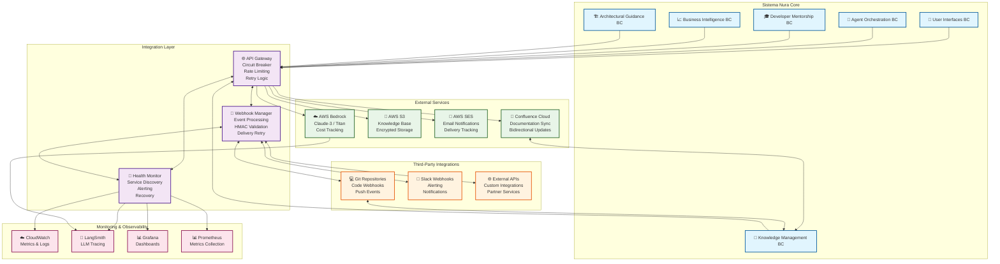

# 📡 Integration Architecture - Nura System

## 🏗️ Visión General de Integración

Arquitectura de integración diseñada para conectar el sistema Nura con APIs externas, webhooks de terceros, y servicios Cloud de manera segura, resiliente y observable. Implementa patrones de integración empresarial con circuit breakers, rate limiting, y fallback mechanisms.

## 🏗️ Arquitectura de Alto Nivel



## Objetivos y Responsabilidades

### **🎯 Objetivo Principal**
Proporcionar una **capa de integración robusta y observable** que conecte el sistema Nura con servicios externos de manera segura, resiliente y escalable, manteniendo alta disponibilidad y performance.

### **📋 Responsabilidades Clave**

#### 1. **API Gateway Unificado**
- **Proxy inteligente** para todas las llamadas a APIs externas
- **Circuit breaker** y rate limiting por servicio
- **Retry logic** con exponential backoff
- **Observabilidad completa** de métricas y costos
- **Fallback mechanisms** para degradación elegante

#### 2. **Webhook Management System**
- **Procesamiento de eventos** entrantes y salientes
- **Validación HMAC** de firmas de seguridad
- **Rate limiting** y throttling protection
- **Retry delivery** con exponential backoff
- **Event routing** a handlers específicos

#### 3. **Health Monitoring**
- **Health checks** automatizados cada 5 minutos
- **Circuit breaker** management y recovery
- **Alerting multi-canal** (Slack, email, dashboards)
- **Performance metrics** y SLA tracking
- **Service discovery** y dependency mapping

#### 4. **External Service Integrations**
- **AWS Bedrock**: LLM orchestration con cost tracking
- **AWS S3**: Knowledge base storage con encriptación
- **AWS SES**: Email notifications con delivery tracking
- **Confluence**: Documentation sync bidireccional
- **Git Repositories**: Code change webhooks

### **🔧 Patrones de Integración Enterprise**

#### **Circuit Breaker Pattern**
- Previene cascading failures entre servicios
- Recovery automático basado en health checks
- Fallback strategies para maintaining functionality

#### **Retry with Exponential Backoff**
- Manejo resiliente de fallas temporales
- Jitter para evitar thundering herd
- Max retry limits para prevenir resource exhaustion

#### 🔄 **Event-Driven Architecture**
- Webhooks para sincronización real-time
- Asynchronous processing para performance
- Event sourcing para audit trails

#### **Rate Limiting y Throttling**
- Protection contra abuse y overload
- Per-service limits basados en SLAs
- Dynamic adjustment basado en performance

### **📊 Observabilidad y Monitoring**

#### **Métricas Clave**
- **Response Time**: <5s threshold para external APIs
- **Error Rate**: <5% threshold para service calls
- **Availability**: >95% uptime para critical services
- **Cost Tracking**: Real-time LLM usage y AWS costs

#### **Alerting Strategy**
- **High Severity**: Service outages, security breaches
- **Medium Severity**: Performance degradation, rate limiting
- **Low Severity**: Configuration changes, maintenance windows

#### 📈 **Dashboard Components**
- Service health status overview
- Response time trends y percentiles
- Error rate trends por service
- Cost analysis y budget tracking
- Circuit breaker states

### **🔒 Security y Compliance**

#### **Authentication & Authorization**
- API key management con rotation
- OAuth 2.0 para third-party services
- Role-based access control para admin functions

#### **Data Protection**
- Encryption in transit (TLS 1.3)
- Encryption at rest (AES-256)
- HMAC signature validation para webhooks
- Audit logging de todas las integraciones

#### **Compliance Requirements**
- GDPR compliance para data handling
- SOC 2 compliance para security controls
- Industry-specific compliance (HIPAA, PCI-DSS)

---

## 1. API Gateway y Proxy Layer

### API Gateway Configuration

```python
# src/infrastructure/integration/api_gateway.py
from typing import Dict, List, Optional, Any
from dataclasses import dataclass
from enum import Enum
import asyncio
import aiohttp
from datetime import datetime, timedelta
import json

class IntegrationStatus(Enum):
    ACTIVE = "active"
    DEGRADED = "degraded"  
    CIRCUIT_OPEN = "circuit_open"
    MAINTENANCE = "maintenance"

@dataclass
class ExternalService:
    name: str
    base_url: str
    api_key: str
    rate_limit_per_minute: int
    timeout_seconds: int
    circuit_breaker_threshold: int
    health_check_endpoint: str
    fallback_enabled: bool

class NuraAPIGateway:
    """
    Unified API Gateway para todas las integraciones externas
    Implementa circuit breaker, rate limiting, y observability
    """
    
    def __init__(self):
        self.services: Dict[str, ExternalService] = {}
        self.circuit_states: Dict[str, Dict] = {}
        self.rate_limits: Dict[str, List[datetime]] = {}
        self.metrics_collector = None
        
    async def register_service(self, service: ExternalService):
        """Registra un servicio externo con su configuración"""
        self.services[service.name] = service
        self.circuit_states[service.name] = {
            "status": IntegrationStatus.ACTIVE,
            "failure_count": 0,
            "last_failure": None,
            "next_retry": None
        }
        self.rate_limits[service.name] = []
    
    async def call_external_api(
        self, 
        service_name: str, 
        endpoint: str, 
        method: str = "GET",
        payload: Optional[Dict[str, Any]] = None,
        headers: Optional[Dict[str, str]] = None,
        retry_count: int = 3
    ) -> Dict[str, Any]:
        """
        Proxy inteligente para llamadas a APIs externas
        Incluye circuit breaker, rate limiting, y métricas
        """
        
        service = self.services.get(service_name)
        if not service:
            raise ValueError(f"Service {service_name} not registered")
        
        # Check circuit breaker
        if await self._is_circuit_open(service_name):
            if service.fallback_enabled:
                return await self._execute_fallback(service_name, endpoint, payload)
            else:
                raise ServiceUnavailableError(f"Circuit breaker open for {service_name}")
        
        # Check rate limiting
        if not await self._check_rate_limit(service_name):
            raise RateLimitExceededError(f"Rate limit exceeded for {service_name}")
        
        # Execute request with retries
        for attempt in range(retry_count + 1):
            try:
                start_time = datetime.utcnow()
                
                async with aiohttp.ClientSession() as session:
                    url = f"{service.base_url}{endpoint}"
                    request_headers = {
                        "Authorization": f"Bearer {service.api_key}",
                        "Content-Type": "application/json",
                        "User-Agent": "Nura-Integration/1.0",
                        **(headers or {})
                    }
                    
                    timeout = aiohttp.ClientTimeout(total=service.timeout_seconds)
                    
                    async with session.request(
                        method=method,
                        url=url,
                        json=payload,
                        headers=request_headers,
                        timeout=timeout
                    ) as response:
                        
                        response_time = (datetime.utcnow() - start_time).total_seconds()
                        
                        if response.status >= 400:
                            await self._record_failure(service_name, response.status)
                            if attempt == retry_count:
                                raise ExternalServiceError(
                                    f"API call failed after {retry_count + 1} attempts: {response.status}"
                                )
                            continue
                        
                        result = await response.json()
                        
                        # Record success metrics
                        await self._record_success(service_name, response_time)
                        
                        return {
                            "success": True,
                            "data": result,
                            "metadata": {
                                "service": service_name,
                                "response_time": response_time,
                                "status_code": response.status,
                                "attempt": attempt + 1
                            }
                        }
                        
            except asyncio.TimeoutError:
                await self._record_failure(service_name, "timeout")
                if attempt == retry_count:
                    raise TimeoutError(f"Request timeout for {service_name}")
                    
            except Exception as e:
                await self._record_failure(service_name, str(e))
                if attempt == retry_count:
                    raise ExternalServiceError(f"Unexpected error: {str(e)}")
        
        # Should not reach here
        raise ExternalServiceError("Maximum retries exceeded")
    
    async def _is_circuit_open(self, service_name: str) -> bool:
        """Verifica si el circuit breaker está abierto para un servicio"""
        circuit = self.circuit_states[service_name]
        service = self.services[service_name]
        
        if circuit["status"] == IntegrationStatus.CIRCUIT_OPEN:
            # Check if it's time to retry
            if circuit["next_retry"] and datetime.utcnow() >= circuit["next_retry"]:
                circuit["status"] = IntegrationStatus.DEGRADED
                return False
            return True
            
        # Check if we should open the circuit
        if circuit["failure_count"] >= service.circuit_breaker_threshold:
            circuit["status"] = IntegrationStatus.CIRCUIT_OPEN
            circuit["next_retry"] = datetime.utcnow() + timedelta(minutes=5)
            return True
            
        return False
    
    async def _check_rate_limit(self, service_name: str) -> bool:
        """Verifica y aplica rate limiting por servicio"""
        service = self.services[service_name]
        now = datetime.utcnow()
        minute_ago = now - timedelta(minutes=1)
        
        # Clean old requests
        self.rate_limits[service_name] = [
            req_time for req_time in self.rate_limits[service_name] 
            if req_time > minute_ago
        ]
        
        # Check if we can make another request
        if len(self.rate_limits[service_name]) >= service.rate_limit_per_minute:
            return False
        
        # Record this request
        self.rate_limits[service_name].append(now)
        return True
    
    async def _record_success(self, service_name: str, response_time: float):
        """Registra una llamada exitosa y resetea circuit breaker si necesario"""
        circuit = self.circuit_states[service_name]
        circuit["failure_count"] = 0
        circuit["status"] = IntegrationStatus.ACTIVE
        circuit["last_failure"] = None
        
        # Record metrics
        if self.metrics_collector:
            await self.metrics_collector.record_api_success(
                service_name, response_time
            )
    
    async def _record_failure(self, service_name: str, error: str):
        """Registra una falla y actualiza circuit breaker state"""
        circuit = self.circuit_states[service_name]
        circuit["failure_count"] += 1
        circuit["last_failure"] = datetime.utcnow()
        
        # Record metrics
        if self.metrics_collector:
            await self.metrics_collector.record_api_failure(
                service_name, error
            )
    
    async def _execute_fallback(
        self, 
        service_name: str, 
        endpoint: str, 
        payload: Optional[Dict[str, Any]]
    ) -> Dict[str, Any]:
        """Ejecuta fallback strategy cuando el servicio principal falla"""
        # Implementation depends on service type
        # Could be cached response, default values, or alternative service
        return {
            "success": True,
            "data": {"message": f"Fallback response for {service_name}"},
            "metadata": {
                "service": service_name,
                "fallback": True,
                "timestamp": datetime.utcnow().isoformat()
            }
        }
    
    async def health_check_all_services(self) -> Dict[str, Any]:
        """Ejecuta health check en todos los servicios registrados"""
        results = {}
        
        for service_name, service in self.services.items():
            try:
                start_time = datetime.utcnow()
                result = await self.call_external_api(
                    service_name, 
                    service.health_check_endpoint,
                    retry_count=1
                )
                response_time = (datetime.utcnow() - start_time).total_seconds()
                
                results[service_name] = {
                    "status": "healthy",
                    "response_time": response_time,
                    "last_check": datetime.utcnow().isoformat()
                }
                
            except Exception as e:
                results[service_name] = {
                    "status": "unhealthy",
                    "error": str(e),
                    "last_check": datetime.utcnow().isoformat()
                }
        
        return results
```

---

## 2. External Service Integrations

### AWS Services Integration

```python
# src/infrastructure/integration/aws_services.py
import boto3
from botocore.exceptions import ClientError
import asyncio
from typing import Dict, List, Optional, Any

class AWSIntegrationManager:
    """
    Gestiona integraciones con servicios AWS
    Bedrock, S3, CloudWatch, SES, etc.
    """
    
    def __init__(self, aws_config: Dict[str, str]):
        self.aws_config = aws_config
        self.bedrock_client = None
        self.s3_client = None
        self.cloudwatch_client = None
        self.ses_client = None
        
    async def initialize_clients(self):
        """Inicializa clientes AWS de manera lazy"""
        session = boto3.Session(
            aws_access_key_id=self.aws_config["access_key"],
            aws_secret_access_key=self.aws_config["secret_key"],
            region_name=self.aws_config["region"]
        )
        
        self.bedrock_client = session.client("bedrock-runtime")
        self.s3_client = session.client("s3")
        self.cloudwatch_client = session.client("cloudwatch")
        self.ses_client = session.client("ses")
    
    async def invoke_bedrock_model(
        self, 
        model_id: str, 
        prompt: str, 
        max_tokens: int = 1000,
        temperature: float = 0.7,
        conversation_id: str = "",
        metadata: Optional[Dict[str, Any]] = None
    ) -> Dict[str, Any]:
        """
        Invoca modelo Bedrock con observabilidad completa
        """
        try:
            import json
            
            # Prepare request based on model type
            if "claude" in model_id.lower():
                request_body = {
                    "prompt": f"Human: {prompt}\n\nAssistant:",
                    "max_tokens_to_sample": max_tokens,
                    "temperature": temperature,
                    "stop_sequences": ["Human:"]
                }
            elif "titan" in model_id.lower():
                request_body = {
                    "inputText": prompt,
                    "textGenerationConfig": {
                        "maxTokenCount": max_tokens,
                        "temperature": temperature
                    }
                }
            else:
                # Generic format
                request_body = {
                    "prompt": prompt,
                    "max_tokens": max_tokens,
                    "temperature": temperature
                }
            
            # Add conversation context if available
            if conversation_id:
                request_body["conversationId"] = conversation_id
            
            start_time = datetime.utcnow()
            
            response = self.bedrock_client.invoke_model(
                modelId=model_id,
                body=json.dumps(request_body),
                contentType="application/json",
                accept="application/json"
            )
            
            response_time = (datetime.utcnow() - start_time).total_seconds()
            
            # Parse response based on model type
            response_body = json.loads(response["body"].read())
            
            if "claude" in model_id.lower():
                generated_text = response_body.get("completion", "")
                input_tokens = response_body.get("usage", {}).get("input_tokens", 0)
                output_tokens = response_body.get("usage", {}).get("output_tokens", 0)
            elif "titan" in model_id.lower():
                generated_text = response_body.get("results", [{}])[0].get("outputText", "")
                input_tokens = response_body.get("inputTextTokenCount", 0)
                output_tokens = response_body.get("results", [{}])[0].get("tokenCount", 0)
            else:
                generated_text = response_body.get("text", "")
                input_tokens = response_body.get("input_tokens", 0)
                output_tokens = response_body.get("output_tokens", 0)
            
            # Calculate cost estimation
            cost_estimation = await self._calculate_bedrock_cost(
                model_id, input_tokens, output_tokens
            )
            
            return {
                "success": True,
                "response": generated_text,
                "metadata": {
                    "model_id": model_id,
                    "input_tokens": input_tokens,
                    "output_tokens": output_tokens,
                    "response_time": response_time,
                    "cost_usd": cost_estimation,
                    "conversation_id": conversation_id,
                    "timestamp": datetime.utcnow().isoformat(),
                    **(metadata or {})
                }
            }
            
        except ClientError as e:
            error_code = e.response['Error']['Code']
            error_message = e.response['Error']['Message']
            
            # Handle specific AWS errors
            if error_code == 'ThrottlingException':
                raise RateLimitExceededError(f"Bedrock rate limit exceeded: {error_message}")
            elif error_code == 'ValidationException':
                raise InvalidRequestError(f"Invalid Bedrock request: {error_message}")
            else:
                raise ExternalServiceError(f"Bedrock error {error_code}: {error_message}")
                
        except Exception as e:
            raise ExternalServiceError(f"Unexpected Bedrock error: {str(e)}")
    
    async def _calculate_bedrock_cost(
        self, 
        model_id: str, 
        input_tokens: int, 
        output_tokens: int
    ) -> float:
        """Calcula costo estimado de llamada Bedrock"""
        # Pricing per 1000 tokens (approximate, as of 2024)
        pricing = {
            "anthropic.claude-3-sonnet": {"input": 0.003, "output": 0.015},
            "anthropic.claude-3-haiku": {"input": 0.00025, "output": 0.00125},
            "amazon.titan-text-lite-v1": {"input": 0.0003, "output": 0.0004},
            "amazon.titan-text-express-v1": {"input": 0.0008, "output": 0.0016}
        }
        
        model_pricing = pricing.get(model_id, {"input": 0.001, "output": 0.002})
        
        input_cost = (input_tokens / 1000) * model_pricing["input"]
        output_cost = (output_tokens / 1000) * model_pricing["output"]
        
        return round(input_cost + output_cost, 6)
    
    async def upload_to_s3(
        self, 
        bucket_name: str, 
        key: str, 
        content: bytes,
        content_type: str = "application/octet-stream",
        metadata: Optional[Dict[str, str]] = None
    ) -> Dict[str, Any]:
        """Sube archivo a S3 con metadata y observabilidad"""
        try:
            start_time = datetime.utcnow()
            
            self.s3_client.put_object(
                Bucket=bucket_name,
                Key=key,
                Body=content,
                ContentType=content_type,
                Metadata=metadata or {},
                ServerSideEncryption='AES256'
            )
            
            upload_time = (datetime.utcnow() - start_time).total_seconds()
            
            return {
                "success": True,
                "s3_uri": f"s3://{bucket_name}/{key}",
                "size_bytes": len(content),
                "upload_time": upload_time,
                "timestamp": datetime.utcnow().isoformat()
            }
            
        except ClientError as e:
            raise ExternalServiceError(f"S3 upload failed: {str(e)}")
    
    async def send_notification_email(
        self, 
        to_emails: List[str], 
        subject: str, 
        html_body: str,
        text_body: Optional[str] = None
    ) -> Dict[str, Any]:
        """Envía email via SES con tracking"""
        try:
            response = self.ses_client.send_email(
                Source=self.aws_config.get("ses_from_email", "noreply@nura.ai"),
                Destination={'ToAddresses': to_emails},
                Message={
                    'Subject': {'Data': subject, 'Charset': 'UTF-8'},
                    'Body': {
                        'Html': {'Data': html_body, 'Charset': 'UTF-8'},
                        'Text': {'Data': text_body or subject, 'Charset': 'UTF-8'}
                    }
                }
            )
            
            return {
                "success": True,
                "message_id": response['MessageId'],
                "recipients": to_emails,
                "timestamp": datetime.utcnow().isoformat()
            }
            
        except ClientError as e:
            raise ExternalServiceError(f"SES email failed: {str(e)}")
```

### Confluence Integration

```python
# src/infrastructure/integration/confluence_client.py
import aiohttp
from typing import Dict, List, Optional, Any
from datetime import datetime
import base64

class ConfluenceIntegration:
    """
    Cliente para integración con Confluence Cloud API
    Permite sincronización bidireccional de documentación
    """
    
    def __init__(self, base_url: str, username: str, api_token: str):
        self.base_url = base_url.rstrip('/')
        self.auth_header = base64.b64encode(
            f"{username}:{api_token}".encode()
        ).decode()
        
    async def get_space_content(
        self, 
        space_key: str, 
        last_modified_since: Optional[datetime] = None
    ) -> List[Dict[str, Any]]:
        """
        Obtiene contenido de un space de Confluence
        Opcionalmente filtrado por fecha de modificación
        """
        
        url = f"{self.base_url}/wiki/rest/api/content"
        headers = {
            "Authorization": f"Basic {self.auth_header}",
            "Accept": "application/json"
        }
        
        params = {
            "spaceKey": space_key,
            "expand": "body.storage,version,space,ancestors",
            "limit": 100,
            "type": "page"
        }
        
        if last_modified_since:
            params["lastModified"] = last_modified_since.isoformat()
        
        pages = []
        start = 0
        
        async with aiohttp.ClientSession() as session:
            while True:
                params["start"] = start
                
                async with session.get(url, headers=headers, params=params) as response:
                    if response.status != 200:
                        raise ExternalServiceError(
                            f"Confluence API error: {response.status}"
                        )
                    
                    data = await response.json()
                    batch_pages = data.get("results", [])
                    
                    if not batch_pages:
                        break
                    
                    # Process and clean page data
                    for page in batch_pages:
                        processed_page = {
                            "id": page["id"],
                            "title": page["title"],
                            "content": page["body"]["storage"]["value"],
                            "space_key": page["space"]["key"],
                            "url": f"{self.base_url}{page['_links']['webui']}",
                            "version": page["version"]["number"],
                            "last_modified": page["version"]["when"],
                            "author": page["version"]["by"]["displayName"],
                            "ancestors": [
                                {"id": ancestor["id"], "title": ancestor["title"]}
                                for ancestor in page.get("ancestors", [])
                            ]
                        }
                        
                        pages.append(processed_page)
                    
                    start += len(batch_pages)
                    
                    # Check if there are more pages
                    if start >= data.get("size", 0):
                        break
        
        return pages
    
    async def search_content(
        self, 
        query: str, 
        space_key: Optional[str] = None,
        content_type: str = "page"
    ) -> List[Dict[str, Any]]:
        """Busca contenido en Confluence usando CQL"""
        
        cql_query = f'text ~ "{query}" AND type = {content_type}'
        if space_key:
            cql_query += f' AND space = "{space_key}"'
        
        url = f"{self.base_url}/wiki/rest/api/content/search"
        headers = {
            "Authorization": f"Basic {self.auth_header}",
            "Accept": "application/json"
        }
        
        params = {
            "cql": cql_query,
            "expand": "body.storage,version,space",
            "limit": 50
        }
        
        async with aiohttp.ClientSession() as session:
            async with session.get(url, headers=headers, params=params) as response:
                if response.status != 200:
                    raise ExternalServiceError(
                        f"Confluence search error: {response.status}"
                    )
                
                data = await response.json()
                return data.get("results", [])
    
    async def create_page(
        self, 
        space_key: str, 
        title: str, 
        content: str,
        parent_id: Optional[str] = None
    ) -> Dict[str, Any]:
        """Crea nueva página en Confluence"""
        
        url = f"{self.base_url}/wiki/rest/api/content"
        headers = {
            "Authorization": f"Basic {self.auth_header}",
            "Content-Type": "application/json"
        }
        
        page_data = {
            "type": "page",
            "title": title,
            "space": {"key": space_key},
            "body": {
                "storage": {
                    "value": content,
                    "representation": "storage"
                }
            }
        }
        
        if parent_id:
            page_data["ancestors"] = [{"id": parent_id}]
        
        async with aiohttp.ClientSession() as session:
            async with session.post(url, headers=headers, json=page_data) as response:
                if response.status != 200:
                    error_text = await response.text()
                    raise ExternalServiceError(
                        f"Failed to create Confluence page: {response.status} - {error_text}"
                    )
                
                return await response.json()
    
    async def update_page(
        self, 
        page_id: str, 
        title: str, 
        content: str,
        version_number: int
    ) -> Dict[str, Any]:
        """Actualiza página existente en Confluence"""
        
        url = f"{self.base_url}/wiki/rest/api/content/{page_id}"
        headers = {
            "Authorization": f"Basic {self.auth_header}",
            "Content-Type": "application/json"
        }
        
        page_data = {
            "id": page_id,
            "type": "page",
            "title": title,
            "body": {
                "storage": {
                    "value": content,
                    "representation": "storage"
                }
            },
            "version": {
                "number": version_number + 1
            }
        }
        
        async with aiohttp.ClientSession() as session:
            async with session.put(url, headers=headers, json=page_data) as response:
                if response.status != 200:
                    error_text = await response.text()
                    raise ExternalServiceError(
                        f"Failed to update Confluence page: {response.status} - {error_text}"
                    )
                
                return await response.json()
```

---

## 3. Webhook Management System

### Webhook Registry and Handler

```python
# src/infrastructure/integration/webhook_manager.py
from typing import Dict, List, Optional, Any, Callable
from dataclasses import dataclass
from enum import Enum
import asyncio
import hmac
import hashlib
import json
from datetime import datetime, timedelta

class WebhookEventType(Enum):
    CONFLUENCE_PAGE_UPDATED = "confluence.page.updated"
    CODEBASE_PUSH = "git.push"
    USER_ACTIVITY = "user.activity"
    SYSTEM_ALERT = "system.alert"
    EXTERNAL_INTEGRATION = "external.integration"

@dataclass
class WebhookEndpoint:
    name: str
    url_path: str
    event_types: List[WebhookEventType]
    secret_key: str
    enabled: bool
    rate_limit_per_minute: int
    retry_attempts: int
    timeout_seconds: int

class WebhookManager:
    """
    Sistema centralizado para manejo de webhooks entrantes y salientes
    Incluye validación, rate limiting, y retry logic
    """
    
    def __init__(self):
        self.endpoints: Dict[str, WebhookEndpoint] = {}
        self.handlers: Dict[WebhookEventType, List[Callable]] = {}
        self.rate_limits: Dict[str, List[datetime]] = {}
        self.failed_deliveries: List[Dict[str, Any]] = []
        
    def register_endpoint(self, endpoint: WebhookEndpoint):
        """Registra un webhook endpoint"""
        self.endpoints[endpoint.name] = endpoint
        self.rate_limits[endpoint.name] = []
        
        # Register URL route in FastAPI
        # This would be called during application startup
        
    def register_handler(
        self, 
        event_type: WebhookEventType, 
        handler: Callable[[Dict[str, Any]], Any]
    ):
        """Registra handler para tipo de evento específico"""
        if event_type not in self.handlers:
            self.handlers[event_type] = []
        self.handlers[event_type].append(handler)
    
    async def process_incoming_webhook(
        self, 
        endpoint_name: str, 
        payload: Dict[str, Any],
        headers: Dict[str, str],
        request_ip: str
    ) -> Dict[str, Any]:
        """
        Procesa webhook entrante con validación y rate limiting
        """
        
        endpoint = self.endpoints.get(endpoint_name)
        if not endpoint or not endpoint.enabled:
            raise WebhookError(f"Endpoint {endpoint_name} not found or disabled")
        
        # Rate limiting check
        if not await self._check_webhook_rate_limit(endpoint_name):
            raise RateLimitExceededError(f"Rate limit exceeded for {endpoint_name}")
        
        # Signature validation
        if not await self._validate_webhook_signature(endpoint, payload, headers):
            raise UnauthorizedError("Invalid webhook signature")
        
        # Extract event type
        event_type_str = payload.get("event_type") or headers.get("X-Event-Type")
        if not event_type_str:
            raise WebhookError("Event type not specified")
        
        try:
            event_type = WebhookEventType(event_type_str)
        except ValueError:
            raise WebhookError(f"Unknown event type: {event_type_str}")
        
        # Check if endpoint accepts this event type
        if event_type not in endpoint.event_types:
            raise WebhookError(f"Endpoint {endpoint_name} does not accept {event_type.value}")
        
        # Process event
        try:
            results = []
            
            if event_type in self.handlers:
                for handler in self.handlers[event_type]:
                    result = await handler(payload)
                    results.append(result)
            
            # Log successful processing
            await self._log_webhook_event(
                endpoint_name, event_type, payload, "success", request_ip
            )
            
            return {
                "status": "processed",
                "event_type": event_type.value,
                "handler_results": results,
                "timestamp": datetime.utcnow().isoformat()
            }
            
        except Exception as e:
            # Log error
            await self._log_webhook_event(
                endpoint_name, event_type, payload, f"error: {str(e)}", request_ip
            )
            raise WebhookProcessingError(f"Error processing webhook: {str(e)}")
    
    async def send_outgoing_webhook(
        self, 
        target_url: str, 
        event_type: WebhookEventType,
        payload: Dict[str, Any],
        secret_key: Optional[str] = None,
        retry_attempts: int = 3
    ) -> Dict[str, Any]:
        """
        Envía webhook a endpoint externo con retry logic
        """
        
        # Prepare headers
        headers = {
            "Content-Type": "application/json",
            "X-Event-Type": event_type.value,
            "X-Timestamp": str(int(datetime.utcnow().timestamp())),
            "User-Agent": "Nura-Webhook/1.0"
        }
        
        # Add signature if secret provided
        if secret_key:
            signature = await self._generate_webhook_signature(payload, secret_key)
            headers["X-Signature"] = signature
        
        # Attempt delivery with retries
        for attempt in range(retry_attempts + 1):
            try:
                async with aiohttp.ClientSession() as session:
                    async with session.post(
                        target_url,
                        json=payload,
                        headers=headers,
                        timeout=aiohttp.ClientTimeout(total=30)
                    ) as response:
                        
                        if response.status >= 200 and response.status < 300:
                            return {
                                "success": True,
                                "status_code": response.status,
                                "attempt": attempt + 1,
                                "timestamp": datetime.utcnow().isoformat()
                            }
                        else:
                            if attempt == retry_attempts:
                                raise WebhookDeliveryError(
                                    f"Webhook delivery failed after {retry_attempts + 1} attempts: {response.status}"
                                )
                            
                            # Exponential backoff
                            await asyncio.sleep(2 ** attempt)
                            
            except asyncio.TimeoutError:
                if attempt == retry_attempts:
                    raise TimeoutError("Webhook delivery timeout")
                await asyncio.sleep(2 ** attempt)
                
            except Exception as e:
                if attempt == retry_attempts:
                    raise WebhookDeliveryError(f"Webhook delivery error: {str(e)}")
                await asyncio.sleep(2 ** attempt)
        
        # Record failed delivery for later retry
        await self._record_failed_delivery(target_url, event_type, payload)
        
        return {
            "success": False,
            "error": "Max retries exceeded",
            "timestamp": datetime.utcnow().isoformat()
        }
    
    async def _validate_webhook_signature(
        self, 
        endpoint: WebhookEndpoint, 
        payload: Dict[str, Any],
        headers: Dict[str, str]
    ) -> bool:
        """Valida firma HMAC del webhook"""
        
        received_signature = headers.get("X-Signature") or headers.get("x-signature")
        if not received_signature:
            return False
        
        expected_signature = await self._generate_webhook_signature(
            payload, endpoint.secret_key
        )
        
        return hmac.compare_digest(received_signature, expected_signature)
    
    async def _generate_webhook_signature(
        self, 
        payload: Dict[str, Any], 
        secret_key: str
    ) -> str:
        """Genera firma HMAC-SHA256 para webhook"""
        
        payload_string = json.dumps(payload, sort_keys=True, separators=(',', ':'))
        signature = hmac.new(
            secret_key.encode(),
            payload_string.encode(),
            hashlib.sha256
        ).hexdigest()
        
        return f"sha256={signature}"
    
    async def _check_webhook_rate_limit(self, endpoint_name: str) -> bool:
        """Verifica rate limiting para webhook endpoint"""
        endpoint = self.endpoints[endpoint_name]
        now = datetime.utcnow()
        minute_ago = now - timedelta(minutes=1)
        
        # Clean old requests
        self.rate_limits[endpoint_name] = [
            req_time for req_time in self.rate_limits[endpoint_name]
            if req_time > minute_ago
        ]
        
        # Check limit
        if len(self.rate_limits[endpoint_name]) >= endpoint.rate_limit_per_minute:
            return False
        
        # Record this request
        self.rate_limits[endpoint_name].append(now)
        return True
    
    async def _log_webhook_event(
        self, 
        endpoint_name: str, 
        event_type: WebhookEventType,
        payload: Dict[str, Any], 
        status: str, 
        source_ip: str
    ):
        """Registra evento de webhook para observabilidad"""
        
        log_entry = {
            "timestamp": datetime.utcnow().isoformat(),
            "endpoint": endpoint_name,
            "event_type": event_type.value,
            "status": status,
            "source_ip": source_ip,
            "payload_size": len(json.dumps(payload)),
            "payload_hash": hashlib.md5(
                json.dumps(payload, sort_keys=True).encode()
            ).hexdigest()
        }
        
        # Send to monitoring system
        # await self.monitoring_service.log_webhook_event(log_entry)
    
    async def _record_failed_delivery(
        self, 
        target_url: str, 
        event_type: WebhookEventType,
        payload: Dict[str, Any]
    ):
        """Registra delivery fallido para retry posterior"""
        
        failed_delivery = {
            "target_url": target_url,
            "event_type": event_type.value,
            "payload": payload,
            "failed_at": datetime.utcnow(),
            "retry_count": 0,
            "next_retry": datetime.utcnow() + timedelta(minutes=5)
        }
        
        self.failed_deliveries.append(failed_delivery)
    
    async def retry_failed_deliveries(self):
        """
        Background task para reintentar deliveries fallidos
        Ejecuta cada 5 minutos
        """
        
        now = datetime.utcnow()
        deliveries_to_retry = [
            delivery for delivery in self.failed_deliveries
            if delivery["next_retry"] <= now and delivery["retry_count"] < 5
        ]
        
        for delivery in deliveries_to_retry:
            try:
                result = await self.send_outgoing_webhook(
                    delivery["target_url"],
                    WebhookEventType(delivery["event_type"]),
                    delivery["payload"],
                    retry_attempts=1
                )
                
                if result["success"]:
                    # Remove from failed list
                    self.failed_deliveries.remove(delivery)
                else:
                    # Update for next retry
                    delivery["retry_count"] += 1
                    delivery["next_retry"] = now + timedelta(
                        minutes=5 * (2 ** delivery["retry_count"])
                    )
                    
            except Exception as e:
                # Update retry info
                delivery["retry_count"] += 1
                delivery["last_error"] = str(e)
                
                if delivery["retry_count"] >= 5:
                    # Max retries reached, remove from list
                    self.failed_deliveries.remove(delivery)
                    # Log permanent failure
                else:
                    delivery["next_retry"] = now + timedelta(
                        minutes=5 * (2 ** delivery["retry_count"])
                    )
```

---

## 4. Integration Monitoring y Health Checks

### Service Health Monitoring

```python
# src/infrastructure/integration/health_monitor.py
from typing import Dict, List, Optional, Any
import asyncio
from datetime import datetime, timedelta
from enum import Enum

class HealthStatus(Enum):
    HEALTHY = "healthy"
    DEGRADED = "degraded"
    UNHEALTHY = "unhealthy"
    UNKNOWN = "unknown"

class IntegrationHealthMonitor:
    """
    Monitor de salud para todas las integraciones externas
    Incluye circuit breakers, alerting, y recovery automation
    """
    
    def __init__(self, api_gateway, webhook_manager):
        self.api_gateway = api_gateway
        self.webhook_manager = webhook_manager
        self.health_status: Dict[str, Dict[str, Any]] = {}
        self.alert_thresholds = {
            "response_time": 5.0,  # seconds
            "error_rate": 0.05,    # 5%
            "availability": 0.95   # 95%
        }
        
    async def monitor_all_integrations(self) -> Dict[str, Any]:
        """
        Ejecuta health check completo de todas las integraciones
        """
        
        health_report = {
            "timestamp": datetime.utcnow().isoformat(),
            "overall_status": HealthStatus.HEALTHY.value,
            "services": {},
            "alerts": [],
            "metrics": {}
        }
        
        # Check API Gateway services
        api_health = await self.api_gateway.health_check_all_services()
        
        for service_name, service_health in api_health.items():
            health_report["services"][service_name] = {
                "type": "api_service",
                "status": service_health["status"],
                "response_time": service_health.get("response_time"),
                "last_check": service_health["last_check"],
                "error": service_health.get("error")
            }
            
            # Check if alert needed
            if service_health["status"] != "healthy":
                health_report["alerts"].append({
                    "service": service_name,
                    "type": "service_unhealthy",
                    "message": f"Service {service_name} is {service_health['status']}",
                    "severity": "high" if service_health["status"] == "unhealthy" else "medium"
                })
        
        # Check webhook endpoints
        webhook_health = await self._check_webhook_health()
        health_report["services"]["webhooks"] = webhook_health
        
        # Check database connectivity
        db_health = await self._check_database_health()
        health_report["services"]["database"] = db_health
        
        # Check external APIs specifically
        external_health = await self._check_external_apis()
        health_report["services"].update(external_health)
        
        # Calculate overall metrics
        health_report["metrics"] = await self._calculate_health_metrics()
        
        # Determine overall status
        unhealthy_services = [
            s for s in health_report["services"].values() 
            if s["status"] == "unhealthy"
        ]
        degraded_services = [
            s for s in health_report["services"].values() 
            if s["status"] == "degraded"
        ]
        
        if unhealthy_services:
            health_report["overall_status"] = HealthStatus.UNHEALTHY.value
        elif degraded_services:
            health_report["overall_status"] = HealthStatus.DEGRADED.value
        
        # Store current health state
        self.health_status = health_report
        
        # Send alerts if needed
        if health_report["alerts"]:
            await self._send_health_alerts(health_report["alerts"])
        
        return health_report
    
    async def _check_webhook_health(self) -> Dict[str, Any]:
        """Verifica salud del sistema de webhooks"""
        
        try:
            # Check if webhook endpoints are responding
            active_endpoints = len([
                ep for ep in self.webhook_manager.endpoints.values() 
                if ep.enabled
            ])
            
            failed_deliveries = len(self.webhook_manager.failed_deliveries)
            
            status = HealthStatus.HEALTHY.value
            if failed_deliveries > 10:
                status = HealthStatus.DEGRADED.value
            elif failed_deliveries > 50:
                status = HealthStatus.UNHEALTHY.value
            
            return {
                "type": "webhook_system",
                "status": status,
                "active_endpoints": active_endpoints,
                "failed_deliveries": failed_deliveries,
                "last_check": datetime.utcnow().isoformat()
            }
            
        except Exception as e:
            return {
                "type": "webhook_system",
                "status": HealthStatus.UNHEALTHY.value,
                "error": str(e),
                "last_check": datetime.utcnow().isoformat()
            }
    
    async def _check_database_health(self) -> Dict[str, Any]:
        """Verifica conectividad y performance de la base de datos"""
        
        try:
            start_time = datetime.utcnow()
            
            # Simple query to test connection
            # result = await database.execute("SELECT 1")
            
            response_time = (datetime.utcnow() - start_time).total_seconds()
            
            status = HealthStatus.HEALTHY.value
            if response_time > 1.0:
                status = HealthStatus.DEGRADED.value
            elif response_time > 5.0:
                status = HealthStatus.UNHEALTHY.value
            
            return {
                "type": "database",
                "status": status,
                "response_time": response_time,
                "last_check": datetime.utcnow().isoformat()
            }
            
        except Exception as e:
            return {
                "type": "database",
                "status": HealthStatus.UNHEALTHY.value,
                "error": str(e),
                "last_check": datetime.utcnow().isoformat()
            }
    
    async def _check_external_apis(self) -> Dict[str, Dict[str, Any]]:
        """Verifica APIs externos críticos"""
        
        external_apis = {
            "aws_bedrock": {
                "url": "https://bedrock-runtime.us-east-1.amazonaws.com",
                "method": "POST",
                "timeout": 10
            },
            "confluence": {
                "url": f"{self.confluence_config.base_url}/wiki/rest/api/content",
                "method": "GET",
                "timeout": 5
            }
        }
        
        results = {}
        
        for api_name, config in external_apis.items():
            try:
                start_time = datetime.utcnow()
                
                async with aiohttp.ClientSession() as session:
                    timeout = aiohttp.ClientTimeout(total=config["timeout"])
                    
                    if config["method"] == "GET":
                        async with session.get(config["url"], timeout=timeout) as response:
                            response_time = (datetime.utcnow() - start_time).total_seconds()
                            
                            status = HealthStatus.HEALTHY.value
                            if response.status >= 500:
                                status = HealthStatus.UNHEALTHY.value
                            elif response.status >= 400:
                                status = HealthStatus.DEGRADED.value
                            elif response_time > config["timeout"] * 0.8:
                                status = HealthStatus.DEGRADED.value
                            
                            results[api_name] = {
                                "type": "external_api",
                                "status": status,
                                "response_time": response_time,
                                "status_code": response.status,
                                "last_check": datetime.utcnow().isoformat()
                            }
                
            except asyncio.TimeoutError:
                results[api_name] = {
                    "type": "external_api",
                    "status": HealthStatus.UNHEALTHY.value,
                    "error": "timeout",
                    "last_check": datetime.utcnow().isoformat()
                }
                
            except Exception as e:
                results[api_name] = {
                    "type": "external_api", 
                    "status": HealthStatus.UNHEALTHY.value,
                    "error": str(e),
                    "last_check": datetime.utcnow().isoformat()
                }
        
        return results
    
    async def _calculate_health_metrics(self) -> Dict[str, Any]:
        """Calcula métricas agregadas de salud del sistema"""
        
        # This would pull from your metrics store
        # For now, returning mock data structure
        
        return {
            "uptime_percentage": 99.5,
            "average_response_time": 0.25,
            "error_rate": 0.02,
            "total_requests_24h": 15420,
            "failed_requests_24h": 308,
            "circuit_breakers_open": 0,
            "services_degraded": 1,
            "services_healthy": 8
        }
    
    async def _send_health_alerts(self, alerts: List[Dict[str, Any]]):
        """Envía alertas de salud críticas"""
        
        high_severity_alerts = [
            alert for alert in alerts 
            if alert.get("severity") == "high"
        ]
        
        if high_severity_alerts:
            # Send to monitoring system, Slack, email, etc.
            alert_message = f"🚨 {len(high_severity_alerts)} critical service alerts detected:\n"
            
            for alert in high_severity_alerts:
                alert_message += f"- {alert['service']}: {alert['message']}\n"
            
            # await self.notification_service.send_alert(alert_message)
            pass

# Custom Exception Classes
class IntegrationError(Exception):
    """Base exception for integration errors"""
    pass

class ExternalServiceError(IntegrationError):
    """Error from external service"""
    pass

class ServiceUnavailableError(IntegrationError):
    """Service temporarily unavailable"""
    pass

class RateLimitExceededError(IntegrationError):
    """Rate limit exceeded"""
    pass

class TimeoutError(IntegrationError):
    """Request timeout"""
    pass

class InvalidRequestError(IntegrationError):
    """Invalid request format"""
    pass

class UnauthorizedError(IntegrationError):
    """Authentication/authorization failed"""
    pass

class WebhookError(IntegrationError):
    """Webhook processing error"""
    pass

class WebhookProcessingError(WebhookError):
    """Error processing webhook payload"""
    pass

class WebhookDeliveryError(WebhookError):
    """Error delivering webhook"""
    pass
```

---

## 5. Configuration Management

### Integration Configuration

```yaml
# config/integrations.yaml
api_gateway:
  timeout_default: 30
  retry_default: 3
  circuit_breaker_threshold: 5
  rate_limit_default: 100

external_services:
  aws:
    region: "us-east-1"
    bedrock:
      models:
        - "anthropic.claude-3-sonnet-20240229-v1:0"
        - "anthropic.claude-3-haiku-20240307-v1:0"
        - "amazon.titan-text-express-v1"
      rate_limit_per_minute: 60
      timeout_seconds: 30
      circuit_breaker_threshold: 5
      fallback_enabled: true
    
    s3:
      bucket_name: "nura-knowledge-base"
      encryption: "AES256"
      timeout_seconds: 60
    
    ses:
      from_email: "noreply@nura.ai"
      rate_limit_per_minute: 10
  
  confluence:
    base_url: "https://company.atlassian.net"
    rate_limit_per_minute: 30
    timeout_seconds: 15
    circuit_breaker_threshold: 3
    sync_interval_hours: 6
    spaces:
      - "TECH"
      - "DOCS"
      - "ARCH"

webhooks:
  incoming:
    confluence_updates:
      url_path: "/webhooks/confluence"
      event_types: ["confluence.page.updated"]
      rate_limit_per_minute: 10
      enabled: true
    
    git_updates:
      url_path: "/webhooks/git"
      event_types: ["git.push"]
      rate_limit_per_minute: 20
      enabled: true
  
  outgoing:
    retry_attempts: 3
    timeout_seconds: 30
    exponential_backoff: true

health_monitoring:
  check_interval_minutes: 5
  alert_thresholds:
    response_time_seconds: 5.0
    error_rate_percentage: 5.0
    availability_percentage: 95.0
  
  notifications:
    slack_webhook_url: "${SLACK_WEBHOOK_URL}"
    email_alerts: true
    severity_levels: ["high", "critical"]
```

---

## 📈 Resumen de Integration Architecture

### **Características Principales**

1. **API Gateway Unificado**: Proxy inteligente con circuit breakers, rate limiting, y observabilidad
2. **AWS Services Integration**: Cliente robusto para Bedrock, S3, CloudWatch, SES con cost tracking
3. **Confluence Sync**: Integración bidireccional para documentación con versionado
4. **Webhook Management**: Sistema completo de webhooks entrantes/salientes con retry logic
5. **Health Monitoring**: Monitoreo integral con alerting y recovery automation

### **Patrones de Integración**

- **Circuit Breaker Pattern**: Previene cascading failures
- **Retry with Exponential Backoff**: Manejo resiliente de fallas temporales
- **Rate Limiting**: Protección contra abuse y throttling
- **Fallback Mechanisms**: Degradación elegante cuando servicios fallan
- **Event-Driven Architecture**: Webhooks para sincronización real-time

### **Observabilidad y Monitoring**

- Métricas completas de performance por servicio
- Cost tracking para llamadas LLM/AWS
- Health checks automatizados cada 5 minutos
- Alerting multi-canal (Slack, email, dashboard)
- Circuit breaker states y recovery tracking

### **Security y Compliance**

- Validación HMAC para webhooks
- Encriptación en tránsito y reposo
- API key rotation support
- Rate limiting para prevenir abuse
- Audit logging de todas las integraciones

Esta arquitectura proporciona una base sólida para integración empresarial, asegurando reliability, observability, y security en todas las conexiones externas del sistema Nura.