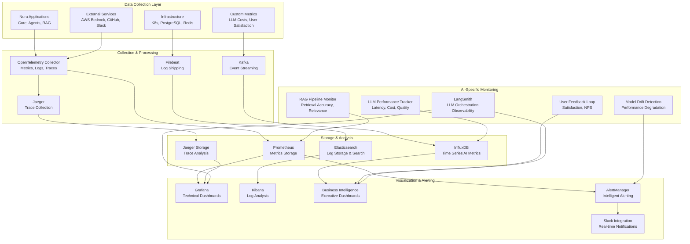

# 📈 Monitoring & Observability - Nura System

## 📈 Estrategia de Observabilidad Integral

**Observability Philosophy**: Full-stack observability con monitoring proactivo, alertas inteligentes y insights accionables para sistemas AI/LLM en producción.

**Core Pillars**:
- **Metrics**: Business + Technical + AI/LLM specific metrics
- **Logs**: Structured logging con correlation IDs y context tracking
- **Traces**: Distributed tracing cross-service con LLM call tracking
- **Events**: Business events y system events en real-time
- **Dashboards**: Role-based dashboards con insights automatizados

---

## 🏗️ Observability Architecture Overview



---

## AI/LLM Specific Metrics

### LLM Performance & Cost Tracking

```python
# src/backend/nura-core/src/monitoring/llm_metrics.py
import time
import asyncio
from typing import Dict, Any, List, Optional
from dataclasses import dataclass, asdict
from datetime import datetime, timedelta
import logging
from prometheus_client import Counter, Histogram, Gauge, Summary
import json
from enum import Enum

logger = logging.getLogger(__name__)

class LLMProvider(Enum):
    BEDROCK_CLAUDE3_SONNET = "bedrock_claude3_sonnet"
    BEDROCK_CLAUDE3_HAIKU = "bedrock_claude3_haiku"
    BEDROCK_LLAMA2_70B = "bedrock_llama2_70b"
    BEDROCK_TITAN = "bedrock_titan"
    SAGEMAKER_CUSTOM = "sagemaker_custom"

@dataclass
class LLMCallMetrics:
    """Métricas para llamadas a LLM"""
    call_id: str
    provider: str
    model: str
    prompt_tokens: int
    completion_tokens: int
    total_tokens: int
    latency_ms: float
    cost_usd: float
    user_id: str
    conversation_id: str
    agent_type: str
    success: bool
    error_type: Optional[str] = None
    quality_score: Optional[float] = None
    user_satisfaction: Optional[int] = None  # 1-5 rating
    timestamp: datetime = None

    def __post_init__(self):
        if self.timestamp is None:
            self.timestamp = datetime.utcnow()

class LLMMetricsCollector:
    """Collector de métricas específicas para LLM"""
    
    def __init__(self):
        # Prometheus metrics
        self.llm_calls_total = Counter(
            'nura_llm_calls_total',
            'Total number of LLM calls',
            ['provider', 'model', 'agent_type', 'status']
        )
        
        self.llm_tokens_total = Counter(
            'nura_llm_tokens_total',
            'Total number of tokens processed',
            ['provider', 'model', 'token_type']  # prompt, completion
        )
        
        self.llm_cost_total = Counter(
            'nura_llm_cost_usd_total',
            'Total cost in USD for LLM calls',
            ['provider', 'model']
        )
        
        self.llm_latency = Histogram(
            'nura_llm_latency_seconds',
            'LLM call latency in seconds',
            ['provider', 'model'],
            buckets=[0.1, 0.5, 1.0, 2.0, 5.0, 10.0, 30.0, 60.0]
        )
        
        self.llm_quality_score = Histogram(
            'nura_llm_quality_score',
            'LLM response quality score (0-1)',
            ['provider', 'model'],
            buckets=[0.1, 0.2, 0.3, 0.4, 0.5, 0.6, 0.7, 0.8, 0.9, 1.0]
        )
        
        self.user_satisfaction = Histogram(
            'nura_user_satisfaction',
            'User satisfaction rating (1-5)',
            ['agent_type'],
            buckets=[1, 2, 3, 4, 5]
        )
        
        # Current gauges
        self.active_llm_calls = Gauge(
            'nura_active_llm_calls',
            'Number of currently active LLM calls',
            ['provider']
        )
        
        self.tokens_per_minute = Gauge(
            'nura_tokens_per_minute',
            'Tokens processed per minute',
            ['provider', 'model']
        )
        
        self.cost_per_hour = Gauge(
            'nura_cost_per_hour_usd',
            'Cost per hour in USD',
            ['provider']
        )
        
        # Cost tracking por modelo
        self.cost_per_token = {
            LLMProvider.BEDROCK_CLAUDE3_SONNET: {
                'input': 0.000003,   # $3 per 1M input tokens
                'output': 0.000015   # $15 per 1M output tokens
            },
            LLMProvider.BEDROCK_CLAUDE3_HAIKU: {
                'input': 0.00000025, # $0.25 per 1M input tokens
                'output': 0.00000125 # $1.25 per 1M output tokens
            },
            LLMProvider.BEDROCK_LLAMA2_70B: {
                'input': 0.00000195,  # $1.95 per 1M input tokens
                'output': 0.00000256  # $2.56 per 1M output tokens
            }
        }
        
        # Recent metrics for rate calculations
        self.recent_metrics: List[LLMCallMetrics] = []
        self.max_recent_metrics = 1000
        
    def record_llm_call(self, metrics: LLMCallMetrics):
        """Registrar métricas de llamada LLM"""
        try:
            # Basic counters
            status = 'success' if metrics.success else 'error'
            self.llm_calls_total.labels(
                provider=metrics.provider,
                model=metrics.model,
                agent_type=metrics.agent_type,
                status=status
            ).inc()
            
            # Token counters
            self.llm_tokens_total.labels(
                provider=metrics.provider,
                model=metrics.model,
                token_type='prompt'
            ).inc(metrics.prompt_tokens)
            
            self.llm_tokens_total.labels(
                provider=metrics.provider,
                model=metrics.model,
                token_type='completion'
            ).inc(metrics.completion_tokens)
            
            # Cost tracking
            self.llm_cost_total.labels(
                provider=metrics.provider,
                model=metrics.model
            ).inc(metrics.cost_usd)
            
            # Latency tracking
            self.llm_latency.labels(
                provider=metrics.provider,
                model=metrics.model
            ).observe(metrics.latency_ms / 1000.0)  # Convert to seconds
            
            # Quality score
            if metrics.quality_score is not None:
                self.llm_quality_score.labels(
                    provider=metrics.provider,
                    model=metrics.model
                ).observe(metrics.quality_score)
            
            # User satisfaction
            if metrics.user_satisfaction is not None:
                self.user_satisfaction.labels(
                    agent_type=metrics.agent_type
                ).observe(metrics.user_satisfaction)
            
            # Store for rate calculations
            self.recent_metrics.append(metrics)
            if len(self.recent_metrics) > self.max_recent_metrics:
                self.recent_metrics.pop(0)
            
            # Update rate metrics
            self._update_rate_metrics()
            
            logger.info(f"Recorded LLM metrics: {metrics.provider}/{metrics.model} - {metrics.total_tokens} tokens - ${metrics.cost_usd:.4f}")
            
        except Exception as e:
            logger.error(f"Error recording LLM metrics: {str(e)}")
    
    def _update_rate_metrics(self):
        """Actualizar métricas de tasa"""
        try:
            now = datetime.utcnow()
            one_minute_ago = now - timedelta(minutes=1)
            one_hour_ago = now - timedelta(hours=1)
            
            # Filter recent metrics
            recent_1min = [m for m in self.recent_metrics if m.timestamp >= one_minute_ago]
            recent_1hour = [m for m in self.recent_metrics if m.timestamp >= one_hour_ago]
            
            # Tokens per minute by provider/model
            provider_model_tokens = {}
            for metric in recent_1min:
                key = (metric.provider, metric.model)
                if key not in provider_model_tokens:
                    provider_model_tokens[key] = 0
                provider_model_tokens[key] += metric.total_tokens
            
            for (provider, model), tokens in provider_model_tokens.items():
                self.tokens_per_minute.labels(
                    provider=provider,
                    model=model
                ).set(tokens)
            
            # Cost per hour by provider
            provider_costs = {}
            for metric in recent_1hour:
                if metric.provider not in provider_costs:
                    provider_costs[metric.provider] = 0
                provider_costs[metric.provider] += metric.cost_usd
            
            for provider, cost in provider_costs.items():
                self.cost_per_hour.labels(provider=provider).set(cost)
                
        except Exception as e:
            logger.error(f"Error updating rate metrics: {str(e)}")
    
    def calculate_cost(self, provider: LLMProvider, prompt_tokens: int, completion_tokens: int) -> float:
        """Calcular costo de llamada LLM"""
        try:
            if provider not in self.cost_per_token:
                return 0.0
            
            costs = self.cost_per_token[provider]
            input_cost = prompt_tokens * costs['input']
            output_cost = completion_tokens * costs['output']
            
            return input_cost + output_cost
            
        except Exception as e:
            logger.error(f"Error calculating LLM cost: {str(e)}")
            return 0.0
    
    async def get_cost_analysis(self, hours_back: int = 24) -> Dict[str, Any]:
        """Obtener análisis de costos detallado"""
        try:
            cutoff_time = datetime.utcnow() - timedelta(hours=hours_back)
            recent_metrics = [m for m in self.recent_metrics if m.timestamp >= cutoff_time]
            
            # Group by provider and model
            provider_costs = {}
            model_costs = {}
            agent_costs = {}
            
            total_cost = 0
            total_calls = len(recent_metrics)
            total_tokens = 0
            
            for metric in recent_metrics:
                # Provider costs
                if metric.provider not in provider_costs:
                    provider_costs[metric.provider] = {'cost': 0, 'calls': 0, 'tokens': 0}
                provider_costs[metric.provider]['cost'] += metric.cost_usd
                provider_costs[metric.provider]['calls'] += 1
                provider_costs[metric.provider]['tokens'] += metric.total_tokens
                
                # Model costs
                model_key = f"{metric.provider}/{metric.model}"
                if model_key not in model_costs:
                    model_costs[model_key] = {'cost': 0, 'calls': 0, 'tokens': 0}
                model_costs[model_key]['cost'] += metric.cost_usd
                model_costs[model_key]['calls'] += 1
                model_costs[model_key]['tokens'] += metric.total_tokens
                
                # Agent costs
                if metric.agent_type not in agent_costs:
                    agent_costs[metric.agent_type] = {'cost': 0, 'calls': 0, 'tokens': 0}
                agent_costs[metric.agent_type]['cost'] += metric.cost_usd
                agent_costs[metric.agent_type]['calls'] += 1
                agent_costs[metric.agent_type]['tokens'] += metric.total_tokens
                
                total_cost += metric.cost_usd
                total_tokens += metric.total_tokens
            
            # Calculate projections
            hourly_rate = total_cost / hours_back if hours_back > 0 else 0
            daily_projection = hourly_rate * 24
            monthly_projection = daily_projection * 30
            
            return {
                'period': {
                    'hours': hours_back,
                    'start': cutoff_time.isoformat(),
                    'end': datetime.utcnow().isoformat()
                },
                'summary': {
                    'total_cost_usd': round(total_cost, 4),
                    'total_calls': total_calls,
                    'total_tokens': total_tokens,
                    'avg_cost_per_call': round(total_cost / total_calls, 4) if total_calls > 0 else 0,
                    'avg_cost_per_1k_tokens': round(total_cost / (total_tokens / 1000), 4) if total_tokens > 0 else 0
                },
                'breakdown': {
                    'by_provider': provider_costs,
                    'by_model': model_costs,
                    'by_agent': agent_costs
                },
                'projections': {
                    'hourly_rate_usd': round(hourly_rate, 4),
                    'daily_projection_usd': round(daily_projection, 2),
                    'monthly_projection_usd': round(monthly_projection, 2)
                },
                'recommendations': self._generate_cost_recommendations(provider_costs, model_costs, total_cost)
            }
            
        except Exception as e:
            logger.error(f"Error generating cost analysis: {str(e)}")
            return {}
    
    def _generate_cost_recommendations(self, provider_costs: Dict, model_costs: Dict, total_cost: float) -> List[str]:
        """Generar recomendaciones de optimización de costos"""
        recommendations = []
        
        try:
            # High cost threshold (>$10/day)
            if total_cost > 10:
                recommendations.append("High daily costs detected. Consider implementing more aggressive caching.")
            
            # Model efficiency analysis
            model_efficiency = {}
            for model, data in model_costs.items():
                if data['calls'] > 0:
                    model_efficiency[model] = data['cost'] / data['calls']
            
            if model_efficiency:
                most_expensive = max(model_efficiency, key=model_efficiency.get)
                least_expensive = min(model_efficiency, key=model_efficiency.get)
                
                if model_efficiency[most_expensive] > model_efficiency[least_expensive] * 3:
                    recommendations.append(f"Consider routing more queries to {least_expensive} for cost optimization.")
            
            # Token usage optimization
            for model, data in model_costs.items():
                if data['calls'] > 0:
                    avg_tokens = data['tokens'] / data['calls']
                    if avg_tokens > 2000:
                        recommendations.append(f"High token usage in {model}. Review prompt engineering and context length.")
            
            if not recommendations:
                recommendations.append("Cost usage is within optimal ranges.")
            
            return recommendations
            
        except Exception as e:
            logger.error(f"Error generating cost recommendations: {str(e)}")
            return ["Error generating recommendations"]

# Global LLM metrics collector
llm_metrics = LLMMetricsCollector()
```

---

## LangSmith Integration for LLM Orchestration Observability

### Advanced LLM Workflow Tracing & Analysis

```python
# src/backend/nura-core/src/monitoring/langsmith_integration.py
import os
import time
import asyncio
from typing import Dict, Any, List, Optional, Union
from dataclasses import dataclass, asdict
from datetime import datetime, timedelta
import logging
import json
from langsmith import Client
from langsmith.run_trees import RunTree
from langsmith.schemas import Run, Example
import structlog

logger = structlog.get_logger(__name__)

@dataclass
class LangSmithConfig:
    """Configuración para LangSmith"""
    api_url: str = "https://api.smith.langchain.com"
    api_key: str = ""
    project_name: str = "nura-ai-production"
    environment: str = "production"
    enable_tracing: bool = True
    enable_evaluation: bool = True
    sample_rate: float = 1.0  # 100% sampling by default

class NuraLangSmithClient:
    """Cliente LangSmith integrado para Nura AI"""
    
    def __init__(self, config: LangSmithConfig):
        self.config = config
        self.client = None
        self.current_run_stack = []
        
        # Initialize client
        os.environ["LANGCHAIN_TRACING_V2"] = "true" if config.enable_tracing else "false"
        os.environ["LANGCHAIN_ENDPOINT"] = config.api_url
        os.environ["LANGCHAIN_API_KEY"] = config.api_key
        os.environ["LANGCHAIN_PROJECT"] = config.project_name
        
        try:
            self.client = Client(
                api_url=config.api_url,
                api_key=config.api_key
            )
            logger.info("LangSmith client initialized", project=config.project_name)
        except Exception as e:
            logger.error("Failed to initialize LangSmith client", error=str(e))
    
    async def start_run(self, 
                       name: str, 
                       run_type: str,
                       inputs: Dict[str, Any] = None,
                       metadata: Dict[str, Any] = None,
                       tags: List[str] = None,
                       parent_run_id: str = None) -> Optional[str]:
        """Iniciar un nuevo run en LangSmith"""
        if not self.client or not self.config.enable_tracing:
            return None
        
        try:
            run_tree = RunTree(
                name=name,
                run_type=run_type,
                inputs=inputs or {},
                project_name=self.config.project_name,
                metadata={
                    **(metadata or {}),
                    "environment": self.config.environment,
                    "nura_version": "1.0.0",
                    "timestamp": datetime.utcnow().isoformat()
                },
                tags=tags or [],
                parent_run=parent_run_id
            )
            
            # Post to LangSmith
            await asyncio.to_thread(run_tree.post)
            
            # Track in stack for nested runs
            self.current_run_stack.append(run_tree.id)
            
            logger.debug("Started LangSmith run", 
                        run_id=run_tree.id, 
                        name=name, 
                        type=run_type)
            
            return run_tree.id
            
        except Exception as e:
            logger.error("Failed to start LangSmith run", error=str(e))
            return None
    
    async def end_run(self, 
                     run_id: str,
                     outputs: Dict[str, Any] = None,
                     error: str = None,
                     feedback_scores: Dict[str, Union[int, float]] = None):
        """Finalizar un run en LangSmith"""
        if not self.client or not run_id:
            return
        
        try:
            # Remove from stack
            if run_id in self.current_run_stack:
                self.current_run_stack.remove(run_id)
            
            # Get run tree
            run_tree = RunTree.get(run_id)
            if not run_tree:
                logger.warning("Run tree not found", run_id=run_id)
                return
            
            # Set outputs and status
            run_tree.outputs = outputs or {}
            run_tree.error = error
            run_tree.end_time = datetime.utcnow()
            
            # Add feedback scores if provided
            if feedback_scores:
                for score_name, score_value in feedback_scores.items():
                    await self.add_feedback(run_id, score_name, score_value)
            
            # Patch the run
            await asyncio.to_thread(run_tree.patch)
            
            logger.debug("Ended LangSmith run", 
                        run_id=run_id, 
                        success=error is None)
            
        except Exception as e:
            logger.error("Failed to end LangSmith run", error=str(e))
    
    async def trace_llm_call(self, 
                           provider: str,
                           model: str,
                           prompt: str,
                           response: str,
                           metadata: Dict[str, Any] = None,
                           parent_run_id: str = None) -> Optional[str]:
        """Trazar llamada LLM específica"""
        inputs = {
            "provider": provider,
            "model": model,
            "prompt": prompt[:1000],  # Truncate for storage
            "prompt_tokens": metadata.get("prompt_tokens", 0),
            "max_tokens": metadata.get("max_tokens", 0)
        }
        
        outputs = {
            "response": response[:2000],  # Truncate for storage
            "completion_tokens": metadata.get("completion_tokens", 0),
            "total_tokens": metadata.get("total_tokens", 0),
            "cost_usd": metadata.get("cost_usd", 0),
            "latency_ms": metadata.get("latency_ms", 0)
        }
        
        tags = [
            f"provider:{provider}",
            f"model:{model}",
            "llm_call"
        ]
        
        run_id = await self.start_run(
            name=f"LLM Call - {provider}/{model}",
            run_type="llm",
            inputs=inputs,
            metadata=metadata,
            tags=tags,
            parent_run_id=parent_run_id
        )
        
        if run_id:
            # Calculate quality scores
            feedback_scores = {}
            if metadata.get("quality_score"):
                feedback_scores["quality"] = metadata["quality_score"]
            if metadata.get("relevance_score"):
                feedback_scores["relevance"] = metadata["relevance_score"]
            if metadata.get("user_rating"):
                feedback_scores["user_satisfaction"] = metadata["user_rating"]
            
            await self.end_run(run_id, outputs, feedback_scores=feedback_scores)
        
        return run_id
    
    async def trace_rag_pipeline(self,
                               query: str,
                               retrieved_chunks: List[Dict[str, Any]],
                               final_response: str,
                               metadata: Dict[str, Any] = None,
                               parent_run_id: str = None) -> Optional[str]:
        """Trazar pipeline RAG completo"""
        inputs = {
            "query": query,
            "domain": metadata.get("domain", "unknown"),
            "top_k": metadata.get("top_k", 5)
        }
        
        outputs = {
            "chunks_retrieved": len(retrieved_chunks),
            "avg_relevance_score": metadata.get("avg_relevance_score", 0),
            "final_response": final_response[:1000],
            "retrieval_latency_ms": metadata.get("retrieval_latency_ms", 0),
            "total_latency_ms": metadata.get("total_latency_ms", 0)
        }
        
        tags = [
            f"domain:{metadata.get('domain', 'unknown')}",
            "rag_pipeline",
            f"chunks:{len(retrieved_chunks)}"
        ]
        
        run_id = await self.start_run(
            name="RAG Pipeline",
            run_type="chain",
            inputs=inputs,
            metadata=metadata,
            tags=tags,
            parent_run_id=parent_run_id
        )
        
        if run_id:
            # Trace individual retrieval steps
            await self._trace_rag_steps(run_id, retrieved_chunks, metadata)
            
            # Calculate feedback scores
            feedback_scores = {
                "retrieval_quality": metadata.get("avg_relevance_score", 0),
                "response_completeness": metadata.get("completeness_score", 0),
            }
            
            if metadata.get("user_helpful_rating"):
                feedback_scores["user_helpful"] = 1 if metadata["user_helpful_rating"] else 0
            
            await self.end_run(run_id, outputs, feedback_scores=feedback_scores)
        
        return run_id
    
    async def _trace_rag_steps(self, 
                              parent_run_id: str, 
                              chunks: List[Dict[str, Any]], 
                              metadata: Dict[str, Any]):
        """Trazar pasos individuales del RAG"""
        # Vector search step
        vector_run_id = await self.start_run(
            name="Vector Search",
            run_type="retriever",
            inputs={"query": metadata.get("query", "")},
            metadata={"search_type": "vector", "index": metadata.get("index_name", "default")},
            tags=["vector_search"],
            parent_run_id=parent_run_id
        )
        
        if vector_run_id:
            await self.end_run(vector_run_id, {
                "chunks_found": len(chunks),
                "search_time_ms": metadata.get("vector_search_time_ms", 0)
            })
        
        # Re-ranking step if used
        if metadata.get("rerank_time_ms"):
            rerank_run_id = await self.start_run(
                name="Re-ranking",
                run_type="retriever",
                inputs={"chunks_count": len(chunks)},
                metadata={"reranker_model": metadata.get("reranker_model", "default")},
                tags=["reranking"],
                parent_run_id=parent_run_id
            )
            
            if rerank_run_id:
                await self.end_run(rerank_run_id, {
                    "rerank_time_ms": metadata["rerank_time_ms"],
                    "final_chunks": metadata.get("final_chunks_count", len(chunks))
                })
    
    async def trace_agent_workflow(self,
                                 workflow_name: str,
                                 agents_involved: List[str],
                                 conversation_id: str,
                                 inputs: Dict[str, Any],
                                 outputs: Dict[str, Any],
                                 metadata: Dict[str, Any] = None) -> Optional[str]:
        """Trazar workflow completo de agentes"""
        workflow_inputs = {
            **inputs,
            "conversation_id": conversation_id,
            "agents_count": len(agents_involved),
            "agents": agents_involved
        }
        
        workflow_outputs = {
            **outputs,
            "agents_used": agents_involved,
            "workflow_duration_ms": metadata.get("duration_ms", 0),
            "agent_switches": metadata.get("agent_switches", 0)
        }
        
        tags = [
            f"conversation:{conversation_id}",
            "agent_workflow",
            f"agents:{len(agents_involved)}"
        ] + [f"agent:{agent}" for agent in agents_involved]
        
        run_id = await self.start_run(
            name=f"Agent Workflow - {workflow_name}",
            run_type="chain",
            inputs=workflow_inputs,
            metadata=metadata,
            tags=tags
        )
        
        if run_id:
            # Trace individual agent executions
            for i, agent in enumerate(agents_involved):
                agent_run_id = await self.start_run(
                    name=f"Agent - {agent}",
                    run_type="agent",
                    inputs={"agent_type": agent, "step": i+1},
                    metadata={"agent_order": i+1, "total_agents": len(agents_involved)},
                    tags=[f"agent:{agent}", "agent_execution"],
                    parent_run_id=run_id
                )
                
                if agent_run_id:
                    await self.end_run(agent_run_id, {
                        "agent_response": f"Agent {agent} completed",
                        "processing_time_ms": metadata.get(f"{agent}_time_ms", 0)
                    })
            
            # Calculate workflow feedback
            feedback_scores = {}
            if metadata.get("user_satisfaction"):
                feedback_scores["workflow_satisfaction"] = metadata["user_satisfaction"]
            if metadata.get("agent_coordination_score"):
                feedback_scores["coordination_quality"] = metadata["agent_coordination_score"]
            
            await self.end_run(run_id, workflow_outputs, feedback_scores=feedback_scores)
        
        return run_id
    
    async def add_feedback(self, 
                          run_id: str, 
                          key: str, 
                          score: Union[int, float, bool],
                          comment: str = None):
        """Agregar feedback a un run"""
        if not self.client:
            return
        
        try:
            await asyncio.to_thread(
                self.client.create_feedback,
                run_id=run_id,
                key=key,
                score=score,
                comment=comment
            )
            
            logger.debug("Added feedback to run", 
                        run_id=run_id, 
                        key=key, 
                        score=score)
            
        except Exception as e:
            logger.error("Failed to add feedback", error=str(e))
    
    async def create_dataset_example(self,
                                   inputs: Dict[str, Any],
                                   outputs: Dict[str, Any],
                                   dataset_name: str = "nura-evaluation",
                                   metadata: Dict[str, Any] = None):
        """Crear ejemplo para dataset de evaluación"""
        if not self.client:
            return
        
        try:
            example = await asyncio.to_thread(
                self.client.create_example,
                inputs=inputs,
                outputs=outputs,
                dataset_name=dataset_name,
                metadata=metadata
            )
            
            logger.info("Created dataset example", 
                       dataset=dataset_name, 
                       example_id=example.id)
            
            return example.id
            
        except Exception as e:
            logger.error("Failed to create dataset example", error=str(e))
            return None
    
    async def run_evaluation(self,
                           dataset_name: str,
                           evaluator_configs: List[Dict[str, Any]],
                           project_name: str = None) -> Optional[str]:
        """Ejecutar evaluación automática"""
        if not self.client or not self.config.enable_evaluation:
            return None
        
        try:
            project = project_name or f"{self.config.project_name}-evaluation"
            
            # This would integrate with LangSmith's evaluation framework
            # Implementation depends on specific evaluators and metrics
            
            logger.info("Started evaluation run", 
                       dataset=dataset_name, 
                       project=project)
            
            return "evaluation-run-id"  # Placeholder
            
        except Exception as e:
            logger.error("Failed to run evaluation", error=str(e))
            return None
    
    async def get_run_analytics(self, 
                              project_name: str = None,
                              days_back: int = 7) -> Dict[str, Any]:
        """Obtener analytics de runs"""
        if not self.client:
            return {}
        
        try:
            project = project_name or self.config.project_name
            
            # Query runs from the last N days
            end_time = datetime.utcnow()
            start_time = end_time - timedelta(days=days_back)
            
            runs = await asyncio.to_thread(
                self.client.list_runs,
                project_name=project,
                start_time=start_time,
                end_time=end_time
            )
            
            # Analyze runs
            analytics = {
                "period": {
                    "days": days_back,
                    "start": start_time.isoformat(),
                    "end": end_time.isoformat()
                },
                "total_runs": len(runs),
                "run_types": {},
                "avg_latency_by_type": {},
                "error_rates": {},
                "cost_analysis": {
                    "total_llm_calls": 0,
                    "total_cost_usd": 0,
                    "cost_by_model": {}
                },
                "quality_metrics": {
                    "avg_quality_score": 0,
                    "avg_user_satisfaction": 0
                }
            }
            
            # Process runs
            llm_costs = []
            quality_scores = []
            satisfaction_scores = []
            
            for run in runs:
                run_type = run.run_type
                if run_type not in analytics["run_types"]:
                    analytics["run_types"][run_type] = 0
                analytics["run_types"][run_type] += 1
                
                # Cost analysis for LLM calls
                if run_type == "llm" and run.outputs:
                    cost = run.outputs.get("cost_usd", 0)
                    if cost > 0:
                        analytics["cost_analysis"]["total_llm_calls"] += 1
                        analytics["cost_analysis"]["total_cost_usd"] += cost
                        llm_costs.append(cost)
                
                # Quality metrics
                if hasattr(run, 'feedback_stats'):
                    for feedback in run.feedback_stats:
                        if feedback.key == "quality":
                            quality_scores.append(feedback.score)
                        elif feedback.key == "user_satisfaction":
                            satisfaction_scores.append(feedback.score)
            
            # Calculate averages
            if quality_scores:
                analytics["quality_metrics"]["avg_quality_score"] = sum(quality_scores) / len(quality_scores)
            if satisfaction_scores:
                analytics["quality_metrics"]["avg_user_satisfaction"] = sum(satisfaction_scores) / len(satisfaction_scores)
            
            return analytics
            
        except Exception as e:
            logger.error("Failed to get run analytics", error=str(e))
            return {}

# Global LangSmith client
_langsmith_client = None

def get_langsmith_client() -> Optional[NuraLangSmithClient]:
    """Get global LangSmith client instance"""
    global _langsmith_client
    return _langsmith_client

def initialize_langsmith(config: LangSmithConfig):
    """Initialize global LangSmith client"""
    global _langsmith_client
    _langsmith_client = NuraLangSmithClient(config)
    return _langsmith_client

# Utility decorators for easy integration
def trace_with_langsmith(name: str, run_type: str = "chain", tags: List[str] = None):
    """Decorator to automatically trace function with LangSmith"""
    def decorator(func):
        async def wrapper(*args, **kwargs):
            client = get_langsmith_client()
            if not client:
                return await func(*args, **kwargs)
            
            run_id = await client.start_run(
                name=name,
                run_type=run_type,
                inputs={"args": str(args)[:500], "kwargs": str(kwargs)[:500]},
                tags=tags or []
            )
            
            try:
                result = await func(*args, **kwargs)
                await client.end_run(run_id, {"result": str(result)[:1000]})
                return result
            except Exception as e:
                await client.end_run(run_id, error=str(e))
                raise
        
        return wrapper
    return decorator
```

### LangSmith Dashboard Integration

```yaml
# monitoring/grafana/dashboards/langsmith-dashboard.yaml
langsmith_dashboard:
  title: "Nura AI - LangSmith LLM Observability"
  tags:
    - langsmith
    - llm
    - ai
  time:
    from: now-24h
    to: now
  refresh: 5m
  
  panels:
    # LLM Workflow Overview
    - title: "LLM Workflow Success Rate"
      type: stat
      targets:
        - expr: 'langsmith_runs_total{status="success"} / langsmith_runs_total * 100'
      fieldConfig:
        defaults:
          unit: percent
          thresholds:
            - color: red
              value: 0
            - color: yellow
              value: 90
            - color: green
              value: 95
    
    - title: "Average LLM Response Quality"
      type: stat
      targets:
        - expr: 'avg(langsmith_quality_score)'
      fieldConfig:
        defaults:
          unit: none
          decimals: 2
          min: 0
          max: 1
    
    - title: "LLM Calls by Model"
      type: timeseries
      targets:
        - expr: 'rate(langsmith_llm_calls_total[5m])'
          legendFormat: "{{model}}"
    
    - title: "RAG Pipeline Performance"
      type: timeseries
      targets:
        - expr: 'histogram_quantile(0.95, rate(langsmith_rag_latency_seconds_bucket[5m]))'
          legendFormat: "P95 Latency"
        - expr: 'avg(langsmith_rag_relevance_score)'
          legendFormat: "Avg Relevance"
    
    - title: "Agent Workflow Coordination"
      type: table
      targets:
        - expr: 'langsmith_agent_workflows_total'
      transformations:
        - id: organize
          options:
            excludeByName:
              __name__: true
              job: true
    
    - title: "Cost Efficiency Trends"
      type: timeseries
      targets:
        - expr: 'langsmith_cost_per_quality_point'
          legendFormat: "Cost per Quality Point"
        - expr: 'langsmith_tokens_per_successful_response'
          legendFormat: "Tokens per Success"
    
    - title: "User Satisfaction by Agent Type"
      type: barchart
      targets:
        - expr: 'avg(langsmith_user_satisfaction) by (agent_type)'
    
    - title: "LLM Error Distribution"
      type: piechart
      targets:
        - expr: 'langsmith_errors_total'
          legendFormat: "{{error_type}}"
```

### LangSmith Alerting Rules

```yaml
# monitoring/prometheus/alerts/langsmith-alerts.yaml
groups:
  - name: langsmith.quality
    rules:
      - alert: LLMQualityDegradation
        expr: avg_over_time(langsmith_quality_score[30m]) < 0.7
        for: 10m
        labels:
          severity: warning
          team: ai
        annotations:
          summary: "LLM quality score degradation detected"
          description: "Average LLM quality score dropped to {{ $value }}. Target: >0.8"
      
      - alert: RAGRelevanceDrop
        expr: avg_over_time(langsmith_rag_relevance_score[15m]) < 0.6
        for: 5m
        labels:
          severity: critical
          team: ai
        annotations:
          summary: "RAG relevance score critically low"
          description: "RAG relevance dropped to {{ $value }}. Immediate investigation required"
      
      - alert: HighLLMErrorRate
        expr: rate(langsmith_errors_total[5m]) / rate(langsmith_runs_total[5m]) > 0.05
        for: 5m
        labels:
          severity: warning
          team: ai
        annotations:
          summary: "High LLM error rate detected"
          description: "LLM error rate: {{ $value | humanizePercentage }}"
      
      - alert: UserSatisfactionLow
        expr: avg_over_time(langsmith_user_satisfaction[2h]) < 3.5
        for: 30m
        labels:
          severity: warning
          team: product
        annotations:
          summary: "User satisfaction with AI responses low"
          description: "2h average satisfaction: {{ $value }}/5. Target: >4.0"

  - name: langsmith.performance
    rules:
      - alert: LLMLatencySpike
        expr: histogram_quantile(0.95, rate(langsmith_llm_latency_seconds_bucket[5m])) > 15
        for: 5m
        labels:
          severity: warning
          team: ai
        annotations:
          summary: "LLM response latency spike"
          description: "P95 latency: {{ $value }}s. Target: <5s"
      
      - alert: AgentWorkflowBottleneck
        expr: avg_over_time(langsmith_agent_coordination_time_seconds[10m]) > 30
        for: 10m
        labels:
          severity: warning
          team: ai
        annotations:
          summary: "Agent workflow coordination taking too long"
          description: "Average coordination time: {{ $value }}s"
```

---

## RAG Pipeline Monitoring

### Retrieval Quality & Performance Tracking

```python
# src/backend/nura-core/src/monitoring/rag_metrics.py
from typing import Dict, Any, List, Optional, Tuple
from dataclasses import dataclass
from datetime import datetime, timedelta
import logging
import numpy as np
from prometheus_client import Counter, Histogram, Gauge, Summary
import json
from sklearn.metrics.pairwise import cosine_similarity

logger = logging.getLogger(__name__)

@dataclass
class RAGQueryMetrics:
    """Métricas para queries RAG"""
    query_id: str
    query_text: str
    domain: str
    intent: str
    user_id: str
    
    # Retrieval metrics
    chunks_retrieved: int
    retrieval_latency_ms: float
    vector_search_time_ms: float
    rerank_time_ms: float
    
    # Quality metrics
    avg_relevance_score: float
    top_relevance_score: float
    diversity_score: float
    coverage_score: float
    
    # User feedback
    user_rating: Optional[int] = None  # 1-5
    user_found_helpful: Optional[bool] = None
    
    # System metrics
    cache_hit: bool = False
    total_latency_ms: float = 0
    error_occurred: bool = False
    error_type: Optional[str] = None
    
    timestamp: datetime = None

    def __post_init__(self):
        if self.timestamp is None:
            self.timestamp = datetime.utcnow()

class RAGMetricsCollector:
    """Collector de métricas para RAG pipeline"""
    
    def __init__(self):
        # Prometheus metrics
        self.rag_queries_total = Counter(
            'nura_rag_queries_total',
            'Total number of RAG queries',
            ['domain', 'intent', 'status']
        )
        
        self.rag_retrieval_latency = Histogram(
            'nura_rag_retrieval_latency_seconds',
            'RAG retrieval latency in seconds',
            ['domain'],
            buckets=[0.01, 0.05, 0.1, 0.25, 0.5, 1.0, 2.0, 5.0]
        )
        
        self.rag_chunks_retrieved = Histogram(
            'nura_rag_chunks_retrieved',
            'Number of chunks retrieved per query',
            ['domain'],
            buckets=[1, 3, 5, 10, 15, 20, 30, 50]
        )
        
        self.rag_relevance_score = Histogram(
            'nura_rag_relevance_score',
            'Average relevance score of retrieved chunks',
            ['domain'],
            buckets=[0.1, 0.2, 0.3, 0.4, 0.5, 0.6, 0.7, 0.8, 0.9, 1.0]
        )
        
        self.rag_diversity_score = Histogram(
            'nura_rag_diversity_score',
            'Diversity score of retrieved chunks',
            ['domain'],
            buckets=[0.1, 0.2, 0.3, 0.4, 0.5, 0.6, 0.7, 0.8, 0.9, 1.0]
        )
        
        self.rag_cache_hit_rate = Gauge(
            'nura_rag_cache_hit_rate',
            'Cache hit rate for RAG queries',
            ['domain']
        )
        
        self.rag_user_satisfaction = Histogram(
            'nura_rag_user_satisfaction',
            'User satisfaction with RAG responses',
            ['domain'],
            buckets=[1, 2, 3, 4, 5]
        )
        
        # Knowledge base metrics
        self.knowledge_base_size = Gauge(
            'nura_knowledge_base_chunks_total',
            'Total number of chunks in knowledge base',
            ['domain']
        )
        
        self.knowledge_base_freshness = Gauge(
            'nura_knowledge_base_freshness_hours',
            'Hours since last knowledge base update',
            ['domain']
        )
        
        # Recent metrics for analysis
        self.recent_queries: List[RAGQueryMetrics] = []
        self.max_recent_queries = 1000
        
        # Performance baselines
        self.performance_baselines = {
            'retrieval_latency_p95': 0.5,  # 500ms
            'relevance_score_min': 0.7,
            'diversity_score_min': 0.3,
            'user_satisfaction_min': 3.5
        }
    
    def record_rag_query(self, metrics: RAGQueryMetrics):
        """Registrar métricas de query RAG"""
        try:
            # Basic counters
            status = 'error' if metrics.error_occurred else 'success'
            self.rag_queries_total.labels(
                domain=metrics.domain,
                intent=metrics.intent,
                status=status
            ).inc()
            
            # Latency metrics
            self.rag_retrieval_latency.labels(
                domain=metrics.domain
            ).observe(metrics.retrieval_latency_ms / 1000.0)
            
            # Chunk metrics
            self.rag_chunks_retrieved.labels(
                domain=metrics.domain
            ).observe(metrics.chunks_retrieved)
            
            # Quality metrics
            self.rag_relevance_score.labels(
                domain=metrics.domain
            ).observe(metrics.avg_relevance_score)
            
            self.rag_diversity_score.labels(
                domain=metrics.domain
            ).observe(metrics.diversity_score)
            
            # User satisfaction
            if metrics.user_rating is not None:
                self.rag_user_satisfaction.labels(
                    domain=metrics.domain
                ).observe(metrics.user_rating)
            
            # Store for analysis
            self.recent_queries.append(metrics)
            if len(self.recent_queries) > self.max_recent_queries:
                self.recent_queries.pop(0)
            
            # Update cache hit rate
            self._update_cache_metrics()
            
            logger.info(f"Recorded RAG metrics: {metrics.domain}/{metrics.intent} - {metrics.chunks_retrieved} chunks - {metrics.avg_relevance_score:.3f} relevance")
            
        except Exception as e:
            logger.error(f"Error recording RAG metrics: {str(e)}")
    
    def _update_cache_metrics(self):
        """Actualizar métricas de cache"""
        try:
            # Calculate cache hit rate by domain for last hour
            one_hour_ago = datetime.utcnow() - timedelta(hours=1)
            recent_queries = [q for q in self.recent_queries if q.timestamp >= one_hour_ago]
            
            domain_cache_stats = {}
            for query in recent_queries:
                if query.domain not in domain_cache_stats:
                    domain_cache_stats[query.domain] = {'total': 0, 'hits': 0}
                
                domain_cache_stats[query.domain]['total'] += 1
                if query.cache_hit:
                    domain_cache_stats[query.domain]['hits'] += 1
            
            # Update gauges
            for domain, stats in domain_cache_stats.items():
                hit_rate = stats['hits'] / stats['total'] if stats['total'] > 0 else 0
                self.rag_cache_hit_rate.labels(domain=domain).set(hit_rate)
                
        except Exception as e:
            logger.error(f"Error updating cache metrics: {str(e)}")
    
    def update_knowledge_base_metrics(self, domain: str, chunk_count: int, last_updated: datetime):
        """Actualizar métricas de knowledge base"""
        try:
            self.knowledge_base_size.labels(domain=domain).set(chunk_count)
            
            hours_since_update = (datetime.utcnow() - last_updated).total_seconds() / 3600
            self.knowledge_base_freshness.labels(domain=domain).set(hours_since_update)
            
        except Exception as e:
            logger.error(f"Error updating knowledge base metrics: {str(e)}")
    
    async def detect_performance_degradation(self, hours_back: int = 24) -> Dict[str, Any]:
        """Detectar degradación de performance"""
        try:
            cutoff_time = datetime.utcnow() - timedelta(hours=hours_back)
            recent_queries = [q for q in self.recent_queries if q.timestamp >= cutoff_time and not q.error_occurred]
            
            if not recent_queries:
                return {'status': 'insufficient_data', 'issues': []}
            
            # Calculate current performance metrics
            latencies = [q.retrieval_latency_ms for q in recent_queries]
            relevance_scores = [q.avg_relevance_score for q in recent_queries]
            diversity_scores = [q.diversity_score for q in recent_queries]
            user_ratings = [q.user_rating for q in recent_queries if q.user_rating is not None]
            
            current_metrics = {
                'latency_p95': np.percentile(latencies, 95) / 1000.0 if latencies else 0,
                'avg_relevance': np.mean(relevance_scores) if relevance_scores else 0,
                'avg_diversity': np.mean(diversity_scores) if diversity_scores else 0,
                'avg_user_rating': np.mean(user_ratings) if user_ratings else 0
            }
            
            # Check against baselines
            issues = []
            
            if current_metrics['latency_p95'] > self.performance_baselines['retrieval_latency_p95']:
                issues.append({
                    'type': 'high_latency',
                    'severity': 'warning',
                    'message': f"P95 retrieval latency ({current_metrics['latency_p95']:.2f}s) exceeds baseline ({self.performance_baselines['retrieval_latency_p95']}s)",
                    'current_value': current_metrics['latency_p95'],
                    'baseline': self.performance_baselines['retrieval_latency_p95']
                })
            
            if current_metrics['avg_relevance'] < self.performance_baselines['relevance_score_min']:
                issues.append({
                    'type': 'low_relevance',
                    'severity': 'critical',
                    'message': f"Average relevance score ({current_metrics['avg_relevance']:.3f}) below baseline ({self.performance_baselines['relevance_score_min']})",
                    'current_value': current_metrics['avg_relevance'],
                    'baseline': self.performance_baselines['relevance_score_min']
                })
            
            if current_metrics['avg_diversity'] < self.performance_baselines['diversity_score_min']:
                issues.append({
                    'type': 'low_diversity',
                    'severity': 'warning',
                    'message': f"Average diversity score ({current_metrics['avg_diversity']:.3f}) below baseline ({self.performance_baselines['diversity_score_min']})",
                    'current_value': current_metrics['avg_diversity'],
                    'baseline': self.performance_baselines['diversity_score_min']
                })
            
            if user_ratings and current_metrics['avg_user_rating'] < self.performance_baselines['user_satisfaction_min']:
                issues.append({
                    'type': 'low_satisfaction',
                    'severity': 'critical',
                    'message': f"Average user rating ({current_metrics['avg_user_rating']:.2f}) below baseline ({self.performance_baselines['user_satisfaction_min']})",
                    'current_value': current_metrics['avg_user_rating'],
                    'baseline': self.performance_baselines['user_satisfaction_min']
                })
            
            return {
                'status': 'degradation_detected' if issues else 'healthy',
                'current_metrics': current_metrics,
                'baselines': self.performance_baselines,
                'issues': issues,
                'total_queries_analyzed': len(recent_queries),
                'period': {
                    'hours': hours_back,
                    'start': cutoff_time.isoformat(),
                    'end': datetime.utcnow().isoformat()
                }
            }
            
        except Exception as e:
            logger.error(f"Error detecting performance degradation: {str(e)}")
            return {'status': 'error', 'error': str(e)}
    
    async def generate_quality_report(self, hours_back: int = 24) -> Dict[str, Any]:
        """Generar reporte de calidad RAG"""
        try:
            cutoff_time = datetime.utcnow() - timedelta(hours=hours_back)
            recent_queries = [q for q in self.recent_queries if q.timestamp >= cutoff_time]
            
            if not recent_queries:
                return {'status': 'no_data'}
            
            # Group by domain
            domain_stats = {}
            for query in recent_queries:
                if query.domain not in domain_stats:
                    domain_stats[query.domain] = {
                        'queries': [],
                        'errors': 0,
                        'cache_hits': 0
                    }
                
                domain_stats[query.domain]['queries'].append(query)
                if query.error_occurred:
                    domain_stats[query.domain]['errors'] += 1
                if query.cache_hit:
                    domain_stats[query.domain]['cache_hits'] += 1
            
            # Calculate statistics per domain
            domain_analysis = {}
            for domain, stats in domain_stats.items():
                queries = stats['queries']
                
                latencies = [q.retrieval_latency_ms for q in queries if not q.error_occurred]
                relevance_scores = [q.avg_relevance_score for q in queries if not q.error_occurred]
                chunks_retrieved = [q.chunks_retrieved for q in queries if not q.error_occurred]
                user_ratings = [q.user_rating for q in queries if q.user_rating is not None]
                
                domain_analysis[domain] = {
                    'total_queries': len(queries),
                    'error_rate': stats['errors'] / len(queries) if queries else 0,
                    'cache_hit_rate': stats['cache_hits'] / len(queries) if queries else 0,
                    'avg_latency_ms': np.mean(latencies) if latencies else 0,
                    'p95_latency_ms': np.percentile(latencies, 95) if latencies else 0,
                    'avg_relevance_score': np.mean(relevance_scores) if relevance_scores else 0,
                    'min_relevance_score': np.min(relevance_scores) if relevance_scores else 0,
                    'avg_chunks_retrieved': np.mean(chunks_retrieved) if chunks_retrieved else 0,
                    'avg_user_rating': np.mean(user_ratings) if user_ratings else None,
                    'user_ratings_count': len(user_ratings)
                }
            
            # Overall statistics
            all_queries = [q for queries_list in [stats['queries'] for stats in domain_stats.values()] for q in queries_list]
            total_errors = sum(stats['errors'] for stats in domain_stats.values())
            total_cache_hits = sum(stats['cache_hits'] for stats in domain_stats.values())
            
            overall_stats = {
                'total_queries': len(all_queries),
                'error_rate': total_errors / len(all_queries) if all_queries else 0,
                'cache_hit_rate': total_cache_hits / len(all_queries) if all_queries else 0,
                'unique_users': len(set(q.user_id for q in all_queries)),
                'domain_distribution': {domain: len(stats['queries']) for domain, stats in domain_stats.items()}
            }
            
            return {
                'status': 'success',
                'period': {
                    'hours': hours_back,
                    'start': cutoff_time.isoformat(),
                    'end': datetime.utcnow().isoformat()
                },
                'overall_stats': overall_stats,
                'domain_analysis': domain_analysis,
                'recommendations': self._generate_rag_recommendations(domain_analysis)
            }
            
        except Exception as e:
            logger.error(f"Error generating RAG quality report: {str(e)}")
            return {'status': 'error', 'error': str(e)}
    
    def _generate_rag_recommendations(self, domain_analysis: Dict[str, Any]) -> List[str]:
        """Generar recomendaciones para optimización RAG"""
        recommendations = []
        
        try:
            for domain, stats in domain_analysis.items():
                # High error rate
                if stats['error_rate'] > 0.05:  # >5%
                    recommendations.append(f"High error rate in {domain} domain ({stats['error_rate']:.1%}). Investigate retrieval pipeline issues.")
                
                # Low cache hit rate
                if stats['cache_hit_rate'] < 0.3:  # <30%
                    recommendations.append(f"Low cache hit rate in {domain} domain ({stats['cache_hit_rate']:.1%}). Consider query normalization or cache optimization.")
                
                # High latency
                if stats['p95_latency_ms'] > 1000:  # >1s
                    recommendations.append(f"High P95 latency in {domain} domain ({stats['p95_latency_ms']:.0f}ms). Consider index optimization or caching.")
                
                # Low relevance
                if stats['avg_relevance_score'] < 0.6:
                    recommendations.append(f"Low relevance scores in {domain} domain ({stats['avg_relevance_score']:.2f}). Review embedding models or similarity thresholds.")
                
                # Low user satisfaction
                if stats['avg_user_rating'] is not None and stats['avg_user_rating'] < 3.5:
                    recommendations.append(f"Low user satisfaction in {domain} domain ({stats['avg_user_rating']:.2f}/5). Review response quality and relevance.")
            
            if not recommendations:
                recommendations.append("All RAG performance metrics are within healthy ranges.")
            
            return recommendations
            
        except Exception as e:
            logger.error(f"Error generating RAG recommendations: {str(e)}")
            return ["Error generating recommendations"]

# Global RAG metrics collector
rag_metrics = RAGMetricsCollector()
```

---

## Business Intelligence Dashboards

### Executive Dashboard Configuration

```yaml
# monitoring/grafana/dashboards/executive-dashboard.yaml
apiVersion: 1

providers:
  - name: 'Nura Executive Dashboard'
    orgId: 1
    folder: 'Executive'
    type: file
    disableDeletion: false
    editable: true
    options:
      path: /etc/grafana/provisioning/dashboards

dashboards:
  nura_executive:
    title: "Nura AI - Executive Dashboard"
    tags:
      - executive
      - business
      - nura
    time:
      from: now-7d
      to: now
    refresh: 5m
    
    templating:
      - name: environment
        type: custom
        options:
          - development
          - staging  
          - production
        current: production
    
    panels:
      # Row 1: Business KPIs
      - title: "Active Users (7d)"
        type: stat
        targets:
          - expr: 'increase(nura_user_sessions_total{environment="$environment"}[7d])'
        fieldConfig:
          defaults:
            unit: short
            color:
              mode: value
            thresholds:
              - color: red
                value: 0
              - color: yellow  
                value: 100
              - color: green
                value: 500
        gridPos:
          h: 4
          w: 6
          x: 0
          y: 0
      
      - title: "Total Conversations"
        type: stat
        targets:
          - expr: 'nura_conversations_total{environment="$environment"}'
        fieldConfig:
          defaults:
            unit: short
            color:
              mode: value
        gridPos:
          h: 4
          w: 6
          x: 6
          y: 0
      
      - title: "AI Costs (Monthly)"
        type: stat
        targets:
          - expr: 'increase(nura_llm_cost_usd_total{environment="$environment"}[30d])'
        fieldConfig:
          defaults:
            unit: currencyUSD
            color:
              mode: value
            thresholds:
              - color: green
                value: 0
              - color: yellow
                value: 1000
              - color: red
                value: 5000
        gridPos:
          h: 4
          w: 6
          x: 12
          y: 0
      
      - title: "User Satisfaction"
        type: stat
        targets:
          - expr: 'avg(nura_user_satisfaction{environment="$environment"})'
        fieldConfig:
          defaults:
            unit: none
            decimals: 2
            color:
              mode: value
            thresholds:
              - color: red
                value: 0
              - color: yellow
                value: 3
              - color: green
                value: 4
        gridPos:
          h: 4
          w: 6
          x: 18
          y: 0
      
      # Row 2: Usage Trends
      - title: "Daily Active Users Trend"
        type: timeseries
        targets:
          - expr: 'increase(nura_user_sessions_total{environment="$environment"}[1d])'
            legendFormat: "Daily Active Users"
        fieldConfig:
          defaults:
            unit: short
            color:
              mode: palette-classic
        gridPos:
          h: 8
          w: 12
          x: 0
          y: 4
      
      - title: "Conversation Volume by Agent Type"
        type: timeseries
        targets:
          - expr: 'increase(nura_conversations_total{environment="$environment"}[1h])'
            legendFormat: "{{agent_type}}"
        fieldConfig:
          defaults:
            unit: short
            color:
              mode: palette-classic
        gridPos:
          h: 8
          w: 12
          x: 12
          y: 4
      
      # Row 3: AI Performance & Costs
      - title: "LLM Cost Breakdown by Provider"
        type: piechart
        targets:
          - expr: 'increase(nura_llm_cost_usd_total{environment="$environment"}[24h])'
            legendFormat: "{{provider}}"
        fieldConfig:
          defaults:
            unit: currencyUSD
        gridPos:
          h: 8
          w: 8
          x: 0
          y: 12
      
      - title: "Average Response Time"
        type: timeseries
        targets:
          - expr: 'avg(nura_llm_latency_seconds{environment="$environment"})'
            legendFormat: "Response Time"
        fieldConfig:
          defaults:
            unit: s
            color:
              mode: palette-classic
        gridPos:
          h: 8
          w: 8
          x: 8
          y: 12
      
      - title: "RAG Query Success Rate"
        type: timeseries
        targets:
          - expr: 'rate(nura_rag_queries_total{environment="$environment",status="success"}[5m]) / rate(nura_rag_queries_total{environment="$environment"}[5m])'
            legendFormat: "Success Rate"
        fieldConfig:
          defaults:
            unit: percentunit
            color:
              mode: palette-classic
        gridPos:
          h: 8
          w: 8
          x: 16
          y: 12
      
      # Row 4: Alerts & Health
      - title: "System Health Score"
        type: gauge
        targets:
          - expr: '(avg(up{job=~"nura.*",environment="$environment"}) + (1 - avg(rate(nura_errors_total{environment="$environment"}[5m]))) + avg(nura_rag_relevance_score{environment="$environment"})) / 3'
        fieldConfig:
          defaults:
            unit: percentunit
            min: 0
            max: 1
            thresholds:
              - color: red
                value: 0
              - color: yellow
                value: 0.7
              - color: green
                value: 0.9
        gridPos:
          h: 8
          w: 8
          x: 0
          y: 20
      
      - title: "Active Alerts"
        type: table
        targets:
          - expr: 'ALERTS{environment="$environment",alertstate="firing"}'
        fieldConfig:
          defaults:
            displayMode: table
        gridPos:
          h: 8
          w: 16
          x: 8
          y: 20

technical_dashboard:
  title: "Nura AI - Technical Operations"
  tags:
    - technical
    - operations
    - nura
  time:
    from: now-6h
    to: now
  refresh: 30s
  
  panels:
    # Infrastructure metrics
    - title: "Pod CPU Usage"
      type: timeseries
      targets:
        - expr: 'rate(container_cpu_usage_seconds_total{namespace="nura",environment="$environment"}[5m])'
    
    - title: "Pod Memory Usage"
      type: timeseries
      targets:
        - expr: 'container_memory_working_set_bytes{namespace="nura",environment="$environment"}'
    
    - title: "Database Connections"
      type: timeseries
      targets:
        - expr: 'pg_stat_database_numbackends{environment="$environment"}'
    
    # Application metrics
    - title: "Request Rate by Endpoint"
      type: timeseries
      targets:
        - expr: 'rate(http_requests_total{environment="$environment"}[5m])'
          legendFormat: "{{method}} {{endpoint}}"
    
    - title: "Error Rate"
      type: timeseries
      targets:
        - expr: 'rate(http_requests_total{environment="$environment",status=~"5.."}[5m])'
    
    - title: "Response Time Percentiles"
      type: timeseries
      targets:
        - expr: 'histogram_quantile(0.95, rate(http_request_duration_seconds_bucket{environment="$environment"}[5m]))'
          legendFormat: "P95"
        - expr: 'histogram_quantile(0.50, rate(http_request_duration_seconds_bucket{environment="$environment"}[5m]))'
          legendFormat: "P50"
```

---

## Intelligent Alerting System

### Alert Rules & Escalation

```yaml
# monitoring/prometheus/alerts/nura-alerts.yaml
groups:
  - name: nura.business
    rules:
      # Business-critical alerts
      - alert: HighAICosts
        expr: increase(nura_llm_cost_usd_total[1h]) > 50
        for: 5m
        labels:
          severity: warning
          team: business
        annotations:
          summary: "High AI costs detected"
          description: "AI costs have exceeded $50 in the last hour. Current rate: ${{ $value }}/hour"
          runbook_url: "https://wiki.nura.ai/runbooks/high-ai-costs"
      
      - alert: CriticalAICosts
        expr: increase(nura_llm_cost_usd_total[1h]) > 200
        for: 2m
        labels:
          severity: critical
          team: business
        annotations:
          summary: "Critical AI costs detected"
          description: "AI costs have exceeded $200 in the last hour. IMMEDIATE ACTION REQUIRED"
      
      - alert: LowUserSatisfaction
        expr: avg_over_time(nura_user_satisfaction[24h]) < 3.0
        for: 30m
        labels:
          severity: warning
          team: product
        annotations:
          summary: "User satisfaction below threshold"
          description: "24h average user satisfaction is {{ $value }}/5. Target: >4.0"
      
      - alert: RAGPerformanceDegradation
        expr: avg_over_time(nura_rag_relevance_score[1h]) < 0.6
        for: 15m
        labels:
          severity: critical
          team: ai
        annotations:
          summary: "RAG performance degradation detected"
          description: "RAG relevance score dropped to {{ $value }}. Target: >0.8"

  - name: nura.technical
    rules:
      # Technical alerts
      - alert: HighErrorRate
        expr: rate(nura_errors_total[5m]) > 0.1
        for: 5m
        labels:
          severity: warning
          team: engineering
        annotations:
          summary: "High error rate detected"
          description: "Error rate is {{ $value | humanizePercentage }}"
      
      - alert: DatabaseConnectionHigh
        expr: pg_stat_database_numbackends / pg_settings_max_connections > 0.8
        for: 5m
        labels:
          severity: warning
          team: engineering
        annotations:
          summary: "Database connection usage high"
          description: "Database connections at {{ $value | humanizePercentage }}"
      
      - alert: LLMLatencyHigh
        expr: histogram_quantile(0.95, rate(nura_llm_latency_seconds_bucket[5m])) > 10.0
        for: 10m
        labels:
          severity: warning
          team: ai
        annotations:
          summary: "LLM latency high"
          description: "P95 LLM latency is {{ $value }}s. Target: <2s"
      
      - alert: RAGRetrievalLatencyHigh
        expr: histogram_quantile(0.95, rate(nura_rag_retrieval_latency_seconds_bucket[5m])) > 2.0
        for: 5m
        labels:
          severity: warning
          team: ai
        annotations:
          summary: "RAG retrieval latency high"
          description: "P95 retrieval latency is {{ $value }}s. Target: <0.5s"

  - name: nura.infrastructure
    rules:
      # Infrastructure alerts
      - alert: PodCrashLooping
        expr: rate(kube_pod_container_status_restarts_total[15m]) * 60 * 15 > 0
        for: 5m
        labels:
          severity: critical
          team: devops
        annotations:
          summary: "Pod crash looping"
          description: "Pod {{ $labels.pod }} is crash looping"
      
      - alert: HighMemoryUsage
        expr: container_memory_working_set_bytes / container_spec_memory_limit_bytes > 0.9
        for: 10m
        labels:
          severity: warning
          team: devops
        annotations:
          summary: "High memory usage"
          description: "Container {{ $labels.container }} memory usage > 90%"
      
      - alert: DiskSpaceLow
        expr: node_filesystem_free_bytes / node_filesystem_size_bytes < 0.1
        for: 15m
        labels:
          severity: critical
          team: devops
        annotations:
          summary: "Disk space low"
          description: "Disk space on {{ $labels.instance }} is below 10%"

# Escalation matrix
escalation_rules:
  default:
    - wait: 5m
      send_to: ['slack-engineering']
    - wait: 15m
      send_to: ['slack-engineering', 'email-oncall']
    - wait: 30m
      send_to: ['slack-engineering', 'email-oncall', 'pagerduty']
  
  critical:
    - wait: 0m
      send_to: ['slack-engineering', 'pagerduty']
    - wait: 5m
      send_to: ['slack-engineering', 'email-oncall', 'pagerduty', 'phone-oncall']
  
  business_critical:
    - wait: 0m
      send_to: ['slack-business', 'email-leadership']
    - wait: 10m
      send_to: ['slack-business', 'email-leadership', 'phone-leadership']
```

---

## Application Performance Monitoring

### Custom Metrics Integration

```python
# src/backend/nura-core/src/monitoring/apm_integration.py
import time
import asyncio
from typing import Dict, Any, Optional, Callable
from functools import wraps
import logging
from opentelemetry import trace, metrics
from opentelemetry.exporter.prometheus import PrometheusMetricReader
from opentelemetry.exporter.jaeger.thrift import JaegerExporter
from opentelemetry.sdk.trace import TracerProvider
from opentelemetry.sdk.trace.export import BatchSpanProcessor
from opentelemetry.sdk.metrics import MeterProvider
from opentelemetry.instrumentation.fastapi import FastAPIInstrumentor
from opentelemetry.instrumentation.sqlalchemy import SQLAlchemyInstrumentor
from opentelemetry.instrumentation.redis import RedisInstrumentor
import structlog

logger = structlog.get_logger(__name__)

class NuraAPM:
    """Application Performance Monitoring for Nura"""
    
    def __init__(self, service_name: str = "nura-core"):
        self.service_name = service_name
        self.tracer_provider = None
        self.meter_provider = None
        self.tracer = None
        self.meter = None
        
        # Custom metrics
        self.conversation_duration = None
        self.agent_switch_counter = None
        self.rag_pipeline_duration = None
        self.user_journey_tracker = None
        
    def initialize(self, jaeger_endpoint: str, prometheus_port: int = 8000):
        """Initialize APM with OpenTelemetry"""
        try:
            # Configure tracing
            jaeger_exporter = JaegerExporter(
                agent_host_name="jaeger",
                agent_port=14268,
                collector_endpoint=jaeger_endpoint,
            )
            
            self.tracer_provider = TracerProvider()
            span_processor = BatchSpanProcessor(jaeger_exporter)
            self.tracer_provider.add_span_processor(span_processor)
            trace.set_tracer_provider(self.tracer_provider)
            
            # Configure metrics
            prometheus_reader = PrometheusMetricReader(port=prometheus_port)
            self.meter_provider = MeterProvider(metric_readers=[prometheus_reader])
            metrics.set_meter_provider(self.meter_provider)
            
            # Get tracer and meter
            self.tracer = trace.get_tracer(self.service_name)
            self.meter = metrics.get_meter(self.service_name)
            
            # Initialize custom metrics
            self._initialize_custom_metrics()
            
            # Auto-instrument common libraries
            FastAPIInstrumentor().instrument()
            SQLAlchemyInstrumentor().instrument()
            RedisInstrumentor().instrument()
            
            logger.info("APM initialized successfully", service=self.service_name)
            
        except Exception as e:
            logger.error("Failed to initialize APM", error=str(e))
            raise
    
    def _initialize_custom_metrics(self):
        """Initialize custom business metrics"""
        # Conversation metrics
        self.conversation_duration = self.meter.create_histogram(
            name="nura_conversation_duration_seconds",
            description="Duration of complete conversations",
            unit="s"
        )
        
        self.agent_switch_counter = self.meter.create_counter(
            name="nura_agent_switches_total",
            description="Number of agent switches in conversations"
        )
        
        # RAG pipeline metrics
        self.rag_pipeline_duration = self.meter.create_histogram(
            name="nura_rag_pipeline_duration_seconds",
            description="Duration of complete RAG pipeline",
            unit="s"
        )
        
        # User journey metrics
        self.user_journey_tracker = self.meter.create_counter(
            name="nura_user_journey_events_total",
            description="User journey events tracking"
        )
        
        # LLM-specific metrics
        self.llm_token_efficiency = self.meter.create_histogram(
            name="nura_llm_token_efficiency",
            description="Tokens per meaningful response",
            unit="tokens"
        )
    
    def trace_conversation(self, conversation_id: str):
        """Decorator for tracing entire conversations"""
        def decorator(func: Callable):
            @wraps(func)
            async def wrapper(*args, **kwargs):
                with self.tracer.start_as_current_span(
                    f"conversation.{func.__name__}",
                    attributes={
                        "conversation.id": conversation_id,
                        "service.name": self.service_name
                    }
                ) as span:
                    start_time = time.time()
                    
                    try:
                        result = await func(*args, **kwargs)
                        span.set_attribute("conversation.success", True)
                        span.set_attribute("conversation.messages_count", len(result.get('messages', [])))
                        return result
                    
                    except Exception as e:
                        span.set_attribute("conversation.success", False)
                        span.set_attribute("conversation.error", str(e))
                        span.record_exception(e)
                        raise
                    
                    finally:
                        duration = time.time() - start_time
                        self.conversation_duration.record(
                            duration,
                            {"conversation_id": conversation_id}
                        )
            
            return wrapper
        return decorator
    
    def trace_rag_pipeline(self, query: str, domain: str):
        """Decorator for tracing RAG pipeline operations"""
        def decorator(func: Callable):
            @wraps(func)
            async def wrapper(*args, **kwargs):
                with self.tracer.start_as_current_span(
                    "rag.pipeline",
                    attributes={
                        "rag.query": query[:100],  # Truncate for privacy
                        "rag.domain": domain,
                        "service.name": self.service_name
                    }
                ) as span:
                    start_time = time.time()
                    
                    try:
                        result = await func(*args, **kwargs)
                        
                        # Add result attributes
                        if hasattr(result, 'chunks_retrieved'):
                            span.set_attribute("rag.chunks_retrieved", result.chunks_retrieved)
                        if hasattr(result, 'avg_relevance_score'):
                            span.set_attribute("rag.avg_relevance_score", result.avg_relevance_score)
                        
                        span.set_attribute("rag.success", True)
                        return result
                    
                    except Exception as e:
                        span.set_attribute("rag.success", False)
                        span.set_attribute("rag.error", str(e))
                        span.record_exception(e)
                        raise
                    
                    finally:
                        duration = time.time() - start_time
                        self.rag_pipeline_duration.record(
                            duration,
                            {"domain": domain}
                        )
            
            return wrapper
        return decorator
    
    def trace_llm_call(self, provider: str, model: str, agent_type: str):
        """Decorator for tracing LLM calls"""
        def decorator(func: Callable):
            @wraps(func)
            async def wrapper(*args, **kwargs):
                with self.tracer.start_as_current_span(
                    "llm.call",
                    attributes={
                        "llm.provider": provider,
                        "llm.model": model,
                        "llm.agent_type": agent_type,
                        "service.name": self.service_name
                    }
                ) as span:
                    start_time = time.time()
                    
                    try:
                        result = await func(*args, **kwargs)
                        
                        # Add LLM-specific attributes
                        if hasattr(result, 'prompt_tokens'):
                            span.set_attribute("llm.prompt_tokens", result.prompt_tokens)
                        if hasattr(result, 'completion_tokens'):
                            span.set_attribute("llm.completion_tokens", result.completion_tokens)
                        if hasattr(result, 'total_tokens'):
                            span.set_attribute("llm.total_tokens", result.total_tokens)
                        if hasattr(result, 'cost_usd'):
                            span.set_attribute("llm.cost_usd", result.cost_usd)
                        
                        span.set_attribute("llm.success", True)
                        
                        # Calculate token efficiency
                        if hasattr(result, 'total_tokens') and hasattr(result, 'quality_score'):
                            efficiency = result.total_tokens / max(result.quality_score, 0.1)
                            self.llm_token_efficiency.record(
                                efficiency,
                                {"provider": provider, "model": model}
                            )
                        
                        return result
                    
                    except Exception as e:
                        span.set_attribute("llm.success", False)
                        span.set_attribute("llm.error", str(e))
                        span.record_exception(e)
                        raise
                    
                    finally:
                        duration = time.time() - start_time
                        span.set_attribute("llm.duration_ms", duration * 1000)
            
            return wrapper
        return decorator
    
    def track_user_journey(self, user_id: str, event: str, properties: Dict[str, Any] = None):
        """Track user journey events"""
        try:
            attributes = {
                "user_id": user_id,
                "event": event,
                "timestamp": time.time()
            }
            
            if properties:
                for key, value in properties.items():
                    attributes[f"event.{key}"] = str(value)
            
            self.user_journey_tracker.add(1, attributes)
            
            # Also create a trace span for important events
            if event in ['conversation_started', 'agent_switched', 'satisfaction_rated']:
                with self.tracer.start_as_current_span(
                    f"user.{event}",
                    attributes=attributes
                ):
                    pass  # Just create the span for tracking
            
            logger.info("User journey event tracked", user_id=user_id, event=event, properties=properties)
            
        except Exception as e:
            logger.error("Failed to track user journey", error=str(e))
    
    def record_agent_switch(self, conversation_id: str, from_agent: str, to_agent: str, reason: str):
        """Record agent switch events"""
        try:
            self.agent_switch_counter.add(1, {
                "conversation_id": conversation_id,
                "from_agent": from_agent,
                "to_agent": to_agent,
                "reason": reason
            })
            
            # Create detailed trace
            with self.tracer.start_as_current_span(
                "agent.switch",
                attributes={
                    "conversation.id": conversation_id,
                    "agent.from": from_agent,
                    "agent.to": to_agent,
                    "agent.switch_reason": reason
                }
            ):
                pass
            
            logger.info("Agent switch recorded", 
                       conversation_id=conversation_id,
                       from_agent=from_agent,
                       to_agent=to_agent,
                       reason=reason)
            
        except Exception as e:
            logger.error("Failed to record agent switch", error=str(e))
    
    async def generate_performance_insights(self, hours_back: int = 24) -> Dict[str, Any]:
        """Generate performance insights from traces"""
        # This would typically query the trace backend (Jaeger)
        # For now, providing structure for insights
        
        insights = {
            "period": {
                "hours": hours_back,
                "end": time.time()
            },
            "conversation_analytics": {
                "avg_duration_minutes": 0,
                "completion_rate": 0,
                "most_common_agent_flows": [],
                "user_satisfaction_by_agent": {}
            },
            "performance_analytics": {
                "slowest_operations": [],
                "error_rate_by_service": {},
                "resource_utilization": {}
            },
            "business_insights": {
                "peak_usage_hours": [],
                "cost_efficiency_trends": {},
                "user_engagement_patterns": {}
            }
        }
        
        return insights

# Global APM instance
nura_apm = NuraAPM()

# Utility decorators for easy use
def trace_conversation(conversation_id: str):
    return nura_apm.trace_conversation(conversation_id)

def trace_rag_pipeline(query: str, domain: str):
    return nura_apm.trace_rag_pipeline(query, domain)

def trace_llm_call(provider: str, model: str, agent_type: str):
    return nura_apm.trace_llm_call(provider, model, agent_type)
```

Esta arquitectura de Monitoring & Observability implementa:

✅ **Full-Stack Observability** con métricas técnicas y de negocio  
✅ **AI/LLM Specific Monitoring** con tracking de costos y performance  
✅ **LangSmith Integration** para observabilidad avanzada de orquestación LLM  
✅ **RAG Pipeline Monitoring** con métricas de calidad y relevancia  
✅ **Business Intelligence Dashboards** para executives y técnicos  
✅ **Intelligent Alerting** con escalación automática y context-aware  
✅ **Application Performance Monitoring** con OpenTelemetry y distributed tracing  
✅ **Real-time Cost Tracking** para optimización de LLM usage  
✅ **User Journey Analytics** para insights de producto  
✅ **Advanced LLM Workflow Tracing** con métricas de calidad y evaluación automática

<function_calls>
<invoke name="TodoWrite">
<parameter name="todos">[{"content": "Crear Security Architecture - autenticaci\u00f3n OAuth 2.0 + PKCE, autorizaci\u00f3n RBAC, cifrado, compliance", "status": "completed", "id": "security_architecture"}, {"content": "Documentar Data Architecture - RAG pipeline, embeddings, vectores, data flow, Late Chunking", "status": "completed", "id": "data_architecture"}, {"content": "Dise\u00f1ar Testing Strategy - unit tests, integration, E2E, performance, AI model testing", "status": "pending", "id": "testing_strategy"}, {"content": "Completar Monitoring & Observability - m\u00e9tricas detalladas, dashboards, alertas", "status": "completed", "id": "monitoring_architecture"}, {"content": "Documentar Performance Architecture - caching, optimization, scaling patterns", "status": "pending", "id": "performance_architecture"}, {"content": "Crear Integration Architecture - APIs externos, webhooks, third-party services", "status": "pending", "id": "integration_architecture"}]