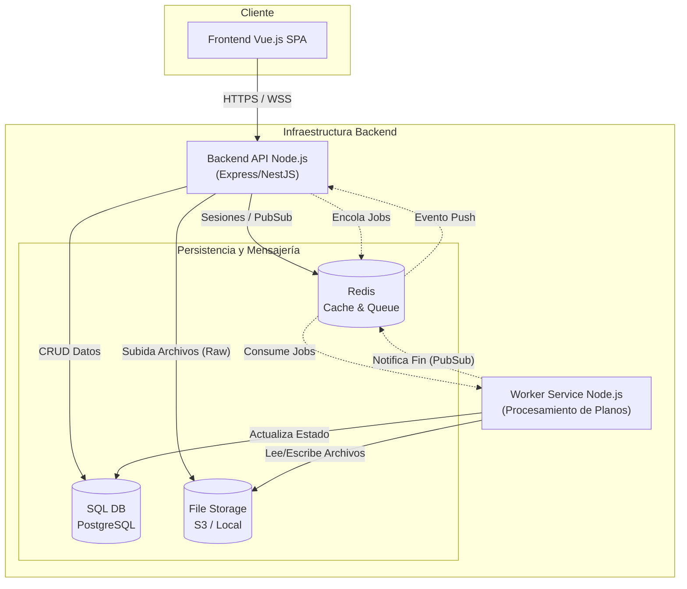

# Propuesta de Arquitectura: Sistema Desacoplado con Workers (Simplificado)

## 1. Resumen Ejecutivo
Esta propuesta arquitectónica adopta un enfoque **"Monorepo con Despliegue de Roles"**. La clave de esta arquitectura es la separación de responsabilidades entre el servidor que atiende a los usuarios (API) y el servicio que realiza tareas pesadas (Worker), compartiendo el mismo código base para facilitar el mantenimiento.

El objetivo principal es resolver el cuello de botella más crítico de la aplicación: el **procesamiento de planos (PDF/Imágenes de alta resolución)**. Al delegar esta tarea a un Worker asíncrono, garantizamos que la interfaz de usuario permanezca siempre fluida y el servidor API nunca se bloquee, independientemente del tamaño de los archivos que se estén subiendo.

## 2. Descripción de Módulos

### 2.1. Frontend (Vue.js)
*   **Rol:** Interfaz de usuario SPA (Single Page Application).
*   **Responsabilidad:** Renderizado de la interfaz, cliente HTTP para API REST, y cliente WebSocket para actualizaciones en tiempo real.
*   **Interacción:** Envía archivos a la API y suscribe a canales de eventos para recibir notificaciones cuando el procesamiento ha terminado ("Tu plano está listo").

### 2.2. Backend API (Node.js - Rol Servidor)
*   **Rol:** Servidor Web principal.
*   **Responsabilidad:** 
    *   Gestión de Autenticación y Autorización (JWT/Sessions).
    *   Operaciones CRUD (Proyectos, Comentarios, Usuarios).
    *   Recepción de subida de archivos (solo almacenamiento temporal/raw).
    *   Gestor de WebSockets (Socket.io) para notificar al Frontend.
*   **Comportamiento Clave:** Al recibir un archivo pesado, **NO** lo procesa. Lo guarda en el Storage y añade una tarea (Job) en la cola de Redis, respondiendo inmediatamente al usuario con un estado de "Procesando".

### 2.3. Worker Service (Node.js - Rol Procesador)
*   **Rol:** Procesador de tareas en segundo plano.
*   **Responsabilidad:**
    *   Escuchar la cola de trabajos en Redis.
    *   Conversión de formatos (PDF a PNG/JPG).
    *   Generación de miniaturas (tumbnails).
    *   Actualización de estado en la Base de Datos.
*   **Escalabilidad:** Se pueden desplegar múltiples instancias de este contenedor si la carga de trabajo aumenta, sin tocar la API.

### 2.4. Redis (Gestor de Estado Efímero)
*   **Rol:** Motor en memoria.
*   **Usos Múltiples:**
    1.  **Message Broker:** Actúa como cola para la librería de trabajos (ej. BullMQ).
    2.  **Session Store:** Almacenamiento rápido de sesiones de usuario.
    3.  **Pub/Sub:** Canal de comunicación interna para que el Worker le diga a la API que envíe una notificación WebSocket.

### 2.5. Base de Datos Relacional (SQL)
*   **Rol:** Persistencia de datos estructurados.
*   **Tecnología:** PostgreSQL o MySQL.
*   **Datos:** Usuarios, metadatos de Proyectos, relaciones de permisos, coordenadas de los pines y contenido de comentarios.

### 2.6. Storage (Sistema de Archivos)
*   **Desarrollo:** Volumen de Docker compartido.
*   **Producción:** Servicio de almacenamiento de objetos (AWS S3, MinIO).

## 3. Diagrama de Componentes (Mermaid)

El siguiente diagrama muestra la estructura estática de la arquitectura, destacando la separación de responsabilidades y las comunicaciones entre modulos.

## 4. Ventajas de esta Arquitectura
1.  **Time-to-Market:** Al usar Node.js en ambos lados (API y Worker) y un paradigma Monorepo, se reutiliza código de modelos y utilidades, acelerando el desarrollo inicial.
2.  **Resiliencia:** Si el proceso de conversión de un PDF falla o tarda mucho, la API principal sigue respondiendo peticiones de login o navegación de otros usuarios.
3.  **Escalabilidad Costo-Eficiente:** Permite escalar los recursos de forma granular. Si hay mucha cola de procesamiento, se añaden más contenedores `Worker` sin necesidad de duplicar la infraestructura de la `API`.
