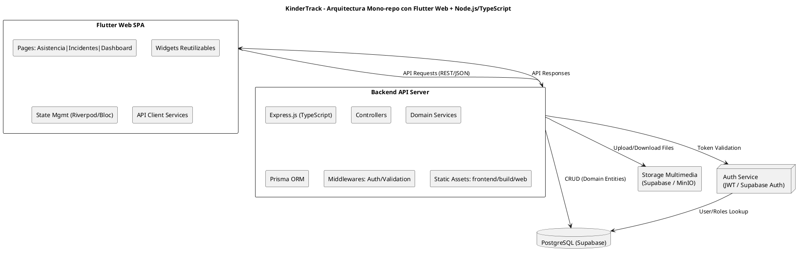

# KinderTrack – Documento de Arquitectura de Alto Nivel

---

## Índice

1. [Descripción general del diseño del sistema](#1-descripción-general-del-diseño-del-sistema)
2. [Estructura del proyecto y patrón arquitectónico](#2-estructura-del-proyecto-y-patrón-arquitectónico)
3. [Infraestructura y despliegue](#3-infraestructura-y-despliegue)
4. [Seguridad](#4-seguridad)
5. [Testing y TDD](#5-testing-y-tdd)
6. [Diagrama de arquitectura – PlantUML](#6-diagrama-de-arquitectura--plantuml)

---

## 1️⃣ Descripción general del diseño del sistema

KinderTrack está diseñado como **un sistema modular, basado en DDD**, con **mono-repo** que contiene frontend y backend:

* **Frontend**: Flutter Web SPA para docentes, familias y administradores.

  * Navegación por páginas: Asistencia, Incidentes, Dashboard
  * Gestión de estado: Riverpod o Bloc
  * UI basada en widgets reutilizables

* **Backend**: Node.js + TypeScript + Express, organizado por **dominios (DDD)**:

  * `Users`, `Children`, `Attendance`, `Incidents`
  * Lógica de negocio en **Domain Services**, repositorios usando **Prisma ORM**
  * Controllers que exponen endpoints REST o GraphQL
  * Middlewares para validación y seguridad

* **Base de datos**: PostgreSQL (Supabase Free Tier)

* **Almacenamiento multimedia**: Supabase Storage o MinIO local

* **Autenticación**: JWT o Supabase Auth, con roles diferenciados (docente, familia, administrador)

**Objetivos de la arquitectura**:

* Desarrollo **simple, seguro y escalable**
* Modularidad para facilitar **mantenimiento y futuras funcionalidades**
* Infraestructura **costo 0**, usando servicios gratuitos
* **TDD**: desarrollo impulsado por tests desde la primera línea de código

---

## 2️⃣ Estructura del proyecto y patrón arquitectónico

Estructura **mono-repo basada en DDD**:

```
kindertrack/
│
├─ frontend/                 # Flutter Web
│   ├─ lib/
│   │   ├─ pages/            # Páginas principales: Asistencia, Incidentes, Dashboard
│   │   ├─ widgets/          # Componentes reutilizables
│   │   ├─ services/         # Cliente API
│   │   └─ state/            # Gestión de estado (Riverpod/Bloc)
│   └─ test/                 # Tests unitarios e integración frontend
│
├─ backend/                  # Node.js + TypeScript + Express + Prisma
│   ├─ src/
│   │   ├─ domains/          # DDD: Users, Children, Attendance, Incidents
│   │   │   ├─ entities/     
│   │   │   ├─ repositories/ 
│   │   │   ├─ services/     
│   │   │   └─ dtos/         
│   │   ├─ infrastructure/   
│   │   │   ├─ prisma/       # Configuración y cliente Prisma
│   │   │   └─ persistence/  # Repositorios concretos
│   │   ├─ interfaces/       
│   │   │   ├─ controllers/  # Express Controllers
│   │   │   └─ routes/       # Rutas API
│   │   ├─ middlewares/      # Seguridad y validación
│   │   ├─ utils/            # Helpers
│   │   └─ config/           # DB, Auth, variables de entorno
│   └─ tests/                # Tests unitarios e integración backend
│
├─ infra/                    # Scripts de despliegue, Docker
├─ docker-compose.yml         # Levantar backend + frontend
└─ docs/                      # PRD, diagramas, documentación
```

**Patrón arquitectónico**: **DDD + MVC + servicios**, modular y desacoplado.

**Flujo de desarrollo (TDD)**:

1. Escribir **test unitario** para funcionalidad de dominio
2. Implementar **lógica mínima** para pasar el test
3. Refactorizar y validar integraciones
4. Iterar por dominio (Users, Attendance, Incidents, Children)

---

## 3️⃣ Infraestructura y despliegue

* **Frontend Flutter Web**

  * `flutter build web` → carpeta `frontend/build/web`
  * Servido desde backend Express: `app.use(express.static('frontend/build/web'))`
  * Hosting gratuito alternativo: Vercel, Netlify o Supabase Hosting

* **Backend Node.js + TypeScript**

  * Desarrollo: `ts-node-dev src/index.ts`
  * Producción: VPS gratuito o Render Free Tier

* **Base de datos PostgreSQL**: Supabase Free Tier o Docker local

* **Almacenamiento multimedia**: Supabase Storage o MinIO local

**Flujo de despliegue unificado**:

```
Flutter Web build --> frontend/build/web
Backend Node.js sirve frontend + API
Backend <--> PostgreSQL (Supabase)
Backend <--> Storage Multimedia
```

---

## 4️⃣ Seguridad

* Autenticación: **JWT o Supabase Auth** con roles diferenciados
* Autorización: middleware por endpoint según rol
* Cifrado de contraseñas: **bcrypt / Argon2**
* Sanitización de inputs: protección contra XSS y SQL Injection
* HTTPS obligatorio
* Logging y auditoría de asistencia e incidentes
* Backups periódicos de DB y almacenamiento multimedia (post MVP)

---

## 5️⃣ Testing y TDD

* **TDD**: Tests escritos antes de la implementación
* **Backend**: tests unitarios e integración por dominio (entities, services, repositories)
* **Frontend**: tests unitarios de widgets y pruebas de integración de páginas
* **Herramientas**: Jest + ts-jest para backend, Flutter test para frontend, Cypress para E2E
* Cobertura mínima recomendada: 90% en servicios críticos

---

## 6️⃣ Diagrama de arquitectura – PlantUML (corregido)



---

### ✅ Beneficios principales

* **DDD + TDD**: robustez y modularidad
* **Mono-repo**: simple de mantener y desplegar
* **TypeScript + Prisma**: seguridad de tipos y ORM eficiente
* **Flutter Web**: UI moderna y reusable para futuras apps móviles
* **Infraestructura gratuita**: Supabase + hosting gratuito

**Sacrificios:**

* Bundle inicial de Flutter Web grande → requiere optimización
* Hot reload simultáneo frontend + backend requiere abrir dos procesos en desarrollo

---

Si quieres, puedo generar **una guía paso a paso de desarrollo TDD para este mono-repo**, con **tests por dominio**, **Flutter Web + backend TS**, y **despliegue gratuito en Supabase o Render**, lista para empezar a codificar KinderTrack.

¿Quieres que haga eso?
