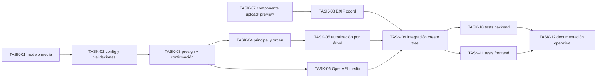

# HU-006 — Desglose en tickets de trabajo (subida de fotografías al árbol)

| Campo | Valor |
|-------|--------|
| **Historia** | [HU-006 en backlog.md](backlog.md) (tabla §3) |
| **Refinamiento** | [HU-006-fotografias-asociadas-al-arbol.md](HU-006-fotografias-asociadas-al-arbol.md) |
| **Épica** | Fotografías |
| **Título HU** | Subida de fotografías al árbol |

**Convención de ID de ticket:** `TASK-HU-006-<nn>`.

**Estado del ticket:** columna **Estado** en cada fila; valores recomendados **Pendiente** (por defecto), **En curso**, **Hecho**.

**Contexto de equipo:** un ingeniero/a **full-stack** con HTML/CSS sólidos; stack y arquitectura en [readme.md](../../readme.md). Se asume **HU-001** (auth OIDC/JWT) y **HU-005** (alta de árbol con coordenadas y mapa en frontend) en estado utilizable para poder cerrar este flujo.

**Objetivo de este desglose:** cerrar un vertical de **subida** de fotografías (no consulta completa) con `media-service` + MinIO + gateway, incluyendo: subida múltiple (máx. 10), validaciones MIME/tamaño (20 MB por defecto por foto), marca de foto principal (primera seleccionada), y previsualización con lectura EXIF para sobrescritura de coordenadas en la pantalla de alta del árbol.

**Reglas aplicables por capa (referencia rápida):**

- **Frontend:** [frontend-vue3.mdc](../../.cursor/rules/frontend-vue3.mdc), [frontend-ux.mdc](../../.cursor/rules/frontend-ux.mdc), [frontend-security.mdc](../../.cursor/rules/frontend-security.mdc)
- **Backend:** [spring-boot-4-backend.mdc](../../.cursor/rules/spring-boot-4-backend.mdc), [backend-generation-standard.mdc](../../.cursor/rules/backend-generation-standard.mdc)
- **API / contrato:** [api-design.mdc](../../.cursor/rules/api-design.mdc), [api-contract.mdc](../../.cursor/rules/api-contract.mdc), [openapi.yaml](../api/openapi.yaml)
- **Calidad / pruebas:** [quality-and-testing.mdc](../../.cursor/rules/quality-and-testing.mdc), [testing-java.md](../engineering/testing-java.md), [testing-frontend.md](../engineering/testing-frontend.md)

**Checks mínimos para cerrar tickets de esta HU:**

- Frontend: `npm run build` y `npm run test`
- Backend: `mvn -f services/pom.xml test` (y `verify` si se tocan `testIT`)
- Integración funcional: subida de 2+ fotos a un árbol autorizado, marca de principal persistida, validación de límite/MIME/tamaño y autocompletado EXIF de coordenadas en la primera imagen

---

## Orden sugerido (dependencias)

---

## Tickets

### Media-service y persistencia (backend)

| ID | Título | Descripción breve | Estado |
|----|--------|-------------------|--------|
| **TASK-HU-006-01** | Modelo relacional de fotografía en esquema `media` | Definir/ajustar migración Flyway para metadatos de foto asociados a `arbol_id` con campos mínimos: identificador, clave de objeto, MIME, tamaño bytes, orden, `es_principal`, autor y timestamps. Mantener PK numérica y convenciones de esquema del proyecto. | Hecho |
| **TASK-HU-006-02** | Configuración de límites y validación de archivo | Añadir propiedades de aplicación en `media-service` para `max-file-size` (default 20 MB), MIME permitidos (`image/jpeg`, `image/png`, `image/webp`) y máximo 10 fotos por árbol. Validar en backend antes de confirmar registro de metadatos. | Hecho |
| **TASK-HU-006-03** | Flujo API de presign + confirmación de metadatos | Implementar endpoints bajo `/api/media` para solicitar URL prefirmada de subida y confirmar/persistir metadatos tras subida. Error handling con `application/problem+json`, sin exponer detalles internos de MinIO/S3. | Hecho |
| **TASK-HU-006-04** | Regla de foto principal y orden de selección | Persistir la primera foto seleccionada como principal. Asegurar consistencia para cargas múltiples en la misma operación (orden estable) y para operaciones posteriores sobre el mismo árbol (sin duplicar principales activas). | Hecho |
| **TASK-HU-006-05** | Autorización por rol y árbol objetivo | Validar que solo `COLABORADOR` o `ADMIN` autenticados con permiso sobre el árbol pueden subir/confirmar fotos. Alinear con reglas de alta/edición en catálogo y con JWT de gateway. | Hecho |

### Contrato y gateway

| ID | Título | Descripción breve | Estado |
|----|--------|-------------------|--------|
| **TASK-HU-006-06** | Cierre OpenAPI para HU-006 | Sustituir esquemas genéricos en `/api/media/uploads/presign` y `/api/media/photos/{photoId}` (o endpoints definitivos) por DTOs concretos: request/response de presign, confirmación de metadatos, límites/validaciones y errores esperados (400/401/403/404). | Hecho |
| **TASK-HU-006-07** | Verificación de enrutado gateway `/api/media` | Confirmar mapeo del API Gateway hacia `media-service`, propagación de JWT y CORS necesario para subida desde SPA en entorno local con MinIO. | Hecho |

### Frontend (subida múltiple + EXIF en alta)

| ID | Título | Descripción breve | Estado |
|----|--------|-------------------|--------|
| **TASK-HU-006-08** | Componente de selección y previsualización antes de subida | Crear/completar componente UI en frontend para seleccionar múltiples imágenes (máx. 10), mostrar previsualización local y orden de selección; la primera se marca visualmente como principal. Validaciones cliente para MIME y tamaño. | Hecho |
| **TASK-HU-006-09** | Lectura EXIF y sobrescritura de coordenadas | Al cargar la primera imagen, leer EXIF en cliente; si lat/lon son válidas, sobrescribir los campos de coordenadas de la pantalla de alta y actualizar marcador en mapa. Manejar casos sin EXIF o EXIF inválido sin bloquear subida. | Hecho |
| **TASK-HU-006-10** | Integración de subida con flujo de alta de árbol | Integrar el componente en la pantalla de alta (HU-005): solicitar presign, subir a MinIO y confirmar metadatos en `media-service` para el árbol correspondiente, con mensajes UX claros de éxito/error/reintento. | Hecho |

### Calidad y documentación

| ID | Título | Descripción breve | Estado |
|----|--------|-------------------|--------|
| **TASK-HU-006-11** | Pruebas backend de validación y permisos | Pruebas unitarias + integración (`Test`/`IT` según capa): límites MIME/tamaño, máximo 10 fotos, autorización por rol/árbol, persistencia de `es_principal` y errores RFC 9457. | Hecho |
| **TASK-HU-006-12** | Pruebas frontend del componente y EXIF | Tests de composable/componente (Vitest): selección múltiple, bloqueo por límite/MIME/tamaño, marcaje de principal y sobrescritura de coordenadas cuando EXIF válido en primera imagen. | Pendiente |
| **TASK-HU-006-13** | Documentación técnica del corte HU-006 | Actualizar docs afectados (OpenAPI ya cubierto en TASK-06, más README/engineering si aplica) con propiedades configurables, secuencia presign->upload->confirmación y criterio de principal/EXIF. | Pendiente |

---

## Qué puede quedar para después (sigue siendo MVP global, no este corte)

- Reordenación/edición avanzada de galerías y cambio manual de foto principal tras la subida inicial.
- Transformación de imágenes (resize, thumbnails, optimización, CDN).
- Consulta pública/privada completa de fotos y enlaces de lectura firmados (cubierto en **HU-014**).

## Dependencias externas a esta HU

- **HU-001:** autenticación OIDC/JWT y roles operativos.
- **HU-005:** flujo de alta de árbol disponible para asociar fotos y reutilizar mapa/coordenadas.
- **Infra Compose:** MinIO, Postgres y gateway operativos según [infra/compose/README.md](../../infra/compose/README.md).

## Cierre sugerido (definición de “hecho” para el corte)

Usuario `COLABORADOR` o `ADMIN` autenticado, sobre un árbol autorizado, puede seleccionar hasta 10 fotos (`jpeg/png/webp`), ver previsualización previa, obtener autocompletado EXIF de coordenadas en la primera imagen (con sobrescritura), subirlas vía URL prefirmada y confirmar metadatos en `media-service`, quedando persistida una única foto principal y validaciones de seguridad/tamaño/MIME comprobadas por tests.
