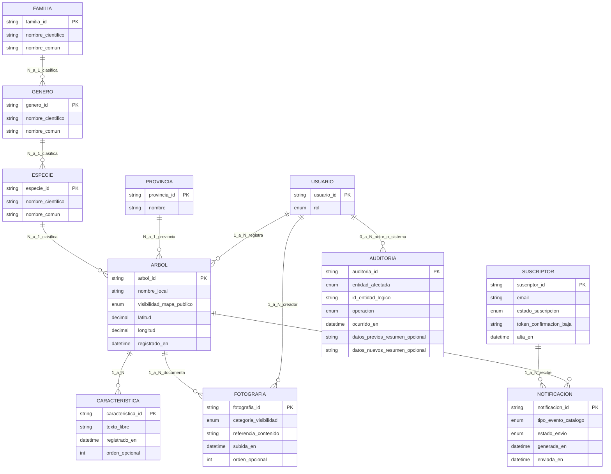

# Modelo conceptual de datos — My Tree Library

Documento de **nivel conceptual** (negocio): describe entidades, relaciones y reglas **sin** asignar almacenes físicos (PostgreSQL, MongoDB, S3, etc.).

**Fuentes:** [readme.md](../../readme.md) (producto y dominio), [resumen de casos de uso](../use-cases/use-case-summary.md), requisitos explícitos del negocio.

**Diagramas exportables (canónicos):** [conceptual-diagram.puml](conceptual-diagram.puml) · [conceptual-diagram.mmd](conceptual-diagram.mmd) (Mermaid sincronizado con el PlantUML).

**Supuesto por texto truncado (“solo la pueden ver el administrador y…”)**  
Se asume que los **maestros taxonómicos** (**FAMILIA**, **GÉNERO**, **ESPECIE**) y **PROVINCIA** son **gestionados solo por Administrador**. Los **Colaboradores** **consultan** esos maestros para asignar taxón y provincia al dar de alta o editar un árbol; esa lectura no es gestión del catálogo maestro.

---

## 1. Visión general

El sistema cubre: **catálogo de árboles singulares** (ficha, taxonomía jerárquica familia–género–especie, provincia, ubicación, **características**, fotografías), **maestros de referencia**, **usuario de plataforma** (colaborador / administrador), **suscriptores** a notificaciones por correo (sin cuenta de plataforma), **notificaciones** vinculadas a árbol y destinatario, y **auditoría** de cambios sobre maestros y catálogo operativo.

Las **interacciones con IA** (chat e identificación asistida, UC-05/UC-06) se modelan en la **arquitectura** como persistencia aparte (p. ej. documentos de sesión); **no** forman parte del diagrama entidad–relación conceptual unificado en [conceptual-diagram.puml](conceptual-diagram.puml).

---

## 2. Diagrama entidad-relación (conceptual)

---

## 3. Diccionario de entidades

### 3.1. USUARIO

Persona con cuenta en la aplicación (identidad federada en la arquitectura prevista).

| Atributo conceptual | Descripción |
|---------------------|-------------|
| **usuario_id** | Identificador único de negocio (p. ej. alineable con `sub` OIDC). |
| **rol** | Conjunto que incluye al menos **Colaborador** y **Administrador**. |

**Reglas:** necesario para registrar/modificar árboles propios, crear fotografías con autoría y trazas de **AUDITORÍA** cuando el actor es humano.

---

### 3.2. Maestros taxonómicos (FAMILIA, GÉNERO, ESPECIE)

Jerarquía **FAMILIA → GÉNERO → ESPECIE** (cada nivel **N:1** hacia el superior). Cada entidad lleva **nombre científico** y **nombre común** a efectos de catálogo y UI.

| Entidad | Relación |
|---------|----------|
| **FAMILIA** | Raíz taxonómica; una familia agrupa **N** géneros. |
| **GÉNERO** | Pertenece a **una** familia; agrupa **N** especies. |
| **ESPECIE** | Pertenece a **un** género; clasifica **N** árboles (**N:1** ÁRBOL–ESPECIE). |

**Gestión:** solo **Administrador** (UC-07). **Consulta** para fichas: **Colaborador** y **Administrador** al asignar taxón al árbol.

---

### 3.3. PROVINCIA (maestro de catálogo)

| Atributo conceptual | Descripción |
|---------------------|-------------|
| **provincia_id** | Identificador único. |
| **nombre** | Denominación oficial. |

**Relación con ÁRBOL:** **N:1** (cada árbol referencia como máximo una provincia, según reglas de negocio del formulario).

**Gestión:** solo **Administrador**. Consulta para fichas según matriz de permisos.

---

### 3.4. ÁRBOL

Ejemplar singular catalogado.

| Atributo conceptual | Descripción |
|---------------------|-------------|
| **nombre_local** | Etiqueta visible en ficha o mapa. |
| **Especie** | Asociación obligatoria a **ESPECIE** (nombres científico/común vía cadena taxonómica). |
| **Coordenadas** | **latitud** y **longitud** (p. ej. WGS84). |
| **visibilidad_mapa_publico** | Participación en consulta pública (UC-01). |
| **registrado_en** | Marca temporal de creación de ficha. |
| **Registrador** | **USUARIO** que creó la ficha. |

**Auditoría:** altas y modificaciones relevantes generan **AUDITORÍA** (véase §4).

---

### 3.5. CARACTERÍSTICA

Detalle textual asociado a un árbol (antes “característica u observación”).

| Atributo conceptual | Descripción |
|---------------------|-------------|
| **texto_libre** | Observaciones de campo, notas. |
| **registrado_en** | Marca temporal. |
| **orden** | Opcional, para presentación. |

**Relación:** **1:N** con **ÁRBOL**.

---

### 3.6. FOTOGRAFÍA

| Atributo conceptual | Descripción |
|---------------------|-------------|
| **categoria_visibilidad** | **PUBLIC**, **PRIVATE**, **RESTRICTED** (véase §5). |
| **referencia_contenido** | Localizador del fichero en diseño físico. |
| **creador** | **USUARIO** (relación **1:N** usuario–fotografía). |
| **orden** | Opcional. |

---

### 3.7. SUSCRIPTOR

Suscriptores **sin** cuenta de plataforma; solo **correo** para avisos.

| Atributo conceptual | Descripción |
|---------------------|-------------|
| **email** | Dirección de envío; única entre suscriptores activos según reglas de negocio. |
| **estado_suscripcion** | Pendiente de confirmación, activo, inactivo, baja, etc. |
| **token_confirmacion_baja** | Confirmación y baja segura. |
| **alta_en** | Marca temporal. |

---

### 3.8. NOTIFICACIÓN

Registro de aviso hacia suscriptores, ligado al **árbol** motivador.

| Atributo conceptual | Descripción |
|---------------------|-------------|
| **SUSCRIPTOR** | Destinatario. |
| **ÁRBOL** | Ejemplar que originó el aviso (UC-09). |
| **tipo_evento_catalogo**, **estado_envio**, **generada_en**, **enviada_en** | Ciclo de vida del envío. |

---

### 3.9. AUDITORIA

Trazabilidad de altas y modificaciones sobre **maestros** (FAMILIA, GÉNERO, ESPECIE, PROVINCIA) y **catálogo operativo** (ÁRBOL, y según política FOTOGRAFÍA y CARACTERÍSTICA).

| Atributo conceptual | Descripción |
|---------------------|-------------|
| **entidad_afectada** | Tipo lógico del registro tocado. |
| **id_entidad_logico** | Clave de negocio del registro afectado. |
| **operación** | Alta, modificación, baja lógica. |
| **ocurrido_en** | Marca temporal. |
| **Actor** | **USUARIO** o valor **sistema** (relación opcional a USUARIO). |
| **datos_previos / datos_nuevos** | Resumen opcional (diff, JSON parcial). |

---

## 4. Reglas de negocio consolidadas

| ID | Regla |
|----|--------|
| R1 | Cada **ÁRBOL** referencia **exactamente una ESPECIE**; nombres científico y común de la especie (y contexto de género/familia) provienen de los maestros taxonómicos. |
| R2 | Cada **ÁRBOL** lleva **coordenadas** del ejemplar. |
| R3 | **AUDITORÍA:** toda alta/modificación relevante sobre maestros y fichas operativas deja **AUDITORIA** según política. |
| R4 | **Fotografía – PUBLIC:** visible donde la ficha y el mapa lo permitan, incluido público no autenticado si la ficha es pública. |
| R5 | **Fotografía – PRIVATE:** solo **Administrador** y el **USUARIO** creador. |
| R6 | **Fotografía – RESTRICTED:** **Administrador**, creador y **Colaboradores autenticados**; no el visitante sin sesión. |
| R7 | **NOTIFICACION** a **SUSCRIPTOR** con suscripción válida tras alta/modificación de **ÁRBOL** (UC-09). |
| R8 | **FAMILIA**, **GÉNERO**, **ESPECIE** y **PROVINCIA:** **gestión** solo **Administrador**; consulta para edición de ficha por roles autenticados según matriz acordada. |

---

## 5. Matriz de visibilidad de fotografías (resumen)

| Categoría | Público (sin login) | Colaborador autenticado | Administrador |
|-----------|---------------------|-------------------------|---------------|
| PUBLIC | Sí, si la ficha/árbol es accesible en contexto público | Sí | Sí |
| RESTRICTED | No | Sí | Sí |
| PRIVATE | No | No (salvo que sea el creador) | Sí |

*El creador de la fotografía siempre puede ver su propia PRIVATE.*

---

## 6. Relación con casos de uso (trazabilidad breve)

| UC | Entidades implicadas principalmente |
|----|----------------------------------------|
| UC-01 | ÁRBOL, ESPECIE (y cadena FAMILIA/GÉNERO), FOTOGRAFÍA (PUBLIC según reglas), coordenadas |
| UC-02 | SUSCRIPTOR |
| UC-03, UC-04 | ÁRBOL, ESPECIE, PROVINCIA, CARACTERÍSTICA, FOTOGRAFÍA, USUARIO, AUDITORIA |
| UC-05, UC-06 | Persistencia de sesión IA fuera de este ER (véase arquitectura / MongoDB en readme) |
| UC-07 | FAMILIA, GÉNERO, ESPECIE, PROVINCIA, AUDITORIA |
| UC-08 | SUSCRIPTOR |
| UC-09 | NOTIFICACION, SUSCRIPTOR, ÁRBOL |

---

## 7. Próximos pasos (fuera de este documento)

- Derivar **modelo lógico** (tipos, índices, restricciones FK) y **asignación a almacenes** (relacional, objeto, documental para IA).
- Detallar **máquina de estados** de SUSCRIPTOR y NOTIFICACION.
- Formalizar **eventos** que disparan UC-09 (solo árboles públicos u otros).
