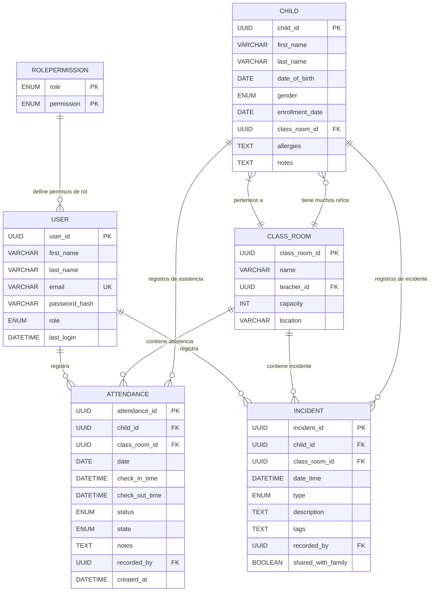

# Análisis del Modelo de Datos – KinderTrack

---

## Índice

1. [Descripción de Entidades Principales](#descripcion-de-entidades-principales)  
   1. [Niño (`Child`)](#nino-child)  
   2. [Aula / Grupo (`ClassRoom`)](#aulagrupo-classroom)  
   3. [Usuario / Docente (`User`)](#usuario--docente-user)  
   4. [Registro de Asistencia (`Attendance`)](#registro-de-asistencia-attendance)  
   5. [Registro de Incidente (`Incident`)](#registro-de-incidente-incident)  
   6. [Roles y Permisos (`RolePermission`)](#roles-y-permisos-rolepermission)  
2. [Diagrama ER del Modelo de Datos](#diagrama-er-del-modelo-de-datos)

---

## Descripción de Entidades Principales

### Niño (`Child`)

**Descripción:** Representa a cada niño inscrito en la institución de primera infancia.  

**Atributos:**

| Atributo | Tipo | Descripción | Clave | Restricciones |
|-----------|------|------------|-------|---------------|
| `child_id` | UUID | Identificador único | PK | NOT NULL, UNIQUE |
| `first_name` | VARCHAR | Nombre del niño |  | NOT NULL |
| `last_name` | VARCHAR | Apellido del niño |  | NOT NULL |
| `date_of_birth` | DATE | Fecha de nacimiento |  | NOT NULL |
| `gender` | ENUM(`MALE`,`FEMALE`,`OTHER`) | Género del niño |  | NULLABLE |
| `enrollment_date` | DATE | Fecha de ingreso a la institución |  | NOT NULL |
| `class_room_id` | UUID | Aula/grupo asignado | FK → `ClassRoom.class_room_id` | NOT NULL |
| `allergies` | TEXT | Información sobre alergias |  | NULLABLE |
| `notes` | TEXT | Información adicional |  | NULLABLE |

**Relaciones:**

- Cada niño **pertenece a un aula** (`ClassRoom`) → Cardinalidad: N:1  
- Cada niño puede tener **muchos registros de asistencia** → Cardinalidad: 1:N  
- Cada niño puede tener **muchos incidentes** → Cardinalidad: 1:N  

---

### Aula / Grupo (`ClassRoom`)

**Descripción:** Representa un aula o grupo dentro de la institución.  

**Atributos:**

| Atributo | Tipo | Descripción | Clave | Restricciones |
|-----------|------|------------|-------|---------------|
| `class_room_id` | UUID | Identificador único | PK | NOT NULL, UNIQUE |
| `name` | VARCHAR | Nombre del aula o grupo |  | NOT NULL |
| `teacher_id` | UUID | Docente principal responsable | FK → `User.user_id` | NULLABLE |
| `capacity` | INT | Capacidad máxima de niños |  | NOT NULL |
| `location` | VARCHAR | Ubicación física |  | NULLABLE |

**Relaciones:**

- Un aula tiene **muchos niños** → Cardinalidad: 1:N  
- Un aula tiene **uno o varios docentes asignados** → Cardinalidad: 1:N  
- Contiene registros de asistencia e incidentes → Cardinalidad: 1:N  

---

### Usuario / Docente (`User`)

**Descripción:** Representa a los usuarios del sistema, incluyendo docentes y directivos.  

**Atributos:**

| Atributo | Tipo | Descripción | Clave | Restricciones |
|-----------|------|------------|-------|---------------|
| `user_id` | UUID | Identificador único | PK | NOT NULL, UNIQUE |
| `first_name` | VARCHAR | Nombre del usuario |  | NOT NULL |
| `last_name` | VARCHAR | Apellido del usuario |  | NOT NULL |
| `email` | VARCHAR | Correo electrónico |  | NOT NULL, UNIQUE |
| `password_hash` | VARCHAR | Contraseña cifrada |  | NOT NULL |
| `role` | ENUM(`TEACHER`,`DIRECTOR`,`ADMIN`) | Rol de usuario |  | NOT NULL |
| `assigned_classes` | ARRAY(UUID) | Clases asignadas (solo docentes) |  | NULLABLE |
| `last_login` | DATETIME | Último inicio de sesión |  | NULLABLE |

**Relaciones y cardinalidades:**

- Un usuario puede **registrar muchos registros de asistencia** → Cardinalidad: 1:N  
- Un usuario puede **registrar muchos incidentes** → Cardinalidad: 1:N  
- Un usuario tiene **un único rol** definido en RolePermission → Cardinalidad: N:1  

---

### Registro de Asistencia (`Attendance`)

**Descripción:** Representa la presencia diaria de cada niño.  

**Atributos:**

| Atributo | Tipo | Descripción | Clave | Restricciones |
|-----------|------|------------|-------|---------------|
| `attendance_id` | UUID | Identificador único | PK | NOT NULL, UNIQUE |
| `child_id` | UUID | Niño asociado | FK → `Child.child_id` | NOT NULL |
| `class_room_id` | UUID | Aula asociada | FK → `ClassRoom.class_room_id` | NOT NULL |
| `date` | DATE | Fecha del registro |  | NOT NULL |
| `check_in_time` | DATETIME | Hora de llegada |  | NULLABLE |
| `check_out_time` | DATETIME | Hora de salida |  | NULLABLE |
| `status` | ENUM(`PRESENT`,`ABSENT`,`LATE`) | Estado del niño |  | NOT NULL |
| `state` | ENUM(`CALM`,`TIRED`,`HYPERACTIVE`,`OTHER`) | Estado del niño |  | NULLABLE |
| `notes` | TEXT | Observaciones adicionales |  | NULLABLE |
| `recorded_by` | UUID | Usuario que registró | FK → `User.user_id` | NOT NULL |
| `created_at` | DATETIME | Fecha y hora de creación del registro |  | NOT NULL |

**Relaciones:**

- Cada registro pertenece a **un niño** → Cardinalidad: N:1  
- Cada registro pertenece a **un aula** → Cardinalidad: N:1  
- Cada registro es **creado por un usuario** → Cardinalidad: N:1  

---

### Registro de Incidente (`Incident`)

**Descripción:** Representa hechos relevantes, positivos o negativos de cada niño.  

**Atributos:**

| Atributo | Tipo | Descripción | Clave | Restricciones |
|-----------|------|------------|-------|---------------|
| `incident_id` | UUID | Identificador único | PK | NOT NULL, UNIQUE |
| `child_id` | UUID | Niño asociado | FK → `Child.child_id` | NOT NULL |
| `class_room_id` | UUID | Aula asociada | FK → `ClassRoom.class_room_id` | NOT NULL |
| `date_time` | DATETIME | Fecha y hora del incidente |  | NOT NULL |
| `type` | ENUM(`ACHIEVEMENT`,`BEHAVIOR`,`SPECIAL_EVENT`,`HEALTH`) | Tipo de incidente |  | NOT NULL |
| `description` | TEXT | Descripción breve |  | NOT NULL |
| `tags` | TEXT | Etiquetas pedagógicas |  | NULLABLE |
| `recorded_by` | UUID | Usuario que registró | FK → `User.user_id` | NOT NULL |
| `shared_with_family` | BOOLEAN | Indica si se comparte con familia |  | DEFAULT FALSE |

**Relaciones:**

- Cada incidente pertenece a **un niño** → Cardinalidad: N:1  
- Cada incidente pertenece a **un aula** → Cardinalidad: N:1  
- Cada incidente es **registrado por un usuario** → Cardinalidad: N:1  

---

### Roles y Permisos (`RolePermission`)

**Descripción:** Define permisos asociados a cada rol para controlar acceso a funcionalidades.  

**Atributos:**

| Atributo | Tipo | Descripción | Clave | Restricciones |
|-----------|------|------------|-------|---------------|
| `role` | ENUM(`TEACHER`,`DIRECTOR`,`ADMIN`) | Rol de usuario | PK | NOT NULL |
| `permission` | ENUM(`CREATE_ATTENDANCE`,`CREATE_INCIDENT`,`VIEW_REPORTS`,`MANAGE_USERS`) | Permiso asociado | PK | NOT NULL |

**Relaciones:**

- Define los **permisos asociados a cada rol** del sistema  
- Múltiples usuarios pueden tener el mismo rol → Cardinalidad: 1:N (un rol, muchos usuarios)  

---

## Diagrama ER del Modelo de Datos

