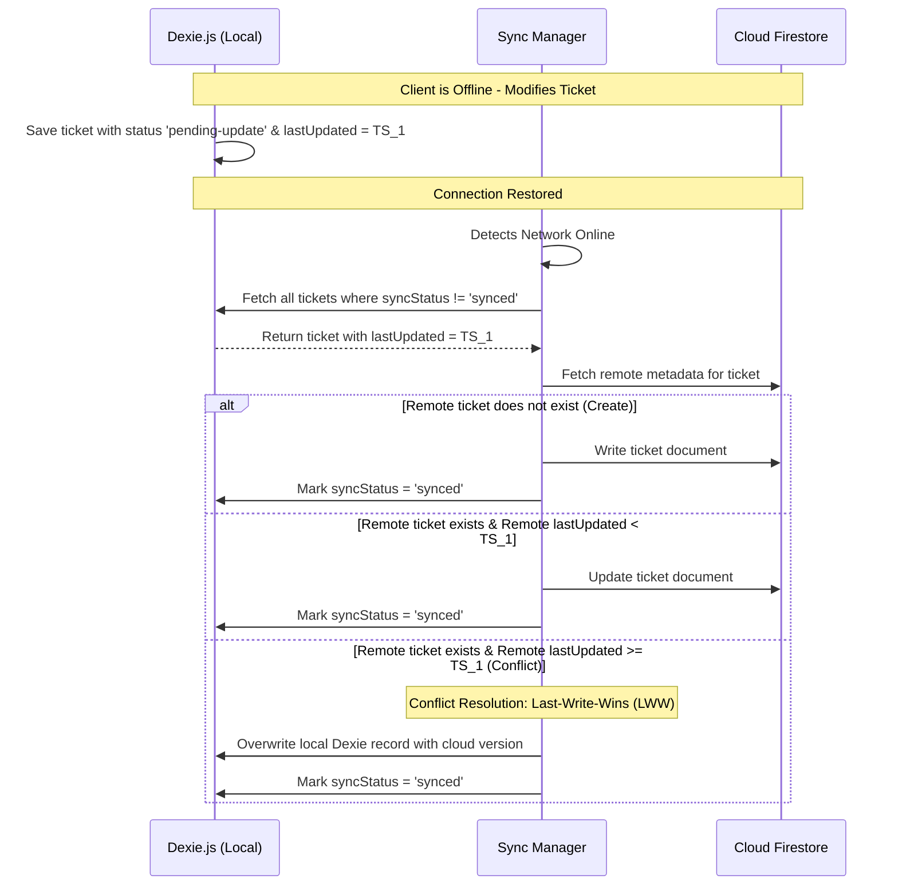

# SplitEat: Data Schema & Synchronization Design

This document details the database modeling for the local IndexedDB (via Dexie.js) and the cloud database (via Cloud Firestore), including schemas, relations, and the synchronization strategy.

---

## 1. Local Database Schema (Dexie.js / IndexedDB)

IndexedDB stores data locally as object stores. Dexie.js uses a schema string to declare indexes on properties. Non-indexed fields are stored as part of the JSON payload but cannot be queried directly.

### 1.1 Dexie.js Database Initialization Schema

```typescript
import Dexie, { type Table } from 'dexie';

export interface Participant {
  id: string; // UUID v4
  name: string;
  isGroup: boolean; // true if representing a family/subgroup
  memberIds?: string[]; // IDs of sub-members (if grouped)
}

export interface ItemAllocation {
  participantId: string;
  share: number; // proportion of the item (e.g. 0.5 for split in half)
}

export interface TicketItem {
  id: string; // UUID v4
  ticketId: string; // Index
  name: string;
  quantity: number;
  unitPrice: number;
  totalPrice: number; // quantity * unitPrice
  allocations: ItemAllocation[]; // Inline array for fast reads
}

export interface Ticket {
  id: string; // UUID v4
  restaurantName: string;
  date: string; // ISO 8601 string
  subtotal: number;
  taxAmount: number;
  tipAmount: number;
  totalAmount: number;
  pennyAdjustment: number; // Difference adjusted to match sum(item totals)
  isCompleted: boolean;
  
  // Sync metadata
  lastUpdated: number; // Epoch timestamp
  syncStatus: 'synced' | 'pending-create' | 'pending-update' | 'pending-delete';
}

class SplitEatDatabase extends Dexie {
  tickets!: Table<Ticket>;
  items!: Table<TicketItem>;
  participants!: Table<Participant>;

  constructor() {
    super('SplitEatDB');
    this.version(1).stores({
      tickets: 'id, date, syncStatus, lastUpdated',
      items: 'id, ticketId',
      participants: 'id, name'
    });
  }
}

export const db = new SplitEatDatabase();
```

---

## 2. Cloud Database Schema (Cloud Firestore)

Firestore is a NoSQL document database structured in Collections and Documents.

```
/users (Collection)
  └─ [userId] (Document)
       ├─ displayName: string
       ├─ email: string
       └─ createdAt: timestamp

/tickets (Collection)
  └─ [ticketId] (Document)
       ├─ userId: string (Index for user access)
       ├─ restaurantName: string
       ├─ date: string (ISO 8601 string)
       ├─ subtotal: number
       ├─ taxAmount: number
       ├─ tipAmount: number
       ├─ totalAmount: number
       ├─ pennyAdjustment: number
       ├─ isCompleted: boolean
       ├─ lastUpdated: number
       ├─ participants: array [
       │    { id: string, name: string, isGroup: boolean, memberIds: string[] }
       │  ]
       └─ items: array [
            {
              id: string,
              name: string,
              quantity: number,
              unitPrice: number,
              totalPrice: number,
              allocations: [
                { participantId: string, share: number }
              ]
            }
          ]
```

*Note: In Firestore, `items` and `participants` are stored as nested sub-arrays inside the `ticket` document. This minimizes read/write operations (which are charged per document access) and ensures atomic updates of an entire split ticket.*

---

## 3. Synchronization Strategy

The sync system ensures anonymous local data is safely migrated on user login, and updates are synchronized bi-directionally when online.



### 3.1 Migration of Anonymous Data on Login
When an anonymous user registers or logs in:
1. Fetch all local tickets in Dexie.js.
2. For each local ticket:
   - Assign the newly created Firestore `userId` to the ticket.
   - Upload the ticket to Firestore under `/tickets/{ticketId}`.
   - Set local `syncStatus` to `'synced'`.
3. Once migration is complete, clear local records that do not belong to the user (if any).

### 3.2 Offline Status & Queue Management
- **Network State Detection**: A custom hook listens to `window.addEventListener('online')` and `navigator.onLine`.
- **Sync Queue**: Any local mutation (add item, edit name, assign participant) triggers a write to Dexie with `syncStatus: 'pending-update'` and updates `lastUpdated: Date.now()`.
- **Background Worker**: When the app goes online, it queries `db.tickets.where('syncStatus').anyOf(['pending-create', 'pending-update']).toArray()` and pushes updates to Firestore sequentially.
