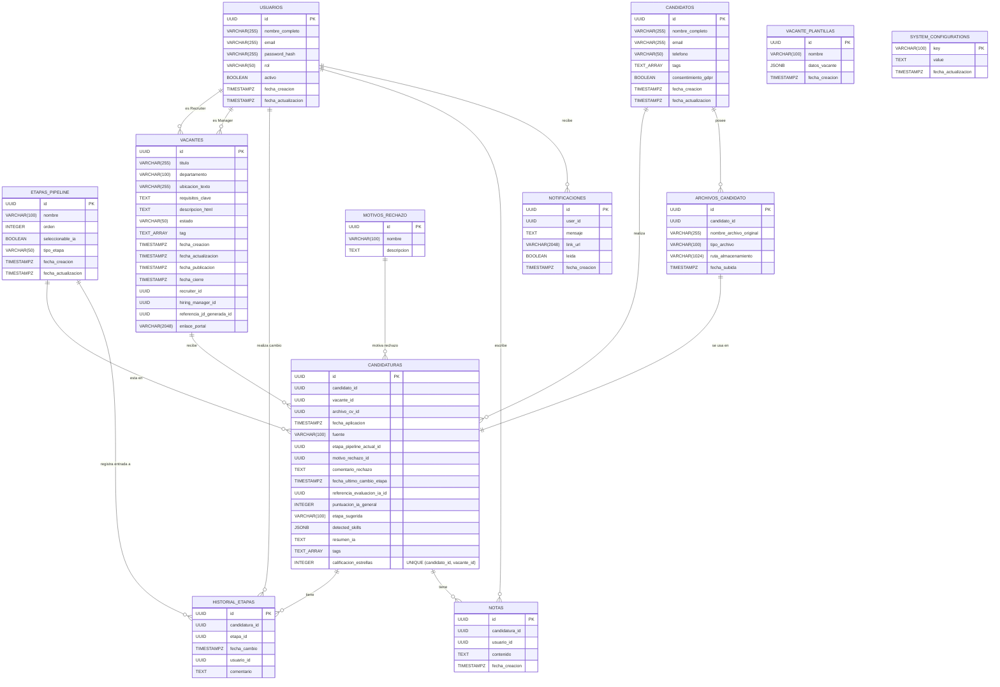

## 1. Base de Datos ATS MVP

Base de datos relacional (PostgreSQL) para gestionar el flujo principal de reclutamiento.

### 1.1. Tablas Principales

**Tabla: `usuarios`**
* Almacena la información de los usuarios internos del sistema (Reclutadores, Managers, Admins).
* Corresponde a la entidad `Usuario` (TK-006).

| Columna             | Tipo                         | Constraints                                      | Índice | Notas                                                |
| :------------------ | :--------------------------- | :----------------------------------------------- | :----- | :--------------------------------------------------- |
| `id`                | UUID                         | PRIMARY KEY, DEFAULT gen_random_uuid()           | PK     | Identificador único                                  |
| `nombre_completo`   | VARCHAR(255)                 | NOT NULL                                         |        | Nombre del usuario                                   |
| `email`             | VARCHAR(255)                 | NOT NULL, UNIQUE                                 | UNIQUE | Email (usado para login)                             |
| `password_hash`     | VARCHAR(255)                 | NOT NULL                                         |        | Hash seguro de la contraseña (ej. bcrypt)           |
| `rol`               | VARCHAR(50)                  | NOT NULL, CHECK (rol IN ('RECLUTADOR','MANAGER','ADMIN')) | IDX    | Rol del usuario                                    |
| `activo`            | BOOLEAN                      | NOT NULL, DEFAULT true                           | IDX    | Indica si el usuario puede iniciar sesión            |
| `fecha_creacion`    | TIMESTAMP WITH TIME ZONE     | NOT NULL, DEFAULT CURRENT_TIMESTAMP              |        |                                                      |
| `fecha_actualizacion`| TIMESTAMP WITH TIME ZONE     | NOT NULL, DEFAULT CURRENT_TIMESTAMP              |        |                                                      |

**Tabla: `etapas_pipeline`**
* Define las etapas configurables del pipeline de selección.
* Corresponde a la entidad `EtapaPipeline` (TK-011).

| Columna           | Tipo                      | Constraints                                 | Índice | Notas                                                  |
| :---------------- | :------------------------ | :------------------------------------------ | :----- | :----------------------------------------------------- |
| `id`              | UUID                      | PRIMARY KEY, DEFAULT gen_random_uuid()      | PK     | Identificador único                                  |
| `nombre`          | VARCHAR(100)              | NOT NULL                                    |        | Nombre visible de la etapa (ej. "Entrevista RH")      |
| `orden`           | INTEGER                   | NOT NULL                                    | IDX    | Define la secuencia visual en el pipeline             |
| `seleccionable_ia`| BOOLEAN                   | NOT NULL, DEFAULT false                     | IDX    | Flag para RF-04B/TK-011                                |
| `tipo_etapa`      | VARCHAR(50)               | NULLABLE, CHECK (tipo_etapa IN ('INICIO', 'INTERMEDIO', 'FINAL', 'RECHAZO')) |        | Opcional: Para lógica adicional si se necesita       |
| `fecha_creacion`  | TIMESTAMP WITH TIME ZONE  | NOT NULL, DEFAULT CURRENT_TIMESTAMP         |        |                                                        |
| `fecha_actualizacion`| TIMESTAMP WITH TIME ZONE | NOT NULL, DEFAULT CURRENT_TIMESTAMP         |        |                                                        |

**Tabla: `vacantes`**
* Representa las ofertas de empleo.
* Corresponde al Aggregate Root `Vacante` (TK-016).

| Columna                       | Tipo                         | Constraints                                   | Índice | Notas                                                      |
| :---------------------------- | :--------------------------- | :------------------------------------------ | :----- | :--------------------------------------------------------- |
| `id`                          | UUID                         | PRIMARY KEY, DEFAULT gen_random_uuid()        | PK     | Identificador único                                      |
| `titulo`                      | VARCHAR(255)                 | NOT NULL                                      |        | Título del puesto                                        |
| `departamento`                | VARCHAR(100)                 | NULLABLE                                      |        |                                                            |
| `ubicacion_texto`             | VARCHAR(255)                 | NOT NULL                                      |        | Descripción textual de la ubicación                      |
| `requisitos_clave`            | TEXT                         | NULLABLE                                      |        | Resumen inicial de requisitos                            |
| `descripcion_html`            | TEXT                         | NULLABLE                                      |        | Descripción completa (podría venir de IA o manual)         |
| `estado`                      | VARCHAR(50)                  | NOT NULL, DEFAULT 'BORRADOR', CHECK (estado IN ('BORRADOR', 'PUBLICADA', 'CERRADA', 'ARCHIVADA')) | IDX    | Estado actual de la vacante                              |
| `tags`                        | TEXT[]                       | NULLABLE                                      | GIN?   | Array de tags/palabras clave                             |
| `fecha_creacion`              | TIMESTAMP WITH TIME ZONE     | NOT NULL, DEFAULT CURRENT_TIMESTAMP           |        |                                                            |
| `fecha_actualizacion`         | TIMESTAMP WITH TIME ZONE     | NOT NULL, DEFAULT CURRENT_TIMESTAMP           |        |                                                            |
| `fecha_publicacion`           | TIMESTAMP WITH TIME ZONE     | NULLABLE                                      |        | Se establece al pasar a 'PUBLICADA' (TK-027)               |
| `fecha_cierre`                | TIMESTAMP WITH TIME ZONE     | NULLABLE                                      |        | Se establece al pasar a 'CERRADA' (TK-027)                |
| `recruiter_id`                | UUID                         | NULLABLE, FK (usuarios.id) ON DELETE SET NULL | FK,IDX | Usuario Reclutador asignado                              |
| `hiring_manager_id`           | UUID                         | NULLABLE, FK (usuarios.id) ON DELETE SET NULL | FK,IDX | Usuario Hiring Manager asignado                          |
| `referencia_jd_generada_id`   | UUID                         | NULLABLE                                      | IDX    | ID de `DescripcionPuestoGenerada` en Core AI             |
| `enlace_portal`               | VARCHAR(2048)                | NULLABLE                                      |        | URL pública (si aplica, puede ser generada)              |

**Tabla: `candidatos`**
* Almacena la información básica identificativa de las personas que aplican.
* Corresponde a la entidad `Candidato` (parte del BC `Perfil de Candidato` en ATS).

| Columna               | Tipo                         | Constraints                                | Índice | Notas                                                |
| :-------------------- | :--------------------------- | :----------------------------------------- | :----- | :--------------------------------------------------- |
| `id`                  | UUID                         | PRIMARY KEY, DEFAULT gen_random_uuid()     | PK     | Identificador único                                  |
| `nombre_completo`     | VARCHAR(255)                 | NOT NULL                                   |        |                                                      |
| `email`               | VARCHAR(255)                 | NOT NULL, UNIQUE                           | UNIQUE | Identificador principal                              |
| `telefono`            | VARCHAR(50)                  | NULLABLE                                   |        |                                                      |
| `tags`                | TEXT[]                       | NULLABLE                                   | GIN?   | Tags manuales asignados al candidato               |
| `consentimiento_gdpr` | BOOLEAN                      | NOT NULL, DEFAULT false                    |        | Indica si aceptó política                          |
| `fecha_creacion`      | TIMESTAMP WITH TIME ZONE     | NOT NULL, DEFAULT CURRENT_TIMESTAMP        |        |                                                      |
| `fecha_actualizacion` | TIMESTAMP WITH TIME ZONE     | NOT NULL, DEFAULT CURRENT_TIMESTAMP        |        |                                                      |

**Tabla: `archivos_candidato`**
* Referencia a los archivos (principalmente CVs) subidos por los candidatos.
* Parte del Aggregate `Candidato` o `Candidatura` conceptualmente.

| Columna                   | Tipo                         | Constraints                                   | Índice | Notas                                                           |
| :------------------------ | :--------------------------- | :-------------------------------------------- | :----- | :-------------------------------------------------------------- |
| `id`                      | UUID                         | PRIMARY KEY, DEFAULT gen_random_uuid()        | PK     | Identificador único                                           |
| `candidato_id`            | UUID                         | NOT NULL, FK (candidatos.id) ON DELETE CASCADE | FK,IDX | A qué candidato pertenece (Borrar archivos si se borra candidato) |
| `nombre_archivo_original` | VARCHAR(255)                 | NOT NULL                                      |        | Nombre con el que se subió                                  |
| `tipo_archivo`            | VARCHAR(100)                 | NOT NULL                                      |        | MIME Type (ej. 'application/pdf')                         |
| `ruta_almacenamiento`     | VARCHAR(1024)                | NOT NULL                                      |        | Referencia al archivo en storage (S3 key, path local...)      |
| `fecha_subida`            | TIMESTAMP WITH TIME ZONE     | NOT NULL, DEFAULT CURRENT_TIMESTAMP           |        |                                                                 |

**Tabla: `candidaturas`**
* Representa la postulación de un `Candidato` a una `Vacante`.
* Corresponde al Aggregate Root `Candidatura`.

| Columna                       | Tipo                         | Constraints                                            | Índice | Notas                                                                         |
| :---------------------------- | :--------------------------- | :----------------------------------------------------- | :----- | :---------------------------------------------------------------------------- |
| `id`                          | UUID                         | PRIMARY KEY, DEFAULT gen_random_uuid()                 | PK     | Identificador único                                                         |
| `candidato_id`                | UUID                         | NOT NULL, FK (candidatos.id) ON DELETE RESTRICT        | FK,IDX | Quién aplica (No borrar candidato si tiene candidaturas)                      |
| `vacante_id`                  | UUID                         | NOT NULL, FK (vacantes.id) ON DELETE RESTRICT          | FK,IDX | A qué vacante aplica (No borrar vacante si tiene candidaturas)                |
| `archivo_cv_id`               | UUID                         | NOT NULL, FK (archivos_candidato.id) ON DELETE RESTRICT | FK,IDX | Qué CV se usó (No borrar archivo si está asociado a candidatura)             |
| `fecha_aplicacion`            | TIMESTAMP WITH TIME ZONE     | NOT NULL, DEFAULT CURRENT_TIMESTAMP                    | IDX    | Cuándo aplicó                                                               |
| `fuente`                      | VARCHAR(100)                 | NULLABLE                                               |        | De dónde vino (ej. 'Portal Empleo', 'Referido')                           |
| `etapa_pipeline_actual_id`    | UUID                         | NOT NULL, FK (etapas_pipeline.id) ON DELETE RESTRICT   | FK,IDX | Etapa actual (No borrar etapa si está en uso)                               |
| `motivo_rechazo_id`           | UUID                         | NULLABLE, FK (motivos_rechazo.id) ON DELETE SET NULL    | FK,IDX | Razón de descarte (Permitir borrar motivo)                                  |
| `comentario_rechazo`          | TEXT                         | NULLABLE                                               |        | Texto libre sobre el rechazo                                                  |
| `fecha_ultimo_cambio_etapa`   | TIMESTAMP WITH TIME ZONE     | NOT NULL, DEFAULT CURRENT_TIMESTAMP                    | IDX    |                                                                               |
| `referencia_evaluacion_ia_id` | UUID                         | NULLABLE                                               | IDX    | ID de `EvaluacionCandidatoIA` en Core AI                                    |
| `puntuacion_ia_general`       | INTEGER                      | NULLABLE, CHECK (0 <= puntuacion_ia_general AND puntuacion_ia_general <= 100) | IDX    | Score IA (copia/cache)                                                      |
| `etapa_sugerida`              | VARCHAR(100)                 | NULLABLE                                               |        | Nombre/ID de etapa sugerida por IA (copia/cache)                            |
| `detected_skills`             | JSONB                        | NULLABLE                                               | GIN?   | Skills detectadas por IA (copia/cache, Array de Strings) - TK-140             |
| `resumen_ia`                  | TEXT                         | NULLABLE                                               |        | Resumen IA (copia/cache) - TK-108                                             |
| `tags`                        | TEXT[]                       | NULLABLE                                               | GIN?   | Tags manuales asignados a la candidatura                                    |
| `calificacion_estrellas`      | INTEGER                      | NULLABLE, CHECK (1 <= calificacion_estrellas AND calificacion_estrellas <= 5) |        | Calificación manual (Futuro, Anexo II)                                      |
|                               |                              | UNIQUE (`candidato_id`, `vacante_id`)                  | UNIQUE | Evita aplicar dos veces a la misma vacante                                  |

**Tabla: `historial_etapas`**
* Registra los cambios de etapa de una `Candidatura`.

| Columna         | Tipo                      | Constraints                                     | Índice | Notas                                         |
| :-------------- | :------------------------ | :---------------------------------------------- | :----- | :-------------------------------------------- |
| `id`            | UUID                      | PRIMARY KEY, DEFAULT gen_random_uuid()          | PK     | Identificador único                         |
| `candidatura_id`| UUID                      | NOT NULL, FK (candidaturas.id) ON DELETE CASCADE | FK,IDX | A qué candidatura afecta (Borrar historial si se borra candidatura) |
| `etapa_id`      | UUID                      | NOT NULL, FK (etapas_pipeline.id) ON DELETE RESTRICT | FK,IDX | A qué etapa se movió (No borrar etapa si está en historial) |
| `fecha_cambio`  | TIMESTAMP WITH TIME ZONE  | NOT NULL, DEFAULT CURRENT_TIMESTAMP             | IDX    | Cuándo ocurrió el cambio                      |
| `usuario_id`    | UUID                      | NULLABLE, FK (usuarios.id) ON DELETE SET NULL    | FK,IDX | Quién realizó el cambio (null si sistema)     |
| `comentario`    | TEXT                      | NULLABLE                                        |        | Nota sobre el cambio                        |

**Tabla: `notas`**
* Permite añadir comentarios manuales a una `Candidatura`.

| Columna          | Tipo                      | Constraints                                     | Índice | Notas                                     |
| :--------------- | :------------------------ | :---------------------------------------------- | :----- | :------------------------------------------ |
| `id`             | UUID                      | PRIMARY KEY, DEFAULT gen_random_uuid()          | PK     | Identificador único                       |
| `candidatura_id` | UUID                      | NOT NULL, FK (candidaturas.id) ON DELETE CASCADE | FK,IDX | Sobre qué candidatura (Borrar notas si se borra candidatura) |
| `usuario_id`     | UUID                      | NOT NULL, FK (usuarios.id) ON DELETE RESTRICT    | FK,IDX | Quién escribió la nota (No borrar usuario si tiene notas) |
| `contenido`      | TEXT                      | NOT NULL                                        |        | Texto de la nota                          |
| `fecha_creacion` | TIMESTAMP WITH TIME ZONE  | NOT NULL, DEFAULT CURRENT_TIMESTAMP             |        |                                             |

**Tabla: `motivos_rechazo`** (Catálogo)
* Define las razones estándar para descartar una candidatura.

| Columna     | Tipo                      | Constraints                            | Índice | Notas                                      |
| :---------- | :------------------------ | :------------------------------------- | :----- | :----------------------------------------- |
| `id`        | UUID                      | PRIMARY KEY, DEFAULT gen_random_uuid() | PK     | Identificador único                      |
| `nombre`    | VARCHAR(100)              | NOT NULL, UNIQUE                       | UNIQUE | Nombre corto del motivo (ej. 'No_ajuste') |
| `descripcion`| TEXT                      | NULLABLE                               |        | Explicación (opcional)                   |

**Tabla: `vacante_plantillas`** (Could Have - US-008)
* Almacena plantillas reutilizables para vacantes (TK-030).

| Columna           | Tipo                      | Constraints                            | Índice | Notas                                                        |
| :---------------- | :------------------------ | :------------------------------------- | :----- | :----------------------------------------------------------- |
| `id`              | UUID                      | PRIMARY KEY, DEFAULT gen_random_uuid() | PK     | Identificador único                                        |
| `nombre`          | VARCHAR(100)              | NOT NULL, UNIQUE                       | UNIQUE | Nombre de la plantilla                                     |
| `datos_vacante`   | JSONB                     | NOT NULL                               | GIN?   | JSON con campos relevantes de la vacante (titulo, desc, etc.) |
| `fecha_creacion`  | TIMESTAMP WITH TIME ZONE  | NOT NULL, DEFAULT CURRENT_TIMESTAMP    |        |                                                              |

**Tabla: `system_configurations`** (Could Have - US-032)
* Almacena configuraciones globales (TK-101).

| Columna           | Tipo                      | Constraints                            | Índice | Notas                                                        |
| :---------------- | :------------------------ | :------------------------------------- | :----- | :----------------------------------------------------------- |
| `key`             | VARCHAR(100)              | PRIMARY KEY                            | PK     | Nombre de la configuración (ej. 'ENABLE_AUTO_STAGE_MOVE') |
| `value`           | TEXT                      | NOT NULL                               |        | Valor (ej. 'true', 'false', número como string)            |
| `fecha_actualizacion`| TIMESTAMP WITH TIME ZONE | NOT NULL, DEFAULT CURRENT_TIMESTAMP    |        |                                                              |

**Tabla: `notificaciones`** (Could Have - US-041)
* Almacena notificaciones internas para usuarios (TK-141).

| Columna           | Tipo                      | Constraints                                     | Índice | Notas                                                   |
| :---------------- | :------------------------ | :---------------------------------------------- | :----- | :------------------------------------------------------ |
| `id`              | UUID                      | PRIMARY KEY, DEFAULT gen_random_uuid()          | PK     | Identificador único                                   |
| `user_id`         | UUID                      | NOT NULL, FK (usuarios.id) ON DELETE CASCADE    | FK,IDX | Destinatario (Borrar notifs si se borra usuario)      |
| `mensaje`         | TEXT                      | NOT NULL                                        |        | Texto de la notificación                              |
| `link_url`        | VARCHAR(2048)             | NULLABLE                                        |        | Enlace a la entidad relevante (candidatura, etc.)      |
| `leida`           | BOOLEAN                   | NOT NULL, DEFAULT false                         | IDX    | Indica si el usuario la ha leído                      |
| `fecha_creacion`  | TIMESTAMP WITH TIME ZONE  | NOT NULL, DEFAULT CURRENT_TIMESTAMP             | IDX    |                                                         |

### 1.2. Diagrama ERD (Mermaid) - ATS MVP

