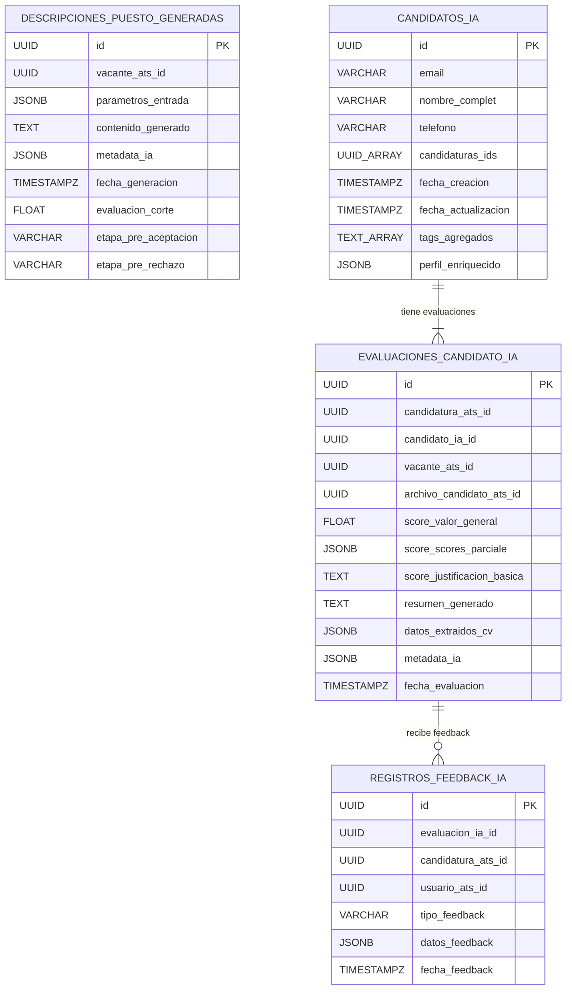

## 2. Base de Datos TalentIA Core AI

Se propone una base de datos que puede ser relacional (ej. PostgreSQL) o documental (ej. MongoDB), o una combinación, dado que algunas entidades se benefician de la flexibilidad de JSON/Documentos (Arquitectura Políglota - PRD Sec 12). Para simplificar la definición inicial, se mostrará una versión relacional con uso de `JSONB` donde aplique.

### 2.1. Tablas Principales

**Tabla: `descripciones_puesto_generadas`**
* Almacena las JDs generadas/configuradas por IA.
* Corresponde al Aggregate Root `DescripcionPuestoGenerada`.

| Columna               | Tipo                      | Constraints                            | Índice | Notas                                                    |
| :-------------------- | :------------------------ | :------------------------------------- | :----- | :------------------------------------------------------- |
| `id`                  | UUID                      | PRIMARY KEY, DEFAULT gen_random_uuid() | PK     | Identificador único                                    |
| `vacante_ats_id`      | UUID                      | NOT NULL                               | IDX    | ID de la `Vacante` en ATS MVP a la que pertenece         |
| `parametros_entrada`  | JSONB                     | NULLABLE                               | GIN?   | Datos usados para generar (ej. prompt)                   |
| `contenido_generado`  | TEXT                      | NULLABLE                               |        | Texto completo de la JD generada                       |
| `metadata_ia`         | JSONB                     | NULLABLE                               | GIN?   | Info del proceso (modelo LLM, tokens, etc.)            |
| `fecha_generacion`    | TIMESTAMP WITH TIME ZONE  | NOT NULL, DEFAULT CURRENT_TIMESTAMP    |        |                                                          |
| `evaluacion_corte`    | FLOAT                     | NULLABLE, CHECK (0 <= val <= 100)      |        | Umbral score IA (RF-04B/TK-060)                          |
| `etapa_pre_aceptacion`| VARCHAR(100)              | NULLABLE                               |        | ID/Nombre etapa si score >= corte (RF-04B/TK-060)        |
| `etapa_pre_rechazo`   | VARCHAR(100)              | NULLABLE                               |        | ID/Nombre etapa si score < corte (RF-04B/TK-060)         |

**Tabla: `candidatos_ia`**
* Almacena el perfil unificado del candidato en Core AI.
* Corresponde al Aggregate Root `CandidatoIA` (TK-062).

| Columna               | Tipo                      | Constraints                            | Índice | Notas                                                     |
| :-------------------- | :------------------------ | :------------------------------------- | :----- | :-------------------------------------------------------- |
| `id`                  | UUID                      | PRIMARY KEY, DEFAULT gen_random_uuid() | PK     | Identificador único                                     |
| `email`               | VARCHAR(255)              | NOT NULL, UNIQUE                       | UNIQUE | Clave natural para vincular/agregar                     |
| `nombre_completo`     | VARCHAR(255)              | NULLABLE                               |        | Sincronizado desde ATS                                  |
| `telefono`            | VARCHAR(50)               | NULLABLE                               |        | Sincronizado desde ATS                                  |
| `candidaturas_ids`    | UUID[]                    | NOT NULL, DEFAULT ARRAY[]::UUID[]      | GIN?   | Array de IDs de `Candidatura` del ATS MVP             |
| `fecha_creacion`      | TIMESTAMP WITH TIME ZONE  | NOT NULL, DEFAULT CURRENT_TIMESTAMP    |        |                                                           |
| `fecha_actualizacion` | TIMESTAMP WITH TIME ZONE  | NOT NULL, DEFAULT CURRENT_TIMESTAMP    |        |                                                           |
| `tags_agregados`      | TEXT[]                    | NULLABLE                               | GIN?   | Opcional: Tags consolidados/inferidos                 |
| `perfil_enriquecido`  | JSONB                     | NULLABLE                               | GIN?   | Opcional: Info agregada por IA (resumen carrera, etc.) |

**Tabla: `evaluaciones_candidato_ia`**
* Almacena el resultado de la evaluación de un CV para una candidatura.
* Corresponde al Aggregate Root `EvaluacionCandidatoIA`.

| Columna                       | Tipo                      | Constraints                                 | Índice | Notas                                                           |
| :---------------------------- | :------------------------ | :------------------------------------------ | :----- | :-------------------------------------------------------------- |
| `id`                          | UUID                      | PRIMARY KEY, DEFAULT gen_random_uuid()      | PK     | Identificador único de la evaluación                          |
| `candidatura_ats_id`          | UUID                      | NOT NULL                                    | IDX    | ID de la `Candidatura` en ATS MVP                             |
| `candidato_ia_id`             | UUID                      | NOT NULL, FK -> candidatos_ia(id)           | FK,IDX | Vínculo al perfil unificado                                     |
| `vacante_ats_id`              | UUID                      | NOT NULL                                    | IDX    | ID de la `Vacante` en ATS MVP                                   |
| `archivo_candidato_ats_id`    | UUID                      | NULLABLE                                    | IDX    | ID del `ArchivoCandidato` específico evaluado (si aplica)       |
| `score_valor_general`         | FLOAT                     | NULLABLE, CHECK (0 <= val <= 100)           | IDX    | Score principal (VO `Score`)                                    |
| `score_scores_parciales`      | JSONB                     | NULLABLE                                    | GIN?   | Desglose (VO `Score`)                                           |
| `score_justificacion_basica`  | TEXT                      | NULLABLE                                    |        | Breve explicación (VO `Score`)                                |
| `resumen_generado`            | TEXT                      | NULLABLE                                    |        | Resumen textual (US-025 / TK-079)                             |
| `datos_extraidos_cv`          | JSONB                     | NULLABLE                                    | GIN?   | Datos parseados (skills, exp, edu, soft skills?) (TK-070/TK-080) |
| `metadata_ia`                 | JSONB                     | NULLABLE                                    | GIN?   | Info del proceso (modelo, confianza, etc.)                    |
| `fecha_evaluacion`            | TIMESTAMP WITH TIME ZONE  | NOT NULL, DEFAULT CURRENT_TIMESTAMP         |        |                                                                 |

**Tabla: `registros_feedback_ia`**
* Almacena el feedback proporcionado por los usuarios.
* Corresponde al Aggregate Root `RegistroFeedbackIA` (TK-135).

| Columna              | Tipo                      | Constraints                                     | Índice | Notas                                                             |
| :------------------- | :------------------------ | :---------------------------------------------- | :----- | :---------------------------------------------------------------- |
| `id`                 | UUID                      | PRIMARY KEY, DEFAULT gen_random_uuid()          | PK     | Identificador único                                             |
| `evaluacion_ia_id`   | UUID                      | NOT NULL, FK -> evaluaciones_candidato_ia(id)   | FK,IDX | Evaluación sobre la que se da feedback                          |
| `candidatura_ats_id` | UUID                      | NOT NULL                                        | IDX    | Contexto ATS                                                      |
| `usuario_ats_id`     | UUID                      | NOT NULL                                        | IDX    | Quién dio el feedback (ID de `Usuario` ATS)                   |
| `tipo_feedback`      | VARCHAR(50)               | NOT NULL, CHECK (tipo_feedback IN (...))        | IDX    | 'SCORE_VALIDADO_UP', 'SCORE_AJUSTADO', 'SKILL_VALIDADA', ...    |
| `datos_feedback`     | JSONB                     | NULLABLE                                        | GIN?   | Detalles: { adjusted_score: 85, skill: "Java", validation: "OK" } |
| `fecha_feedback`     | TIMESTAMP WITH TIME ZONE  | NOT NULL, DEFAULT CURRENT_TIMESTAMP             |        |                                                                   |

### 2.2. Diagrama ERD (Conceptual) - TalentIA Core AI

