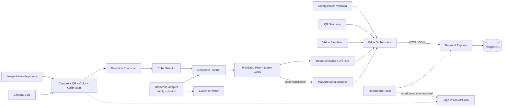

# Plan de Entrega Final - RoboDock AI

## 1. Objetivo de la entrega final

Integrar el MVP validado en Entrega 2 con una cámara cenital real, lectura QR, detección de cubos por color con OpenCV y control seguro del MaxArm, manteniendo `simulation` como fallback permanente para desarrollo, QA y demostración.

La entrega debe demostrar un flujo ejecutable y trazable:

```text
cámara -> QR de camión -> sesión -> detección OpenCV -> selección de cubo
-> planificación y validación -> MaxArm o simulation -> backend -> dashboard
```

El spike `dynamic_pickup_maxarm_pick` cuenta con validación física/empírica reportada en la que el MaxArm descargó cubos hacia zonas por color. Esa validación demuestra factibilidad del spike, pero no equivale todavía a operación hardware final integrada: el hardware solo se considerará implementado en `finalproject-ASP` cuando exista evidencia reproducible y correlacionada con Edge, Backend y dashboard.

## 2. Alcance funcional final

### Must

- Conservar y volver a validar el flujo completo de Entrega 2 en `simulation`.
- Ejecutar el Edge mediante adapters configurables, sin cambiar los contratos REST existentes salvo extensiones compatibles.
- Capturar frames desde imagen de prueba o cámara real configurable.
- Leer y validar un `truckCode` mediante QR real.
- Crear una sesión de descarga asociada al camión detectado.
- Detectar cubos `red`, `blue`, `green` y `yellow` dentro de una ROI calibrada.
- Registrar en Backend una captura estable de detecciones, evitando duplicados por cada frame.
- Transformar el centro del cubo desde imagen a una pose candidata del robot mediante calibración explícita.
- Cargar desde configuración externa las zonas `red`, `blue`, `yellow` y `green`, con cuatro posiciones por color y campos `code`, `color`, `position_order`, `x`, `y`, `z`, `active` y `occupied`.
- Seleccionar para cada cubo una posición del mismo color con `active=true` y `occupied=false`, priorizando el menor `position_order`.
- Marcar una posición como `occupied=true` únicamente después de confirmar la descarga y permitir un reset explícito y seguro para nuevas pruebas.
- Ejecutar siempre un dry run verificable antes de habilitar movimiento.
- Habilitar MaxArm físico únicamente con una bandera explícita, doble confirmación operativa y calibración válida.
- Registrar el resultado real de cada intento como `PLANNED`, `SUCCESS` o `ERROR`, con modo, comandos y respuesta técnica sanitizada.
- Mostrar en el dashboard sesión, camión, conteos, fuente de visión, modo del robot, última acción y errores relevantes.
- Conservar evidencia separada para `simulation`, cámara/OpenCV, dry run y hardware.

### Should

- Mostrar una imagen procesada reciente o stream MJPEG local en el dashboard, sin convertirlo en dependencia del flujo principal.
- Permitir cerrar una sesión para que las pruebas repetidas no acumulen sesiones activas.
- Ejecutar varios ciclos controlados, uno por uno, y asignar zonas de descarga por color.

### Fuera de alcance

- Operación autónoma continua sin supervisión.
- Seguridad industrial certificada, prevención completa de colisiones o uso en producción.
- Movimiento simultáneo de múltiples robots.
- Cloud, autenticación empresarial, RBAC, colas o analítica avanzada.
- Reemplazar PostgreSQL, Backend o Frontend ya validados.

## 3. Historias de usuario finales

| ID | Prioridad | Historia |
|---|---|---|
| HU-F01 | Must | Como operador, quiero ejecutar el sistema en `simulation` para validar el flujo completo sin conectar hardware. |
| HU-F02 | Must | Como operador, quiero identificar el camión mediante un QR visto por la cámara para crear la sesión correcta sin digitar el código. |
| HU-F03 | Must | Como operador, quiero detectar los cubos por color dentro de la zona de carga para conocer qué objetos puede manipular el sistema. |
| HU-F04 | Must | Como operador, quiero revisar la pose y la secuencia calculadas en dry run para evitar movimientos físicos con datos inválidos. |
| HU-F05 | Must | Como operador autorizado, quiero habilitar explícitamente el MaxArm para ejecutar un pick/drop controlado. |
| HU-F06 | Must | Como operador, quiero que una falla de cámara, calibración, serial o Backend detenga el ciclo y quede registrada. |
| HU-F07 | Must | Como observador, quiero ver en el dashboard el origen de los datos y el modo real de ejecución para no confundir simulación con hardware. |
| HU-F08 | Must | Como evaluador, quiero evidencias fechadas de cada nivel de integración para verificar qué fue realmente ejecutado. |
| HU-F09 | Should | Como operador, quiero cerrar una sesión y reiniciar un escenario de prueba de forma controlada. |
| HU-F10 | Should | Como operador, quiero ver la imagen procesada reciente para comprobar QR, ROI y bounding boxes. |
| HU-F11 | Must | Como operador, quiero que cada cubo se asigne a la primera posición activa y libre de su color para descargarlo en una ubicación determinista. |
| HU-F12 | Must | Como operador, quiero que una descarga confirmada ocupe su posición y que una zona llena detenga el pick antes de mover el robot. |
| HU-F13 | Must | Como operador, quiero resetear la ocupación solo después de vaciar físicamente las zonas, sin abrir cámara ni serial. |

## 4. Criterios de aceptación

### Criterios transversales

1. `simulation` sigue siendo el modo por defecto y completa el flujo de Entrega 2 sin cámara ni puerto serial.
2. Una ejecución hardware requiere configuración explícita; la ausencia o invalidez de cualquier gate cancela el movimiento.
3. `id` se mantiene como UUID técnico y `code` como identificador de negocio.
4. No se guardan secretos ni datos sensibles en logs, evidencia o configuración versionada.
5. Cada error controlado termina con código no exitoso o estado `ERROR`, libera cámara/serial y conserva trazabilidad.

### Cámara, QR y OpenCV

6. El índice de cámara, resolución, ROI, rangos HSV y umbrales se cargan desde configuración, no desde constantes ocultas.
7. También puede procesarse una imagen o video de prueba sin cámara.
8. Solo un QR con formato permitido y estabilidad mínima configurable crea una sesión.
9. Un QR inválido, ausente o fuera de ROI no crea una sesión.
10. En un set controlado y documentado de al menos diez escenas, el conteo total y por color coincide en al menos ocho; los fallos quedan registrados para ajustar calibración.
11. Las detecciones enviadas al Backend conservan coordenadas globales, bounding box, confianza o score equivalente y `source=opencv-camera` o `opencv-file`.
12. Una misma captura estable se registra una sola vez por ciclo.

### Calibración y MaxArm

13. La calibración de pickup y robot tiene versión/fecha, dimensiones físicas, puntos requeridos y validación de límites.
14. Cada pose candidata se valida contra límites configurados y usa una Z segura antes de aproximarse o trasladarse.
15. El firmware recibe coordenadas enteras y cada comando queda logueado con respuesta o timeout.
16. El dry run produce la secuencia completa sin abrir serial ni mover el brazo.
17. El modo físico exige, como mínimo: `mode=hardware`, habilitación de movimiento, dry run exitoso de la misma selección, confirmación humana, serial disponible y zona despejada.
18. Si falla un paso crítico, no se continúa con la secuencia normal; se intenta una liberación/parada segura solo si esa maniobra fue previamente validada.
19. El claim mínimo de MaxArm real requiere un pick/drop físico exitoso de un cubo en un entorno controlado, respaldado por video, comandos, respuestas del firmware y acción `mode=hardware` en Backend.
20. Si el criterio anterior no se logra, la entrega debe indicar MaxArm como pendiente y demostrar `simulation` más dry run; nunca convertir un intento fallido en evidencia de éxito.

### Drop zones

21. Dado un cubo de un color soportado, `DropZonePlanner` solo devuelve una posición cuyo `color` coincide.
22. Solo son elegibles posiciones con `active=true` y `occupied=false`; entre ellas se elige determinísticamente el menor `position_order`.
23. Códigos u órdenes duplicados, colores inconsistentes, coordenadas fuera de límites o JSON inválido producen un error fail-closed y cero comandos físicos.
24. Dos asignaciones consecutivas del mismo color no pueden reservar el mismo slot.
25. La posición pasa a `occupied=true` al confirmarse el release/descarga, aunque falle después el retorno del brazo; el fallo de retorno se registra por separado.
26. Un error o aborto anterior al release libera la reserva y no marca la posición como ocupada.
27. Si el release físico se confirmó pero falla la persistencia de `occupied`, se bloquean nuevos picks y se exige conciliación humana; no se asume que el slot sigue libre.
28. Si la zona está llena o no tiene posiciones activas, el sistema devuelve `ZONE_UNAVAILABLE`, no inicia el pick, no envía serial y registra el motivo.
29. El reset requiere comando y confirmación explícitos, conserva `code`, `color`, coordenadas, orden y `active`, deja `occupied=false`, no abre cámara/serial y genera evidencia de auditoría.
30. `simulation` y dry run usan estado aislado o reiniciable y nunca alteran la ocupación canónica del perfil hardware.

### Backend y Frontend

31. Los siete endpoints actuales siguen funcionando.
32. El Backend distingue fuente de visión, dry run y movimiento físico sin inferir hardware solo desde un valor enviado por el cliente.
33. Cada acción conserva `selectedCube`, `dropZoneCode`, resultado del release y versión del estado/configuración sin guardar secretos.
34. El dashboard muestra explícitamente `simulation`, `dry run` o `hardware confirmado`, además de estado de cámara/visión y posición de descarga cuando estén disponibles.
35. La ausencia del servicio de visión no impide consultar el estado persistido ni ejecutar la demo en `simulation`.
36. Build de Backend y Frontend, compilación Python y pruebas de humo terminan sin errores.

## 5. Arquitectura objetivo: simulation + hardware



### Perfiles de ejecución

| Perfil | QR/visión | Robot | Registro esperado |
|---|---|---|---|
| `simulation` | Simulados | Simulado | acción `mode=simulation`, `dryRun=true` |
| `vision-dry-run` | Cámara/OpenCV real | Plan sin serial | detecciones `opencv-camera`; acción `mode=simulation`, `dryRun=true` |
| `hardware` | Cámara/OpenCV real | Serial real | acción `mode=hardware` solo para intento físico; resultado según respuesta y evidencia |

El perfil del Edge y el modo de la acción no deben confundirse. Usar cámara real con robot en dry run no autoriza registrar una acción como hardware.

### Ciclo de estado de una posición

```text
AVAILABLE (active=true, occupied=false)
-> RESERVED en memoria para un único runId
-> OCCUPIED (release confirmado y estado persistido)
```

- Antes del release, un error cancela la reserva y conserva `occupied=false`.
- Después del release, el slot se considera físicamente ocupado aunque falle el retorno del brazo.
- Si no puede persistirse ese estado, el sistema entra en bloqueo por divergencia hasta una conciliación humana.
- `active=false` excluye el slot sin cambiar su ocupación.
- El reset solo se ejecuta con zonas físicamente vacías y sin reserva o ciclo activo.

### Límites de responsabilidad

- Edge posee captura, visión, calibración, planificación, gates y comunicación serial.
- OpenCV produce un `DetectionSnapshot`; no conoce drop zones, no persiste `occupied` y no mueve el robot.
- `CubeSelector` elige un cubo elegible mediante una política determinista documentada.
- `DropZonePlanner` es lógica pura: recibe color y snapshot de posiciones, filtra `active && !occupied`, ordena por `position_order` y devuelve un slot o `ZONE_UNAVAILABLE`.
- `DropZoneAdapter` carga, valida, reserva, confirma, resetea y persiste el estado externo a código. Para el MVP local opera con un único writer y escritura atómica.
- Backend valida y persiste sesiones, detecciones, acciones y estado operacional; no mueve el robot.
- Frontend observa y presenta estado; no debe habilitar movimiento físico en esta entrega.
- Los adapters comparten modelos de salida para que `simulation` y hardware usen el mismo cliente API.
- El servicio de snapshot/stream, si se implementa, queda en Edge y es opcional para la operación principal.

## 6. Spikes/experiments relevantes encontrados

| Experiment | Hallazgo y evidencia local | Estado |
|---|---|---|
| `truck_code_detection/` | Detecta QR con `cv2.QRCodeDetector`, ROI persistente y retención temporal. El JSON del 07-05-2026 registra `TRUCK-002` válido. | Factibilidad de cámara/QR evidenciada; no integrado. |
| `vision_color_detection/` | Segmentación HSV, filtros geométricos, ROI y salida JSON para cuatro colores. | Referencia técnica; parámetros dependientes del montaje. |
| `integrated_vision_detection/` | Usa una cámara y ROI independientes para QR/carga. La evidencia del 21-06-2026 muestra `TRUCK-003` y seis cubos: 1 rojo, 1 azul, 2 verdes y 2 amarillos. | Factibilidad integrada de visión evidenciada; sin Backend. |
| `dynamic_pickup_detection/` | Homografía de cuatro puntos, vista normalizada, conversión px->cm e interpolación a poses candidatas. La evidencia del 21-06-2026 detecta seis cubos; una detección aparece con `size_valid=false`. | Base de calibración útil; no prueba precisión física del robot. |
| `dynamic_pickup_maxarm_pick/` | Integra visión dinámica, selección de cubo, pick/drop, Z segura, suction y descarga por color. Existe validación física/empírica reportada con MaxArm. Su JSON define 16 slots: cuatro para cada color, con orden, pose y estado. | Factibilidad física del spike validada de forma empírica; aún no es integración final reproducible en `finalproject-ASP`. |
| `dashboard_live_camera/` | FastAPI expone MJPEG y estado de visión; el frontend experimental consume ambos y contempla cámara desconectada. | Patrón reutilizable; stack separado del producto actual. |

Otros hallazgos:

- Hay calibraciones, poses y puertos diferentes entre archivos actuales y evidencias históricas.
- `dynamic_pickup_maxarm_pick/config.json` tiene actualmente `dry_run=false`, valor inseguro para adoptar como default.
- Hay archivos duplicados con sufijo `- copia` y logs con rutas absolutas históricas.
- `drop_zones_config.json` contiene `red`, `blue`, `yellow` y `green`, cuatro posiciones por color. En el snapshot revisado todas están activas y `DROP_BLUE_01` figura ocupada.
- El spike filtra `active=true && occupied=false`, elige el menor `position_order`, aborta antes del pick cuando no hay slot y ofrece `--reset-drop-zones` sin abrir cámara ni serial.
- La ocupación se muta directamente en un JSON local. Además, el dry run también puede marcar slots; por ello `occupied=true` no demuestra por sí solo una descarga física.
- Los JSON `dry_run=false` revisados contienen fallos de apertura de `COM3/COM4`. Esto no invalida la prueba física reportada, pero confirma que la evidencia final debe producirse nuevamente y quedar correlacionada dentro de `finalproject-ASP`.

## 7. Qué se reutilizará de los experiments

Se reutilizarán como diseño y se reimplementarán modularmente en `edge/`:

- Validación del patrón `TRUCK-*`, ROI QR y estabilidad temporal.
- Rangos HSV iniciales, operaciones morfológicas y filtros de área, forma y tamaño.
- Coordenadas globales y estructura JSON de las detecciones.
- Calibración por cuatro esquinas, homografía, vista normalizada y conversión px->cm.
- Interpolación bilineal como primera aproximación de cámara/pickup a robot, sujeta a validación física.
- Selección determinista de un cubo y asignación de una zona por color.
- Esquema externo de cuatro slots por color y política `active && !occupied`, menor `position_order`.
- Reset que conserva geometría, códigos, orden y activación sin iniciar cámara o robot.
- Secuencia conceptual de pose segura, pick, elevación, traslado, release y retorno.
- Comandos `POSE` enteros, timeout, espera de `DONE` y captura de errores seriales.
- Salidas debug con timestamp, frame original, frame anotado, JSON y resumen.
- Comportamiento degradado de status/snapshot cuando la cámara no está disponible.

La reutilización será por extracción de comportamiento y pruebas, no copiando archivos desde `_local_context/`.

## 8. Qué no debe copiarse directamente

- Scripts monolíticos que mezclan captura, UI, visión, planificación y serial.
- Constantes hardcodeadas de cámara, COM, HSV, ROI, delays, poses o dimensiones.
- Coordenadas de `pickup_robot_calibration.json`, `arm_named_poses.json` o `drop_zones_config.json` sin recalibración y aprobación.
- El default `dry_run=false`.
- `test_serial_pose.py`, porque abre serial y envía comandos al cargar el script.
- La mutación directa y no atómica de `occupied` en un JSON compartido. La política se conserva, pero el I/O debe encapsularse y endurecerse.
- El Backend FastAPI y el frontend HTML del dashboard experimental como reemplazo del Backend Express y React actuales.
- Rutas absolutas, archivos `- copia`, artefactos debug históricos o dependencias entre carpetas de experiments.
- La regla fija `TRUCK-00[1-3]` como única fuente de camiones válidos; la validación final debe alinearse con Backend/configuración.
- Un `SUCCESS` basado solo en enviar el comando: debe existir confirmación válida del firmware y evidencia del resultado físico.

## 9. Cambios requeridos en Edge

Estructura objetivo mínima:

```text
edge/src/
  edge_runner.py
  api_client.py
  config.py
  models.py
  qr/
    simulator.py
    opencv_reader.py
  vision/
    capture.py
    color_detector.py
    calibration.py
    cube_selector.py
    evidence.py
  robot/
    simulator.py
    planner.py
    drop_zone_planner.py
    drop_zone_adapter.py
    safety.py
    maxarm_serial.py
  service/
    vision_api.py          # opcional para status/snapshot/stream
```

Cambios:

1. Reemplazar la restricción exclusiva de `mode=simulation` por perfiles explícitos, conservando `simulation` como default.
2. Centralizar configuración y validarla al inicio; crear ejemplos seguros en `edge/config/` y variables en `.env.example`.
3. Separar captura, procesamiento y salida, aceptando cámara o archivo de prueba.
4. Implementar adapters QR y visión con una interfaz equivalente a los simuladores.
5. Añadir estabilidad de QR y detecciones para no crear sesiones o registros por cada frame.
6. Guardar evidencia JSON e imágenes fuera de la configuración, con rutas relativas y sin datos sensibles.
7. Incorporar calibración versionada y validaciones de dimensiones, puntos, workspace, Z y tamaño del cubo.
8. Implementar `CubeSelector` puro; el color debe provenir del cubo detectado y no de `robot.color` hardcodeado en configuración.
9. Implementar `DropZonePlanner` puro y testeable, separado de OpenCV, del filesystem y del adapter serial.
10. Implementar `DropZoneAdapter` para cargar/validar estado fresco, reservar, confirmar ocupación y resetear. Para el MVP: ciclo único, lock, escritura atómica temporal+replace, recuperación ante JSON corrupto y bloqueo ante divergencia.
11. Mantener la geometría/configuración fuera del código. Preferir configuración estática separada de estado runtime; si se conserva un solo JSON, aislar archivos de `simulation`, dry run y hardware.
12. Validar códigos y `position_order` únicos, orden positivo, colores, booleanos y coordenadas contra workspace/Z antes de habilitar una posición.
13. Confirmar `occupied` en el hito de release exitoso, no al terminar todos los pasos de retorno. Registrar por separado descarga y retorno.
14. Implementar reset explícito sin cámara/serial, prohibido durante una reserva/ciclo activo y condicionado a inspección humana de zonas vacías.
15. Implementar planner de movimiento puro y testeable antes del adapter serial.
16. Configurar COM, baudrate y timeout; redondear comandos a enteros y loguear comando/respuesta.
17. Exigir gates de seguridad y confirmación humana por ciclo. El brazo no se mueve al arrancar.
18. Registrar primero la intención `PLANNED` y finalizarla como `SUCCESS` o `ERROR`, incluyendo `dropZoneCode`, release y persistencia.
19. Liberar cámara y serial en salida normal, excepción o interrupción.
20. Agregar dependencias mínimas `opencv-python`, `numpy`, `pyserial` y, solo si se adopta el servicio local, FastAPI/Uvicorn.
21. Incorporar pruebas unitarias con imágenes/configuraciones de fixture y smoke tests de cada perfil.

## 10. Cambios requeridos en Backend

1. Mantener compatibles los siete endpoints existentes.
2. Aceptar y validar fuentes como `simulation`, `opencv-file` y `opencv-camera`; exponer la fuente relevante al dashboard.
3. Exponer metadata segura de detección/acción necesaria para modo, dry run, calibración y diagnóstico.
4. Agregar una transición controlada de acciones, por ejemplo `PATCH /robot/actions/:id`, para pasar de `PLANNED` a `SUCCESS` o `ERROR` sin crear acciones contradictorias.
5. Rechazar transiciones inválidas y evitar que una acción hardware quede exitosa sin resultado técnico.
6. Agregar cierre de sesión, por ejemplo `PATCH /sessions/:id`, conservando `finishedAt`.
7. Definir idempotencia o un `clientRunId` único para evitar duplicados al reintentar desde Edge.
8. Persistir en metadata al menos `selectedCube`, `dropZoneCode`, `positionOrder`, `releaseConfirmed`, `statePersisted`, `configVersion` y `runId`.
9. Ampliar `GET /dashboard/operational` de forma compatible con fuente, perfil, dry run, slot elegido, último error y timestamps.
10. Mantener detalles extensos en `metadata` antes de crear entidades adicionales; una migración nueva solo debe introducir campos con uso demostrado.
11. Añadir pruebas de validadores, transiciones, idempotencia y regresión de contratos.

## 11. Cambios requeridos en Frontend

1. Mantener la pantalla operacional actual y su manejo loading/error/empty.
2. Mostrar por separado fuente de visión y modo del robot.
3. Usar etiquetas inequívocas: `Simulation`, `Cámara + dry run` y `Hardware confirmado`.
4. Mostrar conexión de cámara/Edge, última actualización, calibración cargada y último error.
5. Incorporar auto-refresh configurable, conservando el botón manual.
6. Mostrar el estado `PLANNED` mientras un ciclo está en progreso y su resultado final.
7. Mostrar `dropZoneCode`, color, disponibilidad o `ZONE_UNAVAILABLE`, sin exponer controles físicos.
8. Consumir snapshot o MJPEG de Edge solo como panel opcional; si falla, el resto del dashboard continúa disponible.
9. No incluir controles de movimiento físico ni reset de ocupación en el navegador durante esta entrega.
10. Agregar pruebas de componentes para los tres perfiles, cámara desconectada y zona llena.
11. Actualizar `.env.example` si se añade `VITE_EDGE_VISION_URL`.

## 12. Plan de integración hardware

La integración avanzará por gates; no se salta un gate por presión de calendario.

| Gate | Actividad | Condición de salida |
|---|---|---|
| G0 - Baseline | Revalidar Backend, Frontend y Edge `simulation`. | Smoke E2E aprobado y evidencia nueva. |
| G1 - Cámara aislada | Abrir/cerrar cámara, procesar archivo y frame real, manejar desconexión. | Captura reproducible y liberación correcta. |
| G2 - QR + color | Calibrar ROI/HSV, estabilizar QR y evaluar escenas controladas. | Criterios 8-12 aprobados. |
| G3 - Coordenadas y drop zones | Recalibrar pickup/robot y cada slot activo; validar homografía, workspace, Z, códigos y órdenes únicos. | Poses candidatas y 16 slots revisados; configuración segura versionada. |
| G4 - Dry run integrado | Ejecutar E2E sin serial y probar asignación por color, orden consecutivo, inactivos, ocupados, zona llena, fallos y reset. | Planner, estado aislado, Backend y dashboard coinciden; cero comandos físicos. |
| G5 - Serial sin carga | Validar puerto y protocolo con una pose segura preaprobada, con zona despejada. | Respuesta `DONE` y parada controlada; evidencia disponible. |
| G6 - Pick controlado | Ejecutar un cubo/slot, con dry run del mismo plan, velocidad conservadora y operador listo para cortar energía. | Release, ocupación y retorno trazados; éxito reproducible o error sin claim final. |
| G7 - Regresión | Repetir `simulation`, dry run y flujo físico permitido. | Evidencias completas y demo ensayada. |

Para G5 y G6 se requiere checklist firmado por quien opera, observador presente y medio accesible para cortar energía. La primera prueba física debe usar una sola pose/cubo; la automatización multi-cubo es posterior.

## 13. Riesgos de seguridad física

| Riesgo | Nivel | Mitigación obligatoria |
|---|---|---|
| Movimiento inesperado al iniciar | Crítico | Default `simulation`, serial cerrado y movimiento solo tras doble habilitación y confirmación por ciclo. |
| Coordenadas fuera del workspace | Crítico | Límites configurados, validación previa, puntos de calibración y rechazo fail-closed. |
| Colisión con cámara, camión, mesa o persona | Crítico | Zona despejada, observador, recorrido lento por poses seguras y corte de energía accesible. |
| Descenso con Z incorrecta | Crítico | Z de aproximación y pick calibradas; probar primero sin carga y con margen conservador. |
| Succión activa durante una recuperación | Alto | Estado de suction explícito; maniobra de liberación segura previamente validada. |
| Pérdida o timeout serial | Alto | Detener secuencia, no asumir pose alcanzada y registrar `ERROR`; no encadenar más comandos normales. |
| Detección falsa o frame antiguo | Alto | Estabilidad temporal, timestamp, umbral de frescura y confirmación humana antes del movimiento. |
| Calibración obsoleta tras mover cámara/pickup | Crítico | Invalidar calibración al cambiar montaje y exigir versión/fecha compatible. |
| Activar accidentalmente config experimental | Crítico | No reutilizar configs locales; ejemplos versionados siempre seguros y `dry_run=true`. |
| Operación remota no supervisada | Crítico | Backend/Edge solo en red local controlada; dashboard sin controles físicos. |
| Dos procesos eligen el mismo slot | Crítico | Edge single-writer, reserva por ciclo, lock y rechazo de ejecución concurrente. |
| Crash o escritura fallida después del release | Crítico | Persistencia atómica; bloquear nuevos picks y exigir conciliación humana si el estado físico queda ambiguo. |
| Dry run contamina ocupación hardware | Alto | Estado por perfil o copia en memoria; simulation/dry run nunca escriben el estado canónico hardware. |
| Reset libera slots físicamente ocupados | Crítico | Reset manual, serial/cámara cerrados, cero ciclos activos, inspección de zonas vacías, confirmación y log. |
| JSON corrupto o actualización perdida | Alto | Validación fail-closed, temporal+replace, backup/recuperación y versión/hash del estado. |
| `occupied` diverge de la realidad física | Alto | Mostrar estado lógico, inspección/reconciliación humana y no usar el booleano como única prueba del mundo físico. |

Este proyecto académico no equivale a una evaluación de seguridad industrial.

## 14. Evidencias necesarias

| Evidencia | Contenido mínimo | Claim que habilita |
|---|---|---|
| Regresión simulation | Comandos, salida Edge, respuestas Backend y captura del dashboard. | Fallback funcional. |
| Dataset visión | Imágenes/videos de prueba, resultado esperado, JSON obtenido y métricas por escena. | OpenCV integrado y evaluado. |
| QR real | Foto/frame con QR, valor detectado, ROI, timestamp y sesión creada. | Identificación real por cámara. |
| Calibración | Archivo sanitizado, dimensiones, fecha, montaje y pruebas de puntos. | Transformación configurada, no exactitud física por sí sola. |
| Dry run | Secuencia completa, poses validadas, `serialOpened=false`, acción y dashboard. | Integración lógica sin movimiento. |
| Serial | Puerto lógico sanitizado si corresponde, comandos, respuestas/timeout y logs. | Comunicación serial, no pick exitoso por sí sola. |
| MaxArm físico | Video continuo del ciclo, JSON/log correlacionado, respuestas `DONE`, resultado y acción Backend `mode=hardware`. | Hardware real implementado para el escenario probado. |
| Drop zones | Snapshot antes/después, cubo/color, slot/código, orden, reserva, release, persistencia y `runId`; caso feliz por color y asignación consecutiva. | Política de descarga y ocupación reproducibles. |
| Zona no disponible | Slots llenos/inactivos, `ZONE_UNAVAILABLE`, cero pick y cero serial. | Aborto seguro antes del movimiento. |
| Reset de ocupación | Estado antes/después, confirmación, conservación de geometría/`active` y prueba de cámara/serial cerrados. | Reset seguro y repetible. |
| Divergencia de estado | Fallo de persistencia tras release o JSON inválido, bloqueo de nuevos picks y conciliación documentada. | Manejo fail-closed del estado ambiguo. |
| Fallos | Cámara desconectada, QR inválido, calibración inválida, timeout serial y Backend caído. | Manejo de errores y fail-safe. |
| Frontend | Capturas de los tres perfiles y estados de error. | Visibilidad operacional. |
| Prompt runs | Prompts, agentes, skills, archivos y resultado sin secretos. | Trazabilidad del desarrollo. |

Cada evidencia debe incluir fecha, commit o versión local identificable, configuración no secreta, pasos, esperado, obtenido y conclusión. `simulation`, dry run y hardware se almacenarán y nombrarán por separado.

## 15. Roadmap semanal hasta el 29-07-2026

| Semana | Objetivo y trabajo principal | Hito verificable |
|---|---|---|
| 28-06 al 01-07 | Aprobar este plan, congelar contratos base, ejecutar baseline de Entrega 2, definir estructura Edge, configuración segura y dataset inicial. | G0 aprobado; backlog y matriz de evidencia listos. |
| 02-07 al 08-07 | Modularizar Edge; implementar captura, QR, color, `DetectionSnapshot`, `CubeSelector` y pruebas con fixtures. No conectar MaxArm. | G1 y primera parte de G2 aprobadas; `simulation` sigue verde. |
| 09-07 al 15-07 | Implementar calibración, `DropZonePlanner` y `DropZoneAdapter`; validar 16 slots, estado aislado/atómico y casos de zona llena; extender Backend/Frontend. | G2, G3 y builds aprobados; dashboard muestra perfil y slot. |
| 16-07 al 22-07 | Ejecutar dry run E2E por color, ocupación consecutiva y reset; validar serial y una pose segura; corregir límites, timeouts y recuperación. | G4 aprobado y G5 aprobado o documentado como bloqueo real. |
| 23-07 al 29-07 | Reproducir pick/drop físico controlado en `finalproject-ASP`, correlacionar slot/release/ocupación, ejecutar regresión y cerrar evidencias/documentación. Reservar 28-29 para estabilización. | G6 solo con evidencia final reproducible; G7 y paquete cerrados el 29-07-2026. |

### Prioridad ante retrasos

1. No degradar seguridad ni eliminar `simulation`.
2. Completar cámara, QR, OpenCV, Backend y dashboard con evidencia.
3. Completar dry run MaxArm integrado.
4. Intentar hardware real solo con gates aprobados.
5. Dejar stream de cámara y multi-cubo como recorte antes que ocultar fallos o reducir controles.

### Definition of Done de la Entrega Final

- Flujo objetivo implementado hasta el último gate realmente aprobado.
- `simulation` y pruebas principales sin regresiones.
- Instrucciones ejecutables y `.env.example` actualizados.
- Evidencias separadas y claims alineados con ellas.
- Política de drop zones probada, estado por perfil y reset seguro documentado.
- Riesgos y pendientes explícitos.
- Prompt runs registrados.
- Sin secretos, sin cambios a `_local_context/` y sin depender de copiar experiments.
