# 🎯 Diseño de Implementación del Sistema - Chatbot de Portfolio Profesional

## 📋 Resumen Ejecutivo del Diseño

### Objetivo del Documento
Este documento detalla el diseño técnico completo para implementar el chatbot de portfolio profesional siguiendo las guías de `tech-solution.md`, integrando el frontend React existente con un nuevo backend Python/FastAPI, y manteniendo el foco en los objetivos de negocio definidos en `PRD.md`.

### Enfoque de Implementación
- **Frontend:** Mejoras al portfolio React existente en [my-resume-react](https://github.com/aandmaldonado/my-resume-react/tree/feature-init-prototype)
- **Backend:** Nuevo sistema Python/FastAPI en [ai-resume-agent](https://github.com/aandmaldonado/ai-resume-agent)
- **Arquitectura:** Integración perfecta con Google Cloud Run existente
- **Seguridad:** Implementación completa de OWASP Top 10 para LLMs

---

## 🏗️ Arquitectura del Sistema de Implementación

### Arquitectura de Alto Nivel

```mermaid
graph TB
    subgraph "Frontend - my-resume-react"
        A[Portfolio React App]
        B[Chatbot Component]
        C[Chat Interface]
        D[User Management]
    end
    
    subgraph "Backend - ai-resume-agent"
        E[FastAPI Application]
        F[Chatbot Service]
        G[Smart Context Filtering]
        H[LLM Integration]
        I[Security Service]
        J[Analytics Service]
    end
    
    subgraph "Infraestructura GCP"
        K[Cloud Run - Website (Free Tier)]
        L[Cloud Run - Chatbot API (Free Tier)]
        M[Cloud SQL - PostgreSQL (Free Tier)]
        N[Memorystore - Redis (Free Tier)]
        O[Cloud Monitoring]
        T[Vertex AI Platform]
        U[Cloud Storage - Cache]
    end
    
    subgraph "Servicios Externos"
        P[OpenAI API]
        Q[Claude API]
        R[Email Service]
    end
    
    A --> B
    B --> C
    C --> L
    L --> E
    E --> F
    F --> G
    G --> H
    H --> P
    H --> Q
    F --> I
    F --> J
    E --> M
    E --> N
    L --> O
    J --> R
```

### Flujo de Datos del Sistema

```mermaid
sequenceDiagram
    participant U as Usuario
    participant F as Frontend React
    participant B as Backend FastAPI
    participant SCF as Smart Context Filtering
    participant LLM as LLM Service
    participant DB as PostgreSQL
    participant Cache as Redis
    participant Analytics as Analytics Service
    
    U->>F: Visita portfolio
    F->>F: Carga componente chatbot
    U->>F: Inicia conversación
    F->>B: POST /api/v1/chat
    B->>B: Validación de seguridad
    B->>SCF: Analiza intención
    SCF->>DB: Extrae contexto relevante
    DB->>SCF: Retorna información filtrada
    SCF->>LLM: Envía contexto + pregunta
    LLM->>B: Respuesta generada
    B->>B: Sanitización de respuesta
    B->>Cache: Almacena conversación
    B->>Analytics: Registra interacción
    B->>F: Respuesta al usuario
    F->>U: Muestra respuesta
```



---

## 🎨 Diseño del Frontend - Mejoras al Portfolio Existente

### Análisis del Frontend Actual
Basándome en el repositorio [my-resume-react](https://github.com/aandmaldonado/my-resume-react/tree/feature-init-prototype), el portfolio ya tiene:

- ✅ **Next.js 14** con App Router
- ✅ **TypeScript** configurado
- ✅ **Tailwind CSS** para estilos
- ✅ **Componentes reutilizables** bien estructurados
- ✅ **Docker** configurado para Cloud Run
- ✅ **Sistema de seguridad** con reCAPTCHA

### Componente Chatbot a Implementar

#### Estructura del Componente

```typescript
// components/Chatbot/Chatbot.tsx
interface ChatbotProps {
  isOpen: boolean;
  onToggle: () => void;
  className?: string;
}

interface Message {
  id: string;
  content: string;
  sender: 'user' | 'bot';
  timestamp: Date;
  language: string;
}

interface ChatbotState {
  messages: Message[];
  isTyping: boolean;
  isConnected: boolean;
  userLanguage: string;
  sessionId: string;
}
```

#### Arquitectura del Componente


#### Integración con el Portfolio


### Mejoras Específicas al Frontend

#### 1. Sistema de Estado Global del Chatbot
```typescript
// contexts/ChatbotContext.tsx
interface ChatbotContextType {
  // Estado del chatbot
  isOpen: boolean;
  messages: Message[];
  isTyping: boolean;
  
  // Acciones
  openChat: () => void;
  closeChat: () => void;
  sendMessage: (content: string) => Promise<void>;
  clearChat: () => void;
  
  // Configuración
  userLanguage: string;
  sessionId: string;
}
```

#### 2. Componente de Interfaz de Chat
```typescript
// components/Chatbot/ChatInterface.tsx
interface ChatInterfaceProps {
  messages: Message[];
  isTyping: boolean;
  onSendMessage: (message: string) => void;
  onLanguageChange: (language: string) => void;
}
```

#### 3. Sistema de Detección de Idioma
```typescript
// hooks/useLanguageDetection.ts
interface LanguageDetectionResult {
  detectedLanguage: string;
  confidence: number;
  supportedLanguages: string[];
}

const useLanguageDetection = (): LanguageDetectionResult => {
  // Implementación de detección automática
};
```

---

## 🔧 Diseño del Backend - Sistema Python/FastAPI

### Estructura del Proyecto Backend

```
ai-resume-agent/
├── app/
│   ├── main.py                 # Punto de entrada FastAPI
│   ├── api/
│   │   └── v1/
│   │       ├── endpoints/
│   │       │   ├── chat.py     # Endpoints de chat
│   │       │   ├── auth.py     # Autenticación
│   │       │   ├── analytics.py # Métricas
│   │       │   └── health.py   # Health checks
│   │       ├── dependencies.py # Dependencias de FastAPI
│   │       └── middleware.py   # Middleware personalizado
│   ├── core/
│   │   ├── config.py           # Configuración
│   │   ├── security.py         # Funciones de seguridad
│   │   ├── database.py         # Configuración de BD
│   │   └── logging.py          # Configuración de logs
│   ├── models/
│   │   ├── chat.py             # Modelos de chat
│   │   ├── user.py             # Modelos de usuario
│   │   ├── analytics.py        # Modelos de analytics
│   │   └── security.py         # Modelos de seguridad
│   ├── services/
│   │   ├── chatbot_service.py  # Lógica del chatbot
│   │   ├── llm_service.py      # Integración con LLMs
│   │   ├── security_service.py # Servicios de seguridad
│   │   ├── analytics_service.py # Servicios de analytics
│   │   └── context_service.py  # Smart Context Filtering
│   ├── utils/
│   │   ├── sanitization.py     # Sanitización de inputs/outputs
│   │   ├── rate_limiting.py    # Rate limiting personalizado
│   │   ├── circuit_breaker.py  # Circuit breaker para LLMs
│   │   └── language_detection.py # Detección de idioma
│   └── schemas/
│       ├── chat.py             # Schemas Pydantic
│       ├── user.py             # Schemas de usuario
│       └── analytics.py        # Schemas de analytics
├── tests/                      # Tests unitarios e integración
├── alembic/                    # Migraciones de base de datos
├── docker/                     # Configuración Docker
├── .github/                    # GitHub Actions
│   └── workflows/
│       └── deploy.yml          # Despliegue automático
├── pyproject.toml              # Dependencias y configuración
└── README.md                   # Documentación del proyecto
```

### Arquitectura de Servicios del Backend


### Implementación de Seguridad OWASP LLM

#### 1. LLM-01: Prompt Injection Prevention
```python
# app/services/security_service.py
class PromptInjectionPrevention:
    def __init__(self):
        self.blocked_patterns = [
            r"ignore previous instructions",
            r"system prompt",
            r"roleplay",
            r"act as",
            r"pretend to be"
        ]
    
    def validate_prompt(self, user_input: str) -> ValidationResult:
        # Validación de patrones sospechosos
        for pattern in self.blocked_patterns:
            if re.search(pattern, user_input, re.IGNORECASE):
                return ValidationResult(
                    is_valid=False,
                    reason="Potential prompt injection detected"
                )
        return ValidationResult(is_valid=True)
```

#### 2. LLM-02: Insecure Output Handling
```python
# app/utils/sanitization.py
class OutputSanitizer:
    def __init__(self):
        self.cleaner = bleach.Cleaner(
            tags=[],
            attributes={},
            styles=[],
            protocols=[]
        )
    
    def sanitize_llm_response(self, response: str) -> str:
        # Eliminar HTML, scripts y URLs sospechosas
        cleaned = self.cleaner.clean(response)
        # Validar URLs
        cleaned = self.validate_urls(cleaned)
        return cleaned
    
    def validate_urls(self, text: str) -> str:
        # Implementar validación de URLs
        pass
```

#### 3. LLM-04: Model Denial of Service
```python
# app/utils/circuit_breaker.py
class LLMCircuitBreaker:
    def __init__(self, failure_threshold: int = 5, timeout: int = 60):
        self.failure_threshold = failure_threshold
        self.timeout = timeout
        self.failure_count = 0
        self.last_failure_time = None
        self.state = "CLOSED"
    
    def call(self, func, *args, **kwargs):
        if self.state == "OPEN":
            if time.time() - self.last_failure_time > self.timeout:
                self.state = "HALF_OPEN"
            else:
                raise CircuitBreakerOpenException()
        
        try:
            result = func(*args, **kwargs)
            if self.state == "HALF_OPEN":
                self.state = "CLOSED"
                self.failure_count = 0
            return result
        except Exception as e:
            self.failure_count += 1
            self.last_failure_time = time.time()
            if self.failure_count >= self.failure_threshold:
                self.state = "OPEN"
            raise e
```

### Smart Context Filtering Implementation

#### Arquitectura del Sistema de Filtrado


#### Implementación del Filtrado Inteligente

```python
# app/services/context_service.py
class SmartContextFiltering:
    def __init__(self, document_store: DocumentStore):
        self.document_store = document_store
        self.intent_classifier = IntentClassifier()
        self.content_extractor = ContentExtractor()
        self.context_builder = ContextBuilder()
    
    async def get_optimized_context(self, user_question: str) -> OptimizedContext:
        # 1. Clasificar intención del usuario
        intent = await self.intent_classifier.classify(user_question)
        
        # 2. Extraer contenido relevante
        relevant_sections = await self.content_extractor.extract(
            intent, self.document_store
        )
        
        # 3. Construir contexto optimizado
        optimized_context = await self.context_builder.build(
            user_question, relevant_sections, intent
        )
        
        return optimized_context

class IntentClassifier:
    def __init__(self):
        self.intent_patterns = {
            "technology_experience": [
                "tecnología", "tecnologías", "stack", "herramientas",
                "lenguajes", "programación", "framework"
            ],
            "work_experience": [
                "trabajo", "empresa", "cargo", "proyecto", "experiencia",
                "laboral", "empresas", "roles"
            ],
            "education": [
                "estudios", "universidad", "carrera", "formación",
                "académico", "máster", "grado", "certificación"
            ],
            "skills": [
                "habilidades", "conocimientos", "capacidades", "expertise",
                "nivel", "competencia", "destreza"
            ]
        }
    
    async def classify(self, question: str) -> str:
        question_lower = question.lower()
        intent_scores = {}
        
        for intent, keywords in self.intent_patterns.items():
            score = sum(1 for keyword in keywords if keyword in question_lower)
            intent_scores[intent] = score
        
        # Retornar intención con mayor score
        if max(intent_scores.values()) > 0:
            return max(intent_scores, key=intent_scores.get)
        return "general"
```

---

## 🤖 **Optimizaciones de Costos y Vertex AI**

### **🎯 Resumen de Optimizaciones Implementadas**

Esta sección detalla las optimizaciones de costos identificadas en la auditoría GCP, permitiendo **ahorros del 60-80% en costos de LLM** y **68-71% en costos totales** mediante la integración nativa con Google Cloud Platform.

### **1. Integración con Vertex AI**

#### **Modelos Implementados**
- **text-bison@001:** Para generación de texto y respuestas
- **chat-bison@001:** Para conversaciones interactivas
- **textembedding-gecko@001:** Para embeddings y Smart Context Filtering

#### **Beneficios de Costos**
- **60-80% reducción** en costos de LLM vs. OpenAI/Claude
- **Capas gratuitas** para los primeros 100K requests y 10M tokens
- **Integración nativa** con GCP para optimización automática

### **2. Cache Inteligente Multinivel**

#### **Arquitectura de Cache**


#### **Optimizaciones Implementadas**
- **TTL inteligente** basado en tipo de contenido
- **Cache de embeddings** para documentos frecuentes
- **Búsqueda semántica** para respuestas similares
- **Batch processing** para consultas múltiples

### **3. Smart Context Filtering Optimizado**

#### **Algoritmos de Optimización**
- **Clustering DBSCAN** para agrupar documentos similares
- **Relevance scoring** con umbrales configurables
- **Token optimization** para minimizar uso de LLM
- **Fallback strategies** para casos de error

#### **Métricas de Ahorro**
- **40-60% reducción** en tokens enviados al LLM
- **45% mejora** en precisión de contexto
- **30-50% reducción** en tiempo de respuesta

### **4. Configuración de Capas Gratuitas GCP**

#### **Servicios con Capas Gratuitas**
- **Cloud Run:** 2M requests/mes, 360K vCPU-segundos
- **Cloud SQL:** 10GB storage, instancia db-f1-micro
- **Memorystore:** 0.5GB RAM, instancia M1
- **Vertex AI:** 100K requests/mes, 10M tokens/mes

#### **Configuración Optimizada**
```yaml
# Configuración para capas gratuitas
cloud_run:
  memory: "512Mi"
  cpu: 1
  max_instances: 10
  min_instances: 1
  concurrency: 80

cloud_sql:
  instance_type: "db-f1-micro"
  storage_gb: 10
  backup_retention_days: 7

memorystore:
  instance_type: "M1"
  memory_gb: 0.5
  eviction_policy: "LRU"
```

---

## 🗄️ Diseño de la Base de Datos

### **🎯 Modelo de Datos Completo**

El sistema implementa un modelo de datos robusto que soporta todas las funcionalidades del chatbot, analytics, seguridad y optimización de costos.

#### **Entidades Principales del Sistema**


#### **Especificación Detallada de Campos**

##### **USER_SESSION**
```yaml
session_id:
  type: UUID
  format: v4
  description: "Identificador único de sesión del usuario"
  constraints: "NOT NULL, PRIMARY KEY"
  example: "550e8400-e29b-41d4-a716-446655440000"

user_ip:
  type: String
  format: IPv4/IPv6
  description: "Dirección IP del usuario"
  constraints: "NOT NULL, INDEX, max_length: 45"
  validation: "Validación de formato IP"
  example: "192.168.1.1"

user_language:
  type: String
  format: ISO 639-1
  description: "Idioma preferido del usuario"
  constraints: "max_length: 10, INDEX"
  allowed_values: ["en", "es", "fr", "de", "pt"]
  default: "en"
  example: "es"

metadata:
  type: JSON
  description: "Metadatos adicionales del usuario"
  schema:
    browser_info:
      type: object
      properties:
        name: { type: string }
        version: { type: string }
        platform: { type: string }
    device_info:
      type: object
      properties:
        type: { type: string }
        screen_resolution: { type: string }
    preferences:
      type: object
      properties:
        theme: { type: string }
        notifications: { type: boolean }
```

##### **CONVERSATION**
```yaml
conversation_id:
  type: UUID
  format: v4
  description: "Identificador único de conversación"
  constraints: "NOT NULL, PRIMARY KEY"

session_id:
  type: UUID
  format: v4
  description: "Referencia a la sesión del usuario"
  constraints: "NOT NULL, FOREIGN KEY, INDEX"
  foreign_key: "user_sessions.session_id"

detected_intent:
  type: String
  description: "Intención principal detectada del usuario"
  constraints: "max_length: 100, INDEX"
  allowed_values: [
    "technology_experience",
    "work_experience", 
    "education",
    "skills",
    "projects",
    "contact",
    "general_inquiry"
  ]

context_used:
  type: JSON
  description: "Secciones del documento YAML utilizadas"
  schema:
    sections:
      type: array
      items:
        type: object
        properties:
          section_id: { type: string }
          section_name: { type: string }
          relevance_score: { type: number }
          tokens_used: { type: integer }
    total_tokens: { type: integer }
    optimization_applied: { type: string }
```

##### **MESSAGE**
```yaml
message_id:
  type: UUID
  format: v4
  description: "Identificador único del mensaje"
  constraints: "NOT NULL, PRIMARY KEY"

content:
  type: Text
  description: "Contenido del mensaje"
  constraints: "NOT NULL, max_length: 10000"
  validation: "Sanitización HTML, longitud máxima"

sender_type:
  type: String
  description: "Tipo de remitente del mensaje"
  constraints: "NOT NULL, max_length: 10"
  allowed_values: ["user", "bot", "system"]
  validation: "Valor permitido"

entities_extracted:
  type: JSON
  description: "Entidades nombradas extraídas del mensaje"
  schema:
    entities:
      type: array
      items:
        type: object
        properties:
          text: { type: string }
          type: { type: string }
          confidence: { type: number }
          start_pos: { type: integer }
          end_pos: { type: integer }
```

##### **CACHE_ENTRY**
```yaml
cache_id:
  type: UUID
  format: v4
  description: "Identificador único de entrada de cache"
  constraints: "NOT NULL, PRIMARY KEY"

cache_key:
  type: String
  description: "Clave única del cache"
  constraints: "NOT NULL, UNIQUE, INDEX, max_length: 255"
  generation: "MD5 hash de query + context"

content_type:
  type: String
  description: "Tipo de contenido cacheado"
  constraints: "NOT NULL, max_length: 50"
  allowed_values: ["response", "embedding", "context", "pattern"]

similarity_score:
  type: Float
  description: "Puntuación de similitud semántica"
  constraints: "min: 0.0, max: 1.0"
  validation: "Rango válido de similitud"

ttl_seconds:
  type: Integer
  description: "Tiempo de vida en segundos"
  constraints: "NOT NULL, min: 60, max: 86400"
  default_values:
    response: 3600      # 1 hora
    embedding: 86400    # 24 horas
    context: 1800       # 30 minutos
    pattern: 604800     # 7 días
```

##### **USER_ACCOUNT**
```yaml
user_id:
  type: UUID
  format: v4
  description: "Identificador único del usuario"
  constraints: "NOT NULL, PRIMARY KEY"

email:
  type: String
  description: "Dirección de email única"
  constraints: "NOT NULL, UNIQUE, INDEX, max_length: 255"
  validation: "Formato de email válido"

password_hash:
  type: String
  description: "Hash de contraseña con Bcrypt"
  constraints: "NOT NULL, max_length: 255"
  validation: "Hash Bcrypt válido"

first_name:
  type: String
  description: "Nombre del usuario"
  constraints: "NOT NULL, max_length: 100"
  validation: "Solo letras y espacios"

last_name:
  type: String
  description: "Apellido del usuario"
  constraints: "NOT NULL, max_length: 100"
  validation: "Solo letras y espacios"

linkedin_profile:
  type: String
  description: "URL del perfil de LinkedIn"
  constraints: "max_length: 500"
  validation: "URL válida de LinkedIn"

company:
  type: String
  description: "Nombre de la empresa"
  constraints: "max_length: 200"

job_title:
  type: String
  description: "Cargo o posición laboral"
  constraints: "max_length: 200"

industry:
  type: String
  description: "Sector o industria"
  constraints: "max_length: 100"

subscription_tier:
  type: String
  description: "Nivel de suscripción"
  constraints: "max_length: 50"
  allowed_values: ["Free", "Basic", "Premium"]
  default: "Free"

is_verified:
  type: Boolean
  description: "Estado de verificación de email"
  constraints: "NOT NULL"
  default: false

is_active:
  type: Boolean
  description: "Estado activo de la cuenta"
  constraints: "NOT NULL"
  default: true
```

##### **DOCUMENT_VERSION**
```yaml
version_id:
  type: UUID
  format: v4
  description: "Identificador único de la versión"
  constraints: "NOT NULL, PRIMARY KEY"

document_id:
  type: UUID
  format: v4
  description: "Referencia al documento"
  constraints: "NOT NULL, FOREIGN KEY, INDEX"
  foreign_key: "professional_documents.document_id"

version_number:
  type: String
  description: "Número de versión semántica"
  constraints: "NOT NULL, max_length: 20"
  validation: "Formato semántico (1.0.0, 1.1.0, etc.)"

content:
  type: Text
  description: "Contenido del documento en esta versión"
  constraints: "NOT NULL"

change_description:
  type: Text
  description: "Descripción de los cambios realizados"
  constraints: "max_length: 1000"

approval_status:
  type: String
  description: "Estado de aprobación de la versión"
  constraints: "max_length: 50"
  allowed_values: ["draft", "pending", "approved", "rejected"]
  default: "draft"

is_current:
  type: Boolean
  description: "Indica si es la versión actual"
  constraints: "NOT NULL"
  default: false
```

##### **DOCUMENT_TRANSLATION**
```yaml
translation_id:
  type: UUID
  format: v4
  description: "Identificador único de la traducción"
  constraints: "NOT NULL, PRIMARY KEY"

document_id:
  type: UUID
  format: v4
  description: "Referencia al documento original"
  constraints: "NOT NULL, FOREIGN KEY, INDEX"
  foreign_key: "professional_documents.document_id"

source_language:
  type: String
  description: "Idioma fuente"
  constraints: "NOT NULL, max_length: 10"
  allowed_values: ["en", "es", "fr", "de", "pt"]

target_language:
  type: String
  description: "Idioma objetivo"
  constraints: "NOT NULL, max_length: 10"
  allowed_values: ["en", "es", "fr", "de", "pt"]

translated_content:
  type: Text
  description: "Contenido traducido"
  constraints: "NOT NULL"

translation_status:
  type: String
  description: "Estado de la traducción"
  constraints: "max_length: 50"
  allowed_values: ["draft", "in_progress", "completed", "reviewed"]
  default: "draft"

quality_score:
  type: Float
  description: "Puntuación de calidad de la traducción"
  constraints: "min: 0.0, max: 100.0"

translation_engine:
  type: String
  description: "Motor de traducción utilizado"
  constraints: "max_length: 50"
  allowed_values: ["manual", "google", "deepl", "custom"]

is_approved:
  type: Boolean
  description: "Estado de aprobación de la traducción"
  constraints: "NOT NULL"
  default: false
```

##### **BILLING_ACCOUNT**
```yaml
billing_account_id:
  type: UUID
  format: v4
  description: "Identificador único de la cuenta de facturación"
  constraints: "NOT NULL, PRIMARY KEY"

gcp_billing_account_id:
  type: String
  description: "ID de la cuenta de facturación de GCP"
  constraints: "NOT NULL, UNIQUE, max_length: 100"

account_name:
  type: String
  description: "Nombre de la cuenta de facturación"
  constraints: "NOT NULL, max_length: 200"

account_type:
  type: String
  description: "Tipo de cuenta"
  constraints: "max_length: 50"
  allowed_values: ["personal", "business", "enterprise"]

monthly_budget:
  type: Float
  description: "Límite de presupuesto mensual"
  constraints: "min: 0.0"
  validation: "Valor positivo"

current_month_spend:
  type: Float
  description: "Gasto actual del mes"
  constraints: "min: 0.0"
  validation: "Valor positivo"

is_active:
  type: Boolean
  description: "Estado activo de la cuenta"
  constraints: "NOT NULL"
  default: true

currency:
  type: String
  description: "Moneda de facturación"
  constraints: "max_length: 10"
  default: "USD"
```

##### **USAGE_LIMITS**
```yaml
limit_id:
  type: UUID
  format: v4
  description: "Identificador único del límite"
  constraints: "NOT NULL, PRIMARY KEY"

user_id:
  type: UUID
  format: v4
  description: "Referencia al usuario"
  constraints: "NOT NULL, FOREIGN KEY, INDEX"
  foreign_key: "user_accounts.user_id"

service_name:
  type: String
  description: "Nombre del servicio GCP"
  constraints: "NOT NULL, max_length: 100"
  allowed_values: ["vertex_ai", "cloud_run", "cloud_sql", "memorystore"]

limit_type:
  type: String
  description: "Tipo de límite"
  constraints: "NOT NULL, max_length: 50"
  allowed_values: ["requests", "tokens", "storage", "compute"]

limit_value:
  type: Float
  description: "Valor del límite"
  constraints: "NOT NULL, min: 0.0"
  validation: "Valor positivo"

current_usage:
  type: Float
  description: "Uso actual"
  constraints: "min: 0.0"
  validation: "Valor positivo"

usage_percentage:
  type: Float
  description: "Porcentaje de uso"
  constraints: "min: 0.0, max: 100.0"
  validation: "Porcentaje válido"

is_exceeded:
  type: Boolean
  description: "Indica si el límite fue excedido"
  constraints: "NOT NULL"
  default: false

alert_threshold:
  type: String
  description: "Umbral de alerta"
  constraints: "max_length: 50"
  allowed_values: ["50%", "75%", "90%", "100%"]
  default: "75%"
```

#### **Índices de Rendimiento**

```sql
-- Índices principales para optimización
CREATE INDEX idx_user_sessions_ip ON user_sessions(user_ip);
CREATE INDEX idx_user_sessions_language ON user_sessions(user_language);
CREATE INDEX idx_user_sessions_created ON user_sessions(created_at);

CREATE INDEX idx_conversations_session ON conversations(session_id);
CREATE INDEX idx_conversations_intent ON conversations(detected_intent);
CREATE INDEX idx_conversations_status ON conversations(status);

CREATE INDEX idx_messages_conversation ON messages(conversation_id);
CREATE INDEX idx_messages_sender ON messages(sender_type);
CREATE INDEX idx_messages_timestamp ON messages(sent_at);
CREATE INDEX idx_messages_language ON messages(language);

CREATE INDEX idx_cache_key ON cache_entries(cache_key);
CREATE INDEX idx_cache_type ON cache_entries(content_type);
CREATE INDEX idx_cache_expires ON cache_entries(expires_at);

CREATE INDEX idx_analytics_session ON analytics_data(session_id);
CREATE INDEX idx_analytics_topic ON analytics_data(topic_category);
CREATE INDEX idx_analytics_created ON analytics_data(created_at);

CREATE INDEX idx_security_session ON security_log(session_id);
CREATE INDEX idx_security_severity ON security_log(severity);
CREATE INDEX idx_security_created ON security_log(created_at);
CREATE INDEX idx_security_ip ON security_log(ip_address);
```

#### **Políticas de Retención y Archivo**

```yaml
retention_policies:
  user_sessions:
    active: "30 días"
    archived: "1 año"
    deleted: "Permanente después de 1 año"
  
  user_accounts:
    active: "Indefinido mientras esté activo"
    inactive: "2 años después de inactivación"
    deleted: "Permanente después de 2 años de inactividad"
  
  conversations:
    active: "90 días"
    archived: "2 años"
    deleted: "Permanente después de 2 años"
  
  messages:
    active: "90 días"
    archived: "2 años"
    deleted: "Permanente después de 2 años"
  
  user_contacts:
    active: "1 año"
    archived: "3 años"
    deleted: "Permanente después de 3 años"
  
  professional_documents:
    active: "Indefinido mientras esté activo"
    archived: "5 años después de inactivación"
    deleted: "Permanente después de 5 años de inactivación"
  
  document_versions:
    current: "Indefinido"
    previous: "2 años"
    archived: "5 años"
    deleted: "Permanente después de 5 años"
  
  document_translations:
    active: "Indefinido mientras esté aprobado"
    draft: "1 año"
    rejected: "6 meses"
    deleted: "Permanente después de 1 año de rechazo"
  
  cache_entries:
    response: "1 hora"
    embedding: "24 horas"
    context: "30 minutos"
    pattern: "7 días"
  
  analytics_data:
    retention: "5 años"
    aggregation: "Mensual después de 1 año"
    anonymization: "Después de 2 años"
  
  security_log:
    retention: "7 años"
    critical_events: "Permanente"
    anonymization: "Después de 1 año"
  
  cost_metrics:
    retention: "7 años"
    aggregation: "Mensual después de 1 año"
    compliance: "Cumplimiento fiscal y auditoría"
  
  billing_accounts:
    retention: "Indefinido"
    compliance: "Cumplimiento fiscal y auditoría"
    archiving: "Después de 10 años de inactividad"
  
  usage_limits:
    active: "Indefinido mientras esté activo"
    expired: "2 años después de expiración"
    deleted: "Permanente después de 2 años de expiración"

archiving_strategies:
  data_compression:
    enabled: true
    algorithm: "gzip"
    compression_ratio: "60-80%"
  
  cold_storage:
    enabled: true
    storage_class: "Coldline"
    access_frequency: "Mensual"
  
  data_partitioning:
    enabled: true
    strategy: "Por fecha y tipo de entidad"
    partition_retention: "Automático según políticas"
  
  backup_strategy:
    frequency: "Diario"
    retention: "30 días"
    cross_region: true
    encryption: "AES-256"
  
  disaster_recovery:
    rto: "4 horas"
    rpo: "1 hora"
    backup_locations: ["us-central1", "us-east1"]
```

---

## 🔌 Diseño de la API

### **🎯 Especificación Completa de la API**

La API implementa un contrato RESTful completo con documentación automática mediante Swagger/OpenAPI, validación de esquemas, y manejo estandarizado de errores.

#### **Base URL y Versioning**
```yaml
base_url: "https://ai-resume-agent-{environment}.run.app"
api_version: "v1"
full_base_url: "https://ai-resume-agent-{environment}.run.app/api/v1"
environments:
  - development: "dev"
  - staging: "staging"
  - production: "prod"
```

#### **Autenticación y Seguridad**
```yaml
authentication:
  type: "Session-based"
  session_header: "X-Session-ID"
  session_expiry: "30 minutes"
  rate_limiting:
    requests_per_minute: 60
    burst_limit: 10
  security_headers:
    - "X-Content-Type-Options: nosniff"
    - "X-Frame-Options: DENY"
    - "X-XSS-Protection: 1; mode=block"
    - "Strict-Transport-Security: max-age=31536000; includeSubDomains"
```

### **📋 Endpoints Completos de la API**

#### **1. Chat Endpoints**

##### **POST /api/v1/chat/send**
```yaml
summary: "Envía un mensaje al chatbot y recibe respuesta"
description: |
  Procesa un mensaje del usuario, aplica Smart Context Filtering,
  genera respuesta con Vertex AI, y registra analytics.
  
  - Valida input del usuario contra OWASP LLM
  - Aplica Smart Context Filtering optimizado
  - Genera respuesta con modelos Vertex AI
  - Registra métricas de costos y performance
  - Almacena en cache para optimización

tags: ["Chat", "Core Functionality"]
security: ["session_auth"]

request_body:
  required: true
  content:
    application/json:
      schema:
        type: object
        required: ["content"]
        properties:
          content:
            type: string
            description: "Contenido del mensaje del usuario"
            minLength: 1
            maxLength: 1000
            example: "¿Cuál es tu experiencia con Python?"
          conversation_id:
            type: string
            format: uuid
            description: "ID de conversación existente (opcional)"
            example: "550e8400-e29b-41d4-a716-446655440000"
          language:
            type: string
            description: "Idioma del mensaje"
            enum: ["en", "es", "fr", "de", "pt"]
            default: "es"
            example: "es"
          context_preferences:
            type: object
            description: "Preferencias de contexto del usuario"
            properties:
              max_tokens:
                type: integer
                description: "Máximo tokens para contexto"
                minimum: 100
                maximum: 2000
                default: 1000
              include_technical_details:
                type: boolean
                description: "Incluir detalles técnicos"
                default: true
              focus_areas:
                type: array
                items:
                  type: string
                  enum: ["experience", "skills", "projects", "education"]
                description: "Áreas de enfoque preferidas"
                example: ["experience", "skills"]

responses:
  200:
    description: "Respuesta exitosa del chatbot"
    content:
      application/json:
        schema:
          $ref: "#/components/schemas/ChatMessageResponse"
        examples:
          success_response:
            summary: "Respuesta exitosa"
            value:
              message_id: "msg-123e4567-e89b-12d3-a456-426614174000"
              content: "Tengo experiencia sólida con Python desde 2018..."
              timestamp: "2024-01-15T10:30:00Z"
              language: "es"
              intent_detected: "technology_experience"
              context_sections: ["python_experience", "backend_development"]
              tokens_consumed: 45
              response_time_ms: 1250
              cost_optimization:
                cache_hit: false
                tokens_saved: 0
                cost_savings: 0.0
              metadata:
                confidence_score: 0.92
                context_relevance: 0.87
                optimization_applied: "smart_context_filtering"
  
  400:
    description: "Error de validación o seguridad"
    content:
      application/json:
        schema:
          $ref: "#/components/schemas/ErrorResponse"
        examples:
          validation_error:
            summary: "Error de validación"
            value:
              error: "VALIDATION_ERROR"
              message: "El contenido del mensaje no puede estar vacío"
              details:
                field: "content"
                constraint: "minLength"
                value: ""
              timestamp: "2024-01-15T10:30:00Z"
              request_id: "req-123e4567-e89b-12d3-a456-426614174000"
          
          security_error:
            summary: "Error de seguridad"
            value:
              error: "SECURITY_VIOLATION"
              message: "Patrón de prompt injection detectado"
              details:
                blocked_pattern: "ignore previous instructions"
                threat_level: "high"
                action_taken: "blocked"
              timestamp: "2024-01-15T10:30:00Z"
              request_id: "req-123e4567-e89b-12d3-a456-426614174000"
  
  429:
    description: "Rate limit excedido"
    content:
      application/json:
        schema:
          $ref: "#/components/schemas/RateLimitResponse"
        example:
          error: "RATE_LIMIT_EXCEEDED"
          message: "Demasiadas solicitudes. Intenta de nuevo en 60 segundos"
          retry_after: 60
          limit: 60
          window: "1 minute"
  
  500:
    description: "Error interno del servidor"
    content:
      application/json:
        schema:
          $ref: "#/components/schemas/ErrorResponse"
        example:
          error: "INTERNAL_SERVER_ERROR"
          message: "Error interno del servidor"
          details: "Error en el procesamiento del mensaje"
          timestamp: "2024-01-15T10:30:00Z"
          request_id: "req-123e4567-e89b-12d3-a456-426614174000"
```

##### **GET /api/v1/chat/history**
```yaml
summary: "Obtiene el historial de una conversación"
description: |
  Retorna todos los mensajes de una conversación específica,
  incluyendo metadatos de optimización y costos.

tags: ["Chat", "History"]
security: ["session_auth"]

parameters:
  - name: conversation_id
    in: path
    required: true
    description: "ID de la conversación"
    schema:
      type: string
      format: uuid
    example: "550e8400-e29b-41d4-a716-446655440000"
  
  - name: limit
    in: query
    required: false
    description: "Número máximo de mensajes a retornar"
    schema:
      type: integer
      minimum: 1
      maximum: 100
      default: 50
    example: 25
  
  - name: offset
    in: query
    required: false
    description: "Número de mensajes a omitir"
    schema:
      type: integer
      minimum: 0
      default: 0
    example: 0

responses:
  200:
    description: "Historial de conversación"
    content:
      application/json:
        schema:
          type: object
          properties:
            conversation_id:
              type: string
              format: uuid
            session_id:
              type: string
              format: uuid
            messages:
              type: array
              items:
                $ref: "#/components/schemas/ChatMessageResponse"
            pagination:
              $ref: "#/components/schemas/PaginationInfo"
            summary:
              $ref: "#/components/schemas/ConversationSummary"
```

##### **POST /api/v1/chat/clear**
```yaml
summary: "Limpia una conversación específica"
description: |
  Marca todos los mensajes de una conversación como archivados,
  manteniendo los datos para analytics pero ocultándolos del usuario.

tags: ["Chat", "Management"]
security: ["session_auth"]

request_body:
  required: true
  content:
    application/json:
      schema:
        type: object
        required: ["conversation_id"]
        properties:
          conversation_id:
            type: string
            format: uuid
            description: "ID de la conversación a limpiar"
          archive_reason:
            type: string
            description: "Razón del archivado"
            enum: ["user_request", "session_expired", "maintenance"]
            default: "user_request"

responses:
  200:
    description: "Conversación limpiada exitosamente"
    content:
      application/json:
        schema:
          type: object
          properties:
            message: "Conversation cleared successfully"
            conversation_id: "550e8400-e29b-41d4-a716-446655440000"
            archived_messages: 15
            timestamp: "2024-01-15T10:30:00Z"
```

#### **2. Session Management Endpoints**

##### **POST /api/v1/session/create**
```yaml
summary: "Crea una nueva sesión de usuario"
description: |
  Inicializa una nueva sesión para un usuario, detectando
  automáticamente idioma, ubicación y preferencias.

tags: ["Session", "Authentication"]
security: []

request_body:
  required: false
  content:
    application/json:
      schema:
        type: object
        properties:
          preferred_language:
            type: string
            enum: ["en", "es", "fr", "de", "pt"]
            description: "Idioma preferido del usuario"
          timezone:
            type: string
            description: "Zona horaria del usuario"
            example: "America/Mexico_City"
          user_agent:
            type: string
            description: "User agent del navegador"
          metadata:
            type: object
            description: "Metadatos adicionales del usuario"

responses:
  201:
    description: "Sesión creada exitosamente"
    content:
      application/json:
        schema:
          $ref: "#/components/schemas/SessionResponse"
        example:
          session_id: "550e8400-e29b-41d4-a716-446655440000"
          created_at: "2024-01-15T10:30:00Z"
          expires_at: "2024-01-15T11:00:00Z"
          detected_language: "es"
          detected_country: "MX"
          timezone: "America/Mexico_City"
          is_first_time: true
```

##### **GET /api/v1/session/{session_id}**
```yaml
summary: "Obtiene información de una sesión"
description: |
  Retorna información detallada de una sesión específica,
  incluyendo estadísticas de uso y preferencias.

tags: ["Session", "Information"]
security: ["session_auth"]

parameters:
  - name: session_id
    in: path
    required: true
    description: "ID de la sesión"
    schema:
      type: string
      format: uuid

responses:
  200:
    description: "Información de la sesión"
    content:
      application/json:
        schema:
          $ref: "#/components/schemas/SessionDetailResponse"
```

#### **3. Analytics Endpoints**

##### **GET /api/v1/analytics/usage**
```yaml
summary: "Obtiene métricas de uso del sistema"
description: |
  Retorna métricas detalladas de uso, incluyendo
  estadísticas de conversaciones, costos y optimizaciones.

tags: ["Analytics", "Metrics"]
security: ["session_auth"]

parameters:
  - name: period
    in: query
    required: false
    description: "Período de análisis"
    schema:
      type: string
      enum: ["day", "week", "month", "year"]
      default: "month"
  
  - name: start_date
    in: query
    required: false
    description: "Fecha de inicio (ISO 8601)"
    schema:
      type: string
      format: date
  
  - name: end_date
    in: query
    required: false
    description: "Fecha de fin (ISO 8601)"
    schema:
      type: string
      format: date

responses:
  200:
    description: "Métricas de uso del sistema"
    content:
      application/json:
        schema:
          $ref: "#/components/schemas/UsageMetricsResponse"
```

##### **POST /api/v1/analytics/feedback**
```yaml
summary: "Envía feedback del usuario"
description: |
  Permite al usuario enviar feedback sobre la calidad
  de las respuestas y sugerencias de mejora.

tags: ["Analytics", "Feedback"]
security: ["session_auth"]

request_body:
  required: true
  content:
    application/json:
      schema:
        type: object
        required: ["conversation_id", "rating", "feedback"]
        properties:
          conversation_id:
            type: string
            format: uuid
            description: "ID de la conversación"
          rating:
            type: integer
            minimum: 1
            maximum: 5
            description: "Calificación del 1 al 5"
          feedback:
            type: string
            description: "Comentarios del usuario"
            maxLength: 1000
          helpful:
            type: boolean
            description: "¿La respuesta fue útil?"
          improvement_suggestions:
            type: string
            description: "Sugerencias de mejora"
            maxLength: 500

responses:
  201:
    description: "Feedback enviado exitosamente"
    content:
      application/json:
        schema:
          type: object
          properties:
            message: "Feedback received successfully"
            feedback_id: "fb-123e4567-e89b-12d3-a456-426614174000"
            timestamp: "2024-01-15T10:30:00Z"
```

#### **4. Cost Optimization Endpoints**

##### **GET /api/v1/costs/current**
```yaml
summary: "Obtiene métricas de costos actuales"
description: |
  Retorna métricas detalladas de costos, ahorros
  y optimizaciones aplicadas.

tags: ["Costs", "Optimization"]
security: ["session_auth"]

responses:
  200:
    description: "Métricas de costos actuales"
    content:
      application/json:
        schema:
          $ref: "#/components/schemas/CostMetricsResponse"
        example:
          current_costs:
            cloud_run: 0.0
            cloud_sql: 0.0
            memorystore: 0.0
            vertex_ai: 0.0
            total: 0.0
          savings:
            amount: 450.0
            percentage: 100.0
            original_total: 450.0
          free_tier_usage:
            cloud_run: 0.025
            cloud_sql: 0.35
            memorystore: 0.6
            vertex_ai: 0.25
          optimization_impact:
            cache_hit_rate: 78.5
            tokens_saved: 45.2
            cost_reduction: 68.7
```

##### **GET /api/v1/costs/optimization-recommendations**
```yaml
summary: "Obtiene recomendaciones de optimización"
description: |
  Retorna recomendaciones específicas para
  optimizar costos y mejorar performance.

tags: ["Costs", "Optimization"]
security: ["session_auth"]

responses:
  200:
    description: "Recomendaciones de optimización"
    content:
      application/json:
        schema:
          $ref: "#/components/schemas/OptimizationRecommendationsResponse"
```

#### **5. Health and Monitoring Endpoints**

##### **GET /api/v1/health**
```yaml
summary: "Health check del sistema"
description: |
  Verifica el estado de salud de todos los servicios
  del sistema, incluyendo Vertex AI y bases de datos.

tags: ["Health", "Monitoring"]
security: []

responses:
  200:
    description: "Sistema saludable"
    content:
      application/json:
        schema:
          $ref: "#/components/schemas/HealthResponse"
        example:
          status: "healthy"
          timestamp: "2024-01-15T10:30:00Z"
          services:
            database: "healthy"
            redis: "healthy"
            vertex_ai: "healthy"
            cloud_storage: "healthy"
          version: "1.0.0"
          uptime: "2d 14h 30m 15s"
  
  503:
    description: "Sistema no saludable"
    content:
      application/json:
        schema:
          $ref: "#/components/schemas/HealthResponse"
        example:
          status: "unhealthy"
          timestamp: "2024-01-15T10:30:00Z"
          services:
            database: "healthy"
            redis: "unhealthy"
            vertex_ai: "healthy"
            cloud_storage: "healthy"
          errors:
            - service: "redis"
              error: "Connection timeout"
              timestamp: "2024-01-15T10:29:45Z"
```

### **📚 Esquemas de la API (OpenAPI 3.0)**

#### **Componentes de Esquemas**

```yaml
components:
  schemas:
    ChatMessageRequest:
      type: object
      required: ["content"]
      properties:
        content:
          type: string
          minLength: 1
          maxLength: 1000
          description: "Contenido del mensaje del usuario"
        conversation_id:
          type: string
          format: uuid
          description: "ID de conversación existente"
        language:
          type: string
          enum: ["en", "es", "fr", "de", "pt"]
          default: "es"
        context_preferences:
          $ref: "#/components/schemas/ContextPreferences"
    
    ChatMessageResponse:
      type: object
      properties:
        message_id:
          type: string
          format: uuid
        content:
          type: string
        timestamp:
          type: string
          format: date-time
        language:
          type: string
        intent_detected:
          type: string
        context_sections:
          type: array
          items:
            type: string
        tokens_consumed:
          type: integer
        response_time_ms:
          type: integer
        cost_optimization:
          $ref: "#/components/schemas/CostOptimizationInfo"
        metadata:
          $ref: "#/components/schemas/MessageMetadata"
    
    ContextPreferences:
      type: object
      properties:
        max_tokens:
          type: integer
          minimum: 100
          maximum: 2000
          default: 1000
        include_technical_details:
          type: boolean
          default: true
        focus_areas:
          type: array
          items:
            type: string
            enum: ["experience", "skills", "projects", "education"]
    
    CostOptimizationInfo:
      type: object
      properties:
        cache_hit:
          type: boolean
        tokens_saved:
          type: integer
        cost_savings:
          type: number
          format: float
    
    MessageMetadata:
      type: object
      properties:
        confidence_score:
          type: number
          format: float
        context_relevance:
          type: number
          format: float
        optimization_applied:
          type: string
    
    SessionResponse:
      type: object
      properties:
        session_id:
          type: string
          format: uuid
        created_at:
          type: string
          format: date-time
        expires_at:
          type: string
          format: date-time
        detected_language:
          type: string
        detected_country:
          type: string
        timezone:
          type: string
        is_first_time:
          type: boolean
    
    ErrorResponse:
      type: object
      properties:
        error:
          type: string
        message:
          type: string
        details:
          type: object
        timestamp:
          type: string
          format: date-time
        request_id:
          type: string
    
    RateLimitResponse:
      type: object
      properties:
        error:
          type: string
        message:
          type: string
        retry_after:
          type: integer
        limit:
          type: integer
        window:
          type: string
    
    PaginationInfo:
      type: object
      properties:
        total:
          type: integer
        limit:
          type: integer
        offset:
          type: integer
        has_more:
          type: boolean
    
    ConversationSummary:
      type: object
      properties:
        total_messages:
          type: integer
        total_tokens:
          type: integer
        total_cost:
          type: number
        average_satisfaction:
          type: number
        primary_topics:
          type: array
          items:
            type: string
    
    UsageMetricsResponse:
      type: object
      properties:
        period:
          type: string
        total_conversations:
          type: integer
        total_messages:
          type: integer
        total_tokens:
          type: integer
        total_cost:
          type: number
        cache_hit_rate:
          type: number
        average_satisfaction:
          type: number
        top_intents:
          type: array
          items:
            $ref: "#/components/schemas/IntentMetric"
    
    IntentMetric:
      type: object
      properties:
        intent:
          type: string
        count:
          type: integer
        percentage:
          type: number
    
    CostMetricsResponse:
      type: object
      properties:
        current_costs:
          $ref: "#/components/schemas/ServiceCosts"
        savings:
          $ref: "#/components/schemas/SavingsInfo"
        free_tier_usage:
          $ref: "#/components/schemas/FreeTierUsage"
        optimization_impact:
          $ref: "#/components/schemas/OptimizationImpact"
    
    ServiceCosts:
      type: object
      properties:
        cloud_run:
          type: number
        cloud_sql:
          type: number
        memorystore:
          type: number
        vertex_ai:
          type: number
        total:
          type: number
    
    SavingsInfo:
      type: object
      properties:
        amount:
          type: number
        percentage:
          type: number
        original_total:
          type: number
    
    FreeTierUsage:
      type: object
      properties:
        cloud_run:
          type: number
        cloud_sql:
          type: number
        memorystore:
          type: number
        vertex_ai:
          type: number
    
    OptimizationImpact:
      type: object
      properties:
        cache_hit_rate:
          type: number
        tokens_saved:
          type: number
        cost_reduction:
          type: number
    
    HealthResponse:
      type: object
      properties:
        status:
          type: string
          enum: ["healthy", "unhealthy", "degraded"]
        timestamp:
          type: string
          format: date-time
        services:
          type: object
        version:
          type: string
        uptime:
          type: string
        errors:
          type: array
          items:
            $ref: "#/components/schemas/ServiceError"
    
    ServiceError:
      type: object
      properties:
        service:
          type: string
        error:
          type: string
        timestamp:
          type: string
          format: date-time
```

### **🔧 Implementación de Swagger/OpenAPI**

#### **Configuración de FastAPI con Swagger**

```python
# app/main.py
from fastapi import FastAPI
from fastapi.middleware.cors import CORSMiddleware
from fastapi.openapi.utils import get_openapi
from app.api.v1.api import api_router
from app.core.config import settings

def create_app() -> FastAPI:
    """Crea la aplicación FastAPI con configuración completa"""
    
    app = FastAPI(
        title="AI Resume Agent API",
        description="""
        API completa para el chatbot de portfolio profesional con optimizaciones de costos.
        
        ## Características Principales
        
        * **Chat Inteligente**: Integración con Vertex AI para respuestas contextuales
        * **Smart Context Filtering**: Optimización de tokens y costos
        * **Cache Inteligente**: Sistema multinivel para maximizar eficiencia
        * **Analytics Avanzados**: Métricas de uso, costos y optimizaciones
        * **Seguridad OWASP**: Implementación completa de OWASP Top 10 para LLMs
        
        ## Optimizaciones de Costos
        
        * **Vertex AI Integration**: 60-80% reducción en costos de LLM
        * **Capas Gratuitas GCP**: $0/mes primer año
        * **Cache Inteligente**: 30-50% reducción en requests
        * **Smart Context Filtering**: 40-60% reducción en tokens
        
        ## Autenticación
        
        La API utiliza autenticación basada en sesiones. Cada request debe incluir
        el header `X-Session-ID` con un ID de sesión válido.
        
        ## Rate Limiting
        
        * **Límite**: 60 requests por minuto por sesión
        * **Burst**: Máximo 10 requests en picos
        * **Headers de respuesta**: `X-RateLimit-*`
        
        ## Códigos de Error
        
        * **400**: Error de validación o seguridad
        * **401**: Sesión no válida o expirada
        * **429**: Rate limit excedido
        * **500**: Error interno del servidor
        
        ## Ejemplos de Uso
        
        Ver la documentación interactiva de Swagger UI en `/docs` para ejemplos
        completos de requests y responses.
        """,
        version="1.0.0",
        contact={
            "name": "Álvaro Maldonado",
            "email": "alvaro.maldonado@example.com",
            "url": "https://github.com/aandmaldonado/ai-resume-agent"
        },
        license_info={
            "name": "MIT License",
            "url": "https://opensource.org/licenses/MIT"
        },
        docs_url="/docs",
        redoc_url="/redoc",
        openapi_url="/openapi.json",
        swagger_ui_parameters={
            "defaultModelsExpandDepth": -1,
            "defaultModelExpandDepth": 2,
            "displayRequestDuration": True,
            "docExpansion": "list",
            "filter": True,
            "showExtensions": True,
            "showCommonExtensions": True,
            "syntaxHighlight.theme": "monokai"
        }
    )
    
    # Configuración de CORS
    app.add_middleware(
        CORSMiddleware,
        allow_origins=settings.ALLOWED_ORIGINS,
        allow_credentials=True,
        allow_methods=["GET", "POST", "PUT", "DELETE", "OPTIONS"],
        allow_headers=["*"],
    )
    
    # Incluir routers de la API
    app.include_router(api_router, prefix="/api/v1")
    
    # Personalizar OpenAPI schema
    def custom_openapi():
        if app.openapi_schema:
            return app.openapi_schema
        
        openapi_schema = get_openapi(
            title=app.title,
            version=app.version,
            description=app.description,
            routes=app.routes,
        )
        
        # Agregar información adicional al schema
        openapi_schema["info"]["x-logo"] = {
            "url": "https://via.placeholder.com/200x200/2563eb/ffffff?text=AI+Resume+Agent"
        }
        
        # Configurar servidores
        openapi_schema["servers"] = [
            {
                "url": "https://ai-resume-agent-dev.run.app",
                "description": "Development server"
            },
            {
                "url": "https://ai-resume-agent-staging.run.app",
                "description": "Staging server"
            },
            {
                "url": "https://ai-resume-agent-prod.run.app",
                "description": "Production server"
            }
        ]
        
        # Configurar tags
        openapi_schema["tags"] = [
            {
                "name": "Chat",
                "description": "Endpoints principales del chatbot"
            },
            {
                "name": "Session",
                "description": "Gestión de sesiones de usuario"
            },
            {
                "name": "Analytics",
                "description": "Métricas y análisis del sistema"
            },
            {
                "name": "Costs",
                "description": "Optimización y monitoreo de costos"
            },
            {
                "name": "Health",
                "description": "Monitoreo de salud del sistema"
            }
        ]
        
        # Configurar componentes de seguridad
        openapi_schema["components"]["securitySchemes"] = {
            "sessionAuth": {
                "type": "apiKey",
                "in": "header",
                "name": "X-Session-ID",
                "description": "ID de sesión del usuario"
            }
        }
        
        app.openapi_schema = openapi_schema
        return app.openapi_schema
    
    app.openapi = custom_openapi
    
    return app

# Crear aplicación
app = create_app()

# Endpoint de health check
@app.get("/health", tags=["Health"])
async def health_check():
    """Health check básico del sistema"""
    return {"status": "healthy", "timestamp": datetime.utcnow().isoformat()}

# Endpoint de información de la API
@app.get("/", tags=["Info"])
async def api_info():
    """Información general de la API"""
    return {
        "name": "AI Resume Agent API",
        "version": "1.0.0",
        "description": "API para chatbot de portfolio profesional con optimizaciones de costos",
        "documentation": "/docs",
        "redoc": "/redoc",
        "openapi": "/openapi.json"
    }
```

#### **Configuración de Middleware para Swagger**

```python
# app/middleware/swagger_middleware.py
from fastapi import Request, Response
from fastapi.responses import JSONResponse
import time
import uuid
import logging

logger = logging.getLogger(__name__)

class SwaggerMiddleware:
    """Middleware para mejorar la documentación de Swagger"""
    
    async def __call__(self, request: Request, call_next):
        # Generar ID único para el request
        request_id = str(uuid.uuid4())
        request.state.request_id = request_id
        
        # Agregar headers de request ID
        response = await call_next(request)
        response.headers["X-Request-ID"] = request_id
        
        # Log del request para debugging
        logger.info(f"Request {request_id}: {request.method} {request.url}")
        
        return response
```

### **📖 Documentación de la API**

#### **Endpoints de Documentación**

```yaml
documentation_endpoints:
  swagger_ui:
    path: "/docs"
    description: "Documentación interactiva de Swagger UI"
    features:
      - "Testing de endpoints en tiempo real"
      - "Ejemplos de requests y responses"
      - "Validación de esquemas"
      - "Autenticación interactiva"
  
  redoc:
    path: "/redoc"
    description: "Documentación en formato ReDoc"
    features:
      - "Vista limpia y organizada"
      - "Navegación mejorada"
      - "Responsive design"
  
  openapi_json:
    path: "/openapi.json"
    description: "Schema OpenAPI en formato JSON"
    features:
      - "Schema completo de la API"
      - "Integración con herramientas externas"
      - "Generación de clientes automática"
  
  openapi_yaml:
    path: "/openapi.yaml"
    description: "Schema OpenAPI en formato YAML"
    features:
      - "Schema en formato legible"
      - "Version control friendly"
      - "Integración con CI/CD"
```

#### **Ejemplos de Uso en Swagger**

```yaml
examples_in_swagger:
  chat_send:
    summary: "Ejemplo de envío de mensaje"
    description: "Mensaje típico sobre experiencia técnica"
    value:
      content: "¿Cuál es tu experiencia con Python y Django?"
      language: "es"
      context_preferences:
        max_tokens: 1500
        include_technical_details: true
        focus_areas: ["experience", "skills"]
  
  session_create:
    summary: "Ejemplo de creación de sesión"
    description: "Sesión con preferencias específicas"
    value:
      preferred_language: "es"
      timezone: "America/Mexico_City"
      metadata:
        browser_info:
          name: "Chrome"
          version: "120.0.0.0"
        device_info:
          type: "desktop"
          screen_resolution: "1920x1080"
  
  feedback_submission:
    summary: "Ejemplo de feedback positivo"
    description: "Feedback con calificación alta"
    value:
      conversation_id: "550e8400-e29b-41d4-a716-446655440000"
      rating: 5
      feedback: "Excelente respuesta, muy detallada y útil"
      helpful: true
      improvement_suggestions: "Podrías incluir más ejemplos de código"
```

---

## 🚀 Diseño de Despliegue y CI/CD

### Pipeline de CI/CD


### Configuración de GitHub Actions

```yaml
# .github/workflows/deploy.yml
name: Deploy to Google Cloud Run

on:
  push:
    branches: [ main ]
  pull_request:
    branches: [ main ]

jobs:
  test:
    runs-on: ubuntu-latest
    steps:
    - uses: actions/checkout@v4
    
    - name: Set up Python
      uses: actions/setup-python@v4
      with:
        python-version: '3.11'
    
    - name: Install Poetry
      uses: snok/install-poetry@v1
    
    - name: Install dependencies
      run: poetry install
    
    - name: Run tests
      run: poetry run pytest
    
    - name: Run security scan
      run: poetry run safety check
    
    - name: Run linting
      run: poetry run black --check . && poetry run flake8

  deploy:
    needs: test
    runs-on: ubuntu-latest
    if: github.ref == 'refs/heads/main'
    
    steps:
    - uses: actions/checkout@v4
    
    - name: Google Auth
      uses: google-github-actions/auth@v1
      with:
        credentials_json: ${{ secrets.GCP_SA_KEY }}
    
    - name: Set up Cloud SDK
      uses: google-github-actions/setup-gcloud@v1
    
    - name: Build and push
      run: |
        gcloud builds submit --tag gcr.io/${{ secrets.GCP_PROJECT_ID }}/ai-resume-agent
        gcloud run deploy ai-resume-agent \
          --image gcr.io/${{ secrets.GCP_PROJECT_ID }}/ai-resume-agent \
          --platform managed \
          --region us-central1 \
          --allow-unauthenticated
```

### Métricas de Negocio
- ✅ **Engagement:** > 15% de visitantes inician conversación
- ✅ **Leads Generados:** > 10 contactos profesionales por mes
- ✅ **Satisfacción:** > 4.5/5 estrellas
- ✅ **Optimización de Costos:** 60-80% reducción en costos de LLM
- ✅ **ROI Anual:** > 1,400% con capas gratuitas GCP
- ✅ **Ahorro Mensual:** $0/mes primer año, $31-52/mes post-free tier