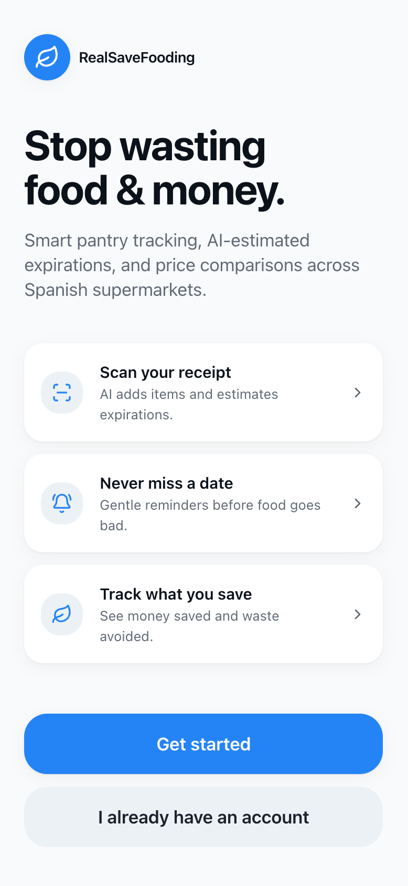
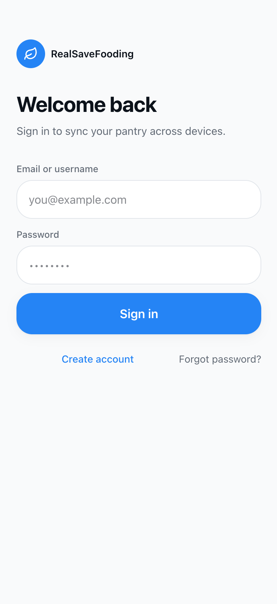
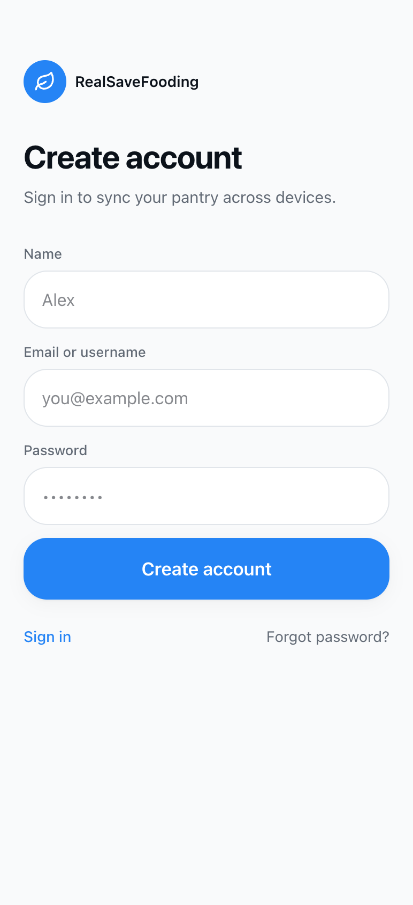
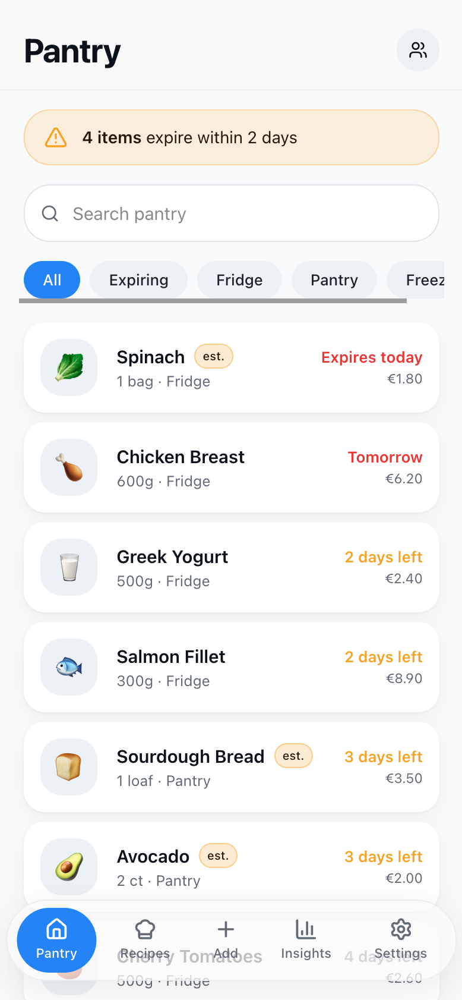
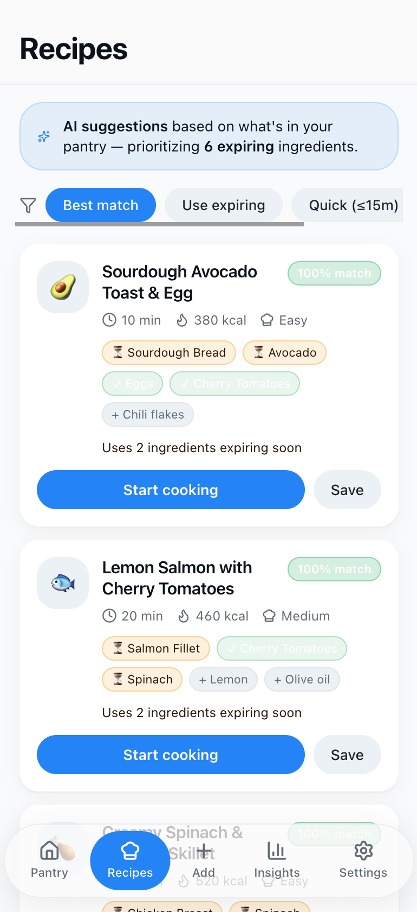
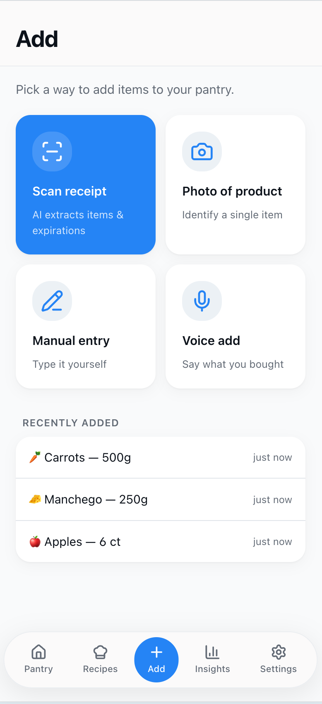
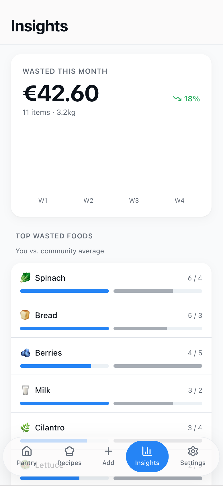
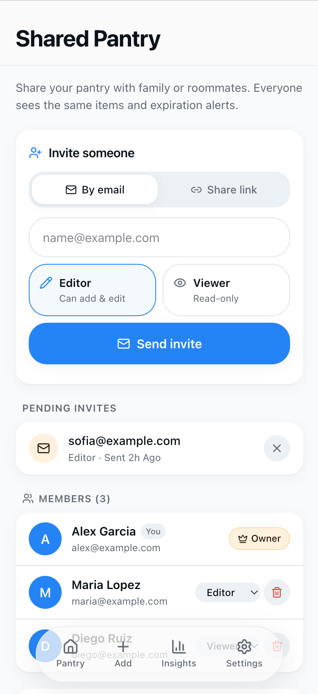
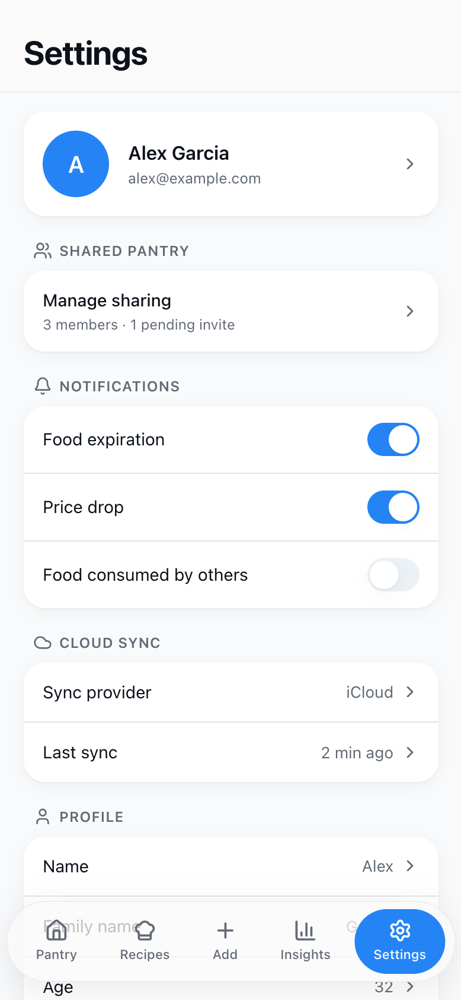

# Design and UX

This document contains the main wireframes and screenshots for the MVP UI, with short descriptions for each image.

## Main dashboard showing the prioritized "Use Next" queue, upcoming expirations, and quick actions for common tasks (mark consumed, edit expiration, change quantity).

## Login screen with email/password fields and primary call-to-action; designed for quick sign-in and clear error states.

## Create account flow presenting minimal required fields to onboard users fast (name, email, password) and optional profile details.

## Pantry list view displaying items grouped by category, with expiry badges and quantity controls for easy management.

## Recipe suggestions prioritized by items that are expiring soon, highlighting which pantry items each recipe uses.

## Add-item flow offering both receipt scan (OCR) and manual entry; shows inferred product matches and suggested expirations.

## Insights dashboard summarizing wasted items and money over selectable time ranges, with top categories and trends.

## Shared pantry view showing household members, recent activity, and permissions management for collaborative inventory.

## Settings screen for notification preferences, privacy controls, account management, and app appearance.

