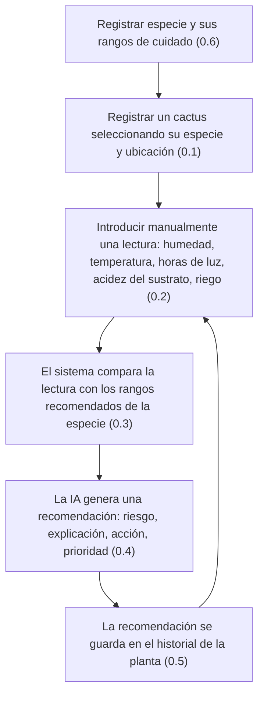

# Diagrama de flujo E2E principal

Flujo end-to-end del MVP de Cactify: *Inventario → Seguimiento → Conocimiento → IA → Historial*.

Los números entre paréntesis referencian las historias de usuario en [docs/user-stories](../user-stories/README.md).
