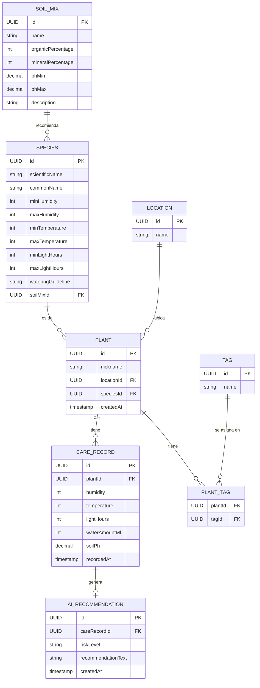

# Diagrama del modelo de datos

Modelo mínimo previsto para el MVP de Cactify. Ver descripción detallada de campos en el [README](../../README.md#3-modelo-de-datos).

## Pendiente de decidir

Personalización de cuidados por ejemplar individual ([0.7](../user-stories/0.7-personalizar-cuidados-de-un-ejemplar.md)): añadir campos de override en `PLANT` (p. ej. `wateringOverride`, `lightOverride`, `temperatureOverride`) o crear una entidad `PLANT_CARE_OVERRIDE` separada. Se actualizará este diagrama cuando se tome la decisión.
