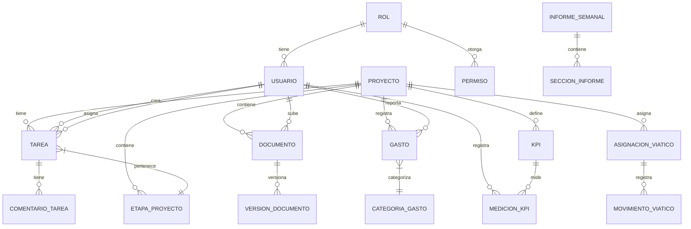

# Análisis de Entidades y Catálogos Pendientes - Sistema de Gestión de Proyectos de Consultoría

## 1. Resumen Ejecutivo

Este documento tiene como propósito principal identificar y documentar las entidades y catálogos necesarios para completar el desarrollo del Sistema de Gestión Integral de Proyectos de Consultoría para BGA. El análisis se basa en los requisitos recopilados en la documentación del proyecto, incluyendo el README, prompts y otra documentación relevante.

**Última actualización:** 30 de mayo de 2025 (Actualizado con las entidades y catálogos implementados)

## 2. Entidades Principales Identificadas

### 2.1. Módulo de Gestión de Proyectos

1. **Proyecto**
   - ID, Nombre, Descripción, FechaInicio, FechaFin, Estado, Presupuesto, ClienteID, GerenteID, etc.
   - Relaciones: Cliente, Usuario (Gerente), Tareas, KPIs, Documentos, etc.

2. **Cliente**
   - ID, Nombre, Industria, ContactoPrincipal, Email, Teléfono, Dirección, etc.
   - Relaciones: Proyectos, Contactos

3. **EtapaProyecto**
   - ID, Nombre, Orden, Descripción, ProyectoID, FechaInicio, FechaFin, Estado
   - Relaciones: Proyecto, Tareas

### 2.2. Módulo de Gestión de Tareas (TODOs)

1. **Tarea**
   - ID, Título, Descripción, FechaCreación, FechaVencimiento, Estado, Prioridad, ProyectoID, EtapaID, CreadorID, AsignadoAID, etc.
   - Relaciones: Proyecto, EtapaProyecto, Usuario (Creador, AsignadoA), Comentarios, ArchivosAdjuntos

2. **ComentarioTarea**
   - ID, Contenido, FechaCreación, TareaID, UsuarioID
   - Relaciones: Tarea, Usuario

### 2.3. Módulo de Gestión de Usuarios y Permisos

1. **Usuario** (ya implementado parcialmente)
   - ID, Nombre, Email, PasswordHash, FechaRegistro, ÚltimoAcceso, Activo, etc.
   - Relaciones: Roles, Proyectos (como gerente o miembro), Tareas (creadas o asignadas)

2. **Rol**
   - ID, Nombre, Descripción
   - Relaciones: Permisos, Usuarios

3. **Permiso**
   - ID, Nombre, Descripción, Código
   - Relaciones: Roles

### 2.4. Módulo de Gestión de Documentos

1. **Documento**
   - ID, Nombre, Descripción, RutaAlmacenamiento, Tipo, Tamaño, FechaSubida, FechaModificación, ProyectoID, SubidoPorID, Versión
   - Relaciones: Proyecto, Usuario (SubidoPor), VersionesDocumento

2. **VersiónDocumento**
   - ID, DocumentoID, NúmeroVersión, RutaAlmacenamiento, FechaCreación, Comentario, UsuarioID
   - Relaciones: Documento, Usuario

### 2.5. Módulo de Gestión de Viáticos y Gastos

1. **Gasto**
   - ID, Descripción, Monto, Moneda, FechaGasto, CategoríaID, ProyectoID, UsuarioID, EstadoAprobación, ComprobanteRuta, FechaCreación
   - Relaciones: CategoríaGasto, Proyecto, Usuario

2. **CategoríaGasto**
   - ID, Nombre, Descripción, Activo
   - Relaciones: Gastos

3. **AsignaciónViático**
   - ID, UsuarioID, ProyectoID, Monto, PeriodoInicio, PeriodoFin, Estado, FechaAprobación, AprobadoPorID
   - Relaciones: Usuario, Proyecto, Usuario (AprobadoPor), MovimientosViático

4. **MovimientoViático**
   - ID, AsignaciónID, Monto, FechaMovimiento, TipoMovimiento, Descripción, ComprobanteRuta
   - Relaciones: AsignaciónViático

### 2.6. Módulo de KPIs y Reportes

1. **KPI**
   - ID, Nombre, Descripción, Tipo, Unidad, Objetivo, MínimoAceptable, ProyectoID, FrecuenciaMedición
   - Relaciones: Proyecto, MedicionesKPI

2. **MediciónKPI**
   - ID, KPIID, Valor, FechaMedición, Comentarios, UsuarioID
   - Relaciones: KPI, Usuario

3. **InformeSemanal**
   - ID, ProyectoID, Semana, Año, Estado, FechaCreación, CreadoPorID, FechaAprobación, AprobadoPorID
   - Relaciones: Proyecto, Usuario (CreadoPor, AprobadoPor), SeccionesInforme

4. **SecciónInforme**
   - ID, InformeID, TipoSección, Título, Contenido, Orden
   - Relaciones: InformeSemanal

## 3. Catálogos Necesarios

### 3.1. Catálogos de Referencia

1. **EstadosProyecto**
   - ID, Nombre, Descripción, Color, Orden
   - Ejemplos: En Planificación, En Progreso, En Revisión, Completado, En Pausa, Cancelado

2. **EstadosTarea**
   - ID, Nombre, Descripción, Color, Orden, EsEstadoFinal
   - Ejemplos: Pendiente, En Progreso, En Revisión, Completada, Bloqueada, Cancelada

3. **PrioridadesTarea**
   - ID, Nombre, Descripción, Color, Nivel
   - Ejemplos: Baja, Media, Alta, Crítica

4. **TiposDocumento**
   - ID, Nombre, Descripción, ExtensionesPermitidas, TamañoMáximoMB
   - Ejemplos: Documento, Hoja de Cálculo, Presentación, Imagen, PDF, Otro

5. **TiposKPI**
   - ID, Nombre, Descripción, Unidad, Formato
   - Ejemplos: Porcentaje, Número Entero, Decimal, Moneda, Tiempo

6. **EstadosAprobación**
   - ID, Nombre, Descripción, Color
   - Ejemplos: Pendiente, Aprobado, Rechazado, Devuelto, En Revisión

7. **Monedas**
   - ID, Código, Nombre, Símbolo, TasaCambio, FechaActualización
   - Ejemplos: MXN (Peso Mexicano), USD (Dólar Estadounidense), EUR (Euro)

8. **TiposMovimientoViático**
   - ID, Nombre, Descripción, Afectación (Positivo/Negativo)
   - Ejemplos: Asignación, Gasto, Reembolso, Ajuste

## 4. Relaciones entre Entidades (Diagrama Conceptual)

## 5. Priorización de Desarrollo

### 5.1. Fase 1: Núcleo del Sistema (MVP)

1. **Módulo de Gestión de Usuarios y Permisos**
   - Entidades: Usuario, Rol, Permiso
   - Catálogos: EstadosUsuario, TiposRol, PermisosSistema

2. **Módulo de Gestión de Proyectos**
   - Entidades: Proyecto, Cliente
   - Catálogos: EstadosProyecto, TiposProyecto

3. **Módulo de Gestión de Tareas**
   - Entidades: Tarea, ComentarioTarea
   - Catálogos: EstadosTarea, PrioridadesTarea

### 5.2. Fase 2: Funcionalidades Avanzadas

1. **Módulo de Gestión de Documentos**
   - Entidades: Documento, VersiónDocumento
   - Catálogos: TiposDocumento

2. **Módulo de Gestión de Viáticos y Gastos**
   - Entidades: Gasto, CategoríaGasto, AsignaciónViático, MovimientoViático
   - Catálogos: CategoríasGasto, TiposMovimientoViático, EstadosAprobación, Monedas

3. **Módulo de KPIs y Reportes**
   - Entidades: KPI, MediciónKPI, InformeSemanal, SecciónInforme
   - Catálogos: TiposKPI, FrecuenciasMedición

## 6. Consideraciones Técnicas

1. **Seguridad**
   - Implementar autenticación JWT
   - Usar políticas de autorización basadas en roles
   - Validar todos los inputs del usuario
   - Implementar protección contra CSRF y XSS

2. **Rendimiento**
   - Implementar paginación en listados grandes
   - Usar carga diferida (lazy loading) para relaciones no esenciales
   - Implementar caché para datos estáticos o poco cambiantes

3. **Escalabilidad**
   - Diseñar para soportar múltiples clientes y proyectos concurrentes
   - Considerar la posibilidad de implementar microservicios en el futuro
   - Usar bases de datos distribuidas si es necesario

4. **Mantenibilidad**
   - Documentar el código exhaustivamente
   - Implementar pruebas unitarias y de integración
   - Seguir estándares de codificación consistentes

## 7. Control de Tareas y Estado de Implementación

### 7.1. Entidades Implementadas ✅

| Entidad | Estado | Observaciones |
|---------|--------|---------------|
| **Usuario** | ✅ Implementado | Basado en ASP.NET Identity con propiedades personalizadas |
| **Empleado** | ✅ Implementado | Incluye relación con Usuario y Puesto |
| **Perfil** | ✅ Implementado | Sistema de perfiles para control de acceso |
| **Objeto** | ✅ Implementado | Sistema base para representación de elementos |
| **ObjetoTipo** | ✅ Implementado | Categorización de objetos |
| **Acceso** | ✅ Implementado | Control de permisos a nivel de objeto y perfil |
| **Menu** | ✅ Implementado | Estructura de navegación del sistema |
| **Puesto** | ✅ Implementado | Catálogo de puestos de trabajo |
| **RefreshToken** | ✅ Implementado | Gestión de tokens para autenticación |
| **UsuarioToken** | ✅ Implementado | Tokens específicos para operaciones de usuario |

### 7.2. Entidades Pendientes de Implementación 🔄

#### 7.2.1. Prioridad Alta ⚠️

| Entidad | Complejidad | Dependencias | Observaciones |
|---------|-------------|--------------|---------------|
| **Proyecto** | Alta | Cliente, Usuario | Entidad central del sistema |
| **Cliente** | ✅ Implementado | Media | Necesaria para asociar proyectos |
| **EtapaProyecto** | ✅ Implementado | Media | Estructura de fases de proyectos |
| **Tarea** | ✅ Implementado | Alta | Gestión de actividades y TODOs |
| **ComentarioTarea** | ✅ Implementado | Baja | Comunicación sobre tareas |
| **ArchivoAdjunto** | ✅ Implementado | Media | Archivos adjuntos a tareas y comentarios |
| **Documento** | ✅ Implementado | Media | Gestión documental |
| **VersionDocumento** | ✅ Implementado | Media | Control de versiones de documentos |
| **CarpetaDocumento** | ✅ Implementado | Baja | Organización de documentos |
| **KPI** | ✅ Implementado | Media | Indicadores clave de desempeño |
| **MedicionKPI** | ✅ Implementado | Baja | Mediciones de KPIs |
| **Gasto** | ✅ Implementado | Media | Gestión de gastos |
| **AsignacionViatico** | ✅ Implementado | Media | Asignación de viáticos |
| **MovimientoViatico** | ✅ Implementado | Baja | Registro de movimientos |
| **InformeSemanal** | ✅ Implementado | Alta | Reportes de avance |

#### 7.2.2. Prioridad Media 🔶

| Entidad | Complejidad | Dependencias | Observaciones |
|---------|-------------|--------------|---------------|
| **Documento** | Media | Proyecto, Usuario | Gestión documental |
| **VersionDocumento** | Baja | Documento, Usuario | Control de versiones |
| **CarpetaDocumento** | Baja | Proyecto | Organización de documentos |
| **KPI** | Media | Proyecto | Indicadores de desempeño |
| **MedicionKPI** | Baja | KPI, Usuario | Registro de mediciones |

#### 7.2.3. Prioridad Baja 🔷

| Entidad | Complejidad | Dependencias | Observaciones |
|---------|-------------|--------------|---------------|
| **Gasto** | Media | Proyecto, Empleado, CategoriaGasto | Gestión financiera |
| **CategoriaGasto** | Baja | Ninguna | Catálogo para gastos |
| **AsignacionViatico** | Media | Empleado, Proyecto | Gestión de viáticos |
| **MovimientoViatico** | Baja | AsignacionViatico | Registro de movimientos |
| **InformeGasto** | Media | Empleado, Proyecto | Reportes de gastos |
| **InformeSemanal** | Alta | Proyecto, Usuario | Reportes de avance |
| **SeccionInforme** | Baja | InformeSemanal | Estructura de informes |
| **EvaluacionConsultor** | Media | InformeSemanal, Empleado | Evaluación de desempeño |

### 7.3. Catálogos Implementados ✅

| Catálogo | Estado | Prioridad | Observaciones |
|----------|--------|-----------|---------------|
| **EstadoProyecto** | ✅ Implementado | Alta | Necesario para Proyecto |
| **EstadoEtapa** | ✅ Implementado | Alta | Necesario para EtapaProyecto |
| **EstadoTarea** | ✅ Implementado | Alta | Necesario para Tarea |
| **PrioridadTarea** | ✅ Implementado | Alta | Necesario para Tarea |
| **TipoDocumento** | ✅ Implementado | Media | Necesario para Documento |
| **TipoKPI** | ✅ Implementado | Media | Necesario para KPI |
| **FrecuenciaMedicion** | ✅ Implementado | Media | Necesario para KPI |
| **CategoriaGasto** | ✅ Implementado | Baja | Necesario para Gasto |
| **EstadoAprobacion** | ✅ Implementado | Baja | Común para varios módulos |
| **Moneda** | ✅ Implementado | Baja | Necesario para Gasto |
| **TipoProyecto** | ✅ Implementado | Alta | Necesario para Proyecto |
| **TipoMovimientoViatico** | ✅ Implementado | Baja | Necesario para MovimientoViatico |

### 7.4. Plan de Implementación Propuesto 📅

#### Sprint 1: Núcleo de Gestión de Proyectos ✅
- ✅ Implementar entidad Proyecto y Cliente
- ✅ Implementar catálogos EstadoProyecto y TipoProyecto
- Crear endpoints básicos CRUD
- Pruebas unitarias y de integración

#### Sprint 2: Gestión de Etapas y Tareas ✅
- ✅ Implementar entidades EtapaProyecto y Tarea
- ✅ Implementar catálogos EstadoEtapa, EstadoTarea y PrioridadTarea
- Crear endpoints para gestión de tareas
- Implementar asignación de tareas a usuarios

#### Sprint 3: Gestión Documental ✅
- ✅ Implementar entidades Documento, VersionDocumento y CarpetaDocumento
- ✅ Implementar catálogo TipoDocumento
- Crear sistema de almacenamiento de archivos
- Implementar control de versiones

#### Sprint 4: KPIs y Reportes ✅
- ✅ Implementar entidades KPI, MedicionKPI e InformeSemanal
- ✅ Implementar catálogos TipoKPI y FrecuenciaMedicion
- Crear dashboard para visualización de KPIs
- Implementar generación de informes

#### Sprint 5: Gestión Financiera ✅
- ✅ Implementar entidades Gasto, CategoriaGasto, AsignacionViatico y MovimientoViatico
- ✅ Implementar catálogos restantes
- Crear sistema de aprobación de gastos
- Implementar reportes financieros

## 8. Próximos Pasos Inmediatos

1. **Validación del Modelo**
   - [ ] Revisar las entidades y relaciones propuestas con el equipo de desarrollo
   - [ ] Validar con los usuarios finales los flujos de trabajo propuestos

2. **Diseño de la Base de Datos**
   - [ ] Crear el diagrama entidad-relación detallado
   - [ ] Definir índices, claves foráneas y restricciones
   - [ ] Planear las migraciones de base de datos

3. **Desarrollo de la API**
   - [ ] Definir los endpoints RESTful necesarios
   - [ ] Implementar los controladores y servicios
   - [ ] Documentar la API con Scalar (reemplazó a Swagger)

4. **Implementación del Frontend**
   - [ ] Diseñar las interfaces de usuario
   - [ ] Implementar las vistas y componentes necesarios
   - [ ] Conectar con la API del backend

## 9. Conclusión

Este documento proporciona una visión general de las entidades y catálogos necesarios para el desarrollo del Sistema de Gestión Integral de Proyectos de Consultoría. La implementación se ha dividido en fases para permitir un desarrollo incremental y la entrega temprana de valor.

**Importante:** Se debe respetar la regla de no modificar propiedades de entidades existentes que ya tienen migraciones exitosas a menos que sea estrictamente necesario, para evitar inconsistencias con el esquema de la base de datos existente. Siempre verificar el historial de migraciones antes de realizar cambios en las entidades.

Se recomienda revisar y ajustar este modelo a medida que se avanza en el desarrollo y se obtiene retroalimentación de los usuarios finales.
