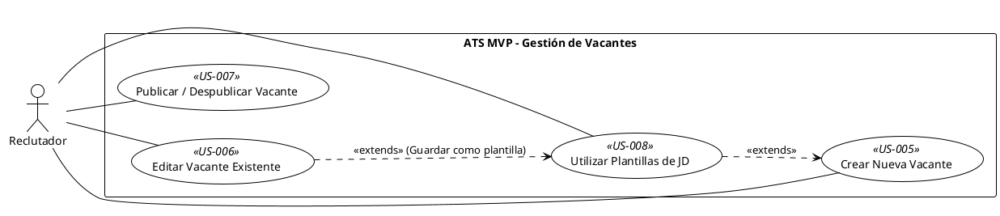

## Feature 1: Gestión del Ciclo de Vida de la Vacante

* **Descripción:** Permite a los usuarios (principalmente Reclutadores) crear, configurar, editar, publicar y despublicar las ofertas de empleo dentro del ATS MVP. Es la base para iniciar cualquier proceso de reclutamiento.
* **Valor Aportado:** Control total sobre las ofertas de empleo, desde su creación hasta su cierre, asegurando que la información es correcta y visible cuando es necesario.
* **Requisitos Funcionales Asociados:**
    * RF-01: Crear Vacante (Must Have)
    * RF-02: Editar Vacante (Must Have)
    * RF-03: Publicar/Despublicar Vacante (Must Have)
    * RF-31: Plantillas de JD (Could Have)

