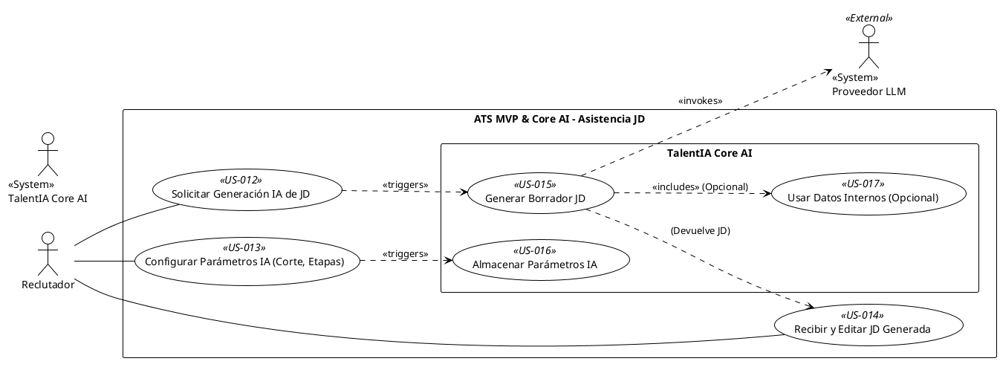

## Feature 2: Asistencia IA para Descripción de Puesto (JD)

* **Descripción:** Integra la capacidad de TalentIA Core AI para generar automáticamente borradores de Descripciones de Puesto (JD), permitiendo al Reclutador solicitar, recibir, editar y configurar parámetros específicos de IA (como el score de corte y etapas sugeridas) asociados a esa JD.
* **Valor Aportado:** Reduce drásticamente el tiempo de creación de JDs, mejora la calidad potencial del contenido y permite configurar cómo la IA evaluará a los candidatos para esa vacante específica.
* **Requisitos Funcionales Asociados:**
    * RF-04: Solicitar Generación IA de JD (Must Have)
    * RF-04B: Configurar Parámetros IA en JD (Must Have)
    * RF-05: Recibir y Editar JD generada (Must Have)
    * RF-06: Generar Contenido JD (Core AI) (Must Have)
    * RF-06B: Almacenar Parámetros IA en JD (Core AI) (Must Have)
    * RF-23: Usar Datos Internos para JD (Core AI) (Should Have)

