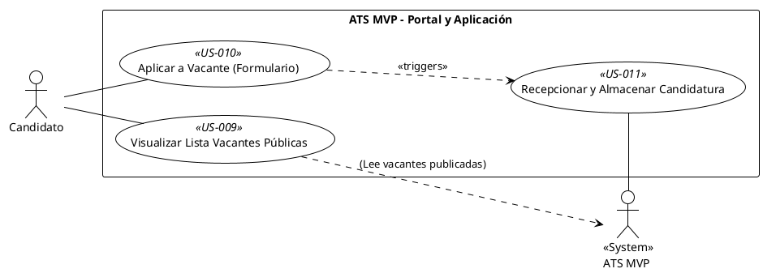

## Feature 3: Portal de Empleo y Proceso de Aplicación

* **Descripción:** Proporciona la interfaz pública donde los candidatos externos pueden ver las vacantes publicadas y enviar sus solicitudes, incluyendo la carga de su CV. También cubre la recepción y almacenamiento inicial de estas candidaturas en el ATS MVP.
* **Valor Aportado:** Canal esencial para la captación de talento externo, permitiendo un flujo de entrada de candidatos al sistema.
* **Requisitos Funcionales Asociados:**
    * RF-07: Portal Básico de Empleo (Must Have)
    * RF-08: Formulario de Aplicación (Must Have)
    * RF-09: Recepcionar Candidaturas (Must Have)

