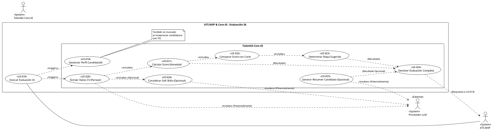

## Feature 4: Evaluación Inteligente de Candidaturas

* **Descripción:** Orquesta el proceso de análisis de las candidaturas recibidas utilizando TalentIA Core AI. Incluye la creación/actualización del perfil unificado del candidato en IA, el envío del CV para análisis, el parsing de datos, el cálculo del score de idoneidad, la comparación con el umbral definido, la determinación de una etapa inicial sugerida, la generación opcional de un resumen, y la devolución de toda esta evaluación al ATS MVP.
* **Valor Aportado:** Automatiza y objetiviza la criba inicial de candidatos, proporcionando scores, resúmenes y sugerencias de acción que ahorran tiempo y mejoran la calidad del proceso de selección.
* **Requisitos Funcionales Asociados:**
    * RF-09B: Crear/Actualizar CandidatoIA (Core AI) (Must Have)
    * RF-10: Invocar Evaluación IA (Must Have)
    * RF-11: Parsear CV (Core AI) (Must Have)
    * RF-12: Calcular Score Idoneidad (Core AI) (Must Have)
    * RF-12B: Comparar Score con Corte (Core AI) (Must Have)
    * RF-12C: Determinar Etapa Sugerida (Core AI) (Must Have)
    * RF-13: Devolver Evaluación (Core AI) (Must Have)
    * RF-22: Invocación Proveedor LLM (Core AI) (Must Have) - *Relacionado con capacidades subyacentes de IA*
    * RF-24: Generar Resumen Candidato (Core AI) (Should Have)
    * RF-36: Considerar Soft Skills (Core AI) (Could Have)

