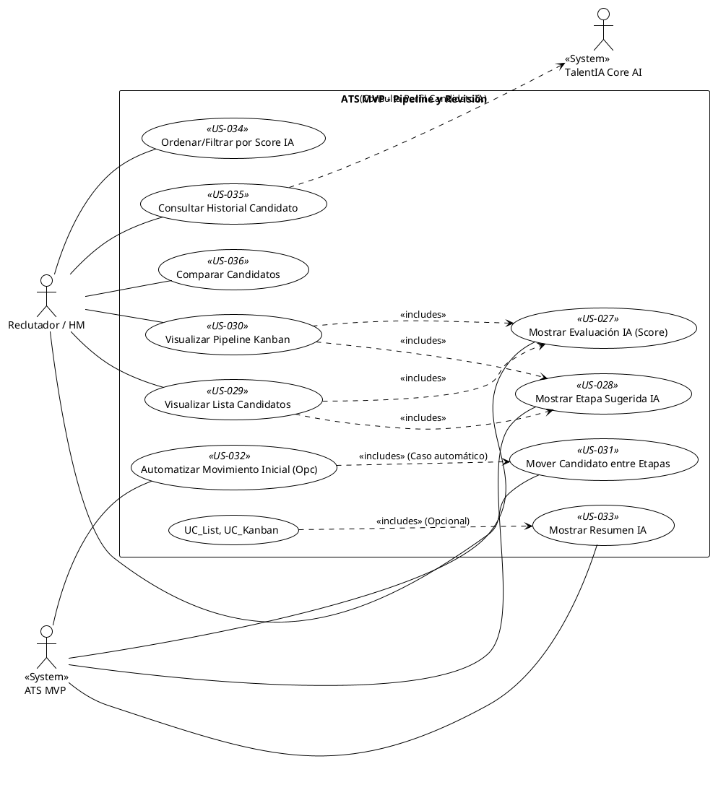

## Feature 5: Visualización y Gestión del Pipeline de Selección

* **Descripción:** Proporciona las herramientas visuales para que Reclutadores y Managers revisen a los candidatos dentro de una vacante, vean los resultados de la evaluación IA (score, resumen, etapa sugerida), consulten el historial unificado del candidato, gestionen el avance de las candidaturas a través de las distintas etapas del pipeline (ej. vista Kanban), y ordenen/filtren la información para facilitar la gestión.
* **Valor Aportado:** Ofrece visibilidad y control sobre el flujo de candidatos, permitiendo una gestión eficiente del proceso de selección basada en la información disponible (incluida la IA).
* **Requisitos Funcionales Asociados:**
    * RF-14: Mostrar Evaluación IA (ATS MVP) (Must Have)
    * RF-14B: Mostrar Etapa Sugerida (ATS MVP) (Must Have)
    * RF-15: Visualizar Candidatos por Vacante (Must Have)
    * RF-16: Visualizar Pipeline Básico (Must Have)
    * RF-17: Mover Candidatos entre Etapas (Must Have)
    * RF-14C: Automatizar Movimiento Inicial (Could Have)
    * RF-25: Mostrar Resumen IA (ATS MVP) (Should Have)
    * RF-26: Ordenar/Filtrar por Score (ATS MVP) (Should Have)
    * RF-26B: Mostrar Historial Unificado (ATS MVP) (Should Have)
    * RF-37: Comparativa Candidatos (ATS MVP) (Could Have)

