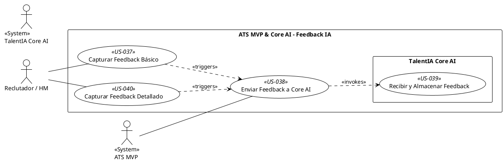

## Feature 6: Sistema de Feedback para IA

* **Descripción:** Implementa el mecanismo para que los usuarios puedan proporcionar retroalimentación (básica o detallada) sobre la calidad y corrección de las evaluaciones generadas por TalentIA Core AI. Cubre la captura de este feedback en el ATS MVP, su envío a Core AI, y su recepción/almacenamiento para el aprendizaje continuo.
* **Valor Aportado:** Habilita el ciclo de mejora continua de la IA, permitiendo que aprenda de la experiencia y el conocimiento de los expertos humanos, cumpliendo un objetivo clave de la Fase 1.
* **Requisitos Funcionales Asociados:**
    * RF-18: Capturar Feedback Básico (ATS MVP) (Must Have)
    * RF-19: Enviar Feedback (ATS MVP) (Must Have)
    * RF-20: Recibir/Almacenar Feedback (Core AI) (Must Have)
    * RF-27: Feedback IA más Detallado (ATS MVP) (Should Have)

