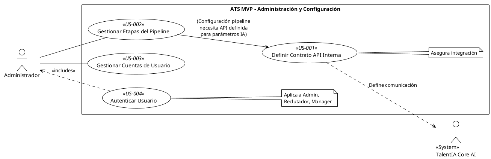

## Feature 7: Administración y Configuración del Sistema

* **Descripción:** Agrupa las funcionalidades necesarias para la configuración inicial y el mantenimiento básico del ATS MVP, incluyendo la gestión de usuarios y sus roles, la autenticación para el acceso seguro, y la configuración de elementos clave del flujo de trabajo como las etapas del pipeline. También incluye la definición de la API interna que conecta ATS y Core AI.
* **Valor Aportado:** Permite adaptar y gestionar el sistema para su uso operativo, asegurando el acceso controlado y la configuración adecuada del entorno.
* **Requisitos Funcionales Asociados:**
    * RF-21: API Interna ATS MVP <-> Core AI (Must Have)
    * RF-28: Configurar Etapas Pipeline (ATS MVP) (Should Have - *Recomendado elevar a Must Have*)
    * RF-29: Gestión Básica Usuarios (ATS MVP) (Should Have)
    * RF-30: Autenticación de Usuarios (ATS MVP) (Should Have - *Recomendado elevar a Must Have*)

