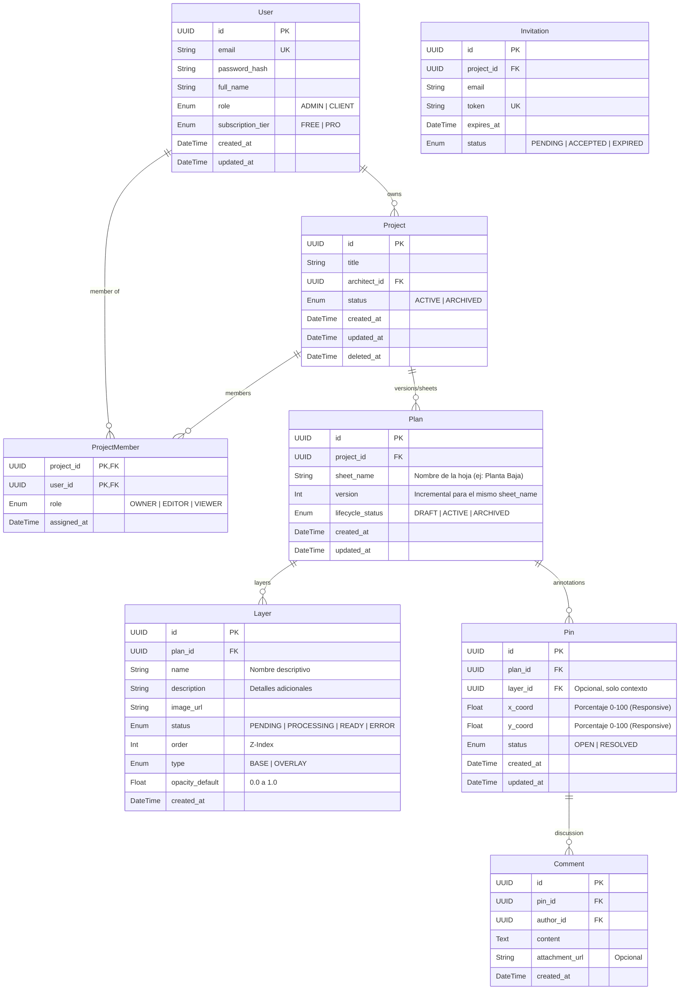

# Módulo Capa de Datos e Infraestructura: Especificación Técnica

## 1. Stack Tecnológico de Datos
- **Base de Datos Relacional:** PostgreSQL 15+
- **ORM:** Prisma
- **Cache & Mensajería:** Redis 7+
- **Almacenamiento de Archivos:** AWS S3 (o MinIO para desarrollo local)

## 2. Modelo de Datos Relacional (PostgreSQL)
El esquema se define mediante `prisma.schema`. Se siguen principios ACID estrictos.

**Prácticas Generales:**
*   **Primary Keys (PK):** Se utiliza `UUID v4` en todas las tablas para seguridad y escalabilidad.
*   **Auditoría:** Todas las tablas incluyen `created_at` y `updated_at`. Tablas críticas incluyen `deleted_at` para Soft Deletes.

### Diagrama ER (Mermaid)

### Detalle de Entidades

#### Usuarios y Accesos
*   **User:**
    *   `id` (UUID), `email`, `role`, `subscription_tier` (gestión manual para MVP).
*   **Project:**
    *   `id` (UUID), `architect_id` (Owner), `status`.
    *   Soporta Soft Delete (`deleted_at`).
*   **ProjectMember:**
    *   Tabla pivote para M:N. Define permisos granulares.

#### Núcleo: Planos y Capas
*   **Plan:** Representa una **Versión (Revision)** de una Hoja de Plano específica.
    *   `project_id`: Proyecto padre.
    *   `sheet_name`: Identificador de la hoja (ej: "Planta Baja"). Permite agrupar versiones de un mismo dibujo.
    *   `version`: Entero incremental. "Planta Baja v1", "Planta Baja v2".
    *   `status`: Máquina de estados para el procesado de imágenes asíncrono.
*   **Layer:** Componentes visuales de un Plan (ej: Estado Actual vs Reforma).
    *   `name`: Nombre corto (ej: "Propuesta A").
    *   `description`: Información añadida por el usuario.
    *   `type`: BASE (opaca) o OVERLAY (transparencia variable).
    *   `opacity_default`: Valor inicial para el slider (0.0 - 1.0).

#### Colaboración
*   **Pin:** Anotación posicional.
    *   Vinculado a un `Plan` (versión específica). Si se sube una v2, la v2 empieza limpia (decision de diseño).
    *   `x_coord`, `y_coord`: Almacenados como `Float` (porcentaje) para adaptarse a cualquier viewport.
*   **Comment:** Chat lineal sobre el Pin.

## 3. Estrategia de Redis
Redis cumple un rol doble y crítico:

### 3.1. Gestión de Colas (BullMQ)
*   **Key Prefix:** `bull:file-processing:`
*   **Estructura:** Listas y Hash Maps nativos gestionados por la librería BullMQ.

### 3.2. Caché y Sesiones
*   **Session Store:** Claves con TTL (Time To Live) para almacenar tokens de sesión o refresh tokens invalidables.
*   **Pub/Sub Channels:**
    *   `channel:notifications`: Canal donde el Worker publica eventos (`{ userId, type: 'PLAN_READY', payload: ... }`) y la API se suscribe para reenviar vía WebSocket.

## 4. Infraestructura de Contenedores (Docker)
El proyecto se orquesta con Docker Compose para desarrollo local y despliegue simple.

### Servicios Definidos
1.  **`postgres`**: Imagen oficial de PostgreSQL. Persistencia en volumen local.
2.  **`redis`**: Imagen oficial de Redis Alpine.
3.  **`api`**: Construido desde el monorepo. Ejecuta `npm run start:api`. Expone puerto 3000.
4.  **`worker`**: Construido desde el monorepo (misma imagen que api). Ejecuta `npm run start:worker`. No expone puertos.
5.  **`frontend`**: Construido desde carpeta frontend. Servido por servidor Node interno de Nuxt (Nitro). Expone puerto 8080.

## 5. Migraciones y Seeds
*   **Prisma Migrate:** `npx prisma migrate dev` para controlar cambios en el esquema SQL.
*   **Seeding:** Script `prisma/seed.ts` para poblar la BD con usuarios de prueba y planes iniciales para desarrollo.
