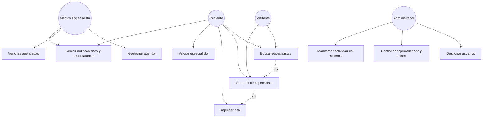

```mermaid
flowchart TD
    Visitante((Visitante))
    Paciente((Paciente))
    Medico((Médico Especialista))
    Admin((Administrador))
    
    UC1[Buscar especialistas]
    UC2[Ver perfil de especialista]
    UC3[Agendar cita]
    UC4[Valorar especialista]
    UC5[Recibir notificaciones y recordatorios]
    UC6[Gestionar agenda]
    UC7[Ver citas agendadas]
    UC8[Gestionar usuarios]
    UC9[Gestionar especialidades y filtros]
    UC10[Monitorear actividad del sistema]
    
    Visitante --> UC1
    Visitante --> UC2

    Paciente --> UC1
    Paciente --> UC2
    Paciente --> UC3
    Paciente --> UC4
    Paciente --> UC5
    
    Medico --> UC6
    Medico --> UC7
    Medico --> UC5
    
    Admin --> UC8
    Admin --> UC9
    Admin --> UC10
    
    UC1 -.-> |<<include>>| UC2
    UC2 -.-> |<<include>>| UC3
```