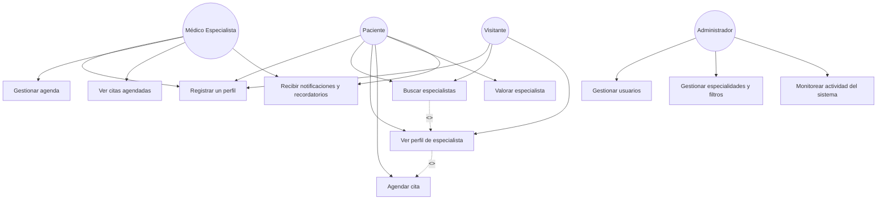

```mermaid
flowchart TD
    Visitante((Visitante))
    Paciente((Paciente))
    Medico((Médico Especialista))
    Admin((Administrador))

    UC1[Registrar un perfil]
    UC2[Buscar especialistas]
    UC3[Ver perfil de especialista]
    UC4[Agendar cita]
    UC5[Valorar especialista]
    UC6[Recibir notificaciones y recordatorios]
    UC7[Gestionar agenda]
    UC8[Ver citas agendadas]
    UC9[Gestionar usuarios]
    UC10[Gestionar especialidades y filtros]
    UC11[Monitorear actividad del sistema]

    Visitante --> UC1
    Visitante --> UC2
    Visitante --> UC3

    Paciente --> UC1
    Paciente --> UC2
    Paciente --> UC3
    Paciente --> UC4
    Paciente --> UC5
    Paciente --> UC6

    Medico --> UC1
    Medico --> UC7
    Medico --> UC8
    Medico --> UC6

    Admin --> UC9
    Admin --> UC10
    Admin --> UC11

    UC2 -.-> |<<include>>| UC3
    UC3 -.-> |<<include>>| UC4
```