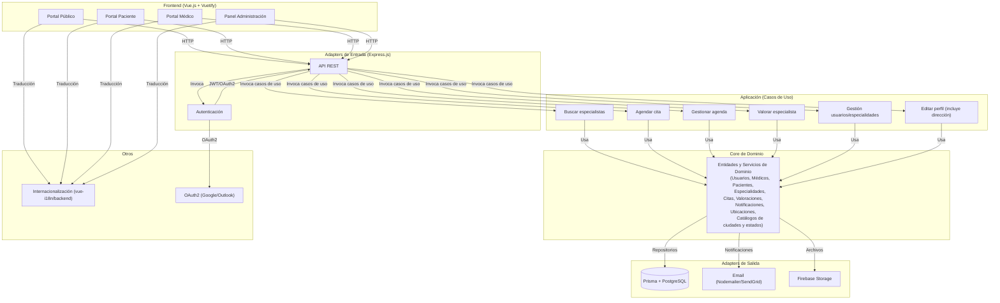

```mermaid
flowchart TD
    subgraph "Frontend (Vue.js + Vuetify)"
        F1[Portal Público]
        F2[Portal Paciente]
        F3[Portal Médico]
        F4[Panel Administración]
    end

    subgraph "Adapters de Entrada (Express.js)"
        API[API REST]
        AUTH[Autenticación]
    end

    subgraph "Aplicación (Casos de Uso)"
        CU1[Buscar especialistas]
        CU2[Agendar cita]
        CU3[Gestionar agenda]
        CU4[Valorar especialista]
        CU5[Gestión usuarios/especialidades]
        CU6["Editar perfil (incluye dirección)"]
    end

    subgraph "Core de Dominio"
        ENT["Entidades y Servicios de Dominio
            (Usuarios, Médicos, Pacientes,
            Especialidades, Citas, Valoraciones,
            Notificaciones, Ubicaciones,
            Catálogos de ciudades y estados)"]
    end

    subgraph "Adapters de Salida"
        DB[(Prisma + PostgreSQL)]
        EMAIL["Email (Nodemailer/SendGrid)"]
        STORAGE[Firebase Storage]
    end

    subgraph "Otros"
        I18N["Internacionalización (vue-i18n/backend)"]
        OAUTH["OAuth2 (Google/Outlook)"]
    end

    %% Relaciones
    F1-->|HTTP|API
    F2-->|HTTP|API
    F3-->|HTTP|API
    F4-->|HTTP|API

    API-->|Invoca|AUTH
    AUTH-->|JWT/OAuth2|API
    API-->|Invoca casos de uso|CU1
    API-->|Invoca casos de uso|CU2
    API-->|Invoca casos de uso|CU3
    API-->|Invoca casos de uso|CU4
    API-->|Invoca casos de uso|CU5
    API-->|Invoca casos de uso|CU6

    AUTH-->|OAuth2|OAUTH

    CU1-->|Usa|ENT
    CU2-->|Usa|ENT
    CU3-->|Usa|ENT
    CU4-->|Usa|ENT
    CU5-->|Usa|ENT
    CU6-->|Usa|ENT

    ENT-->|Repositorios|DB
    ENT-->|Notificaciones|EMAIL
    ENT-->|Archivos|STORAGE

    F1-->|Traducción|I18N
    F2-->|Traducción|I18N
    F3-->|Traducción|I18N
    F4-->|Traducción|I18N
```