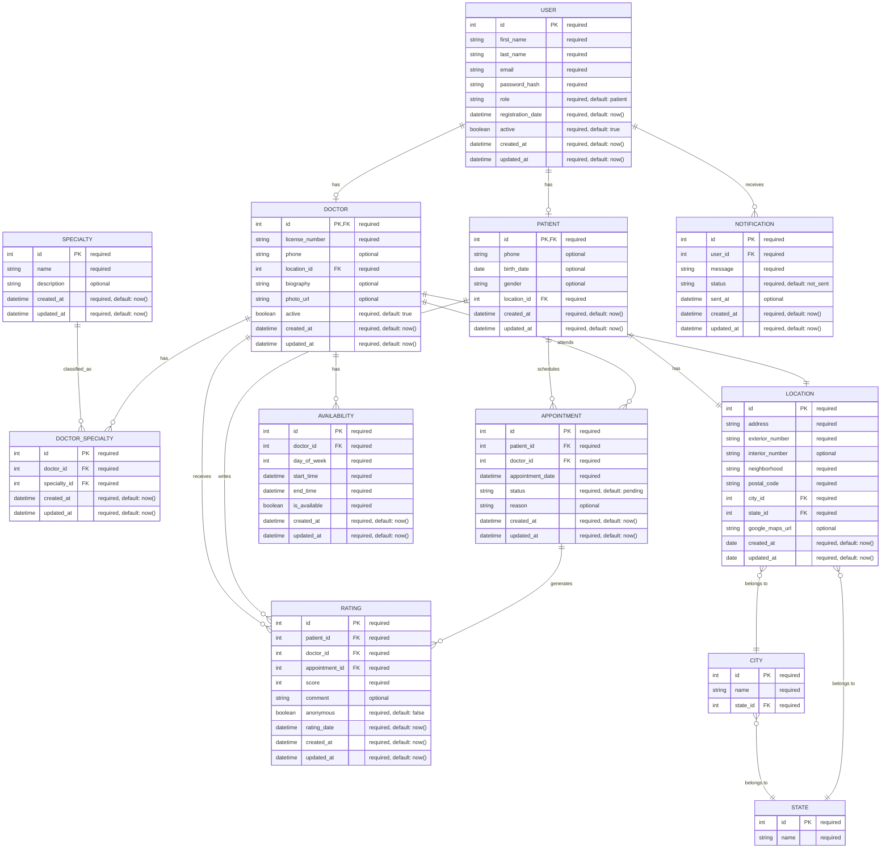

```mermaid
erDiagram
    USER {
        int id PK "required"
        string first_name "required"
        string last_name "required"
        string email "required"
        string password_hash "required"
        string role "required, default: patient"
        datetime registration_date "required, default: now()"
        boolean active "required, default: true"
        datetime created_at "required, default: now()"
        datetime updated_at "required, default: now()"
    }
    DOCTOR {
        int id PK,FK "required"
        string license_number "required"
        string phone "optional"
        int location_id FK "required"
        string biography "optional"
        string photo_url "optional"
        boolean active "required, default: true"
        datetime created_at "required, default: now()"
        datetime updated_at "required, default: now()"
    }
    PATIENT {
        int id PK,FK "required"
        string phone "optional"
        date birth_date "optional"
        string gender "optional"
        int location_id FK "required"
        datetime created_at "required, default: now()"
        datetime updated_at "required, default: now()"
    }
    SPECIALTY {
        int id PK "required"
        string name "required"
        string description "optional"
        datetime created_at "required, default: now()"
        datetime updated_at "required, default: now()"
    }
    DOCTOR_SPECIALTY {
        int id PK "required"
        int doctor_id FK "required"
        int specialty_id FK "required"
        datetime created_at "required, default: now()"
        datetime updated_at "required, default: now()"
    }
    APPOINTMENT {
        int id PK "required"
        int patient_id FK "required"
        int doctor_id FK "required"
        datetime appointment_date "required"
        string status "required, default: pending"
        string reason "optional"
        datetime created_at "required, default: now()"
        datetime updated_at "required, default: now()"
    }
    RATING {
        int id PK "required"
        int patient_id FK "required"
        int doctor_id FK "required"
        int appointment_id FK "required"
        int score "required"
        string comment "optional"
        boolean anonymous "required, default: false"
        datetime rating_date "required, default: now()"
        datetime created_at "required, default: now()"
        datetime updated_at "required, default: now()"
    }
    NOTIFICATION {
        int id PK "required"
        int user_id FK "required"
        string message "required"
        string status "required, default: not_sent"
        datetime sent_at "optional"
        datetime created_at "required, default: now()"
        datetime updated_at "required, default: now()"
    }
    LOCATION {
        int id PK "required"
        string address "required"
        string exterior_number "required"
        string interior_number "optional"
        string neighborhood "required"
        string postal_code "required"
        int city_id FK "required"
        int state_id FK "required"
        string google_maps_url "optional"
        date created_at "required, default: now()"
        date updated_at "required, default: now()"
    }
    CITY {
        int id PK "required"
        string name "required" 
        int state_id FK "required"
    }
    STATE {
        int id PK "required"
        string name "required"
    }
    AVAILABILITY {
        int id PK "required"
        int doctor_id FK "required"
        int day_of_week "required"
        datetime start_time "required"
        datetime end_time "required"
        boolean is_available "required"
        datetime created_at "required, default: now()"
        datetime updated_at "required, default: now()"
    }

    USER ||--o| DOCTOR : has
    USER ||--o| PATIENT : has
    DOCTOR ||--o{ DOCTOR_SPECIALTY : has
    SPECIALTY ||--o{ DOCTOR_SPECIALTY : classified_as
    DOCTOR ||--o{ APPOINTMENT : attends
    PATIENT ||--o{ APPOINTMENT : schedules
    APPOINTMENT ||--o{ RATING : generates
    PATIENT ||--o{ RATING : writes
    DOCTOR ||--o{ RATING : receives
    USER ||--o{ NOTIFICATION : receives
    DOCTOR ||--|| LOCATION : has
    PATIENT ||--|| LOCATION : has
    LOCATION }o--|| CITY : "belongs to"
    LOCATION }o--|| STATE : "belongs to"
    CITY }o--|| STATE : "belongs to"
    DOCTOR ||--o{ AVAILABILITY : has

```