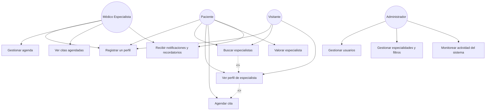

# Etapa 2: Casos de Uso

## Resumen

El sistema de búsqueda de especialidades médicas y profesionales de la salud está diseñado para facilitar la localización, comparación y contacto con especialistas, optimizando la experiencia tanto para pacientes como para médicos y administradores. Se identifican distintos tipos de usuarios: Visitante (no autenticado), Paciente (registrado), Médico Especialista y Administrador del sistema.

### Casos de uso principales

- **Registrar un perfil:** Permite a los visitantes crear una cuenta para ofrecer sus servicios medicos (Médico) o para buscar especialistas, revisar su información completa
y angedar citas (Pacientes)
- **Buscar especialistas:** Permite a visitantes y pacientes localizar médicos por especialidad, ubicación (ciudad, estado) y otros filtros.
- **Ver perfil de especialista:** Permite consultar información detallada de los médicos, accesible tanto para visitantes como para pacientes.
- **Agendar cita:** Los pacientes pueden reservar una consulta con el especialista seleccionado.
- **Valorar especialista:** Tras la consulta, los pacientes pueden dejar opiniones y valoraciones.
- **Recibir notificaciones y recordatorios:** El sistema envía avisos automáticos a pacientes y médicos sobre citas y eventos importantes.
- **Gestionar agenda:** Los médicos pueden administrar su disponibilidad y confirmar o rechazar citas.
- **Ver citas agendadas:** Los médicos pueden consultar el listado de sus próximas consultas.
- **Gestionar usuarios:** El administrador puede crear, editar o eliminar cuentas de médicos y pacientes.
- **Gestionar especialidades y filtros:** El administrador mantiene actualizado el catálogo de especialidades, ubicaciones y otros filtros.
- **Monitorear actividad del sistema:** El administrador supervisa el funcionamiento general y la actividad relevante del sistema.

### Consideraciones de acceso

- Los visitantes pueden buscar especialistas y ver perfiles sin necesidad de registro.
- El resto de funcionalidades requieren autenticación y permisos según el rol del usuario, incluyendo los datos de contacto del paciente y Médico Especialista.

---

## Diagrama de Casos de Uso

---