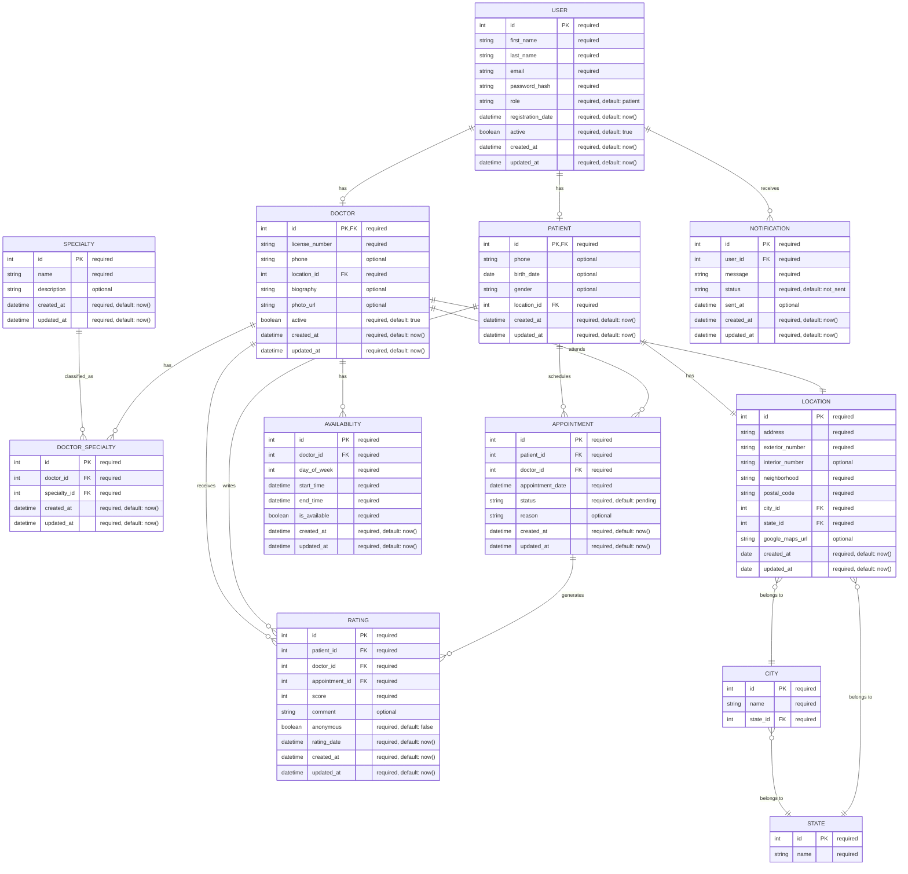

# Etapa 3: Modelado de Datos
## Sistema de búsqueda de especialidades médicas y profesionales de la salud

---

## 1. Introducción

El modelo de datos para el sistema de búsqueda de especialidades médicas y profesionales de la salud ha sido diseñado para satisfacer los casos de uso identificados en etapas anteriores. Este documento presenta las entidades principales del sistema, sus atributos esenciales, las relaciones entre ellas y consideraciones adicionales para futuras expansiones.

---

## 2. Entidades Principales

### 2.1. USER (Usuario)
Almacena la información básica de autenticación y datos comunes de todos los usuarios del sistema.

**Campos principales:**
- **id**: Identificador único del usuario (PK)
- **first_name**: Nombre del usuario
- **last_name**: Apellido del usuario
- **email**: Correo electrónico (único)
- **password_hash**: Contraseña encriptada
- **role**: Rol del usuario (patient, doctor, admin)
- **registration_date**: Fecha de registro
- **active**: Estado de la cuenta
- **created_at**: Fecha de creación
- **updated_at**: Fecha de última actualización

### 2.2. DOCTOR (Médico)
Contiene información específica de los profesionales de la salud.

**Campos principales:**
- **id**: Identificador único del médico (PK, FK a USER)
- **license_number**: Número de cédula profesional
- **phone**: Teléfono de contacto
- **location_id**: Referencia a la entidad LOCATION (FK)
- **biography**: Descripción profesional
- **photo_url**: URL de la foto de perfil
- **active**: Indica si el perfil está activo
- **created_at**: Fecha de creación
- **updated_at**: Fecha de última actualización

### 2.3. PATIENT (Paciente)
Almacena información específica de los pacientes registrados.

**Campos principales:**
- **id**: Identificador único del paciente (PK, FK a USER)
- **phone**: Teléfono de contacto
- **birth_date**: Fecha de nacimiento
- **gender**: Género
- **location_id**: Referencia a la entidad LOCATION (FK)
- **created_at**: Fecha de creación
- **updated_at**: Fecha de última actualización

### 2.4. SPECIALTY (Especialidad)
Catálogo de especialidades médicas disponibles en el sistema.

**Campos principales:**
- **id**: Identificador único de la especialidad (PK)
- **name**: Nombre de la especialidad
- **description**: Descripción detallada
- **created_at**: Fecha de creación
- **updated_at**: Fecha de última actualización

### 2.5. DOCTOR_SPECIALTY (Médico-Especialidad)
Tabla intermedia para la relación muchos a muchos entre médicos y especialidades.

**Campos principales:**
- **id**: Identificador único del registro (PK)
- **doctor_id**: Identificador del médico (FK)
- **specialty_id**: Identificador de la especialidad (FK)
- **created_at**: Fecha de creación
- **updated_at**: Fecha de última actualización

### 2.6. APPOINTMENT (Cita)
Gestiona las citas programadas entre pacientes y médicos.

**Campos principales:**
- **id**: Identificador único de la cita (PK)
- **patient_id**: Identificador del paciente (FK)
- **doctor_id**: Identificador del médico (FK)
- **appointment_date**: Fecha y hora de la cita
- **status**: Estado de la cita (pending, confirmed, canceled, completed)
- **reason**: Motivo de la cita
- **created_at**: Fecha de creación
- **updated_at**: Fecha de última actualización

### 2.7. RATING (Valoración)
Almacena las valoraciones y comentarios de pacientes sobre médicos.

**Campos principales:**
- **id**: Identificador único de la valoración (PK)
- **patient_id**: Identificador del paciente (FK)
- **doctor_id**: Identificador del médico (FK)
- **appointment_id**: Identificador de la cita asociada (FK)
- **score**: Puntuación (1-5)
- **comment**: Comentario opcional
- **anonymous**: Indica si la valoración es anónima
- **rating_date**: Fecha de la valoración
- **created_at**: Fecha de creación
- **updated_at**: Fecha de última actualización

### 2.8. NOTIFICATION (Notificación)
Gestiona las notificaciones enviadas a los usuarios.

**Campos principales:**
- **id**: Identificador único de la notificación (PK)
- **user_id**: Identificador del usuario destinatario (FK)
- **message**: Contenido de la notificación
- **status**: Estado de la notificación (not_sent, sent, delivered, read, failed)
- **sent_at**: Fecha de envío
- **created_at**: Fecha de creación
- **updated_at**: Fecha de última actualización

### 2.9. LOCATION (Ubicación)
Almacena la información detallada de la ubicación de médicos y pacientes.

**Campos principales:**
- **id**: Identificador único de la ubicación (PK)
- **address**: Calle y nombre de la dirección principal
- **exterior_number**: Número exterior
- **interior_number**: Número interior (opcional)
- **neighborhood**: Colonia
- **postal_code**: Código postal
- **city_id**: Referencia a la entidad CITY (FK)
- **state_id**: Referencia a la entidad STATE (FK)
- **google_maps_url**: URL de Google Maps (opcional)
- **created_at**: Fecha de creación
- **updated_at**: Fecha de última actualización

### 2.10. CITY (Ciudad)
Catálogo de ciudades de México.

**Campos principales:**
- **id**: Identificador único de la ciudad (PK)
- **name**: Nombre de la ciudad
- **state_id**: Referencia a la entidad STATE (FK)

### 2.11. STATE (Estado)
Catálogo de estados de México.

**Campos principales:**
- **id**: Identificador único del estado (PK)
- **name**: Nombre del estado

### 2.12. AVAILABILITY (Disponibilidad)
Horarios disponibles de los médicos.

**Campos principales:**
- **id**: Identificador único (PK)
- **doctor_id**: Identificador del médico (FK)
- **day_of_week**: Día de la semana (1-7)
- **start_time**: Hora de inicio (DateTime)
- **end_time**: Hora de fin (DateTime)
- **is_available**: Disponibilidad (booleano)
- **created_at**: Fecha de creación
- **updated_at**: Fecha de última actualización

---

## 3. Diagrama de Entidad-Relación

---

## 4. Relaciones Principales

- **USER → DOCTOR/PATIENT**: Relación uno a uno. Un usuario puede ser un médico o un paciente.
- **DOCTOR ↔ SPECIALTY**: Relación muchos a muchos a través de DOCTOR_SPECIALTY. Un médico puede tener múltiples especialidades, y una especialidad puede ser ejercida por múltiples médicos.
- **DOCTOR ↔ PATIENT**: Relación muchos a muchos a través de APPOINTMENT. Un médico puede atender a múltiples pacientes, y un paciente puede consultar a múltiples médicos.
- **DOCTOR ← AVAILABILITY**: Relación uno a muchos. Un médico puede tener múltiples horarios de disponibilidad.
- **APPOINTMENT → RATING**: Relación uno a muchos. Una cita puede generar múltiples valoraciones.
- **USER ← NOTIFICATION**: Relación uno a muchos. Un usuario puede recibir múltiples notificaciones.
- Cada **DOCTOR** y **PATIENT** tiene una relación uno a uno con una **LOCATION**.
- Cada **LOCATION** referencia una **CITY** y un **STATE**.
- Cada **CITY** pertenece a un **STATE**.
- Los catálogos de **CITY** y **STATE** permiten mantener la consistencia y facilitar el filtrado por ubicación.

---

## 5. Entidades Adicionales (Extensiones Futuras)

### 5.1. INSURANCE (Seguro médico)
Catálogo de aseguradoras médicas aceptadas por los médicos.

**Campos principales:**
- **id**: Identificador único (PK)
- **name**: Nombre de la aseguradora
- **description**: Descripción
- **logo_url**: URL del logotipo
- **active**: Estado

**Relación**: Muchos a muchos con DOCTOR a través de DOCTOR_INSURANCE.

### 5.2. LANGUAGE (Idioma)
Idiomas hablados por los médicos.

**Campos principales:**
- **id**: Identificador único (PK)
- **name**: Nombre del idioma
- **code**: Código ISO del idioma

**Relación**: Muchos a muchos con DOCTOR a través de DOCTOR_LANGUAGE.

### 5.3. SERVICE (Servicio)
Servicios específicos ofrecidos por los médicos.

**Campos principales:**
- **id**: Identificador único (PK)
- **name**: Nombre del servicio
- **description**: Descripción
- **estimated_duration**: Duración estimada

**Relación**: Muchos a muchos con DOCTOR a través de DOCTOR_SERVICE.

### 5.4. MEDICAL_CENTER (Centro médico)
Instalaciones donde los médicos atienden.

**Campos principales:**
- **id**: Identificador único (PK)
- **name**: Nombre del centro
- **address**: Dirección
- **location_coordinates**: Coordenadas geográficas
- **phone**: Teléfono

**Relación**: Muchos a muchos con DOCTOR a través de DOCTOR_MEDICAL_CENTER.

### 5.5. PAYMENT (Pago)
Gestiona los pagos asociados a las citas.

**Campos principales:**
- **id**: Identificador único (PK)
- **appointment_id**: Identificador de la cita (FK)
- **amount**: Monto
- **status**: Estado del pago

---

## 6. Consideraciones de Diseño

- **Campos de auditoría**: Todas las tablas incluyen campos de created_at y updated_at para seguimiento de cambios.
- **Valores por defecto**: Se han establecido valores por defecto para campos críticos (ej. status, active).
- **Soft Delete**: Las entidades principales implementan borrado lógico mediante el campo active.
- **Escalabilidad**: El modelo permite añadir nuevas entidades y relaciones sin afectar la estructura base.
- **Integridad referencial**: Se mantiene mediante claves foráneas y restricciones.
- El modelo permite registrar una sola ubicación por médico y paciente en el MVP.
- Los datos de ubicación solo pueden ser vistos por usuarios registrados.
- El uso de catálogos para ciudad y estado facilita la integración de filtros y la consistencia de datos.
- La estructura es flexible para futuras expansiones, como permitir múltiples ubicaciones por usuario o agregar validaciones específicas.

---

## 7. Extensiones Futuras

- Integración con sistemas de telemedicina.
- Soporte para múltiples ubicaciones por médico.
- Sistema de facturación integrado.
- Historial médico simplificado.
- Integración con expedientes clínicos electrónicos.
- Soporte para grupos médicos o clínicas asociadas.
- Sistema de prescripción electrónica.

---

## 8. Conclusiones

El modelo de datos presentado satisface los requisitos funcionales identificados en los casos de uso, proporcionando una estructura sólida para implementar un sistema de búsqueda de especialidades médicas y profesionales de la salud. La arquitectura es flexible para permitir futuras extensiones y adaptarse a nuevas necesidades del negocio.