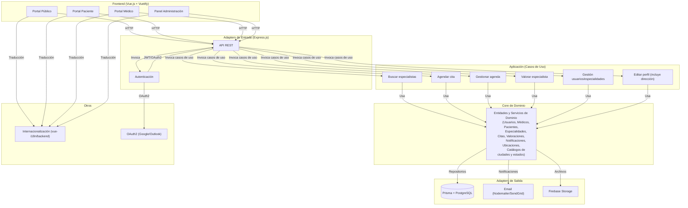
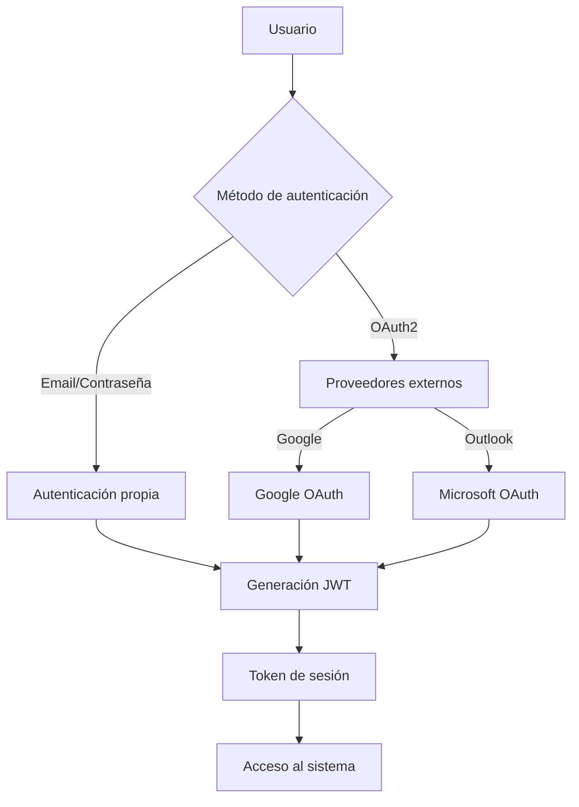

# Etapa 4: Diseño del sistema y Arquitectura de alto nivel

## Sistema de búsqueda de especialidades médicas y profesionales de la salud

---

## 1. Componentes/Módulos principales del sistema (MVP) y sus interacciones bajo arquitectura hexagonal

### 1.1 Componentes/Módulos principales

1. **Core de Dominio**

   - **Entidades:** Usuario, Médico, Paciente, Especialidad, Cita, Valoración.
   - **Servicios de dominio:** Lógica de negocio para búsqueda, agendamiento, gestión de usuarios y especialidades.
2. **Aplicación (Casos de Uso)**

   - **Orquestadores de casos de uso:** Buscar especialistas, agendar cita, gestionar agenda, valorar especialista, gestión de usuarios y especialidades.
3. **Adapters de Entrada (Ports de Entrada)**

   - **API REST (Express.js):** Endpoints para frontend público, pacientes, médicos y administración.
   - **Autenticación:**
     - **Propia:** Registro y login con email/contraseña, gestión de sesiones con JWT.
     - **OAuth2:** Login con Google y Outlook, integración de flujo OAuth2, vinculación con cuentas de usuario internas.
4. **Adapters de Salida (Ports de Salida)**

   - **Persistencia (Prisma + PostgreSQL):** Repositorios para entidades principales.
   - **Email (Nodemailer, SendGrid, etc.):** Envío de notificaciones reales.
   - **Almacenamiento de archivos (Firebase Storage):** Fotos de perfil.
5. **Frontend (Vue.js + Vuetify)**

   - **Portal público:** Búsqueda, perfiles, registro/login.
   - **Portal paciente:** Agenda, valoraciones.
   - **Portal médico:** Gestión de agenda, citas.
   - **Panel administración:** Gestión de usuarios, especialidades, monitoreo básico.
6. **Internacionalización**

   - **Soporte multilenguaje:** vue-i18n en frontend, estructura preparada en backend para mensajes y validaciones.
7. **Ubicación**

   - **Entidades:** LOCATION, CITY, STATE.
   - **Servicios de dominio:** Registro, consulta y actualización de la ubicación de médicos y pacientes, utilizando catálogos predefinidos de ciudades y estados.
   - **Interacción:** Integrado con los módulos de gestión de usuarios, búsqueda y filtrado de especialistas.

### 1.2 Interacciones bajo arquitectura hexagonal

- El **core de dominio** es independiente de frameworks y detalles de infraestructura.
- Los **casos de uso** exponen puertos (interfaces) invocados por los adaptadores de entrada (API REST y autenticación).
- Los **adaptadores de salida** implementan interfaces para persistencia, email y almacenamiento, desacoplando el core de la tecnología específica.
- El **frontend** consume la API y gestiona la experiencia de usuario, incluyendo internacionalización.

---

## 2. Tablas comparativas

### 2.1 Backend


| Tecnología | Lenguaje   | Curva de Aprendizaje | Documentación | Seguridad | Arquitectura   | ORMs Compatibles           | Comunidad/Soporte | Cloud Ready | Licencia |
| ------------- | ------------ | ---------------------- | ---------------- | ----------- | ---------------- | ---------------------------- | ------------------- | ------------- | ---------- |
| Express.js  | JavaScript | Baja                 | Excelente      | Buena     | MVC, Hexagonal | Prisma, Sequelize, Knex    | Muy activa        | Sí         | MIT      |
| NestJS      | TypeScript | Media                | Excelente      | Muy buena | Hexagonal, MVC | TypeORM, Prisma, Sequelize | Muy activa        | Sí         | MIT      |
| Laravel     | PHP        | Media                | Excelente      | Muy buena | MVC            | Eloquent, Doctrine         | Muy activa        | Sí         | MIT      |
| Django      | Python     | Media                | Excelente      | Muy buena | MTV (MVC)      | Django ORM, SQLAlchemy     | Muy activa        | Sí         | BSD      |
| FastAPI     | Python     | Baja                 | Excelente      | Muy buena | MVC, Hexagonal | SQLAlchemy, Tortoise       | Muy activa        | Sí         | MIT      |

### 2.2 Frontend


| Framework  | Curva de Aprendizaje | Documentación | Seguridad | Arquitectura | UI Kits/Plantillas | Multilenguaje     | Comunidad/Soporte | Licencia |
| ------------ | ---------------------- | ---------------- | ----------- | -------------- | -------------------- | ------------------- | ------------------- | ---------- |
| Vue.js 3   | Baja                 | Excelente      | Buena     | MVVM         | Vuetify, Quasar    | Sí (vue-i18n)    | Muy activa        | MIT      |
| React      | Media                | Excelente      | Buena     | MVVM         | MUI, Ant Design    | Sí (react-intl)  | Muy activa        | MIT      |
| Svelte     | Baja                 | Muy buena      | Buena     | MVVM         | Svelte Material UI | Sí (svelte-i18n) | Activa            | MIT      |
| Framework7 | Baja                 | Buena          | Buena     | MVC          | Integrado          | Sí (i18next)     | Activa            | MIT      |

### 2.3 Base de Datos


| Tecnología   | Tipo       | Instalación | Curva de Aprendizaje | Documentación | ORMs Compatibles                                         | UUID/Hash PK | Comunidad/Soporte | Licencia   |
| --------------- | ------------ | -------------- | ---------------------- | ---------------- | ---------------------------------------------------------- | -------------- | ------------------- | ------------ |
| PostgreSQL    | Relacional | Fácil       | Baja                 | Excelente      | Prisma, Knex, Sequelize, TypeORM, Django ORM, SQLAlchemy | Sí          | Muy activa        | PostgreSQL |
| MySQL/MariaDB | Relacional | Fácil       | Baja                 | Excelente      | Prisma, Knex, Sequelize, TypeORM, Django ORM, SQLAlchemy | Sí          | Muy activa        | GPL        |
| SQLite        | Relacional | Muy fácil   | Muy baja             | Muy buena      | Prisma, Knex, Sequelize, TypeORM, Django ORM, SQLAlchemy | Sí          | Muy activa        | Public     |
| MongoDB       | NoSQL      | Fácil       | Baja                 | Excelente      | Mongoose, Prisma, PyMongo, MongoEngine                   | Sí          | Muy activa        | SSPL       |

---

## 3. Patrones de arquitectura investigados

- **Hexagonal (Ports & Adapters):**
  Permite desacoplar la lógica de negocio de los detalles de infraestructura, facilitando pruebas y cambios tecnológicos.
- **SOA (Arquitectura Orientada a Servicios):**
  Divide el sistema en servicios independientes, ideal para escalabilidad y futuras integraciones.
- **MVC (Modelo-Vista-Controlador):**
  Estructura tradicional para separar presentación, lógica y datos, útil para proyectos pequeños o MVPs.

---

## 4. Recomendaciones

- **Backend:** Express.js + Prisma (por rapidez, curva baja, comunidad y compatibilidad con arquitectura hexagonal).
- **Frontend:** Vue.js 3 + Vuetify (por rapidez, soporte multilenguaje, UI Kit robusto y comunidad activa).
- **Base de datos:** PostgreSQL (por robustez, soporte de UUID, documentación y comunidad).
- **Arquitectura:** Hexagonal, para facilitar mantenibilidad, escalabilidad y futuras integraciones.
- **Internacionalización:** vue-i18n en frontend, estructura preparada en backend.

---

## 5. Tecnologías y arquitectura seleccionada

- **Backend:** Express.js (TypeScript), Prisma ORM, PostgreSQL, arquitectura hexagonal.
- **Frontend:** Vue.js 3, Vuetify, vue-i18n.
- **Infraestructura:** Digital Ocean App Platform o AWS, Sentry para monitoreo, GitHub Actions para CI/CD.
- **Almacenamiento de archivos:** Firebase Storage para fotos de perfil.
- **Email:** Nodemailer/SendGrid para notificaciones.
- **Validación:** Yup para validación de datos.
- **Documentación de API:** Swagger/OpenAPI.

---

## 6. Arquitectura de alto nivel

- **Core de Dominio:** Entidades y lógica de negocio (usuarios, médicos, pacientes, especialidades, citas, valoraciones, notificaciones).
- **Aplicación:** Casos de uso (búsqueda, agendamiento, gestión, valoraciones).
- **Adapters de Entrada:** API REST, autenticación propia y OAuth2 (Google/Outlook).
- **Adapters de Salida:** Persistencia (Prisma + PostgreSQL), email, almacenamiento de archivos.
- **Frontend:** Portales para público, pacientes, médicos y administración.
- **Internacionalización:** Soporte multilenguaje en frontend y backend.
- **Core de Dominio:** Entidades y lógica de negocio (usuarios, médicos, pacientes, especialidades, citas, valoraciones, notificaciones, ubicaciones).
- **Aplicación:** Casos de uso (búsqueda, agendamiento, gestión, valoraciones, gestión de ubicaciones).
- **Adapters de Entrada:** API REST, autenticación propia y OAuth2 (Google/Outlook).
- **Adapters de Salida:** Persistencia (Prisma + PostgreSQL), email, almacenamiento de archivos.
- **Frontend:** Portales para público, pacientes, médicos y administración. Incluye visualización y edición de ubicaciones.
- **Internacionalización:** Soporte multilenguaje en frontend y backend.

---

## 7. Diagrama de la arquitectura



### 7.1 Límites y responsabilidades de los componentes principales

- **Frontend (Vue.js + Vuetify):**

  - Presenta la interfaz de usuario para visitantes, pacientes, médicos y administradores.
  - Gestiona la experiencia de usuario, internacionalización y validación básica de formularios.
  - Consume la API REST para todas las operaciones de negocio.
  - Implementa la lógica de navegación y visualización de datos.
- **Adapters de Entrada (Express.js):**

  - Exponen los endpoints HTTP (API REST) para interacción con el frontend y servicios externos.
  - Gestionan la autenticación (propia y OAuth2) y autorización de usuarios.
  - Validan y transforman las solicitudes antes de pasarlas a los casos de uso.
  - No contienen lógica de negocio, solo orquestan el flujo hacia la capa de aplicación.
- **Aplicación (Casos de Uso):**

  - Orquesta la lógica de negocio a través de los casos de uso definidos (búsqueda, agendamiento, gestión, valoraciones).
  - Coordina la interacción entre el core de dominio y los adaptadores de entrada/salida.
  - Aplica reglas de negocio y controla el flujo de datos entre capas.
- **Core de Dominio:**

  - Contiene las entidades principales y la lógica de negocio pura (sin dependencias de frameworks o infraestructura).
  - Define las reglas, validaciones y operaciones sobre los modelos del dominio.
  - Es completamente independiente de la tecnología utilizada en los adaptadores.
- **Adapters de Salida:**

  - Implementan la persistencia de datos (Prisma + PostgreSQL), envío de emails (Nodemailer/SendGrid) y almacenamiento de archivos (Firebase Storage).
  - Se encargan de la integración con servicios externos y recursos de infraestructura.
  - Transforman los datos entre el dominio y los formatos requeridos por los servicios externos.
- **Internacionalización:**

  - Gestiona la traducción de textos y mensajes en el frontend (vue-i18n) y prepara la estructura para mensajes multilenguaje en el backend.
  - Permite la adaptación de la interfaz y mensajes del sistema a diferentes idiomas y contextos culturales.
- **Otros servicios externos (OAuth2, Email, Storage):**

  - Proveen autenticación federada, envío de notificaciones y almacenamiento de archivos multimedia.
  - Se integran a través de adaptadores de salida, manteniendo el core desacoplado de su implementación.

---

## 8. Patrones de diseño y buenas prácticas

### 8.1 Patrones de diseño recomendados


| Patrón                        | Aplicación            | Justificación                                                              |
| -------------------------------- | ------------------------ | ----------------------------------------------------------------------------- |
| **Repository**                 | Capa de persistencia   | Desacopla el dominio de la tecnología de BD, facilitando pruebas y cambios |
| **Factory**                    | Creación de entidades | Centraliza la creación de objetos complejos de dominio                     |
| **Strategy**                   | Autenticación         | Permite alternar entre diferentes estrategias (JWT, OAuth2)                 |
| **Observer**                   | Notificaciones         | Para la comunicación asíncrona entre componentes                          |
| **Adapter**                    | Integración Firebase  | Adapta Firebase Storage a la interfaz de almacenamiento del sistema         |
| **DTO (Data Transfer Object)** | API REST               | Separa las entidades de dominio de los objetos de transferencia             |
| **Dependency Injection**       | Global                 | Reduce el acoplamiento entre componentes                                    |

### 8.2 Buenas prácticas

1. **Estructura de directorios**

   ```
   /src
     /domain            # Entidades y servicios de dominio
       /entities
       /services
     /application       # Casos de uso
     /infrastructure    # Adapters
       /controllers     # Controladores API (entrada)
       /persistence     # Repositorios (salida)
       /services        # Servicios externos (salida)
     /interfaces        # Puertos
       /repositories    # Interfaces para repositorios
       /services        # Interfaces para servicios externos
   ```
2. **Convenciones de codificación**

   - TypeScript para todo el backend
   - Nombrado camelCase para variables y funciones, PascalCase para clases e interfaces
   - ESLint + Prettier para asegurar consistencia
   - **Documentación con Swagger/OpenAPI** para APIs, generando documentación interactiva
3. **Principios SOLID**

   - Single Responsibility: cada clase tiene una única responsabilidad
   - Open/Closed: extensible sin modificación
   - Liskov Substitution: usar interfaces para garantizar subtipado adecuado
   - Interface Segregation: interfaces pequeñas y específicas
   - Dependency Inversion: dependencias hacia abstracciones
4. **Manejo de errores**

   - Errores tipados (custom error classes)
   - Centralización del manejo de errores en middleware Express
   - Logs detallados pero sin exponer información sensible
5. **Seguridad**

   - Sanitización de entradas
   - **Validación de datos con Yup** para esquemas de validación declarativos
   - CSRF protection con tokens
   - Rate limiting para endpoints críticos

### 8.3 Estrategia de pruebas automatizadas

1. **Pruebas unitarias con Jest**

   - Cobertura mínima: 80% en dominio y aplicación
   - Organización por carpetas según componente probado
   - Mock de dependencias externas

   ```typescript
   // Ejemplo estructura pruebas
   describe('DoctorService', () => {
     it('should find doctors by specialty', async () => {
       // Arrange
       // Act
       // Assert
     });
   });
   ```
2. **Pruebas de integración**

   - Pruebas de API con Supertest
   - Base de datos de prueba aislada
   - Pruebas de integración con servicios externos mockeados

   ```typescript
   describe('Doctor API', () => {
     it('should return doctors filtered by specialty', async () => {
       const response = await request(app)
         .get('/api/doctors?specialty=cardiology')
         .expect(200);

       expect(response.body.length).toBeGreaterThan(0);
     });
   });
   ```
3. **Pruebas E2E**

   - Cypress para flujos críticos: registro, login, búsqueda, agendamiento
   - Configuración en pipeline CI/CD
4. **Integración en CI/CD**

   - Ejecución automática en cada PR/commit
   - Separación entre pruebas rápidas (unitarias) y lentas (integración/E2E)
   - Generación de reportes de cobertura

---

## 9. Riesgos y desafíos


| Categoría               | Riesgo/Desafío                                                                      | Impacto  | Mitigación                                                                                           |
| -------------------------- | -------------------------------------------------------------------------------------- | ---------- | ------------------------------------------------------------------------------------------------------- |
| **Tiempo de desarrollo** | Cronograma ajustado (30-50 horas) para implementar todas las funcionalidades del MVP | Alto     | Priorizar módulos críticos, usar generadores de código/scaffolding, adoptar enfoque iterativo      |
| **Seguridad**            | Vulnerabilidad de datos sensibles de salud                                           | Alto     | Implementar encriptación, JWT con corta expiración, autenticación multifactor para administradores |
| **Cumplimiento**         | Incumplimiento de LFPDPPP                                                            | Muy Alto | Implementar avisos de privacidad, consentimiento explícito, mecanismos de eliminación de datos      |
| **Técnico**             | Complejidad de arquitectura hexagonal para equipo no familiarizado                   | Medio    | Documentar claramente interfaces, comenzar con estructura simple e ir refactorizando                  |
| **Integración**         | Dificultades en integración con OAuth2 (Google, Outlook)                            | Medio    | Probar tempranamente, implementar fallbacks y mensajes de error claros                                |
| **Experiencia usuario**  | Curva de aprendizaje para médicos en la gestión de agenda                          | Medio    | Diseñar UI intuitiva, proporcionar tooltips y tutoriales integrados                                  |
| **Rendimiento**          | Lentitud en búsquedas complejas                                                     | Medio    | Indexar campos de búsqueda frecuente, implementar caché, optimizar queries                          |
| **Escalabilidad**        | Estructura inicial que dificulte expansiones futuras                                 | Alto     | Seguir estrictamente la arquitectura hexagonal, documentar puntos de extensión                       |
| **Operación**           | Gestión de notificaciones por email (límites, spam)                                | Bajo     | Implementar colas de mensajes, monitoreo de entregas, plantillas verificadas                          |
| **Almacenamiento**       | Costos/límites de Firebase Storage para fotos de perfil                             | Bajo     | Implementar validaciones de tamaño, compresión de imágenes, cuotas por usuario                     |
| **Mantenimiento**        | Dependencias desactualizadas o con vulnerabilidades                                  | Medio    | Configurar Dependabot, auditar dependencias regularmente, documentar versiones compatibles            |
| **Multilenguaje**        | Inconsistencias en traducciones o contextos culturales                               | Bajo     | Centralizar cadenas de texto, implementar sistema de revisión de traducciones                        |
| **DevOps**               | Configuración inicial de CI/CD y entornos                                           | Medio    | Usar templates predefinidos, comenzar con pipeline sencillo y expandir                                |
| **Testing**              | Cobertura insuficiente por restricciones de tiempo                                   | Alto     | Priorizar pruebas en módulos críticos (autenticación, agenda), usar generadores de tests           |
| **Datos de prueba**      | Falta de datos realistas para desarrollo y demo                                      | Medio    | Crear scripts de seeding con datos ficticios pero realistas de especialidades médicas                |

### 9.1 Desafíos particulares del sector médico

1. **Confianza del usuario**
   Los usuarios son especialmente sensibles a la confiabilidad en plataformas relacionadas con salud.
   *Mitigación*: Diseño profesional, certificaciones visibles, políticas de privacidad claras.
2. **Expectativas de disponibilidad**
   Los usuarios esperan alta disponibilidad en servicios relacionados con salud.
   *Mitigación*: Implementar monitoreo 24/7, alertas tempranas, plan de contingencia.
3. **Terminología médica**
   Complejidad en taxonomías de especialidades y procedimientos médicos.
   *Mitigación*: Consultar con profesionales médicos para validar taxonomías, implementar búsqueda inteligente con sinónimos.
4. **Integración futura con sistemas de salud**
   Preparar el sistema para posibles integraciones con sistemas de historias clínicas.
   *Mitigación*: Documentar APIs internas, seguir estándares del sector (HL7, FHIR) cuando sea posible.

---

## 10. Consideraciones de despliegue y operación

- **Despliegue:** Digital Ocean App Platform (backend), Netlify/Vercel (frontend), Digital Ocean Managed PostgreSQL.
- **CI/CD:** GitHub Actions.
- **Monitoreo:** Sentry (errores), Uptimerobot (disponibilidad).
- **Logging:** Logs estructurados, sin datos sensibles.
- **Gestión de configuración/secrets:** dotenv (local), GitHub Secrets (CI/CD).

### 10.1 Flujo de despliegue recomendado

1. **Desarrollo local:**

   - Variables de entorno con dotenv (no comiteadas)
   - Base de datos PostgreSQL local o en Docker
2. **Pipeline CI/CD:**

   - Trigger: push a main o PR
   - GitHub Actions:
     - Instalar dependencias
     - Linting
     - Pruebas unitarias y de integración
     - Build
     - (En merge a main) Despliegue automático
3. **Entornos:**

   - Desarrollo (branch dev): despliegue automático
   - Producción (branch main): despliegue automático o con aprobación

---

## 11. Seguridad

### 11.1 Medidas de seguridad para cumplimiento LFPDPPP


| Categoría                  | Medida                                                           | Implementación técnica                                                                |
| ----------------------------- | ------------------------------------------------------------------ | ----------------------------------------------------------------------------------------- |
| **Consentimiento**          | Obtención explícita del consentimiento                         | Formularios de registro con checkbox específico, tracking de consentimiento en BD      |
| **Aviso de privacidad**     | Transparencia en el uso de datos                                 | Página de aviso de privacidad accesible, versionado de políticas                      |
| **Acceso y rectificación** | Derechos ARCO (Acceso, Rectificación, Cancelación, Oposición) | Endpoints específicos para solicitudes ARCO, panel de usuario con gestión de datos    |
| **Minimización**           | Recolectar solo datos necesarios                                 | Revisión de esquemas de BD, eliminación de campos no esenciales                       |
| **Finalidad**               | Uso limitado a lo declarado                                      | Separación lógica de datos por propósito, auditoría de acceso                       |
| **Seguridad**               | Protección técnica de datos                                    | Encriptación, TLS, hardening de servidor, validación de entradas                      |
| **Confidencialidad**        | Control de acceso                                                | RBAC (Control de acceso basado en roles), logs de acceso                                |
| **Transferencia**           | Gestión de transmisión de datos                                | Validación de destinos de transferencia, cifrado en tránsito                          |
| **Retención**              | Eliminación oportuna                                            | Políticas de retención, anonimización de datos históricos                           |
| **Vulnerabilidades**        | Detección y mitigación                                         | SAST/DAST (análisis estático/dinámico de seguridad), actualizaciones de dependencias |

### 11.2 Modelo de autenticación y autorización

**1. Autenticación**

- **Sistema dual de autenticación:**
  - **Propia:** Registro y login con email/contraseña, gestión de sesiones con JWT.
    - Contraseñas con hash bcrypt (factor trabajo 12+)
    - Captcha en intentos múltiples
    - Bloqueo temporal tras intentos fallidos
    - Verificación de email en registro
    - MFA para administradores (opcional)
  - **OAuth2:** Login con Google y Outlook, integración de flujo OAuth2, vinculación con cuentas de usuario internas.
    - Validación de tokens con bibliotecas oficiales
    - Mapeo de perfiles externos a perfiles internos
  - **JWT (JSON Web Tokens):**
    - Tiempo de expiración corto (15-60 minutos)
    - Refresh tokens con rotación
    - Firma con algoritmos seguros (ES256)
    - Blacklisting de tokens revocados



**2. Autorización**

- **Modelo RBAC (Role-Based Access Control):**


| Rol           | Descripción                           | Permisos                                                                                                |
| --------------- | ---------------------------------------- | --------------------------------------------------------------------------------------------------------- |
| Visitante     | Usuario no autenticado                 | Búsqueda básica, vista de perfiles públicos, registro, sin acceso a datos de ubicación (dirección) |
| Paciente      | Usuario autenticado buscando atención | Búsqueda avanzada, agenda de citas, valoraciones, perfil personal                                      |
| Médico       | Profesional de la salud                | Todo lo de paciente + gestión de agenda, perfil profesional                                            |
| Administrador | Gestión del sistema                   | Acceso a panel administrativo, gestión de usuarios y contenido                                         |

- Middleware de autorización en Express
- Verificación de permisos basada en claims del JWT
- Validación adicional en capa de aplicación
- UI adaptativa según permisos del usuario
- Los datos de ubicación (LOCATION) solo pueden ser vistos por usuarios registrados según su rol y contexto.

**3. Protección de datos sensibles**

- **Encriptación en reposo:** Datos personales sensibles encriptados con AES-256, claves administradas con rotación periódica.
- **Enmascaramiento de datos:** Información médica sensible enmascarada en logs, acceso completo solo para roles autorizados.
- **Auditoría:** Registro de accesos a información sensible, notificación de accesos inusuales.

### 11.3 Medidas de protección adicionales

- **Seguridad en API:** Rate limiting, validación de todos los inputs con Yup, headers de seguridad (HSTS, CSP, X-Content-Type-Options), prevención de CSRF con tokens.
- **Seguridad en frontend:** Content Security Policy restrictiva, sanitización de datos antes de renderizar, protección XSS, manejo seguro de localstorage/sessionstorage.
- **Comunicación segura:** HTTPS obligatorio (TLS 1.3), HSTS preload, certificate pinning (opcional).
- **Respaldo y continuidad:** Backups encriptados periódicos, pruebas de restauración, plan de respuesta a incidentes.

### 11.4 Documento de cumplimiento LFPDPPP

- Documentar el flujo de datos en el sistema.
- Mapear cada categoría de datos a su base legal de procesamiento.
- Implementar registro de actividades de procesamiento.
- Realizar evaluación de impacto en la privacidad.
- Establecer procedimientos para respuesta a solicitudes ARCO.
- Documentar medidas técnicas y organizativas de seguridad.

**Notas importantes:**

- La implementación de seguridad debe ser evaluada periódicamente.
- Se recomienda revisión legal específica del aviso de privacidad.
- Considerar certificaciones de seguridad a mediano plazo (ISO 27001).

---

## 12. Propuesta de diseño visual

### 12.1 Paletas de colores recomendadas

Se proponen tres variantes de paleta de colores, alineadas con los objetivos de transmitir paz, confianza, profesionalismo y seriedad, y basadas en referencias de plataformas médicas modernas.

**Paleta 1: Azul profesional y verde salud**

- Color principal: Azul claro (`#4F8FC9`)
- Secundario: Verde menta (`#A3D9B1`)
- Acento: Azul profundo (`#2C3E50`)
- Neutro: Blanco (`#FFFFFF`), Gris claro (`#F5F7FA`)

**Paleta 2: Verde tranquilidad y beige cálido**

- Color principal: Verde suave (`#7FC8A9`)
- Secundario: Beige claro (`#F6E9D7`)
- Acento: Verde oscuro (`#3B6E57`)
- Neutro: Blanco (`#FFFFFF`), Gris cálido (`#ECECEC`)

**Paleta 3: Azul serenidad y gris moderno**

- Color principal: Azul pastel (`#A7C7E7`)
- Secundario: Gris claro (`#E6EAF0`)
- Acento: Azul marino (`#34495E`)
- Neutro: Blanco (`#FFFFFF`), Gris medio (`#BDC3C7`)

### 12.2 Fuentes recomendadas

Para asegurar legibilidad, profesionalismo y modernidad, se sugieren las siguientes fuentes (todas disponibles en Google Fonts):

1. Roboto
2. Open Sans
3. Lato
4. Montserrat
5. Nunito

### 12.3 Herramientas para ajuste de paleta

Para adaptar y personalizar las paletas de colores propuestas, se recomiendan las siguientes herramientas online:

- [Coolors](https://coolors.co/)
- [Adobe Color](https://color.adobe.com/es/create)
- [Material Palette](https://www.materialpalette.com/)

## 13. Información adicional relevante

- El modelo de datos y los casos de uso están alineados con las mejores prácticas del sector salud y cumplen los requisitos funcionales mínimos para un MVP.
- El sistema está preparado para futuras integraciones (telemedicina, pagos, historial médico).
- Se recomienda revisión legal y de seguridad periódica.
- El diseño y arquitectura permiten escalar y adaptar el sistema conforme crezcan los
