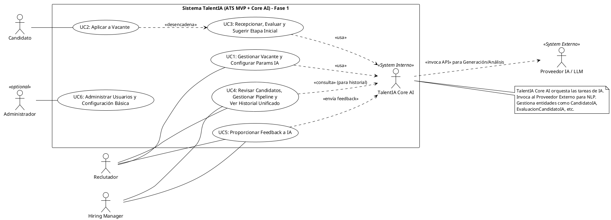

# PRD - TalentIA (Fase 1: ATS MVP + Core AI)

<!-- TOC -->
- [1. Introducción y Alcance (Fase 1)](#1-introducción-y-alcance-fase-1)
- [2. Contexto y Motivación](#2-contexto-y-motivación)
- [3. Visión y Objetivos Clave](#3-visión-y-objetivos-clave)
- [4. Descripción del Producto y Componentes Clave (Fase 1)](#4-descripción-del-producto-y-componentes-clave-fase-1)
  - [A. Componentes del ATS MVP](#a-componentes-del-ats-mvp)
  - [B. Componentes de la Plataforma TalentIA (Core AI)](#b-componentes-de-la-plataforma-talentia-core-ai)
- [5. Modelo de Negocio (Lean Canvas Resumido - Fase 1)](#5-modelo-de-negocio-lean-canvas-resumido---fase-1)
- [6. Grupos de Usuarios y Stakeholders](#6-grupos-de-usuarios-y-stakeholders)
  - [6.1. Usuarios Primarios (Interactúan directamente con el ATS MVP)](#61-usuarios-primarios-interactúan-directamente-con-el-ats-mvp)
  - [6.2. Usuarios Secundarios (Interactúan indirectamente o se benefician del sistema)](#62-usuarios-secundarios-interactúan-indirectamente-o-se-benefician-del-sistema)
  - [6.3. Stakeholders (Interesados en el resultado del proyecto)](#63-stakeholders-interesados-en-el-resultado-del-proyecto)
- [7. Casos de Uso Principales (Fase 1)](#7-casos-de-uso-principales-fase-1)
  - [7.1. Actores (Fase 1)](#71-actores-fase-1)
  - [7.2. Listado de Casos de Uso Principales (Fase 1)](#72-listado-de-casos-de-uso-principales-fase-1)
  - [7.3. Diagrama de Casos de Uso General](#73-diagrama-de-casos-de-uso-general-plantuml)
- [8. Requisitos Funcionales (Fase 1)](#8-requisitos-funcionales-fase-1)
  - [8.1. Must Have (Imprescindible para el MVP)](#81-must-have-imprescindible-para-el-mvp)
  - [8.2. Should Have (Debería Tener)](#82-should-have-debería-tener)
  - [8.3. Could Have (Podría Tener)](#83-could-have-podría-tener)
  - [8.4. Won't Have (No Tendrá - en Fase 1)](#84-wont-have-no-tendrá---en-fase-1)
- [9. Requisitos No Funcionales (RNF)](#9-requisitos-no-funcionales-rnf)
  - [9.1. Rendimiento y Escalabilidad](#91-rendimiento-y-escalabilidad)
  - [9.2. Seguridad](#92-seguridad)
  - [9.3. Usabilidad y Accesibilidad](#93-usabilidad-y-accesibilidad)
  - [9.4. Fiabilidad y Disponibilidad](#94-fiabilidad-y-disponibilidad)
  - [9.5. Mantenibilidad y Extensibilidad](#95-mantenibilidad-y-extensibilidad)
  - [9.6. Cumplimiento Normativo (Protección de Datos)](#96-cumplimiento-normativo-protección-de-datos)
- [10. Modelo y Flujo de Integración (Fase 1 y Futura)](#10-modelo-y-flujo-de-integración-fase-1-y-futura)
  - [10.1. Modelo de Integración (Fase 1: ATS MVP <-> TalentIA Core AI)](#101-modelo-de-integración-fase-1-ats-mvp---talentia-core-ai)
  - [10.2. Modelo de Integración (Futuro: Core AI <-> ATS Externo - ej. TeamTailor)](#102-modelo-de-integración-futuro-core-ai---ats-externo---ej-teamtailor)
  - [10.3. Flujo Resumido de Datos (Fase 1: ATS MVP + Core AI)](#103-flujo-resumido-de-datos-fase-1-ats-mvp--core-ai)
- [11. Modelo de Datos (DDD y Alineación Futura)](#11-modelo-de-datos-ddd-y-alineación-futura)
  - [11.1. Bounded Contexts (BCs)](#111-bounded-contexts-bcs)
  - [11.2. Modelo de Datos para el ATS MVP](#112-modelo-de-datos-para-el-ats-mvp-gestión-de-reclutamiento-bc-principalmente)
  - [11.3. Modelo de Datos para TalentIA Core AI](#113-modelo-de-datos-para-talentia-core-ai-bcs-de-ia---refinado)
  - [11.4. Consideraciones Clave DDD, Técnicas y de Alineación TT](#114-consideraciones-clave-ddd-técnicas-y-de-alineación-tt)
- [12. Arquitectura Técnica (Fase 1)](#12-arquitectura-técnica-fase-1)
  - [12.1. Patrón Arquitectónico General](#121-patrón-arquitectónico-general)
  - [12.2. Arquitectura del ATS MVP](#122-arquitectura-del-ats-mvp)
  - [12.3. Arquitectura de TalentIA Core AI (Microservicios)](#123-arquitectura-de-talentia-core-ai-microservicios)
  - [12.4. Interacción y Flujo de Datos](#124-interacción-y-flujo-de-datos)
  - [12.5. Diagramas Arquitectónicos](#125-diagramas-arquitectónicos)
  - [12.6. Alineación con Requisitos No Funcionales](#126-alineación-con-requisitos-no-funcionales)
- [13. Métricas de Éxito y Retroalimentación Continua (Fase 1)](#13-métricas-de-éxito-y-retroalimentación-continua-fase-1)
  - [13.1. KPIs del Producto (Fase 1 - Validación MVP)](#131-kpis-del-producto-fase-1---validación-mvp)
    - [13.1.1. Métricas de Adopción (Piloto)](#1311-métricas-de-adopción-piloto)
    - [13.1.2. Métricas de Eficiencia (Piloto)](#1312-métricas-de-eficiencia-piloto)
    - [13.1.3. Métricas de Calidad de IA (Piloto)](#1313-métricas-de-calidad-de-ia-piloto)
    - [13.1.4. Métricas de Viabilidad / Impacto Potencial (Piloto)](#1314-métricas-de-viabilidad--impacto-potencial-piloto)
  - [13.2. Retroalimentación Continua (Durante y Post-Piloto Fase 1)](#132-retroalimentación-continua-durante-y-post-piloto-fase-1)
<!-- /TOC -->

## 1. Introducción y Alcance (Fase 1)

* **Nombre del Proyecto:** TalentIA
* **Tipo de Solución (Fase 1):** El proyecto entregará dos componentes principales interconectados:
    1.  **Plataforma TalentIA (Core AI):** Un motor de Inteligencia Artificial (IA) que proporciona capacidades avanzadas para la optimización de procesos de reclutamiento (generación de JDs, cribado inteligente, scoring).
    2.  **ATS MVP (Minimal Viable Product):** Un Applicant Tracking System ligero y funcional que implementa los flujos de trabajo esenciales de reclutamiento (publicación de vacantes, recepción de candidaturas, gestión básica de pipeline) y que **utiliza la Plataforma TalentIA como su motor de inteligencia integrado**.
* **Alcance Funcional (Fase 1):** El objetivo es tener un sistema funcional end-to-end (ATS MVP + TalentIA Core) que permita gestionar procesos de selección completos internamente, validando la efectividad de la IA en un entorno controlado.
* **Integración con ATS Externos (Post-Fase 1 / Paralelo):** La arquitectura de la Plataforma TalentIA se diseñará para permitir la **futura integración** con ATS externos como **TeamTailor** y otros. Esta integración podrá abordarse como una fase posterior o en un track paralelo, según la estrategia de producto y los recursos disponibles.

## 2. Contexto y Motivación

* **Situación Actual:** Persisten los desafíos clave en los procesos de reclutamiento:
    * **Tiempo excesivo en tareas manuales:** Creación de JDs y criba inicial de CVs.
    * **Cribado ineficiente y subjetivo:** Propensión a sesgos y falta de objetividad en la evaluación inicial.
    * **Capacidades IA limitadas en ATS estándar:** Falta de IA profunda para generación de contenido contextualizado y matching multicriterio avanzado.
    * **Necesidad de validación controlada:** Implementar IA directamente en sistemas productivos complejos (como TeamTailor) puede ser arriesgado sin una validación previa en un entorno más controlado. El ATS MVP proporciona este entorno.
* **Motivación Principal:**
    * **Demostrar valor end-to-end:** Validar el impacto de la IA de TalentIA en un ciclo completo de reclutamiento gestionado a través del ATS MVP.
    * **Optimizar procesos:** Reducir tiempos y elevar la calidad y objetividad de la selección dentro del ecosistema TalentIA MVP.
    * **Mejorar la experiencia:** Ofrecer una interacción ágil y objetiva en el ATS MVP.
    * **Facilitar decisiones basadas en datos:** Utilizar la IA y la analítica del ATS MVP para mejorar la selección.
    * **Construir una base flexible:** Crear la Plataforma TalentIA (Core AI) de forma modular para futuras integraciones.
* **Oportunidad:** Desarrollar y validar una solución integrada (ATS MVP + IA) que resuelva problemas clave del reclutamiento, sirviendo como base para futuras expansiones e integraciones con el mercado ATS más amplio.

## 3. Visión y Objetivos Clave

* **Visión:** Convertir TalentIA en la **capa de inteligencia de referencia** que potencia los procesos de adquisición de talento. La Fase 1 materializará esta visión a través de un **ATS MVP funcional** que demuestre el poder de la IA integrada en un flujo de reclutamiento completo.
* **Objetivos Clave (Fase 1):**
    * Entregar un **ATS MVP funcional** capaz de gestionar el ciclo básico de reclutamiento (publicar, recibir, trackear candidatos).
    * Integrar la **Plataforma TalentIA (Core AI)** dentro del ATS MVP para:
        * Reducir en al menos un **70%** el tiempo medio dedicado a la creación de JDs y al cribado inicial dentro del ATS MVP.
        * Proveer un sistema de **scoring y matching multicriterio** transparente y objetivo dentro del ATS MVP.
    * Establecer un **mecanismo de aprendizaje continuo** para la IA, basado en el feedback recogido dentro del ATS MVP.
    * Validar la **efectividad y usabilidad** del conjunto ATS MVP + TalentIA Core mediante pruebas internas y/o piloto.
* **Principios de Diseño Clave:**
    * **Enfoque MVP:** Funcionalidad esencial bien ejecutada sobre amplitud.
    * **IA Integrada:** TalentIA Core debe ser el corazón del ATS MVP, no un añadido.
    * **Human in the loop:** La IA asiste, el reclutador (usuario del MVP) decide.
    * **Objetividad y Transparencia:** Explicar las recomendaciones de la IA en la interfaz del MVP.
    * **Arquitectura Modular:** Diseñar TalentIA Core pensando en futuras integraciones externas.

## 4. Descripción del Producto y Componentes Clave (Fase 1)

La solución TalentIA (Fase 1) se compone de dos elementos principales que trabajan conjuntamente: el **ATS MVP** (la interfaz y flujo de trabajo para el usuario) y la **Plataforma TalentIA Core AI** (el motor de inteligencia que potencia al ATS MVP).

### A. Componentes del ATS MVP

El ATS MVP proporcionará las funcionalidades esenciales para gestionar un proceso de reclutamiento básico de forma autónoma, utilizando la inteligencia de TalentIA Core AI. Sus componentes clave son:

1.  **Gestión de Vacantes:**
    * Permite a los Reclutadores crear nuevas vacantes definiendo información básica (título, departamento, ubicación, etc.).
    * **Integración con TalentIA Core:** Invoca al Generador Inteligente de JDs para obtener descripciones detalladas y profesionales.
    * Permite publicar las vacantes (en un portal básico o mediante enlace) y gestionarlas (abrir, cerrar, archivar).
2.  **Portal de Candidatos / Aplicación:**
    * Ofrece un formulario sencillo para que los candidatos puedan postular a las vacantes publicadas.
    * Permite adjuntar el CV (formatos estándar como PDF, DOCX) y opcionalmente responder preguntas básicas.
3.  **Gestión de Candidaturas:**
    * Almacena la información de los candidatos y sus postulaciones a vacantes específicas.
    * Presenta la información del candidato (datos de contacto, CV adjunto).
    * **Integración con TalentIA Core:** Envía la información del candidato (CV, datos) al Módulo de Cribado para su análisis y recibe de vuelta la evaluación (puntuación, resumen, skills detectadas).
    * Muestra de forma clara la **puntuación de idoneidad** y el resumen generado por TalentIA Core en el perfil del candidato dentro del ATS.
4.  **Gestión de Pipeline Básico:**
    * Permite definir y visualizar etapas estándar del proceso de selección (ej. Nuevo, Revisión, Entrevista, Oferta, Contratado, Rechazado).
    * Facilita mover candidatos entre las diferentes etapas del pipeline mediante una interfaz visual (ej. Kanban).
    * Registra el historial de cambios de etapa de cada candidatura.
5.  **Interfaz de Usuario (Reclutador/Manager):**
    * Dashboard principal con vista general de vacantes activas y candidatos recientes.
    * Vistas dedicadas para la gestión de vacantes, candidatos por vacante y pipeline.
    * Permite añadir notas o comentarios manuales sobre los candidatos.
    * **Integración con TalentIA Core:** Incluye un mecanismo para que los usuarios proporcionen **feedback** sobre la calidad de las evaluaciones de IA (ej. validar/corregir puntuación, marcar skills relevantes/irrelevantes), que se envía al Módulo de Aprendizaje.

### B. Componentes de la Plataforma TalentIA (Core AI)

Estos componentes conforman el motor de inteligencia que procesa datos y provee las capacidades avanzadas al ATS MVP. Se diseñarán como servicios (potencialmente microservicios) para asegurar modularidad y escalabilidad.

1.  **Generador Inteligente de Job Descriptions:**
    * Recibe parámetros básicos de una vacante desde el ATS MVP.
    * Utiliza LLMs y, potencialmente, **datos estructurados internos** (ej. perfiles de puesto, matrices de competencias si están disponibles) para generar descripciones de trabajo completas, estructuradas y profesionales (introducción, responsabilidades, requisitos, beneficios).
    * Devuelve la JD generada al ATS MVP para su revisión, edición y publicación.
2.  **Módulo de Cribado y Evaluación Inteligente:**
    * Recibe datos de candidatos (CV, respuestas a formularios) desde el ATS MVP.
    * **Parsing Avanzado:** Extrae información estructurada clave: experiencia laboral, formación, habilidades técnicas (skills), logros, etc.
    * **Matching Multicriterio y Scoring:** Compara la información extraída del candidato con los requisitos de la vacante (obtenidos de la JD o parámetros definidos). Calcula una **puntuación de idoneidad** (ej. 0-100%) basada en criterios ponderados (skills, experiencia, formación, etc.).
    * Genera un **resumen conciso** del perfil del candidato destacando puntos fuertes y débiles respecto a la vacante.
    * Devuelve la puntuación, el resumen y los datos estructurados extraídos al ATS MVP.
3.  **Motor de Integración Interna (ATS MVP <-> Core AI):**
    * Gestiona la comunicación (APIs RESTful, eventos asíncronos si aplica) entre los componentes del ATS MVP y los servicios de TalentIA Core AI.
    * Asegura el flujo seguro y eficiente de datos (peticiones de JDs, envío de CVs, recepción de scores, envío de feedback).
    * **Diseño con visión de futuro:** Aunque en Fase 1 conecta solo ATS MVP y Core AI, su diseño interno debe prever la conexión futura con APIs de ATS externos (simulando/adaptándose a especificaciones como la de TeamTailor).
4.  **Módulo de Aprendizaje y Mejora Continua:**
    * Recibe el **feedback** explícito (validaciones, correcciones) e implícito (decisiones de avance/rechazo en el pipeline) desde el ATS MVP.
    * Almacena este feedback de forma estructurada.
    * Utiliza el feedback para **re-entrenar o ajustar periódicamente** los modelos de IA (parsing, scoring) con el objetivo de mejorar su precisión y relevancia.
    * (Opcional Futuro) Podría generar informes sobre la precisión de la IA.
5.  **(Opcional Fase 1) Servicio de Analítica Básica:**
    * Recopila datos de los procesos gestionados en el ATS MVP y los resultados de TalentIA Core.
    * Provee métricas básicas agregadas que se puedan visualizar en el Dashboard del ATS MVP (ej. número de candidatos por rango de score, distribución de candidatos por etapa).

## 5. Modelo de Negocio (Lean Canvas Resumido - Fase 1)

Este Lean Canvas resume el modelo de negocio enfocado en la validación y demostración de valor durante la Fase 1 (ATS MVP + TalentIA Core AI).

| Sección                              | Detalle (Enfoque Fase 1)                                                                                                                                                              |
| :----------------------------------- | :------------------------------------------------------------------------------------------------------------------------------------------------------------------------------------ |
| **1. Problema** | - Cribado inicial manual y costoso en tiempo. <br/> - Evaluaciones subjetivas y propensas a sesgos. <br/> - Creación manual y lenta de Descripciones de Puesto (JDs). <br/> - Necesidad de validar el impacto de la IA en un entorno controlado antes de integraciones complejas. |
| **2. Segmentos de Clientes (Piloto Fase 1)** | - Equipos internos de RRHH/Reclutamiento (usuarios piloto del ATS MVP). <br/> - Hiring Managers internos (participantes en el piloto). <br/> - (Indirecto) Candidatos que interactúan con el portal del ATS MVP. |
| **3. Propuesta de Valor Única (Fase 1)** | - **Validación Acelerada:** Demostrar el valor de la IA (reducción de tiempo, mejora de objetividad) en un ciclo de reclutamiento completo a través del ATS MVP integrado. <br/> - **Eficiencia Operativa:** Reducir significativamente el tiempo de tareas manuales (JDs, criba) para los usuarios piloto. <br/> - **Decisiones Mejoradas:** Proveer evaluaciones IA objetivas y consistentes dentro del ATS MVP. |
| **4. Solución (Fase 1)** | - **ATS MVP:** Aplicación funcional para gestión básica de vacantes, candidatos y pipeline. <br/> - **TalentIA Core AI:** Motor de IA integrado que provee: <br/>   - Generación asistida de JDs. <br/>   - Cribado y scoring inteligente de candidatos. <br/>   - Mecanismo de aprendizaje basado en feedback. |
| **5. Canales (Fase 1)** | - Acceso directo al ATS MVP para usuarios piloto internos. <br/> - Demostraciones internas y sesiones de feedback. |
| **6. Fuentes de Ingreso (Fase 1)** | - **No aplica directamente.** El objetivo es la **validación tecnológica y de valor**, no la generación de ingresos. <br/> - El éxito se mide por la demostración de ahorro de costes/tiempo y mejora de calidad, justificando futuras fases/inversiones. |
| **7. Estructura de Costes (Fase 1)** | - Desarrollo (ATS MVP + Core AI). <br/> - Infraestructura (hosting, APIs externas LLM). <br/> - Entrenamiento inicial y ajuste de modelos IA. <br/> - Gestión del piloto y recogida de feedback. <br/> - Cumplimiento normativo (GDPR). |
| **8. Métricas Clave (Validación Fase 1)** | - **Precisión del Modelo IA:** % de acierto en scoring vs evaluación humana piloto. <br/> - **Reducción de Tiempo:** Tiempo medio ahorrado en creación de JD y criba inicial (medido en piloto). <br/> - **Adopción y Satisfacción (Piloto):** Tasa de uso del ATS MVP por usuarios piloto, feedback cualitativo (NPS si aplica). <br/> - **Viabilidad Técnica:** Cumplimiento de NFRs clave (rendimiento, fiabilidad). |
| **9. Ventaja Competitiva (Demostrada en Fase 1)** | - **Solución Integrada Validada:** Demostración funcional de un ATS ligero potenciado nativamente por IA específica de reclutamiento. <br/> - **Aprendizaje Contextualizado:** Modelo IA afinado con datos y feedback del entorno piloto real. <br/> - **Base para Futuro:** Arquitectura Core AI modular lista para futuras integraciones (TeamTailor, etc.). |

## 6. Grupos de Usuarios y Stakeholders

Identificamos los siguientes grupos de usuarios y stakeholders clave para la solución TalentIA (ATS MVP + Core AI) en su Fase 1:

### 6.1. Usuarios Primarios (Interactúan directamente con el ATS MVP)

Son los usuarios principales que utilizarán la interfaz del ATS MVP en su día a día.

| Perfil            | Necesidades Clave                                                                                                                                | Objetivos Principales con TalentIA (Fase 1)                                                               |
| :---------------- | :----------------------------------------------------------------------------------------------------------------------------------------------- | :-------------------------------------------------------------------------------------------------------- |
| **Reclutadores** | Crear/gestionar vacantes, generar JDs asistidas por IA, revisar candidatos priorizados/evaluados por IA, gestionar pipeline, dar feedback a la IA. | Optimizar tiempo en tareas repetitivas (JDs, criba), contratar candidatos más adecuados de forma eficiente. |
| **Hiring Managers** | Revisar perfiles de candidatos finalistas (pre-evaluados por IA), dar feedback específico sobre candidatos, validar decisiones clave del proceso. | Seleccionar al mejor talento para su equipo con información objetiva y relevante, participar eficientemente. |

### 6.2. Usuarios Secundarios (Interactúan indirectamente o se benefician del sistema)

| Perfil                             | Necesidades Clave                                                                                             | Objetivos Principales                                                                 |
| :--------------------------------- | :------------------------------------------------------------------------------------------------------------ | :------------------------------------------------------------------------------------ |
| **Candidatos** | Proceso de aplicación sencillo y claro (a través del portal/formulario del ATS MVP), trato justo, feedback (si el proceso lo define). | Conseguir el puesto deseado, tener una experiencia de candidatura positiva y eficiente. |
| **Administradores del Sistema (Potencial)** | Configurar ajustes básicos del ATS MVP, gestionar cuentas de usuario (Reclutadores/Managers), monitorizar estado del sistema. | Asegurar el correcto funcionamiento, seguridad y administración básica del ATS MVP.       |

### 6.3. Stakeholders (Interesados en el resultado del proyecto)

| Stakeholder                          | Interés Principal                                                                                                                      | Impacto / Relación con el Proyecto                                                                                             |
| :----------------------------------- | :------------------------------------------------------------------------------------------------------------------------------------- | :----------------------------------------------------------------------------------------------------------------------------- |
| **Equipo de Desarrollo TalentIA** | Éxito funcional y técnico del ATS MVP y la Core AI, arquitectura robusta y escalable, cumplimiento de requisitos.                      | Responsables del diseño, desarrollo, pruebas y mantenimiento de la solución.                                                      |
| **Dirección de RRHH / Talento** | Mejora de KPIs clave (reducción time-to-hire, cost-per-hire, aumento calidad de contratación), eficiencia operativa, objetividad en selección. | Promotores del proyecto, evaluarán el ROI y la adopción, definirán estrategia de uso.                                           |
| **Dirección General / Líderes de Negocio** | Retorno de la inversión (ROI), optimización de costes de contratación, impacto en la adquisición de talento estratégico.                 | Aprueban presupuesto, esperan mejoras medibles en indicadores clave del negocio.                                                 |
| **Departamento de TI (Potencial)** | Seguridad de datos (especialmente de candidatos), rendimiento del sistema, integración con infraestructura existente (si aplica), cumplimiento normativo. | Pueden proveer soporte de infraestructura, definir políticas de seguridad, auditar cumplimiento.                              |
| **TeamTailor (Futuro)** | (Si se realiza la integración post-Fase 1) Integración exitosa, satisfacción de usuarios mutuos, valor añadido.                         | Socio tecnológico potencial para extender el alcance de TalentIA Core AI.                                                      |

## 7. Casos de Uso Principales (Fase 1)

A continuación se describen los principales casos de uso que la solución TalentIA (ATS MVP + TalentIA Core AI) deberá soportar en la Fase 1. Definen las interacciones clave entre usuarios, la interfaz del ATS MVP, los componentes internos de IA (TalentIA Core AI) y los sistemas externos necesarios.

### 7.1. Actores (Fase 1)

* **Humanos:**
    * `Candidato`: Persona externa que aplica a las vacantes.
    * `Reclutador`: Usuario principal del ATS MVP.
    * `Hiring Manager`: Usuario del ATS MVP involucrado en la selección.
    * `Administrador` (Potencial): Usuario con permisos de configuración.
* **Sistemas:**
    * `ATS MVP`: La interfaz y lógica de workflow principal.
    * `TalentIA Core AI`: Componentes/servicios internos de IA.
    * `Proveedor IA / LLM`: Servicio externo de IA/LLM.

### 7.2. Listado de Casos de Uso Principales (Fase 1)

1.  **UC1: Gestionar Vacante y Generar Descripción (JD) con IA**
    * **Descripción Breve:** El Reclutador utiliza el ATS MVP para crear/editar una vacante. Al generar/editar la Descripción del Puesto (JD), puede definir parámetros clave para la evaluación posterior de candidatos por IA, como el score de corte y las etapas sugeridas. Opcionalmente, solicita la generación automática del contenido de la JD asistida por IA.
    * **Actores Involucrados:** Reclutador (inicia), TalentIA Core AI (genera JD, almacena parámetros), Proveedor IA / LLM (asiste en generación de texto).
    * **Precondiciones:** El Reclutador está autenticado en el ATS MVP con permisos para gestionar vacantes.
    * **Flujo Principal Detallado:**
      1.  Reclutador accede a la sección de vacantes en ATS MVP e inicia la creación/edición.
      2.  Introduce/modifica datos básicos (título, depto, ubicación, requisitos clave).
      3.  **Introduce/modifica parámetros para la evaluación IA:**
          * `evaluacion_corte`: Define el score mínimo (ej. 75/100) que un candidato debe alcanzar.
          * `etapa_pre_aceptacion`: Selecciona la etapa del pipeline a la que se sugerirá mover al candidato si supera el corte.
          * `etapa_pre_rechazo`: Selecciona la etapa del pipeline a la que se sugerirá mover al candidato si no supera el corte.
      4.  *Opcional:* Reclutador pulsa "Generar Descripción con IA".
      5.  ATS MVP envía los datos básicos y los parámetros IA a `TalentIA Core AI` (Servicio Generación JD).
      6.  `TalentIA Core AI` procesa:
          * *Si se solicitó generación:* Invoca al `Proveedor IA / LLM` para generar el texto de la JD.
          * Almacena/actualiza la entidad `DescripcionPuestoGenerada` asociándola a la vacante e incluyendo `evaluacion_corte`, `etapa_pre_aceptacion`, `etapa_pre_rechazo`.
      7.  `TalentIA Core AI` devuelve la JD generada (si se solicitó) y la confirmación del guardado de parámetros al ATS MVP.
      8.  ATS MVP muestra la JD (si aplica) en un editor y confirma que los parámetros IA están guardados.
      9.  Reclutador revisa/ajusta la JD (si aplica) y guarda/publica la vacante.
    * **Flujos Alternativos/Excepciones:**
      * Error en la generación de JD por IA -> Sistema informa al usuario.
      * Error al guardar parámetros IA -> Sistema informa al usuario.
    * **Postcondiciones:**
      * La vacante está creada/actualizada en el ATS MVP.
      * La entidad `DescripcionPuestoGenerada` asociada existe en Core AI con los parámetros IA definidos (`evaluacion_corte`, etc.).
      * Si se generó, la JD está lista para revisión/publicación.
    * **Diagrama de Secuencia (Flujo Principal):**
    ```plantuml
    @startuml
    ' Diagrama de Secuencia para UC-1 
    actor "Reclutador" as R
    participant "ATS MVP" as MVP
    participant "TalentIA Core AI\n(Servicio Gen JD)" as CoreAI_JD
    participant "Proveedor IA / LLM" as LLM

    R -> MVP: Inicia creación/edición Vacante
    MVP -> R: Muestra formulario (datos básicos + params IA)
    R -> MVP: Completa datos básicos
    R -> MVP: Define evaluacion_corte, etapa_pre_aceptacion, etapa_pre_rechazo
    opt Generar JD con IA
        R -> MVP: Solicita "Generar Descripción con IA"
        MVP -> CoreAI_JD: Petición Generación JD (datos básicos + params IA)
        CoreAI_JD -> LLM: Invoca API LLM (prompt)
        LLM --> CoreAI_JD: Retorna texto JD generado
        CoreAI_JD -> CoreAI_JD: Almacena DescripcionPuestoGenerada (con contenido y params IA)
        CoreAI_JD --> MVP: Devuelve JD generada y confirmación
        MVP -> R: Muestra JD generada y confirmación params
    else Solo guardar parámetros IA
        R -> MVP: Guarda Vacante (sin generar JD ahora)
        MVP -> CoreAI_JD: Petición Guardar Params IA (ID Vacante, params IA)
        CoreAI_JD -> CoreAI_JD: Almacena/Actualiza DescripcionPuestoGenerada (solo params IA)
        CoreAI_JD --> MVP: Devuelve confirmación
        MVP -> R: Confirma guardado de params
    end
    R -> MVP: Revisa / Ajusta JD (si aplica)
    R -> MVP: Guarda / Publica Vacante
    MVP -> MVP: Almacena/Actualiza Vacante en BBDD MVP
    @enduml
    ```
![[UC-1] Gestionar Vacante y Configurar Parámetros IA para JD.png](../attachments/[UC-1]%20Gestionar%20Vacante%20y%20Configurar%20Parámetros%20IA%20para%20JD.png)

2.  **UC2: Aplicar a Vacante**
* **Descripción Breve:** Un Candidato visualiza una oferta de empleo en el portal público básico del ATS MVP y completa el formulario de solicitud, adjuntando su CV y proporcionando datos básicos.
* **Actores Involucrados:** Candidato (inicia).
* **Flujo Principal Detallado:** (Sin cambios significativos respecto al PRD original, pero este evento desencadena la lógica actualizada de UC3)
    1.  Candidato accede al portal de empleo del ATS MVP.
    2.  Selecciona una vacante publicada.
    3.  Completa el formulario de aplicación (nombre, email, teléfono opcional, etc.).
    4.  Adjunta su archivo de CV (PDF, DOCX).
    5.  Acepta políticas de privacidad (si aplica).
    6.  Envía la aplicación.
    7.  ATS MVP recibe la aplicación.
* **Postcondiciones:** La candidatura se registra en el ATS MVP, lista para ser procesada por UC3.

3.  **UC3: Recepcionar y Evaluar Candidatura con IA**
    * **Descripción Breve:** Al recibir una nueva aplicación (desde UC2), el ATS MVP orquesta el proceso con TalentIA Core AI. Esto incluye: crear o actualizar el perfil unificado del candidato en IA (`CandidatoIA`), evaluar el CV contra la JD, calcular el score, comparar el score con el umbral (`evaluacion_corte`) definido en la JD, y determinar una etapa inicial sugerida (`etapa_pre_aceptacion` o `etapa_pre_rechazo`).
    * **Actores Involucrados:** ATS MVP (orquesta), TalentIA Core AI (Servicio Evaluación, Servicio Perfil Candidato), Proveedor IA / LLM (asiste en análisis).
    * **Precondiciones:** Se ha recibido una nueva candidatura (resultado de UC2). La vacante asociada tiene una `DescripcionPuestoGenerada` con `evaluacion_corte`, `etapa_pre_aceptacion` y `etapa_pre_rechazo` definidos.
    * **Flujo Principal Detallado:**
      1.  ATS MVP recibe la nueva candidatura (datos + CV).
      2.  ATS MVP llama a `TalentIA Core AI` (Servicio Perfil Candidato) para crear/actualizar `CandidatoIA`:
          * Envía datos básicos (email, nombre, etc.) y el ID de la nueva candidatura.
          * Core AI busca `CandidatoIA` por email.
          * Si no existe, lo crea.
          * Si existe, añade el ID de la nueva candidatura a `candidaturas_ids`.
      3.  ATS MVP llama a `TalentIA Core AI` (Servicio Evaluación) para evaluar la candidatura:
          * Envía CV, ID Vacante ATS, ID Candidatura ATS.
      4.  `TalentIA Core AI` (Servicio Evaluación) realiza:
          * Recupera `DescripcionPuestoGenerada` asociada a la vacante (incluyendo `evaluacion_corte`, etapas predefinidas).
          * Parsing del CV (extrae datos).
          * Matching, Scoring -> Calcula `score.valor_general`.
          * Genera resumen (opcional).
          * Almacena `EvaluacionCandidatoIA` con los resultados.
      5.  `TalentIA Core AI` (Servicio Evaluación) compara `score.valor_general` con `evaluacion_corte`:
        * Si score >= corte, determina `etapa_sugerida = etapa_pre_aceptacion`.
        * Si score < corte, determina `etapa_sugerida = etapa_pre_rechazo`.
      6.  `TalentIA Core AI` devuelve la evaluación completa (score, resumen, datos extraídos) **Y** la `etapa_sugerida` al ATS MVP.
      7.  ATS MVP asocia la evaluación y la `etapa_sugerida` a la candidatura.
      8.  ATS MVP (Opcional) puede mover automáticamente la candidatura a la `etapa_sugerida` o simplemente mostrarla como una recomendación al Reclutador/Manager. *(Decisión de diseño a tomar: ¿automatización completa o sugerencia?)*.
    * **Flujos Alternativos/Excepciones:**
      * Error al procesar CV -> Se registra error, candidatura queda pendiente de revisión manual.
      * Faltan parámetros IA en `DescripcionPuestoGenerada` -> Se omite comparación y sugerencia de etapa, se notifica.
     * **Postcondiciones:**
         * La candidatura está registrada en ATS MVP.
         * Existe/está actualizado el `CandidatoIA` en Core AI.
         * Existe una `EvaluacionCandidatoIA` asociada en Core AI.
         * La evaluación (score, resumen) y la `etapa_sugerida` están visibles/asociadas en el ATS MVP.
    * **Diagrama de Secuencia (Flujo Principal):**
    ```plantuml
    @startuml
    ' Diagrama de Secuencia para UC-3 
    participant "ATS MVP" as MVP
    participant "TalentIA Core AI\n(Servicio Perfil)" as CoreAI_Prof
    participant "TalentIA Core AI\n(Servicio Eval)" as CoreAI_Eval
    participant "Proveedor IA / LLM" as LLM

    note over MVP: Nueva candidatura recibida (desde UC2)
    MVP -> MVP: Almacena candidatura y CV
    MVP -> CoreAI_Prof: Crear/Actualizar CandidatoIA (email, nombre, id_candidatura)
    CoreAI_Prof -> CoreAI_Prof: Busca CandidatoIA por email
    alt CandidatoIA No Existe
        CoreAI_Prof -> CoreAI_Prof: Crea nuevo CandidatoIA (con id_candidatura)
    else CandidatoIA Existe
        CoreAI_Prof -> CoreAI_Prof: Añade id_candidatura a candidaturas_ids
    end
    CoreAI_Prof --> MVP: Confirma OK

    MVP -> CoreAI_Eval: Solicita Evaluación Candidato (CV, id_vacante, id_candidatura)
    CoreAI_Eval -> CoreAI_Eval: Recupera DescripcionPuestoGenerada (con evaluacion_corte, etapas pre)
    CoreAI_Eval -> CoreAI_Eval: Realiza Parsing CV
    opt Análisis Avanzado / Resumen
        CoreAI_Eval -> LLM: Invoca API LLM
        LLM --> CoreAI_Eval: Retorna análisis / resumen
    end
    CoreAI_Eval -> CoreAI_Eval: Calcula Score (matching) -> score_general
    CoreAI_Eval -> CoreAI_Eval: Almacena EvaluacionCandidatoIA (con score, resumen)

    CoreAI_Eval -> CoreAI_Eval: Compara score_general vs evaluacion_corte
    alt score_general >= evaluacion_corte
       CoreAI_Eval -> CoreAI_Eval: etapa_sugerida = etapa_pre_aceptacion
    else score_general < evaluacion_corte
       CoreAI_Eval -> CoreAI_Eval: etapa_sugerida = etapa_pre_rechazo
    end

    CoreAI_Eval --> MVP: Devuelve Evaluación completa (Score, Resumen, Datos) Y etapa_sugerida
    MVP -> MVP: Asocia Evaluación y Etapa Sugerida a la candidatura
    MVP -> MVP: (Opcional) Mueve candidatura a etapa_sugerida o la marca como sugerencia
    MVP --> R: Notifica (opcional) nueva evaluación y sugerencia disponible
    @enduml
    ```
![[UC3] Recepcionar y Evaluar Candidatura con IA.png](../attachments/[UC-3]%20Recepcionar%20y%20Evaluar%20Candidatura%20con%20IA.png)

4.  **UC4: Revisar Candidatos y Gestionar Pipeline**
    * **Descripción Breve:** El Reclutador y/o Hiring Manager utilizan el ATS MVP para revisar candidatos de una vacante. Ven la evaluación IA, incluyendo la etapa inicial sugerida basada en el `evaluacion_corte`. Pueden ver información agregada del candidato (`CandidatoIA`), como otras postulaciones. Deciden mover candidatos entre etapas del pipeline, considerando (o ignorando) la sugerencia de IA.
    * **Actores Involucrados:** Reclutador, Hiring Manager, TalentIA Core AI (Servicio Perfil - para datos agregados).
    * **Precondiciones:** Existen candidaturas evaluadas (resultado de UC3) asociadas a una vacante.
    * **Flujo Principal Detallado:**
    1.  Reclutador/Manager accede a una vacante en el ATS MVP.
    2.  ATS MVP muestra la lista de candidatos/candidaturas.
    3.  Para cada candidatura evaluada, ATS MVP muestra:
        * Score IA.
        * Resumen IA (si existe).
        * **Etapa Inicial Sugerida** (determinada en UC3).
    4.  Usuario selecciona una candidatura para ver detalles.
    5.  ATS MVP muestra el perfil completo de la candidatura, incluyendo:
        * Datos del candidato, CV.
        * Evaluación detallada de IA.
        * **Historial Agregado (Opcional - desde `CandidatoIA`):**
            * ATS MVP (opcionalmente) llama a `TalentIA Core AI` (Servicio Perfil) pasando el ID de `CandidatoIA`.
            * Core AI devuelve la lista de `candidaturas_ids`.
            * ATS MVP muestra enlaces o información sobre otras postulaciones del mismo candidato.
    6.  Usuario analiza la información (incluyendo la sugerencia de etapa).
    7.  Usuario decide la acción y mueve (o no) la candidatura a una etapa diferente del pipeline usando la interfaz del ATS MVP (ej. arrastrando en Kanban).
    8.  ATS MVP registra el cambio de etapa en el historial.
        * **Flujos Alternativos/Excepciones:**
        * Error al obtener historial agregado de Core AI -> Se muestra perfil sin esa información.
    * **Postcondiciones:** El estado de la candidatura en el pipeline se actualiza según la decisión del usuario.
    * **Diagrama de Secuencia (Foco en Historial Unificado y Sugerencia):**
    ```plantuml
    @startuml
    ' Diagrama de Secuencia para UC-4 (Foco Historial/Sugerencia)
    actor "Usuario\n(Rec/HM)" as User
    participant "ATS MVP" as MVP
    participant "TalentIA Core AI\n(Servicio Perfil)" as CoreAI_Prof

    User -> MVP: Accede a vista de candidatos de una Vacante
    MVP -> MVP: Recupera candidaturas y evaluaciones asociadas (incluye etapa_sugerida)
    MVP -> User: Muestra lista (con score, etapa_sugerida)

    User -> MVP: Selecciona una candidatura para ver detalle
    MVP -> MVP: Recupera datos completos de candidatura y evaluación IA
    opt Mostrar Historial Agregado
        MVP -> CoreAI_Prof: Solicitar datos CandidatoIA (pasando ID CandidatoIA o email)
        CoreAI_Prof -> CoreAI_Prof: Recupera CandidatoIA (con candidaturas_ids)
        CoreAI_Prof --> MVP: Devuelve lista de otras candidaturas_ids
        MVP -> MVP: Formatea/Prepara info de otras postulaciones
    end
    MVP -> User: Muestra perfil detallado (CV, Eval IA, Etapa Sugerida, Otras Postulaciones si aplica)

    User -> MVP: Analiza información y decide mover candidato
    User -> MVP: Ejecuta acción de cambio de etapa en la UI
    MVP -> MVP: Actualiza etapa_pipeline_actual_id de la Candidatura
    MVP -> MVP: Registra en HistorialEtapa
    MVP -> User: Confirma cambio / Actualiza UI
    @enduml
    ```
![[UC4] Revisar Candidatos y Gestionar Pipeline.png](../attachments/[UC-4]%20Revisar%20Candidatos%20y%20Gestionar%20Pipeline.png)

5.  **UC5: Proporcionar Feedback a IA**
    * **Descripción:** Durante la revisión de candidatos (UC4), los usuarios (Reclutador/Manager) pueden interactuar con la evaluación de IA mostrada en el ATS MVP para proporcionar retroalimentación. El ATS MVP captura este feedback y lo envía a `TalentIA Core AI` para el aprendizaje continuo.
    * **Actores Involucrados:** Reclutador, Hiring Manager (inician), TalentIA Core AI (recibe feedback).
    * **Mecanismos de Feedback (Ejemplos):**
        * Validación simple del score (ej. pulgar arriba/abajo).
        * Posibilidad de sobrescribir/ajustar manually el score.
        * Marcar skills detectadas por la IA como correctas/incorrectas o relevantes/irrelevantes.
        * Feedback implícito basado en qué candidatos son avanzados vs. descartados en el pipeline.
    * **Diagrama de Secuencia:**

        ```plantuml
       @startuml
         skinparam participantPadding 20
         skinparam sequenceStereotype fontSize=10
         skinparam sequenceMessageAlign left

        participant "Reclutador / HM" as User
        participant "ATS MVP" as MVP
        participant "TalentIA Core AI" as CoreAI

        User -> MVP : Revisa perfil de candidato (con evaluación IA)
        User -> MVP : Realiza acción de Feedback (ej. ajusta score, valida skills)
        MVP -> CoreAI : Envía Feedback del Usuario (datos del feedback, contexto)
       CoreAI -> CoreAI : Almacena Feedback para futuro re-entrenamiento
       CoreAI --> MVP : Confirma recepción (opcional)
       MVP --> User : Actualiza interfaz (si aplica)

      opt Feedback Implícito
         User -> MVP : Mueve candidato a siguiente etapa / descarta
         MVP -> CoreAI : Envía evento de cambio de estado (implícito)
        CoreAI -> CoreAI : Registra evento para análisis futuro
      end

      @enduml
        ```
![[UC5] Proporcionar Feedback a IA.png](../attachments/[UC-5]%20Proporcionar%20Feedback%20a%20IA.png)


6.  **UC6: Administrar Usuarios y Configuración Básica (Potencial)**
    * **Descripción:** Un usuario con rol de Administrador accede a una sección específica del ATS MVP para gestionar usuarios (Reclutadores, Managers) y configurar elementos básicos del sistema, como las etapas estándar del pipeline de selección.
    * **Actores Involucrados:** Administrador (o Reclutador con permisos).

**Nota sobre Analíticas:** El caso de uso "Obtener Reports y Analíticas" se considera **fuera del alcance para la Fase 1 del MVP** para mantener el enfoque. Se podrán añadir capacidades analíticas básicas o avanzadas en fases posteriores.

**Nota sobre Sincronización con TeamTailor:** Este caso de uso queda **explícitamente fuera del alcance de la Fase 1**, aunque la arquitectura del Motor de Integración Interno de TalentIA Core AI se diseñará pensando en facilitar este tipo de integraciones futuras.

### 7.3. Diagrama de Casos de Uso General (PlantUML)




## 8. Requisitos Funcionales (Fase 1)

A continuación se detallan los requisitos funcionales para la solución TalentIA (ATS MVP + TalentIA Core AI) en su Fase 1, priorizados según el método MoSCoW (Must Have, Should Have, Could Have, Won't Have).

### 8.1. Must Have (Imprescindible para el MVP)
*Funcionalidades esenciales para que el ciclo básico de reclutamiento funcione con la asistencia de IA.*

| ID     | Título del Requisito                     | Descripción                                                                                                                               | Casos de Uso Relacionados | Prioridad |
| :----- | :--------------------------------------- | :---------------------------------------------------------------------------------------------------------------------------------------- | :------------------------ | :-------- |
| RF-01  | Crear Vacante                            | El sistema (ATS MVP) debe permitir a Reclutadores crear nuevas vacantes con campos básicos (título, depto, etc.).                  | UC1                       | Must Have |
| RF-02  | Editar Vacante                           | El sistema debe permitir modificar los datos básicos de una vacante existente.                                                  | UC1                       | Must Have |
| RF-03  | Publicar/Despublicar Vacante             | El sistema debe permitir cambiar el estado de una vacante para hacerla visible/invisible en el portal de candidatos.              | UC1                       | Must Have |
| RF-04  | Solicitar Generación IA de JD            | Desde la interfaz de gestión de vacantes (ATS MVP), el Reclutador debe poder solicitar la generación del contenido de la JD.      | UC1                       | Must Have |
| RF-04B | Configurar Parámetros IA en JD | Al crear/editar una vacante, el ATS MVP debe permitir al Reclutador definir y guardar los parámetros para la evaluación IA (`evaluacion_corte`, `etapa_pre_aceptacion`, `etapa_pre_rechazo`) que se almacenarán en la `DescripcionPuestoGenerada` asociada en Core AI. | UC1 | Must Have |
| RF-05  | Recibir y Editar JD generada             | El ATS MVP debe recibir la JD generada por TalentIA Core AI y permitir al Reclutador revisarla y editarla.                         | UC1                       | Must Have |
| RF-06  | Generar Contenido JD (Core AI)           | TalentIA Core AI debe generar el contenido estructurado de una JD (responsabilidades, reqs, etc.) basado en input.                 | UC1                       | Must Have |
| RF-06B | Almacenar Parámetros IA en JD (Core AI) | TalentIA Core AI (Servicio Gen JD) debe almacenar/actualizar `evaluacion_corte`, `etapa_pre_aceptacion`, `etapa_pre_rechazo` en la entidad `DescripcionPuestoGenerada` asociada a la vacante. | UC1 | Must Have |
| RF-07  | Portal Básico de Empleo                  | El ATS MVP debe exponer un portal web mínimo donde se listen las vacantes publicadas.                                          | UC2                       | Must Have |
| RF-08  | Formulario de Aplicación                 | El portal debe incluir un formulario para que los Candidatos apliquen, incluyendo carga de CV (PDF, DOCX).                       | UC2                       | Must Have |
| RF-09  | Recepcionar Candidaturas                 | El ATS MVP debe recibir y almacenar las aplicaciones de los candidatos, asociándolas a la vacante correcta.                     | UC3                       | Must Have |
| RF-09B | Crear/Actualizar CandidatoIA (Core AI) | Al recibir una nueva candidatura, Core AI (Servicio Perfil) debe crear una entidad `CandidatoIA` si no existe (basado en email) o actualizar la lista `candidaturas_ids` si ya existe. | UC3 | Must Have |
| RF-10  | Invocar Evaluación IA                    | El ATS MVP debe enviar automáticamente (o bajo demanda) los datos del candidato/CV a TalentIA Core AI para evaluar.              | UC3                       | Must Have |
| RF-11  | Parsear CV (Core AI)                     | TalentIA Core AI debe poder procesar archivos de CV (PDF, DOCX) para extraer datos estructurados básicos (skills, exp.).          | UC3                       | Must Have |
| RF-12  | Calcular Score Idoneidad (Core AI)       | TalentIA Core AI debe calcular un score numérico (ej. 0-100) reflejando la idoneidad del candidato vs vacante.                  | UC3                       | Must Have |
| RF-12B | Comparar Score con Corte (Core AI) | TalentIA Core AI (Servicio Eval) debe comparar el `score.valor_general` calculado con el `evaluacion_corte` definido en la `DescripcionPuestoGenerada` de la vacante. | UC3 | Must Have |
| RF-12C | Determinar Etapa Sugerida (Core AI) | Basado en la comparación (RF-12B), Core AI debe determinar la etapa sugerida (`etapa_pre_aceptacion` o `etapa_pre_rechazo`) a partir de los parámetros de la `DescripcionPuestoGenerada`. | UC3 | Must Have |
| RF-13  | Devolver Evaluación (Core AI)            | TalentIA Core AI debe devolver la evaluación (score, datos clave) **Y la etapa sugerida (RF-12C)** al ATS MVP. *(Actualizado)* | UC3                       | Must Have |
| RF-14  | Mostrar Evaluación IA (ATS MVP)          | El ATS MVP debe mostrar claramente el score y los datos clave de la evaluación IA en el perfil del candidato.                   | UC3, UC4                  | Must Have |
| RF-14B | Mostrar Etapa Sugerida (ATS MVP) | El ATS MVP debe mostrar claramente la `etapa_sugerida` por la IA en la vista de la candidatura (lista y/o detalle). | UC3, UC4 | Must Have |
| RF-15  | Visualizar Candidatos por Vacante        | El ATS MVP debe mostrar la lista de candidatos asociados a una vacante.                                                        | UC4                       | Must Have |
| RF-16  | Visualizar Pipeline Básico               | El ATS MVP debe permitir visualizar candidatos distribuidos en etapas configurables (ej. Kanban).                              | UC4                       | Must Have |
| RF-17  | Mover Candidatos entre Etapas            | El ATS MVP debe permitir a Reclutadores/Managers mover candidatos entre etapas del pipeline (considerando o no la sugerencia IA). *(Actualizado)* | UC4                       | Must Have |
| RF-18  | Capturar Feedback Básico (ATS MVP)       | El ATS MVP debe ofrecer un mecanismo simple (ej. validar score) para que el usuario dé feedback sobre la evaluación IA.          | UC5                       | Must Have |
| RF-19  | Enviar Feedback (ATS MVP)                | El ATS MVP debe enviar el feedback capturado a TalentIA Core AI.                                                               | UC5                       | Must Have |
| RF-20  | Recibir/Almacenar Feedback (Core AI)   | TalentIA Core AI debe poder recibir y almacenar este feedback para futuro aprendizaje.                                         | UC5                       | Must Have |
| RF-21  | API Interna ATS MVP <-> Core AI          | Debe existir una API interna bien definida para la comunicación entre ambos componentes.                                       | Transversal               | Must Have |
| RF-22  | Invocación Proveedor LLM (Core AI)       | TalentIA Core AI debe poder invocar la API de un proveedor LLM externo configurado para tareas NLP.                             | UC1, UC3                  | Must Have |

### 8.2. Should Have (Debería Tener)
*Funcionalidades importantes que añaden valor significativo, pero no bloquean el flujo esencial del MVP.*

| ID     | Título del Requisito                     | Descripción                                                                                                                                | Casos de Uso Relacionados | Prioridad   |
| :----- | :--------------------------------------- | :----------------------------------------------------------------------------------------------------------------------------------------- | :------------------------ | :---------- |
| RF-23  | Usar Datos Internos para JD (Core AI)    | TalentIA Core AI debería poder usar datos internos (ej. career paths) si están disponibles para enriquecer JDs.                      | UC1                       | Should Have |
| RF-24  | Generar Resumen Candidato (Core AI)      | TalentIA Core AI debería generar un resumen textual corto del perfil del candidato vs la vacante.                                  | UC3                       | Should Have |
| RF-25  | Mostrar Resumen IA (ATS MVP)             | El ATS MVP debería mostrar el resumen textual generado por la IA junto al score.                                                   | UC3, UC4                  | Should Have |
| RF-26  | Ordenar/Filtrar por Score (ATS MVP)      | La lista de candidatos en el ATS MVP debería poder ordenarse o filtrarse por el score de IA.                                       | UC4                       | Should Have |
| RF-26B | Mostrar Historial Unificado (ATS MVP) | El ATS MVP debería poder consultar y mostrar información básica sobre otras candidaturas del mismo candidato (obtenida vía `CandidatoIA`) en el perfil de la candidatura actual. | UC4 | Should Have |
| RF-27  | Feedback IA más Detallado (ATS MVP)      | El ATS MVP debería permitir feedback más granular (ej. ajustar score manualmente, validar/invalidar skills).                        | UC5                       | Should Have |
| RF-28  | Configurar Etapas Pipeline (ATS MVP)     | El ATS MVP debería permitir a un Administrador configurar las etapas estándar del pipeline (incluyendo las seleccionables como pre-aceptación/rechazo). *(Actualizado)* | UC1, UC6                  | Should Have |
| RF-29  | Gestión Básica Usuarios (ATS MVP)        | El ATS MVP debería permitir a un Administrador crear/desactivar usuarios (Reclutador, Manager).                                    | UC6                       | Should Have |
| RF-30  | Autenticación de Usuarios (ATS MVP)      | El ATS MVP debe requerir que los usuarios (Reclutador, Manager) se autentiquen para acceder.                                        | Transversal               | Should Have |

### 8.3. Could Have (Podría Tener)
*Funcionalidades deseables que mejorarían la experiencia o añadirían capacidades, pero pueden posponerse.*

| ID     | Título del Requisito                     | Descripción                                                                                                 | Casos de Uso Relacionados | Prioridad  |
| :----- | :--------------------------------------- | :---------------------------------------------------------------------------------------------------------- | :------------------------ | :--------- |
| RF-14C | Automatizar Movimiento Inicial | El ATS MVP podría mover automáticamente la candidatura a la `etapa_sugerida` por la IA (en lugar de solo mostrar la sugerencia), con opción de configuración. | UC3 | Could Have |
| RF-31  | Plantillas de JD                       | Permitir guardar JDs como plantillas reutilizables en el ATS MVP.                                   | UC1                       | Could Have |
| RF-32  | Notificaciones en ATS MVP              | Notificaciones internas (ej. nueva candidatura, candidato movido a tu etapa).                       | UC3, UC4                  | Could Have |
| RF-33  | Búsqueda Básica de Candidatos          | Permitir buscar candidatos dentro del ATS MVP por nombre o palabra clave.                           | UC4                       | Could Have |
| RF-34  | Dashboard Analítico Básico             | Mostrar métricas muy básicas en el ATS MVP (ej. nº candidatos por etapa).                            | -                         | Could Have |
| RF-35  | Exportar Datos Candidato               | Permitir exportar la información básica de un candidato desde el ATS MVP.                           | UC4                       | Could Have |
| RF-36  | Considerar Soft Skills (Core AI)       | Intentar identificar/evaluar soft skills a partir del texto del CV (requiere NLP avanzado).         | UC3                       | Could Have |
| RF-37  | Comparativa Candidatos (ATS MVP)       | Interfaz para comparar lado a lado las evaluaciones IA de varios candidatos.                      | UC4                       | Could Have |

### 8.4. Won't Have (No Tendrá - en Fase 1)
*Funcionalidades explícitamente fuera de alcance para esta fase inicial.*

| ID     | Requisito Excluido                 | Justificación                                                                                   |
| :----- | :--------------------------------- | :---------------------------------------------------------------------------------------------- |
| RX-01  | Integración con TeamTailor         | Fuera del alcance definido para Fase 1 (foco en ATS MVP + Core AI).                   |
| RX-02  | Integración con otros ATS externos | Fuera del alcance de Fase 1.                                                          |
| RX-03  | Integración con LinkedIn           | Complejidad técnica y de políticas; pospuesto para fases futuras.                     |
| RX-04  | Toma de Decisiones Automática IA   | La IA asiste (o sugiere etapa - RF-14B), pero las decisiones finales son humanas.     |
| RX-05  | Chatbot para Candidatos            | Funcionalidad avanzada fuera del alcance del MVP.                                     |
| RX-06  | Análisis de Video/Voz              | Complejidad técnica y ética fuera del alcance inicial.                                |
| RX-07  | Funcionalidades ATS Completas      | El ATS MVP es mínimo viable; no incluirá gestión avanzada de ofertas, onboarding, etc. |
| RX-08  | Analíticas Avanzadas/Reporting     | Capacidades de reporting complejas se posponen.                                       |
| RX-09  | Soporte Multi-idioma             | Se asume idioma único (Español o Inglés) para la interfaz y procesamiento IA en Fase 1. |
| RX-10  | Personalización Avanzada           | Opciones limitadas de personalización de flujos, criterios IA, etc., en el MVP.       |

## 9. Requisitos No Funcionales (RNF)

Estos requisitos definen los atributos de calidad, las restricciones operativas y las características generales que debe cumplir la solución TalentIA (ATS MVP + Core AI) en su Fase 1. Son cruciales para garantizar que el sistema no solo funcione según lo especificado en los Requisitos Funcionales, sino que lo haga de manera eficiente, segura, usable y fiable.

### 9.1. Rendimiento y Escalabilidad

* **RNF-01: Tiempos de Respuesta Interactivos (ATS MVP):** Las operaciones comunes de la interfaz de usuario del ATS MVP (ej. carga de listas paginadas de vacantes/candidatos, apertura de detalles de una entidad, transiciones de estado en Kanban) deben completarse y renderizarse en menos de 3 segundos, asumiendo una carga concurrente de hasta 20 usuarios (RNF-04) y un volumen de datos correspondiente a la Fase 1 (RNF-06).
* **RNF-02: Latencia de Generación de JD Asistida por IA:** El tiempo total desde que el Reclutador solicita la generación de una JD (UC1) hasta que el contenido generado se muestra en el editor del ATS MVP, incluyendo la llamada al proveedor LLM externo, no debe exceder los 15 segundos para el 90% de las solicitudes.
* **RNF-03: Latencia de Evaluación de Candidatura por IA:** El procesamiento completo en segundo plano de una nueva candidatura por parte de TalentIA Core AI (UC3) – incluyendo parsing de CV, scoring, comparación con umbral, determinación de etapa sugerida y potencial llamada a LLM para resumen – debe finalizar y el resultado estar disponible para consulta en el ATS MVP en menos de 2 minutos para el 90% de las candidaturas recibidas.
* **RNF-04: Concurrencia de Usuarios (ATS MVP):** La aplicación ATS MVP debe ser capaz de soportar hasta 20 usuarios (Reclutadores, Hiring Managers) realizando operaciones típicas de forma concurrente (navegación, edición de vacantes, revisión de candidatos, movimiento en pipeline) sin que los tiempos de respuesta (RNF-01) se degraden más allá de un 20% respecto a condiciones de baja carga.
* **RNF-05: Escalabilidad Horizontal de Core AI:** La arquitectura de microservicios de TalentIA Core AI debe permitir el escalado horizontal independiente de sus componentes (especialmente `Servicio de Evaluación de Candidatos` y `Servicio de Perfil de Candidato`) para manejar picos de carga (ej. recepción simultánea de cientos de candidaturas, consultas concurrentes a `CandidatoIA`) sin impactar el rendimiento de otros servicios o del ATS MVP. La plataforma de orquestación (ej. Kubernetes) debe configurarse para autoescalado basado en métricas como uso de CPU/memoria o longitud de colas (si se usa mensajería).
* **RNF-06: Capacidad de Volumen de Datos (Fase 1):** El sistema debe gestionar de forma eficiente el volumen de datos estimado para la Fase 1, que incluye [Especificar número, ej., 100] vacantes activas simultáneamente, [Especificar número, ej., 10,000] candidaturas totales y sus correspondientes `EvaluacionCandidatoIA` y `CandidatoIA` asociados, sin degradación del rendimiento en consultas o procesamiento.

### 9.2. Seguridad

* **RNF-07: Autenticación Robusta:** El acceso al ATS MVP para roles internos (Reclutador, Manager, Admin) debe requerir autenticación mediante usuario y contraseña, aplicando políticas de contraseñas seguras (longitud mínima, complejidad, historial, bloqueo tras intentos fallidos). Considerar la integración futura con SSO si aplica en la organización.
* **RNF-08: Autorización Basada en Roles:** Debe implementarse un control de acceso basado en roles definidos (mínimo Reclutador, Manager, Admin) que restrinja el acceso a funcionalidades y datos específicos según el rol asignado al usuario autenticado.
* **RNF-09: Cifrado de Datos en Tránsito:** Toda la comunicación de red debe estar protegida mediante TLS 1.2 o superior. Esto incluye el acceso web al ATS MVP, la comunicación API entre ATS MVP y TalentIA Core AI, y cualquier llamada a APIs externas como el proveedor LLM.
* **RNF-10: Cifrado de Datos Sensibles en Reposo:** Los datos personales identificables de los candidatos (incluyendo nombre, email, teléfono, contenido de CVs almacenados) y otros datos sensibles como credenciales de usuario o claves de API deben almacenarse cifrados en las bases de datos (tanto del ATS MVP como de Core AI) utilizando algoritmos de cifrado estándar (ej. AES-256).
* **RNF-11: Gestión Segura de API Keys Externas:** Las claves de API necesarias para interactuar con el proveedor LLM externo u otros servicios deben gestionarse de forma segura (ej. mediante un servicio de gestión de secretos), no deben estar embebidas en el código fuente ni en archivos de configuración no cifrados, y deben rotarse periódicamente.
* **RNF-12: Mitigación de Vulnerabilidades Web Comunes:** Deben aplicarse las mejores prácticas de desarrollo seguro para prevenir vulnerabilidades comunes según el OWASP Top 10 (ej. Inyección SQL, Cross-Site Scripting (XSS), Cross-Site Request Forgery (CSRF), manejo inseguro de sesiones) tanto en la aplicación ATS MVP como en las APIs expuestas por Core AI. Esto incluye validación estricta de entradas, codificación de salidas, uso de cabeceras de seguridad HTTP y frameworks actualizados.
* **RNF-13: Gestión Segura de Secretos Internos:** Cualquier secreto necesario para la comunicación interna o el funcionamiento del sistema (ej. contraseñas de BBDD, claves de firma de JWT si se usan) debe gestionarse a través de mecanismos seguros y no exponerse indebidamente.
* **RNF-14: Registro de Auditoría de Seguridad:** El sistema debe registrar eventos relevantes para la seguridad, como mínimo: intentos de inicio de sesión (exitosos y fallidos), creación/modificación/eliminación de usuarios o vacantes, y cambios en permisos (si aplica). Estos logs deben almacenarse de forma segura y ser accesibles para auditoría.

### 9.3. Usabilidad y Accesibilidad

* **RNF-15: Intuitividad y Facilidad de Aprendizaje:** La interfaz de usuario del ATS MVP debe ser intuitiva y coherente, permitiendo a los usuarios objetivo (Reclutadores, Managers) realizar las tareas principales (definidas en los Casos de Uso) con una formación mínima. La navegación debe ser clara y predecible.
* **RNF-16: Retroalimentación Clara al Usuario:** El sistema debe proporcionar indicaciones visuales claras e inmediatas sobre el estado de las operaciones iniciadas por el usuario (ej. confirmaciones de guardado, indicadores de carga/procesamiento para acciones de IA, mensajes de error comprensibles).
* **RNF-17: Transparencia de la IA:** La interfaz debe identificar claramente qué información ha sido generada (JD) o evaluada (score, resumen, etapa sugerida) por la IA. Siempre que sea posible, se debe ofrecer una explicación concisa del resultado de la IA (ej. "Score alto por coincidencia en skills X, Y", "Etapa sugerida basada en score X > umbral Y").
* **RNF-18: Diseño Adaptable Básico (Responsive):** La interfaz web del ATS MVP debe ser funcional y visualmente correcta en las resoluciones de pantalla de escritorio más comunes (ej. desde 1366x768 px en adelante). La usabilidad en dispositivos móviles no es un requisito primario para la Fase 1.
* **RNF-19: Cumplimiento Básico de Accesibilidad:** Se deben seguir las directrices WCAG 2.1 Nivel AA en la medida de lo posible, prestando especial atención al contraste de color suficiente, la navegación por teclado para elementos interactivos, el uso correcto de etiquetas semánticas HTML y los textos alternativos para imágenes significativas.

### 9.4. Fiabilidad y Disponibilidad

* **RNF-20: Disponibilidad del Servicio (ATS MVP):** El ATS MVP debe estar disponible para los usuarios al menos el 99.5% del tiempo durante el horario laboral definido (ej. Lunes a Viernes, 9:00-18:00 hora local). La disponibilidad de los servicios Core AI debe ser igual o superior para no impactar al ATS MVP.
* **RNF-21: Manejo Robusto de Errores:** El sistema debe gestionar los errores de forma controlada y predecible. Los errores inesperados en el backend o en la comunicación entre servicios no deben causar fallos catastróficos en la interfaz. Se deben registrar detalles técnicos de los errores para facilitar el diagnóstico, y mostrar mensajes orientados al usuario cuando sea apropiado. Implementar patrones de resiliencia como reintentos (con backoff exponencial) para llamadas a servicios externos (LLM) o internos.
* **RNF-22: Política de Copias de Seguridad y Recuperación:** Deben implementarse copias de seguridad automáticas y periódicas (mínimo diarias) de todas las bases de datos críticas (ATS MVP y Core AI). Debe existir y probarse regularmente un plan de recuperación ante desastres que permita restaurar el sistema a un estado funcional en un tiempo objetivo definido (RTO) con una pérdida máxima de datos aceptable (RPO).
* **RNF-23: Resiliencia del Procesamiento IA:** Los microservicios de Core AI deben ser diseñados para ser resilientes. Si un servicio dependiente (ej. LLM externo) falla temporalmente, el sistema debe manejarlo correctamente (ej. reintentar, poner en cola, o devolver una respuesta parcial indicando el problema) sin perder la solicitud original si es crítico.
* **RNF-23B: Consistencia de Datos entre Componentes:** Se deben implementar mecanismos para garantizar la integridad referencial y la consistencia de los datos compartidos o referenciados entre el ATS MVP y los microservicios de Core AI. Esto implica validar los IDs referenciados (ej. `vacante_ats_id` en `DescripcionPuestoGenerada`) y manejar adecuadamente los casos donde una entidad referenciada pueda ser eliminada (ej. borrado lógico, políticas de retención claras). Considerar estrategias de consistencia eventual si la sincronización en tiempo real no es estrictamente necesaria para todos los datos.

### 9.5. Mantenibilidad y Extensibilidad

* **RNF-24: Calidad y Documentación del Código:** El código fuente debe adherirse a guías de estilo consensuadas, ser modular, legible y autoexplicativo en la medida de lo posible. Debe incluir comentarios donde la lógica sea compleja y contar con documentación técnica esencial (READMEs por repositorio/servicio, documentación de APIs internas). Implementar cobertura de pruebas unitarias y de integración adecuadas.
* **RNF-25: Arquitectura Modular y Desacoplada:** La separación entre el monolito ATS MVP y los microservicios Core AI, así como el diseño interno de cada componente, debe facilitar la modificación, prueba y despliegue independiente de partes del sistema con el mínimo impacto en las demás. Las dependencias deben ser explícitas y gestionadas a través de APIs bien definidas.
* **RNF-26: Automatización de Despliegues (CI/CD):** El proceso para construir, probar y desplegar nuevas versiones de los componentes (ATS MVP y microservicios Core AI) en los diferentes entornos (desarrollo, staging, producción) debe estar automatizado mediante herramientas de Integración Continua y Entrega Continua (CI/CD) para asegurar rapidez, fiabilidad y repetibilidad.
* **RNF-27: Versionado y Contrato de API Interna:** La API RESTful que comunica el ATS MVP con TalentIA Core AI (y potencialmente entre servicios Core AI) debe ser versionada explícitamente (ej. `/api/v1/...`) para permitir la evolución controlada sin romper la compatibilidad con versiones anteriores de los clientes de forma inesperada. El contrato de la API debe estar documentado (ej. OpenAPI/Swagger).
* **RNF-28: Preparación para Integraciones Futuras:** Aunque la Fase 1 se centra en la integración interna, el diseño de las APIs y del (potencial) Gateway API de Core AI debe considerar la futura necesidad de interactuar con ATS externos (como TeamTailor), facilitando la adaptación o extensión para consumir y exponer datos en formatos compatibles con esas plataformas.

### 9.6. Cumplimiento Normativo (Protección de Datos)

* **RNF-29: Cumplimiento GDPR/LOPDGDD:** El diseño, desarrollo y operación del sistema debe cumplir estrictamente con el Reglamento General de Protección de Datos (UE) 2016/679 y la Ley Orgánica 3/2018 de Protección de Datos Personales y garantía de los derechos digitales. Esto implica:
    * **Base Legal:** Asegurar y documentar la base legal para cada tratamiento de datos personales (ej. consentimiento explícito e informado del candidato, interés legítimo para ciertas operaciones internas).
    * **Minimización:** Recoger y procesar solo los datos personales estrictamente necesarios para los fines definidos (reclutamiento y evaluación).
    * **Seguridad:** Implementar las medidas técnicas y organizativas adecuadas descritas en la sección de Seguridad (RNF-07 a RNF-14).
    * **Gestión de Derechos ARSOPOL:** Diseñar el sistema para facilitar el ejercicio de los derechos de los candidatos (Acceso, Rectificación, Supresión/Olvido, Portabilidad, Oposición, Limitación del tratamiento). Aunque la interfaz completa para esto pueda ser de una fase posterior, las capacidades subyacentes deben existir.
    * **Retención:** Definir e implementar políticas claras de retención de datos de candidatos, asegurando su eliminación segura una vez finalizado el propósito o el plazo legal/consentido.
    * **Impacto de `CandidatoIA`:** El tratamiento de datos consolidados en `CandidatoIA` requiere una evaluación específica de impacto en la protección de datos (EIPD/PIA) si existe alto riesgo, y debe informarse claramente al candidato sobre la creación y finalidad de este perfil unificado.
* **RNF-30: Transparencia en el Uso de IA:** La política de privacidad y los avisos informativos a los candidatos deben explicar de forma clara y comprensible que se utilizarán técnicas de IA para la evaluación de sus perfiles y la generación de contenido relacionado con las vacantes. Se debe indicar la finalidad de este tratamiento (ej. optimizar la selección, ofrecer un scoring objetivo) y la lógica general implicada (ej. comparación de CV con requisitos), sin necesidad de revelar algoritmos propietarios, pero cumpliendo con los requisitos de transparencia del GDPR (Art. 13, 14, 22).

## 10. Modelo y Flujo de Integración (Fase 1 y Futura)

Esta sección describe cómo interactúan los componentes del sistema TalentIA en la Fase 1 (ATS MVP y TalentIA Core AI) y cómo se prevé la integración con sistemas externos como TeamTailor en fases futuras.

### 10.1. Modelo de Integración (Fase 1: ATS MVP <-> TalentIA Core AI)

* **Naturaleza:** La integración en Fase 1 es **interna**, conectando los dos componentes principales desarrollados: la aplicación ATS MVP y los microservicios de TalentIA Core AI.
* **Mecanismo:** La comunicación se realizará principalmente a través de **APIs RESTful internas síncronas**. El ATS MVP actuará como cliente, invocando los endpoints expuestos por los microservicios de TalentIA Core AI (posiblemente a través de un Gateway API interno, como se detalla en la Sección 12: Arquitectura Técnica).
* **Propósito (Detallado y Actualizado):**
    * **ATS MVP -> Core AI (Gateway/Servicios Específicos):**
        * Solicitar generación de Descripciones de Puesto (JD) enviando parámetros básicos de la vacante al `Servicio de Generación JD`.
        * **Actualizar/Guardar Parámetros IA de JD:** Al guardar una vacante, enviar los parámetros IA (`evaluacion_corte`, `etapa_pre_aceptacion`, `etapa_pre_rechazo`) al `Servicio de Generación JD` para asociarlos a la `DescripcionPuestoGenerada`.
        * **Crear/Actualizar Perfil Unificado:** Al recibir una nueva aplicación, enviar datos básicos del candidato (email, nombre) y el ID de la nueva `Candidatura` (ATS MVP) al `Servicio Perfil Candidato` para gestionar la entidad `CandidatoIA`.
        * Solicitar la evaluación de un candidato enviando el CV y datos relevantes (IDs de `Candidatura`, `Vacante`, `ArchivoCandidato`) al `Servicio de Evaluación de Candidatos`.
        * Enviar el feedback proporcionado por los usuarios (Reclutadores/Managers) sobre una evaluación IA al `Servicio de Feedback y Aprendizaje`.
        * *Opcional (Should Have - RF-26B):* Solicitar la lista de IDs de otras candidaturas asociadas a un `CandidatoIA` (identificado por email o ID) al `Servicio Perfil Candidato`.
    * **Core AI (Servicios Específicos/Gateway) -> ATS MVP:**
        * Devolver la JD generada (si se solicitó) y/o confirmación del guardado de parámetros IA.
        * Devolver confirmación de la creación/actualización de `CandidatoIA`.
        * Devolver la evaluación completa del candidato: objeto `EvaluacionCandidatoIA` con `score` (general y parcial), `resumen_generado` (opcional), `datos_extraidos_cv` (para posible uso futuro o depuración) **Y** la `etapa_sugerida` calculada (basada en `score` vs `evaluacion_corte`).
        * Confirmar (opcionalmente) la recepción del feedback.
        * *Opcional:* Devolver la lista de IDs de otras candidaturas (`candidaturas_ids` de `CandidatoIA`).
* **Contrato:** Se definirá un contrato de API interno (ej. especificación OpenAPI/Swagger) claro y versionado para esta comunicación, incluyendo los nuevos endpoints y estructuras de datos para `CandidatoIA` y parámetros de JD.

### 10.2. Modelo de Integración (Futuro: Core AI <-> ATS Externo - ej. TeamTailor)

* **Visión:** Tras la validación en Fase 1, la Plataforma TalentIA Core AI está diseñada para integrarse con ATS externos líderes del mercado, comenzando prioritariamente con TeamTailor.
* **Mecanismo:** Se desarrollará o evolucionará un **`Servicio de Integración`** (o "API Bridge", potencialmente evolucionando desde el Gateway API interno) dentro de la arquitectura de TalentIA Core AI. Este servicio actuará como intermediario:
    * **Consumo de APIs Externas:** Utilizará las APIs REST públicas y los Webhooks proporcionados por el ATS externo (ej. API de TeamTailor) para:
        * Recibir notificaciones de nuevas candidaturas o vacantes.
        * Obtener detalles de candidatos y vacantes necesarios para la evaluación IA.
        * Recibir eventos de cambio de estado o feedback si el ATS externo los expone.
    * **Actualización de ATS Externos:** Utilizará las APIs del ATS externo para:
        * Actualizar la información del candidato con el score o resumen de IA (ej. añadiendo una nota, actualizando un campo específico si la API lo permite).
        * Potencialmente, publicar JDs generadas por TalentIA si la API del ATS lo soporta.
* **Adaptación:** El `Servicio de Integración` será responsable de **traducir y adaptar** los modelos de datos y flujos de trabajo entre el modelo interno de TalentIA Core AI (UUIDs, estructura propia) y el modelo específico de cada ATS externo (ej. IDs numéricos de TeamTailor, endpoints y formatos específicos).
* **Core AI:** Los servicios centrales de IA (`Generación JD`, `Evaluación Candidatos`, `Feedback/Aprendimiento`, `Perfil Candidato`) permanecerán desacoplados de los detalles específicos de cada ATS externo, recibiendo y enviando datos a través del `Servicio de Integración`.

### 10.3. Flujo Resumido de Datos (Fase 1: ATS MVP + Core AI)

1.  **Creación de Vacante (JD Asistida y Configuración IA):** *(Actualizado)*
    * `Reclutador` introduce datos básicos de vacante y **parámetros IA (`evaluacion_corte`, etapas pre)** en `ATS MVP`.
    * `ATS MVP` llama a `TalentIA Core AI` (Servicio Generación JD) con los datos y parámetros.
    * `Core AI` almacena los parámetros IA y (opcionalmente llama a `Proveedor IA / LLM`) genera la JD.
    * `Core AI` devuelve la JD (si se generó) y confirmación al `ATS MVP`.
    * `Reclutador` revisa/edita y publica la vacante en `ATS MVP`.
2.  **Aplicación y Evaluación (con Perfil Unificado y Sugerencia de Etapa):** *(Actualizado)*
    * `Candidato` envía aplicación (con CV) a través del portal del `ATS MVP`.
    * `ATS MVP` almacena la candidatura y el CV.
    * **`ATS MVP` llama a `TalentIA Core AI` (Servicio Perfil) para crear/actualizar `CandidatoIA`.**
    * `ATS MVP` llama a `TalentIA Core AI` (Servicio Evaluación) con los datos del candidato/CV y la vacante.
    * `Core AI` (parsing, matching, scoring, opcionalmente llama a `Proveedor IA / LLM` para resumen) genera la evaluación. **Compara el score con `evaluacion_corte` y determina la `etapa_sugerida`.**
    * `Core AI` devuelve la evaluación (score, resumen, datos parseados) **Y la `etapa_sugerida`** al `ATS MVP`.
    * `ATS MVP` almacena la evaluación, guarda la `etapa_sugerida` asociada a la candidatura, y la muestra en el perfil del candidato.
 3.  **Gestión y Feedback (Considerando Sugerencia IA):** *(Actualizado)*
     * `Reclutador/Manager` revisa candidatos y evaluación IA (incluyendo la `etapa_sugerida`) en `ATS MVP`. **(Opcionalmente, puede ver otras candidaturas del mismo `CandidatoIA`)**. Mueve candidatos en el pipeline, considerando o no la sugerencia IA.
     * `Reclutador/Manager` proporciona feedback sobre la evaluación IA en `ATS MVP`.
     * `ATS MVP` llama a `TalentIA Core AI` (Servicio Feedback) enviando los datos del feedback.
     * `Core AI` almacena el feedback para el aprendizaje continuo del modelo IA.

## 11. Modelo de Datos (DDD y Alineación Futura)

Este modelo de datos describe la estructura lógica de la información para la Fase 1 de TalentIA (ATS MVP + TalentIA Core AI). Aplica principios de Domain-Driven Design (DDD) y considera la necesidad de alinear conceptualmente las entidades principales con sistemas ATS estándar como TeamTailor para facilitar futuras integraciones, aunque manteniendo la separación arquitectónica decidida (ATS MVP vs. Core AI).

### 11.1. Bounded Contexts (BCs)

Identificamos los siguientes contextos delimitados principales, cada uno con su propio modelo y lenguaje ubicuo. Esta separación conceptual guiará la posible distribución física de los datos (ej. bases de datos separadas para microservicios de Core AI).

* **`Gestión de Reclutamiento` (Recruitment Management BC):**
    * **Responsabilidad:** Gestiona el ciclo de vida de las vacantes, la recepción de candidaturas y el avance de los candidatos en el pipeline.
    * **Componente Principal:** ATS MVP.
    * **Agregados Clave:** `Vacante`, `Candidatura`.
* **`Perfil de Candidato` (Candidate Profile BC):**
    * **Responsabilidad:** Mantiene la información identificativa *básica* del candidato en ATS MVP. Gestiona el **Perfil Unificado y Enriquecido** en Core AI (`CandidatoIA` como Aggregate Root, que consolida `candidaturas_ids`). Los datos *parseados* del CV residen en `EvaluacionCandidatoIA`. *(Se requiere un mecanismo de sincronización o referencia entre ambos basado en email)*.
    * **Componente Principal:** ATS MVP (datos básicos), TalentIA Core AI (perfil unificado).
    * **Agregados Clave:** `Candidato` (ATS MVP), `CandidatoIA` (Core AI).
* **`Generación de Contenido IA` (AI Content Generation BC):**
    * **Responsabilidad:** Generación y almacenamiento de descripciones de puesto (JDs) asistida por IA, incluyendo los parámetros para la evaluación (`evaluacion_corte`, `etapa_pre_aceptacion`, `etapa_pre_rechazo`).
    * **Componente Principal:** TalentIA Core AI (Servicio de Generación JD).
    * **Agregados Clave:** `DescripcionPuestoGenerada`.
* **`Evaluación IA de Candidatos` (AI Candidate Evaluation BC):**
    * **Responsabilidad:** Procesamiento de CVs, extracción de datos estructurados, cálculo de scores de idoneidad, generación de resúmenes y vinculación a `CandidatoIA`.
    * **Componente Principal:** TalentIA Core AI (Servicio de Cribado/Scoring).
    * **Agregados Clave:** `EvaluacionCandidatoIA`.
* **`Feedback y Aprendizaje IA` (AI Feedback & Learning BC):**
    * **Responsabilidad:** Recopilación y almacenamiento del feedback de los usuarios sobre las evaluaciones de IA para el re-entrenamiento de modelos.
    * **Componente Principal:** TalentIA Core AI (Servicio de Feedback/Aprendizaje).
    * **Agregados Clave:** `RegistroFeedbackIA`.


### 11.2. Modelo de Datos para el ATS MVP (`Gestión de Reclutamiento` BC principalmente)

Base de datos principal del ATS MVP (recomendado: Relacional - PostgreSQL/MySQL). Se enfoca en el workflow, datos básicos, referencias a datos de IA y la etapa sugerida por IA.

* **Agregados y Entidades Clave:** *(Se detalla la estructura completa como en el PRD original, añadiendo el nuevo campo `etapa_sugerida` a `Candidatura`)*
    * **`Vacante` (Aggregate Root):**
        * `id` (PK, UUID), `titulo`, `descripcion_html`, `resumen` (opcional), `ubicacion_texto`, `departamento` (opcional), `estado`, `tags` (Array), `fecha_creacion`, `fecha_actualizacion`, `fecha_publicacion` (nullable), `fecha_cierre` (nullable), `recruiter_id` (FK a `Usuario`), `hiring_manager_id` (FK a `Usuario`), `referencia_jd_generada_id` (UUID, nullable), `enlace_portal` (nullable).
    * **`Candidato` (Aggregate Root - Vista ATS MVP):**
        * `id` (PK, UUID), `nombre_completo`, `email` (Unique), `telefono` (nullable), `tags` (Array, nullable), `fecha_creacion`, `fecha_actualizacion`, `consentimiento_gdpr`.
    * **`ArchivoCandidato` (Entity):**
        * `id` (PK, UUID), `candidato_id` (FK), `nombre_archivo`, `tipo_archivo`, `ruta_almacenamiento`, `fecha_subida`, `referencia_evaluacion_ia_id` (UUID, nullable).
    * **`Candidatura` (Aggregate Root):**
        * `id` (PK, UUID), `candidato_id` (FK), `vacante_id` (FK), `fecha_aplicacion`, `fuente` (nullable), `etapa_pipeline_actual_id` (FK), `motivo_rechazo_id` (FK, nullable), `comentario_rechazo` (nullable), `fecha_ultimo_cambio_etapa`, `referencia_evaluacion_ia_id` (UUID, nullable), `puntuacion_ia_general` (Int, nullable), **`etapa_sugerida` (String, nullable)**, `tags` (Array, nullable). `UK(candidato_id, vacante_id)`.
    * **`EtapaPipeline` (Entity):**
        * `id` (PK, UUID), `nombre`, `tipo_etapa`, `orden`.
    * **`MotivoRechazo` (Entity - Catálogo):**
        * `id` (PK, UUID), `nombre` (Unique), `descripcion` (nullable).
    * **`HistorialEtapa` (Entity):**
        * `id` (PK, UUID), `candidatura_id` (FK), `etapa_id` (FK), `fecha_cambio`, `usuario_id` (FK), `comentario` (nullable).
    * **`Nota` (Entity):**
        * `id` (PK, UUID), `candidatura_id` (FK), `usuario_id` (FK), `contenido`, `fecha_creacion`.
    * **`Usuario` (Entity):**
        * `id` (PK, UUID), `nombre`, `email` (Unique), `rol`, `activo`, `fecha_creacion`.

* **Diagrama ERD (Mermaid) - ATS MVP:**

    ```mermaid
    erDiagram
    USUARIO {
        UUID id PK
        string nombre
        string email UK
        enum rol
        boolean activo
        datetime fecha_creacion
    }
    
    VACANTE {
        UUID id PK
        string titulo
        text descripcion_html
        string resumen
        string ubicacion_texto
        string departamento
        enum estado
        array_string tags
        datetime fecha_creacion
        datetime fecha_actualizacion
        datetime fecha_publicacion
        datetime fecha_cierre
        UUID recruiter_id FK
        UUID hiring_manager_id FK
        UUID referencia_jd_generada_id "NULLable"
        string enlace_portal
    }
    
    CANDIDATO {
        UUID id PK
        string nombre_completo
        string email UK
        string telefono
        array_string tags
        datetime fecha_creacion
        datetime fecha_actualizacion
        boolean consentimiento_gdpr
    }
    
    ARCHIVO_CANDIDATO {
        UUID id PK
        UUID candidato_id FK
        string nombre_archivo
        enum tipo_archivo
        string ruta_almacenamiento
        datetime fecha_subida
        UUID referencia_evaluacion_ia_id "NULLable"
    }
    
    CANDIDATURA {
        UUID id PK
        UUID candidato_id FK
        UUID vacante_id FK
        datetime fecha_aplicacion
        string fuente "NULLable"
        UUID etapa_pipeline_actual_id FK
        UUID motivo_rechazo_id "FK NULLable"
        text comentario_rechazo "NULLable"
        datetime fecha_ultimo_cambio_etapa
        UUID referencia_evaluacion_ia_id "NULLable"
        int puntuacion_ia_general "NULLable"
        string etapa_sugerida "NULLable"
        array_string tags "NULLable"
    }
    
    ETAPA_PIPELINE {
        UUID id PK
        string nombre
        enum tipo_etapa
        int orden
    }
    
    MOTIVO_RECHAZO {
        UUID id PK
        string nombre UK
        text descripcion
    }
    
    HISTORIAL_ETAPA {
        UUID id PK
        UUID candidatura_id FK
        UUID etapa_id FK
        datetime fecha_cambio
        UUID usuario_id FK
        text comentario
    }
    
    NOTA {
        UUID id PK
        UUID candidatura_id FK
        UUID usuario_id FK
        text contenido
        datetime fecha_creacion
    }

    USUARIO ||--o{ VACANTE : "es Recruiter"
    USUARIO ||--o{ VACANTE : "es Manager"
    CANDIDATO ||--o{ CANDIDATURA : "realiza"
    VACANTE ||--o{ CANDIDATURA : "recibe"
    ETAPA_PIPELINE ||--o{ CANDIDATURA : "está en"
    MOTIVO_RECHAZO ||--o{ CANDIDATURA : "justifica rechazo"
    CANDIDATURA ||--o{ HISTORIAL_ETAPA : "tiene historial"
    ETAPA_PIPELINE ||--o{ HISTORIAL_ETAPA : "registra"
    USUARIO ||--o{ HISTORIAL_ETAPA : "realiza"
    CANDIDATURA ||--o{ NOTA : "tiene notas"
    USUARIO ||--o{ NOTA : "es autor"
    CANDIDATO ||--o{ ARCHIVO_CANDIDATO : "posee archivos"
    ```


### 11.3. Modelo de Datos para TalentIA Core AI (BCs de IA) - Refinado

El modelo para Core AI se centra en los datos específicos de IA, vinculados por IDs al ATS MVP.

* **Agregados/Entidades/VOs Clave (Refinamiento):**
    * **`DescripcionPuestoGenerada` (Aggregate Root - `Generación Contenido IA` BC):**
        * `id` (PK, UUID): Identificador único de esta JD generada/configurada. Referenciado por `Vacante.referencia_jd_generada_id`.
        * `vacante_ats_id` (Índice): ID de la `Vacante` en ATS MVP a la que pertenece.
        * `parametros_entrada` (JSON/Text): Datos o prompt usados para la generación.
        * `contenido_generado` (Text): Texto completo de la JD generada (si se usó IA).
        * `metadata_ia` (JSON): Información sobre el proceso de generación (ej. modelo LLM usado, tokens, duración).
        * `fecha_generacion` (DateTime): Cuándo se generó/actualizó.
        * **`evaluacion_corte` (Float/Int): Valor numérico (ej. 0-100) que define el umbral mínimo del score de IA para considerar a un candidato apto inicialmente.**
        * **`etapa_pre_aceptacion` (String): Identificador (nombre o ID) de la etapa del pipeline (definida en `EtapaPipeline` del ATS MVP) a la que se sugerirá mover al candidato si su score es >= `evaluacion_corte`.**
        * **`etapa_pre_rechazo` (String): Identificador (nombre o ID) de la etapa del pipeline a la que se sugerirá mover al candidato si su score es < `evaluacion_corte`.**
    * **`CandidatoIA` (Aggregate Root - `Perfil de Candidato` BC extendido):** Representa el perfil unificado del candidato dentro del ecosistema de IA.
        * `id` (PK, UUID): Identificador interno único de este perfil IA.
        * `email` (String, Unique): Identificador natural principal del candidato, usado para vincular con `Candidato` del ATS MVP y para la agregación.
        * `nombre_completo` (String, opcional): Nombre del candidato, sincronizado desde ATS MVP.
        * `telefono` (String, nullable): Teléfono, sincronizado desde ATS MVP.
        * **`candidaturas_ids` (Array<UUID>): Lista que almacena los IDs (UUIDs) de todas las entidades `Candidatura` (del ATS MVP) en las que este candidato (identificado por email) ha participado. Permite la vista unificada.**
        * `fecha_creacion` (DateTime): Cuándo se creó este perfil IA.
        * `fecha_actualizacion` (DateTime): Última vez que se actualizó (ej. nueva candidatura añadida).
        * `tags_agregados` (Array<String>, opcional): Podría usarse para almacenar tags consolidados o inferidos por IA sobre el perfil global del candidato.
        * `perfil_enriquecido` (JSON/Text, opcional): Espacio para almacenar información adicional calculada o inferida por IA sobre el candidato a lo largo del tiempo (ej. resumen de carrera global, skills clave consolidadas).
    * **`EvaluacionCandidatoIA` (Aggregate Root - `Evaluación IA` BC):** Almacena el resultado de la evaluación de un CV para una candidatura específica.
        * `id` (PK, UUID): Identificador único de esta evaluación específica. Referenciado por `Candidatura.referencia_evaluacion_ia_id`.
        * `candidatura_ats_id` (Índice): ID de la `Candidatura` (ATS MVP) a la que corresponde esta evaluación.
        * **`candidato_ia_id` (FK a `CandidatoIA`, Índice): Enlace al perfil unificado del candidato en IA.**
        * `vacante_ats_id` (Índice): ID de la `Vacante` (ATS MVP) para la cual se evaluó.
        * `archivo_candidato_ats_id` (Índice, nullable): ID del `ArchivoCandidato` (CV) específico que se evaluó.
        * `score` (Value Object):
            * `valor_general` (Float/Int): El score numérico principal (0-100).
            * `scores_parciales` (JSON, opcional): Desglose por criterios (skills, experiencia, etc.).
            * `justificacion_basica` (String, opcional): Breve explicación textual del score.
        * `resumen_generado` (Text, opcional): Resumen ejecutivo del candidato vs JD, generado por IA.
        * `datos_extraidos_cv` (JSON/Document): Información estructurada parseada del CV (skills detectadas con nivel/confianza, historial laboral detallado, datos de educación). *Recomendado para BBDD NoSQL o tipo JSONB por su variabilidad*.
        * `metadata_ia` (JSON): Información sobre el proceso de evaluación (ej. modelos usados, confianza de extracción, duración).
        * `fecha_evaluacion` (DateTime): Cuándo se realizó la evaluación.
    * **`RegistroFeedbackIA` (Aggregate Root - `Feedback y Aprendizaje IA` BC):** Almacena el feedback explícito o implícito dado por los usuarios.
        * `id` (PK, UUID).
        * `evaluacion_ia_id` (FK a `EvaluacionCandidatoIA`): Evaluación sobre la que se da feedback.
        * `candidatura_ats_id` (Índice): Contexto de la aplicación.
        * `usuario_ats_id` (Índice): ID del `Usuario` (ATS MVP) que dio el feedback.
        * `tipo_feedback` (Enum: `SCORE_VALIDADO`, `SCORE_AJUSTADO`, `SKILL_VALIDADA`, `SKILL_INVALIDADA`, `AVANCE_PIPELINE` (implícito), `RECHAZO_PIPELINE` (implícito)).
        * `datos_feedback` (JSON/Text): Detalles específicos del feedback (ej. nuevo score ajustado, ID de la skill validada/invalidada, comentario asociado).
        * `fecha_feedback` (DateTime).
    * **`Skill` (Value Object / Entity - Catálogo):** Representa una habilidad. Puede ser una entidad catálogo gestionada o simplemente un Value Object dentro de `datos_extraidos_cv`. Para la Fase 1, un VO es suficiente.

* **Diagrama ERD (Conceptual) - TalentIA Core AI:**

    ```mermaid
    erDiagram
        DESCRIPCION_PUESTO_GENERADA {
            UUID id PK
            UUID vacante_ats_id "IDX"
            json parametros_entrada
            text contenido_generado
            json metadata_ia
            datetime fecha_generacion
            float evaluacion_corte  "Nuevo"
            string etapa_pre_aceptacion "Nuevo"
            string etapa_pre_rechazo "Nuevo"
        }
        CANDIDATO_IA {
            UUID id PK
            string email UK "Clave Natural"
            string nombre_completo "Opcional"
            string telefono "NULLable"
            array_uuid candidaturas_ids "Nuevo"
            datetime fecha_creacion
            datetime fecha_actualizacion
            array_string tags_agregados "Opcional"
            json perfil_enriquecido "Opcional"
        }
        EVALUACION_CANDIDATO_IA {
            UUID id PK
            UUID candidatura_ats_id "IDX"
            UUID candidato_ia_id FK "IDX, Nuevo"
            UUID vacante_ats_id "IDX"
            UUID archivo_candidato_ats_id "IDX, NULLable"
            float score_valor_general "VO: Score"
            json score_scores_parciales "VO: Score, Opcional"
            string score_justificacion "VO: Score, Opcional"
            text resumen_generado "Opcional"
            json datos_extraidos_cv "Potencial NoSQL/JSONB"
            json metadata_ia
            datetime fecha_evaluacion
        }
        REGISTRO_FEEDBACK_IA {
            UUID id PK
            UUID evaluacion_ia_id FK
            UUID candidatura_ats_id "IDX"
            UUID usuario_ats_id "IDX"
            enum tipo_feedback
            json datos_feedback
            datetime fecha_feedback
        }

        CANDIDATO_IA ||--|{ EVALUACION_CANDIDATO_IA : "tiene evaluaciones"
        EVALUACION_CANDIDATO_IA ||--o{ REGISTRO_FEEDBACK_IA : "recibe feedback"

        %% Relaciones implícitas por ID con ATS MVP (indicadas por sufijo _ats_id)
        %% VACANTE (ATS) 1--1 DESCRIPCION_PUESTO_GENERADA (Core AI)
        %% CANDIDATURA (ATS) 1--1 EVALUACION_CANDIDATO_IA (Core AI)
        %% CANDIDATO (ATS) 1--1 CANDIDATO_IA (Core AI) via email
    ```

### 11.4. Consideraciones Clave DDD, Técnicas y de Alineación TT

* **Alineación Conceptual:** Se mantiene la alineación con conceptos de TeamTailor en el modelo del ATS MVP.
* **Agregados Clarificados:** `CandidatoIA` es el agregado para el perfil unificado en Core AI. `DescripcionPuestoGenerada` incluye la configuración IA.
* **Bounded Contexts:** Se refuerza la separación ATS MVP vs Core AI. La consistencia se gestiona mediante IDs y el email como clave natural para `CandidatoIA`.
* **Separación de Datos:** Se mantiene la separación ATS MVP (workflow) vs Core AI (datos IA). `puntuacion_ia_general` y `etapa_sugerida` en `Candidatura` (ATS MVP) son copias/desnormalizaciones para optimizar consultas y UI.
* **IDs:** UUIDs internamente. Mapeo a IDs de TeamTailor en capa de integración futura.
* **Flexibilidad:** Uso de JSON/Arrays para datos variables (`tags`, `datos_extraidos_cv`, `candidaturas_ids`).
* **Persistencia Políglota:** Se sugiere considerar NoSQL/Documental en Core AI para `datos_extraidos_cv` y `perfil_enriquecido`.
* **Futura Integración TT:** El modelo proporciona una base. **El futuro "Motor de Integración" se encargará de:**
    * **Mapear entidades y campos entre el modelo TalentIA (UUIDs) y la API de TeamTailor (IDs numéricos, estructura específica).**
    * **Gestionar la sincronización bidireccional si es necesario.**
    * **Manejar las diferencias (ej. cómo mapear `datos_extraidos_cv` a los campos de TeamTailor o notas).**
* **Consistencia:** RNF-23B es clave. Validar IDs y manejar referencias entre ATS MVP y Core AI.

## 12. Arquitectura Técnica (Fase 1)

Esta sección describe la arquitectura técnica propuesta para la solución TalentIA (ATS MVP + TalentIA Core AI) en su Fase 1. El diseño busca equilibrar la simplicidad y velocidad de desarrollo para el ATS MVP con la escalabilidad, modularidad y especialización requerida para los componentes de TalentIA Core AI.

**Restricciones y Consideraciones Clave**

* **Base Arquitectónica:** Se mantiene la arquitectura híbrida definida previamente. Los cambios se limitarán a lo necesario para incorporar la funcionalidad actualizada.
* **NFRs Críticos:** Se prioriza el cumplimiento de GDPR (RNF-29), Seguridad (RNF-07 a RNF-14) y Consistencia de Datos (RNF-23B).
* **Rendimiento/Escalabilidad:** El rendimiento es importante (RNF-01 a RNF-03), pero la optimización extrema no es el foco principal de la Fase 1 (prototipo). La escalabilidad (RNF-05) se aborda mediante el patrón de microservicios en Core AI para facilitar el futuro.
* **Prototipo y Recursos:** Se busca una implementación eficiente en tiempo y coste, aprovechando la alta experiencia técnica del equipo dentro del marco arquitectónico elegido.

### 12.1. Patrón Arquitectónico General

Se propone un enfoque híbrido:

* **Patrón:**
  * **ATS MVP:** Una aplicación **Monolítica** (o Monolito Modular) para la interfaz de usuario y la gestión del flujo de trabajo principal del reclutamiento. Esto permite un desarrollo y despliegue más rápido y sencillo para el MVP.
  * **TalentIA Core AI:** Una arquitectura basada en **Microservicios** para los componentes de inteligencia artificial. Esto permite escalar, desarrollar y desplegar independientemente las capacidades de IA (Generación JD, Evaluación, Aprendizaje), que pueden tener requisitos de recursos y ciclos de vida diferentes.
* **Justificación:** Este patrón sigue siendo adecuado. Permite:
    * Desarrollo y despliegue ágil del ATS MVP (Monolito/Modular).
    * Escalabilidad, desarrollo y despliegue independiente de las capacidades de IA de Core AI (Microservicios).
    * Encapsulamiento claro de responsabilidades, incluyendo la nueva entidad `CandidatoIA` en un servicio dedicado.
    * Soporte para los NFRs críticos (seguridad por capas, consistencia vía APIs, cumplimiento GDPR en servicios específicos).

### 12.2. Arquitectura del ATS MVP

* **Estilo:** Aplicación web estándar con una arquitectura por capas (ej. Presentación/UI, Lógica de Negocio/Servicios, Acceso a Datos/Repositorio) o un patrón MVC/MVVM.
* **Tecnología Propuesta (Ejemplo - *Sujeto a decisión del equipo*):**
    * *Backend:* Node.js (Express/NestJS), Python (Django/Flask), PHP (Laravel/Symfony), o Java (Spring Boot) si se busca consistencia con Core AI.
    * *Frontend:* Framework JavaScript moderno (React, Vue, Angular).
    * *Base de Datos:* Relacional (PostgreSQL recomendado, o MySQL) - Ver Sección 11: Modelo de Datos.
* **Componentes Internos Principales:**
    * Controladores/API Endpoints (para el frontend y comunicación interna).
    * Servicios de Lógica de Negocio (Gestionar Vacantes, Candidaturas, Pipeline).
    * Repositorios de Datos (interacción con la BBDD del ATS MVP).
    * **Módulo de Integración con Core AI:** Responsable de realizar las llamadas API a los servicios de TalentIA Core AI y manejar las respuestas.
* **Despliegue:** Contenedor Docker único o despliegue directo en servidor/plataforma PaaS.

### 12.3. Arquitectura de TalentIA Core AI (Microservicios)

* **Estilo:** Conjunto de servicios independientes, cada uno enfocado en una capacidad específica del dominio de IA para reclutamiento, comunicándose a través de APIs bien definidas.
* **Tecnología Propuesta:**
    * *Lenguaje/Framework:* **Java + Spring Boot** ( aprovechar ecosistema Java para IA/ML si aplica y skills del equipo).
    * *Bases de Datos:* Potencialmente **Políglota** (según necesidades del servicio):
        * BBDD Relacional (PostgreSQL/MySQL) para metadatos, configuración, feedback estructurado.
        * BBDD NoSQL/Documental (MongoDB, Elasticsearch) para almacenar datos parseados de CVs (`datos_extraidos_cv`) o logs extensos, dada su naturaleza semi-estructurada o variable.
    * *Comunicación Inter-Servicios:* APIs RESTful internas.
    * *Comunicación Asíncrona (Opcional - Should/Could Have):* Uso de un **Message Broker** (RabbitMQ, Kafka) para tareas de larga duración (ej. evaluación masiva de CVs) o desacoplamiento de eventos (ej. notificación de feedback recibido).
* **Microservicios Propuestos (Fase 1):**
    * **`Servicio de Generación JD`:** Responsable de UC1 (parte IA). Expone API para recibir petición, invoca `Proveedor IA / LLM`, devuelve JD. Potencialmente accede a BBDD para plantillas o datos internos (RF-23). Almacena `DescripcionPuestoGenerada`.
    * **`Servicio de Evaluación de Candidatos`:** Responsable de UC3 (parte IA). Expone API para recibir datos de candidatura/CV. Orquesta el parsing, matching, scoring e invocación opcional al `Proveedor IA / LLM` para resúmenes. Almacena `EvaluacionCandidatoIA` (incluyendo `datos_extraidos_cv`).
   * **`Servicio Perfil Candidato`:** Responsable de gestionar el agregado `CandidatoIA` (creación, actualización de `candidaturas_ids`, consulta de perfil unificado). Interactúa con su persistencia (probablemente BBDD relacional Core AI).
    * **`Servicio de Feedback y Aprendizaje`:** Responsable de UC5 (parte IA). Expone API para recibir feedback desde ATS MVP. Almacena `RegistroFeedbackIA`. Contiene la lógica (potencialmente offline/batch) para re-entrenar/ajustar modelos.
    * **`Servicio de Integración Interna/Gateway API (Opcional)`:**
        * *Opción A (Simple):* El ATS MVP llama directamente a las APIs de los otros servicios Core AI.
        * *Opción B (Recomendada):* Un Gateway API interno que expone una fachada unificada para el ATS MVP, enrutando las peticiones a los servicios correspondientes. Podría manejar autenticación/autorización interna. *Este mismo Gateway podría evolucionar para exponer la API "tipo TeamTailor" en el futuro.*
* **Despliegue:** Contenedores **Docker** individuales para cada microservicio, orquestados mediante **Kubernetes** (o alternativa como AWS ECS, Google Cloud Run) para gestionar escalado, resiliencia y despliegues.

### 12.4. Interacción y Flujo de Datos

1.  **Usuario interactúa con ATS MVP** (ej. crea vacante, mueve candidato).
2.  **ATS MVP maneja lógica de workflow** y persiste datos en su BBDD relacional.
3.  Para tareas de IA, **ATS MVP invoca la API** del servicio correspondiente en TalentIA Core AI (directamente o vía Gateway). Pasa los datos necesarios (IDs, texto, CVs).
4.  **Servicio Core AI procesa la petición:**
    * Realiza su lógica específica (parsing, matching, generación).
    * Puede interactuar con su propia BBDD (Relacional o NoSQL).
    * Puede invocar al **Proveedor IA / LLM externo** vía API segura.
    * Puede interactuar con otros servicios Core AI si es necesario (vía API interna).
5.  **Servicio Core AI devuelve la respuesta** (JD generada, score, evaluación) al ATS MVP vía API.
6.  **ATS MVP recibe la respuesta:**
    * Actualiza su interfaz de usuario.
    * Almacena referencias (IDs) o datos clave (score copiado) en su BBDD.
7.  **Feedback:** El usuario da feedback en ATS MVP -> ATS MVP envía a Servicio de Feedback Core AI -> Core AI almacena para aprendizaje.

### 12.5. Diagramas Arquitectónicos

* **Diagrama de Contexto (C1):**
    ```mermaid
    graph LR
        Usuario["👤 Usuario (Reclutador, HM, Candidato)"]
        SistemaTalentIA["Sistema TalentIA (Fase 1)
        [ATS MVP + Core AI]"]
        ProveedorLLM["Proveedor IA / LLM
        (API Externa)"]

        Usuario -- Interactúa con --> SistemaTalentIA
        SistemaTalentIA -- Invoca API --> ProveedorLLM
    ```

* **Diagrama de Contenedores (C2):**
    ```mermaid
    graph TD
    subgraph Externo
        User[("👤<br>Usuario Final")]
        ExtLLM["<br>Proveedor IA / LLM<br>(API Externa)"]
    end

    subgraph Sistema_TalentIA ["Sistema TalentIA (Fase 1)"]
        direction LR
        subgraph ATS_MVP_Group ["ATS MVP"]
            MVP["ATS MVP<br>(Aplicación Web Monolítica)<br>[Ej: Node.js/React]"]
            MVP_DB[("📄<br>BBDD ATS MVP<br>[Ej: PostgreSQL]")]
        end

        subgraph Core_AI_Group ["TalentIA Core AI"]
            direction TB
            Gateway["Gateway API Core AI<br>(Opcional)<br>[Ej: Spring Cloud Gateway]"]
            subgraph Servicios_Core_AI ["Microservicios<br>[Ej: Java/Spring Boot]"]
                direction LR
                JDService["Servicio<br>Generación JD"]
                EvalService["Servicio<br>Evaluación Candidatos"]
                PerfilService["Servicio<br>Perfil Candidato"]
                FeedbackService["Servicio<br>Feedback/Aprendizaje"]
            end
            subgraph BBDD_Core_AI ["Bases de Datos Core AI"]
                direction LR
                Core_DB_Rel[("📄<br>BBDD Core AI<br>(Relacional)<br>[Ej: PostgreSQL]")]
                Core_DB_NoSQL[("📄<br>BBDD Core AI<br>(NoSQL - Opcional)<br>[Ej: MongoDB]")]
            end
            Gateway --> Servicios_Core_AI
            Servicios_Core_AI --> BBDD_Core_AI
        end
    end

    %% Relaciones Principales
    User -- "Usa (HTTPS)" --> MVP
    MVP -- "Llama API Core AI (vía Gateway)<br>HTTPS/REST" --> Gateway
    Gateway -- "Enruta a" --> JDService
    Gateway -- "Enruta a" --> EvalService
    Gateway -- "Enruta a" --> PerfilService
    Gateway -- "Enruta a" --> FeedbackService

    %% Interacción Interna Core AI
    EvalService -- "Consulta/Vincula<br>CandidatoIA" --> PerfilService

    %% Relaciones con BBDD
    MVP -- "Lee/Escribe<br>(JDBC/SQL)" --> MVP_DB
    JDService -- "Lee/Escribe" --> Core_DB_Rel
    EvalService -- "Lee/Escribe Metadatos" --> Core_DB_Rel
    EvalService -- "Lee/Escribe Datos CV" --> Core_DB_NoSQL
    PerfilService -- "Lee/Escribe CandidatoIA" --> Core_DB_Rel
    FeedbackService -- "Lee/Escribe Feedback" --> Core_DB_Rel

    %% Relaciones con Externos
    JDService -- "Invoca API<br>(HTTPS)" --> ExtLLM
    EvalService -- "Invoca API<br>(HTTPS)" --> ExtLLM

    %% Estilos
    style User fill:#lightblue,stroke:#333
    style MVP fill:#lightblue,stroke:#333
    style MVP_DB fill:#lightgrey,stroke:#333
    style Gateway fill:#lightgreen,stroke:#333
    style JDService fill:#lightgreen,stroke:#333
    style EvalService fill:#lightgreen,stroke:#333
    style PerfilService fill:#lightgreen,stroke:#333
    style FeedbackService fill:#lightgreen,stroke:#333
    style Core_DB_Rel fill:#lightgrey,stroke:#333
    style Core_DB_NoSQL fill:#lightgrey,stroke:#333
    style ExtLLM fill:#lightgrey,stroke:#333 
    ```
* **(Opcional) Diagramas de Componentes (C3) y Código (C4):** Se pueden desarrollar ejemplos específicos para cada microservicio durante la fase de diseño detallado.

### 12.6. Alineación con Requisitos No Funcionales
* **Rendimiento/Escalabilidad:** Soportado por microservicios Core AI escalables horizontalmente e independientes del monolito MVP. Tiempos de respuesta dependen de la optimización de cada componente y llamadas externas.
* **Seguridad:** Debe implementarse en cada capa: HTTPS, autenticación MVP, autorización básica, seguridad APIs internas/externas, cifrado BBDD, gestión secretos.
* **Usabilidad:** Depende del diseño del frontend del ATS MVP.
* **Fiabilidad/Disponibilidad:** Orquestación (Kubernetes) para microservicios Core AI ayuda a la resiliencia. Backups y monitoreo necesarios para ambas partes.
* **Mantenibilidad/Extensibilidad:** Favorecida por la separación en microservicios Core AI y APIs claras. El diseño del Gateway y APIs internas debe facilitar añadir futuras integraciones (RNF-28).
* **Cumplimiento:** Responsabilidad compartida: ATS MVP (consentimiento, interfaz derechos), Core AI (procesamiento seguro), BBDD (cifrado, retención).

## 13. Métricas de Éxito y Retroalimentación Continua (Fase 1)

Esta sección define los indicadores clave de rendimiento (KPIs) para evaluar el éxito de la Fase 1 (validación del ATS MVP + TalentIA Core AI) y los mecanismos para recoger feedback e impulsar la mejora continua.

### 13.1. KPIs del Producto (Fase 1 - Validación MVP)
El objetivo principal de estas métricas en Fase 1 es **validar la viabilidad, eficiencia y calidad** de la solución integrada en un entorno controlado (piloto interno).

#### 13.1.1. Métricas de Adopción (Piloto)
*Evalúan si los usuarios piloto (Reclutadores/Managers) utilizan activamente el ATS MVP.*

| Métrica                 | Descripción                                                      | Objetivo Piloto (Ejemplo) | Medición (Durante el Piloto)                                 |
| :---------------------- | :--------------------------------------------------------------- | :------------------------ | :----------------------------------------------------------- |
| Tasa de Adopción Piloto | % de usuarios piloto que usan el ATS MVP regularmente (ej. semanal). | > 80%                     | Usuarios activos semanales / Total usuarios piloto           |
| Frecuencia de Uso       | Nº promedio de interacciones clave por usuario piloto activo.      | > 10 por semana           | Logs de auditoría de acciones clave / Usuarios activos       |
| Uso de Funciones IA     | % de JDs generadas con IA, % de candidatos evaluados por IA.     | > 90%                     | Tracking de uso de funcionalidades específicas               |
| Retención Piloto        | % de usuarios piloto que siguen usando el sistema al final del piloto. | > 90%                     | Usuarios activos último mes piloto / Usuarios activos primer mes |

#### 13.1.2. Métricas de Eficiencia (Piloto)
*Miden la mejora en tiempos y esfuerzo gracias a la solución integrada.*

| Métrica                     | Descripción                                                                 | Objetivo Validación (Ejemplo) | Medición (Durante el Piloto)                                          |
| :-------------------------- | :-------------------------------------------------------------------------- | :---------------------------- | :-------------------------------------------------------------------- |
| Tiempo Creación JD (ATS MVP)  | Reducción en tiempo para crear/publicar JDs usando asistencia IA vs. manual. | Validar Reducción > 70%       | Medición tiempos pre vs. post implementación piloto                 |
| Tiempo Evaluación (ATS MVP) | Reducción en tiempo para criba inicial usando scores/resúmenes IA vs. manual. | Validar Reducción > 70%       | Medición tiempos pre vs. post implementación piloto                 |
| Ratio Feedback IA           | % de evaluaciones IA que reciben feedback explícito del usuario piloto.       | > 30%                         | Registros de feedback / Total evaluaciones IA realizadas              |
| Ratio Ajuste Manual Score   | % de scores IA que son ajustados manualmente por usuarios piloto.            | < 25%                         | Nº scores ajustados / Total evaluaciones IA con feedback de ajuste |

#### 13.1.3. Métricas de Calidad de IA (Piloto)
*Evalúan la precisión y utilidad de los componentes de TalentIA Core AI.*

| Métrica                   | Descripción                                                                           | Objetivo Validación (Ejemplo) | Medición (Durante el Piloto)                                                                 |
| :------------------------ | :------------------------------------------------------------------------------------ | :---------------------------- | :------------------------------------------------------------------------------------------- |
| Precisión Evaluación IA   | Correlación entre score/ranking IA y decisión final de avance del piloto (proxy).       | > 80%                         | Comparación score IA vs. decisión de avance/descarte registrada en ATS MVP                   |
| Precisión Parsing CV      | % de campos clave (skills, exp.) extraídos correctamente del CV (evaluación muestral). | > 85%                         | Revisión manual de muestra de CVs parseados vs. originales                                   |
| Satisfacción Usuarios (Piloto) | Nivel de satisfacción de los usuarios piloto con la usabilidad y utilidad del sistema. | NPS > 30 o Feedback Positivo | Encuestas cortas al final del piloto, entrevistas cualitativas                               |
| Calidad Percibida (Piloto) | Percepción de los Hiring Managers piloto sobre la calidad de los candidatos pre-filtrados. | Mayoritariamente Positiva     | Encuestas/entrevistas a Hiring Managers participantes en el piloto                           |

#### 13.1.4. Métricas de Viabilidad / Impacto Potencial (Piloto)
*Estiman el posible impacto en negocio si la solución se escalara, validando su potencial.*

| Métrica               | Descripción                                                                       | Objetivo Validación (Ejemplo)          | Medición (Estimación Post-Piloto)                                                                  |
| :-------------------- | :-------------------------------------------------------------------------------- | :------------------------------------- | :------------------------------------------------------------------------------------------------- |
| Potencial Time-to-Hire  | Estimación de reducción del ciclo basado en eficiencia ganada en criba/JD.          | Proyectar Reducción > 25%              | Análisis de tiempos del piloto vs. datos históricos (si disponibles)                               |
| Potencial Cost-per-Hire | Estimación de ahorro basado en reducción de horas de Reclutador/Manager.            | Proyectar Reducción > 20%              | Cálculo basado en horas ahorradas (medidas en piloto) x coste/hora                                 |
| Calidad del Funnel      | Ratio de conversión entre etapas clave dentro del ATS MVP (ej. Aplicación -> Entrevista). | Demostrar funnel saludable             | Datos del pipeline del ATS MVP durante el piloto                                                   |
| Feedback General        | Recopilación cualitativa sobre si la solución justifica una inversión/despliegue mayor. | Mayoritariamente Positivo / Prometedor | Conclusiones de entrevistas con stakeholders y usuarios piloto clave al finalizar la Fase 1 |

### 13.2. Retroalimentación Continua (Durante y Post-Piloto Fase 1)
Se implementarán los siguientes mecanismos para asegurar la mejora constante basada en datos y experiencia real:

1.  **Feedback Cuantitativo (Automático):**
    * Tracking del uso de funcionalidades clave dentro del ATS MVP.
    * Análisis de patrones de navegación y posibles puntos de fricción.
    * Medición de tiempos de completado para tareas críticas (JD Gen, Evaluación).
    * Monitorización de tasas de error y rendimiento técnico (NFRs).
2.  **Feedback Cualitativo (Usuarios Piloto):**
    * Encuestas periódicas (cortas) de satisfacción y usabilidad durante el piloto.
    * Sesiones de observación de usuarios interactuando con el ATS MVP.
    * Entrevistas estructuradas con Reclutadores y Hiring Managers piloto al finalizar fases clave o el piloto completo.
    * Canal abierto para reporte de bugs o sugerencias directas desde el ATS MVP.
3.  **Análisis Técnico (Modelos IA):**
    * Evaluación continua de la precisión de los modelos de parsing y scoring usando el feedback recopilado (UC5).
    * Análisis del rendimiento (latencia, errores) de las llamadas a Proveedores LLM externos.
    * Monitorización del uso de recursos de los microservicios Core AI.
4.  **Ciclo de Mejora:**
    * Revisiones periódicas (ej. quincenales/mensuales) de las métricas y el feedback recopilado durante el piloto.
    * Priorización de ajustes, correcciones de bugs y mejoras (funcionales, de IA, o de UX) para iterar sobre el MVP.
    * Comunicación transparente al equipo y stakeholders sobre los hallazgos y acciones de mejora.
