# Guía de usuario · Reading Analytics Platform

**Versión:** 1.0  
**Fecha:** julio 2026

Esta guía describe **qué puedes hacer hoy** en Reading Analytics Platform: registrar lecturas, organizar un TBR mensual, seguir una meta anual, ver estadísticas e importar tu historial desde Goodreads.

> **Demo en producción:** [https://reading-analytics.vercel.app](https://reading-analytics.vercel.app)  
> Usuario de ejemplo con datos: `lectora@example.com`  
> La primera carga de la API puede tardar 30–90 s si el servidor estaba dormido.

Las capturas de esta guía están en [`screenshots/`](./screenshots/).

---

## Índice

1. [Qué es la aplicación](#1-qué-es-la-aplicación)
2. [Cómo empezar](#2-cómo-empezar)
3. [Navegación](#3-navegación)
4. [Inicio](#4-inicio)
5. [Todas mis lecturas (Book Tracker)](#5-todas-mis-lecturas-book-tracker)
6. [Estadísticas de lectura](#6-estadísticas-de-lectura)
7. [Listas (TBR mensual)](#7-listas-tbr-mensual)
8. [Metas](#8-metas)
9. [Biblioteca](#9-biblioteca)
10. [Resumen e insights](#10-resumen-e-insights)
11. [Importar / Exportar](#11-importar--exportar)
12. [Perfil / Ajustes](#12-perfil--ajustes)
13. [Flujos recomendados](#13-flujos-recomendados)
14. [Qué está planificado (aún no disponible)](#14-qué-está-planificado-aún-no-disponible)
15. [Glosario rápido](#15-glosario-rápido)

---

## 1. Qué es la aplicación

Reading Analytics Platform es un espacio **personal** (no una red social) para:

- Añadir libros con búsqueda automática de metadatos (portada, autoras, páginas, género…).
- Seguir el **estado** de cada lectura (pendiente, leyendo, leído, DNF).
- Organizar un **TBR** (To Be Read) por mes.
- Definir una **meta anual** de libros y ver si vas al ritmo.
- Consultar **estadísticas** mensuales o anuales (KPIs, gráficos, insights, galería de portadas).
- **Importar** tu biblioteca desde un CSV de Goodreads.
- Personalizar **tema visual**, géneros, formatos y públicos objetivo.

El diseño está pensado para escritorio (desktop-first), con barra lateral fija.

---

## 2. Cómo empezar

### 2.1. Acceso (login de desarrollo)

1. Abre la aplicación (producción o local).
2. Llegarás a la pantalla de acceso. Hoy el login es **sin contraseña**: introduce un correo electrónico y pulsa **Entrar**.
3. Tras el acceso, la app te lleva a **Todas mis lecturas**.

Para explorar datos ya poblados en la demo, usa `lectora@example.com`.

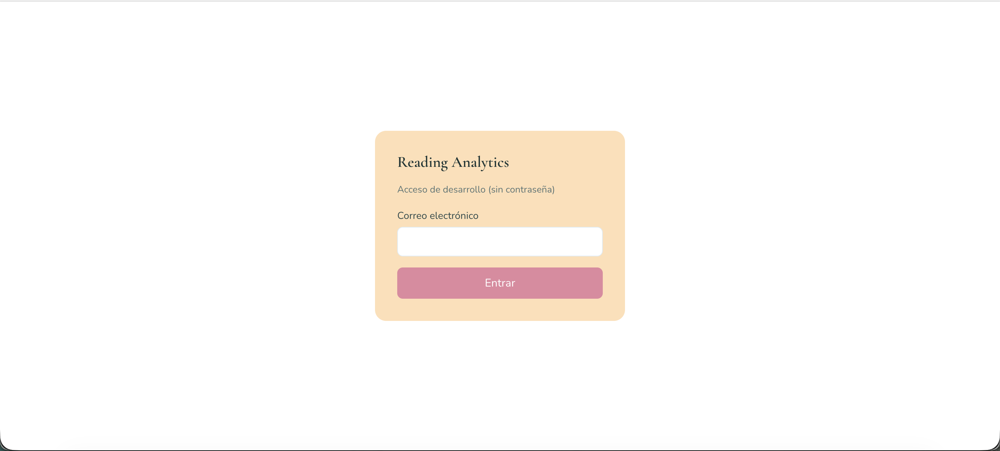

### 2.2. Primera vez sin datos

Si tu cuenta está vacía:

1. Ve a **Importar / Exportar** para subir un CSV de Goodreads, **o**
2. Ve a **Todas mis lecturas** → **Añadir libro** y empieza libro a libro.
3. Define tu meta en **Metas** o en el widget de **Inicio**.
4. Arma el TBR del mes en **Listas**.

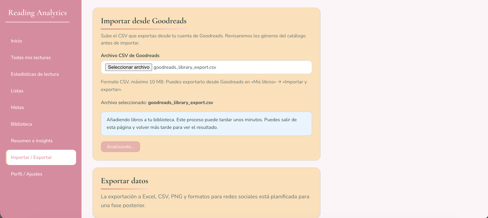

---

## 3. Navegación

La barra lateral izquierda (en móvil, menú hamburguesa) da acceso a:

| Menú                    | Ruta             | Para qué sirve                                                   |
| ----------------------- | ---------------- | ---------------------------------------------------------------- |
| Inicio                  | `/`              | Resumen del momento: lecturas en curso, KPIs del mes, meta y TBR |
| Todas mis lecturas      | `/book-tracker`  | Alta, edición y seguimiento de cada libro                        |
| Estadísticas de lectura | `/stats`         | Dashboards por mes o año                                         |
| Listas                  | `/lists`         | TBR mensual                                                      |
| Metas                   | `/goals`         | Meta anual y previsión                                           |
| Biblioteca              | `/library`       | Galería de todos tus libros                                      |
| Resumen e insights      | `/recap`         | *Próximamente* (placeholder)                                     |
| Importar / Exportar     | `/import-export` | Importación Goodreads                                            |
| Perfil / Ajustes        | `/profile`       | Cuenta, tema y catálogos propios                                 |

---

## 4. Inicio

La página **Inicio** es el tablero del día a día. Incluye cuatro bloques:

### 4.1. Libros en curso

Muestra las portadas de los libros con estado **Leyendo**. Si no hay ninguno, te enlaza al seguimiento. Desde el pie puedes ir a **Todas mis lecturas**.

### 4.2. Datos del mes

KPIs del mes calendario actual (UTC):

- Libros leídos  
- Páginas leídas  
- Valoración media

Enlace a **Ver estadísticas completas**.

### 4.3. Meta anual

Widget de la meta del año en curso: progreso (libros leídos / objetivo), barra de porcentaje y mensaje de ritmo (adelantada / al día / atrasada). Puedes crear o editar la meta desde aquí.

### 4.4. TBR actual

Lista de lectura del mes en curso (solo lectura). Enlace a **Gestionar en Listas**.

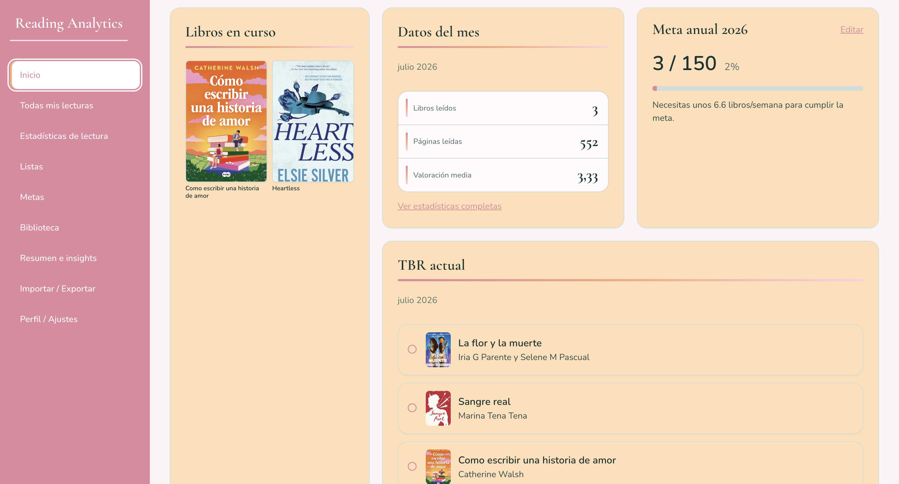

---

## 5. Todas mis lecturas (Book Tracker)

Es el corazón del seguimiento. Aquí ves **todos** tus libros en una tabla y gestionas estados, fechas, formato, puntuación y metadatos.

### 5.1. Vista de la tabla

Columnas principales:

- Portada, título, autora, género  
- Público objetivo (editable en la fila)  
- Páginas  
- Estado de lectura  
- Fecha de inicio / fin (según estado)  
- Formato de lectura  
- Puntuación (estrellas, si está leído)  
- Botón de editar (lápiz)

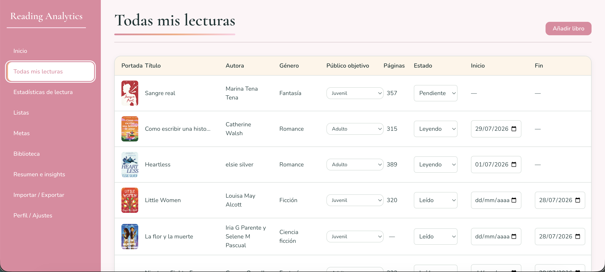

### 5.2. Añadir un libro por búsqueda

1. Pulsa **Añadir libro**.
2. Escribe título o nombre de autora (mínimo 2 caracteres). La búsqueda consulta el catálogo externo (Open Library, con fallback a Google Books).
3. Elige la edición correcta en los resultados.
4. Opcionalmente elige portada entre las disponibles, género y público objetivo (si el género del catálogo no encaja, el sistema te pide mapearlo a uno de tu catálogo).
5. Guarda. El libro aparece con estado por defecto **Pendiente**.

Si no encuentras el libro, usa la opción de **entrada manual** (formulario completo).

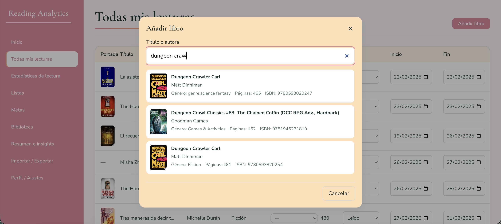

### 5.3. Cambiar el estado de lectura

En la columna **Estado** elige:

| Estado        | Significado                        |
| ------------- | ---------------------------------- |
| **Pendiente** | En cola; aún no iniciado           |
| **Leyendo**   | Lectura activa (aparece en Inicio) |
| **Leído**     | Terminado (cuenta en stats y meta) |
| **DNF**       | Did Not Finish — abandonado        |

Al pasar a **Leído**, se abre el modal **Finalizar lectura** (fecha de fin, formato, puntuación). Puedes cerrarlo y completar esos campos después en la tabla.

Si el libro estaba en el TBR del mes relevante, al marcarlo como leído puede marcarse automáticamente como completado en esa lista.

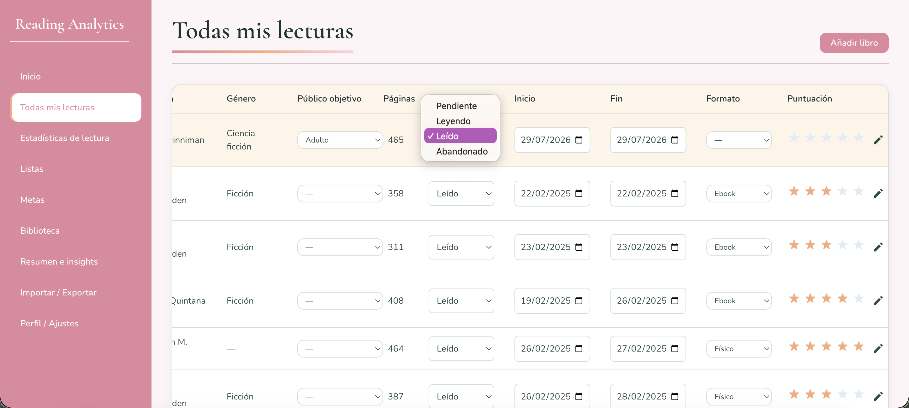

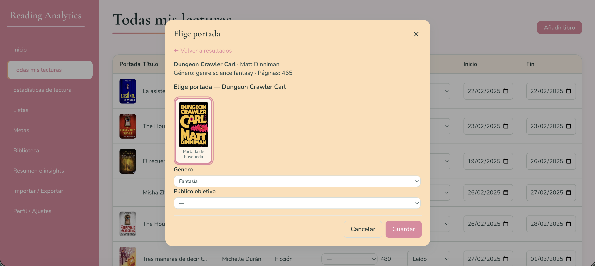

### 5.4. Edición inline y edición completa

En la propia fila puedes cambiar:

- Público objetivo  
- Estado  
- Fechas de inicio y fin (cuando aplica)  
- Formato  
- Puntuación (si está leído)

Con el icono de lápiz abres el **formulario de edición** completo: metadatos del libro, estado, fechas, formato, rating y búsqueda de portada alternativa.

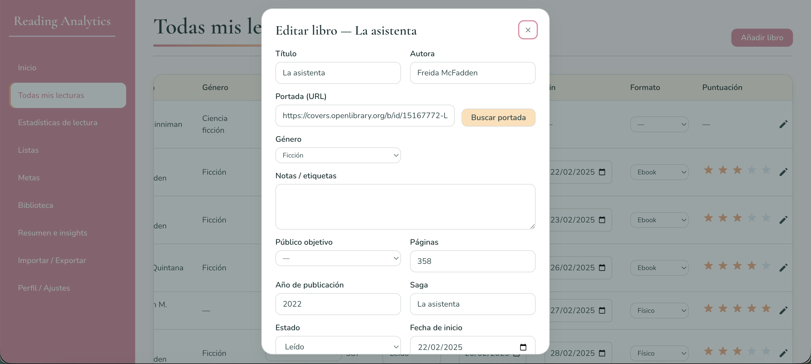

---

## 6. Estadísticas de lectura

Dashboard analítico con filtro de periodo:

- **Año completo** + selector de año, o  
- **Mes** + selector mes/año

El periodo elegido se recuerda entre visitas.

### 6.1. Indicadores (KPIs)

- Libros leídos  
- Páginas leídas  
- Valoración media

Si no hay libros leídos en el periodo, verás un mensaje vacío.

### 6.2. Insights automáticos

Lista de insights generados a partir de tus lecturas del periodo (hábitos, distribuciones, etc.).

### 6.3. Gráficos

- Distribución por **género** (tarta)  
- **Formato** de lectura (tarta + formato predominante)  
- **Público objetivo** (tarta)  
- Distribución de **puntuaciones** (tarta)  
- Barras de **libros por mes** / evolución  
- Barras de **páginas por mes** / evolución

### 6.4. Galería de portadas

Portadas de los libros terminados en el periodo seleccionado.

---

## 7. Listas (TBR mensual)

Gestiona tu **To Be Read** mes a mes.

### 7.1. Navegar por mes

Usa las flechas ← → para cambiar de mes (pasado, actual o futuro). El título muestra «TBR [mes año]».

### 7.2. Añadir libros al TBR

- Si la lista está vacía, el estado vacío te invita a añadir libros.  
- Si ya hay entradas, usa **Añadir libros**.

En el modal puedes:

- Elegir un libro **ya en tu biblioteca**, o  
- **Buscar** en el catálogo e incorporarlo a la biblioteca y al TBR a la vez.

### 7.3. Completados y quitar

Las entradas completadas (libro marcado como leído) se distinguen visualmente. Puedes **quitar** un libro del TBR sin borrarlo de tu biblioteca.

> **Nota:** El reordenamiento por arrastre (drag & drop) está previsto en producto; la gestión actual se centra en añadir, ver y quitar entradas.

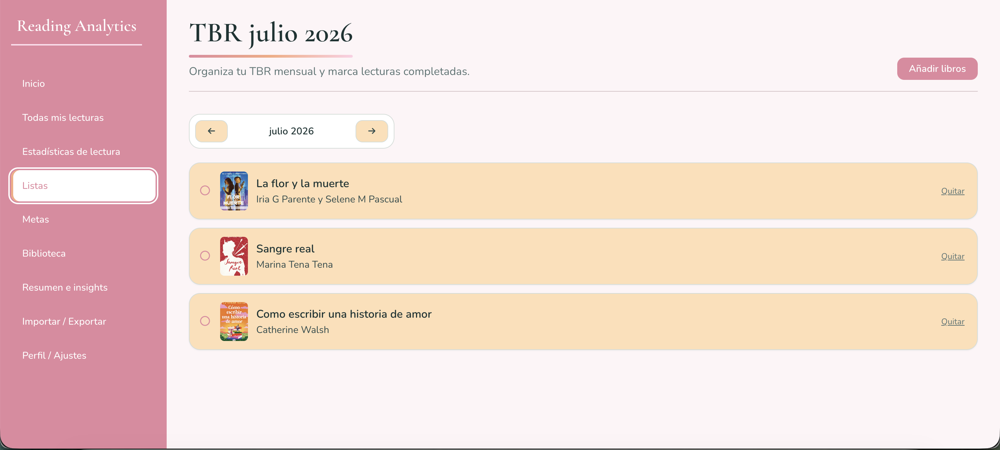

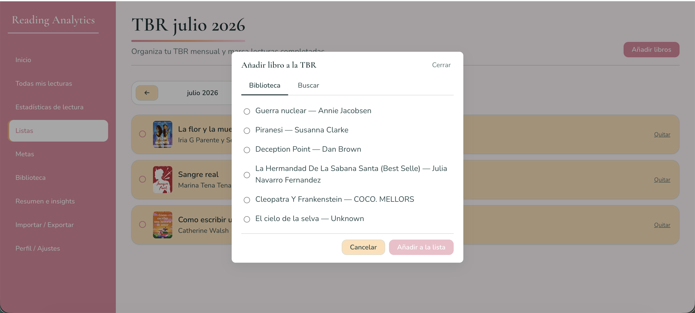

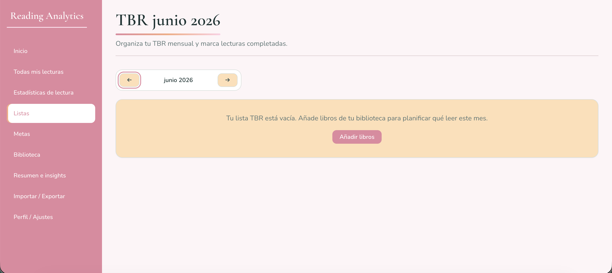

---

## 8. Metas

Página dedicada a la **meta anual** del año en curso.

### 8.1. Configurar y seguir la meta

- Indica cuántos libros quieres leer este año.  
- Ves libros leídos hasta la fecha, porcentaje y barra de progreso.  
- Puedes **Editar** la meta en cualquier momento.  
- Mensaje de ritmo: adelantada, al día o libros/semana necesarios si vas atrasada.

### 8.2. Previsión

Tarjeta lateral con proyección a fin de año según tu ritmo actual (libros/semana), y comparación con tu objetivo cuando existe.

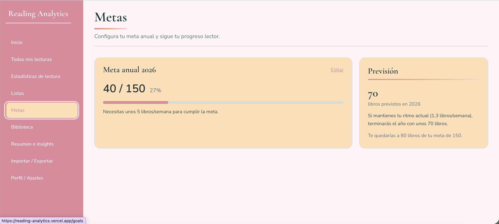

---

## 9. Biblioteca

Vista visual de **todos** tus libros (cualquier estado) en forma de galería de portadas, con contador total.

Es ideal para recorrer tu colección de un vistazo. La búsqueda avanzada y filtros (autora, género, trope, saga, año, formato, rating…) están planificados; hoy la galería muestra el conjunto completo.

Para añadir o editar libros, usa **Todas mis lecturas**.

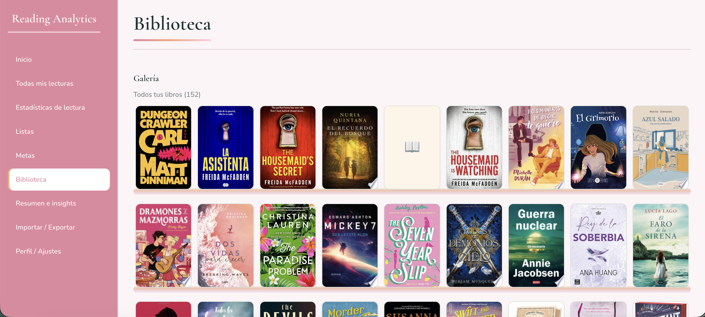

---

## 10. Resumen e insights

La entrada de menú **Resumen e insights** está reservada para wrap-ups mensuales/anuales y exportación visual (stories, PNG, PDF).

Hoy verás una página placeholder indicando que esa funcionalidad llegará más adelante. Los **insights automáticos del periodo** ya están disponibles dentro de **Estadísticas de lectura**.

---

## 11. Importar / Exportar

### 11.1. Importar desde Goodreads

1. En Goodreads: **Mis libros** → **Importar y exportar** → descarga el CSV.
2. En la app: **Importar / Exportar** → elige el archivo (CSV, máx. 10 MB).
3. Pulsa **Importar biblioteca**.
4. Si hay géneros del CSV que no coinciden con tu catálogo, aparece un paso para **mapearlos** a géneros existentes o crear correspondencias.
5. El proceso puede tardar minutos en bibliotecas grandes; puedes salir y volver: la app reanuda el trabajo en curso.
6. Al terminar verás un **resumen** (importados, omitidos, errores, etc.).

Tras importar, se actualizan biblioteca, estadísticas y metas.

### 11.2. Exportar

La exportación a Excel, CSV, PNG o formatos para redes sociales **aún no está disponible**; la tarjeta lo indica explícitamente.

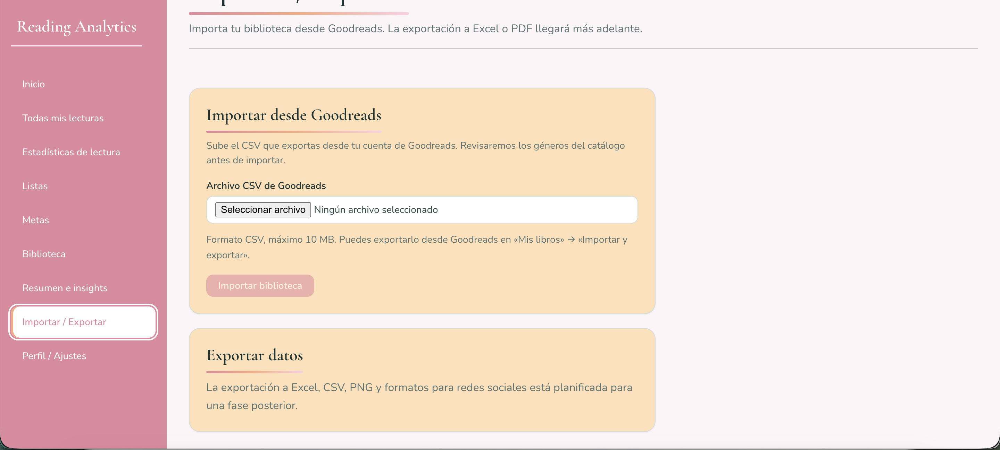

---

## 12. Perfil / Ajustes

### 12.1. Cuenta

Muestra el correo electrónico de la sesión actual.

### 12.2. Tema visual

Elige una paleta de color para toda la aplicación (por ejemplo Veranda, Primavera, Strawberry, Lotus Pond, Ocean Deep, Pool Party, Sunset, Pastel Dream, Fresh Green). El cambio se guarda en tu perfil.

### 12.3. Catálogos personalizados

Puedes crear y eliminar entradas de:

- **Público objetivo** (p. ej. Adult, YA, Middle Grade)  
- **Formatos** de lectura (p. ej. Físico, Ebook, Audio)  
- **Géneros**

Al borrar un valor que ya usan libros o lecturas, la app avisa cuántos registros se verían afectados y pide confirmación.

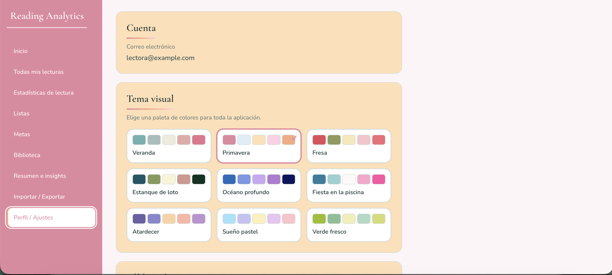

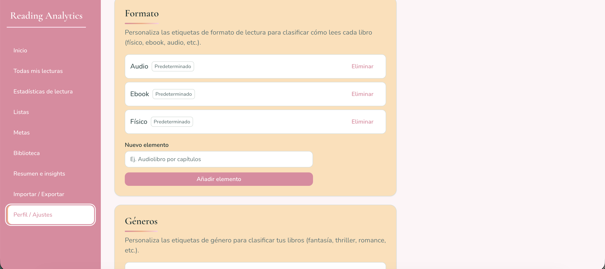

---

## 13. Flujos recomendados

### Arranque rápido (cuenta nueva)

1. Login → **Importar / Exportar** (CSV Goodreads) **o** **Añadir libro**.
2. **Metas** → define el número de libros del año.
3. **Listas** → arma el TBR del mes.
4. En **Todas mis lecturas**, marca lo que estás leyendo como **Leyendo**.
5. Revisa **Inicio** y **Estadísticas**.

### Día a día

1. Actualiza estados y fechas en **Todas mis lecturas**.
2. Al terminar un libro: estado **Leído** → completa fecha, formato y estrellas.
3. Mira el impacto en **Inicio**, **Metas** y **Estadísticas**.

### Cierre de mes

1. **Estadísticas** → modo **Mes** → mes que quieres revisar.
2. Revisa KPIs, insights, gráficos y galería.
3. **Listas** → comprueba el TBR del mes y prepara el siguiente.

---

## 14. Qué está planificado (aún no disponible)

Estas piezas aparecen en el PRD / casos de uso pero **no están completas** en la UI actual:

| Funcionalidad                                                     | Estado aproximado                                           |
| ----------------------------------------------------------------- | ----------------------------------------------------------- |
| Progreso por página / barra % en lectura activa (UC-03)           | Modelo preparado; sin UI de edición de página en el tracker |
| Tags personalizadas libres en el modal de fin de lectura          | Pendiente                                                   |
| Drag & drop para ordenar el TBR                                   | Pendiente                                                   |
| Búsqueda y filtros avanzados en Biblioteca (UC-09)                | Galería básica sí; filtros no                               |
| Recap / wrap-up y export visual story 9:16, PNG, PDF (UC-10)      | Placeholder                                                 |
| Export Excel / CSV desde la app                                   | Placeholder                                                 |
| Comparativa lado a lado de dos periodos en Stats                  | Pendiente (V1)                                              |
| Listas personalizadas, favoritos y retos más allá del TBR mensual | Pendiente                                                   |

Cuando estas piezas existan, esta guía deberá actualizarse y añadir capturas nuevas.

---

## 15. Glosario rápido

| Término                        | Significado                                                                 |
| ------------------------------ | --------------------------------------------------------------------------- |
| **TBR**                        | *To Be Read*: lista de libros que planeas leer (aquí, por mes)              |
| **DNF**                        | *Did Not Finish*: lectura abandonada                                        |
| **KPI**                        | Indicador numérico (libros, páginas, valoración media…)                     |
| **Catálogo**                   | Fuentes externas (Open Library / Google Books) usadas al buscar libros      |
| **Género / formato / público** | Clasificaciones que alimentan gráficos y que puedes personalizar en Ajustes |

---

## Documentación relacionada

- Visión de producto: [`PRD.md`](../../PRD.md)  
- Índice de entrega y demo: [`readme.md`](../../readme.md)  
- Historias de usuario: [`user-stories.md`](./user-stories.md)  
- Casos de uso (UC-01…UC-10): [`use-cases.md`](./use-cases.md)  
- Instalación local (desarrollo): [`../development_guide.md`](../development_guide.md)
