# 1. Introducción y objetivos

El sistema de búsqueda de especialidades médicas y profesionales de la salud es una plataforma diseñada para facilitar la localización, comparación y contacto con especialistas médicos. El propósito principal es optimizar la experiencia de búsqueda y agendamiento de citas tanto para pacientes como para médicos, proporcionando información transparente y herramientas que permitan tomar decisiones informadas.
Además, el sistema gestiona direcciones detalladas de pacientes y médicos mediante las entidades LOCATION, CITY y STATE, permitiendo búsquedas y filtrados más precisos por ubicación.

## Objetivos y metas

- Permitir a los usuarios buscar especialistas por especialidad, ubicación (dirección, ciudad y estado) y otros filtros relevantes.
- Facilitar la visualización de perfiles profesionales detallados, incluyendo información de ubicación.
- Ofrecer un proceso sencillo y eficiente para el agendamiento de citas.
- Integrar valoraciones y opiniones de pacientes para fomentar la confianza.
- Proveer notificaciones y recordatorios automáticos sobre citas y eventos importantes.
- Brindar herramientas de gestión para médicos y administradores del sistema, incluyendo la administración de direcciones.
- Garantizar una experiencia de usuario accesible y multiplataforma.

**Referencia:**
etapa1_investigacion_analisis.md, etapa2_casos_de_uso.md

# 2. Stakeholders

A continuación se identifican las partes interesadas y usuarios principales del sistema:

- **Visitante (no autenticado):** Persona que accede al sistema para buscar especialistas y consultar perfiles sin necesidad de registro. Puede visualizar información general de ubicación (ciudad y estado) de los especialistas.
- **Paciente (usuario registrado):** Usuario que puede buscar especialistas, agendar citas, valorar médicos y recibir notificaciones.
- **Médico Especialista:** Profesional de la salud que administra su perfil, agenda y recibe valoraciones de pacientes. Su información de ubicación (dirección, ciudad y estado), y es visible según los permisos definidos en el sistema.
- **Administrador del sistema:** Responsable de la gestión de usuarios, especialidades, filtros, direcciones, ciudades y estados, así como el monitoreo de la actividad general del sistema.

**Referencia:**
etapa2_casos_de_uso.md

# 3. Historias de usuario

- Como **visitante**, quiero buscar especialistas por especialidad y ubicación (ciudad y estado), para encontrar médicos adecuados a mis necesidades sin necesidad de registrarme.
- Como **visitante**, quiero ver el perfil de un especialista, para conocer su información profesional y ubicación general antes de decidirme a agendar una cita.
- Como **paciente**, quiero que mi dirección esté registrada y protegida, para que solo usuarios autorizados puedan verla.
- Como **paciente**, quiero buscar especialistas y ver sus perfiles, para comparar opciones y tomar decisiones informadas.
- Como **paciente**, quiero agendar una cita con un especialista, para reservar una consulta de manera sencilla.
- Como **paciente**, quiero valorar a un especialista después de una consulta, para compartir mi experiencia y ayudar a otros usuarios.
- Como **paciente**, quiero recibir notificaciones y recordatorios sobre mis citas, para no olvidar mis compromisos médicos.
- Como **médico especialista**, quiero gestionar mi agenda y disponibilidad, para organizar mis consultas y confirmar o rechazar citas.
- Como **médico especialista**, quiero ver el listado de mis próximas citas, para planificar mi día de trabajo.
- Como **administrador**, quiero gestionar usuarios (crear, editar o eliminar cuentas), para mantener el sistema actualizado y seguro.
- Como **médico especialista**, quiero gestionar mi dirección profesional en mi perfil, para que los pacientes puedan encontrarme y contactarme según mi ubicación.
- Como **administrador**, quiero gestionar el catálogo de especialidades y filtros, para asegurar que la información esté vigente.
- Como **administrador**, quiero poder gestionar las direcciones, ciudades y estados de los usuarios, para mantener la información actualizada y precisa en el sistema.
- Como **administrador**, quiero monitorear la actividad del sistema, para supervisar el funcionamiento general y detectar incidencias.

**Referencia:**
etapa2_casos_de_uso.md

# 4. Componentes principales y sitemaps

## Componentes principales del sistema (MVP)

- **Core de Dominio:**
  - Gestión de usuarios, médicos y pacientes.
  - Administración de especialidades, filtros y direcciones.
  - Lógica de negocio para búsqueda, agendamiento y valoración, considerando la ubicación detallada de los usuarios.
- **Frontend:** Panel de administración, búsqueda de especialistas, perfiles, agendamiento de citas, visualización y edición de direcciones en los perfiles de usuario.
- **Backend:** API REST, autenticación, orquestadores de casos de uso, endpoints para la gestión de direcciones.
- **Almacenamiento:** Base de datos de usuarios, médicos, especialidades, citas, valoraciones y direcciones (LOCATION, CITY, STATE).
- **Internacionalización:** Soporte multilenguaje.
- **Ubicación:** Integración con módulos de búsqueda y filtrado, gestión y visualización de direcciones.

## Relación entre componentes

- El core de dominio es independiente de frameworks y detalles de infraestructura.
- Los casos de uso exponen interfaces invocadas por los adaptadores de entrada (API REST).
- Los adaptadores de salida implementan interfaces para persistencia y almacenamiento, desacoplando el core de la tecnología específica.
- El frontend consume la API y gestiona la experiencia de usuario, incluyendo internacionalización.

### Diagrama de arquitectura del sistema y componentes principales

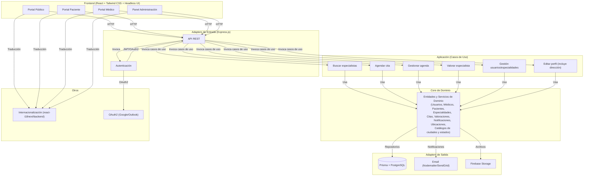

## Sitemaps


| Página / Sección                             | Subpáginas / Secciones                                                                                                                                                                              | Enlaces Relacionados                                                                                    | Usuarios con acceso              |
| ------------------------------------------------ | ------------------------------------------------------------------------------------------------------------------------------------------------------------------------------------------------------ | --------------------------------------------------------------------------------------------------------- | ---------------------------------- |
| Home / Página de inicio                       | Landingpage, información del sitio, misión y visión, buscador inicial, inicio de sesión                                                                                                          | Buscar especialistas / Resultados de búsqueda, Mi perfil, Aviso de privacidad, Términos y condiciones | Todos los usuarios               |
| Registro / Login                               | Formulario de registro e inicio de sesión                                                                                                                                                           | Home, Mi perfil, Aviso de privacidad, Términos y condiciones                                           | Todos los usuarios               |
| Buscar especialistas / Resultados de búsqueda | Campo de texto para búsqueda por nombre, filtro para listado de especialistas, ubicación (ciudad y estado) y valoración, acceso a perfil                                                          | Home, Mi perfil, Aviso de privacidad, Términos y condiciones                                           | Todos los usuarios               |
| Mi perfil                                      | Visualización y edición de datos personales.<br> Paciente: listado de citas, valoración de especialistas. <br> Médico: agenda, gestión de disponibilidad. <br> Administrador: datos personales. | Home, Buscar especialistas / Resultados de búsqueda, Aviso de privacidad, Términos y condiciones      | Paciente, Médico, Administrador |
| Mis citas                                      | Listado de citas agendadas, cancelar cita                                                                                                                                                            | Mi perfil                                                                                               | Paciente                         |
| Valorar especialista                           | Formulario de valoración tras consulta                                                                                                                                                              | Mi perfil, Buscar especialistas / Resultados de búsqueda                                               | Paciente                         |
| Agenda del médico                             | Gestión de disponibilidad, confirmación/rechazo de citas                                                                                                                                           | Mi perfil                                                                                               | Médico                          |
| Notificaciones y recordatorios (modal)         | Lista de notificaciones y recordatorios (modal tras inicio de sesión)                                                                                                                               | Mi perfil                                                                                               | Paciente, Médico                |
| Panel de administración                       | Gestión de usuarios, gestión de especialidades y filtros                                                                                                                                           | Gestión de usuarios, Gestión de especialidades y filtros                                              | Administrador                    |
| Gestión de usuarios                           | Crear, editar, eliminar cuentas                                                                                                                                                                      | Panel de administración                                                                                | Administrador                    |
| Gestión de especialidades y filtros           | Actualización de catálogo de especialidades y filtros                                                                                                                                              | Panel de administración                                                                                | Administrador                    |
| Gestión de direcciones, ciudades y estados    | Crear, editar, eliminar ciudades y estados                                                                                                                                                           | Panel de administración                                                                                | Administrador                    |
| Aviso de privacidad                            | Texto plano con detalles legales y de privacidad                                                                                                                                                     | Home, Buscar especialistas / Resultados de búsqueda, Mi perfil, Términos y condiciones                | Todos los usuarios               |
| Términos y condiciones                        | Texto plano con condiciones de uso                                                                                                                                                                   | Home, Buscar especialistas / Resultados de búsqueda, Mi perfil, Aviso de privacidad                    | Todos los usuarios               |

**Referencia:**
etapa4_diseño_del_sistema_y_arquitectura.md

# 5. Características y funcionalidades

- **Búsqueda de especialistas:** Permite localizar médicos por especialidad, ubicación y otros filtros relevantes.
- **Visualización de perfiles profesionales:** Muestra información detallada de los médicos, incluyendo datos de contacto, biografía y foto de perfil.
- **Agendamiento de citas:** Los pacientes pueden reservar consultas con especialistas seleccionados.
- **Valoraciones y opiniones:** Los pacientes pueden dejar opiniones y calificar a los médicos tras una consulta.
- **Notificaciones y recordatorios:** El sistema envía avisos automáticos a pacientes y médicos sobre citas y eventos importantes.
- **Gestión de agenda para médicos:** Los médicos pueden administrar su disponibilidad, confirmar o rechazar citas y ver el listado de próximas consultas.
- **Gestión de usuarios:** El administrador puede crear, editar o eliminar cuentas de médicos y pacientes.
- **Gestión de especialidades y filtros:** El administrador mantiene actualizado el catálogo de especialidades, ubicaciones y otros filtros.
- **Monitoreo de actividad:** El administrador supervisa el funcionamiento general y la actividad relevante del sistema.
- **Soporte multilenguaje:** El sistema está preparado para operar en varios idiomas.

**Referencia:**
etapa1_investigacion_analisis.md, etapa2_casos_de_uso.md, etapa4_diseño_del_sistema_y_arquitectura.md

# 6. Diseño y experiencia de usuario

Basarse en los siguientes ejemplos y proyectos para el diseño adecuandolos a los requerimientos descritos en este documento

## Diseños

### Layout Visitantes/Pacientes
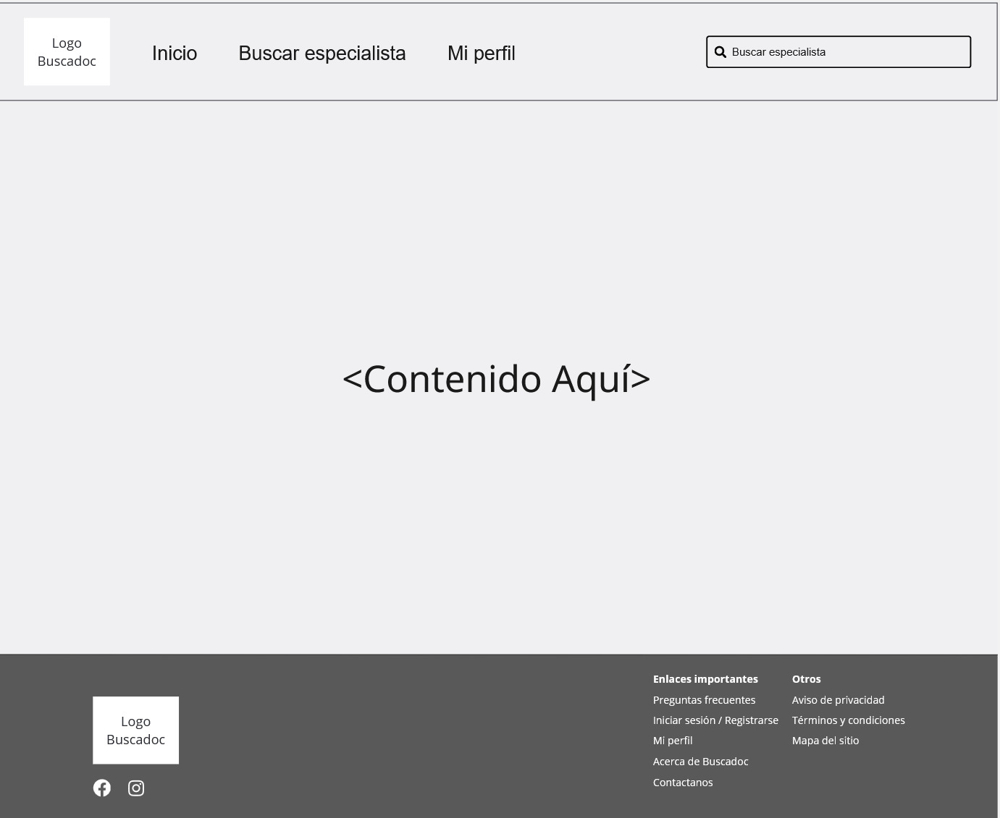

### Layout Médicos


### Login Pacientes y Médicos
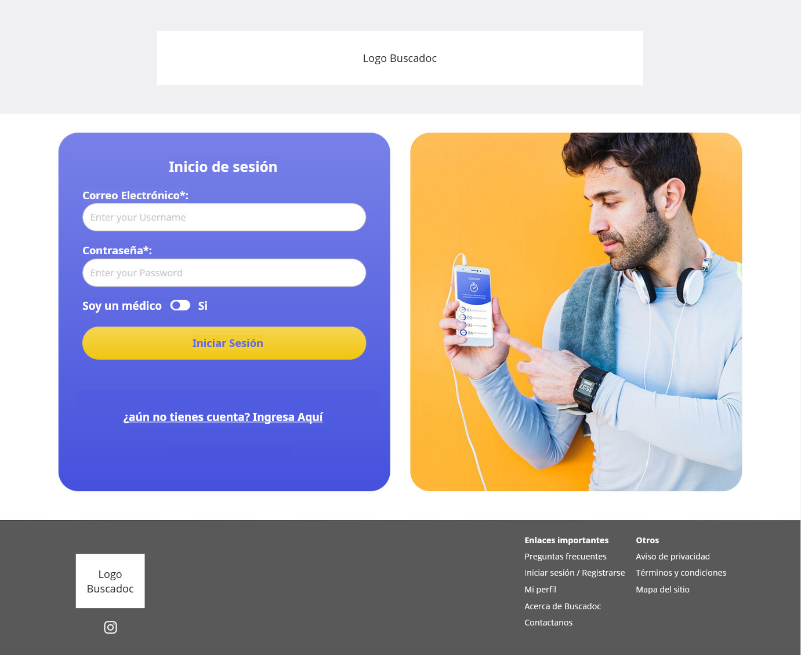

### Registro Pacientes
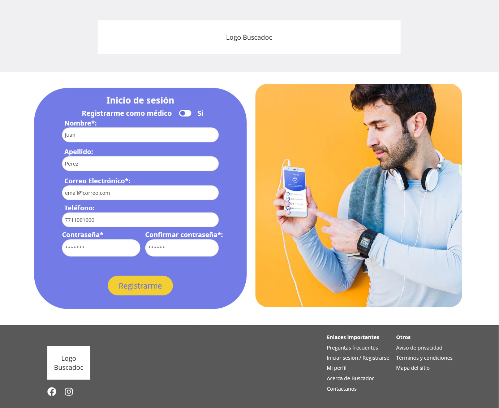

### Home / Busqueda de especialista
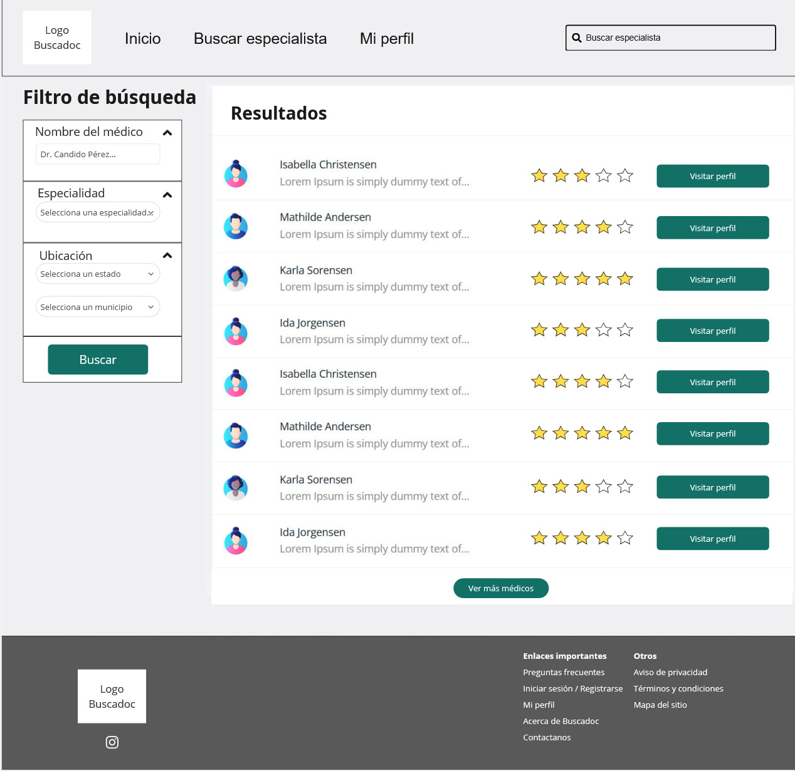

### Busqueda avanzada de especialistas
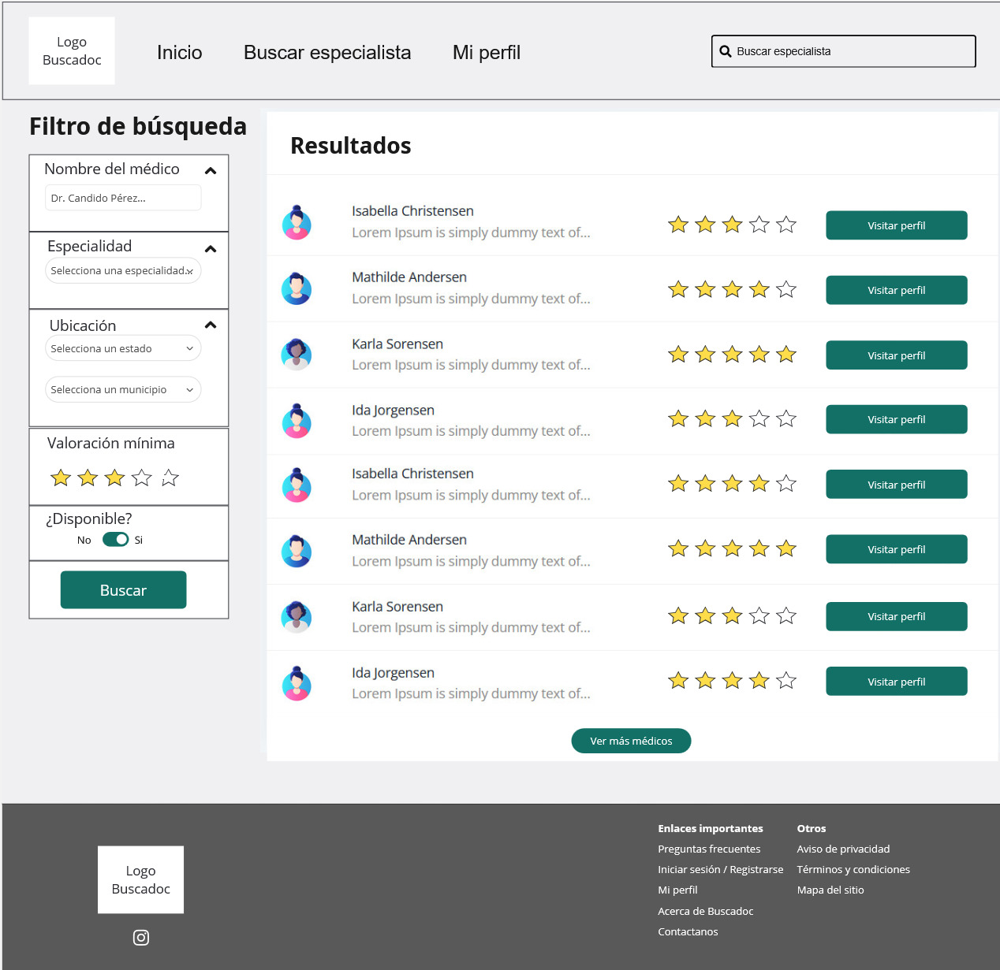

### Perfil Médico Especialista
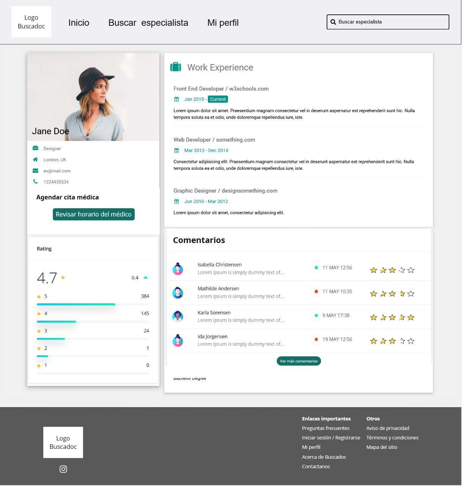

### Agendar cita médica
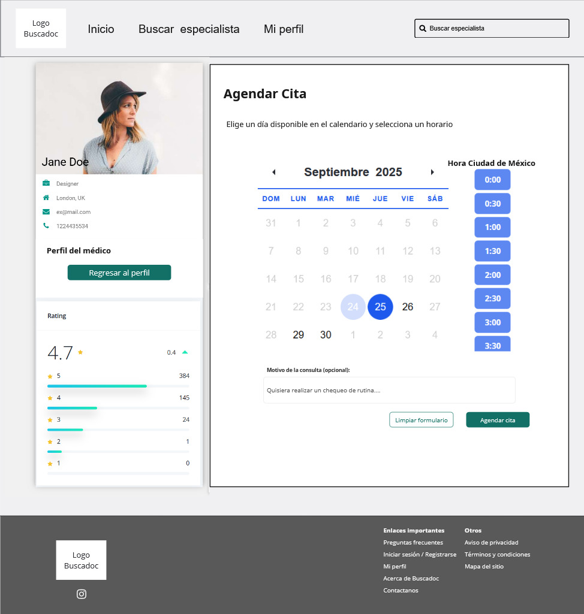

### Registro Médicos
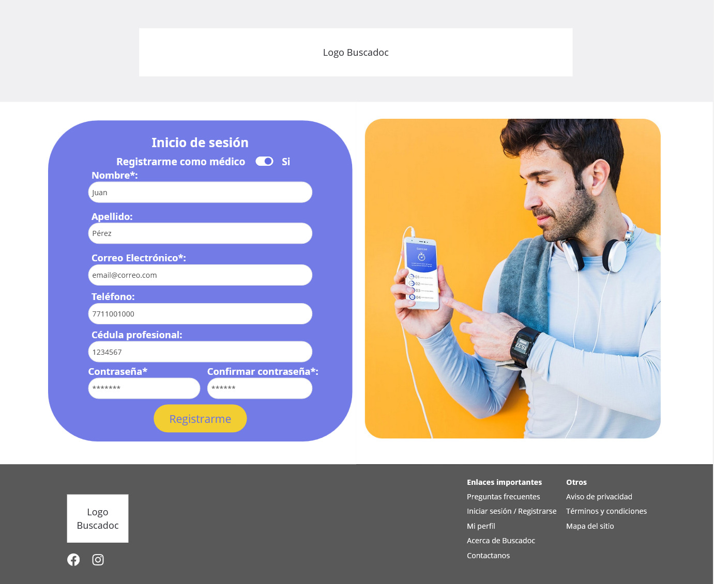

### Gestionar agenda médica
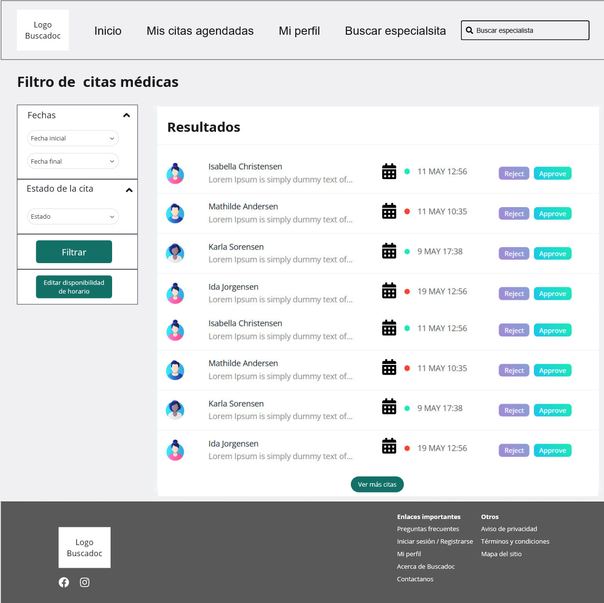

### Disponibilidad de horario médico
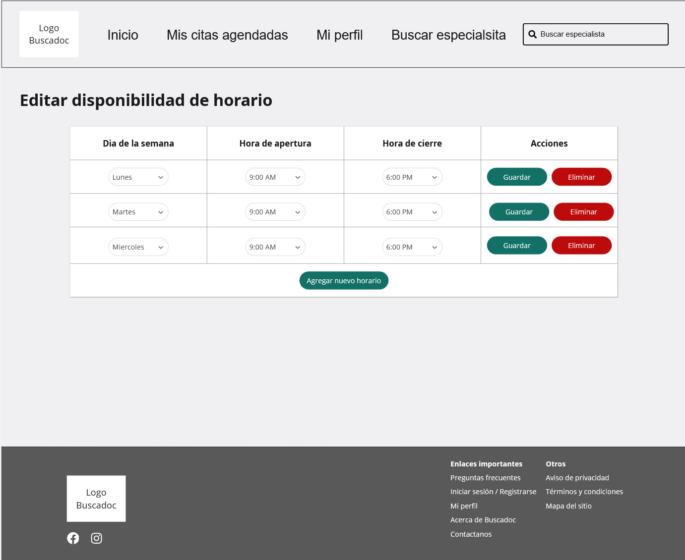

## Fuentes y paleta de colores

### Colores CSS

```css
--federal-blue: #03045eff;
--honolulu-blue: #0077b6ff;
--pacific-cyan: #00b4d8ff;
--non-photo-blue: #90e0efff;
--light-cyan: #caf0f8ff;
```

[URL Paleta](https://coolors.co/palette/03045e-0077b6-00b4d8-90e0ef-caf0f8)

### Fuente

**Roboto**
[URL Fuente](https://fonts.google.com/specimen/Roboto)

# 7. Requisitos técnicos

- **Backend:**
  - Node.js con Express.js para la API REST.
  - Arquitectura hexagonal para desacoplar lógica de negocio y adaptadores.
  - Prisma como ORM y PostgreSQL como base de datos principal.
  - Almacenamiento de archivos en Firebase Storage (fotos de perfil).
  - Estructura preparada para internacionalización de mensajes y validaciones.

- **Frontend:**
  - React + Tailwind CSS + Headless UI para la interfaz de usuario.
  - Consumo de la API REST para todas las operaciones.
  - Soporte multilenguaje mediante react-i18next.

- **Interactividad y personalización:**
  - Filtros de búsqueda personalizables (especialidad, ubicación, etc.).
  - Gestión de agenda y notificaciones en tiempo real.

- **Autenticación**
   - Utilizar JWT (`jsonwebtoken`) y hash de contraseñas con `bcryptjs`.

## Normativas aplicables

### LFPDPPP

Para cumplir con la Ley Federal de Protección de Datos Personales en Posesión de los Particulares (LFPDPPP) y sus leyes secundarias, el sistema debe considerar los siguientes criterios y buenas prácticas desde el diseño hasta la implementación:

1. **Identificación de datos personales y sensibles:**
   Clasificar los datos que se recopilan (personales, sensibles, financieros, de salud, etc.) y limitar la recolección a lo estrictamente necesario.
2. **Aviso de privacidad:**
   Mostrar y registrar el consentimiento del usuario respecto al aviso de privacidad, asegurando que sea claro, accesible y esté disponible antes de recabar datos.
3. **Consentimiento explícito:**
   Implementar mecanismos para obtener y registrar el consentimiento informado, especialmente para datos sensibles, y permitir al usuario retirar su consentimiento fácilmente.
4. **Finalidad y uso de los datos:**
   Definir y documentar las finalidades para las que se recaban los datos, limitando su uso exclusivamente a las finalidades informadas.
5. **Derechos ARCO (Acceso, Rectificación, Cancelación y Oposición):**
   Proporcionar interfaces para que los usuarios puedan ejercer sus derechos ARCO e implementar procesos para atender estas solicitudes.
6. **Seguridad de la información:**
   Aplicar medidas técnicas y organizacionales para proteger los datos (encriptación, control de acceso, registros de actividad, etc.) y realizar pruebas de seguridad periódicas.
7. **Transferencia de datos:**
   Documentar y controlar cualquier transferencia de datos a terceros, asegurando el cumplimiento de la LFPDPPP e informando y solicitando consentimiento para transferencias internacionales.
8. **Conservación y eliminación de datos:**
   Definir políticas de retención y eliminación segura de datos personales, implementando borrado lógico y físico según lo requiera la ley.
9. **Responsable y encargado:**
   Designar y documentar al responsable del tratamiento de datos personales, así como establecer contratos y controles con encargados externos (proveedores, servicios en la nube).
10. **Registro y trazabilidad:**
    Mantener registros de actividades de tratamiento de datos y accesos, e implementar trazabilidad para auditorías y cumplimiento.

### Normativas sobre ejercicio profesional en salud

De acuerdo con la legislación mexicana, el sistema debe cumplir con los siguientes requisitos relacionados con la acreditación y exhibición de la cédula profesional y certificados de estudios de médicos y profesionales de la salud:

1. **Ley General de Salud**

   - El sistema debe requerir y validar que los médicos y profesionales de la salud cuenten con título profesional y cédula expedida por la autoridad educativa competente, conforme al Artículo 79.
2. **Ley Reglamentaria del Artículo 5° Constitucional, relativa al ejercicio de las profesiones en la Ciudad de México**

   - El sistema debe permitir que los profesionales exhiban su título y cédula profesional en su perfil, y proporcionar estos datos cuando sean requeridos por los usuarios, conforme a los Artículos 12 y 13.

Estas disposiciones garantizan que los profesionales registrados en la plataforma acrediten su formación y autorización legal para ejercer, fortaleciendo la

**Referencia:**
etapa4_diseño_del_sistema_y_arquitectura.md, etapa1_investigacion_analisis.md

# 8. Planificación del proyecto

- **Duración estimada del MVP:** 30 a 50 horas.
- **Hitos principales:**

  - Definición y validación de requerimientos.
  - Diseño y configuración de la arquitectura base (backend y frontend).
  - Implementación de módulos principales: búsqueda, perfiles, agendamiento y gestión de usuarios.
  - Integración de notificaciones y valoraciones.
  - Pruebas funcionales y ajustes.
  - Despliegue inicial y retroalimentación.
- **Dependencias:**

  - Disponibilidad de recursos técnicos (desarrolladores backend y frontend).
  - Acceso a infraestructura de base de datos y almacenamiento.
  - Definición de catálogos de especialidades y filtros.
  - Validación de cumplimiento normativo (LFPDPPP).

**Referencia:**
etapa4_diseño_del_sistema_y_arquitectura.md

# 9. Criterios de aceptación

- El sistema permite buscar especialistas por especialidad y ubicación desde el frontend.
- Los usuarios pueden visualizar perfiles profesionales completos de los médicos.
- Los pacientes pueden agendar citas y recibir confirmación.
- Los pacientes pueden dejar valoraciones y opiniones tras una consulta.
- Los médicos pueden gestionar su agenda y confirmar/rechazar citas.
- El administrador puede gestionar usuarios, especialidades y filtros.
- El sistema envía notificaciones y recordatorios automáticos sobre citas.
- El sistema soporta al menos dos idiomas en la interfaz.
- El sistema almacena de forma segura los datos personales conforme a la LFPDPPP.
- Todas las funcionalidades principales están cubiertas por pruebas funcionales básicas.

**Referencia:**
etapa2_casos_de_uso.md, etapa4_diseño_del_sistema_y_arquitectura.md

# 10. Apéndices y recursos adicionales

## Glosario

- **Especialidad médica:** Rama de la medicina en la que un médico se ha especializado.
- **Paciente:** Usuario registrado que busca y agenda citas con especialistas.
- **Médico especialista:** Profesional de la salud registrado en la plataforma.
- **Administrador:** Usuario encargado de la gestión y supervisión del sistema.
- **LFPDPPP:** Ley Federal de Protección de Datos Personales en Posesión de los Particulares (México).

## Recursos externos y documentos de apoyo

- **etapa1_investigacion_analisis.md:** Documento con análisis de funcionalidades y beneficios para el cliente.
- **etapa2_casos_de_uso.md:** Documento con casos de uso y descripción de usuarios.
- **etapa3_modelado_datos.md:** Documento con el modelo de datos y entidades principales.
- **etapa4_diseño_del_sistema_y_arquitectura.md:** Documento con la arquitectura de alto nivel y componentes del sistema.

**Referencia:**
etapa1_investigacion_analisis.md, etapa2_casos_de_uso.md, etapa3_modelado_datos.md, etapa4_diseño_del_sistema_y_arquitectura.md

# 11. Dependencias y convenciones actuales

## Backend

- **Dependencias principales instaladas:**
  - `express@4.18.2`: Framework para la API REST.
  - `prisma@5.10.1` y `@prisma/client@5.10.1`: ORM y cliente para PostgreSQL.
  - `pg@8.11.3`: Driver para PostgreSQL.
  - `dotenv@16.4.5`: Manejo de variables de entorno.
  - `cors@2.8.5`: Middleware para CORS.
  - `nodemailer@6.9.8`: Envío de correos electrónicos.
  - `jsonwebtoken@9.0.2`: Implementación de autenticación JWT.
  - `bcryptjs@2.4.3`: Hash y verificación de contraseñas (sin dependencias nativas).

- **Convenciones de autenticación:**
  - Por compatibilidad y facilidad de integración, la autenticación se implementa inicialmente con JWT (`jsonwebtoken`) y hash de contraseñas con `bcryptjs`.
  - La integración con Auth.js y OAuth2 se realizará en tickets futuros, conforme a la arquitectura hexagonal.

- **Estructura hexagonal recomendada:**
  - `/src/domain`: Entidades y servicios de dominio.
  - `/src/application`: Casos de uso.
  - `/src/adapters/in`: Adaptadores de entrada (API REST, controladores).
  - `/src/adapters/out`: Adaptadores de salida (persistencia, email, storage).
  - `/src/config`: Configuración y utilidades.
  - `/prisma`: Archivos de modelo y migraciones.

- **Internacionalización:**
  - El backend está preparado para mensajes multilenguaje, siguiendo las convenciones de internacionalización.
  - La integración de dependencias específicas para i18n se realizará en tickets futuros.

- **Seguridad y cumplimiento:**
  - Todas las credenciales y datos sensibles se gestionan mediante variables de entorno y archivos `.env` (excluidos del control de versiones).
  - El sistema cumple con la LFPDPPP y las normativas mexicanas de protección de datos personales.

**Referencia:**  
etapa4_diseño_del_sistema_y_arquitectura.md, etapa1_investigacion_analisis.md, arquitectura hexagonal, convenciones de seguridad e internacionalización.

# 12. Formato estándar de respuesta de la API REST

Todos los endpoints de la API REST responden bajo un formato estructurado y consistente, facilitando la integración y el manejo de errores en el frontend y otros consumidores. Este formato se aplica tanto a respuestas exitosas como a errores.

## Estructura general de la respuesta

```json
{
  "code": "Código HTTP (200, 400, 404, 500, etc.)",
  "message": "Mensaje sobre el resultado de la operación (en inglés)",
  "payload": {
    // Datos de la operación o errores
  }
}
```

### Ejemplo de respuesta exitosa (búsqueda de especialistas)

```json
{
  "code": 200,
  "message": "success",
  "payload": {
    "results": [
      {
        "id": 4,
        "name": "Dr. Juan Pérez",
        "specialty": "Cardiología, Dermatología",
        "city": "Coyoacán",
        "state": "Ciudad de México",
        "photo": "",
        "biography": "Cardiólogo con 10 años de experiencia."
      }
    ],
    "pagination": {
      "total": 1,
      "page": 1,
      "limit": 5,
      "totalPages": 1
    }
  }
}
```

### Ejemplo de respuesta exitosa (perfil de especialista)

```json
{
  "code": 200,
  "message": "success",
  "payload": {
    "id": 4,
    "name": "Dr. Juan Pérez",
    "specialty": "Cardiología",
    "biography": "Cardiólogo con 10 años de experiencia.",
    "photo": "",
    "licenseNumber": "MED12345",
    "title": "Cardiología",
    "city": "Coyoacán",
    "state": "Ciudad de México"
  }
}
```

### Ejemplo de respuesta de error (validación)

```json
{
  "code": 400,
  "message": "Bad Request",
  "payload": {
    "error": [
      "limit must be a positive number"
    ]
  }
}
```

### Ejemplo de respuesta de error (no encontrado)

```json
{
  "code": 404,
  "message": "Doctor not found",
  "payload": {
    "error": [
      "Doctor with specified ID does not exist"
    ]
  }
}
```

**Consideraciones técnicas:**
- El formato es gestionado por middlewares globales en Express, desacoplados del core de dominio.
- Los mensajes siempre se entregan en inglés para facilitar la internacionalización en el frontend.
- Los datos de la operación se incluyen directamente en el campo `payload`, sin envoltorios adicionales.
- Los errores se entregan como un arreglo en `payload.error`, permitiendo mostrar múltiples mensajes de validación o sistema.
- Este estándar facilita la integración con el frontend (React + react-i18next) y otros sistemas externos.

**Referencia:**  
etapa4_diseño_del_sistema_y_arquitectura.md, arquitectura hexagonal.
