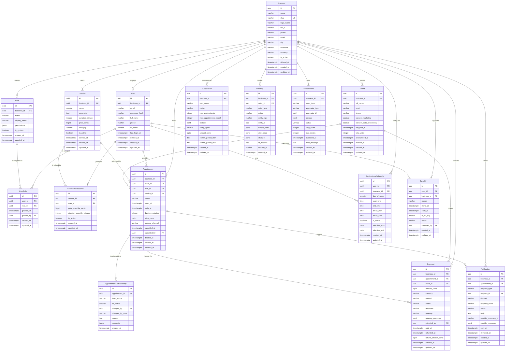

# ReservaPro — Data Model

## 1. Entity Analysis

---

### `Business`

The tenant entity representing a barbershop or salon that operates as an isolated workspace within the platform.

| Field | Type | Description |
|-------|------|-------------|
| id | uuid PK | Primary key |
| name | varchar(150) | Display name of the business |
| slug | varchar(100) UK | URL-friendly unique identifier for public booking pages |
| legal_name | varchar(200) | Legal entity name for invoicing |
| tax_id | varchar(20) | Colombian NIT or RUT tax identifier |
| phone | varchar(20) | Primary contact phone number |
| email | varchar(255) | Primary contact email |
| address_line1 | varchar(255) | Street address |
| city | varchar(80) | City (e.g. Bogotá, Medellín, Cali) |
| department | varchar(80) | Colombian department/state |
| timezone | varchar(50) | IANA timezone, default `America/Bogota` |
| currency | varchar(3) | ISO 4217 currency code, default `COP` |
| logo_url | text | URL to business logo asset |
| settings | jsonb | Arbitrary business-level configuration (working hours defaults, branding) |
| is_active | boolean | Whether the business is operational on the platform |
| deleted_at | timestamptz | Soft-delete timestamp for audit trail |
| created_at | timestamptz | Record creation timestamp |
| updated_at | timestamptz | Last modification timestamp |

**Relationships:**
- A Business has many Users (staff members).
- A Business has many Services.
- A Business has many Clients.
- A Business has exactly one active Subscription at any time (historical subscriptions retained).
- A Business has many Appointments.
- A Business has many Roles.

**Design decisions:**
- `slug` is globally unique to enable public booking URLs like `reservapro.co/b/mi-barberia`.
- `deleted_at` enables soft-delete; all queries must filter on `deleted_at IS NULL` unless auditing.
- `timezone` stored per-business to handle Colombia's single timezone (`America/Bogota`) while allowing future LATAM expansion.
- `settings` as jsonb avoids schema migrations for per-business configuration knobs.

---

### `User`

Internal staff members (owners, admins, professionals) who authenticate and operate within a business.

| Field | Type | Description |
|-------|------|-------------|
| id | uuid PK | Primary key |
| business_id | uuid FK | The business this user belongs to |
| email | varchar(255) | Login email |
| password_hash | varchar(255) | Bcrypt/argon2 hashed password |
| full_name | varchar(200) | Display name |
| phone | varchar(20) | Contact phone (also used for WhatsApp notifications) |
| avatar_url | text | Profile photo URL |
| is_active | boolean | Whether the user can log in |
| last_login_at | timestamptz | Last successful authentication timestamp |
| deleted_at | timestamptz | Soft-delete timestamp |
| created_at | timestamptz | Record creation timestamp |
| updated_at | timestamptz | Last modification timestamp |

**Relationships:**
- A User belongs to exactly one Business.
- A User has many UserRoles (role assignments).
- A User (as professional) has many ServiceProfessional assignments.
- A User (as professional) has many ProfessionalSchedules.
- A User (as professional) has many TimeOffs.
- A User (as professional) has many Appointments.

**Design decisions:**
- `email` uniqueness is scoped to `business_id` (composite unique: `business_id, email`) — the same person could theoretically work at two shops with different accounts.
- Users are always scoped to a business. System Admins are modeled as users of a special "platform" business or via a separate `is_platform_admin` flag if needed at scale.
- `password_hash` never stores plaintext; rotated on password reset.

---

### `Role`

A named permission set within a business, enabling RBAC for staff members.

| Field | Type | Description |
|-------|------|-------------|
| id | uuid PK | Primary key |
| business_id | uuid FK | The business this role belongs to |
| name | varchar(50) | Role identifier: `owner`, `admin`, `professional` |
| display_name | varchar(100) | Human-readable label |
| permissions | jsonb | Array of permission strings (e.g. `["appointments:write", "reports:read"]`) |
| is_system | boolean | Whether this is a built-in role that cannot be deleted |
| created_at | timestamptz | Record creation timestamp |
| updated_at | timestamptz | Last modification timestamp |

**Relationships:**
- A Role belongs to exactly one Business.
- A Role has many UserRoles.

**Design decisions:**
- System roles (`owner`, `admin`, `professional`) are seeded on business creation with `is_system = true` and cannot be deleted or renamed.
- `permissions` as jsonb array allows flexible permission checks without a separate permission table, keeping the model simple for the current scale.
- Composite unique constraint on `(business_id, name)` prevents duplicate role names within a business.

---

### `UserRole`

Junction entity assigning a role to a user within a specific business context.

| Field | Type | Description |
|-------|------|-------------|
| id | uuid PK | Primary key |
| user_id | uuid FK | The user receiving the role |
| role_id | uuid FK | The role being assigned |
| granted_at | timestamptz | When the role was assigned |
| granted_by | uuid FK | User ID of whoever granted the role |
| created_at | timestamptz | Record creation timestamp |
| updated_at | timestamptz | Last modification timestamp |

**Relationships:**
- A UserRole belongs to exactly one User.
- A UserRole belongs to exactly one Role.
- A User can have many UserRoles (multiple roles).
- A Role can be assigned to many Users via UserRoles.

**Design decisions:**
- Composite unique constraint on `(user_id, role_id)` prevents duplicate assignments.
- `granted_by` tracks who performed the assignment for audit purposes.
- A user can hold multiple roles simultaneously (e.g. `admin` + `professional`).

---

### `Service`

A bookable service offered by a business (e.g. haircut, beard trim, coloring).

| Field | Type | Description |
|-------|------|-------------|
| id | uuid PK | Primary key |
| business_id | uuid FK | The business offering this service |
| name | varchar(150) | Service name (e.g. "Corte Clásico") |
| description | text | Detailed description shown to clients |
| duration_minutes | integer | Expected duration in minutes |
| price_cents | bigint | Price in centavos/centavos-equivalent (COP stored as integer cents to avoid float issues) |
| currency | varchar(3) | ISO 4217, inherited from business but overridable |
| category | varchar(80) | Grouping label (e.g. "Cabello", "Barba", "Uñas") |
| is_active | boolean | Whether the service is bookable |
| sort_order | integer | Display ordering within category |
| deleted_at | timestamptz | Soft-delete timestamp |
| created_at | timestamptz | Record creation timestamp |
| updated_at | timestamptz | Last modification timestamp |

**Relationships:**
- A Service belongs to exactly one Business.
- A Service has many ServiceProfessional assignments (which professionals can perform it).
- A Service is referenced by many Appointments.

**Design decisions:**
- `price_cents` uses integer arithmetic (price in centavos) to avoid floating-point rounding errors in financial calculations. For COP where the smallest unit is $1, this stores the exact peso amount.
- `duration_minutes` is the canonical duration; actual appointment duration may differ if the service is combined with others.
- Soft-delete preserves historical appointment references.

---

### `ServiceProfessional`

Junction entity linking services to the professionals qualified to perform them.

| Field | Type | Description |
|-------|------|-------------|
| id | uuid PK | Primary key |
| service_id | uuid FK | The service being offered |
| user_id | uuid FK | The professional who can perform it |
| price_override_cents | bigint | Optional per-professional price override (null = use service default) |
| duration_override_minutes | integer | Optional per-professional duration override (null = use service default) |
| is_active | boolean | Whether this professional currently offers this service |
| created_at | timestamptz | Record creation timestamp |
| updated_at | timestamptz | Last modification timestamp |

**Relationships:**
- A ServiceProfessional belongs to exactly one Service.
- A ServiceProfessional belongs to exactly one User (professional).
- A Service has many ServiceProfessionals (multiple professionals can offer it).
- A User has many ServiceProfessionals (a professional can offer multiple services).

**Design decisions:**
- Composite unique constraint on `(service_id, user_id)` prevents duplicate assignments.
- `price_override_cents` and `duration_override_minutes` allow senior professionals to charge more or take different time for the same service.
- This junction resolves the many-to-many relationship between services and professionals.

---

### `Client`

End customers who book appointments at a business.

| Field | Type | Description |
|-------|------|-------------|
| id | uuid PK | Primary key |
| business_id | uuid FK | The business this client has visited |
| full_name | varchar(200) | Client's name |
| email | varchar(255) | Contact email |
| phone | varchar(20) | Phone number (primary channel for WhatsApp notifications) |
| gender | varchar(20) | Optional gender for personalization |
| date_of_birth | date | Optional birthday for loyalty campaigns |
| notes | text | Internal notes visible to staff |
| consent_marketing | boolean | GDPR/LATAM privacy: opted in to marketing communications |
| consent_data_processing | boolean | GDPR/LATAM privacy: consented to data processing |
| consent_given_at | timestamptz | Timestamp when consent was last updated |
| last_visit_at | timestamptz | Denormalized last appointment completion time |
| total_visits | integer | Denormalized visit count for loyalty tiers |
| is_active | boolean | Whether the client profile is active |
| anonymized_at | timestamptz | When PII was anonymized per data retention policy |
| deleted_at | timestamptz | Soft-delete timestamp |
| created_at | timestamptz | Record creation timestamp |
| updated_at | timestamptz | Last modification timestamp |

**Relationships:**
- A Client belongs to exactly one Business.
- A Client has many Appointments.
- A Client has many Payments.

**Design decisions:**
- PII fields (`full_name`, `email`, `phone`) must be anonymized when `anonymized_at` is set, replacing values with `[REDACTED]` per Colombian data protection law (Ley 1581 de 2012).
- `consent_marketing` and `consent_data_processing` are separate boolean flags to comply with granular consent requirements.
- `last_visit_at` and `total_visits` are denormalized counters updated via triggers or application logic for performance on client list views.
- Composite unique on `(business_id, phone)` prevents duplicate client profiles per phone number within a business.

---

### `Subscription`

The business's subscription plan, controlling feature access and billing.

| Field | Type | Description |
|-------|------|-------------|
| id | uuid PK | Primary key |
| business_id | uuid FK | The subscribed business |
| plan_name | varchar(50) | Plan identifier: `free`, `starter`, `professional`, `enterprise` |
| status | varchar(20) | Current status: `active`, `past_due`, `cancelled`, `trial` |
| max_professionals | integer | Maximum number of active professionals allowed |
| max_appointments_month | integer | Monthly appointment cap (-1 = unlimited) |
| features | jsonb | Feature flags enabled for this plan |
| billing_cycle | varchar(20) | `monthly` or `yearly` |
| amount_cents | bigint | Subscription price in cents |
| currency | varchar(3) | ISO 4217 currency code |
| current_period_start | date | Start of current billing period |
| current_period_end | date | End of current billing period |
| cancelled_at | timestamptz | When cancellation was requested |
| created_at | timestamptz | Record creation timestamp |
| updated_at | timestamptz | Last modification timestamp |

**Relationships:**
- A Subscription belongs to exactly one Business.
- A Business has many Subscriptions (historical), but only one with `status = 'active'` at any time.

**Design decisions:**
- Historical subscriptions are retained (append-like pattern) to track plan changes over time.
- `features` as jsonb allows plan feature gating without schema changes (e.g. `{"whatsapp_notifications": true, "multi_location": false}`).
- Partial unique index on `(business_id) WHERE status = 'active'` ensures only one active subscription per business at the database level.
- `max_professionals` and `max_appointments_month` are enforced at the application layer during creation flows.

---

### `Appointment`

The core booking entity linking a client to a professional, service, and time slot.

| Field | Type | Description |
|-------|------|-------------|
| id | uuid PK | Primary key |
| business_id | uuid FK | The business where the appointment takes place |
| client_id | uuid FK | The client who booked |
| user_id | uuid FK | The professional performing the service |
| service_id | uuid FK | The service being performed |
| status | varchar(20) | Current status: `pending`, `confirmed`, `in_progress`, `completed`, `cancelled`, `no_show` |
| starts_at | timestamptz | Appointment start time (UTC) |
| ends_at | timestamptz | Appointment end time (UTC) |
| duration_minutes | integer | Actual booked duration (may differ from service default) |
| price_cents | bigint | Price charged for this appointment (snapshot at booking time) |
| notes | text | Client-facing notes or special requests |
| internal_notes | text | Staff-only notes not visible to client |
| cancellation_reason | text | Reason provided when status is `cancelled` |
| cancelled_at | timestamptz | When the cancellation occurred |
| cancelled_by | uuid FK | User or client who initiated cancellation |
| booking_channel | varchar(20) | How the appointment was created: `online`, `in_store`, `phone`, `whatsapp` |
| deleted_at | timestamptz | Soft-delete timestamp |
| created_at | timestamptz | Record creation timestamp |
| updated_at | timestamptz | Last modification timestamp |

**Relationships:**
- An Appointment belongs to exactly one Business.
- An Appointment belongs to exactly one Client.
- An Appointment belongs to exactly one User (professional).
- An Appointment belongs to exactly one Service.
- An Appointment has many AppointmentStatusHistory entries.
- An Appointment has zero or more Payments.
- An Appointment has many Notifications.

**Design decisions:**
- **Double-booking prevention**: An exclusion constraint using `EXCLUDE USING gist (user_id WITH =, tstzrange(starts_at, ends_at) WITH &&)` prevents overlapping appointments for the same professional at the database level.
- `price_cents` is a snapshot of the price at booking time, decoupled from later service price changes.
- `starts_at` and `ends_at` are stored in UTC; the business timezone is used for display only.
- `status` transitions are validated at the application layer and recorded in `AppointmentStatusHistory`.
- `booking_channel` tracks acquisition source for analytics.

---

### `AppointmentStatusHistory`

Append-only log of every status transition for an appointment.

| Field | Type | Description |
|-------|------|-------------|
| id | uuid PK | Primary key |
| appointment_id | uuid FK | The appointment whose status changed |
| from_status | varchar(20) | Previous status (null for initial creation) |
| to_status | varchar(20) | New status |
| changed_by | uuid FK | User ID who triggered the change (null if system/client) |
| changed_by_type | varchar(20) | Actor type: `user`, `client`, `system` |
| reason | text | Optional reason for the transition |
| metadata | jsonb | Additional context (e.g. notification sent, payment collected) |
| created_at | timestamptz | When the transition occurred |

**Relationships:**
- An AppointmentStatusHistory belongs to exactly one Appointment.
- An Appointment has many AppointmentStatusHistory entries.

**Design decisions:**
- This table is **append-only** — no UPDATE or DELETE operations are permitted. Enforced via database triggers that reject modifications.
- `from_status` is nullable to represent the initial `created` event.
- `changed_by_type` distinguishes between staff, client self-service, and automated system transitions.
- `metadata` captures contextual data without schema changes (e.g. `{"notification_id": "...", "cancellation_fee": 5000}`).

---

### `Payment`

Financial transaction records for appointments, following an append-only pattern.

| Field | Type | Description |
|-------|------|-------------|
| id | uuid PK | Primary key |
| business_id | uuid FK | The business receiving the payment |
| appointment_id | uuid FK | The appointment this payment relates to |
| client_id | uuid FK | The client who paid |
| amount_cents | bigint | Payment amount in cents |
| currency | varchar(3) | ISO 4217 currency code |
| method | varchar(30) | Payment method: `cash`, `card`, `transfer`, `nequi`, `daviplata`, `pse` |
| status | varchar(20) | Payment status: `pending`, `completed`, `failed`, `refunded` |
| reference | varchar(100) | External payment reference (gateway transaction ID) |
| gateway | varchar(50) | Payment gateway name (e.g. `wompi`, `payu`, `mercadopago`) |
| gateway_response | jsonb | Raw gateway response payload for reconciliation |
| collected_by | uuid FK | Staff user who collected the payment (for cash/in-store) |
| paid_at | timestamptz | When the payment was completed |
| refunded_at | timestamptz | When a refund was processed |
| refund_amount_cents | bigint | Partial or full refund amount |
| created_at | timestamptz | Record creation timestamp |
| updated_at | timestamptz | Last modification timestamp |

**Relationships:**
- A Payment belongs to exactly one Business.
- A Payment belongs to exactly one Appointment.
- A Payment belongs to exactly one Client.
- An Appointment has zero or more Payments (supports split payments).

**Design decisions:**
- **Append-only**: Payment records are never deleted. Refunds are modeled as status transitions (`completed` → `refunded`) with `refunded_at` and `refund_amount_cents` populated, not as separate records.
- `method` includes Colombian-specific payment methods (`nequi`, `daviplata`, `pse`) reflecting the local market.
- `gateway_response` as jsonb stores raw gateway payloads for audit and reconciliation without schema rigidity.
- Split payments are supported: multiple payment records can reference the same appointment.
- `collected_by` is nullable — online payments have no staff collector.

---

### `Notification`

Records of messages sent to clients and staff via WhatsApp, email, or SMS.

| Field | Type | Description |
|-------|------|-------------|
| id | uuid PK | Primary key |
| business_id | uuid FK | The business context for this notification |
| appointment_id | uuid FK | Related appointment (nullable for non-appointment notifications) |
| recipient_type | varchar(20) | Who received it: `client`, `professional`, `owner` |
| recipient_id | uuid FK | The User or Client who received the notification |
| channel | varchar(20) | Delivery channel: `whatsapp`, `email`, `sms`, `push` |
| template_name | varchar(80) | Template identifier used (e.g. `appointment_confirmation`, `reminder_24h`) |
| status | varchar(20) | Delivery status: `queued`, `sent`, `delivered`, `failed`, `read` |
| subject | varchar(255) | Email subject or message preview |
| body | text | Rendered message body |
| provider_message_id | varchar(255) | External message ID from WhatsApp Business API / email provider |
| provider_response | jsonb | Raw provider response for debugging |
| sent_at | timestamptz | When the message was dispatched |
| delivered_at | timestamptz | When delivery was confirmed |
| failed_reason | text | Error message if delivery failed |
| created_at | timestamptz | Record creation timestamp |
| updated_at | timestamptz | Last modification timestamp |

**Relationships:**
- A Notification belongs to exactly one Business.
- A Notification optionally belongs to one Appointment.
- A Notification has one recipient (Client or User).

**Design decisions:**
- `appointment_id` is nullable to support non-appointment notifications (marketing campaigns, subscription alerts).
- `recipient_type` + `recipient_id` is a polymorphic reference — the application layer resolves to either Client or User.
- `provider_response` stores raw webhook payloads from WhatsApp Business API or email providers for debugging delivery issues.
- Status transitions follow the provider webhook lifecycle: `queued` → `sent` → `delivered` → `read` (or `failed`).

---

### `ProfessionalSchedule`

Weekly recurring availability rules for a professional.

| Field | Type | Description |
|-------|------|-------------|
| id | uuid PK | Primary key |
| user_id | uuid FK | The professional |
| business_id | uuid FK | The business context |
| day_of_week | smallint | Day of week: 0 (Sunday) through 6 (Saturday) |
| start_time | time | Start of availability window |
| end_time | time | End of availability window |
| break_start | time | Optional break start (e.g. lunch) |
| break_end | time | Optional break end |
| is_active | boolean | Whether this schedule rule is currently in effect |
| effective_from | date | When this schedule becomes active |
| effective_until | date | When this schedule expiresates (null = indefinite) |
| created_at | timestamptz | Record creation timestamp |
| updated_at | timestamptz | Last modification timestamp |

**Relationships:**
- A ProfessionalSchedule belongs to exactly one User (professional).
- A ProfessionalSchedule belongs to exactly one Business.
- A User has many ProfessionalSchedules (one per day or multiple slots per day).

**Design decisions:**
- Multiple schedule entries per day support split shifts (e.g. morning + evening).
- `break_start`/`break_end` model lunch breaks without requiring separate records.
- `effective_from`/`effective_until` allow schedule versioning — when a professional changes their hours, old schedules expire and new ones take effect, preserving historical accuracy.
- Composite unique constraint on `(user_id, day_of_week, start_time, effective_from)` prevents duplicate entries.

---

### `TimeOff`

Exceptions to a professional's regular schedule (vacations, sick days, personal time).

| Field | Type | Description |
|-------|------|-------------|
| id | uuid PK | Primary key |
| user_id | uuid FK | The professional taking time off |
| business_id | uuid FK | The business context |
| reason | varchar(200) | Reason category: `vacation`, `sick`, `personal`, `training`, `other` |
| starts_at | timestamptz | Start of the time-off period |
| ends_at | timestamptz | End of the time-off period |
| is_full_day | boolean | Whether this covers the entire working day |
| notes | text | Additional details |
| approved_by | uuid FK | User ID who approved (null if self-approved by owner) |
| status | varchar(20) | Approval status: `pending`, `approved`, `rejected` |
| created_at | timestamptz | Record creation timestamp |
| updated_at | timestamptz | Last modification timestamp |

**Relationships:**
- A TimeOff belongs to exactly one User (professional).
- A TimeOff belongs to exactly one Business.
- A User has many TimeOffs.

**Design decisions:**
- Exclusion constraint on `(user_id, tstzrange(starts_at, ends_at))` prevents overlapping time-off entries.
- `approved_by` workflow enables owners to approve/reject professional time-off requests.
- The scheduling engine checks TimeOff entries when computing available slots, excluding these periods from bookable times.

---

### `AuditLog`

Append-only audit trail capturing all data mutations for compliance and debugging.

| Field | Type | Description |
|-------|------|-------------|
| id | uuid PK | Primary key |
| business_id | uuid FK | The business context (nullable for platform-level actions) |
| actor_id | uuid FK | The User who performed the action (nullable for system actions) |
| actor_type | varchar(20) | Actor classification: `user`, `system`, `api` |
| action | varchar(50) | CRUD action: `create`, `update`, `delete`, `login`, `export`, `anonymize` |
| entity_type | varchar(80) | The entity being modified (e.g. `Appointment`, `Client`, `Payment`) |
| entity_id | uuid | The ID of the affected entity |
| before_state | jsonb | Full entity state before the mutation (null for creates) |
| after_state | jsonb | Full entity state after the mutation (null for deletes) |
| changes | jsonb | Diff of changed fields only (computed from before/after) |
| ip_address | inet | Client IP address at time of action |
| user_agent | text | Client user agent string |
| request_id | varchar(50) | Correlation ID for request tracing |
| created_at | timestamptz | When the action occurred |

**Relationships:**
- An AuditLog optionally belongs to a Business.
- An AuditLog optionally belongs to a User (actor).

**Design decisions:**
- **Strictly append-only**: Database-level trigger rejects any UPDATE or DELETE on this table.
- `before_state` and `after_state` store complete entity snapshots as jsonb, enabling full state reconstruction at any point in time.
- `changes` is a computed diff for quick scanning without parsing full snapshots.
- `business_id` is nullable to capture platform-level actions (system admin operations, cron jobs).
- Partitioning by `created_at` (monthly) is recommended for query performance at scale.

---

### `OutboxEvent`

Transactional outbox for reliable event publishing, ensuring at-least-once delivery of domain events.

| Field | Type | Description |
|-------|------|-------------|
| id | uuid PK | Primary key |
| business_id | uuid FK | The business context for the event |
| event_type | varchar(100) | Domain event name (e.g. `appointment.created`, `payment.completed`) |
| aggregate_type | varchar(80) | The entity type that produced the event |
| aggregate_id | uuid | The ID of the source entity |
| payload | jsonb | Event payload (denormalized event data) |
| status | varchar(20) | Processing status: `pending`, `published`, `failed` |
| retry_count | integer | Number of delivery attempts |
| max_retries | integer | Maximum retry attempts before dead-lettering |
| published_at | timestamptz | When the event was successfully published |
| error_message | text | Last error encountered during publishing |
| created_at | timestamptz | When the event was recorded |
| updated_at | timestamptz | Last processing attempt timestamp |

**Relationships:**
- An OutboxEvent belongs to exactly one Business.

**Design decisions:**
- Events are written to this table in the **same database transaction** as the domain operation, guaranteeing atomicity.
- A separate relay process polls for `status = 'pending'` events and publishes them to the message broker (e.g. RabbitMQ, SQS).
- `retry_count` with exponential backoff handles transient failures; events exceeding `max_retries` are dead-lettered for manual inspection.
- Index on `(status, created_at)` supports efficient polling by the relay process.
- Events older than 30 days can be archived to cold storage.

---

## 2. Entity Relationship Diagram

