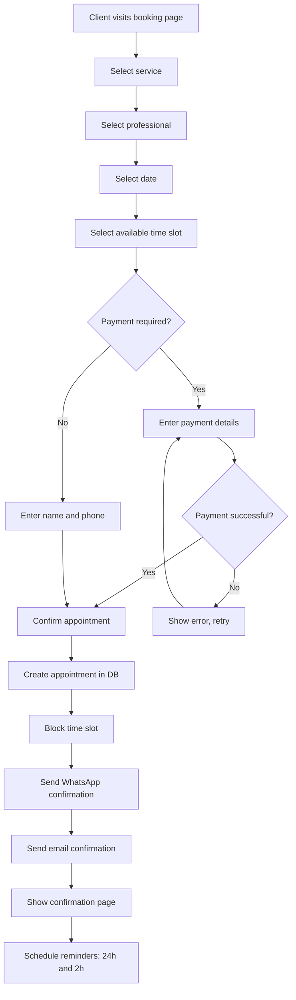
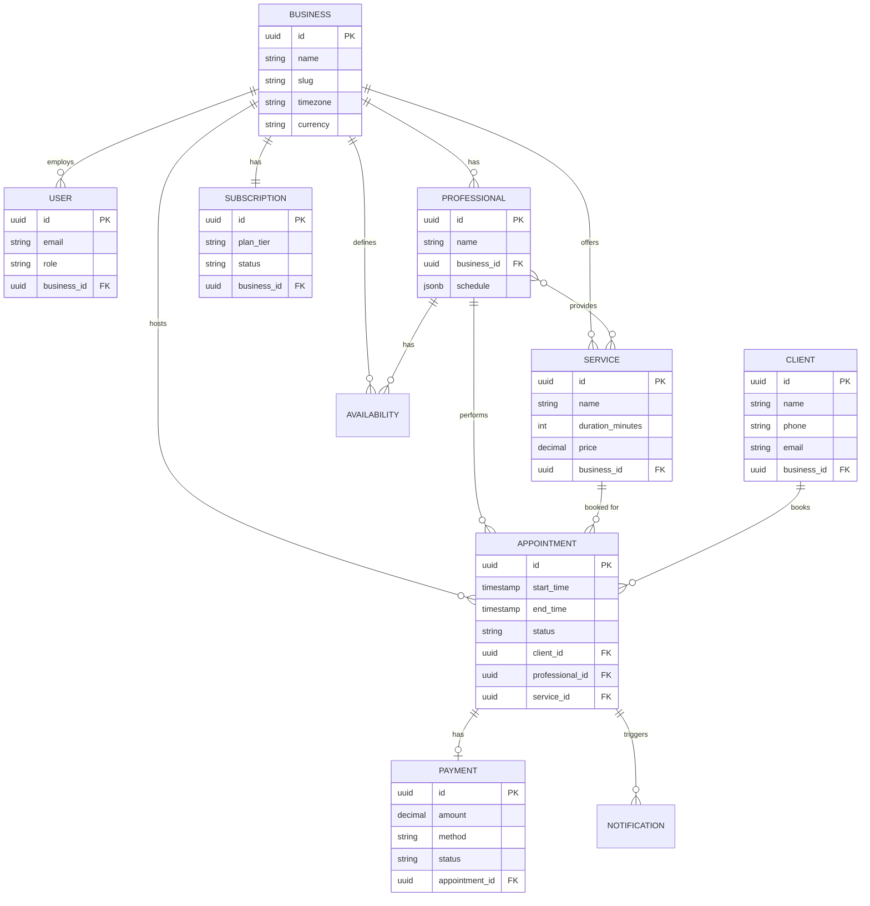
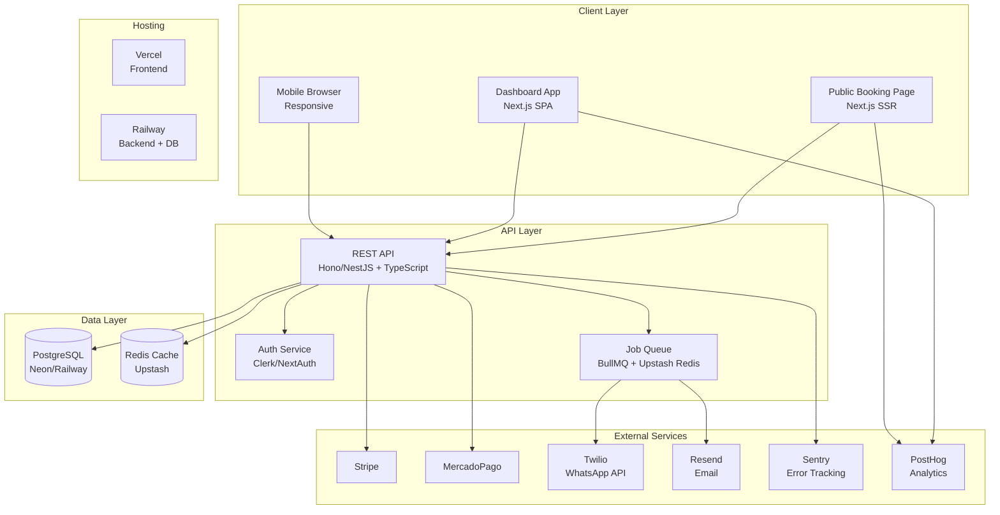

# ReservaPro — Product Requirements Document

**Version**: 1.0
**Date**: May 31, 2026
**Status**: Draft — Pending stakeholder review
**Author**: Product Team

---

## 1. Executive Summary

ReservaPro is a SaaS booking and management platform purpose-built for niche personal service businesses — starting with barbershops and salons in Colombia, with planned expansion across Latin America and Spain. The platform solves the critical operational gap faced by approximately 1.4 million service businesses in the region that still rely on WhatsApp messages, paper agendas, and manual cash tracking to manage appointments and client relationships. Existing global solutions (Mindbody at $129–699/mo, Fresha with marketplace competition) are either prohibitively expensive or structurally misaligned with LATAM business practices. ReservaPro combines native WhatsApp integration, local payment methods (MercadoPago, Nequi), LATAM-adapted pricing ($19–59/mo), and Spanish-first UX to deliver a platform that understands how these businesses actually operate. The timing is driven by accelerating digitalization mandates (electronic invoicing), WhatsApp Business API maturity, and a 2–3 year window before global incumbents deepen their localization.

---

## 2. Problem Statement

### Pain Points

| Problem | Impact | Frequency | Current Workaround |
|---------|--------|-----------|-------------------|
| Manual booking via WhatsApp/phone | High — time loss, double-bookings, missed appointments | Daily (universal) | Paper agenda + WhatsApp messages |
| No-shows without reduction mechanism | High — direct revenue loss ($15–40 per no-show) | 20–30% of appointments | Manual WhatsApp reminders (inconsistent) |
| No digital client history | Medium — cannot personalize service or track preferences | Every repeat visit | Memory or paper notes |
| Manual cash control (cash/transfers) | High — errors, fraud risk, zero visibility | Daily | Excel or notebook accounting |
| No 24/7 online booking presence | High — loss of potential clients outside business hours | Constant | None — business only reachable during open hours |
| Existing software too expensive or not in Spanish | High — adoption barrier for SMBs | Ongoing | Use free generic tools (Google Calendar) |
| No integration with local payment methods | Medium — friction for online collection | High | Bank transfer with manual confirmation |
| No electronic invoicing adapted to country | Medium — growing legal obligation | Increasing | External accountant or manual invoicing |

### User Personas

**Persona 1: Carlos — Business Owner**
- **Role**: Owner of "Barbería El Clásico" in Bogotá, 3 barbers, 3 years operating
- **Goals**: Reduce no-shows, know daily revenue without counting cash, grow client base
- **Frustrations**: Spends 45 min/day on WhatsApp scheduling; lost $800 last month to no-shows; tried Mindbody but couldn't justify $200/mo; current "system" is a notebook
- **Tech comfort**: Medium — uses WhatsApp daily, has a smartphone, basic Excel, but no technical background

**Persona 2: Andrés — Professional/Barber**
- **Role**: Senior barber at El Clásico, 5 years experience, builds his own client base
- **Goals**: See his schedule clearly, know which clients prefer what cut, get paid on time
- **Frustrations**: Clients message him directly to book (blurs work/personal); doesn't know tomorrow's schedule until Carlos tells him; tips sometimes lost in cash confusion
- **Tech comfort**: High for mobile — lives on his phone, uses Instagram for portfolio, quick to adopt useful apps

**Persona 3: Valentina — End Client**
- **Role**: 28-year-old marketing professional, visits barber every 3 weeks
- **Goals**: Book appointments easily at any hour, get reminded before appointments, pay online
- **Frustrations**: Has to call or WhatsApp during business hours to book; forgot her last appointment and was charged anyway; can't see availability before messaging
- **Tech comfort**: High — books everything online (Rappi, Uber, Netflix), expects seamless digital experiences

### Jobs-to-be-Done

1. **When I** need to manage my barbershop's daily schedule, **I want to** see all appointments and barber availability in one place, **so I can** avoid double-bookings and optimize my team's time.
2. **When I** receive a booking request at 11 PM, **I want to** accept it automatically through an online page, **so I can** capture clients even when the shop is closed.
3. **When I** have a 20% no-show rate, **I want to** send automatic WhatsApp reminders before each appointment, **so I can** reduce no-shows and protect my revenue.
4. **When I** want to know how my business performed this month, **I want to** see revenue, appointments, and top services in a simple dashboard, **so I can** make decisions without spreadsheets.
5. **When I** am a client looking for a haircut, **I want to** see available times and book in under 60 seconds from my phone, **so I can** schedule without calling or waiting for a WhatsApp reply.

---

## 3. Goals and Success Metrics

### Product Goals (SMART)

1. **Acquisition**: Onboard 50 active barbershops/salons in Colombia within 6 months of launch, measured by businesses with at least 10 completed appointments.
2. **Activation**: Achieve 70% activation rate (defined as: signup → configure services → receive first booking) within 48 hours of account creation, measured by onboarding funnel analytics.
3. **Retention**: Maintain monthly churn below 5% for paying customers after month 3, measured by subscription cancellation rate.
4. **Engagement**: Achieve 80% of active businesses processing at least 30 appointments/month through the platform by month 6, measured by appointment volume per business.
5. **Revenue**: Reach $5,000 MRR within 12 months of launch through paid plan conversions, measured by Stripe subscription data.

### Success Metrics

| Metric | Target | Measurement Method | Timeframe |
|--------|--------|-------------------|-----------|
| Active businesses (10+ appointments/mo) | 50 | Platform analytics | 6 months post-launch |
| Activation rate (signup → first booking) | 70% | Onboarding funnel (PostHog) | Ongoing |
| Monthly churn (paid plans) | <5% | Stripe subscription data | After month 3 |
| No-show reduction for users | 40% reduction | Before/after comparison per business | 3 months per business |
| Time-to-first-booking (new business) | <24 hours | Time from signup to first appointment created | Ongoing |
| Booking page conversion (visitor → booking) | >35% | Public page analytics | Ongoing |
| WhatsApp reminder delivery rate | >95% | Twilio/Cloud API delivery reports | Ongoing |
| Net Promoter Score (NPS) | >50 | Quarterly survey | Quarterly |

### North Star Metric

**Weekly Active Appointments**: The total number of appointments completed through ReservaPro each week across all businesses. This metric captures platform adoption, business engagement, and end-client usage in a single number. Target: 500 weekly active appointments by month 6.

---

## 4. User Stories and Acceptance Criteria

### Epic 1: Authentication & Authorization

**Priority: Must**

**Story 1.1**: As a business owner, I want to sign up with my email and create my business profile, so I can start using the platform immediately.

- **Given** a user visits the signup page
- **When** they enter a valid email, password, and business name
- **Then** an account is created with "owner" role, a default business is created, and they are redirected to the onboarding flow

**Story 1.2**: As a business owner, I want to invite my barbers/stylists with specific roles, so they can access only what they need.

- **Given** an owner is on the team management page
- **When** they invite a user with the "professional" role via email
- **Then** the invited user receives an email invitation, and upon acceptance can only view their own schedule and client notes (not revenue or settings)

**Story 1.3**: As a professional, I want to log in and see only my appointments and profile, so I am not overwhelmed by business-level data.

- **Given** a user with "professional" role logs in
- **When** they access the dashboard
- **Then** they see only their own calendar, their client list, and their personal settings — not business revenue, other professionals' schedules, or admin settings

### Epic 2: Business Management

**Priority: Must**

**Story 2.1**: As a business owner, I want to configure my business hours and holidays, so the booking page reflects my actual availability.

- **Given** an owner is on the business settings page
- **When** they set opening/closing hours per day of week and add holiday dates
- **Then** the booking page only shows available slots within those hours, and holidays show zero availability

**Story 2.2**: As a business owner, I want to add and manage my team of professionals, so clients can book with specific people.

- **Given** an owner has a business with multiple barbers
- **When** they add a professional with name, photo, services offered, and individual schedule
- **Then** the booking page shows each professional as a selectable option with their specific availability

**Story 2.3**: As a business owner, I want to set up multiple service locations (future), so I can manage branches from one account.

- **Given** an owner on the Business plan with multiple locations
- **When** they create a second location with its own hours and team
- **Then** each location has independent availability and the owner can switch between locations in the dashboard

### Epic 3: Service Management

**Priority: Must**

**Story 3.1**: As a business owner, I want to create services with name, duration, and price, so clients know what is offered and how long it takes.

- **Given** an owner is on the services page
- **When** they create a service "Corte clásico" with 30 min duration and $25,000 COP price
- **Then** the service appears on the booking page and the availability engine accounts for the 30-minute block

**Story 3.2**: As a business owner, I want to assign services to specific professionals, so clients can only book appropriate combinations.

- **Given** a service "Coloración" exists and only one professional is trained for it
- **When** the owner assigns that service exclusively to that professional
- **Then** the booking page only shows that professional as available when "Coloración" is selected

**Story 3.3**: As a business owner, I want to organize services into categories, so the booking page is clear and easy to navigate.

- **Given** an owner has 8+ services
- **When** they group them into categories (Cortes, Barba, Tratamientos)
- **Then** the booking page displays services organized by category with visual separation

### Epic 4: Calendar & Availability Engine

**Priority: Must**

**Story 4.1**: As a business owner, I want to see a calendar view of all appointments across all professionals, so I can understand the day at a glance.

- **Given** a business has 3 professionals and 15 appointments today
- **When** the owner opens the calendar view
- **Then** they see a day/week view with color-coded appointments per professional, including client name, service, and status

**Story 4.2**: As a system, I want to calculate available slots based on professional schedules, existing appointments, and buffer times, so double-bookings are impossible.

- **Given** a professional works 9 AM–6 PM with a 30-min service and 15-min buffer
- **When** a client requests available slots for tomorrow
- **Then** the system returns only non-overlapping slots that respect existing bookings, buffer times, and the professional's schedule — using database-level exclusion constraints to prevent race conditions

**Story 4.3**: As a business owner, I want to set buffer time between appointments and define slot intervals, so my team has transition time between clients.

- **Given** an owner sets a 15-minute buffer and 30-minute slot intervals
- **When** a 30-minute service is booked at 10:00 AM
- **Then** the next available slot is 10:45 AM (not 10:30 AM)

### Epic 5: Public Booking Page

**Priority: Must**

**Story 5.1**: As an end client, I want to visit a business's booking page and complete a reservation in under 60 seconds, so I can book without friction.

- **Given** a client visits `reservapro.com/barberia-el-clasico`
- **When** they select a service, professional, date, and time, then enter their name and phone
- **Then** the appointment is confirmed, a WhatsApp confirmation is sent, and the slot is removed from availability — all without page reload

**Story 5.2**: As an end client, I want to see real-time availability for my chosen service and professional, so I can pick a time that works.

- **Given** a client has selected "Corte clásico" with Andrés
- **When** they navigate to the date picker
- **Then** they see only dates with available slots, and selecting a date shows specific available times (no manual refresh needed)

**Story 5.3**: As a business owner, I want my booking page to be branded with my logo and colors, so it feels like part of my business.

- **Given** an owner on the Starter plan or above
- **When** they upload their logo and select brand colors in settings
- **Then** the public booking page reflects their branding (logo, primary color, business name)

**Story 5.4**: As an end client on mobile, I want the booking page to be fully responsive and fast, so I can book from my phone without issues.

- **Given** a client visits the booking page from a mobile browser
- **When** the page loads
- **Then** it renders correctly on screens 320px+, loads in under 2 seconds (LCP), and all interactions are touch-friendly (minimum 44px tap targets)

### Epic 6: Appointment Management

**Priority: Must**

**Story 6.1**: As a business owner, I want to create appointments manually for walk-in or phone clients, so all bookings are in one system.

- **Given** an owner is on the calendar view
- **When** they click "New appointment", select client (or create new), service, professional, and time
- **Then** the appointment is created, the slot is blocked, and a confirmation is sent to the client

**Story 6.2**: As a business owner, I want to reschedule an existing appointment, so I can accommodate client changes without losing the booking.

- **Given** an existing confirmed appointment
- **When** the owner drags it to a new time slot or uses the reschedule action
- **Then** the old slot is freed, the new slot is blocked, and the client receives a WhatsApp notification with the new time

**Story 6.3**: As an end client, I want to cancel or reschedule my appointment via a link, so I don't need to call the business.

- **Given** a client received a confirmation message with a management link
- **When** they click the link and choose "Reschedule" or "Cancel"
- **Then** the appointment is updated/cancelled, the slot is freed, and the business receives a notification

**Story 6.4**: As a system, I want to enforce cancellation policies (e.g., no cancellation within 2 hours), so businesses are protected from last-minute losses.

- **Given** a business has a 2-hour cancellation policy configured
- **When** a client tries to cancel 1 hour before the appointment
- **Then** the system blocks the cancellation and shows a message explaining the policy

### Epic 7: Online Payments

**Priority: Must**

**Story 7.1**: As an end client, I want to pay for my appointment online via MercadoPago or card, so I can secure my booking and avoid cash.

- **Given** a business has online payments enabled
- **When** a client reaches the payment step in the booking flow
- **Then** they see payment options (MercadoPago, credit/debit card via Stripe), can complete payment securely, and receive a payment confirmation

**Story 7.2**: As a business owner, I want to require a deposit or full prepayment for certain services, so I can reduce no-shows for high-value appointments.

- **Given** an owner configures a "Coloración" service to require 50% deposit
- **When** a client books that service
- **Then** the booking flow requires payment of the deposit before confirming the appointment

**Story 7.3**: As a business owner, I want to see payment status for each appointment, so I know what has been collected and what is pending.

- **Given** appointments with various payment states (paid, partial, pending, refunded)
- **When** the owner views the appointment list or calendar
- **Then** each appointment shows its payment status with a visual indicator, and the dashboard aggregates collected vs. pending amounts

### Epic 8: WhatsApp Reminders

**Priority: Must**

**Story 8.1**: As a system, I want to send automatic WhatsApp reminders 24 hours and 2 hours before each appointment, so clients remember and no-shows decrease.

- **Given** an appointment is confirmed for tomorrow at 3 PM
- **When** the 24-hour mark is reached
- **Then** a WhatsApp message is sent using a pre-approved template with appointment details (date, time, service, professional) and a cancel/reschedule link

**Story 8.2**: As a business owner, I want to customize reminder timing and message content (within template constraints), so reminders match my brand voice.

- **Given** an owner on the Starter plan or above
- **When** they configure reminder timing (e.g., 48h, 24h, 2h) and select from approved template variations
- **Then** the system sends reminders at the configured intervals using the selected templates

**Story 8.3**: As a system, I want to handle WhatsApp delivery failures gracefully, so clients still receive reminders even if WhatsApp fails.

- **Given** a WhatsApp reminder fails to deliver (invalid number, API error, rate limit)
- **When** the failure is detected
- **Then** the system falls back to email reminder and logs the failure for the business owner to review

### Epic 9: Email Reminders

**Priority: Must**

**Story 9.1**: As a system, I want to send a confirmation email immediately after booking, so the client has a written record.

- **Given** a new appointment is created (via booking page or manually)
- **When** the appointment status becomes "confirmed"
- **Then** an email is sent within 60 seconds containing: service, professional, date/time, location, and management link

**Story 9.2**: As a system, I want to send email reminders at 24h and 2h before appointments, so clients who don't use WhatsApp are still reminded.

- **Given** an appointment exists with a valid client email
- **When** the reminder schedule triggers
- **Then** an email is sent with appointment details and cancel/reschedule link

**Story 9.3**: As a business owner, I want to customize the email template with my branding, so communications feel professional and consistent.

- **Given** an owner has uploaded their logo and set brand colors
- **When** any email is sent to their clients
- **Then** the email includes their logo, brand colors, and business name in the header

### Epic 10: Dashboard & Reporting

**Priority: Must**

**Story 10.1**: As a business owner, I want to see today's appointments and key metrics when I log in, so I know what's happening without navigating.

- **Given** an owner logs into the platform
- **When** the dashboard loads
- **Then** they see: today's appointment count, expected revenue, no-shows this week, and a list of upcoming appointments for the next 2 hours

**Story 10.2**: As a business owner, I want to see weekly and monthly revenue summaries, so I can track financial performance.

- **Given** an owner navigates to the reports section
- **When** they select a date range (this week, this month, custom)
- **Then** they see total revenue, revenue by service, revenue by professional, and comparison to previous period

**Story 10.3**: As a business owner, I want to see which services and professionals are most popular, so I can make staffing and pricing decisions.

- **Given** an owner views the analytics dashboard
- **When** the data is loaded
- **Then** they see: top 5 services by bookings, top professionals by revenue, busiest hours of the day, and client retention rate (repeat vs. new)

---

## 5. Functional Requirements

### Authentication & Authorization

| ID | Requirement | Priority | Dependencies | Notes |
|----|-------------|----------|--------------|-------|
| AUTH-001 | Email/password registration with email verification | Must | None | Use Clerk or NextAuth for session management |
| AUTH-002 | Role-based access control: owner, admin, professional | Must | AUTH-001 | Owner has full access; admin excludes billing; professional sees own data only |
| AUTH-003 | Password reset via email | Must | AUTH-001 | Token-based, expires in 1 hour |
| AUTH-004 | Social login (Google) | Should | AUTH-001 | Reduces signup friction for non-technical users |
| AUTH-005 | Two-factor authentication for owner accounts | Could | AUTH-001 | SMS or authenticator app |

### Core Domain (Booking)

| ID | Requirement | Priority | Dependencies | Notes |
|----|-------------|----------|--------------|-------|
| BOOK-001 | Create, read, update, delete appointments | Must | AUTH-001, CAL-001 | Status machine: pending → confirmed → completed/cancelled/no-show |
| BOOK-002 | Public booking page with full reservation flow (SSR) | Must | SVC-001, CAL-001 | Server-side rendered for SEO; responsive mobile-first |
| BOOK-003 | Appointment status transitions with validation rules | Must | BOOK-001 | Cannot complete a cancelled appointment; cannot cancel a completed one |
| BOOK-004 | Cancellation policy enforcement (configurable hours) | Must | BOOK-001 | Default: 2 hours before; configurable per business |
| BOOK-005 | Client profile auto-creation on first booking | Must | BOOK-001 | Phone number as unique identifier; merge duplicates |
| BOOK-006 | Recurring appointments (weekly, biweekly) | Should | BOOK-001, CAL-001 | Common for barbershop clients who visit every 2–3 weeks |

### Calendar & Availability

| ID | Requirement | Priority | Dependencies | Notes |
|----|-------------|----------|--------------|-------|
| CAL-001 | Availability engine: calculate free slots from schedules + existing bookings + buffers | Must | BIZ-001, SVC-001 | Use PostgreSQL exclusion constraints to prevent double-booking at DB level |
| CAL-002 | Business hours configuration (per day of week) | Must | BIZ-001 | Support split shifts (e.g., 9–12, 14–18) |
| CAL-003 | Holiday and special day management | Must | CAL-002 | Block entire days or custom hours |
| CAL-004 | Per-professional schedule override | Must | CAL-002 | Each professional can have different hours than business default |
| CAL-005 | Buffer time between appointments (configurable) | Must | CAL-001 | Default 15 min; configurable 0–60 min |
| CAL-006 | Calendar views: day, week, month | Should | CAL-001 | Day view default for mobile; week view for desktop |
| CAL-007 | Google Calendar bidirectional sync | Could | CAL-001 | Post-MVP; OAuth2 with Google Calendar API |

### Business & Service Configuration

| ID | Requirement | Priority | Dependencies | Notes |
|----|-------------|----------|--------------|-------|
| BIZ-001 | Business CRUD: name, address, phone, timezone, logo, colors | Must | AUTH-001 | Timezone set at creation, immutable after first appointment |
| BIZ-002 | Professional/staff CRUD: name, photo, services, schedule | Must | BIZ-001 | Soft delete (preserve historical appointments) |
| SVC-001 | Service CRUD: name, description, duration, price, category | Must | BIZ-001 | Duration in 5-min increments; price in local currency |
| SVC-002 | Service-to-professional assignment (many-to-many) | Must | SVC-001, BIZ-002 | Controls which professionals appear for each service |
| SVC-003 | Service categories for booking page organization | Should | SVC-001 | Drag-and-drop ordering |

### Payments

| ID | Requirement | Priority | Dependencies | Notes |
|----|-------------|----------|--------------|-------|
| PAY-001 | Stripe integration for card payments | Must | BOOK-001 | Tokenized; PCI DSS SAQ A compliance via Stripe Elements |
| PAY-002 | MercadoPago integration for LATAM payments | Must | BOOK-001 | PSE, Nequi, Daviplata, cash payment points |
| PAY-003 | Adapter pattern abstracting payment providers | Must | PAY-001, PAY-002 | Allows adding new providers without changing business logic |
| PAY-004 | Configurable deposit percentage per service (0%, 50%, 100%) | Must | PAY-001, SVC-001 | Full prepayment or partial deposit |
| PAY-005 | Payment webhook handling with idempotency | Must | PAY-001, PAY-002 | Retry logic; handle duplicate events; update appointment status |
| PAY-006 | Refund processing (full and partial) | Should | PAY-001, PAY-002 | Owner-initiated from appointment detail |
| PAY-007 | Payment reconciliation dashboard | Should | PAY-005 | Daily/weekly collected vs. pending amounts |

### Notifications

| ID | Requirement | Priority | Dependencies | Notes |
|----|-------------|----------|--------------|-------|
| NOTIF-001 | WhatsApp reminders via Twilio or Cloud API (24h, 2h before) | Must | BOOK-001 | Pre-approved templates; ~$0.008/message; queue with BullMQ |
| NOTIF-002 | Email confirmation on booking creation | Must | BOOK-001 | Via Resend; send within 60 seconds of confirmation |
| NOTIF-003 | Email reminders at 24h and 2h before appointment | Must | BOOK-001 | Fallback channel when WhatsApp fails |
| NOTIF-004 | WhatsApp delivery failure → email fallback | Must | NOTIF-001, NOTIF-003 | Automatic; logged for owner review |
| NOTIF-005 | Configurable reminder timing per business | Should | NOTIF-001 | Owner chooses intervals: 48h, 24h, 2h, 1h |
| NOTIF-006 | Client-facing cancel/reschedule link in all messages | Must | BOOK-003, NOTIF-001 | Unique token per appointment; expires at appointment time |
| NOTIF-007 | Business owner notification on new booking/cancellation | Should | BOOK-001 | WhatsApp or email; configurable per owner |

### Dashboard & Reporting

| ID | Requirement | Priority | Dependencies | Notes |
|----|-------------|----------|--------------|-------|
| DASH-001 | Today's overview: appointments, expected revenue, upcoming | Must | BOOK-001 | Real-time; auto-refresh every 5 minutes |
| DASH-002 | Revenue reports: daily, weekly, monthly, custom range | Must | PAY-005, BOOK-001 | Filter by service, professional, date range |
| DASH-003 | Service popularity ranking (by bookings and revenue) | Should | BOOK-001, SVC-001 | Top 5 services with trend indicators |
| DASH-004 | Professional performance metrics | Should | BOOK-001, BIZ-002 | Revenue per professional, utilization rate, client ratings |
| DASH-005 | No-show rate tracking and trends | Must | BOOK-001 | Weekly trend; compare before/after WhatsApp reminders |
| DASH-006 | Client retention metrics (new vs. returning) | Could | BOOK-005 | Cohort analysis; repeat visit rate |

### Admin & Configuration

| ID | Requirement | Priority | Dependencies | Notes |
|----|-------------|----------|--------------|-------|
| ADMIN-001 | Subscription plan management (upgrade/downgrade/cancel) | Must | AUTH-001 | Via Stripe Customer Portal |
| ADMIN-002 | Plan feature gating enforcement | Must | ADMIN-001 | Check plan limits on every feature access |
| ADMIN-003 | Business settings: timezone, currency, cancellation policy | Must | BIZ-001 | Timezone immutable after first appointment |
| ADMIN-004 | Audit log for critical actions (deletes, role changes) | Should | AUTH-001 | Immutable append-only log |
| ADMIN-005 | System admin panel for support and moderation | Should | AUTH-001 | Internal tool; view businesses, impersonate for support |

---

## 6. Non-Functional Requirements

| Category | Requirement | Target |
|----------|-------------|--------|
| **Performance** | Booking page initial load (LCP) | <2 seconds on 4G mobile connection |
| **Performance** | Availability slot calculation response time | <500ms for any date query |
| **Performance** | Dashboard data load time | <1.5 seconds for all widgets |
| **Performance** | API response time (p95) | <300ms for standard CRUD operations |
| **Scalability** | Concurrent users supported | 1,000 simultaneous users without degradation |
| **Scalability** | Appointments per business per month | Support up to 5,000 appointments per business |
| **Scalability** | Database growth | Handle 10M appointment records with <100ms query times |
| **Security** | Data encryption at rest | AES-256 via managed database provider |
| **Security** | Data encryption in transit | TLS 1.3 for all connections |
| **Security** | Authentication | JWT with 15-min access tokens + refresh token rotation |
| **Security** | PCI DSS compliance | SAQ A level (no card data touches our servers) |
| **Security** | Rate limiting | 100 requests/minute per IP for public endpoints; 1,000 for authenticated |
| **Security** | Input validation and sanitization | All inputs validated server-side; SQL injection prevention via parameterized queries |
| **Availability** | Uptime SLA | 99.5% monthly uptime (<3.6 hours downtime/month) |
| **Availability** | Backup frequency | Daily automated backups with 30-day retention |
| **Availability** | Disaster recovery | RPO <1 hour, RTO <4 hours |
| **Data Privacy** | Colombian data protection (Ley 1581/2012) compliance | Privacy policy, consent checkbox, data deletion mechanism |
| **Data Privacy** | Data residency | Client data stored in region closest to business (South America or US-East) |
| **Data Privacy** | Right to deletion | Automated data purge on request within 30 days |
| **Data Privacy** | Consent management | Explicit opt-in for WhatsApp communications; unsubscribe in every message |
| **Accessibility** | WCAG 2.1 Level AA compliance | For all authenticated interfaces |
| **Accessibility** | Mobile usability | All booking flows usable on 320px width screens |
| **Accessibility** | Color contrast | Minimum 4.5:1 ratio for all text elements |

---

## 7. Information Architecture

### Navigation Structure

- **Public (unauthenticated)**
  - Landing page (reservapro.com)
  - Pricing page
  - Business booking page (`/book/{business-slug}`)
  - Login / Signup
- **Authenticated — Business Owner/Admin**
  - Dashboard (home)
  - Calendar
    - Day view
    - Week view
  - Appointments
    - List view (filterable)
    - Detail view
  - Clients
    - Client list
    - Client profile (history, notes)
  - Services
    - Service list
    - Service editor
  - Team
    - Professionals list
    - Professional profile/schedule
  - Booking Page
    - Page preview
    - Share link
  - Reports
    - Revenue
    - Appointments
    - Services
    - Professionals
  - Settings
    - Business profile
    - Hours & holidays
    - Notifications
    - Payments
    - Subscription & billing
    - Team invitations
- **Authenticated — Professional**
  - My Calendar
  - My Appointments
  - My Clients
  - My Profile

### Key Screens

| Screen | Description |
|--------|-------------|
| **Public Booking Page** | SSR page where end clients select service → professional → date/time → confirm. Mobile-first, <2s load. |
| **Dashboard** | Owner's home screen: today's appointments, revenue summary, quick actions, upcoming appointments list. |
| **Calendar View** | Visual day/week calendar with color-coded appointments per professional. Drag-and-drop rescheduling. |
| **Appointment Detail** | Full appointment info: client, service, professional, payment status, notes, action buttons (complete, cancel, reschedule). |
| **Service Editor** | Create/edit services: name, duration, price, category, assigned professionals, deposit requirement. |
| **Team Management** | List of professionals with their schedules, services, and performance metrics. Invite new members. |
| **Reports Dashboard** | Revenue charts, service popularity, professional performance, no-show trends. Date range selector. |
| **Business Settings** | Hours, holidays, cancellation policy, notification preferences, branding, payment configuration. |
| **Subscription Page** | Current plan details, usage metrics, upgrade/downgrade options via Stripe Customer Portal. |

### Primary Booking Workflow

---

## 8. Data Model Overview

### Core Entities

| Entity | Description |
|--------|-------------|
| **Business** | The barbershop/salon: name, slug, timezone, currency, settings, subscription plan |
| **User** | Platform users (owners, admins, professionals): auth credentials, role, business association |
| **Professional** | Service provider within a business: name, photo, bio, individual schedule, services offered |
| **Service** | Offered service: name, duration, price, category, deposit requirement, assigned professionals |
| **Appointment** | Core transaction: client, professional, service, time range, status, payment status |
| **Client** | End customer: name, phone, email, visit history, notes (identified by phone number) |
| **Availability** | Schedule rules: business hours, professional hours, holidays, buffers |
| **Payment** | Payment record: amount, method, provider, status, appointment reference |
| **Notification** | Sent messages: type (WhatsApp/email), status (sent/delivered/failed), appointment reference |
| **Subscription** | Business plan: tier, status, billing cycle, Stripe customer ID |

### Entity Relationship Diagram

### Key Data Flows

1. **Booking creation**: Client request → validate slot availability (read `AVAILABILITY` + existing `APPOINTMENT`) → create `APPOINTMENT` → create `PAYMENT` (if required) → trigger `NOTIFICATION` records → update slot cache
2. **Availability query**: Read `BUSINESS` hours + `PROFESSIONAL` schedule + existing `APPOINTMENT` records + buffer rules → compute free slots → return to client
3. **Reminder dispatch**: Scheduled job scans `APPOINTMENT` table for upcoming appointments → check existing `NOTIFICATION` records → send via WhatsApp/email → update notification status
4. **Payment processing**: Appointment created → redirect to payment provider → webhook received → update `PAYMENT` status → update `APPOINTMENT` status → trigger confirmation notifications

---

## 9. Technical Architecture (High-Level)

### Architecture Diagram

### Stack Recommendation

| Layer | Technology | Justification |
|-------|-----------|---------------|
| **Frontend** | Next.js 15 + React 19 + Tailwind + shadcn/ui | SSR for public booking page (SEO critical); App Router mature; Vercel integration; shadcn/ui provides accessible components fast |
| **Backend API** | Hono (or NestJS) + TypeScript | Same language as frontend reduces context switching; Hono for lightweight speed, NestJS if team prefers structure; excellent Stripe/MP SDK support |
| **ORM** | Drizzle ORM | Type-safe queries, SQL-like syntax, excellent migration support, lighter than Prisma |
| **Database** | PostgreSQL (Neon or Railway) | JSONB for flexible configs, exclusion constraints for double-booking prevention, timezone handling, mature ecosystem |
| **Cache/Queue** | Upstash Redis + BullMQ | Serverless Redis for slot caching and rate limiting; BullMQ for reliable job scheduling (reminders, webhooks) |
| **Authentication** | Clerk or NextAuth (Auth.js) | Clerk for faster setup with built-in UI; NextAuth for more control and lower cost at scale |
| **Payments** | Stripe + MercadoPago | Stripe for card payments (global); MercadoPago for LATAM local methods (PSE, Nequi, Daviplata, cash) |
| **WhatsApp** | Twilio WhatsApp API or Meta Cloud API | Twilio for reliability and support; Cloud API for lower cost (free up to 1K conversations/mo) |
| **Email** | Resend | Generous free tier (3K emails/mo), modern API, React Email for templates |
| **Hosting** | Vercel (frontend) + Railway (backend/DB) | Vercel for instant deploys and edge; Railway for managed Postgres and backend hosting at low cost |
| **Monitoring** | Sentry + PostHog | Sentry for error tracking and performance; PostHog for product analytics and feature flags |

### Integration Points

| Service | Purpose | Auth Method |
|---------|---------|-------------|
| Stripe | Card payments, subscriptions, refunds, customer portal | API keys (secret + publishable) + webhooks with signature verification |
| MercadoPago | LATAM local payments (PSE, Nequi, Daviplata, cash points) | OAuth2 + access tokens + webhook notifications |
| Twilio / WhatsApp Cloud API | Send WhatsApp reminders, confirmations, and management links | Account SID + Auth Token (Twilio) or System User Token (Cloud API) |
| Resend | Transactional emails: confirmations, reminders, password resets | API key |
| Clerk / NextAuth | User authentication, session management, MFA | SDK integration + environment secrets |
| Google Calendar (post-MVP) | Bidirectional calendar sync for professionals | OAuth2 with refresh tokens |
| Sentry | Error tracking, performance monitoring | DSN (Data Source Name) |
| PostHog | Product analytics, feature flags, session recording | API key + project token |

---

## 10. Release Plan

### Phase Overview

| Phase | Scope | Timeline | Success Criteria |
|-------|-------|----------|-----------------|
| **Phase 0: Foundation** | Project setup, DB schema, auth, basic CRUD (business, services, professionals) | Weeks 1–4 | Authenticated user can create business, add services and professionals |
| **Phase 1: Core Booking** | Availability engine, appointment management, calendar views, cancellation policies | Weeks 5–10 | Owner can manage appointments; no double-bookings possible; calendar shows all bookings |
| **Phase 2: Public Booking** | Public booking page (SSR), client flow, booking confirmation | Weeks 11–14 | End client can complete full booking in <60 seconds; page loads in <2s on mobile |
| **Phase 3: Payments** | Stripe + MercadoPago integration, deposit configuration, payment status tracking | Weeks 15–18 | Client can pay online; webhook handling is idempotent; payment status visible in dashboard |
| **Phase 4: Notifications** | WhatsApp reminders (Twilio/Cloud API), email confirmations and reminders, fallback logic | Weeks 19–22 | Reminders sent at configured intervals; >95% delivery rate; email fallback works |
| **Phase 5: Dashboard & Polish** | Dashboard, basic reports, branding, UX polish, bug fixes | Weeks 23–26 | Dashboard shows key metrics; reports functional; 0 critical bugs |
| **Phase 6: Beta Launch** | Onboard 5–10 businesses, collect feedback, iterate | Weeks 27–30 | 5+ businesses actively using platform; NPS >40; critical feedback addressed |

### MVP Scope

**In Scope (MVP):**
- Single-location businesses
- Barbershops and salons (one vertical)
- Colombia only (one country)
- Email + password authentication
- Business, service, and professional management
- Availability engine with buffer times
- Public booking page (SSR, responsive)
- Appointment CRUD with status machine
- Stripe + MercadoPago one-time payments
- Deposit configuration per service
- WhatsApp reminders (pre-approved templates)
- Email confirmations and reminders
- Basic dashboard (today's view, simple revenue metrics)
- 3 roles: owner, admin, professional
- 4 subscription tiers with feature gating

**Out of Scope (Post-MVP):**
- Multi-location support
- Recurring appointments
- Waitlist functionality
- Client history and notes (detailed)
- Electronic invoicing
- Google Calendar sync
- Social login
- Mobile app (native or PWA)
- Loyalty programs
- Advanced reporting and analytics
- API access for third parties
- Instagram/Facebook integration
- Memberships and packages
- Marketing automation
- Multi-country support

### Post-MVP Roadmap

| Quarter | Focus | Key Features |
|---------|-------|--------------|
| **Q1 Post-Launch** | Retention & Expansion | Multi-location, recurring appointments, waitlist, client history/notes, Google Calendar sync |
| **Q2 Post-Launch** | Monetization & Growth | Electronic invoicing (via provider), Nequi/Daviplata direct integration, referral program, PWA for clients |
| **Q3 Post-Launch** | Scale & New Markets | Mexico launch, loyalty programs, advanced reports, Instagram booking integration, Zapier connector |
| **Q4 Post-Launch** | Platform | API access, marketplace (optional), memberships/packages, marketing automation, Spain launch |

---

## 11. Risks and Mitigations

| Risk | Severity | Likelihood | Mitigation | Owner |
|------|----------|------------|------------|-------|
| **Double-booking due to race conditions** | Critical | Low | PostgreSQL exclusion constraints (`EXCLUDE USING gist`) at database level; optimistic locking on appointment creation; integration tests for concurrent booking | Engineering |
| **WhatsApp Business API dependency** | High | Medium | Meta can change pricing, reject templates, or ban accounts. Mitigation: email as mandatory fallback channel; template pre-approval; monitor API health; maintain WhatsApp Business account in good standing | Product + Engineering |
| **MercadoPago API instability** | High | Medium | MercadoPago webhooks are unreliable. Mitigation: adapter pattern for provider abstraction; polling as backup for webhook failures; exponential backoff; Stripe as secondary provider | Engineering |
| **Fresha deepens LATAM localization** | High | Medium | 2–3 year window before global competitors adapt. Mitigation: move fast; build deep local relationships; WhatsApp-native positioning is hard to replicate; focus on underserved segments Fresha ignores | Product + Business |
| **Slow adoption by traditional businesses** | High | Medium | Target market has low tech adoption. Mitigation: ultra-simple onboarding (<15 min setup); WhatsApp-based onboarding support; free tier removes risk; assisted migration service | Product + Growth |
| **Timezone bugs causing incorrect availability** | High | Medium | All timestamps stored in UTC; convert to business timezone only at display layer; use `date-fns-tz` or equivalent; comprehensive timezone test suite | Engineering |
| **High CAC in fragmented market** | High | High | Reaching individual barbershops is expensive. Mitigation: SEO content strategy; referral program (discount for referring businesses); partnerships with product suppliers; WhatsApp community outreach | Growth |
| **Churn from small business closures** | Medium | High | Many small barbershops close within first year. Mitigation: target established businesses (>1 year operating); annual plan incentives for commitment; focus on businesses with 2+ professionals | Business |
| **PCI DSS compliance gap** | Critical | Low | Never handle raw card data. Mitigation: Stripe Elements and MercadoPago SDK handle all card input; PCI SAQ A compliance; no card data stored in our systems | Engineering |
| **Data privacy regulation non-compliance** | High | Low | Colombia's Ley 1581/2012 requires specific measures. Mitigation: privacy policy from day 1; consent checkboxes; data deletion mechanism; data stored in appropriate region; legal review before launch | Legal + Engineering |
| **Scaling beyond initial infrastructure** | Medium | Medium | Railway/Neon free tiers have limits. Mitigation: monitor resource usage; defined scaling triggers (CPU >70%, connections >80%); pre-negotiated upgrade path; load testing before launch | Engineering |
| **WhatsApp message costs eroding margins** | Medium | Medium | ~$0.008/message adds up at scale. Mitigation: WhatsApp Cloud API (free tier: 1K conversations/mo); optimize reminder frequency; batch messages where possible; pass costs to higher tiers | Product + Finance |

---

## 12. Open Questions

1. **WhatsApp provider selection**: Should we use Twilio (easier setup, better support, higher per-message cost) or Meta's WhatsApp Cloud API directly (lower cost, free tier, more setup complexity)? Decision needed before Phase 4.

2. **Electronic invoicing timing**: Should e-invoicing (via third-party provider like Alegra or Facturama) be included in MVP or deferred to post-MVP? Colombia's DIAN requirements are becoming stricter.

3. **Pricing validation**: Have the proposed price points ($19/35/59/mo) been validated with potential customers in Colombia? Need 10+ customer interviews before launch.

4. **Free tier limits**: Is 50 appointments/month the right cap for the free tier? Too high and conversion suffers; too low and businesses can't evaluate the product properly.

5. **Payment processing fee model**: Should we charge a platform fee on top of Stripe/MercadoPago processing fees (0.5–1%) or absorb it into the subscription price?

6. **Professional as separate user vs. profile**: Should professionals have full platform accounts (login, dashboard) or just be profiles managed by the owner? The current design assumes both, but this adds complexity.

7. **Multi-tenancy architecture**: Should we use row-level security (shared database, logical isolation) or schema-per-tenant (stronger isolation, higher operational cost)? Decision affects Phase 0.

8. **Booking page domain strategy**: Should each business get a subdomain (`elclasico.reservapro.com`) or a path (`reservapro.com/elclasico`)? Subdomains are better for branding but more complex for SSL and DNS.

9. **WhatsApp template approval timeline**: Meta's template approval can take 1–3 days. Should we pre-submit templates before Phase 4 starts, or risk delays?

10. **First 10 beta customers**: What is the specific acquisition strategy for the first 10 businesses? Direct outreach? WhatsApp communities? Referrals from existing contacts? Budget for incentives?

11. **Currency handling**: Should prices be stored in a base currency (USD) with display conversion, or stored natively in local currency (COP)? Exchange rate volatility in LATAM makes this non-trivial.

12. **Data migration path**: When a business switches from paper/WhatsApp, what migration assistance do we provide? Manual entry guide? Bulk import from Excel? Concierge setup service?

13. **Support model**: What level of support is included in each tier? Chat only? WhatsApp support? Phone? Response time SLAs? This affects operational costs.

14. **Team size for MVP**: Is the 1–2 developer assumption still valid? Given the 6-month timeline and feature scope, do we need a dedicated frontend developer or can one full-stack developer handle it?

15. **Competitive response monitoring**: How will we track Fresha and AgendaPro's moves in Colombia during our 6-month build phase? What triggers a pivot or acceleration decision?

---

*End of PRD — Document version 1.0, May 31, 2026*
