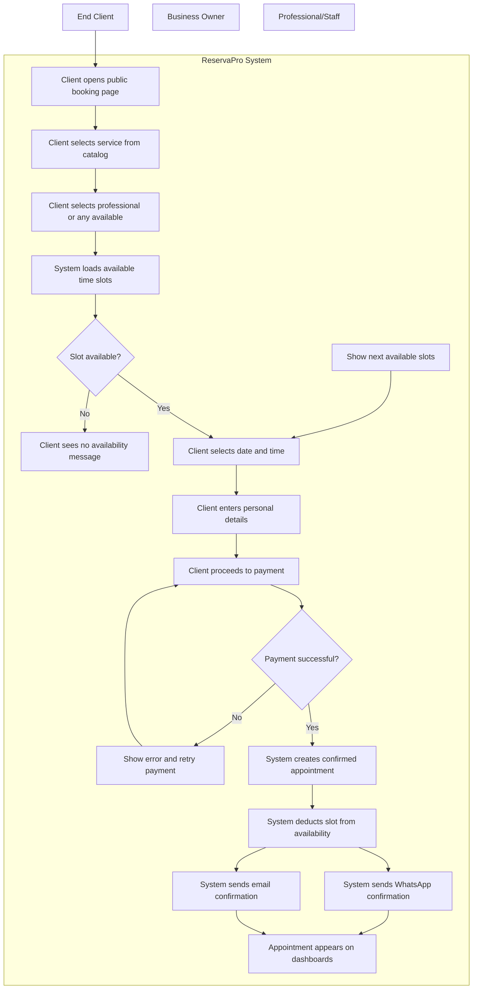
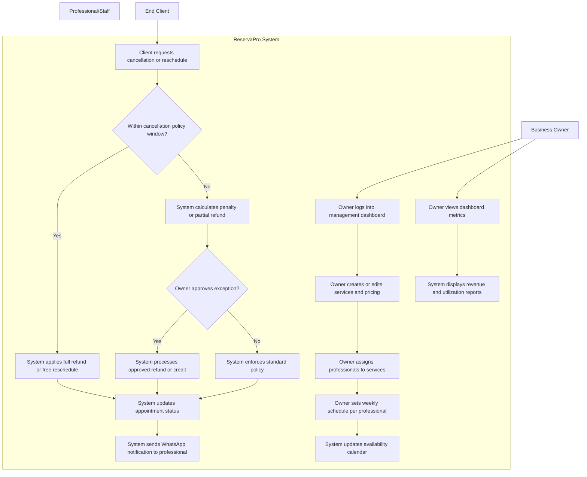
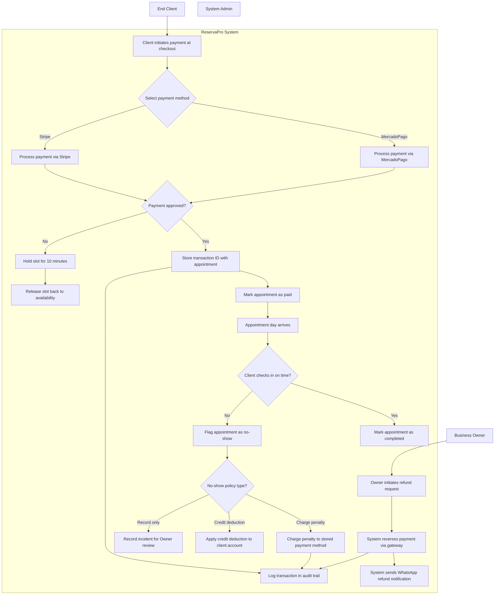
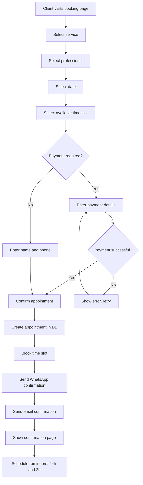
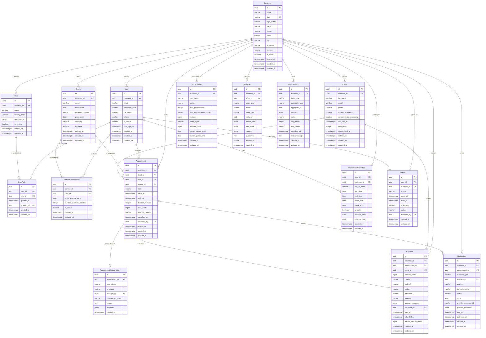
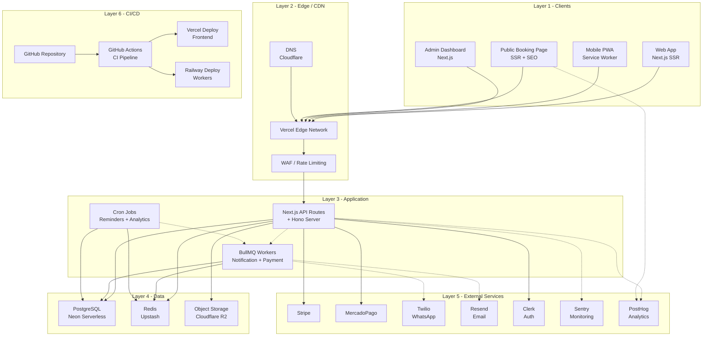

# ReservaPro -- Product Design Document

> Version 1.0 | Generated May 31, 2026

## Table of Contents

- [1. Executive Summary](#1-executive-summary)
- [2. Problem Statement](#2-problem-statement)
- [3. Goals and Success Metrics](#3-goals-and-success-metrics)
- [4. Use Cases](#4-use-cases)
- [5. User Stories and Acceptance Criteria](#5-user-stories-and-acceptance-criteria)
- [6. Functional Requirements](#6-functional-requirements)
- [7. Non-Functional Requirements](#7-non-functional-requirements)
- [8. Information Architecture](#8-information-architecture)
- [9. Data Model](#9-data-model)
- [10. System Design](#10-system-design)
- [11. Release Plan](#11-release-plan)
- [12. Risks and Mitigations](#12-risks-and-mitigations)
- [13. Open Questions](#13-open-questions)
- [Summary](#summary)

---

## 1. Executive Summary

ReservaPro is a SaaS booking and management platform purpose-built for niche personal service businesses — starting with barbershops and salons in Colombia, with planned expansion across Latin America and Spain. The platform solves the critical operational gap faced by approximately 1.4 million service businesses in the region that still rely on WhatsApp messages, paper agendas, and manual cash tracking to manage appointments and client relationships. Existing global solutions (Mindbody at $129–699/mo, Fresha with marketplace competition) are either prohibitively expensive or structurally misaligned with LATAM business practices. ReservaPro combines native WhatsApp integration, local payment methods (MercadoPago, Nequi), LATAM-adapted pricing ($19–59/mo), and Spanish-first UX to deliver a platform that understands how these businesses actually operate. The timing is driven by accelerating digitalization mandates (electronic invoicing), WhatsApp Business API maturity, and a 2–3 year window before global incumbents deepen their localization.

---

## 2. Problem Statement

### Pain Points

| Problem | Impact | Frequency | Current Workaround |
|---------|--------|-----------|-------------------|
| Manual booking via WhatsApp/phone | High — time loss, double-bookings, missed appointments | Daily (universal) | Paper agenda + WhatsApp messages |
| No-shows without reduction mechanism | High — direct revenue loss ($15–40 per no-show) | 20–30% of appointments | Manual WhatsApp reminders (inconsistent) |
| No digital client history | Medium — cannot personalize service or track preferences | Every repeat visit | Memory or paper notes |
| Manual cash control (cash/transfers) | High — errors, fraud risk, zero visibility | Daily | Excel or notebook accounting |
| No 24/7 online booking presence | High — loss of potential clients outside business hours | Constant | None — business only reachable during open hours |
| Existing software too expensive or not in Spanish | High — adoption barrier for SMBs | Ongoing | Use free generic tools (Google Calendar) |
| No integration with local payment methods | Medium — friction for online collection | High | Bank transfer with manual confirmation |
| No electronic invoicing adapted to country | Medium — growing legal obligation | Increasing | External accountant or manual invoicing |

### User Personas

**Persona 1: Carlos — Business Owner**
- **Role**: Owner of "Barbería El Clásico" in Bogotá, 3 barbers, 3 years operating
- **Goals**: Reduce no-shows, know daily revenue without counting cash, grow client base
- **Frustrations**: Spends 45 min/day on WhatsApp scheduling; lost $800 last month to no-shows; tried Mindbody but couldn't justify $200/mo; current "system" is a notebook
- **Tech comfort**: Medium — uses WhatsApp daily, has a smartphone, basic Excel, but no technical background

**Persona 2: Andrés — Professional/Barber**
- **Role**: Senior barber at El Clásico, 5 years experience, builds his own client base
- **Goals**: See his schedule clearly, know which clients prefer what cut, get paid on time
- **Frustrations**: Clients message him directly to book (blurs work/personal); doesn't know tomorrow's schedule until Carlos tells him; tips sometimes lost in cash confusion
- **Tech comfort**: High for mobile — lives on his phone, uses Instagram for portfolio, quick to adopt useful apps

**Persona 3: Valentina — End Client**
- **Role**: 28-year-old marketing professional, visits barber every 3 weeks
- **Goals**: Book appointments easily at any hour, get reminded before appointments, pay online
- **Frustrations**: Has to call or WhatsApp during business hours to book; forgot her last appointment and was charged anyway; can't see availability before messaging
- **Tech comfort**: High — books everything online (Rappi, Uber, Netflix), expects seamless digital experiences

### Jobs-to-be-Done

1. **When I** need to manage my barbershop's daily schedule, **I want to** see all appointments and barber availability in one place, **so I can** avoid double-bookings and optimize my team's time.
2. **When I** receive a booking request at 11 PM, **I want to** accept it automatically through an online page, **so I can** capture clients even when the shop is closed.
3. **When I** have a 20% no-show rate, **I want to** send automatic WhatsApp reminders before each appointment, **so I can** reduce no-shows and protect my revenue.
4. **When I** want to know how my business performed this month, **I want to** see revenue, appointments, and top services in a simple dashboard, **so I can** make decisions without spreadsheets.
5. **When I** am a client looking for a haircut, **I want to** see available times and book in under 60 seconds from my phone, **so I can** schedule without calling or waiting for a WhatsApp reply.

---

## 3. Goals and Success Metrics

### Product Goals (SMART)

1. **Acquisition**: Onboard 50 active barbershops/salons in Colombia within 6 months of launch, measured by businesses with at least 10 completed appointments.
2. **Activation**: Achieve 70% activation rate (defined as: signup → configure services → receive first booking) within 48 hours of account creation, measured by onboarding funnel analytics.
3. **Retention**: Maintain monthly churn below 5% for paying customers after month 3, measured by subscription cancellation rate.
4. **Engagement**: Achieve 80% of active businesses processing at least 30 appointments/month through the platform by month 6, measured by appointment volume per business.
5. **Revenue**: Reach $5,000 MRR within 12 months of launch through paid plan conversions, measured by Stripe subscription data.

### Success Metrics

| Metric | Target | Measurement Method | Timeframe |
|--------|--------|-------------------|-----------|
| Active businesses (10+ appointments/mo) | 50 | Platform analytics | 6 months post-launch |
| Activation rate (signup → first booking) | 70% | Onboarding funnel (PostHog) | Ongoing |
| Monthly churn (paid plans) | <5% | Stripe subscription data | After month 3 |
| No-show reduction for users | 40% reduction | Before/after comparison per business | 3 months per business |
| Time-to-first-booking (new business) | <24 hours | Time from signup to first appointment created | Ongoing |
| Booking page conversion (visitor → booking) | >35% | Public page analytics | Ongoing |
| WhatsApp reminder delivery rate | >95% | Twilio/Cloud API delivery reports | Ongoing |
| Net Promoter Score (NPS) | >50 | Quarterly survey | Quarterly |

### North Star Metric

**Weekly Active Appointments**: The total number of appointments completed through ReservaPro each week across all businesses. This metric captures platform adoption, business engagement, and end-client usage in a single number. Target: 500 weekly active appointments by month 6.

---

## 4. Use Cases

### 4.1 End-to-End Client Booking Flow

**Description** -- This use case represents the primary happy path of ReservaPro. The End Client initiates the flow by accessing the barbershop's public booking page, typically shared via a link or QR code. The client browses available services, selects a preferred professional (or chooses "any available"), views real-time availability slots filtered by the professional's schedule and existing appointments, picks a date and time, and proceeds to online payment via MercadoPago or Stripe. Upon successful payment, the system creates a confirmed appointment, deducts the slot from the professional's availability, and sends a confirmation message to the client via WhatsApp and email. The appointment appears on the Business Owner's and Professional's dashboards. All timestamps are normalized to America/Bogota timezone. The booking page is mobile-first and must load within 3 seconds on 4G connections common in Colombia.

### 4.2 Business Owner Manages Appointments and Staff

**Description** -- This use case covers the most complex multi-actor interaction in ReservaPro. The Business Owner logs into the management dashboard to configure the shop's operations: creating and pricing services, assigning professionals to specific services, setting each professional's weekly availability schedule with support for breaks and multiple shifts, and defining cancellation and rescheduling policies. When a client requests a cancellation or reschedule, the system evaluates the request against the configured policy (time before appointment, penalty rules), and the Owner decides whether to approve, apply a partial refund, or credit the client's account. The Owner also monitors real-time dashboard metrics including daily revenue, appointment fill rate, professional utilization, and upcoming appointments. Professionals receive schedule updates via WhatsApp notifications. This flow involves decision points around policy enforcement, multi-step configuration that affects downstream booking availability, and coordination between Owner actions and what clients see on the public booking page.

### 4.3 Payment Processing and No-Show Management

**Description** -- This use case is critical for revenue integrity and data consistency. When a client books an appointment, the system processes an online deposit or full payment through MercadoPago (primary for Colombia) or Stripe (for international cardholders). The payment gateway returns a transaction ID that the system stores alongside the appointment record. If payment fails, the slot is released back to availability after a 10-minute hold. On the day of the appointment, the system monitors check-in status: if the client does not arrive within a configurable grace period (default 15 minutes), the system flags the appointment as a no-show. The no-show triggers the configured policy, which may charge a penalty to the stored payment method, apply a credit deduction to the client's account, or simply record the incident for the Owner's review. Refund requests initiated by the Owner or triggered by professional cancellation follow a reversal flow that updates the payment gateway and notifies the client via WhatsApp. All financial transactions are logged with audit trails for compliance and reconciliation purposes.

---

## 5. User Stories and Acceptance Criteria

### Epic 1: Authentication & Authorization

**Priority: Must**

**Story 1.1**: As a business owner, I want to sign up with my email and create my business profile, so I can start using the platform immediately.

- **Given** a user visits the signup page
- **When** they enter a valid email, password, and business name
- **Then** an account is created with "owner" role, a default business is created, and they are redirected to the onboarding flow

**Story 1.2**: As a business owner, I want to invite my barbers/stylists with specific roles, so they can access only what they need.

- **Given** an owner is on the team management page
- **When** they invite a user with the "professional" role via email
- **Then** the invited user receives an email invitation, and upon acceptance can only view their own schedule and client notes (not revenue or settings)

**Story 1.3**: As a professional, I want to log in and see only my appointments and profile, so I am not overwhelmed by business-level data.

- **Given** a user with "professional" role logs in
- **When** they access the dashboard
- **Then** they see only their own calendar, their client list, and their personal settings — not business revenue, other professionals' schedules, or admin settings

### Epic 2: Business Management

**Priority: Must**

**Story 2.1**: As a business owner, I want to configure my business hours and holidays, so the booking page reflects my actual availability.

- **Given** an owner is on the business settings page
- **When** they set opening/closing hours per day of week and add holiday dates
- **Then** the booking page only shows available slots within those hours, and holidays show zero availability

**Story 2.2**: As a business owner, I want to add and manage my team of professionals, so clients can book with specific people.

- **Given** an owner has a business with multiple barbers
- **When** they add a professional with name, photo, services offered, and individual schedule
- **Then** the booking page shows each professional as a selectable option with their specific availability

**Story 2.3**: As a business owner, I want to set up multiple service locations (future), so I can manage branches from one account.

- **Given** an owner on the Business plan with multiple locations
- **When** they create a second location with its own hours and team
- **Then** each location has independent availability and the owner can switch between locations in the dashboard

### Epic 3: Service Management

**Priority: Must**

**Story 3.1**: As a business owner, I want to create services with name, duration, and price, so clients know what is offered and how long it takes.

- **Given** an owner is on the services page
- **When** they create a service "Corte clásico" with 30 min duration and $25,000 COP price
- **Then** the service appears on the booking page and the availability engine accounts for the 30-minute block

**Story 3.2**: As a business owner, I want to assign services to specific professionals, so clients can only book appropriate combinations.

- **Given** a service "Coloración" exists and only one professional is trained for it
- **When** the owner assigns that service exclusively to that professional
- **Then** the booking page only shows that professional as available when "Coloración" is selected

**Story 3.3**: As a business owner, I want to organize services into categories, so the booking page is clear and easy to navigate.

- **Given** an owner has 8+ services
- **When** they group them into categories (Cortes, Barba, Tratamientos)
- **Then** the booking page displays services organized by category with visual separation

### Epic 4: Calendar & Availability Engine

**Priority: Must**

**Story 4.1**: As a business owner, I want to see a calendar view of all appointments across all professionals, so I can understand the day at a glance.

- **Given** a business has 3 professionals and 15 appointments today
- **When** the owner opens the calendar view
- **Then** they see a day/week view with color-coded appointments per professional, including client name, service, and status

**Story 4.2**: As a system, I want to calculate available slots based on professional schedules, existing appointments, and buffer times, so double-bookings are impossible.

- **Given** a professional works 9 AM–6 PM with a 30-min service and 15-min buffer
- **When** a client requests available slots for tomorrow
- **Then** the system returns only non-overlapping slots that respect existing bookings, buffer times, and the professional's schedule — using database-level exclusion constraints to prevent race conditions

**Story 4.3**: As a business owner, I want to set buffer time between appointments and define slot intervals, so my team has transition time between clients.

- **Given** an owner sets a 15-minute buffer and 30-minute slot intervals
- **When** a 30-minute service is booked at 10:00 AM
- **Then** the next available slot is 10:45 AM (not 10:30 AM)

### Epic 5: Public Booking Page

**Priority: Must**

**Story 5.1**: As an end client, I want to visit a business's booking page and complete a reservation in under 60 seconds, so I can book without friction.

- **Given** a client visits `reservapro.com/barberia-el-clasico`
- **When** they select a service, professional, date, and time, then enter their name and phone
- **Then** the appointment is confirmed, a WhatsApp confirmation is sent, and the slot is removed from availability — all without page reload

**Story 5.2**: As an end client, I want to see real-time availability for my chosen service and professional, so I can pick a time that works.

- **Given** a client has selected "Corte clásico" with Andrés
- **When** they navigate to the date picker
- **Then** they see only dates with available slots, and selecting a date shows specific available times (no manual refresh needed)

**Story 5.3**: As a business owner, I want my booking page to be branded with my logo and colors, so it feels like part of my business.

- **Given** an owner on the Starter plan or above
- **When** they upload their logo and select brand colors in settings
- **Then** the public booking page reflects their branding (logo, primary color, business name)

**Story 5.4**: As an end client on mobile, I want the booking page to be fully responsive and fast, so I can book from my phone without issues.

- **Given** a client visits the booking page from a mobile browser
- **When** the page loads
- **Then** it renders correctly on screens 320px+, loads in under 2 seconds (LCP), and all interactions are touch-friendly (minimum 44px tap targets)

### Epic 6: Appointment Management

**Priority: Must**

**Story 6.1**: As a business owner, I want to create appointments manually for walk-in or phone clients, so all bookings are in one system.

- **Given** an owner is on the calendar view
- **When** they click "New appointment", select client (or create new), service, professional, and time
- **Then** the appointment is created, the slot is blocked, and a confirmation is sent to the client

**Story 6.2**: As a business owner, I want to reschedule an existing appointment, so I can accommodate client changes without losing the booking.

- **Given** an existing confirmed appointment
- **When** the owner drags it to a new time slot or uses the reschedule action
- **Then** the old slot is freed, the new slot is blocked, and the client receives a WhatsApp notification with the new time

**Story 6.3**: As an end client, I want to cancel or reschedule my appointment via a link, so I don't need to call the business.

- **Given** a client received a confirmation message with a management link
- **When** they click the link and choose "Reschedule" or "Cancel"
- **Then** the appointment is updated/cancelled, the slot is freed, and the business receives a notification

**Story 6.4**: As a system, I want to enforce cancellation policies (e.g., no cancellation within 2 hours), so businesses are protected from last-minute losses.

- **Given** a business has a 2-hour cancellation policy configured
- **When** a client tries to cancel 1 hour before the appointment
- **Then** the system blocks the cancellation and shows a message explaining the policy

### Epic 7: Online Payments

**Priority: Must**

**Story 7.1**: As an end client, I want to pay for my appointment online via MercadoPago or card, so I can secure my booking and avoid cash.

- **Given** a business has online payments enabled
- **When** a client reaches the payment step in the booking flow
- **Then** they see payment options (MercadoPago, credit/debit card via Stripe), can complete payment securely, and receive a payment confirmation

**Story 7.2**: As a business owner, I want to require a deposit or full prepayment for certain services, so I can reduce no-shows for high-value appointments.

- **Given** an owner configures a "Coloración" service to require 50% deposit
- **When** a client books that service
- **Then** the booking flow requires payment of the deposit before confirming the appointment

**Story 7.3**: As a business owner, I want to see payment status for each appointment, so I know what has been collected and what is pending.

- **Given** appointments with various payment states (paid, partial, pending, refunded)
- **When** the owner views the appointment list or calendar
- **Then** each appointment shows its payment status with a visual indicator, and the dashboard aggregates collected vs. pending amounts

### Epic 8: WhatsApp Reminders

**Priority: Must**

**Story 8.1**: As a system, I want to send automatic WhatsApp reminders 24 hours and 2 hours before each appointment, so clients remember and no-shows decrease.

- **Given** an appointment is confirmed for tomorrow at 3 PM
- **When** the 24-hour mark is reached
- **Then** a WhatsApp message is sent using a pre-approved template with appointment details (date, time, service, professional) and a cancel/reschedule link

**Story 8.2**: As a business owner, I want to customize reminder timing and message content (within template constraints), so reminders match my brand voice.

- **Given** an owner on the Starter plan or above
- **When** they configure reminder timing (e.g., 48h, 24h, 2h) and select from approved template variations
- **Then** the system sends reminders at the configured intervals using the selected templates

**Story 8.3**: As a system, I want to handle WhatsApp delivery failures gracefully, so clients still receive reminders even if WhatsApp fails.

- **Given** a WhatsApp reminder fails to deliver (invalid number, API error, rate limit)
- **When** the failure is detected
- **Then** the system falls back to email reminder and logs the failure for the business owner to review

### Epic 9: Email Reminders

**Priority: Must**

**Story 9.1**: As a system, I want to send a confirmation email immediately after booking, so the client has a written record.

- **Given** a new appointment is created (via booking page or manually)
- **When** the appointment status becomes "confirmed"
- **Then** an email is sent within 60 seconds containing: service, professional, date/time, location, and management link

**Story 9.2**: As a system, I want to send email reminders at 24h and 2h before appointments, so clients who don't use WhatsApp are still reminded.

- **Given** an appointment exists with a valid client email
- **When** the reminder schedule triggers
- **Then** an email is sent with appointment details and cancel/reschedule link

**Story 9.3**: As a business owner, I want to customize the email template with my branding, so communications feel professional and consistent.

- **Given** an owner has uploaded their logo and set brand colors
- **When** any email is sent to their clients
- **Then** the email includes their logo, brand colors, and business name in the header

### Epic 10: Dashboard & Reporting

**Priority: Must**

**Story 10.1**: As a business owner, I want to see today's appointments and key metrics when I log in, so I know what's happening without navigating.

- **Given** an owner logs into the platform
- **When** the dashboard loads
- **Then** they see: today's appointment count, expected revenue, no-shows this week, and a list of upcoming appointments for the next 2 hours

**Story 10.2**: As a business owner, I want to see weekly and monthly revenue summaries, so I can track financial performance.

- **Given** an owner navigates to the reports section
- **When** they select a date range (this week, this month, custom)
- **Then** they see total revenue, revenue by service, revenue by professional, and comparison to previous period

**Story 10.3**: As a business owner, I want to see which services and professionals are most popular, so I can make staffing and pricing decisions.

- **Given** an owner views the analytics dashboard
- **When** the data is loaded
- **Then** they see: top 5 services by bookings, top professionals by revenue, busiest hours of the day, and client retention rate (repeat vs. new)

---

## 6. Functional Requirements

### Authentication & Authorization

| ID | Requirement | Priority | Dependencies | Notes |
|----|-------------|----------|--------------|-------|
| AUTH-001 | Email/password registration with email verification | Must | None | Use Clerk or NextAuth for session management |
| AUTH-002 | Role-based access control: owner, admin, professional | Must | AUTH-001 | Owner has full access; admin excludes billing; professional sees own data only |
| AUTH-003 | Password reset via email | Must | AUTH-001 | Token-based, expires in 1 hour |
| AUTH-004 | Social login (Google) | Should | AUTH-001 | Reduces signup friction for non-technical users |
| AUTH-005 | Two-factor authentication for owner accounts | Could | AUTH-001 | SMS or authenticator app |

### Core Domain (Booking)

| ID | Requirement | Priority | Dependencies | Notes |
|----|-------------|----------|--------------|-------|
| BOOK-001 | Create, read, update, delete appointments | Must | AUTH-001, CAL-001 | Status machine: pending → confirmed → completed/cancelled/no-show |
| BOOK-002 | Public booking page with full reservation flow (SSR) | Must | SVC-001, CAL-001 | Server-side rendered for SEO; responsive mobile-first |
| BOOK-003 | Appointment status transitions with validation rules | Must | BOOK-001 | Cannot complete a cancelled appointment; cannot cancel a completed one |
| BOOK-004 | Cancellation policy enforcement (configurable hours) | Must | BOOK-001 | Default: 2 hours before; configurable per business |
| BOOK-005 | Client profile auto-creation on first booking | Must | BOOK-001 | Phone number as unique identifier; merge duplicates |
| BOOK-006 | Recurring appointments (weekly, biweekly) | Should | BOOK-001, CAL-001 | Common for barbershop clients who visit every 2–3 weeks |

### Calendar & Availability

| ID | Requirement | Priority | Dependencies | Notes |
|----|-------------|----------|--------------|-------|
| CAL-001 | Availability engine: calculate free slots from schedules + existing bookings + buffers | Must | BIZ-001, SVC-001 | Use PostgreSQL exclusion constraints to prevent double-booking at DB level |
| CAL-002 | Business hours configuration (per day of week) | Must | BIZ-001 | Support split shifts (e.g., 9–12, 14–18) |
| CAL-003 | Holiday and special day management | Must | CAL-002 | Block entire days or custom hours |
| CAL-004 | Per-professional schedule override | Must | CAL-002 | Each professional can have different hours than business default |
| CAL-005 | Buffer time between appointments (configurable) | Must | CAL-001 | Default 15 min; configurable 0–60 min |
| CAL-006 | Calendar views: day, week, month | Should | CAL-001 | Day view default for mobile; week view for desktop |
| CAL-007 | Google Calendar bidirectional sync | Could | CAL-001 | Post-MVP; OAuth2 with Google Calendar API |

### Business & Service Configuration

| ID | Requirement | Priority | Dependencies | Notes |
|----|-------------|----------|--------------|-------|
| BIZ-001 | Business CRUD: name, address, phone, timezone, logo, colors | Must | AUTH-001 | Timezone set at creation, immutable after first appointment |
| BIZ-002 | Professional/staff CRUD: name, photo, services, schedule | Must | BIZ-001 | Soft delete (preserve historical appointments) |
| SVC-001 | Service CRUD: name, description, duration, price, category | Must | BIZ-001 | Duration in 5-min increments; price in local currency |
| SVC-002 | Service-to-professional assignment (many-to-many) | Must | SVC-001, BIZ-002 | Controls which professionals appear for each service |
| SVC-003 | Service categories for booking page organization | Should | SVC-001 | Drag-and-drop ordering |

### Payments

| ID | Requirement | Priority | Dependencies | Notes |
|----|-------------|----------|--------------|-------|
| PAY-001 | Stripe integration for card payments | Must | BOOK-001 | Tokenized; PCI DSS SAQ A compliance via Stripe Elements |
| PAY-002 | MercadoPago integration for LATAM payments | Must | BOOK-001 | PSE, Nequi, Daviplata, cash payment points |
| PAY-003 | Adapter pattern abstracting payment providers | Must | PAY-001, PAY-002 | Allows adding new providers without changing business logic |
| PAY-004 | Configurable deposit percentage per service (0%, 50%, 100%) | Must | PAY-001, SVC-001 | Full prepayment or partial deposit |
| PAY-005 | Payment webhook handling with idempotency | Must | PAY-001, PAY-002 | Retry logic; handle duplicate events; update appointment status |
| PAY-006 | Refund processing (full and partial) | Should | PAY-001, PAY-002 | Owner-initiated from appointment detail |
| PAY-007 | Payment reconciliation dashboard | Should | PAY-005 | Daily/weekly collected vs. pending amounts |

### Notifications

| ID | Requirement | Priority | Dependencies | Notes |
|----|-------------|----------|--------------|-------|
| NOTIF-001 | WhatsApp reminders via Twilio or Cloud API (24h, 2h before) | Must | BOOK-001 | Pre-approved templates; ~$0.008/message; queue with BullMQ |
| NOTIF-002 | Email confirmation on booking creation | Must | BOOK-001 | Via Resend; send within 60 seconds of confirmation |
| NOTIF-003 | Email reminders at 24h and 2h before appointment | Must | BOOK-001 | Fallback channel when WhatsApp fails |
| NOTIF-004 | WhatsApp delivery failure → email fallback | Must | NOTIF-001, NOTIF-003 | Automatic; logged for owner review |
| NOTIF-005 | Configurable reminder timing per business | Should | NOTIF-001 | Owner chooses intervals: 48h, 24h, 2h, 1h |
| NOTIF-006 | Client-facing cancel/reschedule link in all messages | Must | BOOK-003, NOTIF-001 | Unique token per appointment; expires at appointment time |
| NOTIF-007 | Business owner notification on new booking/cancellation | Should | BOOK-001 | WhatsApp or email; configurable per owner |

### Dashboard & Reporting

| ID | Requirement | Priority | Dependencies | Notes |
|----|-------------|----------|--------------|-------|
| DASH-001 | Today's overview: appointments, expected revenue, upcoming | Must | BOOK-001 | Real-time; auto-refresh every 5 minutes |
| DASH-002 | Revenue reports: daily, weekly, monthly, custom range | Must | PAY-005, BOOK-001 | Filter by service, professional, date range |
| DASH-003 | Service popularity ranking (by bookings and revenue) | Should | BOOK-001, SVC-001 | Top 5 services with trend indicators |
| DASH-004 | Professional performance metrics | Should | BOOK-001, BIZ-002 | Revenue per professional, utilization rate, client ratings |
| DASH-005 | No-show rate tracking and trends | Must | BOOK-001 | Weekly trend; compare before/after WhatsApp reminders |
| DASH-006 | Client retention metrics (new vs. returning) | Could | BOOK-005 | Cohort analysis; repeat visit rate |

### Admin & Configuration

| ID | Requirement | Priority | Dependencies | Notes |
|----|-------------|----------|--------------|-------|
| ADMIN-001 | Subscription plan management (upgrade/downgrade/cancel) | Must | AUTH-001 | Via Stripe Customer Portal |
| ADMIN-002 | Plan feature gating enforcement | Must | ADMIN-001 | Check plan limits on every feature access |
| ADMIN-003 | Business settings: timezone, currency, cancellation policy | Must | BIZ-001 | Timezone immutable after first appointment |
| ADMIN-004 | Audit log for critical actions (deletes, role changes) | Should | AUTH-001 | Immutable append-only log |
| ADMIN-005 | System admin panel for support and moderation | Should | AUTH-001 | Internal tool; view businesses, impersonate for support |

---

## 7. Non-Functional Requirements

| Category | Requirement | Target |
|----------|-------------|--------|
| **Performance** | Booking page initial load (LCP) | <2 seconds on 4G mobile connection |
| **Performance** | Availability slot calculation response time | <500ms for any date query |
| **Performance** | Dashboard data load time | <1.5 seconds for all widgets |
| **Performance** | API response time (p95) | <300ms for standard CRUD operations |
| **Scalability** | Concurrent users supported | 1,000 simultaneous users without degradation |
| **Scalability** | Appointments per business per month | Support up to 5,000 appointments per business |
| **Scalability** | Database growth | Handle 10M appointment records with <100ms query times |
| **Security** | Data encryption at rest | AES-256 via managed database provider |
| **Security** | Data encryption in transit | TLS 1.3 for all connections |
| **Security** | Authentication | JWT with 15-min access tokens + refresh token rotation |
| **Security** | PCI DSS compliance | SAQ A level (no card data touches our servers) |
| **Security** | Rate limiting | 100 requests/minute per IP for public endpoints; 1,000 for authenticated |
| **Security** | Input validation and sanitization | All inputs validated server-side; SQL injection prevention via parameterized queries |
| **Availability** | Uptime SLA | 99.5% monthly uptime (<3.6 hours downtime/month) |
| **Availability** | Backup frequency | Daily automated backups with 30-day retention |
| **Availability** | Disaster recovery | RPO <1 hour, RTO <4 hours |
| **Data Privacy** | Colombian data protection (Ley 1581/2012) compliance | Privacy policy, consent checkbox, data deletion mechanism |
| **Data Privacy** | Data residency | Client data stored in region closest to business (South America or US-East) |
| **Data Privacy** | Right to deletion | Automated data purge on request within 30 days |
| **Data Privacy** | Consent management | Explicit opt-in for WhatsApp communications; unsubscribe in every message |
| **Accessibility** | WCAG 2.1 Level AA compliance | For all authenticated interfaces |
| **Accessibility** | Mobile usability | All booking flows usable on 320px width screens |
| **Accessibility** | Color contrast | Minimum 4.5:1 ratio for all text elements |

---

## 8. Information Architecture

### Navigation Structure

- **Public (unauthenticated)**
  - Landing page (reservapro.com)
  - Pricing page
  - Business booking page (`/book/{business-slug}`)
  - Login / Signup
- **Authenticated — Business Owner/Admin**
  - Dashboard (home)
  - Calendar
    - Day view
    - Week view
  - Appointments
    - List view (filterable)
    - Detail view
  - Clients
    - Client list
    - Client profile (history, notes)
  - Services
    - Service list
    - Service editor
  - Team
    - Professionals list
    - Professional profile/schedule
  - Booking Page
    - Page preview
    - Share link
  - Reports
    - Revenue
    - Appointments
    - Services
    - Professionals
  - Settings
    - Business profile
    - Hours & holidays
    - Notifications
    - Payments
    - Subscription & billing
    - Team invitations
- **Authenticated — Professional**
  - My Calendar
  - My Appointments
  - My Clients
  - My Profile

### Key Screens

| Screen | Description |
|--------|-------------|
| **Public Booking Page** | SSR page where end clients select service → professional → date/time → confirm. Mobile-first, <2s load. |
| **Dashboard** | Owner's home screen: today's appointments, revenue summary, quick actions, upcoming appointments list. |
| **Calendar View** | Visual day/week calendar with color-coding appointments per professional. Drag-and-drop rescheduling. |
| **Appointment Detail** | Full appointment info: client, service, professional, payment status, notes, action buttons (complete, cancel, reschedule). |
| **Service Editor** | Create/edit services: name, duration, price, category, assigned professionals, deposit requirement. |
| **Team Management** | List of professionals with their schedules, services, and performance metrics. Invite new members. |
| **Reports Dashboard** | Revenue charts, service popularity, professional performance, no-show trends. Date range selector. |
| **Business Settings** | Hours, holidays, cancellation policy, notification preferences, branding, payment configuration. |
| **Subscription Page** | Current plan details, usage metrics, upgrade/downgrade options via Stripe Customer Portal. |

### Primary Booking Workflow

---

## 9. Data Model

### 9.1 Entity Analysis

#### `Business`

The tenant entity representing a barbershop or salon that operates as an isolated workspace within the platform.

| Field | Type | Description |
|-------|------|-------------|
| id | uuid PK | Primary key |
| name | varchar(150) | Display name of the business |
| slug | varchar(100) UK | URL-friendly unique identifier for public booking pages |
| legal_name | varchar(200) | Legal entity name for invoicing |
| tax_id | varchar(20) | Colombian NIT or RUT tax identifier |
| phone | varchar(20) | Primary contact phone number |
| email | varchar(255) | Primary contact email |
| address_line1 | varchar(255) | Street address |
| city | varchar(80) | City (e.g. Bogotá, Medellín, Cali) |
| department | varchar(80) | Colombian department/state |
| timezone | varchar(50) | IANA timezone, default `America/Bogota` |
| currency | varchar(3) | ISO 4217 currency code, default `COP` |
| logo_url | text | URL to business logo asset |
| settings | jsonb | Arbitrary business-level configuration (working hours defaults, branding) |
| is_active | boolean | Whether the business is operational on the platform |
| deleted_at | timestamptz | Soft-delete timestamp for audit trail |
| created_at | timestamptz | Record creation timestamp |
| updated_at | timestamptz | Last modification timestamp |

**Relationships:**
- A Business has many Users (staff members).
- A Business has many Services.
- A Business has many Clients.
- A Business has exactly one active Subscription at any time (historical subscriptions retained).
- A Business has many Appointments.
- A Business has many Roles.

**Design decisions:**
- `slug` is globally unique to enable public booking URLs like `reservapro.co/b/mi-barberia`.
- `deleted_at` enables soft-delete; all queries must filter on `deleted_at IS NULL` unless auditing.
- `timezone` stored per-business to handle Colombia's single timezone (`America/Bogota`) while allowing future LATAM expansion.
- `settings` as jsonb avoids schema migrations for per-business configuration knobs.

---

#### `User`

Internal staff members (owners, admins, professionals) who authenticate and operate within a business.

| Field | Type | Description |
|-------|------|-------------|
| id | uuid PK | Primary key |
| business_id | uuid FK | The business this user belongs to |
| email | varchar(255) | Login email |
| password_hash | varchar(255) | Bcrypt/argon2 hashed password |
| full_name | varchar(200) | Display name |
| phone | varchar(20) | Contact phone (also used for WhatsApp notifications) |
| avatar_url | text | Profile photo URL |
| is_active | boolean | Whether the user can log in |
| last_login_at | timestamptz | Last successful authentication timestamp |
| deleted_at | timestamptz | Soft-delete timestamp |
| created_at | timestamptz | Record creation timestamp |
| updated_at | timestamptz | Last modification timestamp |

**Relationships:**
- A User belongs to exactly one Business.
- A User has many UserRoles (role assignments).
- A User (as professional) has many ServiceProfessional assignments.
- A User (as professional) has many ProfessionalSchedules.
- A User (as professional) has many TimeOffs.
- A User (as professional) has many Appointments.

**Design decisions:**
- `email` uniqueness is scoped to `business_id` (composite unique: `business_id, email`) — the same person could theoretically work at two shops with different accounts.
- Users are always scoped to a business. System Admins are modeled as users of a special "platform" business or via a separate `is_platform_admin` flag if needed at scale.
- `password_hash` never stores plaintext; rotated on password reset.

---

#### `Role`

A named permission set within a business, enabling RBAC for staff members.

| Field | Type | Description |
|-------|------|-------------|
| id | uuid PK | Primary key |
| business_id | uuid FK | The business this role belongs to |
| name | varchar(50) | Role identifier: `owner`, `admin`, `professional` |
| display_name | varchar(100) | Human-readable label |
| permissions | jsonb | Array of permission strings (e.g. `["appointments:write", "reports:read"]`) |
| is_system | boolean | Whether this is a built-in role that cannot be deleted |
| created_at | timestamptz | Record creation timestamp |
| updated_at | timestamptz | Last modification timestamp |

**Relationships:**
- A Role belongs to exactly one Business.
- A Role has many UserRoles.

**Design decisions:**
- System roles (`owner`, `admin`, `professional`) are seeded on business creation with `is_system = true` and cannot be deleted or renamed.
- `permissions` as jsonb array allows flexible permission checks without a separate permission table, keeping the model simple for the current scale.
- Composite unique constraint on `(business_id, name)` prevents duplicate role names within a business.

---

#### `UserRole`

Junction entity assigning a role to a user within a specific business context.

| Field | Type | Description |
|-------|------|-------------|
| id | uuid PK | Primary key |
| user_id | uuid FK | The user receiving the role |
| role_id | uuid FK | The role being assigned |
| granted_at | timestamptz | When the role was assigned |
| granted_by | uuid FK | User ID of whoever granted the role |
| created_at | timestamptz | Record creation timestamp |
| updated_at | timestamptz | Last modification timestamp |

**Relationships:**
- A UserRole belongs to exactly one User.
- A UserRole belongs to exactly one Role.
- A User can have many UserRoles (multiple roles).
- A Role can be assigned to many Users via UserRoles.

**Design decisions:**
- Composite unique constraint on `(user_id, role_id)` prevents duplicate assignments.
- `granted_by` tracks who performed the assignment for audit purposes.
- A user can hold multiple roles simultaneously (e.g. `admin` + `professional`).

---

#### `Service`

A bookable service offered by a business (e.g. haircut, beard trim, coloring).

| Field | Type | Description |
|-------|------|-------------|
| id | uuid PK | Primary key |
| business_id | uuid FK | The business offering this service |
| name | varchar(150) | Service name (e.g. "Corte Clásico") |
| description | text | Detailed description shown to clients |
| duration_minutes | integer | Expected duration in minutes |
| price_cents | bigint | Price in centavos/centavos-equivalent (COP stored as integer cents to avoid float issues) |
| currency | varchar(3) | ISO 4217, inherited from business but overridable |
| category | varchar(80) | Grouping label (e.g. "Cabello", "Barba", "Uñas") |
| is_active | boolean | Whether the service is bookable |
| sort_order | integer | Display ordering within category |
| deleted_at | timestamptz | Soft-delete timestamp |
| created_at | timestamptz | Record creation timestamp |
| updated_at | timestamptz | Last modification timestamp |

**Relationships:**
- A Service belongs to exactly one Business.
- A Service has many ServiceProfessional assignments (which professionals can perform it).
- A Service is referenced by many Appointments.

**Design decisions:**
- `price_cents` uses integer arithmetic (price in centavos) to avoid floating-point rounding errors in financial calculations. For COP where the smallest unit is $1, this stores the exact peso amount.
- `duration_minutes` is the canonical duration; actual appointment duration may differ if the service is combined with others.
- Soft-delete preserves historical appointment references.

---

#### `ServiceProfessional`

Junction entity linking services to the professionals qualified to perform them.

| Field | Type | Description |
|-------|------|-------------|
| id | uuid PK | Primary key |
| service_id | uuid FK | The service being offered |
| user_id | uuid FK | The professional who can perform it |
| price_override_cents | bigint | Optional per-professional price override (null = use service default) |
| duration_override_minutes | integer | Optional per-professional duration override (null = use service default) |
| is_active | boolean | Whether this professional currently offers this service |
| created_at | timestamptz | Record creation timestamp |
| updated_at | timestamptz | Last modification timestamp |

**Relationships:**
- A ServiceProfessional belongs to exactly one Service.
- A ServiceProfessional belongs to exactly one User (professional).
- A Service has many ServiceProfessionals (multiple professionals can offer it).
- A User has many ServiceProfessionals (a professional can offer multiple services).

**Design decisions:**
- Composite unique constraint on `(service_id, user_id)` prevents duplicate assignments.
- `price_override_cents` and `duration_override_minutes` allow senior professionals to charge more or take different time for the same service.
- This junction resolves the many-to-many relationship between services and professionals.

---

#### `Client`

End customers who book appointments at a business.

| Field | Type | Description |
|-------|------|-------------|
| id | uuid PK | Primary key |
| business_id | uuid FK | The business this client has visited |
| full_name | varchar(200) | Client's name |
| email | varchar(255) | Contact email |
| phone | varchar(20) | Phone number (primary channel for WhatsApp notifications) |
| gender | varchar(20) | Optional gender for personalization |
| date_of_birth | date | Optional birthday for loyalty campaigns |
| notes | text | Internal notes visible to staff |
| consent_marketing | boolean | GDPR/LATAM privacy: opted in to marketing communications |
| consent_data_processing | boolean | GDPR/LATAM privacy: consented to data processing |
| consent_given_at | timestamptz | Timestamp when consent was last updated |
| last_visit_at | timestamptz | Denormalized last appointment completion time |
| total_visits | integer | Denormalized visit count for loyalty tiers |
| is_active | boolean | Whether the client profile is active |
| anonymized_at | timestamptz | When PII was anonymized per data retention policy |
| deleted_at | timestamptz | Soft-delete timestamp |
| created_at | timestamptz | Record creation timestamp |
| updated_at | timestamptz | Last modification timestamp |

**Relationships:**
- A Client belongs to exactly one Business.
- A Client has many Appointments.
- A Client has many Payments.

**Design decisions:**
- PII fields (`full_name`, `email`, `phone`) must be anonymized when `anonymized_at` is set, replacing values with `[REDACTED]` per Colombian data protection law (Ley 1581 de 2012).
- `consent_marketing` and `consent_data_processing` are separate boolean flags to comply with granular consent requirements.
- `last_visit_at` and `total_visits` are denormalized counters updated via triggers or application logic for performance on client list views.
- Composite unique on `(business_id, phone)` prevents duplicate client profiles per phone number within a business.

---

#### `Subscription`

The business's subscription plan, controlling feature access and billing.

| Field | Type | Description |
|-------|------|-------------|
| id | uuid PK | Primary key |
| business_id | uuid FK | The subscribed business |
| plan_name | varchar(50) | Plan identifier: `free`, `starter`, `professional`, `enterprise` |
| status | varchar(20) | Current status: `active`, `past_due`, `cancelled`, `trial` |
| max_professionals | integer | Maximum number of active professionals allowed |
| max_appointments_month | integer | Monthly appointment cap (-1 = unlimited) |
| features | jsonb | Feature flags enabled for this plan |
| billing_cycle | varchar(20) | `monthly` or `yearly` |
| amount_cents | bigint | Subscription price in cents |
| currency | varchar(3) | ISO 4217 currency code |
| current_period_start | date | Start of current billing period |
| current_period_end | date | End of current billing period |
| cancelled_at | timestamptz | When cancellation was requested |
| created_at | timestamptz | Record creation timestamp |
| updated_at | timestamptz | Last modification timestamp |

**Relationships:**
- A Subscription belongs to exactly one Business.
- A Business has many Subscriptions (historical), but only one with `status = 'active'` at any time.

**Design decisions:**
- Historical subscriptions are retained (append-like pattern) to track plan changes over time.
- `features` as jsonb allows plan feature gating without schema changes (e.g. `{"whatsapp_notifications": true, "multi_location": false}`).
- Partial unique index on `(business_id) WHERE status = 'active'` ensures only one active subscription per business at the database level.
- `max_professionals` and `max_appointments_month` are enforced at the application layer during creation flows.

---

#### `Appointment`

The core booking entity linking a client to a professional, service, and time slot.

| Field | Type | Description |
|-------|------|-------------|
| id | uuid PK | Primary key |
| business_id | uuid FK | The business where the appointment takes place |
| client_id | uuid FK | The client who booked |
| user_id | uuid FK | The professional performing the service |
| service_id | uuid FK | The service being performed |
| status | varchar(20) | Current status: `pending`, `confirmed`, `in_progress`, `completed`, `cancelled`, `no_show` |
| starts_at | timestamptz | Appointment start time (UTC) |
| ends_at | timestamptz | Appointment end time (UTC) |
| duration_minutes | integer | Actual booked duration (may differ from service default) |
| price_cents | bigint | Price charged for this appointment (snapshot at booking time) |
| notes | text | Client-facing notes or special requests |
| internal_notes | text | Staff-only notes not visible to client |
| cancellation_reason | text | Reason provided when status is `cancelled` |
| cancelled_at | timestamptz | When the cancellation occurred |
| cancelled_by | uuid FK | User or client who initiated cancellation |
| booking_channel | varchar(20) | How the appointment was created: `online`, `in_store`, `phone`, `whatsapp` |
| deleted_at | timestamptz | Soft-delete timestamp |
| created_at | timestamptz | Record creation timestamp |
| updated_at | timestamptz | Last modification timestamp |

**Relationships:**
- An Appointment belongs to exactly one Business.
- An Appointment belongs to exactly one Client.
- An Appointment belongs to exactly one User (professional).
- An Appointment belongs to exactly one Service.
- An Appointment has many AppointmentStatusHistory entries.
- An Appointment has zero or more Payments.
- An Appointment has many Notifications.

**Design decisions:**
- **Double-booking prevention**: An exclusion constraint using `EXCLUDE USING gist (user_id WITH =, tstzrange(starts_at, ends_at) WITH &&)` prevents overlapping appointments for the same professional at the database level.
- `price_cents` is a snapshot of the price at booking time, decoupled from later service price changes.
- `starts_at` and `ends_at` are stored in UTC; the business timezone is used for display only.
- `status` transitions are validated at the application layer and recorded in `AppointmentStatusHistory`.
- `booking_channel` tracks acquisition source for analytics.

---

#### `AppointmentStatusHistory`

Append-only log of every status transition for an appointment.

| Field | Type | Description |
|-------|------|-------------|
| id | uuid PK | Primary key |
| appointment_id | uuid FK | The appointment whose status changed |
| from_status | varchar(20) | Previous status (null for initial creation) |
| to_status | varchar(20) | New status |
| changed_by | uuid FK | User ID who triggered the change (null if system/client) |
| changed_by_type | varchar(20) | Actor type: `user`, `client`, `system` |
| reason | text | Optional reason for the transition |
| metadata | jsonb | Additional context (e.g. notification sent, payment collected) |
| created_at | timestamptz | When the transition occurred |

**Relationships:**
- An AppointmentStatusHistory belongs to exactly one Appointment.
- An Appointment has many AppointmentStatusHistory entries.

**Design decisions:**
- This table is **append-only** — no UPDATE or DELETE operations are permitted. Enforced via database triggers that reject modifications.
- `from_status` is nullable to represent the initial `created` event.
- `changed_by_type` distinguishes between staff, client self-service, and automated system transitions.
- `metadata` captures contextual data without schema changes (e.g. `{"notification_id": "...", "cancellation_fee": 5000}`).

---

#### `Payment`

Financial transaction records for appointments, following an append-only pattern.

| Field | Type | Description |
|-------|------|-------------|
| id | uuid PK | Primary key |
| business_id | uuid FK | The business receiving the payment |
| appointment_id | uuid FK | The appointment this payment relates to |
| client_id | uuid FK | The client who paid |
| amount_cents | bigint | Payment amount in cents |
| currency | varchar(3) | ISO 4217 currency code |
| method | varchar(30) | Payment method: `cash`, `card`, `transfer`, `nequi`, `daviplata`, `pse` |
| status | varchar(20) | Payment status: `pending`, `completed`, `failed`, `refunded` |
| reference | varchar(100) | External payment reference (gateway transaction ID) |
| gateway | varchar(50) | Payment gateway name (e.g. `wompi`, `payu`, `mercadopago`) |
| gateway_response | jsonb | Raw gateway response payload for reconciliation |
| collected_by | uuid FK | Staff user who collected the payment (for cash/in-store) |
| paid_at | timestamptz | When the payment was completed |
| refunded_at | timestamptz | When a refund was processed |
| refund_amount_cents | bigint | Partial or full refund amount |
| created_at | timestamptz | Record creation timestamp |
| updated_at | timestamptz | Last modification timestamp |

**Relationships:**
- A Payment belongs to exactly one Business.
- A Payment belongs to exactly one Appointment.
- A Payment belongs to exactly one Client.
- An Appointment has zero or more Payments (supports split payments).

**Design decisions:**
- **Append-only**: Payment records are never deleted. Refunds are modeled as status transitions (`completed` → `refunded`) with `refunded_at` and `refund_amount_cents` populated, not as separate records.
- `method` includes Colombian-specific payment methods (`nequi`, `daviplata`, `pse`) reflecting the local market.
- `gateway_response` as jsonb stores raw gateway payloads for audit and reconciliation without schema rigidity.
- Split payments are supported: multiple payment records can reference the same appointment.
- `collected_by` is nullable — online payments have no staff collector.

---

#### `Notification`

Records of messages sent to clients and staff via WhatsApp, email, or SMS.

| Field | Type | Description |
|-------|------|-------------|
| id | uuid PK | Primary key |
| business_id | uuid FK | The business context for this notification |
| appointment_id | uuid FK | Related appointment (nullable for non-appointment notifications) |
| recipient_type | varchar(20) | Who received it: `client`, `professional`, `owner` |
| recipient_id | uuid FK | The User or Client who received the notification |
| channel | varchar(20) | Delivery channel: `whatsapp`, `email`, `sms`, `push` |
| template_name | varchar(80) | Template identifier used (e.g. `appointment_confirmation`, `reminder_24h`) |
| status | varchar(20) | Delivery status: `queued`, `sent`, `delivered`, `failed`, `read` |
| subject | varchar(255) | Email subject or message preview |
| body | text | Rendered message body |
| provider_message_id | varchar(255) | External message ID from WhatsApp Business API / email provider |
| provider_response | jsonb | Raw provider response for debugging |
| sent_at | timestamptz | When the message was dispatched |
| delivered_at | timestamptz | When delivery was confirmed |
| failed_reason | text | Error message if delivery failed |
| created_at | timestamptz | Record creation timestamp |
| updated_at | timestamptz | Last modification timestamp |

**Relationships:**
- A Notification belongs to exactly one Business.
- A Notification optionally belongs to one Appointment.
- A Notification has one recipient (Client or User).

**Design decisions:**
- `appointment_id` is nullable to support non-appointment notifications (marketing campaigns, subscription alerts).
- `recipient_type` + `recipient_id` is a polymorphic reference — the application layer resolves to either Client or User.
- `provider_response` stores raw webhook payloads from WhatsApp Business API or email providers for debugging delivery issues.
- Status transitions follow the provider webhook lifecycle: `queued` → `sent` → `delivered` → `read` (or `failed`).

---

#### `ProfessionalSchedule`

Weekly recurring availability rules for a professional.

| Field | Type | Description |
|-------|------|-------------|
| id | uuid PK | Primary key |
| user_id | uuid FK | The professional |
| business_id | uuid FK | The business context |
| day_of_week | smallint | Day of week: 0 (Sunday) through 6 (Saturday) |
| start_time | time | Start of availability window |
| end_time | time | End of availability window |
| break_start | time | Optional break start (e.g. lunch) |
| break_end | time | Optional break end |
| is_active | boolean | Whether this schedule rule is currently in effect |
| effective_from | date | When this schedule becomes active |
| effective_until | date | When this schedule expiresates (null = indefinite) |
| created_at | timestamptz | Record creation timestamp |
| updated_at | timestamptz | Last modification timestamp |

**Relationships:**
- A ProfessionalSchedule belongs to exactly one User (professional).
- A ProfessionalSchedule belongs to exactly one Business.
- A User has many ProfessionalSchedules (one per day or multiple slots per day).

**Design decisions:**
- Multiple schedule entries per day support split shifts (e.g. morning + evening).
- `break_start`/`break_end` model lunch breaks without requiring separate records.
- `effective_from`/`effective_until` allow schedule versioning — when a professional changes their hours, old schedules expire and new ones take effect, preserving historical accuracy.
- Composite unique constraint on `(user_id, day_of_week, start_time, effective_from)` prevents duplicate entries.

---

#### `TimeOff`

Exceptions to a professional's regular schedule (vacations, sick days, personal time).

| Field | Type | Description |
|-------|------|-------------|
| id | uuid PK | Primary key |
| user_id | uuid FK | The professional taking time off |
| business_id | uuid FK | The business context |
| reason | varchar(200) | Reason category: `vacation`, `sick`, `personal`, `training`, `other` |
| starts_at | timestamptz | Start of the time-off period |
| ends_at | timestamptz | End of the time-off period |
| is_full_day | boolean | Whether this covers the entire working day |
| notes | text | Additional details |
| approved_by | uuid FK | User ID who approved (null if self-approved by owner) |
| status | varchar(20) | Approval status: `pending`, `approved`, `rejected` |
| created_at | timestamptz | Record creation timestamp |
| updated_at | timestamptz | Last modification timestamp |

**Relationships:**
- A TimeOff belongs to exactly one User (professional).
- A TimeOff belongs to exactly one Business.
- A User has many TimeOffs.

**Design decisions:**
- Exclusion constraint on `(user_id, tstzrange(starts_at, ends_at))` prevents overlapping time-off entries.
- `approved_by` workflow enables owners to approve/reject professional time-off requests.
- The scheduling engine checks TimeOff entries when computing available slots, excluding these periods from bookable times.

---

#### `AuditLog`

Append-only audit trail capturing all data mutations for compliance and debugging.

| Field | Type | Description |
|-------|------|-------------|
| id | uuid PK | Primary key |
| business_id | uuid FK | The business context (nullable for platform-level actions) |
| actor_id | uuid FK | The User who performed the action (nullable for system actions) |
| actor_type | varchar(20) | Actor classification: `user`, `system`, `api` |
| action | varchar(50) | CRUD action: `create`, `update`, `delete`, `login`, `export`, `anonymize` |
| entity_type | varchar(80) | The entity being modified (e.g. `Appointment`, `Client`, `Payment`) |
| entity_id | uuid | The ID of the affected entity |
| before_state | jsonb | Full entity state before the mutation (null for creates) |
| after_state | jsonb | Full entity state after the mutation (null for deletes) |
| changes | jsonb | Diff of changed fields only (computed from before/after) |
| ip_address | inet | Client IP address at time of action |
| user_agent | text | Client user agent string |
| request_id | varchar(50) | Correlation ID for request tracing |
| created_at | timestamptz | When the action occurred |

**Relationships:**
- An AuditLog optionally belongs to a Business.
- An AuditLog optionally belongs to a User (actor).

**Design decisions:**
- **Strictly append-only**: Database-level trigger rejects any UPDATE or DELETE on this table.
- `before_state` and `after_state` store complete entity snapshots as jsonb, enabling full state reconstruction at any point in time.
- `changes` is a computed diff for quick scanning without parsing full snapshots.
- `business_id` is nullable to capture platform-level actions (system admin operations, cron jobs).
- Partitioning by `created_at` (monthly) is recommended for query performance at scale.

---

#### `OutboxEvent`

Transactional outbox for reliable event publishing, ensuring at-least-once delivery of domain events.

| Field | Type | Description |
|-------|------|-------------|
| id | uuid PK | Primary key |
| business_id | uuid FK | The business context for the event |
| event_type | varchar(100) | Domain event name (e.g. `appointment.created`, `payment.completed`) |
| aggregate_type | varchar(80) | The entity type that produced the event |
| aggregate_id | uuid | The ID of the source entity |
| payload | jsonb | Event payload (denormalized event data) |
| status | varchar(20) | Processing status: `pending`, `published`, `failed` |
| retry_count | integer | Number of delivery attempts |
| max_retries | integer | Maximum retry attempts before dead-lettering |
| published_at | timestamptz | When the event was successfully published |
| error_message | text | Last error encountered during publishing |
| created_at | timestamptz | When the event was recorded |
| updated_at | timestamptz | Last processing attempt timestamp |

**Relationships:**
- An OutboxEvent belongs to exactly one Business.

**Design decisions:**
- Events are written to this table in the **same database transaction** as the domain operation, guaranteeing atomicity.
- A separate relay process polls for `status = 'pending'` events and publishes them to the message broker (e.g. RabbitMQ, SQS).
- `retry_count` with exponential backoff handles transient failures; events exceeding `max_retries` are dead-lettered for manual inspection.
- Index on `(status, created_at)` supports efficient polling by the relay process.
- Events older than 30 days can be archived to cold storage.

---

### 9.2 Entity Relationship Diagram

---

## 10. System Design

### 10.1 Architecture Overview

ReservaPro adopts a **modular monolith** architecture, the pragmatic choice for a solo-developer SaaS targeting 0-100 barbershops in year one. Rather than splitting into microservices — which would multiply operational overhead, deployment complexity, and inter-service communication costs — the application organizes its nine domain boundaries (Business & Staff Management, Service Catalog, Calendar & Availability, Booking Engine, Public Booking Page, Payments, Notifications, Dashboard & Analytics, and Authentication & Authorization) into well-defined modules within a single deployable unit. Each module owns its database tables, exposes a clean internal API, and communicates with other modules through typed function calls or an in-process event bus. This approach allows rapid iteration during MVP development while preserving the option to extract specific modules (e.g., Notifications or Payments) into standalone services once scale demands it. Multitenancy is implemented at the database level using a `business_id` foreign key on all tenant-scoped tables, enforced by middleware that injects the tenant context from the authenticated session.

The data architecture centers on **PostgreSQL via Neon** as the primary relational store, chosen for its ACID guarantees, JSONB flexibility for service metadata, and Neon's serverless-friendly connection pooling. **Upstash Redis** provides a lightweight caching layer for availability slot calculations and session data, while also powering **BullMQ** — the background job queue that handles asynchronous tasks like notification dispatch, payment webhook processing, and reminder scheduling. File storage (business logos, professional photos) uses an S3-compatible service such as Cloudflare R2 for cost efficiency. External integrations follow an **adapter pattern**: a `PaymentAdapter` interface abstracts Stripe and MercadoPago behind a unified API, allowing the Booking Engine to process payments without coupling to a specific provider. Similarly, notification delivery (WhatsApp via Twilio, Email via Resend) is encapsulated in a `NotificationService` that the Booking Engine calls through domain events. Authentication leverages **Clerk** for its excellent Next.js integration, pre-built UI components, and JWT-based sessions, with RBAC enforced through middleware that checks role permissions (Owner, Professional, Client, Admin) at the route level.

### 10.2 Tech Stack

| Layer | Technology | Justification | Alternative Considered |
|-------|-----------|---------------|----------------------|
| **Frontend** | Next.js 14 (App Router) | SSR for public booking page SEO, RSC for dashboard performance, unified full-stack framework reduces context switching | Remix, SvelteKit |
| **Backend / API** | Next.js API Routes + Hono | API Routes for simple endpoints, Hono for complex business logic with middleware chains and Zod validation | tRPC, Express |
| **Database** | PostgreSQL (Neon) | ACID transactions critical for bookings, Neon's branching for dev/staging, serverless connection pooling, generous free tier | Supabase, PlanetScale |
| **ORM** | Drizzle ORM | Type-safe queries, SQL-like syntax, excellent migration system, lightweight bundle size | Prisma, Kysely |
| **Authentication** | Clerk | Pre-built UI components, Next.js middleware integration, organization support maps to multitenancy, JWT sessions | NextAuth, Lucia |
| **Payments** | Stripe + MercadoPago (adapter) | Stripe for international cards, MercadoPago for Colombian local payments (PSE, Nequi, Bancolombia), adapter pattern for future providers | Wompi, PayU |
| **WhatsApp** | Twilio | Official WhatsApp Business API, reliable delivery, webhook support for message status tracking | Meta Cloud API directly, 360dialog |
| **Email** | Resend | Developer-friendly API, React Email component support, generous free tier (3000/mo), excellent deliverability | SendGrid, AWS SES |
| **Hosting (Frontend)** | Vercel | Zero-config Next.js deployment, edge functions, preview deployments per PR, automatic CDN | Cloudflare Pages, Netlify |
| **Hosting (Backend Workers)** | Railway | Simple Docker deployment for BullMQ workers, PostgreSQL integration, predictable pricing, easy scaling | Render, Fly.io |
| **Cache / Queue** | Upstash Redis | Serverless Redis with REST API fallback, BullMQ-compatible, pay-per-request pricing ideal for low traffic | Redis Cloud, Momento |
| **File Storage** | Cloudflare R2 | S3-compatible API, zero egress fees, generous free tier (10GB storage, 10M reads/mo) | AWS S3, Backblaze B2 |
| **Monitoring** | Sentry | Error tracking, performance monitoring, session replay, generous free tier, excellent Next.js SDK | LogRocket, Datadog |
| **Analytics** | PostHog | Product analytics, feature flags, session recording, self-hostable, generous free tier (1M events/mo) | Mixpanel, Amplitude |
| **CI/CD** | GitHub Actions | Native GitHub integration, Vercel auto-deploy on push, reusable workflows, free for public repos | CircleCI, GitLab CI |
| **Testing** | Vitest + Playwright | Vitest for unit/integration (fast, native ESM), Playwright for E2E booking flow tests | Jest, Cypress |

### 10.3 Module / Service Inventory

| Module/Service | Responsibility | Database/Storage | External Dependencies |
|---------------|----------------|------------------|----------------------|
| **Auth Module** | User registration, login, session management, RBAC enforcement (Owner/Professional/Client/Admin roles), API key management | `users`, `sessions`, `roles`, `permissions` tables | Clerk (identity provider, JWT issuance) |
| **Business & Staff Management** | CRUD operations for businesses (multitenant root), professional profiles, role assignments, business settings (timezone, currency, branding) | `businesses`, `professionals`, `business_settings` tables | Cloudflare R2 (profile photos, logos) |
| **Service Catalog** | Service definitions with name, description, duration, price, category; service-professional assignments; buffer time configuration | `services`, `service_categories`, `service_professionals` tables | None |
| **Calendar & Availability** | Working hours per professional, time-off management, holiday calendars, real-time slot calculation with buffer handling, timezone conversion | `working_hours`, `time_off`, `holidays` tables | Upstash Redis (slot cache, TTL 5min) |
| **Booking Engine** | Appointment lifecycle (pending → confirmed → in-progress → completed/cancelled), double-booking prevention via optimistic locking, status transitions, cancellation policies | `appointments`, `appointment_history` tables | BullMQ (reminder scheduling), Notification Service |
| **Public Booking Page** | SSR-rendered booking interface for end clients, business branding, service selection, professional selection, slot picker, confirmation flow | Reads from Service Catalog + Calendar modules | None (read-only aggregation) |
| **Payment Module** | Payment intent creation, charge processing, refund handling, webhook receivers, transaction ledger, adapter pattern for Stripe/MercadoPago | `payments`, `payment_intents`, `transactions` tables | Stripe API, MercadoPago API |
| **Notification Service** | Event-driven notification dispatch: booking confirmations, reminders (24h/1h before), cancellations, payment receipts; template management | `notification_templates`, `notification_log` tables | Twilio (WhatsApp), Resend (Email), BullMQ (delayed jobs) |
| **Dashboard & Analytics** | Business metrics (revenue, appointments, retention), professional performance, service popularity, exportable reports, real-time KPI widgets | Materialized views, `analytics_snapshots` table | PostHog (event tracking) |
| **Admin Module** | Platform-wide administration: business onboarding, subscription management, platform metrics, support tools, audit log viewer | `subscriptions`, `audit_logs` tables | Clerk (admin role verification) |
| **Background Workers** | Async job processing: reminder scheduling, notification delivery, payment webhook retry, analytics aggregation, stale cache cleanup | BullMQ job queues, `job_logs` table | Upstash Redis (BullMQ broker) |

### 10.4 High-level Architecture Diagram

### 10.5 Infrastructure Cost Estimate

| Phase | Users/Scale | Monthly Cost | Key Services |
|-------|-------------|--------------|--------------|
| **MVP** | 0-100 businesses, ~500 appts/day peak | $20-35 | Vercel Hobby ($0), Neon Free ($0), Upstash Free ($0), Railway Starter ($5), Clerk Free ($0 up to 10k MAU), Resend Free ($0), R2 Free ($0), Sentry Free ($0), PostHog Free ($0), Twilio WhatsApp (~$15-25 usage), MercadoPago/Stripe (transaction fees only) |
| **Growth** | 100-500 businesses, ~2500 appts/day | $80-150 | Vercel Pro ($20), Neon Launch ($19), Upstash Pay-as-you-go (~$10), Railway Pro ($20), Clerk Pro ($25), Resend Pro ($20), R2 ($5), Sentry Team ($26), Twilio (~$40-60), PostHog (free tier still sufficient) |
| **Scale** | 500+ businesses, ~10000 appts/day | $300-500 | Vercel Pro ($20), Neon Scale ($69), Upstash ($30), Railway Pro ($40), Clerk Business ($100), Resend Business ($50), R2 ($15), Sentry Business ($80), Twilio (~$100-150), PostHog ($0-50), Dedicated workers for BullMQ |

**Cost optimization strategies:**
- **MVP phase**: Leverage free tiers aggressively; Neon, Upstash, Clerk, Resend, R2, Sentry, and PostHog all offer generous free plans sufficient for initial traction
- **Growth phase**: Negotiate startup credits with Clerk and PostHog; use Neon's autoscaling to pay only for actual usage; batch WhatsApp notifications to reduce per-message costs
- **Scale phase**: Consider self-hosting PostHog; move to reserved capacity on Railway; implement read replicas on Neon for analytics queries; evaluate MercadoPago vs Stripe routing based on interchange fees per transaction type

---

## 11. Release Plan

### Phase Overview

| Phase | Scope | Timeline | Success Criteria |
|-------|-------|----------|-----------------|
| **Phase 0: Foundation** | Project setup, DB schema, auth, basic CRUD (business, services, professionals) | Weeks 1–4 | Authenticated user can create business, add services and professionals |
| **Phase 1: Core Booking** | Availability engine, appointment management, calendar views, cancellation policies | Weeks 5–10 | Owner can manage appointments; no double-bookings possible; calendar shows all bookings |
| **Phase 2: Public Booking** | Public booking page (SSR), client flow, booking confirmation | Weeks 11–14 | End client can complete full booking in <60 seconds; page loads in <2s on mobile |
| **Phase 3: Payments** | Stripe + MercadoPago integration, deposit configuration, payment status tracking | Weeks 15–18 | Client can pay online; webhook handling is idempotent; payment status visible in dashboard |
| **Phase 4: Notifications** | WhatsApp reminders (Twilio/Cloud API), email confirmations and reminders, fallback logic | Weeks 19–22 | Reminders sent at configured intervals; >95% delivery rate; email fallback works |
| **Phase 5: Dashboard & Polish** | Dashboard, basic reports, branding, UX polish, bug fixes | Weeks 23–26 | Dashboard shows key metrics; reports functional; 0 critical bugs |
| **Phase 6: Beta Launch** | Onboard 5–10 businesses, collect feedback, iterate | Weeks 27–30 | 5+ businesses actively using platform; NPS >40; critical feedback addressed |

### MVP Scope

**In Scope (MVP):**
- Single-location businesses
- Barbershops and salons (one vertical)
- Colombia only (one country)
- Email + password authentication
- Business, service, and professional management
- Availability engine with buffer times
- Public booking page (SSR, responsive)
- Appointment CRUD with status machine
- Stripe + MercadoPago one-time payments
- Deposit configuration per service
- WhatsApp reminders (pre-approved templates)
- Email confirmations and reminders
- Basic dashboard (today's view, simple revenue metrics)
- 3 roles: owner, admin, professional
- 4 subscription tiers with feature gating

**Out of Scope (Post-MVP):**
- Multi-location support
- Recurring appointments
- Waitlist functionality
- Client history and notes (detailed)
- Electronic invoicing
- Google Calendar sync
- Social login
- Mobile app (native or PWA)
- Loyalty programs
- Advanced reporting and analytics
- API access for third parties
- Instagram/Facebook integration
- Memberships and packages
- Marketing automation
- Multi-country support

### Post-MVP Roadmap

| Quarter | Focus | Key Features |
|---------|-------|--------------|
| **Q1 Post-Launch** | Retention & Expansion | Multi-location, recurring appointments, waitlist, client history/notes, Google Calendar sync |
| **Q2 Post-Launch** | Monetization & Growth | Electronic invoicing (via provider), Nequi/Daviplata direct integration, referral program, PWA for clients |
| **Q3 Post-Launch** | Scale & New Markets | Mexico launch, loyalty programs, advanced reports, Instagram booking integration, Zapier connector |
| **Q4 Post-Launch** | Platform | API access, marketplace (optional), memberships/packages, marketing automation, Spain launch |

---

## 12. Risks and Mitigations

| Risk | Severity | Likelihood | Mitigation | Owner |
|------|----------|------------|------------|-------|
| **Double-booking due to race conditions** | Critical | Low | PostgreSQL exclusion constraints (`EXCLUDE USING gist`) at database level; optimistic locking on appointment creation; integration tests for concurrent booking | Engineering |
| **WhatsApp Business API dependency** | High | Medium | Meta can change pricing, reject templates, or ban accounts. Mitigation: email as mandatory fallback channel; template pre-approval; monitor API health; maintain WhatsApp Business account in good standing | Product + Engineering |
| **MercadoPago API instability** | High | Medium | MercadoPago webhooks are unreliable. Mitigation: adapter pattern for provider abstraction; polling as backup for webhook failures; exponential backoff; Stripe as secondary provider | Engineering |
| **Fresha deepens LATAM localization** | High | Medium | 2–3 year window before global competitors adapt. Mitigation: move fast; build deep local relationships; WhatsApp-native positioning is hard to replicate; focus on underserved segments Fresha ignores | Product + Business |
| **Slow adoption by traditional businesses** | High | Medium | Target market has low tech adoption. Mitigation: ultra-simple onboarding (<15 min setup); WhatsApp-based onboarding support; free tier removes risk; assisted migration service | Product + Growth |
| **Timezone bugs causing incorrect availability** | High | Medium | All timestamps stored in UTC; convert to business timezone only at display layer; use `date-fns-tz` or equivalent; comprehensive timezone test suite | Engineering |
| **High CAC in fragmented market** | High | High | Reaching individual barbershops is expensive. Mitigation: SEO content strategy; referral program (discount for referring businesses); partnerships with product suppliers; WhatsApp community outreach | Growth |
| **Churn from small business closures** | Medium | High | Many small barbershops close within first year. Mitigation: target established businesses (>1 year operating); annual plan incentives for commitment; focus on businesses with 2+ professionals | Business |
| **PCI DSS compliance gap** | Critical | Low | Never handle raw card data. Mitigation: Stripe Elements and MercadoPago SDK handle all card input; PCI SAQ A compliance; no card data stored in our systems | Engineering |
| **Data privacy regulation non-compliance** | High | Low | Colombia's Ley 1581/2012 requires specific measures. Mitigation: privacy policy from day 1; consent checkboxes; data deletion mechanism; data stored in appropriate region; legal review before launch | Legal + Engineering |
| **Scaling beyond initial infrastructure** | Medium | Medium | Railway/Neon free tiers have limits. Mitigation: monitor resource usage; defined scaling triggers (CPU >70%, connections >80%); pre-negotiated upgrade path; load testing before launch | Engineering |
| **WhatsApp message costs eroding margins** | Medium | Medium | ~$0.008/message adds up at scale. Mitigation: WhatsApp Cloud API (free tier: 1K conversations/mo); optimize reminder frequency; batch messages where possible; pass costs to higher tiers | Product + Finance |

---

## 13. Open Questions

1. **WhatsApp provider selection**: Should we use Twilio (easier setup, better support, higher per-message cost) or Meta's WhatsApp Cloud API directly (lower cost, free tier, more setup complexity)? Decision needed before Phase 4.

2. **Electronic invoicing timing**: Should e-invoicing (via third-party provider like Alegra or Facturama) be included in MVP or deferred to post-MVP? Colombia's DIAN requirements are becoming stricter.

3. **Pricing validation**: Have the proposed price points ($19/35/59/mo) been validated with potential customers in Colombia? Need 10+ customer interviews before launch.

4. **Free tier limits**: Is 50 appointments/month the right cap for the free tier? Too high and conversion suffers; too low and businesses can't evaluate the product properly.

5. **Payment processing fee model**: Should we charge a platform fee on top of Stripe/MercadoPago processing fees (0.5–1%) or absorb it into the subscription price?

6. **Professional as separate user vs. profile**: Should professionals have full platform accounts (login, dashboard) or just be profiles managed by the owner? The current design assumes both, but this adds complexity.

7. **Multi-tenancy architecture**: Should we use row-level security (shared database, logical isolation) or schema-per-tenant (stronger isolation, higher operational cost)? Decision affects Phase 0.

8. **Booking page domain strategy**: Should each business get a subdomain (`elclasico.reservapro.com`) or a path (`reservapro.com/elclasico`)? Subdomains are better for branding but more complex for SSL and DNS.

9. **WhatsApp template approval timeline**: Meta's template approval can take 1–3 days. Should we pre-submit templates before Phase 4 starts, or risk delays?

10. **First 10 beta customers**: What is the specific acquisition strategy for the first 10 businesses? Direct outreach? WhatsApp communities? Referrals from existing contacts? Budget for incentives?

11. **Currency handling**: Should prices be stored in a base currency (USD) with display conversion, or stored natively in local currency (COP)? Exchange rate volatility in LATAM makes this non-trivial.

12. **Data migration path**: When a business switches from paper/WhatsApp, what migration assistance do we provide? Manual entry guide? Bulk import from Excel? Concierge setup service?

13. **Support model**: What level of support is included in each tier? Chat only? WhatsApp support? Phone? Response time SLAs? This affects operational costs.

14. **Team size for MVP**: Is the 1–2 developer assumption still valid? Given the 6-month timeline and feature scope, do we need a dedicated frontend developer or can one full-stack developer handle it?

15. **Competitive response monitoring**: How will we track Fresha and AgendaPro's moves in Colombia during our 6-month build phase? What triggers a pivot or acceleration decision?

---

## Summary

This Product Design Document assembles the complete specification for ReservaPro from four source artifacts: the Product Requirements Document, Use Cases analysis, Data Model specification, and System Design architecture. The document contains 13 sections covering the full product definition — from problem statement and user personas through 16 fully-specified database entities, a 6-layer architecture diagram, 10-epic user story backlog with acceptance criteria, and a 30-week phased release plan. Sections requiring human review before development begins include: Open Questions (15 unresolved decisions, particularly WhatsApp provider selection, pricing validation, and multi-tenancy architecture), the tech stack choices in System Design (Next.js 14 vs 15, Clerk vs NextAuth), and the MVP scope boundaries. Next steps: resolve open questions through stakeholder interviews and customer validation, then proceed to Phase 0 implementation.
