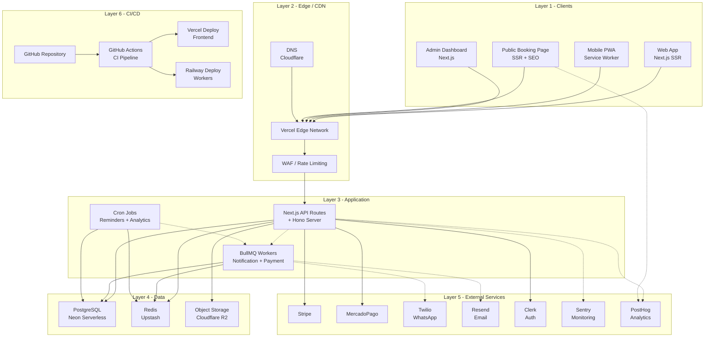

# System Design — ReservaPro

## 1. Architecture Overview

ReservaPro adopts a **modular monolith** architecture, the pragmatic choice for a solo-developer SaaS targeting 0-100 barbershops in year one. Rather than splitting into microservices — which would multiply operational overhead, deployment complexity, and inter-service communication costs — the application organizes its nine domain boundaries (Business & Staff Management, Service Catalog, Calendar & Availability, Booking Engine, Public Booking Page, Payments, Notifications, Dashboard & Analytics, and Authentication & Authorization) into well-defined modules within a single deployable unit. Each module owns its database tables, exposes a clean internal API, and communicates with other modules through typed function calls or an in-process event bus. This approach allows rapid iteration during MVP development while preserving the option to extract specific modules (e.g., Notifications or Payments) into standalone services once scale demands it. Multitenancy is implemented at the database level using a `business_id` foreign key on all tenant-scoped tables, enforced by middleware that injects the tenant context from the authenticated session.

The data architecture centers on **PostgreSQL via Neon** as the primary relational store, chosen for its ACID guarantees, JSONB flexibility for service metadata, and Neon's serverless-friendly connection pooling. **Upstash Redis** provides a lightweight caching layer for availability slot calculations and session data, while also powering **BullMQ** — the background job queue that handles asynchronous tasks like notification dispatch, payment webhook processing, and reminder scheduling. File storage (business logos, professional photos) uses an S3-compatible service such as Cloudflare R2 for cost efficiency. External integrations follow an **adapter pattern**: a `PaymentAdapter` interface abstracts Stripe and MercadoPago behind a unified API, allowing the Booking Engine to process payments without coupling to a specific provider. Similarly, notification delivery (WhatsApp via Twilio, Email via Resend) is encapsulated in a `NotificationService` that the Booking Engine calls through domain events. Authentication leverages **Clerk** for its excellent Next.js integration, pre-built UI components, and JWT-based sessions, with RBAC enforced through middleware that checks role permissions (Owner, Professional, Client, Admin) at the route level.

---

## 2. Tech Stack

| Layer | Technology | Justification | Alternative Considered |
|-------|-----------|---------------|----------------------|
| **Frontend** | Next.js 14 (App Router) | SSR for public booking page SEO, RSC for dashboard performance, unified full-stack framework reduces context switching | Remix, SvelteKit |
| **Backend / API** | Next.js API Routes + Hono | API Routes for simple endpoints, Hono for complex business logic with middleware chains and Zod validation | tRPC, Express |
| **Database** | PostgreSQL (Neon) | ACID transactions critical for bookings, Neon's branching for dev/staging, serverless connection pooling, generous free tier | Supabase, PlanetScale |
| **ORM** | Drizzle ORM | Type-safe queries, SQL-like syntax, excellent migration system, lightweight bundle size | Prisma, Kysely |
| **Authentication** | Clerk | Pre-built UI components, Next.js middleware integration, organization support maps to multitenancy, JWT sessions | NextAuth, Lucia |
| **Payments** | Stripe + MercadoPago (adapter) | Stripe for international cards, MercadoPago for Colombian local payments (PSE, Nequi, Bancolombia), adapter pattern for future providers | Wompi, PayU |
| **WhatsApp** | Twilio | Official WhatsApp Business API, reliable delivery, webhook support for message status tracking | Meta Cloud API directly, 360dialog |
| **Email** | Resend | Developer-friendly API, React Email component support, generous free tier (3000/mo), excellent deliverability | SendGrid, AWS SES |
| **Hosting (Frontend)** | Vercel | Zero-config Next.js deployment, edge functions, preview deployments per PR, automatic CDN | Cloudflare Pages, Netlify |
| **Hosting (Backend Workers)** | Railway | Simple Docker deployment for BullMQ workers, PostgreSQL integration, predictable pricing, easy scaling | Render, Fly.io |
| **Cache / Queue** | Upstash Redis | Serverless Redis with REST API fallback, BullMQ-compatible, pay-per-request pricing ideal for low traffic | Redis Cloud, Momento |
| **File Storage** | Cloudflare R2 | S3-compatible API, zero egress fees, generous free tier (10GB storage, 10M reads/mo) | AWS S3, Backblaze B2 |
| **Monitoring** | Sentry | Error tracking, performance monitoring, session replay, generous free tier, excellent Next.js SDK | LogRocket, Datadog |
| **Analytics** | PostHog | Product analytics, feature flags, session recording, self-hostable, generous free tier (1M events/mo) | Mixpanel, Amplitude |
| **CI/CD** | GitHub Actions | Native GitHub integration, Vercel auto-deploy on push, reusable workflows, free for public repos | CircleCI, GitLab CI |
| **Testing** | Vitest + Playwright | Vitest for unit/integration (fast, native ESM), Playwright for E2E booking flow tests | Jest, Cypress |

---

## 3. Module / Service Inventory

| Module/Service | Responsibility | Database/Storage | External Dependencies |
|---------------|----------------|------------------|----------------------|
| **Auth Module** | User registration, login, session management, RBAC enforcement (Owner/Professional/Client/Admin roles), API key management | `users`, `sessions`, `roles`, `permissions` tables | Clerk (identity provider, JWT issuance) |
| **Business & Staff Management** | CRUD operations for businesses (multitenant root), professional profiles, role assignments, business settings (timezone, currency, branding) | `businesses`, `professionals`, `business_settings` tables | Cloudflare R2 (profile photos, logos) |
| **Service Catalog** | Service definitions with name, description, duration, price, category; service-professional assignments; buffer time configuration | `services`, `service_categories`, `service_professionals` tables | None |
| **Calendar & Availability** | Working hours per professional, time-off management, holiday calendars, real-time slot calculation with buffer handling, timezone conversion | `working_hours`, `time_off`, `holidays` tables | Upstash Redis (slot cache, TTL 5min) |
| **Booking Engine** | Appointment lifecycle (pending → confirmed → in-progress → completed/cancelled), double-booking prevention via optimistic locking, status transitions, cancellation policies | `appointments`, `appointment_history` tables | BullMQ (reminder scheduling), Notification Service |
| **Public Booking Page** | SSR-rendered booking interface for end clients, business branding, service selection, professional selection, slot picker, confirmation flow | Reads from Service Catalog + Calendar modules | None (read-only aggregation) |
| **Payment Module** | Payment intent creation, charge processing, refund handling, webhook receivers, transaction ledger, adapter pattern for Stripe/MercadoPago | `payments`, `payment_intents`, `transactions` tables | Stripe API, MercadoPago API |
| **Notification Service** | Event-driven notification dispatch: booking confirmations, reminders (24h/1h before), cancellations, payment receipts; template management | `notification_templates`, `notification_log` tables | Twilio (WhatsApp), Resend (Email), BullMQ (delayed jobs) |
| **Dashboard & Analytics** | Business metrics (revenue, appointments, retention), professional performance, service popularity, exportable reports, real-time KPI widgets | Materialized views, `analytics_snapshots` table | PostHog (event tracking) |
| **Admin Module** | Platform-wide administration: business onboarding, subscription management, platform metrics, support tools, audit log viewer | `subscriptions`, `audit_logs` tables | Clerk (admin role verification) |
| **Background Workers** | Async job processing: reminder scheduling, notification delivery, payment webhook retry, analytics aggregation, stale cache cleanup | BullMQ job queues, `job_logs` table | Upstash Redis (BullMQ broker) |

---

## 4. High-level Architecture Diagram

---

## 5. Infrastructure Cost Estimate

| Phase | Users/Scale | Monthly Cost | Key Services |
|-------|-------------|--------------|--------------|
| **MVP** | 0-100 businesses, ~500 appts/day peak | $20-35 | Vercel Hobby ($0), Neon Free ($0), Upstash Free ($0), Railway Starter ($5), Clerk Free ($0 up to 10k MAU), Resend Free ($0), R2 Free ($0), Sentry Free ($0), PostHog Free ($0), Twilio WhatsApp (~$15-25 usage), MercadoPago/Stripe (transaction fees only) |
| **Growth** | 100-500 businesses, ~2500 appts/day | $80-150 | Vercel Pro ($20), Neon Launch ($19), Upstash Pay-as-you-go (~$10), Railway Pro ($20), Clerk Pro ($25), Resend Pro ($20), R2 ($5), Sentry Team ($26), Twilio (~$40-60), PostHog (free tier still sufficient) |
| **Scale** | 500+ businesses, ~10000 appts/day | $300-500 | Vercel Pro ($20), Neon Scale ($69), Upstash ($30), Railway Pro ($40), Clerk Business ($100), Resend Business ($50), R2 ($15), Sentry Business ($80), Twilio (~$100-150), PostHog ($0-50), Dedicated workers for BullMQ |

**Cost optimization strategies:**
- **MVP phase**: Leverage free tiers aggressively; Neon, Upstash, Clerk, Resend, R2, Sentry, and PostHog all offer generous free plans sufficient for initial traction
- **Growth phase**: Negotiate startup credits with Clerk and PostHog; use Neon's autoscaling to pay only for actual usage; batch WhatsApp notifications to reduce per-message costs
- **Scale phase**: Consider self-hosting PostHog; move to reserved capacity on Railway; implement read replicas on Neon for analytics queries; evaluate MercadoPago vs Stripe routing based on interchange fees per transaction type
