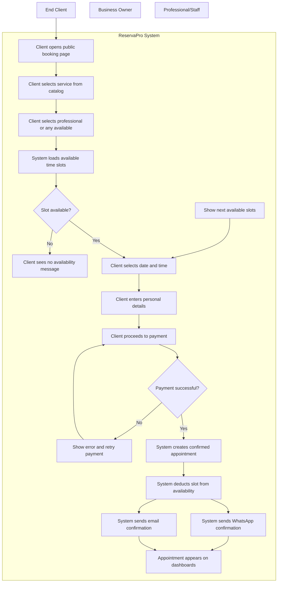
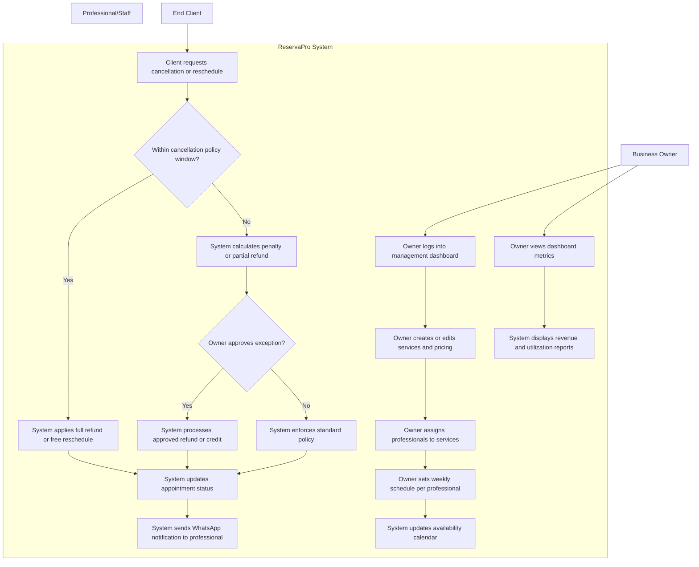
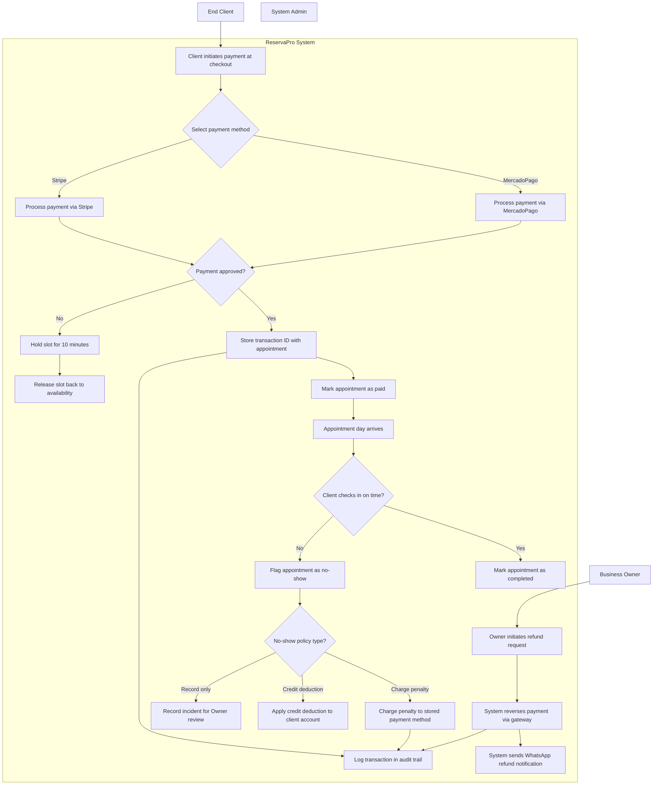

# ReservaPro - Use Cases

## 1. End-to-End Client Booking Flow

**Description** -- This use case represents the primary happy path of ReservaPro. The End Client initiates the flow by accessing the barbershop's public booking page, typically shared via a link or QR code. The client browses available services, selects a preferred professional (or chooses "any available"), views real-time availability slots filtered by the professional's schedule and existing appointments, picks a date and time, and proceeds to online payment via MercadoPago or Stripe. Upon successful payment, the system creates a confirmed appointment, deducts the slot from the professional's availability, and sends a confirmation message to the client via WhatsApp and email. The appointment appears on the Business Owner's and Professional's dashboards. All timestamps are normalized to America/Bogota timezone. The booking page is mobile-first and must load within 3 seconds on 4G connections common in Colombia.

## 2. Business Owner Manages Appointments and Staff

**Description** -- This use case covers the most complex multi-actor interaction in ReservaPro. The Business Owner logs into the management dashboard to configure the shop's operations: creating and pricing services, assigning professionals to specific services, setting each professional's weekly availability schedule with support for breaks and multiple shifts, and defining cancellation and rescheduling policies. When a client requests a cancellation or reschedule, the system evaluates the request against the configured policy (time before appointment, penalty rules), and the Owner decides whether to approve, apply a partial refund, or credit the client's account. The Owner also monitors real-time dashboard metrics including daily revenue, appointment fill rate, professional utilization, and upcoming appointments. Professionals receive schedule updates via WhatsApp notifications. This flow involves decision points around policy enforcement, multi-step configuration that affects downstream booking availability, and coordination between Owner actions and what clients see on the public booking page.

## 3. Payment Processing and No-Show Management

**Description** -- This use case is critical for revenue integrity and data consistency. When a client books an appointment, the system processes an online deposit or full payment through MercadoPago (primary for Colombia) or Stripe (for international cardholders). The payment gateway returns a transaction ID that the system stores alongside the appointment record. If payment fails, the slot is released back to availability after a 10-minute hold. On the day of the appointment, the system monitors check-in status: if the client does not arrive within a configurable grace period (default 15 minutes), the system flags the appointment as a no-show. The no-show triggers the configured policy, which may charge a penalty to the stored payment method, apply a credit deduction to the client's account, or simply record the incident for the Owner's review. Refund requests initiated by the Owner or triggered by professional cancellation follow a reversal flow that updates the payment gateway and notifies the client via WhatsApp. All financial transactions are logged with audit trails for compliance and reconciliation purposes.

