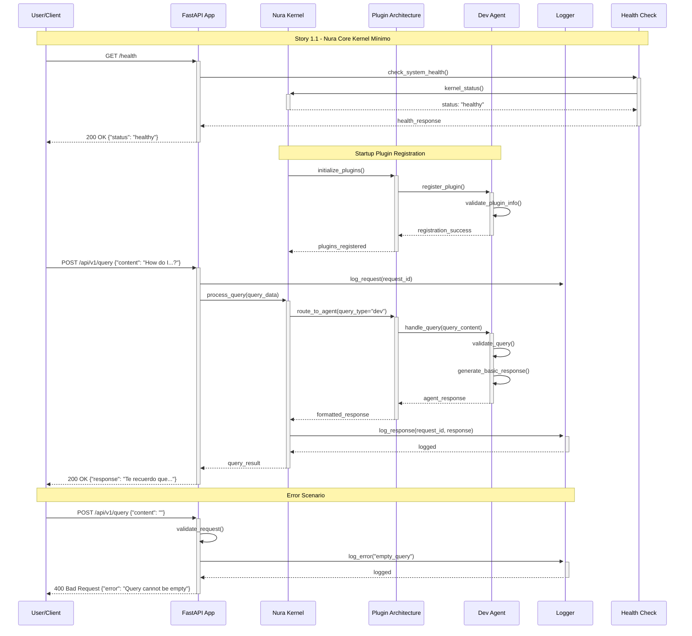

# Story 1.1: Nura Core Kernel Mínimo

## Status
Approved

## Story
**As a** desarrollador que necesita ayuda técnica,  
**I want** que existe un sistema core que pueda recibir mis preguntas,  
**so that** tenga un punto de entrada confiable para obtener información contextual

## Acceptance Criteria

1. Nura Core puede recibir queries de texto via API REST
2. Implementa plugin registration básico para single agent
3. Maneja routing simple: pregunta → Dev Agent → respuesta
4. Incluye logging básico para debugging y métricas iniciales
5. FastAPI server running en localhost con health check endpoint

## Tasks / Subtasks

### Core Infrastructure Setup
- [ ] **Task 1: FastAPI Application Bootstrap** (AC: 1, 5)
  - [ ] Crear `src/main.py` con FastAPI app initialization
  - [ ] Configurar `src/core/config.py` con settings management
  - [ ] Implementar health check endpoint `/health`
  - [ ] Configurar CORS para development local
  - [ ] Setup uvicorn server configuration

- [ ] **Task 2: Core Kernel Implementation** (AC: 1, 2, 3)
  - [ ] Crear `src/core/kernel.py` con NuraKernel class
  - [ ] Implementar plugin registration system básico
  - [ ] Crear abstract base class para agents en `src/core/plugins/base_agent.py`
  - [ ] Implementar simple query routing mechanism
  - [ ] Configurar dependency injection container

- [ ] **Task 3: Basic Logging & Monitoring** (AC: 4)
  - [ ] Configurar structured logging con Python logging
  - [ ] Crear `src/core/logger.py` con log formatting
  - [ ] Implementar request/response logging middleware
  - [ ] Setup basic metrics collection (request count, response time)
  - [ ] Configurar log rotation y file output

### Dev Agent Integration  
- [ ] **Task 4: Dev Agent Plugin Implementation** (AC: 2, 3)
  - [ ] Crear `src/plugins/dev_agent/` directory structure
  - [ ] Implementar DevAgent class inheriting from BaseAgent
  - [ ] Configurar agent registration en kernel startup
  - [ ] Implementar basic query processing interface
  - [ ] Setup simple text response generation

- [ ] **Task 5: API Endpoint for Query Processing** (AC: 1, 3)
  - [ ] Crear `/api/v1/query` POST endpoint
  - [ ] Implementar request/response DTOs
  - [ ] Configurar query validation y sanitization
  - [ ] Integrar con kernel routing system
  - [ ] Implementar error handling y HTTP status codes

### Testing & Documentation
- [ ] **Task 6: Testing Framework Setup** (AC: All)
  - [ ] Configurar pytest con test directory structure
  - [ ] Crear unit tests para kernel core functionality
  - [ ] Implementar integration tests para API endpoints
  - [ ] Setup test database y mock configurations
  - [ ] Crear smoke tests para health check y basic query flow

## Sequence Diagram



## Dev Notes

### Architecture Context

**Backend Architecture Foundation:**
- FastAPI framework with Python 3.11+ async architecture
- Plugin-based system for agent registration and lifecycle management
- Three-layer architecture: API → Application → Core/Domain
- Dependency injection pattern for loose coupling
- Event-driven communication between components

**Core Components to Implement:**

**1. Kernel Architecture (`src/core/`)**
```
src/core/
├── kernel.py           # Main NuraKernel class with plugin orchestration
├── config.py           # Configuration management with environment variables
├── logger.py           # Structured logging with correlation IDs
├── middleware/         # Request/response middleware (logging, CORS, auth)
└── plugins/
    └── base_agent.py   # Abstract base class for all agents
```

**2. FastAPI Application Structure (`src/`)**
```
src/
├── main.py             # FastAPI app initialization and startup
├── api/
│   └── v1/
│       ├── endpoints/
│       │   ├── health.py    # Health check endpoints
│       │   └── query.py     # Query processing endpoints
│       └── schemas/         # Pydantic request/response models
└── middleware/
    ├── logging.py      # Request logging middleware
    └── error_handling.py # Global exception handlers
```

**3. Dev Agent Plugin (`src/plugins/dev_agent/`)**
```
src/plugins/dev_agent/
├── __init__.py
├── agent.py            # DevAgent implementation
├── models.py           # Agent-specific data models
└── handlers/           # Query processing handlers
```

**Key Implementation Details:**

**Database Integration:** 
- No database required for MVP - focus on in-memory operations
- Future: PostgreSQL with pgvector extension ready (see database-schema.md)
- Agent state should be stateless for this story

**Configuration Management:**
- Use Pydantic Settings for environment-based configuration
- Support for dev/test/prod environment differentiation
- Secret management through environment variables
- Default localhost:8000 binding for development

**Plugin Registration System:**
- Plugin discovery through explicit registration (not auto-discovery for MVP)
- Simple registry pattern with plugin metadata
- Lifecycle management: init → register → activate
- Error isolation between plugins

**API Design Patterns:**
- RESTful design following OpenAPI 3.0 specification
- Consistent error response format with error codes
- Request correlation IDs for tracing
- API versioning through URL path (`/api/v1/`)

**Error Handling Strategy:**
- Global exception handlers for unhandled exceptions
- Graceful degradation on plugin failures
- HTTP status code mapping: 200 (success), 400 (bad request), 500 (server error)
- Structured error responses with error codes and messages

### Testing Requirements

**Testing Framework:**
- **Unit Tests:** `tests/unit/` using pytest with `src/` coverage
- **Integration Tests:** `tests/integration/` for API endpoint testing
- **Test Configuration:** FastAPI TestClient with override dependencies
- **Coverage Target:** Minimum 80% code coverage for core components

**Test File Locations:**
```
tests/
├── unit/
│   ├── test_kernel.py          # Kernel functionality tests
│   ├── test_dev_agent.py       # Dev agent unit tests
│   └── test_config.py          # Configuration tests
├── integration/
│   ├── test_api_endpoints.py   # API integration tests
│   └── test_plugin_lifecycle.py # Plugin registration tests
└── conftest.py                 # Pytest fixtures and test configuration
```

**Required Test Standards:**
- Use pytest fixtures for dependency injection in tests
- Mock external dependencies and I/O operations
- Test both success and error paths for all public interfaces
- Integration tests should use TestClient for full HTTP request/response cycle
- Parametrized tests for different query types and edge cases

**Testing Frameworks:**
- **pytest:** Primary testing framework with async support
- **FastAPI TestClient:** For API endpoint integration testing
- **pytest-asyncio:** For testing async functionality
- **pytest-cov:** For coverage reporting
- **Factory Boy:** For test data generation (if needed for future stories)

**Specific Testing Requirements for This Story:**
- Health check endpoint must return 200 status with JSON response
- Query endpoint must handle valid text queries and return structured responses
- Plugin registration must be testable in isolation
- Error handling paths must be covered for malformed requests
- Logging output must be verifiable in tests

### Dependencies & Environment

**Python Dependencies (requirements.txt):**
```
fastapi==0.104.1
uvicorn[standard]==0.24.0
pydantic==2.5.0
pydantic-settings==2.1.0
python-json-logger==2.0.7
```

**Development Dependencies (requirements-dev.txt):**
```
pytest==7.4.3
pytest-asyncio==0.21.1
pytest-cov==4.1.0
httpx==0.25.2  # For TestClient async support
```

**Environment Variables:**
```
ENVIRONMENT=development
LOG_LEVEL=INFO
API_HOST=localhost
API_PORT=8000
CORS_ORIGINS=["http://localhost:3000"]
```

**No Database Required for MVP:** This story focuses on in-memory processing only. Database integration is deferred to future stories.

## Change Log

| Date | Version | Description | Author |
|------|---------|-------------|---------|
| 2024-01-15 | 1.0 | Initial story creation with complete architecture context | Scrum Master |

## Dev Agent Record

*This section will be populated by the development agent during implementation*

### Agent Model Used
*To be filled by dev agent*

### Debug Log References
*To be filled by dev agent*

### Completion Notes List
*To be filled by dev agent*

### File List
*To be filled by dev agent*

## QA Results

*This section will be populated by the QA agent after story completion*