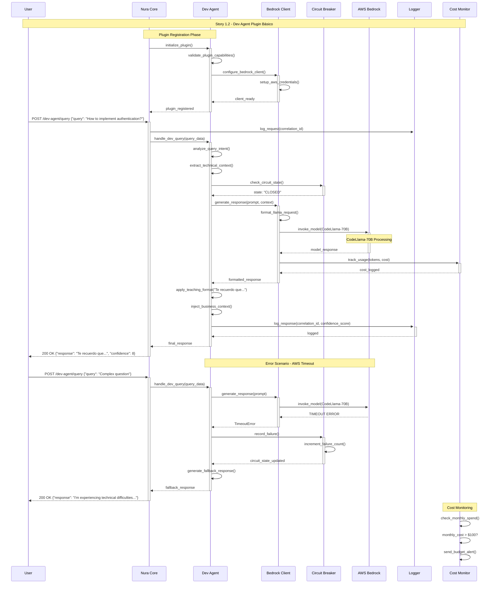

# Story 1.2: Dev Agent Plugin Básico

## Status
Approved

## Story
**As a** desarrollador junior/mid-level con preguntas técnicas,  
**I want** un agente especializado que entienda código y proporcione contexto,  
**so that** pueda aprender sin exposición social o miedo al juicio

## Acceptance Criteria

1. Dev Agent plugin se registra automáticamente con Nura Core
2. Procesa preguntas sobre código usando CodeLlama-70B via AWS Bedrock
3. Responde con contexto técnico + business context cuando relevante
4. Implementa formato "Te recuerdo que..." para enseñanza sin condescendencia
5. Maneja errores gracefully con fallback a respuesta genérica

## Tasks / Subtasks

### Dev Agent Plugin Infrastructure
- [ ] **Task 1: Dev Agent Plugin Implementation** (AC: 1)
  - [ ] Crear `src/plugins/dev_agent/` directory structure
  - [ ] Implementar `DevAgentPlugin` class inheriting from `PluginInterface`
  - [ ] Implementar `get_plugin_info()` method con metadata del plugin
  - [ ] Configurar plugin registration metadata y capabilities
  - [ ] Implementar lifecycle methods: `initialize()`, `shutdown()`

- [ ] **Task 2: Plugin Registration System Integration** (AC: 1)
  - [ ] Configurar auto-registration en kernel startup
  - [ ] Implementar `get_api_routes()` para routing automático
  - [ ] Configurar event handling through `handle_event()` method
  - [ ] Integrar con KernelContext para acceso a shared resources
  - [ ] Implementar plugin dependency injection

### AWS Bedrock Integration
- [ ] **Task 3: AWS Bedrock Client Implementation** (AC: 2)
  - [ ] Crear `src/infrastructure/llm/bedrock_client.py` con BedrockClient class
  - [ ] Configurar AWS credentials y region management (us-east-1)
  - [ ] Implementar model routing para CodeLlama-70B (meta.llama2-70b-chat-v1)
  - [ ] Configurar request/response handling con proper serialization
  - [ ] Implementar cost tracking y usage metrics collection

- [ ] **Task 4: Circuit Breaker & Error Handling** (AC: 5)
  - [ ] Integrar con NuraAPIGateway para circuit breaker pattern
  - [ ] Implementar retry logic con exponential backoff
  - [ ] Configurar timeout handling (default: 30 seconds)
  - [ ] Implementar graceful fallback responses
  - [ ] Setup error logging y alerting integration

### Query Processing & Response Generation
- [ ] **Task 5: Query Processing Pipeline** (AC: 2, 3)
  - [ ] Crear query processing interface en DevAgent
  - [ ] Implementar context analysis para technical vs business queries
  - [ ] Configurar prompt engineering para CodeLlama responses
  - [ ] Implementar query validation y sanitization
  - [ ] Setup correlation IDs para request tracing

- [ ] **Task 6: Response Formatting System** (AC: 3, 4)
  - [ ] Implementar "Te recuerdo que..." response templates
  - [ ] Crear context-aware response formatting
  - [ ] Configurar technical + business context integration
  - [ ] Implementar non-condescending tone validation
  - [ ] Setup response quality assurance metrics

### API Endpoints & Integration
- [ ] **Task 7: Dev Agent API Endpoints** (AC: 1, 2)
  - [ ] Implementar `/dev-agent/query` POST endpoint
  - [ ] Configurar request/response DTOs para dev queries
  - [ ] Integrar con kernel routing system
  - [ ] Implementar authentication y authorization middleware
  - [ ] Setup API versioning (`/api/v1/dev-agent/`)

### Testing Framework
- [ ] **Task 8: Comprehensive Testing Suite** (AC: All)
  - [ ] Crear `tests/unit/test_plugins/test_dev_agent.py`
  - [ ] Implementar `tests/integration/test_external/test_aws_bedrock.py`
  - [ ] Setup mock objects para AWS Bedrock responses
  - [ ] Crear unit tests para plugin lifecycle
  - [ ] Implementar integration tests para query processing pipeline

## Sequence Diagram



## Dev Notes

### Architecture Context

**Plugin System Foundation:**
Based on Story 1.1, the Nura Core Kernel provides a complete plugin registration system with:
- KernelManager for centralized plugin orchestration
- PluginInterface abstract base class for consistent plugin development
- KernelContext for shared resource access (db_session, cache, event_bus, logger, metrics)
- Event-driven communication system with SystemEvent handling

**Previous Story Integration:**
Story 1.1 established the core infrastructure that Story 1.2 builds upon:
- FastAPI application with health check endpoints
- Basic plugin registration system ready for DevAgent integration
- Logging framework with structured logging and correlation IDs
- Error handling patterns with HTTP status code mapping
- Dependency injection container for loose coupling

### Plugin Implementation Details

**DevAgent Plugin Structure:** [Source: backend-architecture.md#microkernel-core-architecture]
```
src/plugins/dev_agent/
├── __init__.py
├── plugin.py              # DevAgentPlugin class implementation
├── handlers/
│   ├── query_handler.py   # Query processing logic
│   └── response_formatter.py # Response formatting and templates
├── models/
│   ├── query_models.py    # Pydantic models for requests/responses
│   └── agent_metadata.py  # Plugin metadata and configuration
└── services/
    ├── bedrock_service.py # AWS Bedrock integration service
    └── context_analyzer.py # Technical vs business context analysis
```

**Plugin Interface Implementation:** [Source: backend-architecture.md#plugininterface]
```python
class DevAgentPlugin(PluginInterface):
    def get_plugin_info(self) -> Dict[str, Any]:
        return {
            "name": "dev-agent",
            "version": "1.0.0", 
            "description": "Specialized agent for technical questions and code context",
            "capabilities": ["code_analysis", "technical_mentorship", "context_generation"],
            "dependencies": ["aws-bedrock", "knowledge-management"]
        }
    
    async def initialize(self, kernel_context: KernelContext) -> bool:
        # Initialize AWS Bedrock client, setup logging, configure routes
        
    def get_api_routes(self) -> List[Dict[str, Any]]:
        return [
            {
                "path": "/dev-agent/query",
                "endpoint": self.handle_dev_query,
                "methods": ["POST"]
            }
        ]
```

**AWS Bedrock Integration:** [Source: integration-architecture.md#aws-bedrock, deployment-architecture.md#bedrockmodelrouter]

**Model Configuration:**
- **Primary Model**: CodeLlama-70B (meta.llama2-70b-chat-v1)
- **Region**: us-east-1 (default for cost optimization)
- **Configuration**: max_tokens=4000, temperature=0.1, top_p=0.9
- **Cost Tracking**: Integrated with usage metrics and budget alerts

**BedrockClient Implementation Pattern:** [Source: deployment-architecture.md#bedrockmodelrouter]
```python
# src/infrastructure/llm/bedrock_client.py
import boto3
from dataclasses import dataclass
from enum import Enum

class BedrockModel(Enum):
    LLAMA_2_70B = "meta.llama2-70b-chat-v1"

@dataclass
class BedrockConfig:
    model_id: str
    max_tokens: int = 4000
    temperature: float = 0.1
    top_p: float = 0.9
    region: str = "us-east-1"

class BedrockClient:
    def __init__(self):
        self.client = boto3.client('bedrock-runtime')
        self.model_config = BedrockConfig(
            model_id=BedrockModel.LLAMA_2_70B.value
        )
    
    async def generate_response(self, prompt: str, context: str = None) -> Dict[str, Any]:
        # Implementation with circuit breaker, retry logic, cost tracking
```

**Circuit Breaker Integration:** [Source: integration-architecture.md#nurapigateway]
- Integration with NuraAPIGateway for external service calls
- Circuit breaker threshold: configurable failure count
- Retry logic: exponential backoff with maximum 3 attempts
- Fallback mechanism: Generic helpful responses when Bedrock unavailable
- Timeout handling: 30 seconds default with configurable timeouts

**Response Format Requirements:** [Source: Epic 1 AC #4]
- **Template Pattern**: "Te recuerdo que {context}..." for non-condescending teaching
- **Context Integration**: Technical details + business context when relevant
- **Tone Validation**: Avoid condescending language, focus on learning support
- **Structured Response**: Clear technical explanations with practical examples

### API Design Patterns

**Request/Response Models:** [Source: backend-architecture.md#api-design-patterns]
```python
# src/plugins/dev_agent/models/query_models.py
from pydantic import BaseModel
from typing import Optional, Dict, Any

class DevQueryRequest(BaseModel):
    query: str
    user_id: str
    conversation_id: Optional[str] = None
    context: Optional[Dict[str, Any]] = None
    
class DevQueryResponse(BaseModel):
    success: bool
    response: str
    technical_context: Optional[str] = None
    business_context: Optional[str] = None
    source: str = "dev-agent"
    model_used: str
    tokens_used: int
    cost_usd: float
    response_time_ms: int
```

**Error Handling Strategy:** [Source: backend-architecture.md#error-handling-strategy]
- Global exception handlers for unhandled exceptions
- Graceful degradation on AWS Bedrock failures
- HTTP status code mapping: 200 (success), 400 (bad request), 500 (server error)
- Structured error responses with error codes and messages
- Fallback responses: "I'm experiencing technical difficulties, but here's a general approach to your question..."

### Testing Requirements

**Testing Framework:** [Source: testing-strategy.md#unit-testing-strategy]
- **Unit Tests**: `tests/unit/test_plugins/test_dev_agent.py` with plugin lifecycle testing
- **Integration Tests**: `tests/integration/test_external/test_aws_bedrock.py` for AWS integration
- **Mock Strategy**: Mock AWS Bedrock responses for unit tests, real API calls for integration tests
- **Coverage Target**: Minimum 80% code coverage for plugin components

**Test File Locations:** [Source: testing-strategy.md#test-organization]
```
tests/
├── unit/
│   └── test_plugins/
│       └── test_dev_agent.py       # DevAgent plugin unit tests
├── integration/
│   └── test_external/
│       └── test_aws_bedrock.py     # AWS Bedrock integration tests
└── fixtures/
    ├── mocks.py                    # Mock AWS responses and test data
    └── dev_agent_fixtures.py       # DevAgent-specific test fixtures
```

**Required Test Cases:**
- Plugin registration and lifecycle management
- AWS Bedrock request/response handling with circuit breaker
- Query processing pipeline with context analysis
- Response formatting with "Te recuerdo que..." templates
- Error handling paths with fallback responses
- Cost tracking and usage metrics validation

### Dependencies & Environment

**Python Dependencies (additional to Story 1.1):**
```
boto3==1.34.0               # AWS SDK for Bedrock integration
botocore==1.34.0            # AWS core libraries
pydantic==2.5.0             # Already included from Story 1.1
aiohttp==3.9.0              # HTTP client for external API calls
tenacity==8.2.3             # Retry logic with exponential backoff
```

**Environment Variables:**
```
AWS_ACCESS_KEY_ID=<aws-access-key>
AWS_SECRET_ACCESS_KEY=<aws-secret-key>
AWS_DEFAULT_REGION=us-east-1
BEDROCK_MODEL_ID=meta.llama2-70b-chat-v1
BEDROCK_MAX_TOKENS=4000
BEDROCK_TIMEOUT_SECONDS=30
COST_BUDGET_MONTHLY_USD=500
```

**AWS Configuration Requirements:**
- AWS Bedrock access permissions for model invocation
- IAM role with bedrock:InvokeModel permissions
- CloudWatch permissions for cost and usage tracking
- Regional availability: us-east-1 (primary), us-west-2 (fallback)

### Integration with Existing System

**Kernel Integration Points:** [Source: backend-architecture.md#kernelmanager]
- Auto-registration with KernelManager during startup
- Access to shared KernelContext (db_session, cache, event_bus, logger)
- Integration with existing FastAPI application and routing
- Event-driven communication with other plugins
- Shared middleware for authentication, logging, and error handling

**Dependency on Story 1.1 Components:**
- FastAPI application foundation and health check endpoints
- Plugin registration system and PluginInterface
- Logging framework with correlation IDs
- Error handling patterns and HTTP status mapping
- Dependency injection container and shared resources

**No Database Required for MVP:** This story focuses on stateless query processing. All responses are generated in real-time without persistent storage requirements.

### Testing

**Testing Framework:**
- **Unit Tests:** `tests/unit/test_plugins/test_dev_agent.py` using pytest with AWS mocking
- **Integration Tests:** `tests/integration/test_external/test_aws_bedrock.py` for real AWS API testing
- **Mock Strategy:** Use boto3 stubber for AWS service mocking in unit tests
- **Coverage Target:** Minimum 80% code coverage for plugin functionality

**Specific Testing Requirements for This Story:**
- Plugin registration and auto-discovery by kernel
- AWS Bedrock request/response cycle with proper error handling
- Circuit breaker functionality under service failures
- Response formatting with required "Te recuerdo que..." templates
- Cost tracking accuracy and budget alert triggers
- Query processing pipeline with context analysis validation

## Change Log

| Date | Version | Description | Author |
|------|---------|-------------|---------|
| 2024-01-15 | 1.0 | Initial story creation with comprehensive AWS Bedrock integration context | Scrum Master |

## Dev Agent Record

*This section will be populated by the development agent during implementation*

### Agent Model Used
*To be filled by dev agent*

### Debug Log References
*To be filled by dev agent*

### Completion Notes List
*To be filled by dev agent*

### File List
*To be filled by dev agent*

## QA Results

*This section will be populated by the QA agent after story completion*