# Story 1.4: Streamlit Interface Ultra-Básico

## Status
Approved

## Story
**As a** usuario final que quiere interactuar con Nura,  
**I want** una interfaz simple donde hacer preguntas,  
**so that** pueda comenzar a usar el sistema inmediatamente

## Acceptance Criteria

1. Streamlit app con input text + chat history display
2. Submit button conecta a Nura Core API
3. Muestra respuestas del Dev Agent en formato conversational
4. Incluye indicador visual de "processing" durante requests
5. Error handling básico si Nura Core no responde

## Tasks / Subtasks

### Streamlit Application Setup
- [ ] **Task 1: Basic Streamlit App Structure** (AC: 1)
  - [ ] Crear `src/frontend/streamlit/app.py` main entry point
  - [ ] Configurar Streamlit page config (title, icon, layout)
  - [ ] Implementar basic app structure con sidebar y main content
  - [ ] Setup session state management para chat history
  - [ ] Configurar CSS styling básico

- [ ] **Task 2: Chat Interface Components** (AC: 1, 3)
  - [ ] Crear `src/frontend/streamlit/components/chat/chat_interface.py`
  - [ ] Implementar message input field con text_area
  - [ ] Crear chat history display container
  - [ ] Implementar message bubbles (user vs assistant)
  - [ ] Setup auto-scroll para new messages

### Backend API Integration
- [ ] **Task 3: API Client Implementation** (AC: 2)
  - [ ] Crear `src/frontend/streamlit/services/api_client.py`
  - [ ] Implementar HTTP client para `/chat/message` endpoint
  - [ ] Configurar request/response handling con proper headers
  - [ ] Setup timeout y connection error handling
  - [ ] Implementar API base URL configuration

- [ ] **Task 4: Chat Message Processing** (AC: 2, 3)
  - [ ] Implementar send_message function con API integration
  - [ ] Configurar message formatting para display
  - [ ] Setup conversation_id generation y management
  - [ ] Implementar response parsing y validation
  - [ ] Configurar message metadata handling

### User Experience Features
- [ ] **Task 5: Loading States & Visual Feedback** (AC: 4)
  - [ ] Implementar loading spinner durante API calls
  - [ ] Crear "processing" indicator con animated text
  - [ ] Setup submit button state management (disabled during requests)
  - [ ] Implementar typing indicator simulation
  - [ ] Configurar progress feedback para long requests

- [ ] **Task 6: Error Handling & Recovery** (AC: 5)
  - [ ] Implementar error display components
  - [ ] Configurar connection error messages
  - [ ] Setup retry mechanism para failed requests
  - [ ] Implementar fallback responses
  - [ ] Crear user-friendly error messages

### Configuration & Session Management
- [ ] **Task 7: Application Configuration** (AC: All)
  - [ ] Crear `src/frontend/streamlit/config/settings.py`
  - [ ] Configurar environment variables (API_BASE_URL, etc.)
  - [ ] Setup default conversation parameters
  - [ ] Implementar configuration validation
  - [ ] Configurar development vs production settings

- [ ] **Task 8: Session State Management** (AC: 1, 3)
  - [ ] Implementar persistent chat history
  - [ ] Configurar conversation continuity
  - [ ] Setup user preferences storage
  - [ ] Implementar session cleanup
  - [ ] Crear session state initialization

### Testing Framework
- [ ] **Task 9: Frontend Testing Suite** (AC: All)
  - [ ] Crear `tests/frontend/streamlit/test_app.py`
  - [ ] Implementar unit tests para components
  - [ ] Setup mock API responses para testing
  - [ ] Configurar UI interaction tests
  - [ ] Implementar integration tests con backend

## Sequence Diagram

```mermaid
sequenceDiagram
    participant User as End User
    participant ST as Streamlit App
    participant CI as Chat Interface
    participant API as API Client
    participant SS as Session State
    participant NC as Nura Core API
    participant L as Loading State

    Note over User,L: Story 1.4 - Streamlit Interface Ultra-Básico

    %% App Initialization
    Note over User,SS: Application Startup
    User->>+ST: streamlit run app.py
    ST->>ST: setup_page_config()
    ST->>+SS: initialize_session_state()
    SS->>SS: create_conversation_id()
    SS->>SS: initialize_messages_history[]
    SS-->>-ST: session_initialized
    
    ST->>+CI: render_chat_interface()
    CI->>CI: check_agent_status()
    CI->>+API: GET /orchestration/agent-status/dev_agent
    API-->>-CI: {"status": "online"}
    CI->>CI: display_agent_status("✅ Dev Agent")
    CI-->>-ST: interface_rendered
    ST-->>-User: Streamlit UI Loaded

    %% Normal Chat Flow
    Note over User,NC: User Query Processing
    User->>+ST: types: "How do I implement authentication?"
    ST->>+CI: handle_user_input(message)
    CI->>+SS: append_user_message(message)
    SS-->>-CI: message_added
    
    CI->>+L: set_processing_state(True)
    L->>L: show_spinner("🤖 Nura is thinking...")
    L-->>-CI: processing_indicator_active
    
    CI->>+API: send_to_api(message)
    API->>API: format_request_payload()
    API->>+NC: POST /api/v1/chat/message
    Note over NC: Dev Agent Processing<br/>CodeLlama-70B + Context
    NC-->>-API: {"response": "Te recuerdo que...", "confidence": 8}
    API-->>-CI: formatted_response
    
    CI->>+SS: append_assistant_message(response)
    SS-->>-CI: response_added
    CI->>+L: set_processing_state(False)
    L->>L: hide_spinner()
    L-->>-CI: processing_complete
    
    CI->>CI: trigger_ui_refresh()
    CI-->>-ST: message_exchange_complete
    ST-->>-User: Display conversation with new response

    %% Error Handling Flow
    Note over User,API: Connection Error Scenario
    User->>+ST: types: "Another question"
    ST->>+CI: handle_user_input(message)
    CI->>+L: set_processing_state(True)
    L-->>-CI: processing_active
    
    CI->>+API: send_to_api(message)
    API->>+NC: POST /api/v1/chat/message
    NC-->>-API: ConnectionError (Backend Down)
    API-->>-CI: ConnectionError Exception
    
    CI->>CI: handle_api_error(ConnectionError)
    CI->>+SS: append_error_message("❌ Connection Error: Unable to connect...")
    SS-->>-CI: error_message_added
    CI->>+L: set_processing_state(False)
    L-->>-CI: processing_stopped
    CI-->>-ST: error_handled
    ST-->>-User: Display error message in chat

    %% Retry Mechanism
    Note over User,API: User Retry Flow
    User->>+ST: clicks retry or sends new message
    ST->>+CI: handle_user_input("retry")
    CI->>+API: send_to_api(previous_message)
    API->>+NC: POST /api/v1/chat/message (retry)
    NC-->>-API: {"response": "Success response"}
    API-->>-CI: successful_response
    CI->>+SS: append_assistant_message(response)
    SS-->>-CI: retry_successful
    CI-->>-ST: conversation_updated
    ST-->>-User: Show successful response

    %% Session Management
    Note over SS: Session Persistence
    SS->>SS: auto_save_conversation_history()
    SS->>SS: maintain_conversation_context()
    SS->>SS: cleanup_old_sessions()

    %% Loading States Detail
    Note over L: Loading State Management
    L->>L: disable_submit_button()
    L->>L: show_typing_indicator()
    L->>L: display_processing_message()
    L->>L: enable_submit_button()
```



## Dev Notes

### Architecture Context

**Streamlit MVP Foundation:** [Source: frontend-architecture.md#phase-1-streamlit-mvp-architecture]
The frontend architecture follows a conversation-first design with component organization optimized for rapid MVP delivery:

```
src/frontend/streamlit/
├── app.py                          # Main Streamlit app entry point
├── components/                     # Reusable UI components
│   ├── chat/
│   │   ├── chat_interface.py       # Main chat component
│   │   ├── message_bubble.py       # Individual message display
│   │   └── conversation_history.py  # Chat history management
│   └── common/
│       ├── loading_spinner.py      # Loading states
│       └── error_display.py        # Error handling UI
├── services/                       # Frontend service layer
│   ├── api_client.py              # HTTP client for backend APIs
│   └── conversation_service.py     # Conversation management
├── utils/                         # Utility functions
│   ├── session_state.py           # Streamlit session management
│   └── formatting.py              # Message formatting utilities
├── config/
│   ├── settings.py                # App configuration
│   └── api_endpoints.py           # Backend endpoints configuration
└── assets/                       # Static assets
    └── styles.css                 # Custom styling
```

**Previous Story Integration:**
Stories 1.1, 1.2, and 1.3 provide the complete backend foundation that Story 1.4 will connect to:
- **Story 1.1**: Nura Core Kernel with FastAPI server and health check endpoints
- **Story 1.2**: Dev Agent Plugin with intelligent response generation and AWS Bedrock integration
- **Story 1.3**: Code indexing system providing context-aware responses from project knowledge

### Main Application Implementation

**App Structure:** [Source: frontend-architecture.md#main-app-architecture]
```python
# src/frontend/streamlit/app.py
import streamlit as st
from components.chat.chat_interface import ChatInterface
from services.api_client import APIClient
from config.settings import Settings

class NuraStreamlitApp:
    def __init__(self):
        self.settings = Settings()
        self.api_client = APIClient(base_url=self.settings.API_BASE_URL)
        self.chat_interface = ChatInterface(api_client=self.api_client)
    
    def setup_page_config(self):
        st.set_page_config(
            page_title="Nura - AI Developer Assistant",
            page_icon="🤖",
            layout="wide",
            initial_sidebar_state="expanded"
        )
    
    def render_sidebar(self):
        with st.sidebar:
            st.title("🤖 Nura")
            
            # Agent status display
            self.render_agent_status()
    
    def render_main_content(self):
        # Main chat interface
        self.chat_interface.render()
    
    def render_agent_status(self):
        st.subheader("Agent Status")
        
        # Check Dev Agent status (primary for MVP)
        try:
            response = self.api_client.get("/orchestration/agent-status/dev_agent")
            status = response.get("status", "offline")
            if status == "online":
                st.success("✅ Dev Agent")
            else:
                st.error("❌ Dev Agent (offline)")
        except:
            st.error("❌ Connection Error")
    
    def run(self):
        self.setup_page_config()
        self.render_sidebar()
        self.render_main_content()

# App entry point
if __name__ == "__main__":
    app = NuraStreamlitApp()
    app.run()
```

### Chat Interface Implementation

**Chat Component:** [Source: frontend-architecture.md#chat-interface-component]
```python
# src/frontend/streamlit/components/chat/chat_interface.py
import streamlit as st
from typing import Dict, Any
from services.api_client import APIClient
from utils.session_state import SessionStateManager
import time
import uuid

class ChatInterface:
    def __init__(self, api_client: APIClient):
        self.api_client = api_client
        self.session_manager = SessionStateManager()
        
        # Initialize session state
        if 'messages' not in st.session_state:
            st.session_state.messages = []
        if 'conversation_id' not in st.session_state:
            st.session_state.conversation_id = str(uuid.uuid4())
        if 'is_processing' not in st.session_state:
            st.session_state.is_processing = False
    
    def render(self):
        st.title("💬 Chat with Nura")
        
        # Chat messages container
        self.render_chat_history()
        
        # Message input area
        self.render_message_input()
    
    def render_chat_history(self):
        # Chat messages container with auto-scroll
        chat_container = st.container()
        
        with chat_container:
            for message in st.session_state.messages:
                self.render_message(message)
    
    def render_message(self, message: Dict[str, Any]):
        is_user = message['role'] == 'user'
        
        if is_user:
            # User message (right-aligned)
            col1, col2 = st.columns([3, 1])
            with col2:
                st.markdown(f"""
                <div style="background-color: #007bff; color: white; padding: 10px; 
                border-radius: 10px; margin: 5px; text-align: right;">
                {message['content']}
                </div>
                """, unsafe_allow_html=True)
        else:
            # Assistant message (left-aligned)
            col1, col2 = st.columns([1, 3])
            with col1:
                st.markdown(f"""
                <div style="background-color: #f0f0f0; padding: 10px; 
                border-radius: 10px; margin: 5px;">
                🤖 <strong>Nura:</strong><br>
                {message['content']}
                </div>
                """, unsafe_allow_html=True)
    
    def render_message_input(self):
        # Message input form
        with st.form(key="message_form", clear_on_submit=True):
            user_input = st.text_area(
                "Type your message here...",
                height=100,
                disabled=st.session_state.is_processing
            )
            
            col1, col2 = st.columns([1, 4])
            with col1:
                submit_button = st.form_submit_button(
                    "Send" if not st.session_state.is_processing else "Processing...",
                    disabled=st.session_state.is_processing
                )
            
            if submit_button and user_input.strip():
                self.handle_user_message(user_input.strip())
    
    def handle_user_message(self, user_input: str):
        # Add user message to history
        st.session_state.messages.append({
            'role': 'user',
            'content': user_input,
            'timestamp': time.time()
        })
        
        # Set processing state
        st.session_state.is_processing = True
        
        # Show processing indicator
        with st.spinner("🤖 Nura is thinking..."):
            try:
                # Call backend API
                response = self.send_to_api(user_input)
                
                # Add assistant response to history
                st.session_state.messages.append({
                    'role': 'assistant',
                    'content': response['content'],
                    'timestamp': time.time()
                })
                
            except Exception as e:
                # Error handling
                error_message = self.handle_api_error(e)
                st.session_state.messages.append({
                    'role': 'assistant',
                    'content': error_message,
                    'timestamp': time.time()
                })
            
            finally:
                # Reset processing state
                st.session_state.is_processing = False
                
                # Trigger rerun to update UI
                st.experimental_rerun()
    
    def send_to_api(self, message: str) -> Dict[str, Any]:
        """Send message to Nura Core API"""
        payload = {
            "conversation_id": st.session_state.conversation_id,
            "content": message,
            "retrieval_strategy": "contextual"
        }
        
        response = self.api_client.post("/chat/message", json=payload)
        return response
    
    def handle_api_error(self, error: Exception) -> str:
        """Handle API errors with user-friendly messages"""
        if "ConnectionError" in str(type(error)):
            return "❌ **Connection Error**: Unable to connect to Nura backend. Please check if the server is running."
        elif "Timeout" in str(type(error)):
            return "⏱️ **Request Timeout**: The request took too long. Please try again."
        elif "500" in str(error):
            return "🔧 **Server Error**: Something went wrong on our end. Please try again in a moment."
        else:
            return f"❓ **Unexpected Error**: {str(error)}. Please try again or contact support."
```

### API Client Implementation

**HTTP Client:** [Source: api-specifications.md#chat-processing]
```python
# src/frontend/streamlit/services/api_client.py
import requests
import streamlit as st
from typing import Dict, Any, Optional
import json

class APIClient:
    def __init__(self, base_url: str):
        self.base_url = base_url.rstrip('/')
        self.timeout = 30
        self.session = requests.Session()
        
        # Set default headers
        self.session.headers.update({
            'Content-Type': 'application/json',
            'User-Agent': 'Nura-Streamlit/1.0'
        })
    
    def post(self, endpoint: str, json: Optional[Dict[str, Any]] = None) -> Dict[str, Any]:
        """Send POST request to API endpoint"""
        url = f"{self.base_url}{endpoint}"
        
        try:
            response = self.session.post(
                url,
                json=json,
                timeout=self.timeout
            )
            
            response.raise_for_status()
            return response.json()
            
        except requests.exceptions.ConnectionError:
            raise ConnectionError(f"Unable to connect to {url}")
        except requests.exceptions.Timeout:
            raise TimeoutError(f"Request to {url} timed out")
        except requests.exceptions.HTTPError as e:
            raise RuntimeError(f"HTTP {e.response.status_code}: {e.response.text}")
        except Exception as e:
            raise RuntimeError(f"Unexpected error: {str(e)}")
    
    def get(self, endpoint: str) -> Dict[str, Any]:
        """Send GET request to API endpoint"""
        url = f"{self.base_url}{endpoint}"
        
        try:
            response = self.session.get(url, timeout=self.timeout)
            response.raise_for_status()
            return response.json()
            
        except requests.exceptions.ConnectionError:
            raise ConnectionError(f"Unable to connect to {url}")
        except requests.exceptions.Timeout:
            raise TimeoutError(f"Request to {url} timed out")
        except requests.exceptions.HTTPError as e:
            raise RuntimeError(f"HTTP {e.response.status_code}: {e.response.text}")
        except Exception as e:
            raise RuntimeError(f"Unexpected error: {str(e)}")
```

### Configuration Management

**Settings Configuration:** [Source: frontend-architecture.md#configuration]
```python
# src/frontend/streamlit/config/settings.py
import os
from dataclasses import dataclass
from typing import Optional

@dataclass
class Settings:
    # API Configuration
    API_BASE_URL: str = os.getenv('NURA_API_BASE_URL', 'http://localhost:8000/api/v1')
    API_TIMEOUT: int = int(os.getenv('NURA_API_TIMEOUT', '30'))
    
    # UI Configuration
    APP_TITLE: str = "Nura - AI Developer Assistant"
    APP_ICON: str = "🤖"
    
    # Chat Configuration
    MAX_MESSAGE_LENGTH: int = int(os.getenv('MAX_MESSAGE_LENGTH', '2000'))
    MAX_CHAT_HISTORY: int = int(os.getenv('MAX_CHAT_HISTORY', '100'))
    
    # Feature Flags
    ENABLE_AGENT_STATUS: bool = os.getenv('ENABLE_AGENT_STATUS', 'true').lower() == 'true'
    ENABLE_METRICS_DISPLAY: bool = os.getenv('ENABLE_METRICS_DISPLAY', 'false').lower() == 'true'
    
    def validate(self) -> bool:
        """Validate configuration settings"""
        if not self.API_BASE_URL:
            return False
        if self.API_TIMEOUT <= 0:
            return False
        return True
```

### Backend API Integration Details

**Chat Message Endpoint:** [Source: api-specifications.md#chat-message]
The Streamlit interface connects to the established backend API:

**Endpoint**: `POST /api/v1/chat/message`

**Request Format**:
```json
{
  "conversation_id": "uuid-string",
  "content": "user message text",
  "retrieval_strategy": "contextual"
}
```

**Response Format**:
```json
{
  "success": true,
  "response": {
    "content": "AI generated response",
    "agent_type": "dev_agent",
    "model_used": "CodeLlama-70B",
    "tokens_used": 150,
    "response_time_ms": 1200
  },
  "conversation_id": "uuid-string",
  "message_id": "uuid-string"
}
```

**Agent Status Endpoint**: `GET /api/v1/orchestration/agent-status/dev_agent`

### Testing Requirements

**Testing Framework:** [Source: testing-strategy.md#frontend-testing]
- **Unit Tests**: `tests/frontend/streamlit/test_components.py` for UI components
- **Integration Tests**: `tests/frontend/streamlit/test_api_integration.py` for backend connectivity
- **Mock Strategy**: Mock HTTP responses for unit tests, use test backend for integration
- **Coverage Target**: Minimum 80% coverage for frontend components

**Test File Locations:**
```
tests/frontend/streamlit/
├── test_app.py                    # Main app functionality
├── test_components/
│   ├── test_chat_interface.py     # Chat component tests
│   └── test_message_display.py    # Message rendering tests
├── test_services/
│   └── test_api_client.py         # API client tests
├── fixtures/
│   ├── mock_responses.py          # Mock API responses
│   └── test_data.py               # Test chat data
└── conftest.py                    # Pytest configuration
```

**Required Test Cases:**
- Message input and validation
- Chat history display and persistence
- API integration with error handling
- Loading states and visual feedback
- Session state management
- Error recovery and retry mechanisms

### Dependencies & Environment

**Python Dependencies (additional to backend stories):**
```
streamlit==1.28.1            # Streamlit framework
requests==2.31.0             # HTTP client for API calls
python-dotenv==1.0.0         # Environment variable management
```

**Environment Variables:**
```
# Streamlit Configuration
NURA_API_BASE_URL=http://localhost:8000/api/v1
NURA_API_TIMEOUT=30
MAX_MESSAGE_LENGTH=2000
MAX_CHAT_HISTORY=100

# Feature Flags
ENABLE_AGENT_STATUS=true
ENABLE_METRICS_DISPLAY=false

# Development
STREAMLIT_SERVER_PORT=8501
STREAMLIT_SERVER_ADDRESS=localhost
```

**Streamlit Configuration (`.streamlit/config.toml`):**
```toml
[server]
port = 8501
address = "localhost"
runOnSave = true
allowRunOnSave = true

[browser]
gatherUsageStats = false

[theme]
primaryColor = "#007bff"
backgroundColor = "#ffffff"
secondaryBackgroundColor = "#f0f0f0"
textColor = "#262730"
```

### Integration with Existing System

**Backend Integration Points:** [Source: core-workflows.md#consulta-tecnica]
- Direct connection to Nura Core API established in Stories 1.1-1.3
- Dev Agent Plugin responses formatted for conversational display
- Code indexing system provides context-aware responses
- Error handling patterns consistent with backend architecture

**User Experience Flow:**
1. User opens Streamlit interface
2. Types question in chat input
3. Frontend sends request to `/chat/message` endpoint
4. Backend routes through kernel → Dev Agent → Code search → Response
5. Frontend displays formatted response with loading states
6. Chat history persists in session state

**No Authentication Required for MVP:** This ultra-basic interface focuses on core functionality without authentication complexity, aligning with MVP validation goals.

### Testing

**Testing Framework:**
- **Unit Tests**: `tests/frontend/streamlit/test_components.py` using pytest with Streamlit testing
- **Integration Tests**: `tests/frontend/streamlit/test_api_integration.py` for backend connectivity
- **Mock Strategy**: Mock API responses for unit tests, test server for integration tests
- **Coverage Target**: Minimum 80% code coverage for frontend components

**Specific Testing Requirements for This Story:**
- Chat interface functionality with message display and input
- API integration with proper error handling and recovery
- Loading states and visual feedback during processing
- Session state persistence across interactions
- Error handling for backend connection failures
- User input validation and sanitization

## Change Log

| Date | Version | Description | Author |
|------|---------|-------------|---------|
| 2024-01-15 | 1.0 | Initial story creation with comprehensive Streamlit interface and API integration context | Scrum Master |

## Dev Agent Record

*This section will be populated by the development agent during implementation*

### Agent Model Used
*To be filled by dev agent*

### Debug Log References
*To be filled by dev agent*

### Completion Notes List
*To be filled by dev agent*

### File List
*To be filled by dev agent*

## QA Results

*This section will be populated by the QA agent after story completion*