# Story 1.5: Conexión AWS Bedrock + SageMaker

## Status
Approved

## Story
**As a** sistema que necesita capacidades AI,  
**I want** integración funcional con AWS managed services,  
**so that** pueda proporcionar respuestas inteligentes sin manejar infrastructure AI

## Acceptance Criteria

1. Conexión estable a CodeLlama-70B via AWS Bedrock SDK
2. SageMaker endpoint BGE-M3 responde a embedding requests <500ms
3. Maneja AWS credential management y region configuration  
4. Implementa retry logic básico para service timeouts
5. Cost monitoring alerts si usage excede $100/mes en Epic 1

## Tasks / Subtasks

### AWS Bedrock Integration Setup
- [ ] **Task 1: AWS Bedrock Client Configuration** (AC: 1, 3)
  - [ ] Configurar boto3 client con AWS credentials management
  - [ ] Implementar region configuration (us-east-1 por defecto)
  - [ ] Setup credential rotation y security best practices
  - [ ] Configurar IAM roles específicos para Bedrock access
  - [ ] Implementar environment variables para configuración

- [ ] **Task 2: CodeLlama-70B Model Integration** (AC: 1)
  - [ ] Implementar wrapper para modelo CodeLlama-70B
  - [ ] Configurar request/response formatting específico del modelo
  - [ ] Setup token management y context window handling
  - [ ] Implementar temperature y sampling parameters
  - [ ] Configurar stop sequences específicas para CodeLlama

### SageMaker BGE-M3 Embedding Integration
- [ ] **Task 3: SageMaker Endpoint Configuration** (AC: 2, 3)
  - [ ] Setup BGE-M3 endpoint en SageMaker
  - [ ] Configurar async invocation para batch embeddings
  - [ ] Implementar endpoint health checks
  - [ ] Setup auto-scaling configuration para el endpoint
  - [ ] Configurar network security groups y VPC settings

- [ ] **Task 4: Embedding Processing Pipeline** (AC: 2)
  - [ ] Implementar batch embedding processing
  - [ ] Configurar input preprocessing para BGE-M3
  - [ ] Setup embedding vector normalization
  - [ ] Implementar streaming responses para large batches
  - [ ] Configurar caching layer para embeddings frecuentes

### Error Handling & Reliability
- [ ] **Task 5: Retry Logic Implementation** (AC: 4)
  - [ ] Implementar exponential backoff para AWS calls
  - [ ] Configurar circuit breaker pattern
  - [ ] Setup fallback mechanisms para service degradation
  - [ ] Implementar dead letter queue para failed requests
  - [ ] Configurar jitter para evitar thundering herd

- [ ] **Task 6: AWS Service Health Monitoring** (AC: 4)
  - [ ] Implementar health checks para Bedrock y SageMaker
  - [ ] Setup CloudWatch metrics integration
  - [ ] Configurar alerting para service outages
  - [ ] Implementar automatic recovery mechanisms
  - [ ] Setup service status dashboard

### Cost Monitoring & Optimization
- [ ] **Task 7: Cost Tracking Implementation** (AC: 5)
  - [ ] Implementar token usage tracking para Bedrock
  - [ ] Setup SageMaker inference cost monitoring
  - [ ] Configurar CloudWatch billing alerts
  - [ ] Implementar budget controls y spending limits
  - [ ] Setup cost reporting dashboard

- [ ] **Task 8: Usage Optimization** (AC: 5)
  - [ ] Implementar request batching para efficiency
  - [ ] Configurar caching strategies
  - [ ] Setup usage analytics y optimization recommendations
  - [ ] Implementar rate limiting para cost control
  - [ ] Configurar automatic scaling policies

### Integration Testing & Validation
- [ ] **Task 9: AWS Integration Testing Suite** (AC: All)
  - [ ] Crear integration tests para Bedrock API calls
  - [ ] Implementar SageMaker endpoint testing
  - [ ] Setup cost monitoring tests
  - [ ] Configurar error handling tests
  - [ ] Implementar performance benchmark tests

## Sequence Diagram

```mermaid
sequenceDiagram
    participant NC as Nura Core
    participant AIM as AWS Integration Manager
    participant BC as Bedrock Client
    participant SC as SageMaker Client
    participant CB as Circuit Breaker
    participant CW as CloudWatch
    participant BR as AWS Bedrock
    participant SM as AWS SageMaker
    participant CM as Cost Monitor

    Note over NC,CM: Story 1.5 - Conexión AWS Bedrock + SageMaker

    %% System Initialization
    Note over NC,SM: AWS Services Initialization
    NC->>+AIM: initialize_aws_integration()
    AIM->>+BC: configure_bedrock_client(region="us-east-1")
    BC->>BC: setup_boto3_credentials()
    BC->>BC: validate_model_access(CodeLlama-70B)
    BC-->>-AIM: bedrock_client_ready
    
    AIM->>+SC: configure_sagemaker_client()
    SC->>SC: setup_bge_m3_endpoint()
    SC->>+SM: describe_endpoint("bge-m3-endpoint")
    SM-->>-SC: endpoint_status: "InService"
    SC-->>-AIM: sagemaker_client_ready
    
    AIM->>+CB: initialize_circuit_breakers()
    CB->>CB: setup_failure_thresholds()
    CB-->>-AIM: circuit_breakers_active
    AIM-->>-NC: aws_integration_ready

    %% CodeLlama-70B Request Flow
    Note over NC,CM: Bedrock LLM Processing
    NC->>+AIM: invoke_bedrock_model(prompt, model="CodeLlama-70B")
    AIM->>+CB: check_bedrock_circuit_state()
    CB-->>-AIM: state: "CLOSED"
    
    AIM->>+BC: generate_response(prompt, max_tokens=2000)
    BC->>BC: format_llama_request_body()
    BC->>BC: add_temperature_sampling(0.7)
    
    BC->>+BR: invoke_model(meta.llama2-70b-chat-v1)
    Note over BR: CodeLlama-70B<br/>Processing Time<br/>Target: <5s
    BR-->>-BC: model_response_with_tokens
    
    BC->>BC: parse_response_content()
    BC->>+CM: calculate_bedrock_cost(input_tokens, output_tokens)
    CM->>CM: apply_pricing_model($0.00195/$0.00256)
    CM-->>-BC: cost_calculated: $0.023
    
    BC->>+CW: track_usage_metrics(tokens, latency, cost)
    CW-->>-BC: metrics_logged
    BC-->>-AIM: formatted_response_with_metadata
    AIM-->>-NC: {"content": "response", "cost": "$0.023", "tokens": 180}

    %% BGE-M3 Embeddings Flow
    Note over NC,SM: SageMaker Embeddings Processing
    NC->>+AIM: generate_embeddings(text_array, model="BGE-M3")
    AIM->>+CB: check_sagemaker_circuit_state()
    CB-->>-AIM: state: "CLOSED"
    
    AIM->>+SC: process_embedding_batch(texts[], batch_size=32)
    SC->>SC: preprocess_text_for_bge_m3()
    SC->>SC: create_inference_payload()
    
    loop For Each Batch (32 items)
        SC->>+SM: invoke_endpoint("bge-m3-endpoint", payload)
        Note over SM: BGE-M3 Processing<br/>Target: <500ms<br/>Output: 1024d vectors
        SM-->>-SC: embedding_vectors_batch[]
        SC->>SC: validate_vector_dimensions(1024)
        SC->>SC: normalize_embeddings()
    end
    
    SC->>+CM: calculate_sagemaker_cost(inference_requests)
    CM-->>-SC: cost_calculated: $0.012
    SC->>+CW: track_embedding_metrics(batch_count, latency)
    CW-->>-SC: metrics_logged
    SC-->>-AIM: normalized_embeddings_1024d[]
    AIM-->>-NC: {"embeddings": [...], "cost": "$0.012", "processing_time": "320ms"}

    %% Error Handling & Circuit Breaker Flow
    Note over AIM,BR: Error Scenario - Bedrock Timeout
    NC->>+AIM: invoke_bedrock_model(complex_prompt)
    AIM->>+BC: generate_response(prompt)
    BC->>+BR: invoke_model(CodeLlama-70B)
    BR-->>-BC: RequestTimeout (>30s)
    BC-->>-AIM: TimeoutException
    
    AIM->>+CB: record_bedrock_failure()
    CB->>CB: increment_failure_count()
    CB->>CB: failure_count >= threshold?
    CB->>CB: open_circuit("BEDROCK_SERVICE")
    CB-->>-AIM: circuit_opened
    
    AIM->>AIM: generate_fallback_response()
    AIM-->>-NC: {"content": "Service temporarily unavailable", "fallback": true}

    %% Cost Monitoring & Budget Alerts
    Note over CM,CW: Cost Management Flow
    CM->>CM: aggregate_monthly_costs()
    CM->>CM: bedrock_cost + sagemaker_cost
    CM->>CM: total_monthly > $100?
    
    alt Cost Exceeds Budget
        CM->>+CW: send_budget_alert()
        CW->>CW: trigger_sns_notification()
        CW-->>-CM: alert_sent
        CM->>CM: activate_cost_controls()
        CM->>CB: enable_rate_limiting()
    else Within Budget
        CM->>CM: continue_normal_operation()
    end

    %% Health Monitoring Flow
    Note over AIM,SM: Service Health Checks
    loop Every 5 minutes
        AIM->>+BC: health_check_bedrock()
        BC->>+BR: list_foundation_models()
        BR-->>-BC: models_available
        BC-->>-AIM: bedrock_healthy
        
        AIM->>+SC: health_check_sagemaker()
        SC->>+SM: describe_endpoint("bge-m3-endpoint")
        SM-->>-SC: endpoint_in_service
        SC-->>-AIM: sagemaker_healthy
        
        AIM->>+CW: update_service_health_metrics()
        CW-->>-AIM: health_metrics_updated
    end

    %% Auto-scaling Scenario
    Note over SC,SM: SageMaker Auto-scaling
    SC->>SC: monitor_endpoint_utilization()
    SC->>SC: utilization > 70%?
    SC->>+SM: update_endpoint_scaling(target_capacity=3)
    SM->>SM: provision_additional_instances()
    SM-->>-SC: scaling_complete
```



## Dev Notes

### Architecture Context

**AWS Integration Layer:** [Source: integration-architecture.md#aws-services-integration]
La integración con AWS sigue el patrón API Gateway establecido con circuit breakers, rate limiting, y observabilidad completa. El sistema implementa el patrón NuraAPIGateway para todas las llamadas externas:

```python
class AWSIntegrationManager:
    def __init__(self, aws_config: Dict[str, str]):
        self.aws_config = aws_config
        self.bedrock_client = None
        self.s3_client = None
        self.cloudwatch_client = None
        
    async def invoke_bedrock_model(
        self, 
        model_id: str, 
        prompt: str, 
        max_tokens: int = 1000,
        temperature: float = 0.7,
        conversation_id: str = "",
        metadata: Optional[Dict[str, Any]] = None
    ) -> Dict[str, Any]:
```

**Previous Story Integration:**
Stories 1.1-1.4 establecen la foundation completa:
- **Story 1.1**: Nura Core con plugin registration para AWS services
- **Story 1.2**: Dev Agent Plugin esperando respuestas de modelos LLM
- **Story 1.3**: Vector indexing system que requerirá BGE-M3 embeddings
- **Story 1.4**: Streamlit interface list para mostrar responses de AWS Bedrock

### Bedrock Client Implementation

**Model Integration Patterns:** [Source: integration-architecture.md#aws-services-integration]
```python
# Bedrock request formatting específico por modelo
if "claude" in model_id.lower():
    request_body = {
        "prompt": f"Human: {prompt}\n\nAssistant:",
        "max_tokens_to_sample": max_tokens,
        "temperature": temperature,
        "stop_sequences": ["Human:"]
    }
elif "llama" in model_id.lower():
    request_body = {
        "prompt": prompt,
        "max_gen_len": max_tokens,
        "temperature": temperature,
        "top_p": 0.9
    }
```

**Cost Calculation Logic:** [Source: integration-architecture.md#aws-services-integration]
```python
async def _calculate_bedrock_cost(
    self, model_id: str, input_tokens: int, output_tokens: int
) -> float:
    pricing = {
        "meta.llama2-70b-chat-v1": {"input": 0.00195, "output": 0.00256},
        "anthropic.claude-3-sonnet": {"input": 0.003, "output": 0.015},
    }
    model_pricing = pricing.get(model_id, {"input": 0.001, "output": 0.002})
    return round(
        (input_tokens / 1000) * model_pricing["input"] + 
        (output_tokens / 1000) * model_pricing["output"], 6
    )
```

### SageMaker BGE-M3 Integration

**Embedding Pipeline Architecture:** [Source: data-architecture.md#advanced-rag-pipeline]
BGE-M3 embeddings son parte del Advanced RAG Pipeline con Late Chunking + Contextual Retrieval:

```python
class LateChunkingEngine:
    def __init__(self):
        self.embedding_model = SentenceTransformer('all-MiniLM-L6-v2')
        self.contextual_model = SentenceTransformer('sentence-transformers/all-mpnet-base-v2')
        # BGE-M3 será integrado via SageMaker endpoint
        
    async def _enrich_with_contextual_embeddings(self, chunks: List[ContextualChunk]):
        # SageMaker BGE-M3 integration point
        pass
```

**SageMaker Endpoint Configuration:**
- **Model**: BGE-M3 (BAAI/bge-m3) vía custom inference container
- **Instance Type**: ml.g4dn.xlarge para balanced cost/performance  
- **Auto-scaling**: 1-3 instances basado en utilization
- **Response Time Target**: <500ms (AC requirement)

### AWS Configuration Management

**Environment Variables:** [Source: integration-architecture.md#configuration-management]
```yaml
# AWS Configuration
AWS_REGION=us-east-1
AWS_ACCESS_KEY_ID=<from-secrets>
AWS_SECRET_ACCESS_KEY=<from-secrets>

# Bedrock Configuration
BEDROCK_MODEL_ID=meta.llama2-70b-chat-v1
BEDROCK_MAX_TOKENS=2000
BEDROCK_TEMPERATURE=0.7
BEDROCK_TIMEOUT=30

# SageMaker Configuration
SAGEMAKER_ENDPOINT_NAME=bge-m3-embeddings
SAGEMAKER_REGION=us-east-1
SAGEMAKER_BATCH_SIZE=50

# Cost Monitoring
AWS_COST_BUDGET_LIMIT=100
AWS_BILLING_ALERT_THRESHOLD=80
CLOUDWATCH_METRICS_ENABLED=true
```

### Error Handling & Circuit Breaker

**Circuit Breaker Implementation:** [Source: integration-architecture.md#api-gateway-configuration]
```python
class AWSCircuitBreaker:
    def __init__(self, failure_threshold=5, recovery_timeout=300):
        self.failure_threshold = failure_threshold
        self.recovery_timeout = recovery_timeout  # 5 minutes
        self.failure_count = 0
        self.last_failure_time = None
        self.state = "CLOSED"  # CLOSED, OPEN, HALF_OPEN
        
    async def call_aws_service(self, service_call):
        if self.state == "OPEN":
            if self._should_attempt_reset():
                self.state = "HALF_OPEN"
            else:
                raise ServiceUnavailableError("Circuit breaker OPEN")
```

**Retry Logic with Exponential Backoff:**
```python
async def invoke_with_retry(self, service_call, max_retries=3):
    for attempt in range(max_retries + 1):
        try:
            return await service_call()
        except (TimeoutError, ThrottlingException) as e:
            if attempt == max_retries:
                raise
            backoff_time = min(2 ** attempt + random.uniform(0, 1), 60)
            await asyncio.sleep(backoff_time)
```

### Cost Monitoring Implementation

**CloudWatch Integration:** [Source: integration-architecture.md#aws-services-integration]
```python
async def track_aws_costs(self, service_name: str, cost_usd: float, metadata: Dict):
    # CloudWatch custom metrics
    await self.cloudwatch_client.put_metric_data(
        Namespace='Nura/AWS/Costs',
        MetricData=[
            {
                'MetricName': f'{service_name}_Cost',
                'Value': cost_usd,
                'Unit': 'None',
                'Dimensions': [
                    {'Name': 'Service', 'Value': service_name},
                    {'Name': 'Environment', 'Value': os.getenv('ENVIRONMENT', 'dev')}
                ]
            }
        ]
    )
    
    # Budget alert logic
    if await self._check_monthly_spend() > float(os.getenv('AWS_COST_BUDGET_LIMIT', 100)):
        await self._send_cost_alert()
```

### File Structure & Implementation Paths

**Backend Integration Structure:** [Source: backend-architecture.md#service-architecture]
```
src/backend/plugins/aws-integration/
├── src/
│   ├── aws_integration_plugin.py      # Main plugin class
│   ├── bedrock_client.py              # Bedrock API wrapper
│   ├── sagemaker_client.py            # SageMaker endpoint client
│   ├── cost_monitor.py                # Cost tracking and alerts
│   ├── circuit_breaker.py             # Circuit breaker implementation
│   └── health_monitor.py              # AWS services health checks
├── tests/
│   ├── test_bedrock_integration.py
│   ├── test_sagemaker_integration.py
│   ├── test_cost_monitoring.py
│   └── test_error_handling.py
└── config/
    ├── aws_config.yaml
    └── cost_budgets.yaml
```

### Testing Requirements

**Testing Framework:** [Source: testing-strategy.md#integration-testing]
- **Integration Tests**: `tests/integration/test_external/test_aws_bedrock.py`
- **Unit Tests**: `tests/unit/test_plugins/test_aws_integration.py`
- **Performance Tests**: Response time validation <500ms para SageMaker
- **Cost Tests**: Budget simulation and alert testing
- **Circuit Breaker Tests**: Failure scenario simulation

**Test Coverage Requirements:**
- Unit tests: 90%+ para business logic
- Integration tests: 80%+ para API endpoints
- End-to-end tests: Cost monitoring workflow completo
- Performance tests: 100% para critical paths (Bedrock/SageMaker calls)

**Mock Strategy:**
- Use moto library para AWS service mocking
- Separate test environments con cost controls
- Contract testing para AWS API compatibility

### Security & Compliance

**IAM Permissions:** [Source: security-architecture.md]
```json
{
  "Version": "2012-10-17",
  "Statement": [
    {
      "Effect": "Allow",
      "Action": [
        "bedrock:InvokeModel",
        "sagemaker:InvokeEndpoint",
        "cloudwatch:PutMetricData",
        "budgets:ViewBudget"
      ],
      "Resource": "*"
    }
  ]
}
```

**Data Protection:**
- TLS 1.3 for all AWS communications
- No logging of sensitive prompts/responses
- Encryption at rest para cached embeddings
- GDPR compliance para EU data processing

### Performance Targets

**SLA Requirements:**
- **Bedrock Response Time**: <5s para prompts normales
- **SageMaker Embeddings**: <500ms para batches ≤50 items
- **Circuit Breaker Recovery**: <5min automatic recovery
- **Cost Alert Latency**: <15min para budget thresholds
- **Error Rate**: <5% para AWS service calls

## Testing

**Testing Framework:**
- **Unit Tests**: `tests/unit/test_plugins/test_aws_integration.py` using pytest with moto for AWS mocking
- **Integration Tests**: `tests/integration/test_external/test_aws_bedrock.py` for actual AWS service connectivity
- **Performance Tests**: Response time validation ensuring <500ms for SageMaker and <5s for Bedrock
- **Cost Tests**: Budget simulation and alert mechanism validation

**Specific Testing Requirements for This Story:**
- AWS credential configuration and rotation testing
- Bedrock model response parsing and error handling
- SageMaker endpoint availability and performance testing
- Circuit breaker behavior under various failure scenarios
- Cost monitoring accuracy and alert triggering
- Integration with existing Dev Agent Plugin response pipeline

## Change Log

| Date | Version | Description | Author |
|------|---------|-------------|--------|
| 2024-01-15 | 1.0 | Initial story creation with comprehensive AWS integration context | Scrum Master |

## Dev Agent Record

*This section will be populated by the development agent during implementation*

### Agent Model Used
*To be filled by dev agent*

### Debug Log References
*To be filled by dev agent*

### Completion Notes List
*To be filled by dev agent*

### File List
*To be filled by dev agent*

## QA Results

*This section will be populated by the QA agent after story completion*