# Story 1.6: Infrastructure as Code + Deployment Automation

## Status
Draft

## Story
**As a** development team que necesita deployment reproducible y escalable,  
**I want** infrastructure completamente automatizada usando IaC patterns,  
**so that** tenga foundation sólida para scaling y environment consistency desde el MVP

## Acceptance Criteria

1. **Terraform IaC**: Complete AWS EKS cluster provisioning con networking, security groups, IAM roles
2. **ArgoCD GitOps**: Deployment automation usando ArgoCD con values.yml configuration management
3. **Jenkins Pipeline**: Jenkinsfile implementado para CI/CD workflow - build → test → deploy → ArgoCD sync
4. **Helm Charts**: Kubernetes manifests usando Helm para Nura Core + PostgreSQL + supporting services
5. **Environment Management**: Separación dev/staging/prod environments con promotion workflow

## Tasks / Subtasks

### OpenTofu Infrastructure as Code Implementation
- [ ] **Task 1: Core Infrastructure Provisioning** (AC: 1)
  - [ ] Configurar OpenTofu (Terraform fork) para AWS resource management
  - [ ] Implementar VPC, subnets, y networking configuration
  - [ ] Setup security groups con least privilege access
  - [ ] Configurar NAT gateways para private subnet connectivity
  - [ ] Implementar Internet Gateway y route tables

- [ ] **Task 2: EKS Cluster Configuration** (AC: 1)
  - [ ] Provisionar EKS cluster con managed node groups
  - [ ] Configurar cluster autoscaling y node group sizing
  - [ ] Setup IAM roles y service accounts con OIDC
  - [ ] Implementar cluster logging y monitoring
  - [ ] Configurar kubectl access y kubeconfig management

- [ ] **Task 3: Database Infrastructure** (AC: 1)
  - [ ] Provisionar RDS PostgreSQL con Multi-AZ deployment
  - [ ] Setup ElastiCache Redis cluster para caching
  - [ ] Configurar database security groups y parameter groups
  - [ ] Implementar automated backups y retention policies
  - [ ] Setup database monitoring y performance insights

### ArgoCD GitOps Implementation
- [ ] **Task 4: ArgoCD Installation & Configuration** (AC: 2)
  - [ ] Install ArgoCD en EKS cluster usando Helm
  - [ ] Configurar ArgoCD UI access y authentication
  - [ ] Setup Git repository connections y SSH keys
  - [ ] Configurar RBAC y multi-tenancy para environments
  - [ ] Implementar ArgoCD notifications y webhooks

- [ ] **Task 5: Application Deployment Configuration** (AC: 2)
  - [ ] Crear ArgoCD Applications para cada environment
  - [ ] Configurar sync policies y auto-sync behavior
  - [ ] Setup application health checks y status monitoring
  - [ ] Implementar progressive deployment strategies
  - [ ] Configurar rollback mechanisms y deployment history

- [ ] **Task 6: Environment Promotion Workflow** (AC: 5)
  - [ ] Implementar promotion pipeline dev → staging → prod
  - [ ] Configurar environment-specific value overrides
  - [ ] Setup approval gates para production deployments
  - [ ] Implementar environment isolation y namespace management
  - [ ] Configurar deployment notifications y status reporting

### Jenkins CI/CD Pipeline
- [ ] **Task 7: Jenkins Infrastructure Setup** (AC: 3)
  - [ ] Install Jenkins en EKS usando Helm chart
  - [ ] Configurar Jenkins agents como Kubernetes pods
  - [ ] Setup persistent storage para Jenkins data
  - [ ] Configurar Jenkins plugins y security settings
  - [ ] Implementar Jenkins backup y disaster recovery

- [ ] **Task 8: CI/CD Pipeline Implementation** (AC: 3)
  - [ ] Crear Jenkinsfile para build pipeline automation
  - [ ] Implementar Docker image building y registry push
  - [ ] Configurar automated testing en pipeline stages
  - [ ] Setup quality gates y code coverage validation
  - [ ] Implementar notification systems para pipeline status

- [ ] **Task 9: Pipeline Integration with ArgoCD** (AC: 3)
  - [ ] Configurar Jenkins → ArgoCD trigger automation
  - [ ] Implementar GitOps workflow con automated commits
  - [ ] Setup pipeline promotion logic entre environments
  - [ ] Configurar deployment validation y smoke tests
  - [ ] Implementar rollback automation en case de failures

### Helm Charts & Kubernetes Manifests
- [ ] **Task 10: Nura Core Helm Chart** (AC: 4)
  - [ ] Crear base Helm chart para Nura Core microkernel
  - [ ] Configurar service, deployment, y ingress manifests
  - [ ] Implementar configmaps y secrets management
  - [ ] Setup horizontal pod autoscaling configuration
  - [ ] Configurar resource limits y requests optimization

- [ ] **Task 11: Supporting Services Helm Charts** (AC: 4)
  - [ ] Crear PostgreSQL Helm chart con persistence
  - [ ] Implementar Redis/ElastiCache connection manifests
  - [ ] Configurar monitoring stack (Prometheus/Grafana)
  - [ ] Setup log aggregation (Fluent Bit/CloudWatch)
  - [ ] Implementar service mesh configuration (Istio optional)

- [ ] **Task 12: Environment-Specific Values** (AC: 4, 5)
  - [ ] Crear values.yml files para dev/staging/prod
  - [ ] Configurar environment-specific resource allocation
  - [ ] Implementar secrets management por environment
  - [ ] Setup network policies y security contexts
  - [ ] Configurar ingress rules y load balancer settings

### Monitoring & Observability Infrastructure
- [ ] **Task 13: Cluster Monitoring Setup** (AC: 1, 2)
  - [ ] Install Prometheus operator y Grafana
  - [ ] Configurar cluster metrics collection
  - [ ] Setup AlertManager para critical alerts
  - [ ] Implementar custom dashboards para Nura metrics
  - [ ] Configurar log shipping a CloudWatch

- [ ] **Task 14: Application Performance Monitoring** (AC: 2, 3)
  - [ ] Setup application metrics collection
  - [ ] Configurar distributed tracing (Jaeger/X-Ray)
  - [ ] Implementar custom business metrics
  - [ ] Setup SLA monitoring y uptime tracking
  - [ ] Configurar automated alerting rules

## Sequence Diagram

```mermaid
sequenceDiagram
    participant Dev as Developer
    participant Git as Git Repository
    participant J as Jenkins
    participant Docker as Docker Registry
    participant TF as OpenTofu/Terraform
    participant AWS as AWS Infrastructure
    participant AC as ArgoCD
    participant K8s as Kubernetes/EKS
    participant App as Nura Application

    Note over Dev,App: Story 1.6 - Infrastructure as Code + Deployment Automation

    %% Infrastructure Provisioning Phase
    Note over Dev,AWS: Infrastructure as Code Setup
    Dev->>+Git: git push terraform/environments/prod
    Git->>Git: trigger_webhook()
    Git->>+J: notify_jenkins_pipeline()
    
    J->>+TF: terraform plan -var-file=prod.tfvars
    TF->>TF: validate_infrastructure_plan()
    TF->>+AWS: validate_aws_resources()
    AWS-->>-TF: resources_available
    TF-->>-J: plan_validated
    
    J->>J: require_manual_approval()
    Dev->>+J: approve_infrastructure_deployment()
    J->>+TF: terraform apply -auto-approve
    
    TF->>+AWS: create_vpc_and_networking()
    AWS-->>-TF: vpc_created
    TF->>+AWS: provision_eks_cluster()
    Note over AWS: EKS Cluster Creation<br/>~20 minutes
    AWS-->>-TF: eks_cluster_ready
    TF->>+AWS: setup_rds_postgresql()
    AWS-->>-TF: database_provisioned
    TF->>+AWS: configure_elasticache_redis()
    AWS-->>-TF: cache_ready
    TF-->>-J: infrastructure_deployed
    J-->>-Dev: infrastructure_ready

    %% CI/CD Pipeline Flow
    Note over Dev,App: Application Deployment Pipeline
    Dev->>+Git: git push feature/new-functionality
    Git->>+J: trigger_ci_pipeline()
    
    %% Build & Test Phase
    J->>J: checkout_source_code()
    par Backend Testing
        J->>+Docker: build_backend_image()
        Docker->>Docker: run_pytest_tests()
        Docker-->>-J: backend_tests_passed
    and Frontend Testing
        J->>+Docker: build_frontend_image()
        Docker->>Docker: run_streamlit_tests()
        Docker-->>-J: frontend_tests_passed
    end
    
    J->>+Docker: tag_and_push_images()
    Docker->>Docker: push_to_ecr_registry()
    Docker-->>-J: images_published

    %% GitOps Deployment Phase
    Note over J,App: GitOps Workflow
    J->>+Git: update_helm_values(new_image_tags)
    Git->>Git: commit_deployment_manifest()
    Git->>+AC: notify_argocd_sync()
    
    AC->>+Git: fetch_updated_manifests()
    Git-->>-AC: helm_charts_with_new_tags
    AC->>AC: detect_configuration_drift()
    AC->>+K8s: apply_kubernetes_manifests()
    
    %% Kubernetes Deployment
    K8s->>K8s: create_namespace("nura-prod")
    K8s->>K8s: apply_configmaps_and_secrets()
    K8s->>+App: deploy_nura_core_pods()
    App->>App: initialize_microkernel()
    App->>App: register_dev_agent_plugin()
    App->>App: connect_to_postgresql()
    App->>App: validate_aws_integrations()
    App-->>-K8s: health_check_passed
    
    K8s->>K8s: configure_ingress_controller()
    K8s->>K8s: setup_load_balancer()
    K8s-->>-AC: deployment_successful
    AC-->>-J: argocd_sync_complete
    J-->>-Dev: deployment_pipeline_successful

    %% Environment Promotion Flow
    Note over Dev,App: Environment Promotion (Dev → Staging → Prod)
    Dev->>+J: trigger_promotion_to_staging()
    J->>J: validate_dev_environment_health()
    J->>+Git: promote_image_tags(dev→staging)
    Git->>+AC: sync_staging_application()
    AC->>+K8s: deploy_to_staging_namespace()
    K8s->>+App: deploy_staging_instance()
    App->>App: run_smoke_tests()
    App-->>-K8s: staging_validation_passed
    K8s-->>-AC: staging_deployment_complete
    AC-->>-Git: staging_promoted
    Git-->>-J: staging_ready
    
    J->>J: require_production_approval()
    Dev->>+J: approve_production_deployment()
    J->>+Git: promote_image_tags(staging→prod)
    Git->>+AC: sync_production_application()
    AC->>+K8s: deploy_to_production_namespace()
    K8s->>+App: deploy_production_instance()
    
    %% Production Deployment Validation
    App->>App: execute_production_health_checks()
    App->>App: validate_database_connectivity()
    App->>App: test_aws_bedrock_integration()
    App->>App: verify_sagemaker_endpoints()
    App-->>-K8s: production_validation_passed
    K8s-->>-AC: production_deployment_successful
    AC-->>-Git: production_sync_complete
    Git-->>-J: production_pipeline_complete
    J-->>-Dev: production_deployment_successful

    %% Monitoring & Observability Setup
    Note over K8s,App: Monitoring Stack Deployment
    AC->>+K8s: deploy_prometheus_operator()
    K8s->>K8s: setup_metric_collection()
    K8s-->>-AC: prometheus_ready
    
    AC->>+K8s: deploy_grafana_dashboards()
    K8s->>K8s: configure_nura_dashboards()
    K8s-->>-AC: grafana_ready
    
    AC->>+K8s: deploy_fluent_bit()
    K8s->>K8s: configure_log_shipping()
    K8s-->>-AC: logging_ready

    %% Rollback Scenario
    Note over Dev,App: Automated Rollback Flow
    App->>App: critical_error_detected()
    App->>+K8s: health_check_failed()
    K8s->>+AC: report_deployment_failure()
    AC->>AC: trigger_automatic_rollback()
    AC->>+K8s: rollback_to_previous_version()
    K8s->>+App: redeploy_previous_stable_version()
    App->>App: validate_rollback_health()
    App-->>-K8s: rollback_successful
    K8s-->>-AC: rollback_complete
    AC->>+J: notify_rollback_completion()
    J->>+Dev: alert_rollback_executed()
    Dev-->>-J: acknowledged
    J-->>-AC: rollback_notification_sent

    %% Cost & Performance Monitoring
    Note over AWS,App: Infrastructure Monitoring
    AWS->>AWS: monitor_eks_cluster_costs()
    AWS->>AWS: track_resource_utilization()
    AWS->>AWS: auto_scale_node_groups()
    App->>App: collect_application_metrics()
    App->>AWS: report_performance_data()
```



## Dev Notes

### Architecture Context

**Multi-Region Deployment Architecture:** [Source: deployment-architecture.md#multi-region-infrastructure]
La infraestructura implementa un patrón multi-region con Primary/Secondary regions para disaster recovery, utilizando OpenTofu para consistency y ArgoCD para automated deployments:

```hcl
# terraform/environments/production/main.tf
module "primary_region" {
  source = "../../modules/aws-infrastructure"
  
  region                = "us-east-1"
  environment          = "production"
  cluster_name         = "nura-prod-primary"
  availability_zones   = ["us-east-1a", "us-east-1b", "us-east-1c"]
  
  # EKS Configuration
  kubernetes_version   = "1.28"
  node_groups = {
    system = {
      instance_types = ["t3.medium"]
      scaling_config = {
        desired_size = 2
        max_size     = 5
        min_size     = 1
      }
    }
    application = {
      instance_types = ["t3.large"]
      scaling_config = {
        desired_size = 3
        max_size     = 10
        min_size     = 2
      }
    }
  }
  
  # Database Configuration
  rds_config = {
    engine_version    = "15.4"
    instance_class    = "db.t3.medium"
    allocated_storage = 100
    multi_az         = true
    backup_retention = 30
  }
  
  # Cache Configuration
  elasticache_config = {
    node_type               = "cache.t3.micro"
    num_cache_nodes        = 2
    parameter_group_name   = "default.redis7"
    engine_version         = "7.0"
  }
}
```

**Previous Story Integration:**
Stories 1.1-1.5 establecen la application foundation que requiere infrastructure automation:
- **Story 1.1**: Nura Core microkernel needs Kubernetes deployment
- **Story 1.2**: Dev Agent Plugin requires scalable container orchestration  
- **Story 1.3**: Vector indexing system needs PostgreSQL + pgvector persistence
- **Story 1.4**: Streamlit interface requires ingress y load balancing
- **Story 1.5**: AWS Bedrock + SageMaker integration requires secure networking y IAM

### OpenTofu Infrastructure Modules

**Core Infrastructure Module:** [Source: deployment-architecture.md#opentofu-infrastructure]
```hcl
# terraform/modules/aws-infrastructure/vpc.tf
resource "aws_vpc" "main" {
  cidr_block           = var.vpc_cidr
  enable_dns_hostnames = true
  enable_dns_support   = true
  
  tags = {
    Name                     = "${var.cluster_name}-vpc"
    Environment             = var.environment
    "kubernetes.io/cluster/${var.cluster_name}" = "shared"
  }
}

resource "aws_subnet" "private" {
  count             = length(var.availability_zones)
  vpc_id            = aws_vpc.main.id
  cidr_block        = cidrsubnet(var.vpc_cidr, 8, count.index)
  availability_zone = var.availability_zones[count.index]
  
  tags = {
    Name                     = "${var.cluster_name}-private-${count.index + 1}"
    Environment             = var.environment
    "kubernetes.io/role/internal-elb" = "1"
    "kubernetes.io/cluster/${var.cluster_name}" = "owned"
  }
}

resource "aws_subnet" "public" {
  count                   = length(var.availability_zones)
  vpc_id                  = aws_vpc.main.id
  cidr_block              = cidrsubnet(var.vpc_cidr, 8, count.index + 10)
  availability_zone       = var.availability_zones[count.index]
  map_public_ip_on_launch = true
  
  tags = {
    Name                     = "${var.cluster_name}-public-${count.index + 1}"
    Environment             = var.environment
    "kubernetes.io/role/elb" = "1"
    "kubernetes.io/cluster/${var.cluster_name}" = "owned"
  }
}
```

**EKS Cluster Module:** [Source: deployment-architecture.md#eks-cluster-configuration]
```hcl
# terraform/modules/aws-infrastructure/eks.tf
resource "aws_eks_cluster" "main" {
  name     = var.cluster_name
  role_arn = aws_iam_role.cluster.arn
  version  = var.kubernetes_version

  vpc_config {
    subnet_ids              = concat(aws_subnet.private[*].id, aws_subnet.public[*].id)
    endpoint_private_access = true
    endpoint_public_access  = true
    public_access_cidrs     = var.cluster_endpoint_public_access_cidrs
  }

  enabled_cluster_log_types = ["api", "audit", "authenticator", "controllerManager", "scheduler"]

  depends_on = [
    aws_iam_role_policy_attachment.cluster_AmazonEKSClusterPolicy,
  ]

  tags = {
    Environment = var.environment
  }
}

resource "aws_eks_node_group" "main" {
  for_each = var.node_groups
  
  cluster_name    = aws_eks_cluster.main.name
  node_group_name = each.key
  node_role_arn   = aws_iam_role.node_group.arn
  subnet_ids      = aws_subnet.private[*].id
  instance_types  = each.value.instance_types
  
  scaling_config {
    desired_size = each.value.scaling_config.desired_size
    max_size     = each.value.scaling_config.max_size
    min_size     = each.value.scaling_config.min_size
  }
  
  update_config {
    max_unavailable = 1
  }
  
  depends_on = [
    aws_iam_role_policy_attachment.node_group_AmazonEKSWorkerNodePolicy,
    aws_iam_role_policy_attachment.node_group_AmazonEKS_CNI_Policy,
    aws_iam_role_policy_attachment.node_group_AmazonEC2ContainerRegistryReadOnly,
  ]
  
  tags = {
    Environment = var.environment
  }
}
```

### ArgoCD GitOps Configuration

**ArgoCD Installation:** [Source: deployment-architecture.md#argocd-gitops-setup]
```yaml
# k8s/argocd/values.yml
global:
  image:
    tag: v2.8.4
    
server:
  ingress:
    enabled: true
    hosts:
      - argocd.nura-system.dev
      - argocd.nura-system.staging  
      - argocd.nura-system.prod
    tls:
      - secretName: argocd-tls
        hosts:
          - argocd.nura-system.dev
          - argocd.nura-system.staging
          - argocd.nura-system.prod
  
  config:
    repositories: |
      - type: git
        url: https://github.com/nura-ai/infrastructure
        passwordSecret:
          name: argocd-repo-creds
          key: password
        usernameSecret:
          name: argocd-repo-creds
          key: username
    
    application.instanceLabelKey: argocd.argoproj.io/instance

repoServer:
  replicas: 2
  resources:
    requests:
      cpu: 100m
      memory: 128Mi
    limits:
      cpu: 500m
      memory: 512Mi

applicationSet:
  enabled: true
  replicas: 2
```

**Application Deployment Configuration:**
```yaml
# argocd/applications/nura-core.yml
apiVersion: argoproj.io/v1alpha1
kind: Application
metadata:
  name: nura-core-dev
  namespace: argocd
spec:
  project: nura-system
  source:
    repoURL: https://github.com/nura-ai/infrastructure
    targetRevision: HEAD
    path: helm/nura-core
    helm:
      valueFiles:
        - values-dev.yml
  destination:
    server: https://kubernetes.default.svc
    namespace: nura-dev
  syncPolicy:
    automated:
      prune: true
      selfHeal: true
    syncOptions:
      - CreateNamespace=true
      - PrunePropagationPolicy=background
      - PruneLast=true
---
apiVersion: argoproj.io/v1alpha1
kind: Application
metadata:
  name: nura-core-staging
  namespace: argocd
spec:
  project: nura-system
  source:
    repoURL: https://github.com/nura-ai/infrastructure
    targetRevision: HEAD
    path: helm/nura-core
    helm:
      valueFiles:
        - values-staging.yml
  destination:
    server: https://kubernetes.default.svc
    namespace: nura-staging
  syncPolicy:
    syncOptions:
      - CreateNamespace=true
    manual: {}
```

### Jenkins CI/CD Pipeline Implementation

**Jenkins Configuration:** [Source: deployment-architecture.md#jenkins-cicd-pipeline]
```yaml
# k8s/jenkins/values.yml
controller:
  image: jenkins/jenkins:2.414.2-lts
  
  ingress:
    enabled: true
    hostName: jenkins.nura-system.dev
    
  JCasC:
    configScripts:
      cloud-config: |
        jenkins:
          clouds:
            - kubernetes:
                name: "kubernetes"
                serverUrl: "https://kubernetes.default.svc"
                namespace: "jenkins"
                templates:
                  - name: "nura-build-agent"
                    namespace: "jenkins"
                    containers:
                      - name: "docker"
                        image: "docker:dind"
                        ttyEnabled: true
                        resourceRequestCpu: "100m"
                        resourceRequestMemory: "128Mi"
                        resourceLimitCpu: "1000m"
                        resourceLimitMemory: "1Gi"
                      - name: "kubectl"
                        image: "bitnami/kubectl:latest"
                        ttyEnabled: true

  resources:
    requests:
      cpu: 250m
      memory: 512Mi
    limits:
      cpu: 2000m
      memory: 4Gi

agent:
  enabled: true
  resources:
    requests:
      cpu: 100m
      memory: 128Mi
    limits:
      cpu: 500m
      memory: 512Mi
```

**Jenkinsfile Implementation:**
```groovy
// Jenkinsfile
pipeline {
    agent {
        kubernetes {
            label 'nura-build-agent'
        }
    }
    
    environment {
        DOCKER_REGISTRY = 'your-account.dkr.ecr.us-east-1.amazonaws.com'
        KUBECONFIG = credentials('kubeconfig')
        AWS_DEFAULT_REGION = 'us-east-1'
    }
    
    stages {
        stage('Checkout') {
            steps {
                checkout scm
            }
        }
        
        stage('Build & Test') {
            parallel {
                stage('Backend Tests') {
                    steps {
                        container('docker') {
                            sh '''
                                cd src/backend
                                docker build -t nura-core:test -f Dockerfile.test .
                                docker run --rm nura-core:test pytest tests/ -v --cov=src --cov-report=xml
                            '''
                        }
                    }
                }
                
                stage('Frontend Tests') {
                    steps {
                        container('docker') {
                            sh '''
                                cd src/frontend
                                docker build -t nura-ui:test -f Dockerfile.test .
                                docker run --rm nura-ui:test npm test -- --coverage
                            '''
                        }
                    }
                }
            }
        }
        
        stage('Build Images') {
            when {
                anyOf {
                    branch 'main'
                    branch 'develop'
                    changeRequest()
                }
            }
            parallel {
                stage('Build Backend') {
                    steps {
                        container('docker') {
                            script {
                                def image = docker.build("${DOCKER_REGISTRY}/nura-core:${env.BUILD_NUMBER}")
                                docker.withRegistry("https://${DOCKER_REGISTRY}", 'ecr:us-east-1:aws-credentials') {
                                    image.push()
                                    image.push("latest")
                                }
                            }
                        }
                    }
                }
                
                stage('Build Frontend') {
                    steps {
                        container('docker') {
                            script {
                                def image = docker.build("${DOCKER_REGISTRY}/nura-ui:${env.BUILD_NUMBER}")
                                docker.withRegistry("https://${DOCKER_REGISTRY}", 'ecr:us-east-1:aws-credentials') {
                                    image.push()
                                    image.push("latest")
                                }
                            }
                        }
                    }
                }
            }
        }
        
        stage('Deploy to Dev') {
            when {
                branch 'develop'
            }
            steps {
                container('kubectl') {
                    sh '''
                        # Update image tags in ArgoCD application
                        git config --global user.email "jenkins@nura-ai.com"
                        git config --global user.name "Jenkins CI"
                        
                        # Clone infrastructure repo
                        git clone https://github.com/nura-ai/infrastructure.git
                        cd infrastructure
                        
                        # Update image tags
                        sed -i "s|tag: .*|tag: ${BUILD_NUMBER}|g" helm/nura-core/values-dev.yml
                        
                        # Commit and push
                        git add .
                        git commit -m "Update dev images to build ${BUILD_NUMBER}"
                        git push origin main
                        
                        # Trigger ArgoCD sync
                        argocd app sync nura-core-dev --prune
                    '''
                }
            }
        }
        
        stage('Deploy to Staging') {
            when {
                branch 'main'
            }
            steps {
                input message: 'Deploy to staging?', ok: 'Deploy'
                container('kubectl') {
                    sh '''
                        git clone https://github.com/nura-ai/infrastructure.git
                        cd infrastructure
                        
                        sed -i "s|tag: .*|tag: ${BUILD_NUMBER}|g" helm/nura-core/values-staging.yml
                        
                        git add .
                        git commit -m "Update staging images to build ${BUILD_NUMBER}"
                        git push origin main
                        
                        argocd app sync nura-core-staging --prune
                    '''
                }
            }
        }
        
        stage('Deploy to Production') {
            when {
                tag pattern: "v\\d+\\.\\d+\\.\\d+", comparator: "REGEXP"
            }
            steps {
                input message: 'Deploy to production?', ok: 'Deploy'
                container('kubectl') {
                    sh '''
                        git clone https://github.com/nura-ai/infrastructure.git
                        cd infrastructure
                        
                        sed -i "s|tag: .*|tag: ${TAG_NAME}|g" helm/nura-core/values-prod.yml
                        
                        git add .
                        git commit -m "Update production images to ${TAG_NAME}"
                        git push origin main
                        
                        argocd app sync nura-core-prod --prune
                    '''
                }
            }
        }
    }
    
    post {
        always {
            publishHTML([
                allowMissing: false,
                alwaysLinkToLastBuild: true,
                keepAll: true,
                reportDir: 'coverage',
                reportFiles: 'index.html',
                reportName: 'Coverage Report'
            ])
        }
        
        success {
            slackSend(
                channel: '#deployments',
                color: 'good',
                message: ":white_check_mark: Pipeline succeeded for ${env.JOB_NAME} - ${env.BUILD_NUMBER}"
            )
        }
        
        failure {
            slackSend(
                channel: '#deployments',
                color: 'danger',
                message: ":x: Pipeline failed for ${env.JOB_NAME} - ${env.BUILD_NUMBER}"
            )
        }
    }
}
```

### Helm Charts Implementation

**Nura Core Helm Chart:** [Source: deployment-architecture.md#helm-charts-configuration]
```yaml
# helm/nura-core/Chart.yml
apiVersion: v2
name: nura-core
description: Nura AI Development Assistant - Core Microkernel
type: application
version: 1.0.0
appVersion: "1.0.0"

dependencies:
  - name: postgresql
    version: 12.1.2
    repository: https://charts.bitnami.com/bitnami
    condition: postgresql.enabled
  - name: redis
    version: 17.3.7
    repository: https://charts.bitnami.com/bitnami
    condition: redis.enabled
```

```yaml
# helm/nura-core/templates/deployment.yml
apiVersion: apps/v1
kind: Deployment
metadata:
  name: {{ include "nura-core.fullname" . }}
  labels:
    {{- include "nura-core.labels" . | nindent 4 }}
spec:
  replicas: {{ .Values.replicaCount }}
  selector:
    matchLabels:
      {{- include "nura-core.selectorLabels" . | nindent 6 }}
  template:
    metadata:
      annotations:
        checksum/config: {{ include (print $.Template.BasePath "/configmap.yaml") . | sha256sum }}
      labels:
        {{- include "nura-core.selectorLabels" . | nindent 8 }}
    spec:
      serviceAccountName: {{ include "nura-core.serviceAccountName" . }}
      containers:
        - name: {{ .Chart.Name }}
          image: "{{ .Values.image.repository }}:{{ .Values.image.tag | default .Chart.AppVersion }}"
          imagePullPolicy: {{ .Values.image.pullPolicy }}
          ports:
            - name: http
              containerPort: 8000
              protocol: TCP
          env:
            - name: DATABASE_URL
              valueFrom:
                secretKeyRef:
                  name: {{ include "nura-core.fullname" . }}-secrets
                  key: database-url
            - name: REDIS_URL
              valueFrom:
                secretKeyRef:
                  name: {{ include "nura-core.fullname" . }}-secrets
                  key: redis-url
            - name: AWS_REGION
              value: {{ .Values.aws.region }}
            - name: ENVIRONMENT
              value: {{ .Values.environment }}
          envFrom:
            - configMapRef:
                name: {{ include "nura-core.fullname" . }}-config
          livenessProbe:
            httpGet:
              path: /health
              port: http
            initialDelaySeconds: 30
            periodSeconds: 10
          readinessProbe:
            httpGet:
              path: /ready
              port: http
            initialDelaySeconds: 5
            periodSeconds: 5
          resources:
            {{- toYaml .Values.resources | nindent 12 }}
```

**Environment-Specific Values:**
```yaml
# helm/nura-core/values-dev.yml
replicaCount: 1

image:
  repository: your-account.dkr.ecr.us-east-1.amazonaws.com/nura-core
  tag: latest
  pullPolicy: Always

environment: development

resources:
  requests:
    cpu: 100m
    memory: 128Mi
  limits:
    cpu: 500m
    memory: 512Mi

autoscaling:
  enabled: false

ingress:
  enabled: true
  className: "nginx"
  hosts:
    - host: api-dev.nura-system.dev
      paths:
        - path: /
          pathType: Prefix

postgresql:
  enabled: true
  auth:
    database: nura_dev
    username: nura
  primary:
    resources:
      requests:
        cpu: 100m
        memory: 128Mi

redis:
  enabled: true
  architecture: standalone
  auth:
    enabled: false
  master:
    resources:
      requests:
        cpu: 100m
        memory: 128Mi

aws:
  region: us-east-1
  bedrock:
    model: meta.llama2-70b-chat-v1
  sagemaker:
    endpoint: bge-m3-embeddings-dev
```

```yaml
# helm/nura-core/values-prod.yml
replicaCount: 3

image:
  repository: your-account.dkr.ecr.us-east-1.amazonaws.com/nura-core
  tag: v1.0.0
  pullPolicy: IfNotPresent

environment: production

resources:
  requests:
    cpu: 500m
    memory: 1Gi
  limits:
    cpu: 2000m
    memory: 4Gi

autoscaling:
  enabled: true
  minReplicas: 3
  maxReplicas: 10
  targetCPUUtilizationPercentage: 70
  targetMemoryUtilizationPercentage: 80

ingress:
  enabled: true
  className: "nginx"
  annotations:
    cert-manager.io/cluster-issuer: "letsencrypt-prod"
    nginx.ingress.kubernetes.io/rate-limit: "100"
  hosts:
    - host: api.nura-ai.com
      paths:
        - path: /
          pathType: Prefix
  tls:
    - secretName: nura-api-tls
      hosts:
        - api.nura-ai.com

postgresql:
  enabled: false  # Use external RDS

redis:
  enabled: false  # Use external ElastiCache

externalDatabase:
  host: nura-prod.cluster-xyz.us-east-1.rds.amazonaws.com
  port: 5432
  database: nura_prod

externalRedis:
  host: nura-prod.abc123.cache.amazonaws.com
  port: 6379

aws:
  region: us-east-1
  bedrock:
    model: meta.llama2-70b-chat-v1
  sagemaker:
    endpoint: bge-m3-embeddings-prod

monitoring:
  enabled: true
  prometheus:
    enabled: true
  grafana:
    enabled: true
```

### Monitoring & Observability Setup

**Prometheus & Grafana Configuration:** [Source: deployment-architecture.md#monitoring-observability]
```yaml
# k8s/monitoring/prometheus-values.yml
prometheus:
  prometheusSpec:
    retention: 30d
    storageSpec:
      volumeClaimTemplate:
        spec:
          accessModes: ["ReadWriteOnce"]
          resources:
            requests:
              storage: 50Gi
    additionalScrapeConfigs:
      - job_name: 'nura-core'
        kubernetes_sd_configs:
          - role: pod
        relabel_configs:
          - source_labels: [__meta_kubernetes_pod_label_app]
            action: keep
            regex: nura-core

grafana:
  adminPassword: admin123
  ingress:
    enabled: true
    hosts:
      - grafana.nura-system.dev
  dashboardProviders:
    dashboardproviders.yaml:
      apiVersion: 1
      providers:
      - name: 'nura-dashboards'
        orgId: 1
        folder: 'Nura System'
        type: file
        disableDeletion: false
        editable: true
        options:
          path: /var/lib/grafana/dashboards/nura-system
```

### File Structure & Implementation Paths

**Infrastructure Repository Structure:** [Source: backend-architecture.md#service-architecture]
```
infrastructure/
├── terraform/
│   ├── environments/
│   │   ├── dev/
│   │   │   ├── main.tf
│   │   │   ├── variables.tf
│   │   │   └── terraform.tfvars
│   │   ├── staging/
│   │   │   ├── main.tf
│   │   │   ├── variables.tf
│   │   │   └── terraform.tfvars
│   │   └── prod/
│   │       ├── main.tf
│   │       ├── variables.tf
│   │       └── terraform.tfvars
│   └── modules/
│       ├── aws-infrastructure/
│       │   ├── vpc.tf
│       │   ├── eks.tf
│       │   ├── rds.tf
│       │   ├── elasticache.tf
│       │   ├── iam.tf
│       │   ├── variables.tf
│       │   └── outputs.tf
│       └── monitoring/
│           ├── cloudwatch.tf
│           ├── prometheus.tf
│           └── grafana.tf
├── k8s/
│   ├── argocd/
│   │   ├── values.yml
│   │   └── applications/
│   │       ├── nura-core.yml
│   │       ├── monitoring.yml
│   │       └── ingress.yml
│   ├── jenkins/
│   │   ├── values.yml
│   │   └── pipelines/
│   │       └── Jenkinsfile
│   └── monitoring/
│       ├── prometheus-values.yml
│       ├── grafana-values.yml
│       └── dashboards/
├── helm/
│   └── nura-core/
│       ├── Chart.yml
│       ├── values.yml
│       ├── values-dev.yml
│       ├── values-staging.yml
│       ├── values-prod.yml
│       └── templates/
│           ├── deployment.yml
│           ├── service.yml
│           ├── ingress.yml
│           ├── configmap.yml
│           ├── secret.yml
│           └── hpa.yml
└── docs/
    ├── deployment-guide.md
    ├── environment-setup.md
    └── troubleshooting.md
```

### Security & Compliance Implementation

**Network Security Configuration:**
```hcl
# terraform/modules/aws-infrastructure/security-groups.tf
resource "aws_security_group" "eks_cluster" {
  name_prefix = "${var.cluster_name}-cluster-"
  vpc_id      = aws_vpc.main.id

  egress {
    from_port   = 0
    to_port     = 0
    protocol    = "-1"
    cidr_blocks = ["0.0.0.0/0"]
  }

  tags = {
    Name        = "${var.cluster_name}-cluster"
    Environment = var.environment
  }
}

resource "aws_security_group" "eks_nodes" {
  name_prefix = "${var.cluster_name}-nodes-"
  vpc_id      = aws_vpc.main.id

  ingress {
    description = "Node to node communication"
    from_port   = 0
    to_port     = 65535
    protocol    = "tcp"
    self        = true
  }

  ingress {
    description     = "Cluster to node communication"
    from_port       = 1025
    to_port         = 65535
    protocol        = "tcp"
    security_groups = [aws_security_group.eks_cluster.id]
  }

  egress {
    from_port   = 0
    to_port     = 0
    protocol    = "-1"
    cidr_blocks = ["0.0.0.0/0"]
  }

  tags = {
    Name        = "${var.cluster_name}-nodes"
    Environment = var.environment
  }
}
```

**IAM Roles & Policies:**
```hcl
# terraform/modules/aws-infrastructure/iam.tf
resource "aws_iam_role" "cluster" {
  name = "${var.cluster_name}-cluster-role"

  assume_role_policy = jsonencode({
    Statement = [{
      Action = "sts:AssumeRole"
      Effect = "Allow"
      Principal = {
        Service = "eks.amazonaws.com"
      }
    }]
    Version = "2012-10-17"
  })
}

resource "aws_iam_role_policy_attachment" "cluster_AmazonEKSClusterPolicy" {
  policy_arn = "arn:aws:iam::aws:policy/AmazonEKSClusterPolicy"
  role       = aws_iam_role.cluster.name
}

# Service Account for ArgoCD
resource "aws_iam_role" "argocd_role" {
  name = "${var.cluster_name}-argocd-role"

  assume_role_policy = jsonencode({
    Statement = [{
      Action = "sts:AssumeRoleWithWebIdentity"
      Effect = "Allow"
      Principal = {
        Federated = aws_iam_openid_connect_provider.eks.arn
      }
      Condition = {
        StringEquals = {
          "${replace(aws_iam_openid_connect_provider.eks.url, "https://", "")}:sub": "system:serviceaccount:argocd:argocd-server"
        }
      }
    }]
    Version = "2012-10-17"
  })
}
```

### Performance Targets & SLA Requirements

**Infrastructure Performance Targets:**
- **Cluster Provisioning Time**: <20min para complete environment setup
- **Application Deployment Time**: <5min para ArgoCD sync completion
- **Auto-scaling Response Time**: <3min para node scaling events
- **Backup Recovery Time**: <15min para database disaster recovery
- **Infrastructure Cost**: <$500/month para dev environment

**Deployment Pipeline SLA:**
- **Build Time**: <10min para complete pipeline execution
- **Test Execution**: <5min para unit + integration tests
- **Deployment Success Rate**: >99% para automated deployments
- **Rollback Time**: <2min para automated rollback execution
- **Environment Promotion**: <30min para dev → staging promotion

## Testing

**Testing Framework:**
- **Infrastructure Tests**: `tests/infrastructure/test_terraform_plans.py` using pytest-terraform
- **Deployment Tests**: `tests/deployment/test_argocd_sync.py` for GitOps workflow validation
- **Pipeline Tests**: `tests/ci-cd/test_jenkins_pipeline.py` for CI/CD pipeline execution
- **Performance Tests**: Load testing for deployed applications using k6

**Specific Testing Requirements for This Story:**
- OpenTofu plan validation and resource creation testing
- EKS cluster connectivity and node group scaling validation
- ArgoCD application sync and rollback functionality testing
- Jenkins pipeline execution and artifact generation testing
- Helm chart deployment across multiple environments
- Network security and IAM permission validation
- Database connectivity and persistence testing
- Monitoring stack functionality and alerting validation

## Change Log

| Date | Version | Description | Author |
|------|---------|-------------|--------|
| 2024-01-15 | 1.0 | Initial story creation with comprehensive IaC and deployment automation context | Scrum Master |

## Dev Agent Record

*This section will be populated by the development agent during implementation*

### Agent Model Used
*To be filled by dev agent*

### Debug Log References
*To be filled by dev agent*

### Completion Notes List
*To be filled by dev agent*

### File List
*To be filled by dev agent*

## QA Results

*This section will be populated by the QA agent after story completion*