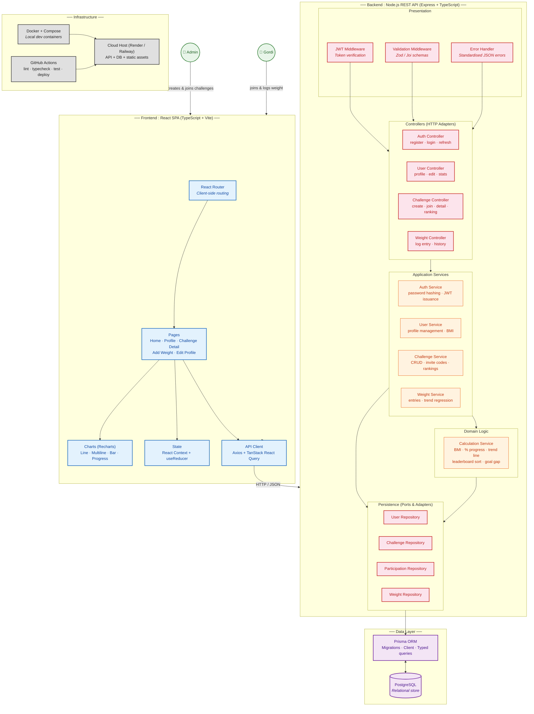
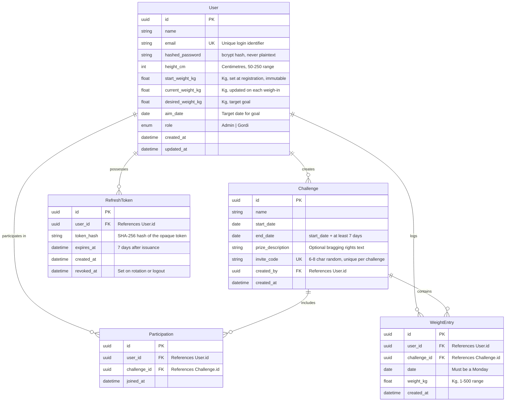

## 1. Diagram Format Justification

**C4 Model** — I combine Context (personas), Container (SPA, API, DB), and Component (controllers, services, repositories) into a single view. This is the right fit because the project is in a pre-code planning stage: one diagram must communicate the system boundary, technology stack, and internal layering to stakeholders and future developers without requiring multiple pages.

---

## 2. Architecture Diagram

The diagram is written to `docs/architecture-diagram.md`. Here it is rendered:

[//]: # "Gordi Challenge — C4-inspired Architecture Diagram"



---

## 3. Pattern Selection

**Chosen pattern: Clean Architecture (Ports & Adapters / Hexagonal-inspired Layered Architecture)**  

This pattern divides the backend into four concentric layers — **Controllers** (HTTP adapters), **Application Services** (orchestration), **Domain** (pure business logic), and **Repositories** (persistence ports) — with all dependencies pointing inward toward the domain. It fits because **Gordi Challenge has non-trivial domain rules** (BMI calculation, linear-regression trend prediction, invite-code generation, leaderboard sort, weekly-entry constraints) that must remain independent of frameworks, the HTTP protocol, and the database. The application is data-centric with clear CRUD surfaces, so a layered structure with a rich domain core prevents business logic from leaking into Express route handlers or Prisma queries. For a solo/small-team academic project, Clean Architecture provides just enough structure without the overhead of CQRS or event-driven patterns, and it maps directly to the project's future testability needs (domain logic can be unit-tested without mocks).

---

## 4. Benefits

- **Domain logic is framework-agnostic** — `CalculationService` computes BMI, trend lines, and rankings using pure functions with no Express or Prisma imports. It can be unit-tested in isolation and reused if a future API version (GraphQL, gRPC) replaces REST.
- **Invite-code and weekly-entry rules are enforced in one place** — The `ChallengeService` owns invite-code uniqueness and the `WeightService` enforces the one-entry-per-Monday constraint, not scattered across controllers or SQL triggers. Changing the invite-code format from 6-character alphanumeric to 8-character hex only touches one file.
- **HTTP layer is thin and swappable** — Controllers do nothing but parse requests, call a service, and format responses. If the project later needs a BFF for a mobile app, the existing services and repositories remain untouched.
- **Repository abstraction enables database-agnostic testing** — Repositories implement interfaces (ports) that can be swapped for in-memory stores during integration tests, avoiding the need for a real PostgreSQL instance in CI for most test runs.
- **Frontend separation of concerns** — TanStack React Query manages server-state caching and background refetching, while React Context handles UI state (active challenge filter, modals). Charts are isolated in a `Charts` module using Recharts, which simplifies replacing the charting library later if the wireframe requirements evolve.
- **TypeScript across the stack** — Shared types for API payloads (generated from Prisma schema) eliminate runtime mismatches between frontend DTO expectations and backend responses.

---

## 5. Trade-offs and Pain Points

- **Repository layer adds indirection for simple CRUD** — For basic "find user by ID" or "insert weight entry", the Repository interface adds a file and a boilerplate method that calls Prisma directly with nearly identical syntax. **Acceptable for MVP** — the indirection cost is low, and it pays off as soon as you add caching, audit logging, or switch databases. Could revisit by using Prisma's generated client directly if the team finds the abstraction burdensome.
- **Domain service separation can feel excessive at small scale** — `CalculationService` could be a static method on the `User` entity, but Clean Architecture pushes for stateless domain services to keep entities anemic (data-only). This is a stylistic trade-off; the current choice prioritises testability over pure DDD purity.
- **No event-driven communication** — Weight entries don't emit events, so updating the leaderboard is a synchronous call inside the controller. If the app grows (e.g., email notifications on new rankings), you would need to introduce an event bus or message queue. **Acceptable for v1** — synchronous updates are simpler and sufficient for the current scale.
- **React Context + useReducer over a state-management library** — This avoids the dependency weight of Redux or Zustand but may become unwieldy if the profile and challenge detail pages share deeply nested state. **Mitigation: keep UI state local to pages; React Query handles all server state.**
- **PostgreSQL + Prisma for a small dataset** — A lighter option (SQLite) would simplify local setup, but the PRD explicitly requires relational integrity (foreign keys, unique codes, GDPR compliance). Prisma's migration tooling and type generation offset the operational overhead.
- **No infrastructure-as-code for deployment** — Docker Compose covers local dev, but production provisioning is manual (Render/Railway dashboard). For a solo academic project this is pragmatic; a team project should adopt Terraform or Pulumi before the first production deployment.

---

## 6. Tech Stack

### Frontend

| Category | Choice | Rationale |
|----------|--------|-----------|
| **Framework** | React 18+ with TypeScript | Mature ecosystem, strong typing, broad hiring pool for a frontender. |
| **Build tool** | Vite | Fast HMR, native TypeScript/JSX, minimal config. |
| **Routing** | React Router v6 | Standard for React SPAs; nested layouts match the screen hierarchy (Home → Challenge Detail). |
| **Server state** | TanStack React Query v5 | Caching, background refetch, optimistic updates for weight entries — eliminates most boilerplate. |
| **UI state** | React Context + `useReducer` | Kept local per page; no global store needed at this scale. |
| **Charts** | Recharts | Composable React charting that covers all needed types (line, multiline, bar, area). Built on D3. |
| **Styling** | TailwindCSS v4 | Utility-first, colocated styles, responsive design without separate CSS files. |
| **Linting & formatting** | **Biomejs** | Replaces ESLint + Prettier in a single tool. Faster, fewer config files, native TypeScript support. |
| **Unit / integration tests** | Vitest + React Testing Library | Compatible with Vite's ecosystem; same runner can be shared with the backend. |
| **E2E tests** | **Playwright** | Reliable cross-browser automation, built-in test runner and assertions, parallel execution. Ideal for E2E coverage of the weigh-in and ranking flows. |

### Backend

| Category | Choice | Rationale |
|----------|--------|-----------|
| **Runtime** | Node.js 22 LTS with TypeScript | Full-stack TypeScript reduces context-switching. LTS ensures stability for production. |
| **HTTP framework** | Express | Minimal, well-understood, huge ecosystem. A frontender can pick it up quickly. (NestJS would add too much ceremony for this scope.) |
| **Validation** | Zod | Schema-based validation that generates TypeScript types automatically — used in controllers and reusable DTOs. |
| **ORM** | Prisma | Declarative schema → auto-generated TypeScript client and migrations. Maps 1:1 to the PRD's four entities. |
| **Auth** | `jsonwebtoken` + `bcrypt` | Stateless JWT tokens; password hashing meets the PRD's security requirement. |
| **Linting & formatting** | **Biomejs** | Same tool as frontend — single `biome.json` at the repo root. |
| **Tests** | Vitest | Same runner as frontend for consistency; Supertest for controller integration tests. |

### Database

| Category | Choice | Rationale |
|----------|--------|-----------|
| **Database** | PostgreSQL 16 | Relational integrity (FKs, unique invite codes), JSONB support if needed later, production-grade. |
| **Hosting** | Managed PostgreSQL (Render / Neon / Supabase) | Reduces operations overhead — automated backups, SSL, point-in-time recovery. |

### API Documentation

| Category | Choice | Rationale |
|----------|--------|-----------|
| **Spec format** | OpenAPI 3.1 (YAML) | Industry standard; describes every endpoint, request body, response schema, and error code. |
| **Doc platform** | **Mintlify** | Consumes OpenAPI specs and renders a searchable, developer-friendly reference. Supports markdown pages for guides (getting started, auth flow, challenge lifecycle). |
| **CI publish** | GitHub Action → Mintlify | Auto-deploys docs on merge to `main` so they're always in sync with the API. |

### Project Management & Methodology

| Category | Choice | Rationale |
|----------|--------|-----------|
| **Issue tracking** | **Linear** | Fast, keyboard-first, integrates with GitHub. Use it to track epics, stories, and bugs mapped to the PRD's screens and flows. |
| **Methodology** | **SDD (Specification-Driven Development)** with **Speckit** | Every feature starts as a structured spec (`.spec.md`) that defines acceptance criteria, scenarios (Given/When/Then), and edge cases. AI LLMs consume these specs to generate initial code and tests, then the developer refines. This fits a small team where a single person writes specs and a frontender implements. |
| **AI assistance** | LLMs (Claude / GPT-4) via Speckit and direct prompting | Specs are the source of truth — AI generates the first pass of implementation and tests, but all changes go through version control and manual review. |

### Infrastructure & DevOps

| Category | Choice | Rationale |
|----------|--------|-----------|
| **Containerisation** | Docker + Docker Compose | Two services: `api` (Node.js) and `db` (PostgreSQL). Eliminates "works on my machine" issues. |
| **CI/CD** | GitHub Actions | Lint (`biome check`), typecheck (`tsc --noEmit`), test (`vitest run`), build, and deploy on every PR and push to `main`. |
| **Production host** | **Render** (recommended) | Unified platform: deploy the Node.js API as a Web Service, PostgreSQL as a managed DB, and serve the Vite build as a Static Site or behind the same service. Free tier for staging, paid for production. Alternative: **Railway** for simpler config; **Fly.io** for global edge regions. |
| **E2E in CI** | Playwright on GitHub Actions | Runs against a preview deployment or a Docker Compose environment. Blocks merge on failure. |
| **Production considerations** | Environment variables via Render dashboard or `.env` (never committed). Secrets managed with GitHub Actions secrets + Render environment. Health check endpoint (`GET /health`). Rate limiting via `express-rate-limit`. CORS configured for the production frontend domain. |

### Recommended Project Structure

```
gordi-challenge/
├── spec/                    # SDD specs (Speckit .spec.md files)
├── docs/                    # Mintlify content + OpenAPI spec
├── frontend/                # React SPA (Vite + TypeScript)
│   ├── src/
│   │   ├── pages/           # One file per screen
│   │   ├── components/      # Shared UI (charts, tables, forms)
│   │   ├── api/             # React Query hooks + Axios client
│   │   ├── context/         # React Context providers
│   │   └── types/           # Shared TypeScript types
│   └── e2e/                 # Playwright tests
├── backend/                 # Express API (TypeScript)
│   ├── src/
│   │   ├── controllers/     # HTTP adapters
│   │   ├── services/        # Application services
│   │   ├── domain/          # Pure business logic
│   │   ├── repositories/    # Prisma-backed data access
│   │   ├── middleware/      # Auth, validation, error handling
│   │   └── routes/          # Route definitions
│   └── prisma/
│       ├── schema.prisma    # Data model
│       └── migrations/      # Auto-generated
├── docker-compose.yml       # api + db for local dev
├── biome.json               # Single lint/format config
├── vitest.workspace.ts      # Shared test config
└── .github/
    └── workflows/
        └── ci.yml           # Lint → typecheck → test → build → deploy
```

---

## 7. Security

### Overview

Gordi Challenge handles personal data (name, email, height) and health-adjacent data (weight, BMI), making it subject to GDPR and requiring a defence-in-depth posture. The security model is built around stateless JWT authentication, server-side validation as the sole enforcement point, and a minimal attack surface — no third-party OAuth, no file uploads, no user-generated content rendered as HTML. Every decision below is scoped to a small team shipping a v1 web app on a managed cloud platform.

### Authentication & Authorization

| Mechanism | Implementation |
|-----------|---------------|
| **Password storage** | `bcrypt` with cost factor 12. The hash, never the plaintext, touches the database. |
| **Token format** | Signed JWT (RS256 or HS256) with three claims: `sub` (user UUID), `role` (Admin/Gordi), `iat`. No personal data or weight data in the payload. |
| **Token expiry** | Access token: 15 minutes. Refresh token (opaque, stored hashed in DB): 7 days. Refresh tokens are rotated and old ones invalidated on use. |
| **Transport** | JWT sent as `Authorization: Bearer <token>` header only — never in URL parameters or cookies (avoids CSRF and leakage in server logs). |
| **RBAC** | Two roles: `Admin` (can create challenges) and `Gordi` (join-only). Enforced in the `AuthMiddleware` via the JWT `role` claim. Route declarations specify required roles — e.g., `router.post('/challenges', requireRole('Admin'), controller.create)`. |
| **Rate limiting on auth** | `express-rate-limit` on `/auth/login` and `/auth/register`: 5 attempts per IP per 15 minutes. Reduces brute-force risk. |

Design decision: no OAuth2 or passkeys in v1. The user base is small friend-groups, and the added complexity of federated auth is not justified at this stage. If the product scales, passkeys (WebAuthn) should be added as a passwordless option.

### Input Validation & Sanitisation

| Threat | Mitigation |
|--------|-----------|
| **Malformed payloads** | Every controller validates request bodies with **Zod** schemas before the data reaches a service. Schemas enforce types, ranges (e.g., `weight_kg` must be a positive float ≤ 500), string lengths, and email format. Invalid requests return a 400 with a structured error before any business logic runs. |
| **SQL injection** | **Prisma** generates parameterised queries for every `findMany`, `create`, `update` — raw SQL is never used. This eliminates SQL injection entirely at the ORM layer. |
| **XSS (reflected / stored)** | Challenge names, prize descriptions, and any user-supplied text are rendered as plain text in React — no `dangerouslySetInnerHTML`. React's JSX escaping handles the rest. On the API side, Zod rejects HTML tags in string fields via a `.refine()` check (optional — defence-in-depth, not strictly needed). |
| **Command injection** | Node.js `child_process` is not used anywhere in this application. No OS command is constructed from user input. |
| **Numeric ranges** | Weight (1–500 kg), height (50–250 cm), dates (not in the past before 1970, not beyond 10 years in the future). Enforced in Zod schemas and re-checked in domain services. |

### API Security

| Measure | What & How |
|---------|------------|
| **Auth on all endpoints** | Every route except `/auth/login`, `/auth/register`, and `GET /health` is protected by the `AuthMiddleware`. Missing or expired tokens return 401; invalid role returns 403. |
| **Rate limiting** | `express-rate-limit` applied globally: 100 requests per minute per IP. Auth endpoints have a stricter limit (see above). |
| **CORS** | Express `cors` middleware configured to allow only the production frontend origin (and `localhost` in dev). Wildcard origins are never used. |
| **Sensitive data in responses** | The `User` controller never returns `hashed_password`. Prisma's `select`/`omit` strips it at the query level. JWT payloads contain only `sub` and `role` — no email, name, or weight data. |
| **API versioning** | All routes are prefixed with `/v1/` (e.g., `/v1/challenges`). When breaking changes are needed, a `/v2/` tree is added alongside — no version in the URL means no guarantee of backward compatibility. |
| **Error responses** | The `ErrorMiddleware` returns standardised JSON: `{ "error": { "code": "VALIDATION_ERROR", "message": "...", "details": [...] } }`. Stack traces are never leaked to the client. In development, a `X-Debug-Info` header with the error ID is appended for debugging. |

### Data Protection

| Layer | Measure |
|-------|---------|
| **In transit** | TLS 1.3 enforced at the Render load balancer. All API and frontend traffic is HTTPS. HTTP requests are automatically redirected to HTTPS. |
| **At rest (database)** | Render's managed PostgreSQL provides encryption at rest using AES-256. No application-level encryption is applied to weight data — the database is accessed only by the API service within the same private network. If compliance requirements tighten, sensitive columns (`email`, `weight_kg`) can be encrypted with `pgcrypto` at the column level. |
| **Secrets** | Database URLs, JWT secrets, and bcrypt salts are stored in Render's environment variables (not in `.env` files committed to git). For local dev, a `.env.example` file documents required vars; the actual `.env` is in `.gitignore`. GitHub Actions secrets hold credentials for the staging deployment. |
| **PII minimisation** | The application stores only what is required by the PRD: email (unique identifier), name, height, weight entries. No IP addresses are logged persistently. No cookies are used for tracking. |
| **GDPR readiness** | A `DELETE /v1/account` endpoint allows users to request full data deletion (cascades to `WeightEntry`, `Participation`). The `User` model includes `created_at` and `updated_at` timestamps for audit. |

### Dependency & Supply Chain Security

| Measure | Tool / Process |
|---------|---------------|
| **Vulnerability scanning** | GitHub **Dependabot** enabled on the repository — scans `package.json` (frontend + backend) and ` Dockerfile` for known vulnerabilities. Creates PRs for patches. |
| **Lockfiles** | Both `package-lock.json` files are committed. Biome's `biome ci` command is configured to fail if any dependency audit flags a critical or high severity. |
| **Supply chain** | Dependencies with a history of supply-chain attacks (e.g., `faker`, `colors`) are explicitly avoided. Pin major versions (`^18.0.0`), review the diff of Dependabot PRs before merging, and audit occasionally with `npm audit`. |
| **Biome security linting** | Biome's `lint` ruleset includes security-related checks (no `eval`, no `innerHTML`, no dangerous function calls). These run in CI on every push. |

### Infrastructure & Deployment Security

| Aspect | Implementation |
|--------|---------------|
| **Container hardening** | The `api` Docker image uses `node:22-alpine` as a base (minimal surface area). The container runs as `USER node` (non-root). |
| **Network isolation** | On Render, the PostgreSQL database is exposed only to the API service via an internal network — no public database endpoint. In Docker Compose dev, the `db` container has no published ports (only accessed by `api` over the internal Docker network). |
| **Principle of least privilege** | The Render API service runs with a dedicated deploy-only user. Database credentials have read/write access only to the `gordi_challenge` database — no `CREATE ROLE` or `DROP DATABASE` privileges. |
| **Environment variables** | All secrets are injected at runtime via the platform (Render dashboard / GitHub Actions secrets). No secrets are baked into Docker images. |
| **Health endpoint** | `GET /v1/health` returns `{ "status": "ok", "timestamp": "..." }`. Unauthenticated, minimal — used by Render's uptime monitoring. |

### Security Headers

The Express server sets the following HTTP security headers on every response via the `helmet` middleware:

| Header | Value | Purpose |
|--------|-------|---------|
| `Strict-Transport-Security` | `max-age=63072000; includeSubDomains` | Enforces HTTPS for 2 years. |
| `X-Content-Type-Options` | `nosniff` | Prevents MIME type sniffing. |
| `X-Frame-Options` | `DENY` | Prevents clickjacking (no iframe embedding). |
| `Referrer-Policy` | `strict-origin-when-cross-origin` | Leaks minimal referrer info. |
| `Permissions-Policy` | `camera=(), microphone=(), geolocation=()` | Disables unused browser features. |
| `Content-Security-Policy` | `default-src 'self'; script-src 'self'; style-src 'self' 'unsafe-inline'; img-src 'self' data:; connect-src 'self' https://api.gordichallenge.com;` | Blocks inline scripts, restricts API calls to the backend origin, allows Tailwind-generated inline styles. The CSP is tightened further before production: `style-src 'self'` once Tailwind's JIT output is stable, and a nonce-based policy for any legitimate inline scripts. |

On the frontend, Vite sets `X-Content-Type-Options: nosniff` on the dev server and the production build serves all assets with strong `Cache-Control` headers. The SPA handles its own CSP via the `<meta>` tag as a fallback.

### Logging & Monitoring

| Concern | Approach |
|---------|----------|
| **Security events** | The following events are logged with a structured JSON format (via `pino`): failed login attempts, token refresh failures, 403 responses (authorisation denied), challenge creation, account deletion requests. Logs include timestamp, request ID (`X-Request-Id` header), and user UUID (when authenticated). No passwords or tokens are logged. |
| **Application logging** | All requests are logged with method, path, status code, and duration. `pino` is configured with `redact: ['req.headers.authorization', 'body.password']` to strip sensitive fields. |
| **Error tracking** | 500 errors are logged with full context. In production, a Sentry SDK (or equivalent) is added to capture unhandled exceptions — but this is **out of scope for v1** if the team is small and errors are caught by the Playwright E2E suite. |
| **Anomaly detection** | Not automated in v1. For a friend-group app, manual review of the rate-limit hit logs is sufficient. If the app grows, a simple webhook to Linear (create a bug when rate limits are exceeded by the same IP repeatedly) would be a lightweight addition. |

### OWASP Top 10 Coverage

The following OWASP Top 10 (2025 edition) risks are most relevant to Gordi Challenge, along with the specific mitigation applied:

| Risk | Relevance | Mitigation |
|------|-----------|------------|
| **A01: Broken Access Control** | High — two roles with different permissions | JWT `role` claim enforced in middleware; route-level `requireRole()` guards. |
| **A02: Cryptographic Failures** | Medium — password storage, token signing | `bcrypt` cost 12; JWTs signed with strong secret; TLS 1.3 in transit. |
| **A03: Injection** | Medium — SQL injection in queries | Prisma parameterised queries eliminate SQLi; Zod validates all input shapes. |
| **A04: Insecure Design** | Low — simple CRUD with one domain | Clean Architecture separates concerns; threat model is reviewed per feature spec. |
| **A05: Security Misconfiguration** | Medium — misconfigured CORS, debug endpoints | Helmet headers; CORS whitelist; no debug routes in production; Biome lint catches common misconfigs. |
| **A06: Vulnerable & Outdated Components** | Medium — npm dependencies | Dependabot + `npm audit` in CI; pin major versions; Biome audit checks. |
| **A07: Identification & Authentication Failures** | High — weak passwords, token theft | Rate limiting on login; short-lived access tokens; secure httpOnly refresh flow; bcrypt. |
| **A08: Software & Data Integrity Failures** | Low — no CI/CD pipeline without review | All PRs require review before merge; Dependabot PRs reviewed manually. |
| **A09: Security Logging & Monitoring Failures** | Medium — insufficient logging | Pino structured logging of auth events; request IDs for traceability. |
| **A10: Server-Side Request Forgery** | Low — no external fetch calls in v1 | No `fetch` or `axios` calls from the API to arbitrary URLs. If added later, SSRF would be mitigated via URL allowlisting. |

### Out of Current Scope

The following are deliberately excluded from the v1 security baseline. They should be revisited as the product gains users or handles more sensitive data:

- **Web Application Firewall (WAF)** — Not needed at this scale. Render's edge network provides basic DDoS protection.
- **Penetration testing** — Overkill for a v1 friend-group app. A security review should be scheduled before handling 1,000+ users.
- **Bug bounty program** — Not justified until the app reaches production with real users and a clear revenue model.
- **Formal GDPR Data Processing Agreement (DPA)** — Required if using a sub-processor (Render). Render offers a DPA on request — this should be signed before onboarding the first user outside the development team.
- **SOC2 / ISO 27001 compliance** — Out of scope for a Master's project. If the product is commercialised, these would require a dedicated compliance effort (6–12 months).
- **Secrets rotation policy** — Secrets are set manually in Render and GitHub. Automated rotation (e.g., HashiCorp Vault) is not needed until the team grows beyond two people.

---

## 8. Data Structure

### Overview

The data model follows a **relational schema** with five entities, reflecting the PRD's inherently structured domain: users belong to challenges, log weekly weights, and are ranked on computed aggregates. PostgreSQL enforces referential integrity, unique invite codes, and prevents duplicate weigh-ins — rules that are simpler to enforce declaratively at the schema level than in application code. Prisma maps this schema into a fully typed TypeScript client.

### Entity-Relationship Diagram



### Entity Descriptions

#### User

- **Purpose**: Represents a registered person. Every user is either an `Admin` (can create challenges) or a `Gordi` (join-only). Stores static registration data alongside a `current_weight_kg` field that is updated when a new weight entry is logged (denormalised for fast profile reads).
- **Key attributes**:
  - `email` — unique login identifier, also used for password-reset flows.
  - `hashed_password` — bcrypt hash; the raw password is never stored or logged.
  - `start_weight_kg` — set once at registration and never updated; the reference point for all "total lost" calculations.
  - `current_weight_kg` — the most recent logged weight across any challenge; updated by the `WeightService` after each weigh-in.
  - `height_cm` — combined with weight entries to compute BMI at any point in time.
  - `role` — enum: `Admin` or `Gordi`. Determines whether the user can create challenges.
- **Relationships**: A user can create many challenges (as Admin), participate in many challenges, log many weight entries, and possess multiple refresh tokens (active + rotated/invalidated tokens).

#### Challenge

- **Purpose**: A weight-loss competition with a fixed start and end date, created by an Admin. Each challenge generates a unique invite code so that Gordi users can join without a direct invitation system.
- **Key attributes**:
  - `start_date` / `end_date` — define the competition window; validated so duration is >= 7 days.
  - `invite_code` — a random 6–8 character string, unique across all challenges. Used as the sole join mechanism.
  - `prize_description` — optional free-text field describing what the winner gets (e.g., "dinner paid by the rest").
  - `created_by` — FK to the User who created the challenge. Only Admin users can populate this.
- **Relationships**: A challenge is created by exactly one User (Admin), includes many participants (via Participation), and contains many weight entries.

#### Participation

- **Purpose**: Join table linking users to challenges. A user's membership in a challenge is recorded here, and the `joined_at` timestamp is used to determine which weigh-ins count (entries before joining are excluded from ranking).
- **Key attributes**:
  - `user_id` + `challenge_id` — jointly unique (via a composite unique constraint). A user cannot join the same challenge twice.
- **Relationships**: Belongs to exactly one User and exactly one Challenge.

#### WeightEntry

- **Purpose**: A single weekly weigh-in logged by a user within a specific challenge. Each entry is tied to a Monday (calendar week) and is the atomic unit from which all progress charts, rankings, and trend predictions are derived.
- **Key attributes**:
  - `date` — the Monday this entry represents. The application restricts input to Monday dates only.
  - `weight_kg` — the user's weight for that week, validated to a plausible range (1–500 kg).
  - `user_id` + `challenge_id` + `date` — jointly unique (composite unique constraint). A user cannot log two entries for the same week in the same challenge.
- **Relationships**: Belongs to exactly one User and exactly one Challenge.

#### RefreshToken

- **Purpose**: Supports the stateless JWT authentication flow. Opaque refresh tokens are stored as a SHA-256 hash (never the raw token) so that even a database leak does not expose active sessions. Tokens are rotated on each refresh and can be revoked (e.g., on logout or password change).
- **Key attributes**:
  - `token_hash` — SHA-256 hash of the raw opaque token. Used to look up and validate refresh requests.
  - `expires_at` — hard expiry of 7 days from issuance. Expired tokens are pruned periodically.
  - `revoked_at` — set when a token is rotated (the old token is invalidated) or when the user logs out. `NULL` means the token is still active.
- **Relationships**: Belongs to exactly one User. A user may have multiple refresh tokens active simultaneously (e.g., logged in on multiple devices).

### Relationship Rules

- **A user can create zero or more challenges**, but only if their role is `Admin`. Non-admin users have `created_by` set to `NULL` implicitly via the application-layer role guard.
- **A user can join zero or more challenges**, but each (user, challenge) pair must be unique — a user cannot join the same challenge twice. Re-joining after leaving is handled by a new `Participation` row with an updated `joined_at`.
- **A user can log zero or more weight entries in a challenge**, but at most one per Monday (enforced by a composite unique constraint on `user_id` + `challenge_id` + `date`). Only Mondays are accepted.
- **A challenge must have at least one participant** (the creating Admin is automatically added as a participant on creation). There is no upper limit in v1.
- **A weight entry always belongs to a challenge**, even if the user is part of multiple challenges. The same Monday weight cannot be reused across challenges — the user must log separately for each.
- **Refresh tokens cascade on user deletion**: if a user deletes their account (`DELETE /v1/account`), all associated `RefreshToken`, `Participation`, and `WeightEntry` rows are removed. The `Challenge` itself is preserved so other participants' data is not orphaned.